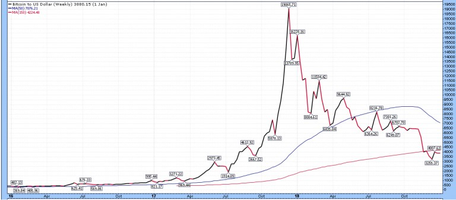
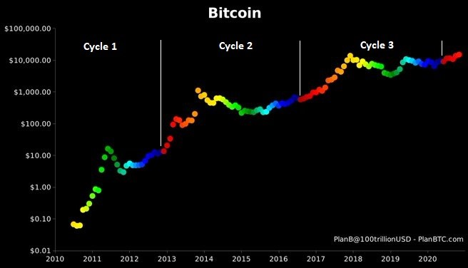
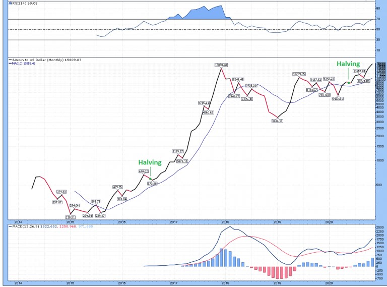
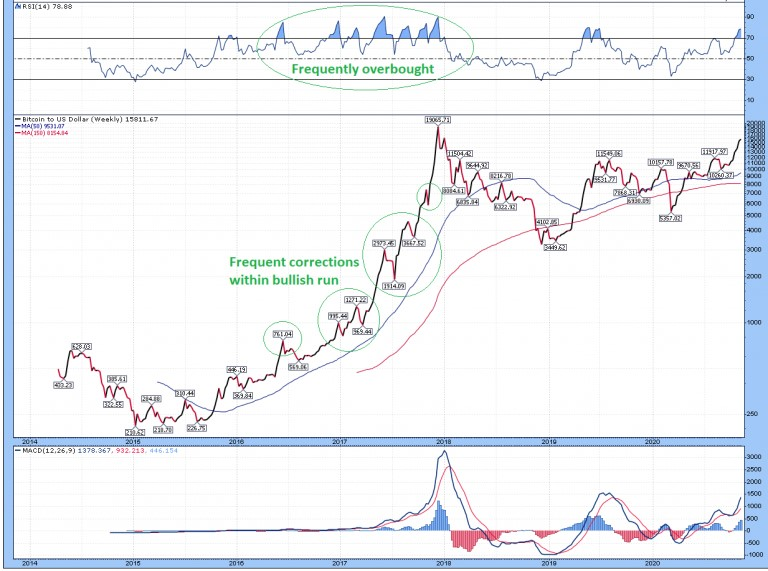
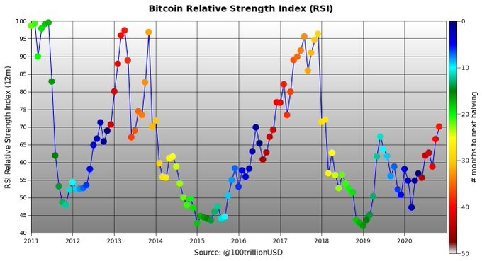
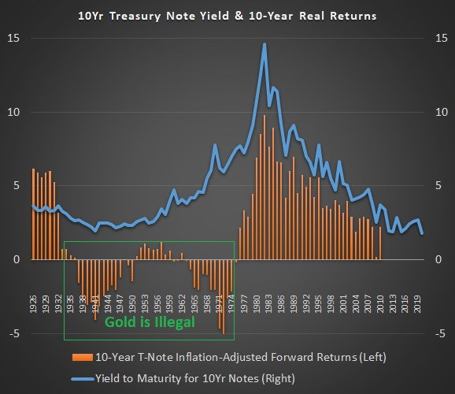

Inicialmente cubrí Bitcoin en un artículo en otoño de 2017, y fui de neutral a levemente bajista durante el plazo intermedio, y no tomé posición.

La tecnología estaba bien concebida, pero me preocupaba el sentimiento eufórico y la dilución del mercado. No dije que tuviera que bajar más, ni lo vi con optimismo, y simplemente me hice a un lado para seguir mirando.

Sin embargo, me volví optimista con Bitcoin en abril de 2020 en mi servicio de investigación a aproximadamente $6.900 / BTC y fui a una posición larga. De hecho, había tenido un rendimiento inferior a muchas otras clases de activos desde el otoño de 2017 hasta la primavera de 2020, pero a partir de ese momento, varios factores se volvieron fuertemente a su favor. Luego escribí un [artículo público](https://www.lynalden.com/invest-in-bitcoin/) al respecto en julio cuando estaba a $9.200 / BTC, explicando por qué soy optimista con Bitcoin.

Ese artículo de julio recibió mucha prensa, y el CEO de MicroStrategy (MSTR), la primera empresa importante que cotiza en las más grandes bolsas de valores que puso parte de su posición de efectivo en Bitcoin, declaró que envió ese artículo entre otros recursos clave a su junta directiva como parte del proceso de educación de su equipo. Está escrito pensando en los lectores institucionales, en otras palabras, además de los inversores minoristas.

Con un precio de más de $15.000 / BTC hoy, Bitcoin ha subido más del 120% del precio inicial en mi punto de pivote de abril, y ha subido más del 60% desde julio, pero sigo siendo optimista hasta el 2021. A partir de ahí, yo esperaría un período de corrección y consolidación, y volveré a evaluar sus perspectivas de futuro a partir de ese momento.

Naturalmente, he recibido muchos correos electrónicos sobre Bitcoin durante este verano y otoño. He respondido a varios de ellos por correo electrónico, pero pensé que resumiría los más populares en un artículo rápido sobre el tema. Estos son conceptos erróneos, riesgos o preguntas comunes. Todo lo cual tiene sentido preguntar, así que hago mi mejor esfuerzo aquí para abordarlos como yo lo veo.

Si no lo ha leído, le recomiendo [leer primero mi artículo](https://www.lynalden.com/invest-in-bitcoin/) sobre Bitcoin de julio.

### 1) “Bitcoin es una burbuja”

Mucha gente ve a Bitcoin como una burbuja, lo cual es comprensible. Especialmente para las personas que estaban mirando el gráfico lineal en 2018 o 2019, Bitcoin parecía que alcanzó un pico tonto a fines de 2017 después de un aumento parabólico que nunca volvería a tocarse.

Este gráfico de precios lineal va desde principios de 2016 hasta principios de 2019 y muestra cómo se veía como una burbuja clásica:

*Gráfico: StockCharts.com*

Quizás sea una burbuja. Ya veremos. Sin embargo, parece mucho más racional cuando observa el gráfico logarítmico a largo plazo, especialmente en lo que se refiere al ciclo de reducción a la mitad de 4 años de Bitcoin.

*Fuente del gráfico: PlanB @ 100trillionUSD, con anotaciones agregadas por Lyn Alden*

Cada punto en este gráfico representa el precio mensual de bitcoin, y el color se basa en cuántos meses han pasado desde el halving anterior. Un halving se refiere a un punto pre-programado en la cadena de bloques (cada 210,000 bloques) en el que la tasa de suministro de nuevos bitcoin generados cada 10 minutos se reduce a la mitad, y ocurrieron en los momentos en que los puntos azules se convierten en puntos rojos.

El primer ciclo (el ciclo de lanzamiento) tuvo una ganancia masiva en términos porcentuales de cero a más de $20 por bitcoin en su punto máximo. El segundo ciclo, desde el precio máximo en el ciclo 1 hasta el precio máximo en el ciclo 2, tuvo un aumento de más de 50 veces, donde Bitcoin alcanzó por primera vez más de $1.000. El tercer ciclo de pico a pico tuvo un aumento de aproximadamente 20 veces, donde Bitcoin tocó brevemente alrededor de $20,000.

Desde mayo de 2020, hemos estado en el cuarto ciclo y veremos qué sucede durante el próximo año. Esta es históricamente una fase muy alcista para Bitcoin, ya que la demanda sigue siendo fuerte pero la nueva oferta es muy limitada, con una gran parte de la oferta existente en buenas manos.

El gráfico mensual parece sólido, con un MACD positivo y un precio actual más alto que cualquier cierre mensual de la historia. Solo en un periodo intramensual, en diciembre de 2017, ha sido más alto de lo que es ahora:

*Fuente del gráfico: StockCharts.com*

El gráfico semanal muestra cuántas veces se sobrecompró a corto plazo y cuántas correcciones tuvo, en su anterior racha alcista posterior al halving, donde subió 20x:

*Fuente del gráfico: StockCharts.com*

Mi trabajo aquí es simplemente encontrar activos que probablemente funcionen bien durante un largo período de tiempo. Para muchas de las preguntas y/o conceptos erróneos discutidos en este artículo, hay especialistas en activos digitales que pueden responderlos con más detalles que yo. Sin embargo, una desventaja de los especialistas es que muchos de ellos (no todos) tienden a ser *perma-bulls* en su clase de activos elegida.

Esto es cierto para muchos inversionistas especializados en oro, inversionistas especializados en acciones, inversionistas especializados en Bitcoin, etc. ¿Cuántos boletines de correo sobre oro sugirieron que es posible que desee obtener ganancias en oro en torno a su pico más alto de los últimos años en 2011? ¿Cuántas personalidades de Bitcoin sugirieron que Bitcoin probablemente fue sobrecomprado a fines de 2017 y por lo tanto se esperaba una corrección de varios años?

He tenido el placer de conversar con algunos de los especialistas en Bitcoin más conocidos del mundo; los que mantienen sus perspectivas mesuradas y basadas en hechos, con riesgos claramente indicados, en lugar de ser promotores constantes de su industria a cualquier costo. El poder de Bitcoin proviene en parte de lo entusiastas que están sus partidarios, pero también hay espacio para un análisis independiente sobre el potencial alcista y el análisis de riesgos.

Y como alguien que no pertenece a la industria de los activos digitales, pero que tiene una experiencia que combina ingeniería y finanzas que se prestan razonablemente bien para analizarlo, me acerco a Bitcoin como a cualquier otra clase de activos; con un reconocimiento de riesgos, recompensas, ciclos alcistas y ciclos bajistas. Sigo siendo optimista aquí.

Si este cuarto ciclo se desarrolla en algún lugar remotamente cercano a los últimos tres ciclos desde el inicio (lo cual no está garantizado), el índice de fuerza relativa de Bitcoin podría volverse bastante extremo nuevamente en 2021. Aquí hay un gráfico de PlanB sobre el RSI mensual histórico de Bitcoin durante la tendencia alcista y fases bajistas de halving a la mitad de 4 años:

*Fuente del gráfico: PlanB @ 100trillionUSD*

Por esa razón, el hecho de que Bitcoin pase de $6.900 a $15.000 o más en siete meses no me lleva a obtener ganancias todavía. En otras palabras, un RSI mensual de 70 no lo corta como “sobrecomprado” en términos de Bitcoin, particularmente tan pronto después de un evento de halving. Sin embargo, es probable que busque un reequilibrio más adelante en 2021.

Cada inversor tiene su propia tolerancia al riesgo, convicción, conocimiento y objetivos financieros. Una forma clave de gestionar la volatilidad de Bitcoin es gestionar el tamaño de su posición, en lugar de intentar negociar con ella con demasiada frecuencia. Si la volatilidad de los precios de Bitcoin lo mantiene despierto por la noche, su posición probablemente sea demasiado grande. Si tiene una posición de tamaño adecuado, es el tipo de activo que debe dejar correr por un tiempo, en lugar de tomar ganancias tan pronto como sea un poco popular y tenga un buen desempeño.

Cuando se encuentra en un sentimiento \*extremo\*, y/o su posición ha crecido hasta ser una parte desproporcionadamente grande de su portafolio, es probable que sea el momento de considerar el reequilibrio.

### 2) “El valor intrínseco de Bitcoin es cero”

Abordé este tema en gran medida en mi artículo de otoño de 2017 y nuevamente en mi artículo de verano de 2020.

Para empezar, los activos digitales ciertamente pueden tener valor. En términos simplistas, imagina un hipotético juego multijugador masivo en línea jugado por millones de personas en todo el mundo. Si el desarrollador introdujo un elemento de espada mágica que era el arma más fuerte del juego, y solo se lanzaron una docena de ellos, y las cuentas que de alguna manera obtuvieron una podrían venderlas a otra cuenta, puedes apostar a que el precio por esa espada digital sería indignante.

La utilidad de Bitcoin es que permite a las personas almacenar valor fuera de cualquier sistema monetario en algo con unidades demostrablemente escasas y transportar ese valor por todo el mundo. Su fundador, Satoshi Nakamoto, resolvió el problema del doble gasto y elaboró ​​un protocolo bien diseñado que tiene escasas unidades que se pueden comerciar de forma descentralizada y sin estado.

En términos de utilidad, intente llevar $250.000 en oro a través de un aeropuerto internacional en lugar de llevar $250.000 en bitcoins con usted, a través de un pequeño monedero digital, o mediante una aplicación en su teléfono, o incluso simplemente recordando una frase de contraseña de 12 palabras. Además, Bitcoin es más fácilmente verificable que el oro, en términos de ser un activo de reserva y utilizarse como garantía. Es más fácil de transferir que el oro y tiene un suministro limitado. Y también me gusta el oro; ha pasado mucho tiempo desde 2018, y todavía lo soy.

Bitcoin es un producto digital, como lo imaginó Satoshi:

Como experimento mental, imagina que hubiera un metal base tan escaso como el oro pero con las siguientes propiedades:

-   aburrido de color gris
-   no es un buen conductor de electricidad
-   no particularmente fuerte, pero tampoco dúctil o fácilmente maleable
-   no es útil para ningún propósito práctico u ornamental

y una propiedad mágica y especial:

-   se puede transportar a través de un canal de comunicaciones

> **Si de alguna manera adquiriera algún valor por cualquier razón, entonces cualquiera que quisiera transferir riqueza a larga distancia podría comprar algo, transmitirlo y hacer que el receptor lo venda.** -Satoshi Nakamoto, agosto de 2010

En comparación con todas las demás criptomonedas, Bitcoin tiene, con mucho, el efecto de red más fuerte en un orden de magnitud y, por lo tanto, es la más segura en términos de descentralización y la cantidad de potencia informática y gastos que se requieren para intentar atacar la red. Hay miles de criptomonedas, pero ninguna de ellas ha podido rivalizar con Bitcoin en términos de capitalización de mercado, descentralización, ubicuidad, política monetaria firme y seguridad de red combinadas.

Algunos otros tokens presentan avances de privacidad novedosos o contratos inteligentes que pueden permitir todo tipo de interrupciones tecnológicas en otras industrias, pero ninguno de ellos es un desafío importante para Bitcoin en términos de ser una reserva de valor emergente. Algunos de ellos pueden funcionar bien junto con Bitcoin, pero no en lugar de Bitcoin.

Bitcoin es el mejor en lo que hace. Y en un mundo de márgenes negativos reales dentro de los mercados desarrollados y una serie de fallos cambiarios en los mercados emergentes, lo que hace tiene utilidad. La pregunta importante, por tanto, es cuánta utilidad.

El precio de esa utilidad se piensa mejor en términos de todo el protocolo, que se divide en 21 millones de bitcoin (cada uno de los cuales es divisible en 100 millones de sats), y combina el activo en sí con los medios para transmitirlo y verificarlo. El valor del protocolo crece a medida que más personas e instituciones lo utilizan para almacenar, transmitir y verificar el valor, y puede reducirse si menos personas lo utilizan.

Se estima que la capitalización de mercado total del oro es de más de $10 billones. ¿Bitcoin podría alcanzar el 10% de eso? ¿25%? ¿La mitad? ¿Igualarlo? No sé.

Me estoy enfocando en un halving de Bitcoin a la vez. Una perspectiva de cuatro años es suficiente para mí, y calibraré mi análisis con lo que está sucediendo a medida que avancemos.

### 3) “Bitcoin no es escalable”

Una crítica común a Bitcoin es que la cantidad de transacciones que la red puede manejar cada 10 minutos es muy baja en comparación con, digamos, los centros de datos de Visa (V). Esto limita la capacidad de Bitcoin para ser utilizado para transacciones diarias, como comprar café.

De hecho, esto jugó un papel clave en la bifurcación dura de 2017 entre Bitcoin y Bitcoin Cash. Los defensores de Bitcoin Cash querían aumentar el tamaño del bloque, lo que permitiría a la red procesar más transacciones por unidad de tiempo.

Sin embargo, con cualquier protocolo de pago, existe una compensación entre seguridad, descentralización y velocidad. Qué variables maximizar es una elección de diseño; actualmente es imposible maximizar las tres.

Visa, por ejemplo, maximiza la velocidad para manejar innumerables transacciones por minuto y tiene una seguridad moderada dependiendo de cómo se mida. Para ello, renuncia por completo a la descentralización; es un sistema de pago centralizado, administrado por Visa. Y, por supuesto, se basa en la moneda subyacente, que en sí misma es una moneda fiduciaria del gobierno centralizado.

Bitcoin, por otro lado, maximiza la seguridad y la descentralización, a costa de la velocidad. Al mantener el tamaño del bloque pequeño, es posible que personas de todo el mundo ejecuten sus propios nodos completos, que se pueden usar para verificar toda la cadena de bloques. La distribución generalizada de nodos (más de 10.000 nodos) ayuda a garantizar la descentralización y la verificación continua de la cadena de bloques.

Bitcoin Cash aumenta potencialmente el rendimiento de las transacciones con tamaños de bloque más grandes, pero a costa de una menor seguridad y menos descentralización. Además, todavía no se acerca a Visa en términos de rendimiento de transacciones, por lo que en realidad no maximiza ninguna variable.

Básicamente, la disputa entre Bitcoin y Bitcoin Cash es si Bitcoin debería ser tanto una capa de liquidación como una capa de transacción (y por lo tanto no ser perfecto en ninguno de esos roles), o si debería maximizarse como una capa de liquidación y permitir otras redes. para construir sobre él para optimizar la velocidad y el rendimiento de las transacciones.

La forma de pensar sobre Bitcoin es que es una capa de liquidación ideal. Combina una moneda y/o mercancía escasa con funciones de transmisión y verificación, y tiene una gran cantidad de seguridad que lo respalda por su alta tasa de hash global. De hecho, eso es lo que hace que Bitcoin contra Visa sea una comparación inapropiada; Visa es solo una capa sobre capas de liquidación más profundas, con bancos comerciales y otros sistemas involucrados bajo la superficie, mientras que Bitcoin es fundamental.

El sistema bancario global tiene una escala extremadamente mala cuando se baja a la base. Las transferencias bancarias, por ejemplo, generalmente demoran días en liquidarse. No paga por las cosas cotidianas con transferencias bancarias por ese motivo; son principalmente para transacciones grandes o importantes.

Sin embargo, el sistema bancario crea capas adicionales de escalabilidad en esos tipos de capas de liquidación, por lo que tenemos cosas como cheques en papel, cheques electrónicos, tarjetas de crédito, PayPal, etc. Los consumidores pueden utilizar estos sistemas para realizar una gran cantidad de transacciones más pequeñas, y los bancos subyacentes se liquidan entre sí con transacciones más fundamentales y más grandes con menor frecuencia. Cada forma de pago es un compromiso entre velocidad y seguridad; los bancos y las instituciones se establecen entre sí con las capas más seguras, mientras que los consumidores utilizan las capas más rápidas para el comercio diario.

De manera similar, existen protocolos como Lightning Network y otros conceptos de contratos inteligentes que se construyen sobre Bitcoin, lo que aumenta la escalabilidad de Bitcoin. Lightning puede realizar toneladas de transacciones rápidas entre contrapartes y reconciliarlas con la cadena de bloques de Bitcoin en una transacción por lotes. Esto reduce las tarifas y las limitaciones de ancho de banda por pequeña transacción.

No sé, revisando los años transcurridos, qué sistemas de escalabilidad habrán ganado. Todavía se está haciendo mucho desarrollo. La clave a tener en cuenta es que, aunque Bitcoin está limitado en términos de cuántas transacciones puede realizar por unidad de tiempo, no está limitado por el valor total de esas transacciones. La cantidad de valor que Bitcoin puede liquidar por unidad de tiempo es ilimitada, dependiendo de su capitalización de mercado y capas adicionales.

En otras palabras, suponga que la red de Bitcoin está limitada a 250 transacciones por minuto, lo cual es bajo. Esas transacciones podrían promediar $100 o $1 millón, o cualquier número. Si tienen un promedio de $100 cada uno, significa que solo se realizan $25.000 en valor de transacción por minuto. Si promedian $1 millón cada uno, significa que se realizan $250 millones en valor de transacción por minuto. Si Bitcoin crece en uso como reserva de valor, las tarifas de transacción y las limitaciones inherentes dan prioridad a las transacciones más grandes e importantes: las transacciones de liquidación más importantes.

Las capas adicionales creadas sobre Bitcoin pueden realizar una cantidad arbitraria de transacciones por minuto y liquidarlas con lotes en la cadena de bloques de Bitcoin. Esto es similar a cómo las capas de consumidores como Visa o PayPal pueden procesar una cantidad arbitraria de transacciones por minuto, mientras que los bancos detrás de escena se conforman con transacciones más grandes con menos frecuencia.

El mercado ya ha hablado de qué tecnología cree que es mejor, entre Bitcoin y otras como Bitcoin Cash. Desde la bifurcación dura de 2017, la capitalización de mercado de Bitcoin, la tasa de hash y el número de nodos han superado en gran medida a Bitcoin Cash. Ver este juego en 2017 fue una de mis evaluaciones de riesgo iniciales para el protocolo, pero tres años después, esa preocupación ya no existe.

### 4) “Bitcoin desperdicia energía”

Actualmente, la red Bitcoin utiliza tanta energía como un país pequeño. Esto, naturalmente, plantea preocupaciones ambientales, especialmente a medida que crece.

Del mismo modo, la minería de oro utiliza una tonelada de energía. Por cada moneda de oro, se invirtió una tonelada de dinero, energía y tiempo en la exploración de depósitos, el desarrollo de una mina y luego el procesamiento de innumerables toneladas de roca con equipo pesado para obtener unos pocos gramos de oro por tonelada. Luego, tiene que ser purificado y acuñado en barras y monedas, y transportado.

Se necesitan varias toneladas de roca procesada para obtener cada moneda de oro de 1 onza y miles de toneladas de roca procesada por cada buena barra de oro de entrega. La cantidad de energía que entra en una pequeña unidad de oro es inmensa.

De hecho, esa energía es lo que le da valor al oro y lo que lo hizo reconocido internacionalmente como dinero durante miles de años. El oro es básicamente energía concentrada, trabajo concentrado, como un denso depósito de valor que no se erosiona con el tiempo.

Sin embargo, no hay límite para la cantidad de dólares, euros o yenes que podemos imprimir. Los bancos los multiplican todo el tiempo con un golpe de teclado. Asimismo, los metales industriales como el hierro también son muy comunes; no tenemos escasez de ellos. El oro, sin embargo, es muy raro y, cuando se encuentra, se necesita una tonelada de energía y tiempo para adquirir su forma pura. Y luego tenemos que gastar más energía transportándolo, asegurándolo y verificándolo de vez en cuando.

Sin embargo, el mundo lo hace de todos modos, porque obtiene valor de él en comparación con el valor que tuvo que poner para obtenerlo. La extracción y refinación de oro requiere energía, pero a su vez, los bancos centrales, las instituciones, los inversionistas y los consumidores obtienen una reserva escasa de valor, joyas o aplicaciones industriales del metal raro.

De manera similar, Bitcoin requiere mucha energía, pero eso se debe a que tiene tanta potencia informática que asegura constantemente su protocolo, en comparación con otras innumerables criptomonedas que son fáciles de atacar o están insuficientemente descentralizadas.

Visa usa mucha menos energía que Bitcoin, pero requiere una centralización completa y está construida sobre una abundante moneda fiduciaria. Litecoin también usa mucha menos energía que Bitcoin, pero es más fácil de atacar para un grupo bien capitalizado.

La pregunta entonces es si esa energía asociada con Bitcoin se aprovecha. ¿Bitcoin justifica su uso de energía? ¿Agrega suficiente valor?

Hasta ahora, el mercado dice que sí y estoy de acuerdo. Un sistema monetario digital descentralizado, separado de cualquier entidad soberana, con una política monetaria basada en reglas y una escasez inherente, brinda a las personas de todo el mundo una opción, que algunos de ellos usan para almacenar valor y/o usar para transmitir ese valor a otros.

Aquellos entre nosotros en los mercados desarrollados que no hemos experimentado una inflación rápida durante décadas puede que no veamos la necesidad de hacerlo, pero innumerables personas en los mercados emergentes han experimentado muchos casos de inflación severa a lo largo de su vida y tienden a entender el concepto más rápidamente.

Además, una parte significativa de la energía que utiliza Bitcoin podría desperdiciarse de otra manera. Los mineros de Bitcoin buscan las fuentes de electricidad más baratas del mundo, lo que generalmente significa energía que se desarrolló por una razón u otra, pero que actualmente no tiene una demanda suficiente y, por lo tanto, se desperdiciaría.

Ejemplos de esto incluyen represas hidroeléctricas sobre-construidas en ciertas regiones de China o pozos de petróleo y gas varados en América del Norte. El equipo de minería de Bitcoin es móvil y, por lo tanto, puede colocarse cerca de donde esté la fuente de energía más barata, para arbitrarla y darle un propósito a esa producción de energía varada.

La minería de Bitcoin convierte la producción de esas fuentes de energía varadas y baratas en algo que actualmente tiene valor monetario.

### 5) “Bitcoin es demasiado volátil”

Bitcoin se promociona como una reserva de valor y un medio de intercambio, pero tiene un historial de precios muy volátil. Esto lleva, de nuevo de forma algo comprensible, a los inversionistas a decir que no es un buen depósito de valor o un medio de intercambio y, por lo tanto, falla en lo único para lo que está diseñado.

Y tienen razón. Bitcoin no es el activo en el que invierte dinero para un fondo de emergencia o para el pago inicial de una casa que está ahorrando durante 6 meses a partir de ahora. Cuando definitivamente necesita una cierta cantidad de moneda en un horizonte temporal a corto plazo, Bitcoin no es el activo de elección.

Esto se debe a que es una reserva de valor emergente, que tiene aproximadamente 12 años ahora, y por lo tanto conlleva un grado significativo de crecimiento y especulación. Su capitalización de mercado está creciendo con el tiempo, tomando parte de la participación de mercado de otras tiendas de valor y creciendo hasta convertirse en una clase de activos significativa. Veremos si continúa así o si se estabiliza en algún lugar y comienza a estancarse.

Para que la capitalización de mercado de Bitcoin crezca de $25 millones a $250 millones, a $2.5 mil millones, y después a $25 mil millones hasta el valor actual de más de $250 mil millones, se requiere volatilidad, especialmente volatilidad al alza (que, por supuesto, viene con la volatilidad negativa asociada).

A medida que crece, su volatilidad se reduce con el tiempo. Si Bitcoin se convierte en una clase de activos de $2,5 billones algún día, con una participación más generalizada, su volatilidad probablemente sea menor de lo que es ahora.

Por lo tanto, tener una exposición distinta de cero a Bitcoin es básicamente una apuesta a que el efecto de red y el caso de uso de Bitcoin continuarán creciendo hasta que alcance un equilibrio en el que tenga una menor volatilidad y sea más estable. Por ahora, tiene mucha volatilidad y necesita esa volatilidad si quiere seguir creciendo. La base tecnológica de Bitcoin como depósito de valor descentralizado está bien diseñada y mantenida; tiene todas las partes que necesita. Solo necesita convertirse en lo que puede ser, y veremos si lo hace.

Es como si alguien identifica un nuevo elemento y la gente comienza a descubrir usos para ese elemento, y experimenta un período de rápido crecimiento y alta volatilidad de precios, hasta que ha existido durante el tiempo suficiente para que finalmente se establezca en una banda de volatilidad normal.

Si bien Bitcoin sigue siendo tan volátil como es, los inversionistas pueden mitigar el riesgo al tener un tamaño de posición adecuado.

### 6) “Los gobiernos prohibirán Bitcoin”

Otra preocupación legítima que tiene la gente es que incluso si Bitcoin tiene éxito, eso hará que los gobiernos lo prohíban. Algunos gobiernos ya lo han hecho. Por lo tanto, esto cae más en la categoría de “riesgo” que en un “concepto erróneo”.

Hay un precedente para esto. Estados Unidos prohibió que los estadounidenses poseyeran oro de 1933 a 1975, excepto en pequeñas cantidades para joyería y artículos de colección. En la tierra de los libres, había un metal amarillo benigno que nos podían enviar a prisión por poseer monedas y lingotes, simplemente porque era visto como una amenaza para el sistema monetario.

Este gráfico muestra la tasa de interés de los rendimientos de los bonos de la Reserva del Tesoro de los Estados Unidos a 10 años en azul. Las barras naranjas representan la tasa de rendimiento anualizada ajustada a la inflación que obtendría el Tesoro por comprar a 10 años ese año y mantenerlo hasta el vencimiento durante los próximos 10 años. El cuadrado verde muestra el período de tiempo en el que poseer oro era ilegal.

*Fuentes de datos: Robert Shiller, Aswath Damodaran*

Hubo un período de cuatro décadas desde la década de 1930 hasta la de 1970 en el que mantener dinero en el banco o en bonos soberanos no se mantuvo al día con la inflación, es decir, las barras naranjas fueron netamente negativas. El poder adquisitivo de los ahorradores disminuyó si tenían estos activos de papel.

Esto se debió a dos décadas inflacionarias: una en la década de 1940 y otra en la de 1970. Hubo algunos períodos intermedios, como la década de 1950, en los que el efectivo y los bonos funcionaron bien, pero durante todo este período de cuatro décadas, fueron una pérdida neta en términos ajustados a la inflación.

Por lo tanto, no es demasiado sorprendente que una de las válvulas de liberación para inversionistas haya sido prohibida durante ese período específico. Al oro le fue muy bien durante ese tiempo y mantuvo su poder adquisitivo frente a la degradación de la moneda. El gobierno consideró que era una cuestión de seguridad nacional “evitar el acaparamiento” y básicamente obligar a la gente a comprar activos de papel que perdieron valor, o activos más económicos como acciones y bienes raíces.

Esto sucedió cuando el dólar estaba respaldado por oro, por lo que el gobierno de los Estados Unidos quería poseer la mayor parte del oro y limitar la capacidad de los ciudadanos para adquirir oro. Hoy en día no existe tal respaldo para el oro o Bitcoin y, por lo tanto, hay menos incentivos para intentar prohibirlo.

Y la prohibición del oro fue difícil de hacer cumplir. Hubo muy pocos enjuiciamientos por la propiedad del oro, a pesar de que las sanciones en el papel fueron severas.

Bitcoin utiliza encriptación y, por lo tanto, no se puede confiscar más que a través de una demanda legal. Sin embargo, los gobiernos pueden prohibir los intercambios y hacer que sea ilegal poseer Bitcoin, lo que expulsaría el dinero institucional y colocaría Bitcoin en el mercado negro.

Aquí está el problema. Bitcoin tiene más de $250 mil millones en capitalización de mercado. Dos empresas que cotizan en bolsa en las principales bolsas, MicroStrategy (MSTR) y Square (SQ) ya lo poseen, al igual que una variedad de empresas públicas en otras bolsas y mercados OTC, además de empresas privadas y fondos de inversión. Grandes inversores como Cathie Woods, Paul Tudor Jones y Stanley Druckenmiller lo poseen, al igual que al menos un senador electo de Estados Unidos. Fidelity y una variedad de grandes empresas están involucradas en servicios de custodia de grado institucional para él. PayPal (PYPL) se está involucrando. Los bancos estadounidenses regulados por el gobierno federal ahora pueden custodiar oficialmente los criptoactivos. El IRS lo trata como una mercancía a efectos fiscales. Eso es mucho impulso de la corriente principal.

Sería extremadamente difícil para los principales mercados de capitales como Estados Unidos, Europa o Japón prohibirlo en este momento. Si, en los próximos años, la capitalización de mercado de Bitcoin alcanza más de $1 billón, con más y más instituciones expuestas a él, se vuelve cada vez más difícil de prohibir.

Bitcoin ya era un activo inusual que se convirtió en la corriente semi-convencional de abajo hacia arriba, a través de la adopción minorista. Una vez que la clase de donantes políticos también se adueña de ella, lo que cada vez es más frecuente, el juego básicamente ha terminado para prohibirla. Intentar prohibirlo sería un ataque a los balances de las corporaciones, fondos, bancos e inversores que lo poseen, y no sería popular entre los millones de votantes que lo poseen.

Creo que la hostilidad regulatoria sigue siendo un riesgo a tener en cuenta mientras la capitalización de mercado sea inferior a 1 billón de dólares. Y el riesgo se puede administrar con un tamaño de posición adecuado para su situación financiera y sus metas específicas.

### 7) “Dónde comprar bitcoin”

La pregunta más frecuente que recibo sobre Bitcoin es simplemente dónde comprar bitcoins. Algunas personas no saben cómo empezar y otras están familiarizadas con los lugares populares para comprar, pero no saben cuáles son ideales.

No hay una sola respuesta; depende de tus objetivos con él y de dónde vives en el mundo.

La primera pregunta que debe hacerse es si es un comerciante o un ahorrador. ¿Quieres establecer una posición de bitcoin a largo plazo o comprar alguna con un plan para venderla en unos meses? ¿O quizás algunos de ambos?

La segunda pregunta que debe hacerse es si desea custodiarlo por sí mismo con llaves privadas y un monedero de hardware o una solución de firma múltiple, que tiene una curva de aprendizaje inicial pero en última instancia es más seguro, o si desea que otra persona lo custodie por usted, que es más simple pero implica riesgo de contraparte.

Se puede acceder a Bitcoin a través de algunos fondos que cotizan en bolsa, como el Grayscale Bitcoin Trust (GBTC), del cual tengo una posición larga. Sin embargo, fondos como estos cotizan con una prima frente al NAV y dependen de las contrapartes. Un fondo como ese puede ser útil como parte de un portafolio diversificado en una IRA, debido a las ventajas fiscales, pero fuera de eso no es la mejor manera de establecer una posición central.

> [!actualizacion]
> Desde enero de 2024 GBTC es un ETF al contado, y en EE.UU. hay varios ETF de bitcoin. Lo que el texto dice sobre la prima frente al valor de los activos ya no aplica.

Bitcoin también está disponible en las principales casas de cambio, donde luego se puede enviar a un monedero de hardware privado u otro lugar. No tengo una opinión sólida sobre qué casas de cambio son las mejores. Sin embargo, tenga cuidado con las plataformas que no le permiten retirar su bitcoin, como Robinhood. Yo personalmente compré mi posición principal a través de una casa de cambio en abril cuando me volví bullish y transferí gran parte a la custodia personal.

> [!actualizacion]
> Desde 2022 Robinhood permite retirar bitcoin a un monedero propio.

A partir de ahí, comencé a promediar el costo en dólares a través de Swan Bitcoin, donde se puede guardar sus fondos en su dispositivo de almacenamiento en frío o transferirlo a su monedero de custodia personal. Swan se especializa en Bitcoin (en lugar de múltiples tipos de activos digitales) y tiene tarifas muy bajas para las personas a las que les gusta el costo promedio en dólares. Es una plataforma de ahorro, en otras palabras, en lugar de una plataforma de comercio. Soy asesor de Swan Bitcoin y conozco a varios miembros de su personal, incluido su CEO, por lo que es mi forma preferida de acumular bitcoin.

> [!actualizacion]
> La autora declara su vínculo con Swan: es una recomendación personal suya, no de Bitblioteca. Las marcas y servicios que se mencionan son los que existían cuando se escribió el texto. Bitblioteca no los recomienda: antes de usar cualquiera, verificá que siga activo, que opere en tu país y que tenga buena reputación.

En general, tener acceso a una casa de cambio de criptomonedas y tener acceso a una plataforma de promediado del costo en dólares como Swan, junto con una solución de custodia personal como un monedero de hardware o una cartera de multifirma, es una buena combinación.

Para las personas que se encuentran en las primeras etapas de la curva de aprendizaje, mantenerlo en una casa de cambio o en la custodia de un tercero también está bien y, a medida que aprende más, puede optar por la auto-custodia de sus fondos si es adecuado para su situación.
