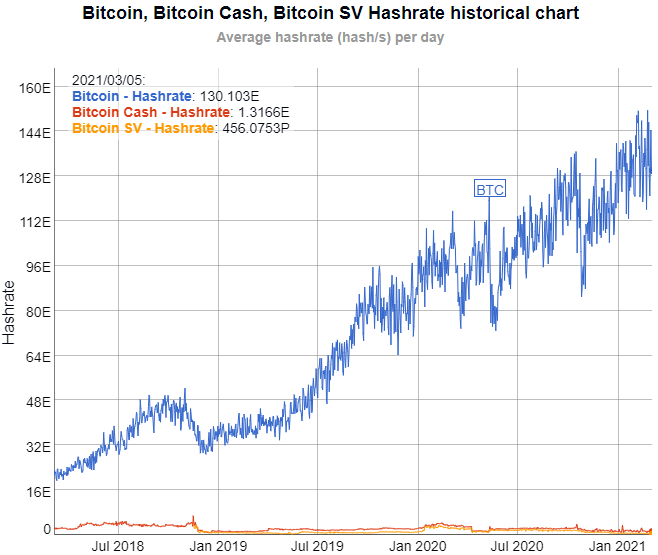
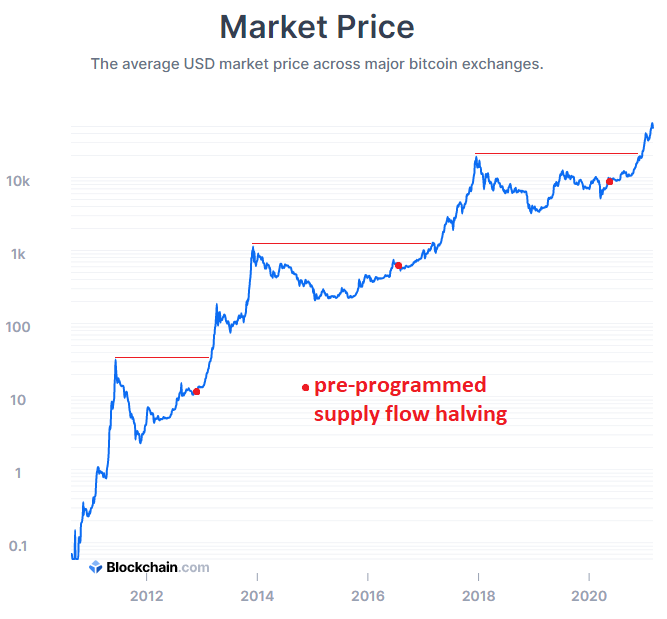

Una de las cosas más poderosas a buscar en una inversión es un efecto de red.

Un efecto de red es un atributo de una empresa u otro sistema en el que a medida que más personas utilizan la red, la red se vuelve exponencialmente más valiosa para cada usuario. Es uno de los fosos económicos más sólidos que un sistema puede tener frente a sus competidores.

Este artículo analiza cómo bitcoin obtiene su valor de su efecto de red, por qué ese efecto de red es difícil de desplazar para un competidor y cuáles son algunos de los riesgos que deben tener en cuenta para que los inversores puedan continuar evaluando la salud de la red.

En lugar de ser sobre el corto plazo, se trata de un análisis fundamental a largo plazo sobre el protocolo. A corto plazo, bitcoin puede subir o bajar significativamente según el sentimiento y los factores macroeconómicos generales.

### Ejemplos de efectos de red

Antes de profundizar en los detalles sobre bitcoin, podemos aislar algunos ejemplos de diferentes redes.

### Teléfono: Red unilateral

Uno de los primeros ejemplos de efecto de red fue el teléfono. Un solo teléfono es inútil, pero a medida que comenzaron a existir más y más teléfonos, el teléfono se convirtió en uno de los inventos más importantes de su época.

Y podemos derivar matemáticamente por qué la red telefónica se vuelve cuadráticamente más valiosa a medida que más gente la usa, en lugar de simplemente linealmente más valiosa.

Si hay dos teléfonos o “nodos” en la red, solo hay una conexión posible entre ellos. Si hay tres teléfonos (A y B y C), hay tres conexiones posibles (A a B, A a C y B a C). Si hay cuatro teléfonos, hay seis conexiones posibles. Si saltamos a diez teléfonos, hay 45 conexiones posibles. Con 100 teléfonos, hay 4.950 conexiones posibles.

Nodos de red 1

Nodos

Conecciones

1

0

2

1

3

3

4

6

5

10

6

15

7

21

8

28

9

36

10

45

100

4950

1000

499500

10000

49995000

100000

4999950000

Donde “c” representa el número de conexiones y “n” representa el número de nodos, la ecuación es c = 0.5 \* n \* (n-1).

A medida que “n” crece extremadamente, la ecuación se aproxima asintóticamente a c = 0.5 \* n ^ 2. Esta ecuación se conoce como [ley de Metcalfe](https://es.wikipedia.org/wiki/Ley_de_Metcalfe) y se presentó originalmente para redes de computadoras.

Con miles de millones de teléfonos móviles en el mundo (que ahora se combinan con Internet), existen trillones de posibles conexiones entre ellos.

El teléfono e Internet son ejemplos de redes unilaterales, lo que significa que los usuarios pueden conectarse con otros usuarios, y cada tipo de usuario o “nodo” es básicamente el mismo. También hay elementos de infraestructura como operadores de conmutadores en el medio, pero esos servicios crecen según sea necesario para admitir la base de usuarios de los nodos, que son todos similares entre sí.

### Redes de pago: red bilateral

Algunas redes son de dos lados, lo que significa que hay dos tipos muy diferentes de “nodos” en la red. Un nodo de tipo “a” quiere conectarse con un nodo de tipo “b”, pero generalmente no quiere conectarse con otro nodo de tipo “a”.

Un ejemplo de una red de dos lados sería compradores y vendedores. eBay (EBAY), por ejemplo, se disparó en valor al obtener una masa crítica de compradores y vendedores en su plataforma en línea. Una red publicitaria como Google AdSense es similar; hay sitios web que quieren ganar dinero con anuncios y hay anunciantes que quieren anunciarse en sitios web populares, y un mercado para que se reúnan es exponencialmente valioso para encontrar una pareja ideal, ya sea por selección humana o por algoritmo.

La ecuación para una red de dos lados también es exponencial. El número de posibles conexiones en la red es igual al número de nodos de un lado multiplicado por el número de nodos del otro lado.

Si tiene 2 vendedores y 4 compradores, hay 8 conexiones posibles entre compradores y vendedores. Si tiene 3 vendedores y 3 compradores, hay 9 conexiones posibles. Si tiene 10 vendedores y 20 compradores, tiene 200 conexiones posibles. Donde “c” representa el número de conexiones, “a” representa el número de nodos en un lado y “b” representa el número de nodos en el otro lado, la ecuación para el número de conexiones posibles es c = a \* b .

Esta tabla muestra cómo se escala, asumiendo por simplicidad un número igual de nodos en cada lado:

Red bilateral

Nodos

Conecciones

1

0

2

1

4

4

6

9

8

16

10

25

12

36

14

49

16

64

18

81

20

100

100

2500

1000

250000

10000

25000000

Si tiene una red comercial con 5,000 vendedores y 10,000 compradores, hay 50 millones de conexiones posibles.

A medida que el número de usuarios crece a millones y, en consecuencia, el número de conexiones posibles llega a billones, las probabilidades de que un vendedor encuentre compradores para sus productos o un comprador encuentre vendedores de cosas que quiere comprar, incluso si los productos son raros o de nicho, aumenta. En un cierto punto de masa crítica, la red se convierte en una “ventanilla única” para casi cualquier cosa, que es lo que la hace tan valiosa y dominante, y difícil de desplazar para una red de puesta en marcha más pequeña.

Otro ejemplo de una red bilaterales es la tarjeta de pago, que puede adoptar algunas formas diferentes, como una tarjeta de cargo, una tarjeta de débito o una tarjeta de crédito. Solo hay cuatro marcas principales en los Estados Unidos: Visa (V), Mastercard (MA), American Express (AXP) y Discover (DFS), y se extienden a nivel mundial con varios niveles de alcance. Entre esos cuatro, los dos primeros son los más grandes y operan como plataformas de pago independientes para que los bancos emitan tarjetas, mientras que los dos segundos son empresas más pequeñas que combinan la plataforma de pago con el banco que emite las tarjetas.

Durante muchas décadas, ¿por qué no hubo más? ¿Por qué no hay doce marcas de tarjetas de crédito en lugar de cuatro? La razón de que haya tan pocos, y solo dos o tres verdaderamente dominantes, tiene que ver con el efecto red.

Los comerciantes no aceptarán tarjetas que no sean populares, porque no vale la pena molestarse. Los consumidores no recibirán tarjetas que los comerciantes no acepten. Es un problema circular; una trampa 22. Es por eso que un efecto de red, una vez creado, es difícil de desplazar. Sería extremadamente difícil crear una nueva red de tarjetas de crédito.

Solo con el auge de Internet, que lanzó una rara explosión cámbrica de innovación que interrumpió las redes existentes, comenzamos a ver algunas redes de pago completamente nuevas como PayPal (PYPL) y Apple Pay (AAPL). Incluso entonces, sin embargo, trabajaron con las redes de tarjetas de crédito existentes y junto a ellas en lugar de estrictamente en contra de ellas. El Internet también hizo que las redes de tarjetas de crédito existentes fueran aún más valiosas, ya que no se puede usar efectivo físico a través de Internet. Por tanto, Internet amplió la cuota de mercado disponible para estas redes de pago. Todos empezaron a sacar cada vez más cuota de mercado del efectivo. Alipay (BABA) y WeChat Pay (TCEHY) de China tuvieron explosiones similares por el valor de sus redes.

### Red de envío: ejemplo de interrupción fallida

A continuación, se muestra un ejemplo de lo difícil que puede ser que los competidores superen los efectos de la red.

En Estados Unidos tenemos tres redes de envío principales. Los dos corporativos son UPS (UPS) y FedEx (FDX), y luego tenemos el Servicio Postal de Estados Unidos. Estas entidades tienen efectos de red debido a su amplia infraestructura: centros de envío y sistemas de camiones y aerolíneas y personal capacitado que los opera. Esta base de infraestructura existente mantiene muy bajo el costo de envío por paquete.

En 2002, la compañía naviera más grande del mundo, Deutsche Post (DPSGY) de Alemania, trató de entrar en el lucrativo mercado de transporte de Estados Unidos. Era independientemente más grande que UPS o FedEx, pero su centro de densidad de red estaba en Europa. Entonces, este era el competidor posible mejor capitalizado en la industria para competir contra ellos.

Pero en 2008, Deutsche Post no pudo ingresar al mercado:

Deutsche Post, propietario de DHL Express, dijo que cerraría las operaciones del transportista de paquetería en Estados Unidos después de un intento fallido de cinco años y $ 10 mil millones de entrar en un mercado de $ 61.1 mil millones dominado por UPS Inc. y FedEx Corp.

La unidad express cerrará el 30 de enero, pero DHL International mantendrá sus operaciones de envío de carga, logística por contrato y envío de paquetes internacionales en los Estados Unidos, para lo cual aún intentará completar un acuerdo con UPS para fin de año para manejar el transporte aéreo.

Deutsche Post, la oficina de correos alemana, compró DHL International en 2002 y adquirió Airborne Express en 2003 como plataforma para las operaciones estadounidenses. Pero nunca pudo superar el cuarto lugar en participación de mercado, detrás de UPS, FedEx y el Servicio Postal de EE.UU., y para el tercer trimestre de 2008, en realidad había perdido participación de mercado.

> ***“El mercado estadounidense es un duopolio altamente concentrado”***, dijo John Mullen, director ejecutivo global de DHL Express, el 10 de noviembre. ***“A pesar de nuestra inversión masiva de dinero para ser una tercera opción creíble, la realidad de la falta de escala \[para DHL\], la productividad que tienen \[UPS y FedEx\], el alcance del mercado y el conocimiento de la marca hacen que sea imposible para nosotros hacerlo económicamente viable ”, dijo Mullen en una conferencia telefónica con periodistas.”*** –Jonathan Reisken, Temas de transporte, noviembre de 2008

Durante un tiempo, DHL se mantuvo como un servicio de mensajería internacional, después de haber renunciado al mercado nacional. Diez años después, Deutsche Post intentó encontrar otro nicho y comenzó a ofrecer entregas de comercio electrónico dentro de ciertas ciudades.

Por lo tanto, es posible encontrar nichos a los que las grandes redes no están atendiendo por completo, pero es extremadamente difícil desalojar a las redes líderes de sus operaciones centrales.

### Red social: ejemplo de disrupción exitosa

El ejemplo más citado de una interrupción exitosa de la red fue Facebook (FB) que pasó por alto MySpace como la red social líder en los Estados Unidos.

MySpace se fundó a mediados de 2003. Llegó a más de 100 millones de usuarios en un momento, y en 2007 alcanzó una valoración máxima de $12 mil millones. Su valoración se derrumbó rápidamente a partir de entonces.

Facebook se fundó unos seis meses después, a principios de 2004, en unos pocos años superó a MySpace, llegó a alcanzar miles de millones de usuarios mensuales y alcanzó una valoración máxima de unos 800.000 millones de dólares hasta el momento. También adquirieron Instagram, WhatsApp y otras redes clave (que ahora están generando cierto escrutinio antimonopolio).

A pesar de una creciente desaprobación entre los gobiernos y el público con respecto a cómo rastrea datos o compra otras redes, hasta ahora Facebook ha sobrevivido a múltiples campañas y demandas de #DeleteFacebook y continúa creciendo, aunque con una edad promedio de usuarios más avanzada. Tal vez algún día se rompa o se estanque, pero a partir de ahora han cumplido 17 años de vida y van bastante fuertes en el sentido global.

Naturalmente, uno se pregunta cómo Facebook pudo superar a Myspace, a pesar de la ventaja que tenía MySpace. Hay varias razones que podrían citarse, pero he visto dos explicaciones particularmente convincentes que ambas jugaron un papel clave.

La primera razón es que Facebook comenzó como una red de nicho y se expandió a partir de ahí. Facebook hizo que los usuarios enumeraran sus nombres reales en lugar de ser anónimos, y al principio mantuvo la red exclusiva para estudiantes universitarios. Rápidamente logró el dominio en ese nicho. A partir de ahí se expandió a todos. Para usar una analogía exagerada, algo así como cómo la invasión de Normandía por las Fuerzas Aliadas en 1944 les permitió ganar terreno y comenzar a interrumpir el frente occidental de la Europa dominada por los nazis, la invasión de la escena universitaria de Facebook les dio un punto de apoyo para comenzar a interrumpir la red más amplia de MySpace.

La segunda razón es que MySpace tardó en adoptar el uso móvil, mientras que Facebook lo hizo rápidamente. La valoración máxima de MySpace fue en 2007. Este es el mismo año en que salió el iPhone, iniciando una ola de uso de Internet móvil por parte de los consumidores que interrumpiría muchas industrias. La valoración de Facebook fue aproximadamente la misma que la de MySpace ese año en $15 mil millones, y continuó aumentando exponencialmente mientras que la valoración de MySpace colapsó rápidamente. La escena social se convirtió en la escena móvil y Facebook estaba completamente a bordo.

Jeff Booth, un emprendedor tecnológico y autor de The Price of Tomorrow, ha argumentado que la estrategia móvil de Facebook fue su “momento 10x”. El argumento es que para que se interrumpa una red existente, un nuevo competidor debe ser 10 veces mejor. Debido a que la red existente brinda al operador establecido una gran ventaja arraigada, una nueva red no puede ser solo un poco mejor, o incluso el doble de buena; tiene que ser mejor en un orden de magnitud para convencer a una masa crítica de participantes de que se trasladen a él.

La combinación de Facebook de nombres reales, dominando la escena universitaria y adoptando rápidamente la proliferación de teléfonos inteligentes mientras MySpace se quedó atrás en la adopción móvil, hizo que Facebook fuera 10 veces mejor que MySpace en términos de potencial viral y, a partir de ahí, la diferencia fue irrecuperable.

Sin embargo, dado que solo hubo una diferencia de seis meses entre los inicios de las empresas, MySpace no fue la red más difícil de atacar en primer lugar. MySpace también pasó por un cambio de liderazgo un par de años antes de que Facebook lo superara, cuando fue vendido por los fundadores originales.

Michael Saylor, el multimillonario fundador y director ejecutivo de MicroStrategy (MSTR), ha citado $100 mil millones como su umbral para cuando una red alcanza un dominio casi seguro. Cuando una empresa con un fuerte efecto de red alcanza una valoración de $100 mil millones en dinero de hoy y es mucho mayor que cualquiera de sus competidores, la brecha es prácticamente irrecuperable y el riesgo / recompensa por apostar por esa empresa de red líder para continuar teniendo éxito es muy favorable. Su libro de 2012, The Mobile Wave predijo correctamente la gran importancia que tendría la adopción de Internet móvil en múltiples industrias.

Al aplicar la forma de pensar de Saylor, MySpace se interrumpió antes de que alcanzara el verdadero dominio de la red.

### Red social: ejemplo de interrupción fallida

Podemos continuar la historia de Facebook para agregar otro ejemplo de un intento fallido de interrupción, algo así como el ejemplo anterior de Deutsche Post. En 2011, Alphabet (GOOG) lanzó su competidor de redes sociales, Google+.

En ese momento, Facebook era el líder en redes sociales, mucho más grande que MySpace y valía decenas de miles de millones de dólares, casi mil millones de usuarios mensuales globales, y por lo tanto estaba básicamente en el punto de dominio imparable de la red.

Google, sin embargo, era un competidor extremadamente bien capitalizado, más antiguo y con más dinero en efectivo que Facebook, y con una extensa infraestructura de servidores ya instalada. Al igual que Deutsche Post pensó que tenía una buena oportunidad de ingresar al mercado logístico de Estados Unidos, Google pensó que tenía una buena oportunidad de ingresar al mercado de las redes sociales.

En ese momento, Google tenía un efecto de red de publicidad en Internet dominante y era el sitio web más visitado del mundo. Google colocó un enlace a Google+ directamente en su página de inicio, para que innumerables personas lo vieran todo el tiempo. En otras palabras, trató de usar su plataforma masiva existente como su punto de apoyo similar a Normandía para construir un efecto de red en otra industria.

Sin embargo, Google+ solo alcanzó un pico de varios cientos de millones de usuarios, nunca tuvo una participación muy alta y se cerró en 2019. No lograron hacer un producto 10 veces mejor; no había una “salsa especial” o una combinación de atributos que les diera, incluso como un gran titán de Internet, una oportunidad real de romper la enorme ventaja de Facebook en las redes sociales.

Sin embargo, Alphabet compró con éxito YouTube en su infancia, que se convirtió en el efecto de red más dominante en su propio nicho.

### Red de redes: el efecto Amazon

Es muy difícil encontrar ejemplos de redes de $100 mil millones que luego se superaron. Todos los ejemplos principales de que algo así suceda serían básicamente eventos anteriores y posteriores a Internet, lo que significa que “hacer un uso nativo de Internet” fue el uso 10 veces mejor que permitió a los recién llegados interrumpir las redes existentes. El correo electrónico interrumpió el correo físico y el comercio electrónico interrumpió el comercio físico, por ejemplo.

Además de esa época importante de disrupción tecnológica, no hay muchos ejemplos de disrupciones dominantes en la red. Las principales bolsas financieras se han mantenido como las principales bolsas de valores durante décadas. Las tarjetas de crédito líderes se han mantenido como las tarjetas de crédito líderes durante décadas. La interrupción es casi imposible una vez que se alcanza la masa crítica, porque es muy raro encontrar una solución 10 veces mejor. Las empresas antiguas en industrias que se desvanecen fracasan todo el tiempo, pero las verdaderas empresas de efecto de red tienden a tener una longevidad extrema.

La única empresa que ha avanzado mucho para romper algunos efectos de red es Amazon. Han convertido con éxito un efecto de red en otro y en otro, a diferencia de Google y de Deutsche Post, pero incluso eso vino con salvedades.

Amazon comenzó como un vendedor de libros en línea en los albores de la Internet de consumo en la década de 1990, que fue su momento de Normandía, ganando terreno. Luego se convirtió en el sitio web de comercio electrónico líder en todas las categorías en lugar de solo libros, comenzó a construir un sistema de almacenamiento y logística cada vez más grande, y logró el dominio de la red en su industria.

Amazon luego fue tras la computación en la nube. No había mucho líder en ese momento, ya que era un campo nuevo. El líder en plataformas informáticas empresariales fue IBM, pero como MySpace tardó en moverse hacia los dispositivos móviles, IBM tardó en innovar en este espacio. Amazon aprovechó la utilidad de su enorme espacio de servidor de comercio electrónico para ofrecer servicios en la nube a varias empresas y rápidamente se convirtió en el proveedor líder de servicios en la nube.

Las dos redes de Amazon, el comercio electrónico y la nube, se benefician mutuamente. Las ganancias de su brazo en la nube ayudan a mantener bajos los precios de su comercio electrónico. El comercio electrónico por sí solo tiende a ser un esfuerzo de muy bajo margen y, a menudo, no rentable. De todos modos, Amazon necesita mucho espacio adicional en el servidor para manejar los picos de tráfico en los días clave de compras, por lo que tenía sentido económico expandir aún más esta capacidad y ofrecer espacio de servidor a otros también.

Luego, Amazon fue tras los mercados en línea al permitir que otros vendedores proporcionaran productos a su base de usuarios existente, lo que robó parte del potencial de crecimiento de eBay como el principal mercado en línea. Facebook también lanzó servicios de mercado. Sin embargo, eBay todavía existe, sigue creciendo lentamente, tuvo un período de gestión problemática y distracción en otras industrias durante algunos años, y ahora se está volviendo a enfocar, y nunca estuvo cerca de $100 mil millones en valoración de todos modos.

Durante un tiempo, Amazon ha estado expandiendo su huella logística, ejerciendo presión sobre FedEx y UPS. Amazon comenzó como su cliente y sigue siéndolo, pero ha querido cada vez más poseer también la última milla de entrega, lo que potencialmente ejerce presión sobre los márgenes de esas empresas de logística. En este sentido, Amazon ha tenido más éxito que Deutsche Post en convertirse en una empresa líder en logística. Y, sin embargo, UPS y FedEx siguen creciendo como los jugadores dominantes de última milla.

Entonces, incluso aquí, Amazon nunca eliminó limpiamente una red dominante de $100 mil millones y la reemplazó. En el mejor de los casos, tomó la iniciativa en ciertas industrias que las empresas existentes podrían haber dominado pero no lo hicieron (como IBM), se convirtió en un competidor líder que aprovechó algo de crecimiento de las redes existentes de menos de $100 mil millones (como eBay) y se convirtió en un actor cada vez más relevante del mercado que afecta los precios dentro de un duopolio de infraestructura arraigado (como UPS y FedEx).

### Ejemplos de protocolo

Pensamos en Internet como una entidad que cambia rápidamente, y lo es. Sin embargo, se basa en una base de protocolo que, en el momento de escribir este artículo, es bastante antigua.

Internet se ejecuta en un conjunto de protocolos conocidos como TCP / IP. Esto se desarrolló en la década de 1970, hace cuatro décadas y media y, sin embargo, sigue siendo la base de Internet sin signos de que ese efecto de red se debilite en ningún momento en el futuro previsible. Con el tiempo, analizaremos la sexta y séptima décadas de este protocolo y seguirá siendo la base de Internet. Más allá de eso, veremos.

Esa capa base es lo suficientemente simple y flexible como para que se pueda construir prácticamente cualquier cosa sobre ella. En otras palabras, la mayor parte del desarrollo ocurre en la capa de aplicación, no en la capa de protocolo. No revisamos la base de Internet cada cinco años; en cambio, seguimos revisando la capa superficial.

Del mismo modo, la tecnología USB tiene ahora 25 años y no hay señales de que vaya a ninguna parte. Hemos tenido versiones 2.0 y 3.0 para hacerlas más rápidas, que tienden a ser compatibles con versiones anteriores y, a veces, cambiamos los factores de forma y liberamos adaptadores para que sean compatibles con versiones anteriores.

Cuando algo es simple, hace su trabajo y se vuelve omnipresente, tiende a quedarse durante mucho, mucho tiempo, con actualizaciones incrementales.

Supongamos que, como ingeniero, diseño y patento una versión similar a USB, pero objetivamente un poco mejor. Es un 10% más rápido, un 10% más barato de fabricar, pero por lo demás similar. ¿Cuáles serían las posibilidades de que pudiera convertir este en el nuevo estándar global para miles de millones de dispositivos y reemplazar el USB? La respuesta es casi cero, porque aunque es mejor en el papel, en la práctica es mucho peor que el USB porque no se conecta a ninguno de los miles de millones de dispositivos existentes o dispositivos actuales en proceso de desarrollo.

Y sería aún más difícil promover un competidor USB que tenga compensaciones, que es mejor en algunas áreas pero peor en otras. Es como llevar un cuchillo a una pelea nuclear.

¿Debería quedarme atónito por qué nadie quiere usar mi tecnología un poco mejor y rascándome la cabeza tratando de descubrir por qué todavía usan USB obsoletos, especialmente considerando que el USB también pasa por un ciclo de actualización con el tiempo? Por supuesto no.

En cambio, mi protocolo tendría que ser obviamente superior en un orden de magnitud de una manera tan clara para hacer que el uso de USB se sienta estúpido, con el fin de desplazar al USB.

Lo mismo sería cierto para TCP / IP. Si un grupo de grandes empresas de tecnología invirtieran $5 mil millones en el desarrollo de un protocolo mejor, probablemente aún no podría reemplazar a TCP / IP. La masa crítica de consenso internacional para cambiar todo por un nuevo protocolo sería inmensamente difícil.

Esto es relevante para analizar la probabilidad de éxito de bitcoin. La gente a menudo se refiere a ella como tecnología antigua, especialmente si están tratando de vender una de las 10.000 nuevas criptomonedas que existen, incluyendo quizás la suya propia si hicieron una. Sin embargo, al igual que TCP / IP, la simplicidad es parte de la filosofía de diseño de bitcoin y las capas se construyen en la parte superior. Si alcanza algún punto crítico y mantiene el estado de un protocolo, puede durar mucho tiempo.

### Análisis del efecto de red de Bitcoin

Escribí por primera vez sobre bitcoin en noviembre de 2017, cuando bitcoin tuvo esa gran corrida alcista que llamó la atención del mundo. Lo analicé con bastante profundidad y también revisé el espacio más amplio de activos digitales. Se me ocurrieron algunos modelos de precios aproximados, pero me preocupaba la salud del efecto de red de bitcoin y la posible pérdida de participación de mercado, junto con la acción eufórica del precio.

En ese momento, bitcoin costaba alrededor de $7.000 por moneda y tenía una capitalización de mercado total de aproximadamente $100 mil millones. Sin embargo, el dominio de bitcoin (refiriéndose a la participación de la capitalización de mercado de bitcoin en relación con la industria de activos digitales en general) estaba en un punto bajo y en declive, y bitcoin cash se había bifurcado de bitcoin y dividido a la comunidad de desarrolladores hasta cierto punto. Había más de mil criptomonedas, incluidas algunas grandes como ethereum.

En ese entonces, no podía armar un buen modelo de riesgo / recompensa para bitcoin u otros, especialmente dado el entusiasmo de precios que había, así que dejé de participar y seguí mirando. Durante los siguientes dos años, la industria tuvo un gran mercado bajista y muchos activos digitales colapsaron en precio. La mayoría de ellos aún no se han recuperado a los máximos históricos anteriores.

Sin embargo, el efecto de red de bitcoin continuó fortaleciéndose desde entonces. Terminé comprando bitcoins en abril de 2020, irónicamente al mismo precio de poco menos de $7.000 al que lo analicé por primera vez a fines de 2017, pero con un riesgo significativamente menor en mi opinión. A pesar de que el precio ha aumentado desde entonces, sigo viendo bitcoin como una inversión de red favorable, aunque tiene períodos de sobrecompra local.

En última instancia, esta decisión se redujo a un análisis de su efecto de red, y es probable que el protocolo haya alcanzado la velocidad de escape.

### Fortalecimiento de la red de Bitcoin

Bitcoin es principalmente una tecnología de ahorro y una red de liquidación de pagos.

Se están construyendo contratos inteligentes, aplicaciones y otras cosas sobre él, pero en este momento ese no es su caso de uso dominante todavía.

Su tasa de hash ha alcanzado de manera confiable máximos históricos, mientras que muchas criptomonedas todavía tienen como máximo histórico en su tasa de hash el que alcanzaron en 2018.

Esta alta tasa de hash hace que sea extremadamente costoso incluso intentar un ataque a la red bitcoin, porque se necesitaría tanta electricidad como un país pequeño para hacerlo, junto con granjas de servidores llenas de hardware dedicado que a menudo escasean.

En comparación, el capital que se necesitaría para atacar litecoin, bitcoin cash, bitcoin satoshi vision u otros es significativamente menor. Tienen mucha menos seguridad.

De manera similar, la cantidad de direcciones de bitcoin que contienen 1 BTC, 0.1 BTC y 0.01 BTC continúa aumentando.

Es difícil medir cuántas personas usan bitcoin u otros activos digitales, o qué tan concentrada está la red, porque una dirección no corresponde necesariamente a una persona. Las direcciones grandes a menudo son cuentas de custodia para miles o millones de usuarios, y los usuarios grandes a menudo almacenan sus bitcoin en más de una dirección. Sin embargo, es bueno ver que la cantidad de direcciones pequeñas sigue aumentando.

Solo la popular casa de cambio Coinbase tiene más de 40 millones de usuarios. La suma de varios intercambios y la eliminación de posibles duplicados da como resultado más de 120 millones de usuarios en todo el mundo.

Si doy una mirada a las formas en que el efecto de red de bitcoin se ha fortalecido en los últimos 2-3 años específicamente, aquí hay dónde comenzar:

##### **1) Bifurcaciones duras resueltas**

La bifurcación dura entre bitcoin y bitcoin cash en 2017 fue resuelta por el mercado en los próximos años; bitcoin retuvo la gran mayoría de la participación de mercado, mientras que bitcoin cash disminuyó en comparación, y luego se dividió nuevamente entre bitcoin cash y bitcoin satoshi vision.

Ambos tokens han alcanzado de manera confiable nuevos mínimos en el precio en relación con bitcoin, y actualmente cada uno vale menos del 1-2% de la capitalización de mercado de bitcoin. Ninguno de ellos tiene una tasa de hash significativa en comparación con bitcoin, y ambos tienen menos nodos.

Tasa de hash BTC BCH BSV

*Fuente del gráfico: BitInfoCharts*

Mucha gente pregunta, si una cadena de bloques es de código abierto y los protocolos se pueden bifurcar, entonces ¿bitcoin es realmente finito?

La respuesta es sí, siempre que la comunidad se mantenga enfocada en un protocolo.

Técnicamente, podría copiar Wikipedia (todos los datos pueden caber en una memoria USB) e intentar alojarlos en mi sitio web como Lynpedia. ¿Sería un verdadero desafío para el tráfico de Wikipedia si lo hiciera? Por supuesto no. Incluso si copio el texto completo, no puedo copiar los cientos de millones de enlaces en innumerables sitios web que apuntan a la Wikipedia real, las clasificaciones de búsqueda más importantes y la capacidad de servidor masiva que tiene Wikipedia, o la comunidad de personas que actualizan Wikipedia continuamente. Sería un competidor no serio.

Del mismo modo, cualquiera puede copiar la cadena de bloques de Bitcoin y bifurcarla en su propio diseño. La pregunta es si pueden convencer a la mayoría de los mineros, operadores de nodos y usuarios de que consideren que su bifurcación es el bitcoin “real”. Hasta ahora, sin competencia.

##### **2) Nuevas capas desarrolladas**

Las capas adicionales como la red Lightning, así como los servicios de custodia de terceros, han mejorado la escalabilidad de Bitcoin. En 2021, las principales casas de cambio como Kraken y OKCoin acordaron usar Lightning.

La escalabilidad, que se refiere específicamente a la cantidad de transacciones por segundo que puede realizar la red, es la métrica que Bitcoin sacrifica en la capa base para maximizar otras métricas como la seguridad y la descentralización. Bitcoin solo puede realizar alrededor de 120 millones de transacciones por año y algunos cientos de millones de pagos por año, ya que cada transacción puede tener múltiples destinos. Por lo tanto, cualquier capa que mejore la escalabilidad de Bitcoin, incluidas las soluciones que requieren confianza de terceros o no la necesitan, puede mejorar el valor de la red y aliviar las preocupaciones futuras sobre los cuellos de botella.

Si nos fijamos en el sistema de pagos global, hay grandes capas de liquidación como Fedwire, y luego hay capas encima de ellas que pueden manejar un mayor rendimiento de transacciones, y los bancos liquidan esas transacciones en lotes en las capas de liquidación base. Bitcoin ha ido evolucionando en la misma dirección.

Muchas personas comparan incorrectamente el rendimiento de las transacciones de bitcoin con algo como el rendimiento de las transacciones de Visa, pero esa es una comparación entre manzanas y naranjas. Bitcoin es una capa de liquidación final; Visa es una capa de transacciones frecuentes y reversibles construida sobre una capa de liquidación final más profunda.

Lightning es una capa sobre Bitcoin que puede manejar un rendimiento de transacciones arbitrariamente alto a lo largo del tiempo, sin dejar de basarse en la seguridad subyacente de Bitcoin. Funciona abriendo canales de firma múltiple entre nodos, de modo que un usuario pueda enviar monedas de un nodo a otro, utilizando una serie de nodos interconectados a lo largo del camino.

Es difícil medir exactamente cuántos nodos o canales de Lightning hay, ya que muchos no son públicos. Sin embargo, después de hablar con los desarrolladores de Lightning, la cantidad de aplicaciones y la cantidad de usuarios en la red está aumentando rápidamente en los últimos 12 a 18 meses.

Strike Global es una aplicación en particular que estoy observando en lo que respecta a las transacciones vía lightning, ya que abre muchas opciones de pago para las personas que ni siquiera se preocupan necesariamente por bitcoin como un activo. Podrá transferir pagos fiduciarios utilizando la capa lightning en el protocolo de Bitcoin, sin ninguna exposición real a la volatilidad de bitcoin. En menos de un segundo, la aplicación puede cambiar dólares por bitcoin, enviar los bitcoin a través de la red Lightning a la dirección de un destinatario y luego cambiar los bitcoin a dólares, euros, yenes, monedas estables, etc.

Lightning en sí es como la capa base de bitcoin en el sentido de que es de código abierto y nadie lo posee ni lo controla. Sin embargo, algunos desarrolladores importantes como [Lightning Labs](https://lightning.engineering/) están construyendo las herramientas de infraestructura que muchos de estos tipos de proveedores de aplicaciones utilizan para interactuar en la capa Lightning.

En muchos sentidos, el efecto de red se aplica a la capa Lightning más que incluso a la capa base del propio Bitcoin. La principal limitación de la capa de Lightning es la liquidez; se basa en un número suficiente de canales únicos entre nodos únicos, a diferencia de la capa base que se basa en la transmisión de transacciones a todos los nodos. A medida que se crean y mantienen más y más canales, la liquidez mejora en esta capa secundaria, y esto permite una mayor adopción y conduce a más canales en un círculo virtuoso. Y a medida que las herramientas se siguen construyendo y mejorando, facilita que las aplicaciones se incorporen a la red Lightning y mejoren la experiencia del usuario.

He hablado varias veces con la directora ejecutiva de Lightning Labs, Elizabeth Stark, y uno de sus puntos clave es que el futuro de la red Lightning debería funcionar de tal manera que la mayoría de los usuarios ni siquiera se den cuenta de que la están usando, de manera similar a como la mayoría de las personas no conocen la pila de tecnología que usan indirectamente cada vez que interactúan con Internet.

##### **3) Custodia de grado institucional**

Se han implementado soluciones de custodia de nivel institucional, incluso por parte de Fidelity. Estas soluciones proporcionan rampas de acceso sólidas para que el dinero institucional ingrese a la industria. Las corridas alcistas anteriores de bitcoin fueron impulsadas por inversores minoristas y especuladores, mientras que 2020 fue el año de interés institucional.

En diciembre de 2020, el banco más grande de Singapur anunció que ofrecerá un servicio de intercambio y custodia para inversores institucionales y acreditados (no minoristas), y que apoyará el comercio de solo cuatro activos digitales para empezar, incluido Bitcoin, por supuesto. NYDIG se fundó en 2017 como otro custodio de llaves que se enfoca en grandes clientes y específicamente en bitcoin.

De manera similar, el nuevo programa de PayPal permite a los inversores minoristas comprar los cuatro activos digitales principales. La aplicación Cash de Square permite a los inversores minoristas comprar solo bitcoin. NYDIG se asoció recientemente con bancos y los principales proveedores de software bancario para que los bancos puedan permitir que los miembros compren y mantengan bitcoin dentro de su aplicación bancaria, con su relación bancaria existente.

##### **4) Principales inversores a bordo**

Gracias a estos esfuerzos anteriores, bitcoin ha llegado a los inversores institucionales de una manera que ningún otro activo digital lo ha hecho.

Tres empresas de las principales bolsas de valores de Estados Unidos, MicroStrategy (MSTR), Square (SQ) y Tesla (TSLA), ahora mantienen directamente bitcoin en su balance corporativo. Inversores como Paul Tudor Jones, Stanley Druckenmiller y Bill Miller se han decantado por bitcoin. One River Asset Management lanzó un fondo bitcoin y un fondo ethereum para inversores institucionales que se espera que alcancen colectivamente cientos de millones en activos bajo gestión. SkyBridge Capital también lanzó un fondo bitcoin a principios de 2021. NYDIG ha pasado años construyendo una plataforma para asignaciones institucionales y ha tenido mucha tracción durante el año pasado, con grandes flujos de entrada.

Bitcoin ahora tiene suficiente escala, aceptación institucional y credibilidad del establecimiento para tener un lobby político / legal. Esto puede mitigar potencialmente los ataques regulatorios en su contra.

##### **5) Ecosistema separado de solo Bitcoin (no “cripto”)**

Ha habido un aumento en las empresas que solo utilizan bitcoin y las primeras en bitcoin.

[Swan Bitcoin,](https://www.swanbitcoin.com/) por ejemplo, es una empresa de acumulación solo de bitcoin, que se centra en permitir que los usuarios promedien el costo en dólares de bitcoin por un bajo costo y con un servicio al cliente real.

> [!actualizacion]
> Las marcas y servicios que se mencionan son los que existían cuando se escribió el texto. Bitblioteca no los recomienda: antes de usar cualquiera, verificá que siga activo, que opere en tu país y que tenga buena reputación.

El tema clave con estas plataformas de acumulación de bitcoin es que obtiene un trato mucho mejor en términos de soporte y precio que si intenta acumular en la mayoría de las grandes casas de cambio que se centran en el comercio de alta rotación a través de varios tokens.

Coinkite y Spectre Solutions han lanzado monederos de hardware solo para bitcoin con sólidas funciones de seguridad para técnicos, desarrolladores y titulares de empresas, mientras que muchas carteras de generaciones anteriores de otras empresas son de múltiples tokens. Ha habido un aumento similar en las aplicaciones de software de monedero solo para bitcoin.

Casa es una empresa pionera en bitcoin, que se centra en la creación de soluciones de seguridad de múltiples firmas para mantener de forma segura cantidades considerables de bitcoin.

La aplicación Cash de Square permite a los usuarios acumular bitcoin y no otros activos digitales. Square también tiene bitcoin en su balance corporativo ahora.

La aplicación Strike, como se mencionó anteriormente, está utilizando la red bitcoin / lightning para enviar pagos de fiat-a-bitcoin-a-fiat-a-nivel-mundial. También incorpora monedas estables de protocolos de servicios públicos.

El ecosistema de Bitcoin para plataformas de hardware, seguridad y acumulación está muy por encima de cualquier otra red individual en esta industria, mientras que su ecosistema para el desarrollo se encuentra entre los dos primeros junto con ethereum.

##### **6) Copia de seguridad por satélite**

La solidez de la red bitcoin continúa mejorando y muestra cuán incondicional es la comunidad bitcoin con respecto a la seguridad.

Se solía decir que cualquier persona con una conexión a Internet podía acceder a Bitcoin. Bueno, ahora hay satélites bitcoin.

Como lo describe Blockstream, “La cadena de bloques de Bitcoin desde el espacio. No se requiere internet. La red Blockstream Satellite transmite la cadena de bloques de bitcoin en todo el mundo las 24 horas del día, los 7 días de la semana de forma gratuita, protegiendo contra las interrupciones de la red y brindando a las áreas sin conexiones confiables a Internet la oportunidad de usar Bitcoin “.

##### **7) Tarjetas de recompensas de Bitcoin**

Las tarjetas de recompensas de Bitcoin existen ahora.

La aplicación Fold permite a los miembros ganar bitcoins en sus compras. BlockFi está lanzando una tarjeta de recompensas bitcoin. Cash Card de la aplicación Cash permite a los usuarios ganar bitcoin en sus compras.

> [!actualizacion]
> BlockFi quebró en noviembre de 2022.

Todas estas son plataformas de acumulación automática para personas que compran bitcoin de forma regular en pequeñas cantidades, contra un suministro finito.

Mucha gente descarta bitcoin y el espacio cripto más amplio como “especulativo”, y eso es ciertamente cierto hasta cierto punto, ya que muchos compradores están especulando y comerciando.

Pero a diferencia de muchos de los criptotokens, y a diferencia de muchas acciones de crecimiento con las que a menudo se compara bitcoin, bitcoin en particular tiene una gran comunidad de inversores que promedian al costo del dólar. Esta comunidad HODLer se enfoca en comprar en pequeños tramos de manera regular y mantenerlos durante años en almacenamiento en frío.

Desde una perspectiva externa, veo que algunas personas tradicionales ponen “cripto”, “bitcoin”, “apuestas de Wall Street” y “especuladores minoristas” en el mismo saco, pero si examinas las comunidades de cerca, en realidad son bastante diferentes, con solo una superposición parcial. Uno de estos grupos no es como los demás en términos de propensión a comprar y mantener.

## Bitcoin frente a otros tokens

Según [CoinMarketCap](https://coinmarketcap.com), la capitalización del mercado de criptomonedas es de un poco menos de $1.6 billones.

La capitalización de mercado de Bitcoin es de más de $950 mil millones, o el 60% del total. Sin embargo, la participación de mercado de bitcoin entre los tokens que intentan optimizar para ser tiendas de valor descentralizadas es aún mayor.

### Stablecoins

De la capitalización total del mercado de criptomonedas, decenas de miles de millones de dólares y la escalada consisten en monedas estables. Estas monedas estables son solo una extensión de la moneda fiduciaria, por lo que no considero que sean competidores.

De hecho, los inversores intercambian monedas fiduciarias por monedas estables principalmente para que puedan intercambiar otros activos digitales, incluido bitcoin, con liquidez nativa-cripto que les permite mover dinero rápidamente y diferenciar los precios de arbitraje entre las bolsas.

### Competidores monetarios

Luego tenemos $13 mil millones para litecoin, $10 mil millones para bitcoin cash y menos de $4 mil millones cada uno para bitcoin satoshi vision y monero. Además de bitcoin, estas y algunas otras son las monedas más grandes que intentan optimizar para ser depósitos de valor y medios de intercambio.

En comparación con bitcoin, estos tokens tienen menos nodos, mucha menos tasa de hash, falta de un ecosistema de seguridad / hardware dedicado y falta de interés institucional, por lo que sus efectos de red no están ni remotamente cerca. Cada uno tiene una capitalización de mercado de menos del 2% de la capitalización de mercado de bitcoin.

Sin embargo, no todos los proyectos de altcoin son iguales. No estoy, por ejemplo, comparando litecoin con bitcoin satoshi vision, ya que tienen diferentes niveles de seriedad.

### Ripple/XRP

Luego, tenemos XRP en un poco más de $20 mil millones en su propia categoría, que la Comisión de Bolsa y Valores está cobrando como un valor sin licencia.

Su inventor, Ripple Labs, recauda dinero de los inversores y promueve activamente el uso de XRP, por lo que financieramente es una situación muy diferente a la de bitcoin. El proceso de lanzamiento de Bitcoin fue totalmente único, sin pre-minado ni centro de promoción central.

### Ethereum

Finalmente, tenemos ethereum y otros protocolos de utilidad como cardano que intentan optimizar para otras cosas además de ser simplemente una reserva de valor o medio de intercambio.

Ethereum con una capitalización de mercado de aproximadamente $200 mil millones, que sirve como plataforma para innumerables otros tokens, es el único protocolo además de bitcoin que tiene un efecto de red sustancial en este punto. Escribí mi análisis de ethereum [aquí](https://www.lynalden.com/ethereum-analysis/). Cardano tiene más de $36 mil millones y Polkadot está en $32 mil millones.

Bitcoin se enfoca en hacer una cosa muy bien: ser un almacén de valor descentralizado y seguro y una capa de liquidación de pagos. Otras capas construidas sobre bitcoin pueden expandir esta capacidad, pero esa cosa simple es lo que hace el protocolo base. Bitcoin tiene más de 12 años y no ha cambiado radicalmente desde su inicio. Los cambios ocurren lentamente según sea necesario para mejorar la seguridad, y la mayor actualización reciente fue SegWit en 2017, que mejoró la escalabilidad y resolvió ciertos problemas técnicos para que la red Lightning y otras capas pudieran construirse sobre ella.

Dependiendo de cómo se mire, la capa base de Bitcoin ha sido un proyecto terminado (post-beta) desde 2017 cuando se implementó SegWit y terminaron las guerras de bifurcaciones, y posiblemente mucho antes de eso.

Ethereum no se optimiza para ser una reserva de valor, sino que apunta a ser una computadora mundial que ejecuta contratos inteligentes para una gran cantidad de aplicaciones descentralizadas, con la premisa de que sus tokens pueden apreciar su valor si la red continúa creciendo y mejorando, ya que la segunda versión del ecosistema tendrá sumideros de liquidez incorporados en forma de participación y garantías que pueden hacer que la posesión de tokens de ethereum sea atractiva. Es como un sistema operativo con una orden de dinero adicional, por lo que no es exactamente un competidor directo de bitcoin, aunque los alcistas de ethereum argumentan que podría serlo si suficientes piezas encajan en su lugar desde una perspectiva técnica.

Ethereum 1.0 ha estado planeando cambiar a Ethereum 2.0 durante mucho tiempo, y está implementando ese proceso actualmente y durante los próximos años, que si se habilita alterará radicalmente el protocolo, cambiará su política monetaria y lo transformará de usar una prueba-de-trabajo como mecanismo a un mecanismo de prueba-de-participación para su proceso de verificación de transacciones. Esto podría mejorar las limitaciones actuales del protocolo, pero conlleva un riesgo de implementación significativo. Tampoco veo a Ethereum tan descentralizado como Bitcoin.

Mientras tanto, otros dos protocolos de servicios públicos de prueba de participación, Cardano y Polkadot, han ganado algo de capitalización de mercado. Juntos, tienen aproximadamente un 30% de la capitalización de mercado que Ethereum, lo que los pone más cerca del líder que algunos de los competidores monetarios de bitcoin están de bitcoin. Entonces, si ethereum se desliza en su transformación Ethereum 2.0, hay algunos competidores que buscan participación de mercado en la utilidad del protocolo en el panorama competitivo.

A diferencia de Bitcoin, no tengo un modelo de precios ni un punto de vista firme de riesgo / recompensa hacia los tokens de Ethereum. Si tuviera que adivinar, soy bastante optimista con Ethereum siempre que a bitcoin le vaya bien, ya que algunos inversores se volcarán en Ethereum, y el ecosistema alberga una comunidad comercial activa en DeFi. Y, por extensión, sería bastante bajista con Ethereum siempre que Bitcoin esté en un mercado bajista.

Hubo un [artículo de investigación](https://medium.com/john-pfeffer/an-institutional-investors-take-on-cryptoassets-690421158904) de John Pfeffer a fines de 2017 que explicaba por qué es poco probable que los tokens de utilidad, por sí mismos, acumulen mucho valor monetario a largo plazo.

Ese artículo se ha debatido de un lado a otro, pero hasta ahora se ha desarrollado en su mayor parte tal como se escribió durante los siguientes 3+ años; la cantidad de valor negociado en Ethereum casi se ha triplicado desde entonces debido a su uso para el comercio de monedas estables de alta frecuencia y los intercambios descentralizados, superando a Bitcoin en el valor máximo de transacción, y sin embargo, la capitalización de mercado de Ethereum no ha crecido en ese mismo porcentaje.

Ser un protocolo de utilidad no impide que los tokens también tengan propiedades de almacenamiento de valor si las cosas van bien como parte de la revisión de Ethereum 2.0; simplemente hace que sea un desafío hacerlo, ya que el protocolo tiene que optimizar para múltiples cosas simultáneamente. Tiene que optimizar para ser un protocolo de utilidad y al mismo tiempo tener sumideros de liquidez e incentivos para mantener los tokens, lo que Ethereum 2.0 hará a través del staking si las cosas salen según lo planeado, y que ya está sucediendo en Ethereum 1.0 en forma de garantía.

Si tuviera que resumir esta sección, diría que Ethereum es la única otra cadena de bloques además de Bitcoin que ha logrado un gran efecto de red, pero se diferencia de Bitcoin en términos de su nivel de descentralización y su propósito.

### Concentración de mercado

Ajustados por liquidez, Bitcoin y Ethereum dominan el ecosistema de activos digitales. Bitcoin y Ethereum juntos tienen un porcentaje muy grande de capitalización del mercado de criptomonedas ex-stablecoin entre los principales protocolos, lo que excluye una larga cola de pequeños protocolos ilíquidos:

Con regularidad recibo correos electrónicos de gente sobre su protocolo favorito y cómo está a la vuelta de la esquina de desplazar Bitcoin o Ethereum. Proporcionarán una larga lista de por qué, en su opinión, esta moneda suya es tecnológicamente superior.

Sin embargo, si no es 10 veces mejor, sus posibilidades son remotas frente a Bitcoin. Imagine, por ejemplo, que inventara una red social que, según una muestra de personas, tuviera una interfaz un poco mejor que Twitter o Facebook. ¿Tendría la oportunidad de desplazarlos? Por supuesto no. Enfrentarme a una red de mil millones de miembros es imposible a menos que esté haciendo algo radicalmente mejor o radicalmente diferente. Lo mismo es cierto para cualquier altcoin que tenga la intención de ser una reserva de valor frente a bitcoin.

Bitcoin aún no ha sido desplazado en doce años a pesar de la llegada de más de 8.000 competidores. En otras palabras, “si vienes al rey, es mejor que no te pierdas”, y hasta ahora hay un cementerio de 8.000 fallos y un pequeño puñado de protocolos importantes.

### Pensamientos finales

Determinar si Bitcoin es un buen lugar para asignar capital o no, depende en última instancia de la evaluación de un inversor sobre su efecto de red.

Mientras tanto, es una máquina para generar capitalización de mercado de forma algorítmica. Cada dos semanas (2,016 bloques), la red se somete a un ajuste automático de dificultad para garantizar que los mineros generen nuevos bloques cada 10 minutos en promedio. Cada cuatro años (210.000 bloques), la cantidad de monedas nuevas generadas para cada nuevo bloque se reduce a la mitad, lo que resulta en un shock de oferta.

Este patrón tiende a hacer subir el precio con el tiempo en un ciclo constante:

Ciclo de reducción a la mitad de Bitcoin

*Fuente del gráfico: Blockchain.com*

No está claro cuándo se romperá finalmente este patrón, pero con su sólido historial y el desarrollo continuo en el ecosistema circundante (productos de hardware, aplicaciones de pago, aplicaciones de seguridad, soluciones de custodia, mejoras regulatorias y desarrollo de segunda capa), creo que Bitcoin se merece una contraprestación por una asignación distinta de cero en un portafolio de inversión.

Sin embargo, los inversores pueden estudiar el protocolo y el ecosistema y llegar a sus propias conclusiones.
