### Prefacio

Esta es la serie completa de bitcoin+hongos combinada en un solo artículo. Tengo más material inédito, ¿debería convertirlo en un libro? Avísenme en Twitter, mis DM están abiertos. Además, ¿les gustaría recibir una notificación cuando publique nuevos artículos? Registrate aquí.

Necesito dar crédito a Dan Held por publicar su serie de 4 partes donde compara el origen de bitcoin con plantar un árbol. Si bien me encantó su serie, creo que una analogía más robusta es comparar a Bitcoin con hongos. Si es nuevo en este tema, abróchese el cinturón – es un honor para mí iniciarlo en el fascinante mundo de los hongos.

Responsabilidad polímatica: así como Satoshi combinó disciplinas para unir la Franken-tecnología que llamamos bitcoin… Es de mi creencia que cada uno de nosotros tiene la responsabilidad de explorar nuestras propias transversales de conocimiento únicas. Aquí está mi exploración de hongos y bitcoin – los paralelismo son asombrosos.

## Capítulo 1: Bitcoin es un organismo descentralizado (Micelio)

Bitcoin aparenta ser superficialmente simple a primera vista, sin embargo, verdaderamente comprender al sistema es una tarea abrumadora.

Existen “trampas intelectuales” en el camino que engañan a los observadores para que hagan suposiciones apresuradas. Compararía la búsqueda de la comprensión de bitcoin con un alpinista que continuamente alcanza “picos falsos” que momentáneamente engañan a quien escala haciéndole creer que ha llegado a la verdadera cima.

Tan pronto como uno crea que ha descifrado bitcoin, descubre lo poco que sabe en realidad (pico falso).

Las narrativas que compiten con bitcoin lo hacen aún más difícil… dinero mágico de internet, manía especulativa, revolución fintech, bitcoin hierve los océanos, veneno para ratas al cuadrado, idealismo libertario, oro digital, depredador de los medios monetarios, nudo gordiano de incentivos entrelazados, etc.

Para empeorar aún más las cosas, bitcoin es un sistema vivo que cambia constantemente en función de los estímulos ambientales. La verdadera comprensión es una meta en movimiento con poca probabilidad de ser alcanzada.

Al intentar responder a la pregunta “¿qué es bitcoin?”, encontré que explorar los paralelismos con el mundo natural es particularmente esclarecedor.

Particularmente, algunas de las mejores características de bitcoin son simples reflejos de estrategias evolutivas exitosas que se encuentran en la naturaleza, específicamente en el reino de los hongos.

Los hongos se componen principalmente de “micelio”  una red subterranea de inteligencia descentralizada descrita por Paul Stamets como “el tnternet natural de la tierra”.

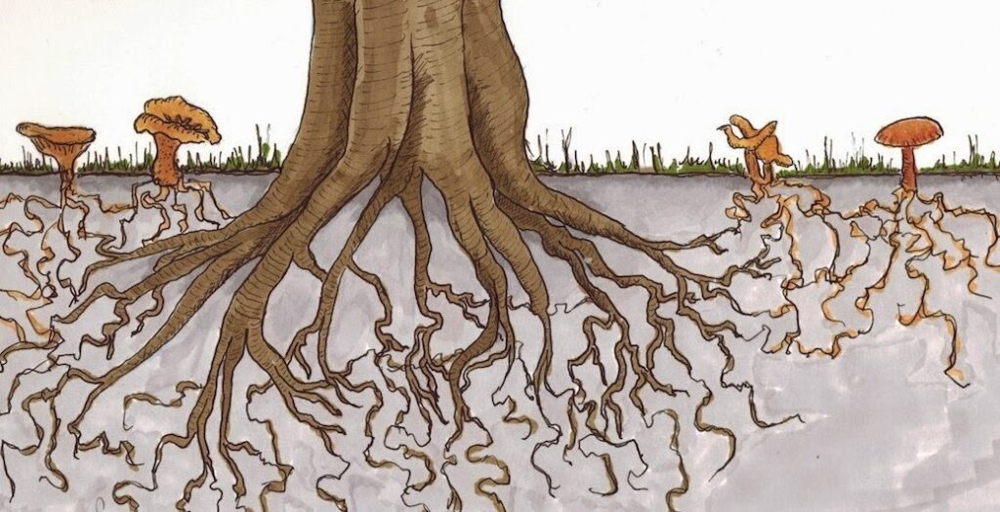

Imagen de John Upton

> “Creo que el micelio es la red neurológica de la naturaleza. Los mosaicos entrelazados de micelio infunden hábitats con membranas de intercambio de información. Estas membranas son conscientes, reaccionan al cambio y, en conjunto, tienen en mente la salud a largo plazo del ambiente que las hospeda. El micelio se mantiene en constante comunicación molecular con su ambiente, ideando diversas respuestas enzimáticas y químicas a desafíos complejos. ”  
> – Paul Stamets, Mycelium Running: Cómo los hongos pueden ayudar a salvar el mundo.

En este artículo exploraré las similitudes entre los hongos y bitcoin. Originalmente, esto fue publicado como artículos separados. Si ya ha leído algunas partes de esta serie, no dude en avanzar hasta la siguiente sección.

-   Capítulo 1: Bitcoin es un organismo descentralizado (Micelio)
-   Capítulo 2: Bitcoin es una criatura social (Hongo)
-   Capítulo 3: Bitcoin es el antivirus a la incertidumbre macro (Medicina)
-   Capítulo 4: Bitcoin es un catalizador para la evolución humana

### Introducción al reino Fungi

Los hongos están en su propio reino separado al igual que las plantas y los animales. Hay más especies de hongos que plantas y animales combinados.

Los animales se encuentran más íntimamente relacionados con los hongos que nosotros con las plantas. Tanto los hongos como los animales inhalan oxígeno y exhalan dióxido de carbono. Las plantas producen su propio alimento a través de la fotosíntesis (autótrofas), mientras que los animales y los hongos deben encontrar su propio alimento (heterótrofos). Los animales evolucionaron para tener estómagos/cerebros internos, mientras que los hongos buscaron estómagos/cerebros externos.

Dato sobre hongos #1: los humanos comparten más del 50% de su ADN con los hongos. Los científicos propusieron un nuevo super reino llamado Opisthokonta que combina hongos y animales.

Los hongos pueden adoptar muchas formas. La mayoría se organiza en una “estructura de raíz” subterránea llamada micelio que se encuentra en casi todas partes del planeta.

Cuando las condiciones son adecuadas, los hongos producen hongos que luego liberan esporas (semillas) que intentan colonizar formas de vida en un lugar cercano. Los hongos son simplemente el órgano reproductor. Los hongos son al micelio lo que las manzanas son para un árbol.

Los hongos son fundamental importancia para la vida en la tierra:

-   El organismo más grande en nuestro planeta es una red de hongos
-   El reino fungi representa a los mejores químicos de nuestro planeta, gran parte de nuestra medicina proviene de los hongos
-   Los árboles no pueden sobrevivir sin tener hongos subterráneos como aliados
-   Los hongos han existido durante 1.300 millones de años, sobreviviendo los 5 grandes eventos de extinción masiva
-   Los hongos son capaces de salvar a las abejas

### Los Hongos son Redes de Inteligencia Descentralizadas

Las redes del reino fungi no tienen un “cerebro” centralizado. Al contrario, son un “sistema de raíces” de una sola célula llamado Micelio. Este estómago subterráneo y red de inteligencia distribuida es capaz de enviar información bidireccionalmente a largas distancias e incluso a través de líneas de especies. Estas redes de hongos evolucionan constantemente en función a partir de la retroalimentación con su entorno.

En cualquier punto, una red de hongos contiene millones de terminaciones, cada una de las cuales busca alimento, defiende su territorio o inventa nuevas moléculas para subvertir a su competencia (otros hongos, bacterias, etc.). Estas redes forman un consenso descentralizado sobre cómo utilizar los recursos, cuándo reproducirse y qué estrategia defiende mejor al organismo.

Esto refleja el consenso descentralizado (contrato social) formado en bitcoin. Los nodos determinan qué software desean ejecutar y hacen cumplir las reglas de consenso según corresponda. Los mineros determinan qué transacciones incluir en los bloques. Los mercados de intercambio, billeteras y comerciantes cada uno administra grandes grupos de usuarios. Cada participante en bitcoin elige voluntariamente cómo desea participar y el consenso agregado de todo esto representa a la red.

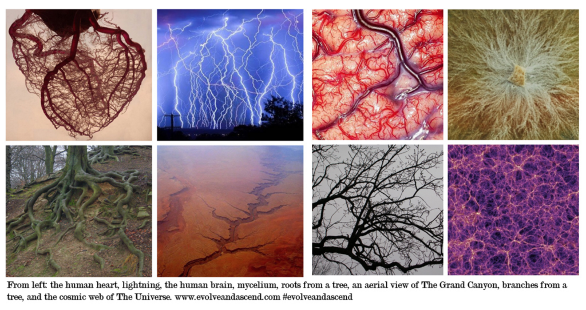

De izquierda a derecha: el corazón humano, relámpagos, el cerebro humano, raíces de un árbol, una toma aérea del Gran Cañón y la red cósmica del universo www.evolveandascend.com #evolveandascend

### Las Redes Descentralizadas Son Más Antiguas Que La Humanidad 

Las redes descentralizadas han existido mucho antes de que existieran los humanos. De hecho, los hongos han implementado exitosamente estos sistemas durante 1.300 millones de años, convirtiéndose en el reino más exitoso de nuestro planeta.

Además de los hongos, existen varios ejemplos de arquetipos de redes distribuidas que se encuentran en toda la naturaleza (micelio, materia oscura, neuronas, internet, etc.). Claramente, esta estrategia funciona, de lo contrario la naturaleza no insistiría en replicarla.

Cuando se ve el arquetipo de red descentralizada en el contexto de nuestra larga historia, la llegada del dinero digital descentralizado parece menos novedosa y más inevitable.

El arquetipo de red descentralizada es Lindy.

### Durante mil millones de años dea evolución, los hongos se han convertido en maestros de la supervivencia

Los hongos se adaptan de manera única y continúan sobreviviendo a los eventos de extinción masiva.

Hace 65 millones de años, un asteroide gigante golpeó nuestro planeta y acabó con la mayor parte de la vida en nuestro planeta (incluidos los dinosaurios). El impacto creó una nube de humo tan espesa que impidió que la luz solar llegara a la superficie de la tierra durante muchos años. Sin luz solar, las plantas murieron y con ellas la mayoría de los animales. Sin embargo, los hongos no dependen de la luz solar para sobrevivir, pudiendo adaptarse rápidamente y encontrar su propio alimento.

Después de cada evento de extinción, los hongos “heredan la tierra” y se reconstruyen lentamente hasta que las condiciones se estabilizan y la vida pueda continuar nuevamente.

Bitcoin se convertirá en la especie monetaria más exitosa porque es descentralizada, se adapta (relativamente) rápido, encuentra su propia comida (demanda insatisfecha) y no necesita apoyo del gobierno. En el caso de un evento de extinción monetaria masiva, bitcoin “heredará la tierra”.

### El gobierno japonés Vs. el humilde moho del limo

Ya sean los bancos centrales que intentan dirigir la economía o las corporaciones jerárquicas que intentan maximizar el valor en la era de la información… La planificación central tiene muchas fallas.

Al tomar decisiones en la “economía de la información”, las organizaciones descentralizadas o planas son más efectivas. Son resistentes a la corrupción, minimizan la burocracia y llevan la toma de decisiones a extremos donde los individuos (nodos) tienen la información más actualizada sobre el problema en cuestión.

Echemos un vistazo al sistema de metro de Tokio para ilustrar el poder de las redes descentralizadas.

Los científicos llevaron a cabo un experimento en el que se incentivó un hongo antiguo (moho del lodo) para recrear el sistema de metro de Tokio. Cada parada de metro (nodo) estaba marcada con la comida favorita del moho (hojuelas de avena).

Después de poco tiempo, el moho del lodo creció para conectar todos los nodos/paradas en un diseño más eficiente que el hecho por comité de ingenieros planificadores contratados por el gobierno japonés.

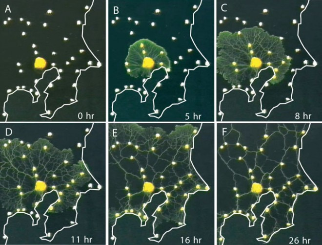

Moho del lodo diseñando el sistema de metro de Tokio

Del resumen:

> “Las redes de transporte son omnipresentes en tanto en sistemas sociales como biológicos. El rendimiento robusto de la red implica un compromiso complejo que involucra costos, eficiencia de transporte y tolerancia a fallas. Las redes biológicas han sido perfeccionadas por muchos ciclos de presión por selección evolutiva y es probable que produzcan soluciones razonables a tales problemas de optimización combinatoria. Además, se desarrollan sin control centralizado y pueden representar una solución fácilmente escalable para redes en crecimiento en general. Mostramos que el moho de lodo *Physarum polycephalum* forma redes con eficiencia, tolerancia a fallas y un costo comparable al de las redes de infraestructura del mundo real – en este caso, el sistema de trenes en Tokio. Los mecanismos centrales necesarios para la formación de redes adaptativas pueden capturarse en un modelo matemático de inspiración biológica que podría ser útil para guiar la construcción de redes en otros dominios.”

Cuando uno piensa en los costos y las complejidades involucradas en esta clase de proyectos de infraestructura, es bastante aleccionador darse cuenta de que un moho puede diseñar una red mejor en un solo día.

### Satoshi entendió el poder del moho de limo.

Bitcoin es un bien monetario no soberano que lleva la complejidad y la toma de decisiones al límite, al igual que los hongos. Con el tiempo, esta descentralización del libre mercado permite que bitcoin supere a varios sistemas financieros heredados que tienen poca piel en el juego, sufren el dilema del innovador, se vuelven más frágiles con el paso del tiempo y, a menudo, se ahogan en la burocracia (o algo peor).

### Vida sin un punto centralizado de falla 

El micelio no tiene un “punto central de control”. Se puede eliminar cualquier parte individual, pero el sistema en su conjunto sobrevive.

> “Si vienes a por el rey, es mejor que no te falles” – Omar Little (The Wire) 

Los estados nacionales y los bancos centrales enfrentan un desafío paradójico. Si intentan destruir a su competencia, destacarán la necesidad misma de bitcoin en primer lugar. Y, aún así, mientras más esperan, más fuerte se vuelve Bitcoin.

### Endurecidos por la hostilidad

Tanto el micelio como bitcoin perduran en los ecosistemas más competitivos de nuestro planeta y deben adaptarse constantemente para sobrevivir. Tienen piel en el juego y se endurecen producto de la hostilidad.

Los hongos se encuentran en un entorno competitivo las 24 horas del día, los 7 días de la semana, luchando constantemente pequeñas batallas subterráneas contra varias bacterias, microbios y hongos competidores.

Si un “nodo” micelial detecta un depredador/presa, envía la información a los “hongos científicos”, quienes luego crean una nueva enzima para atacar al depredador/presa. La red de hongos distribuye esta nueva enzima donde se necesita.

> “Dato sobre hongos #2: Como seres humanos, nos beneficiamos de los compuestos medicinales creados por los hongos. El más famoso, la penicilina, provino de un descubrimiento accidental de Alexander Fleming. La penicilina se ha utilizado para combatir epidemias bacterianas que históricamente han diezmado poblaciones humanas. Desde el descubrimiento de la penicilina, nuestra población se ha triplicado.”

Bitcoin responde a su entorno de manera similar. A medida que se encuentran errores/amenazas/oportunidades en el sistema, la información viaja a los “científicos de bitcoin” (desarrolladores) que crean una “enzima” (parche de software) y esta actualización se propaga a través del sistema. Esto también permite un mayor éxito ecológico para bitcoin. Bitcoin es antifrágil.

Tanto los hongos como bitcoin endurecen sus defensas con el tiempo y aprenden a consumir nuevas fuentes de alimentos. Esto tiene un efecto combinado que aumenta su antifragilidad, así como su expectativa de vida a lo largo del tiempo.

En un caso extremo, echemos un vistazo al organismo más grande de nuestro planeta, el hongo de miel (*Armillaria sp*). Este organismo, hallado en las Montañas Azules al este de Oregón, tiene más de 3,8 km (2,4 millas) de ancho. Se estima que tiene entre 1.900 y 8.650 años y actualmente consume todo un bosque.

### Lidiar con la competencia

Las redes fúngicas roban ventajas competitivas de sus vecinos en forma de información genética al igual que bitcoin absorbe las ventajas competitivas mostradas por altcoins.

Existe una creencia (equivocada) en la cual la gente asume que las altcoins implementarán nuevas características geniales que eventualmente superarán a Bitcoin.

El lado opuesto cree que bitcoin eventualmente absorberá todas las mejores características después de que hayan sido probadas en el mercado, lo que hace que las monedas alternativas no puedan competir a largo plazo. Yo me encuentro de este lado.

### Echemos un vistazo a cómo los hongos se acercan a su competencia…

Primero, necesitamos comprender algunos aspectos básicos sobre la genética. Los genes generalmente se transmiten de padres a hijos en lo que se conoce como “transferencia genética vertical”.

Curiosamente, los hongos realizan una “transferencia horizontal de genes”, absorbiendo efectivamente información genética de diferentes especies que compiten en el mismo ecosistema.

Este proceso de transferencia de genes horizontal demostrado por el reino fungi presagia el estado futuro en el que bitcoin integra cualquier idea probada producida por altcoins en general.

**Por ejemplo:** la combinación de la extensión del navegador Lightning Joule con un nodo (corra su propio nodo, sino use Casa o cualquier otro) permite realizar micro transacciones a través de tu navegador. Esto elimina efectivamente la necesidad de tokens como BAT.

> [!actualizacion]
> La extensión Joule fue abandonada y Casa ya no ofrece nodos. Las marcas y servicios que se mencionan son los que existían cuando se escribió el texto. Bitblioteca no los recomienda: antes de usar cualquiera, verificá que siga activo, que opere en tu país y que tenga buena reputación.

Incluso podría argumentarse que bitcoin ha estado realizando una transferencia genética horizontal desde que Satoshi combinó por primera vez las tecnologías utilizadas en intentos anteriores de sistemas de efectivo electrónico como Hash Cash, E-gold, etc.

### Arbitraje e incentivos, buscando su lugar en la ecología

Los hongos cumplen con dos funciones ecológicas en este planeta: reciclan toda la materia en elementos básicos y actúan como el sistema inmunológico de nuestro planeta.

> “Los micelios son los grandes desarmadores de la naturaleza” – Paul Stamets

Los hongos pasan sus días tranquilamente descomponiendo la materia orgánica. Transforman rocas, ramas, hojas sueltas, animales muertos y derrames de petróleo en sus elementos básicos (carbono, nitrógeno, oxígeno, etc.). Luego, los hongos intercambian estos valiosos elementos con organismos cercanos.

> “Dato sobre hongos #3: Nuestros bosques estarían enterrados en cientos de pies de hojas y ramas si los hongos no los descompusieran y redistribuyeran los nutrientes.”

En otras palabras, los hongos destraban recursos varados. Un árbol no puede reutilizar sus propias hojas o ramas ya que el carbono/nitrógeno /fósforo está bloqueado en una forma inutilizable. Los hongos aprovechan las oportunidades de arbitraje en su propio ecosistema.

### Bitcoin, a través de su mecanismo PoW, destraba recursos varados en forma de energía

Antes de abordar bitcoin, exploremos un ejemplo histórico fascinante: cómo el aluminio se utilizó para “exportar energía renovable varada” de un país como Islandia.

Islandia produce energía geotérmica renovable, a menudo en lugares muy remotos. Esto conduce a un exceso de oferta que no puede alcanzar la demanda (la energía no es fácil de transportar a través de largas distancias).

Islandia aprovechó su exceso de energía produciendo aluminio, que es un proceso que consume mucha energía. Así, Islandia convierte efectivamente el exceso de energía en una reserva duradera de valor (aluminio) que puede ser exportada.

Bitcoin hace lo mismo. En lugar de que la energía varada “muera en en el cableado”, los productores pueden minar bitcoin (o simplemente vender el exceso de energía a los mineros). Esto también permite que el exceso de producción de energía se convierta en un depósito de valor duradero. El efecto de segundo orden es que bitcoin estaría efectivamente subsidiando proyectos de energía renovable.

Para explorar este concepto en profundidad, consulte el artículo de Dan Held: PoW es eficiente.

> “Dato sobre hongos #4: Los hongos que comen rocas son la razón principal por la cual  tenemos una capa vegetal sobre la tierra. La capa vegetal del suelo nos permite cultivar alimentos. Al reino fungi les tomó más de mil millones de años producir solo las 18” pulgadas de tierra vegetal que tenemos hoy.”

### Los hongos (y Bitcoin) son sistemas inmunológicos ecológicos 

Los hongos son los sistemas inmunológico tanto de los ecosistemas en los que viven como del planeta en general.

Los hongos producen compuestos medicinales y protegen sus ecosistemas a través de relaciones simbióticas complejas. Los hongos intermedian los recursos subterráneos (a través del micelio) entre las especies para garantizar la salud de todo el ecosistema.

### Cómo los árboles se comunican en secreto en el bosque.

¿De qué hablan los árboles? En los bosques de abeto de Douglas en Canadá, vea cómo los árboles “hablan” entre sí formando…

[Aqui va un video](https://www.brandonquittem.com/wp-content/uploads/2020/05/nat-geo-video-to-embed-part-1-.mp4?_=1)

En términos sencillos, los hongos extraen minerales bajo la tierra para los árboles a cambio de los azúcares (alimentos) que produce el árbol través de la fotosíntesis. Los árboles obtienen una mayor protección contra los invasores y minerales cruciales que no podrían encontrar por sí mismos. ¿Alguna vez se preguntó por qué un roble bebé puede sobrevivir en el suelo de un bosque donde no recibe luz solar?

Cada organismo que participa en este sistema de incentivos compartidos mejora la aptitud evolutiva del bosque. Creo que los bosques son superorganismos vivos que consisten en una variedad de especies diferentes.

### Bitcoin desempeña un papel ecológico similar

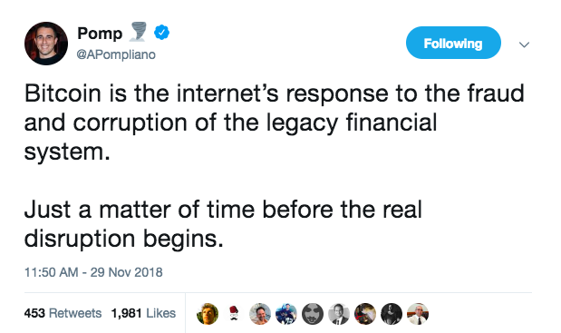

El mercado envía señales para que Bitcoin cree e implemente funciones que satisfagan las demandas no satisfechas o mejoren la seguridad a medida que surgen nuevas amenazas.

-   La demanda por espacio en los bloques aumenta por encima de la capacidad, nace Lightning Network.
-   China toma medidas agresivas contra los mercados de intercambio, LocalBitcoins.com prospera.
-   A medida que Venezuela, Turquía y Argentina continúan hiperinflación su moneda, bitcoin interviene como una reserva de valor no soberana.
-   Blockstream lanza satélites capaces de transmitir transacciones de bitcoins para mitigar eventos catastróficos.

> [!actualizacion]
> LocalBitcoins cerró en febrero de 2023.

### El ciclo de retroalimentación positiva

Bitcoin también se beneficia de incentivos alineados entre usuarios, nodos completos, mineros, mercados de intercambio y comerciantes. A medida que bitcoin se adapta mejor a su entorno, satisface mejor las demandas del creciente número de integrantes en su red, que a su vez reclutan a más participantes para esta. Este circuito de retroalimentación positiva promueve el crecimiento sostenido de la red.

Al igual que el hongo de miel que consume bosques enteros en Oregón, bitcoin se está volviendo más grande y más fuerte con el tiempo.

Dato sobre hongos n. ° 5: escribí la mayor parte de este ensayo mientras consumía hongos medicinales que se utilizan para la mejora cognitiva (Lions Mane, Chaga y Cordyceps).

## Capítulo 2: Bitcoin Como Fenómeno Social (Hongo)

*Explorando los ciclos de sobreexpectación, la etnomicología y el culto a Satoshi*

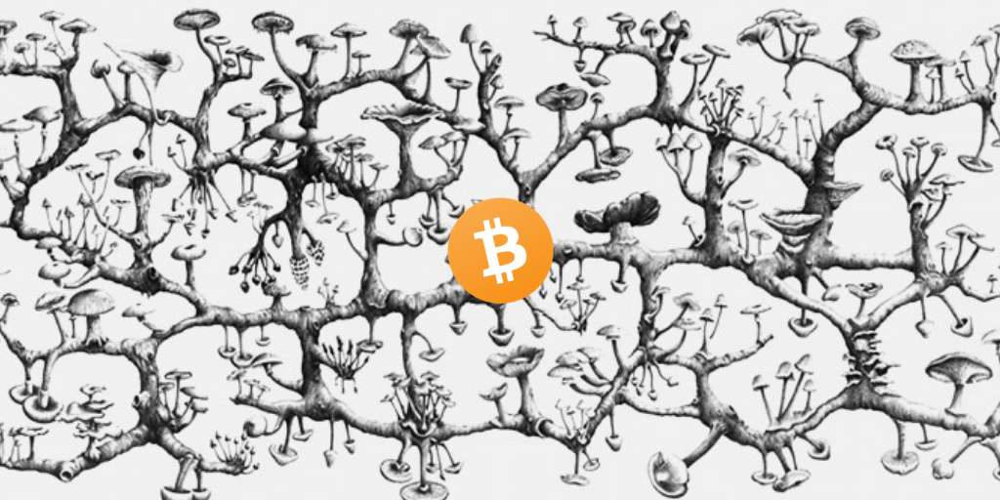

Obra de arte de Richard Giblett

En la primera sección, exploramos la arquitectura descentralizada de Bitcoin a través de los ojos del micelio. Cubrimos el arquetipo de red descentralizada, la antifragilidad, el PoW, el arbitraje, el papel de bitcoin en su ecología y los méritos de la descentralización.

Sin embargo, nuestra historia sobre los hongos aún no está completa. La siguiente etapa en el ciclo de vida de los hongos es reproducirse y todo esto sucede dentro del hongo. Después de alcanzar la madurez, los hongos liberan pequeñas semillas de hongos llamadas esporas capaces de colonizar nuevos territorios.

Aunque el reino de los fungi es bastante extraño en comparación con la vida en el reino animal, los humanos han tenido una relación con los hongos durante mucho tiempo. Históricamente, los hongos han representado misterio, miedo, oportunidad, impermanencia y, para algunos, una reverencia casi de culto.

En el Capítulo 2, exploraremos bitcoin como un fenómeno social a través de los lentes del misterioso hongo.

¡Vamos a sumergirnos!

### Bitcoin es un sistema social ratificado por el código

Bitcoin está conformado por componentes individuales, cada uno con sus propias perspectivas, motivaciones y habilidades. Colectivamente, forman un consenso sobre las reglas del juego de bitcoin. El código simplemente ratifica este consenso social.

De la pieza fundamental de Hasu, “Desempacando El Contrato Social de Bitcoin”:

> “El protocolo de Bitcoin automatiza el contrato que se acuerda en la capa social, mientras que la capa social determina las reglas de Bitcoin, basándose en el consenso de sus usuarios. Son simbióticos: ninguno de los dos sería suficiente sin el otro “.

Los humanos son seres desordenados, emocionales y predeciblemente irracionales. Bitcoin, al estar compuesto por una red de humanos, no es diferente.

### Psicología humana, ciclos de bombo y el método de los hongos

Los hongos existen primordialmente en su “forma de micelio”, el cual puede considerarse como un sistema de raíces subterráneo que conecta árboles y plantas. Los humanos ni siquiera sabrían que existe el micelio, ya que permanece quieto bajo tierra durante la mayor parte de su vida.

Sin embargo, cuando los hongos sienten que las condiciones son favorables (temperatura, humedad, etc.), lanzan otro hongo por encima del suelo. Estos hongos son los órganos sexuales del reino fungi, esencialmente sistemas de suministro de esporas (semillas) fálicos.

Antes de que los hongos rompan el suelo, los otros hongos concentran energía en pequeñas masas de células subterráneas llamadas “cabezas de alfiler” que perduran hasta el momento perfecto. Luego, aparentemente de la nada, los hongos explotan desde suelo y duplican su tamaño cada día hasta alcanzar la madurez.

Dato sobre hongos #6: algunas especies del reino fungi pueden producir hongos con suficiente fuerza para atravesar el asfalto.

Una vez que el hongo está completamente maduro, crece liberando millones de esporas (“semillas” del hongo) antes de descomponerse rápidamente de nuevo en el suelo.1

El hongo solo vive unos días triunfantes y la mayoría de las esporas mueren antes de la infancia, sin embargo, un pequeño porcentaje de las esporas viajará cerca y formará nuevas colonias de hongos. Estas nuevas colonias pueden llegar a permanecer bajo tierra durante varios años antes que el ciclo reproductivo continúe nuevamente.

Dato sobre hongos #7: Las esporas son más livianas que el aire, lo que facilita el viaje. En teoría, las esporas podrían atrapar una corriente ascendente y abandonar la órbita terrestre. Afortunadamente, están dentro de la breve lista de materia biológica capaz de sobrevivir al frío vacío y la radiación del espacio. ¿Alguien dijo Panspermia?

### Los ciclos de bombo de Bitcoin son paralelos a la reproducción de hongos

Para el observador casual, la mayor parte de la vida de Bitcoin es aburrida, los meses pasan con relativamente poca acción. Luego, cuando las condiciones son las adecuadas, el bitcoin cobra vida, crece enormemente y se apropia de la conciencia de los observadores. El precio se “va a la luna”, los medios se inundan de hipérboles y los mensajes directos de la gente normal (“*normies*”) inundan la bandeja de entrada.

Luego, casi tan pronto como sube, bitcoin se desvanece y vuelve a la oscuridad mientras los participantes casuales lo tildan de moda, exageración o un experimento fallido. Al igual que las esporas de hongos, la mayoría de los usuarios nuevos abandonan el ecosistema. Sin embargo, un pequeño porcentaje forma nuevas colonias en la tierra de bitcoin. Estos sobrevivientes del mercado bajista se convierten en nuevos “*hodlers* de último recurso”.

Como es de esperarse, la narrativa del mercado bajista es impulsada por la actividad a nivel de superficie (precio).

### Los detractores de Bitcoin confunden el ciclo de bombo (hongo) con el panorama general (red micelial) 

Los expertos amnésicos se amontonan orgullosamente al proclamar que el bitcoin ha perecido (por 335ª 435ta vez). Los maximalistas de dinero fiduciario (fiat) cantan victoria en Twitter publicando gráficas de 12 meses.

> “¡Te estás perdiendo el micelio por culpa del hongo!” – Nic Carter

Roubini celebra organizando su tercer asado conmemorativo del mercado bajista. Los detractores se reúnen para asar el hongo proverbial  (bitcoin) mientras se dan palmaditas en la espalda.

Sin embargo, siendo justos, bitcoin es complicado. Muchas “personas cripto” todavía piensan que bitcoin es myspace y Ripplecoin es el “estándar”. Como es de esperarse, la mayoría de los periodistas no alcanzan a comprender lo que está sucediendo. Imagine que se le asigna seguir el “ritmo de bitcoin” siendo un periodista bien intencionado común y corriente.

### Mientras que el hongo yace muerto (ciclo de exageración reciente), el micelio (bitcoin) está prosperando bajo tierra.

Como un hongo que ha pasado su mejor momento, la exuberancia de bitcoin decae y el precio se desploma. Este mercado bajista sacudirá a las manos débiles, los fondos de cobertura e inversión de alto riesgo fallarán, las ICOs (ofertas iniciales de moneda) devolverán dinero a los inversores o peor aún, los proyectos fallarán y algunos charlatanes serán expuestos

Sin embargo, los hodlers -nuevos y viejos- de manera colectiva se dirigen a la clandestinidad y en silencio siguen haciendo a bitcoin mejor: construyendo, aprendiendo y formando alianzas.

### Bitcoin mejoró dramáticamente durante el mercado bajista de 2018-2019

-   Las rede Lightning está agrrando impulso 
-   Nuevos servicios como SwanBitcoin hacen que adquirir bitcoin sea más fácil que nunca (compras recurrentes automáticas o *DCA*)
-   La adopción de SegWit aumentó a alrededor del 50% mejorando las transacciones en general
-   Nuevos desarrolladores que están siendo preparados por Jimmy Song y Justin Moon
-   Casa, Pierre Rochard, Nodl y otros hacen que correr un nodo completo sea más fácil
-   Nomics produce datos más limpios que CoinMarketCap
-   Se están construyendo servicios financieros en bitcoin (Unchained, River, Blockfi) 
-   Se han establecido las bases para la financiarización inevitable (Fidelity, Bakkt, etc.)
-   Se están construyendo firmas de Schnorr (especificaciones técnicas/whitepaper/resumen)
-   La “prueba de llaves” incentiva a minimizar el riesgo de rehipotecación + un ecosistema de prueba de estrés + recordar a los nuevos usuarios sobre la auto-soberanía
-   Blockstream ha habilitado las transacciones de bitcoin vía satélite. Las cosas se ponen interesantes cuando se combinan con redes inalámbricas malladas.
-   Surgen métricas para medir la “salud” de criptomonedas, como Realized Cap, Rendimiento Económico, Densidad Económica ($/bytes) y MVRV.
-   Fue superado el pico de la centralización minera (adiós Bitmain)
-   El informe de Coinshares dice que el 77% del consumo de energía de bitcoin proviene de fuentes renovables
-   Nuevos pequeños escritores se paran sobre los hombros de los gigantes para tratar de describir bitcoin de forma novedosa

> [!actualizacion]
> BlockFi quebró en noviembre de 2022.

A medida que pasa el tiempo, las narrativas evolucionan a medida que bitcoin continúa revelándose a sí mismo para los espectadores curiosos.

Hodl Waves de Dhruv Bansal en Unchained Capital

Finalmente, el mercado toca fondo. Los Hodlers se aferran juntos como una Banda de Hermanos creando una base sólida capaz de sostener el crecimiento futuro.

> “Los hodlers son los revolucionarios” – Dan Held

A medida que los hodlers acumulan más bitcoins, el “float fianciero” (oferta que se comercializa activamente) se ve cada vez más limitado. Con una oferta disponible decreciente, cada nuevo usuario ejerce una mayor presión al alza del precio. A medida que aumenta el precio, los medios de comunicación reportan más, se atraen nuevos usuarios y, en poco tiempo, volvemos a otro ciclo de exageraciones.

### Micofobia, María Sabina y el culto de Satoshi

A veces la gente dice que las cripto pueden tener ligeros aires de “culto”. Esto es tanto cierto, como un neto positivo. Antes de entrar en las tendencias religiosas de bitcoin, aprendamos de nuestra historia con los hongos.

El mundo occidental moderno se ha visto afectado por la “micofobia”, el miedo irracional a los hongos. La gente teme lo que no entiende, y seamos realistas: la mayoría de la gente piensa que los hongos son “vegetales”.

Los hongos son extraños. Representan el ciclo de vida o muerte e impermanencia que los humanos temen inconscientemente. *Enfrentarse a nuestra propia mortalidad no es divertido, es mejor simplemente evitarla*.

Sin embargo, no siempre ha sido así. De hecho, los humanos han tenido una relación con los hongos durante mucho tiempo. Desde comida, a medicina, supersticiones y artefactos religiosos. Los hongos pueden salvarte la vida, matarte, alimentarte e incluso alterar tu conciencia.

La evidencia antropológica sugiere que los humanos que se asociaron con hongos tenían una ventaja evolutiva. A medida que más personas comprendan los hongos (y bitcoin), más pronto se darán cuenta de lo importantes que podrían ser.

### Los seres humanos que se asocian con los hongos tienen una ventaja evolutiva

El hombre antiguo dependía de los hongos para sobrevivir en los Alpes al norte de Italia. Ötzi, el Hombre de Hielo que murió hace casi 5.300 años, fue descubierto cargando dos hongos (Amadou y Fomitopsis betulina) atados a una correa de cuero. Uno de los hongos se utilizó para iniciar incendios y se descubrió que el otro tenía propiedades medicinales contra un parásito descubierto en su intestino.

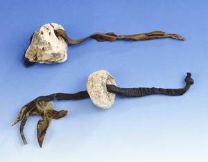

Incluso hace 19.000 años, una mujer de estatus particularmente alto apodada “la dama roja” consumía hongos como lo demuestran rastros [esporas recuperadas de sus dientes](http://blog.crazyaboutmushrooms.com/paleolithic-red-lady-ate-mushrooms-19000-years-ago/). Se desconoce si estos hongos se usaban como comida, para fines religiosos o de otro tipo.

Uno de nuestros ejemplos más antiguos de pinturas rupestres fue descubierto al norte de Argelia, con una antigüedad de aproximadamente 6.000 años. Esta pintura representa al “hombre abeja”, quien tiene hongos en sus manos y creciendo fuera de su cuerpo.

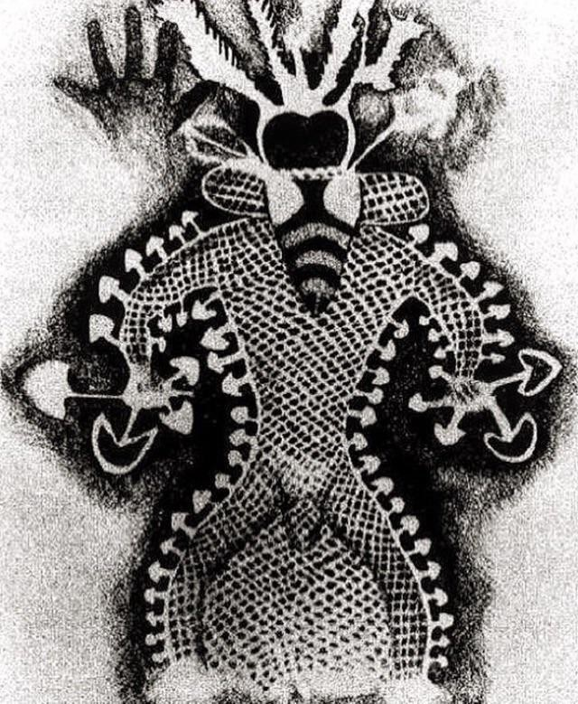

Pintura rupestre: “Hombre abeja” cubierto de hongos. Alrededor del 4000 a.C.

En Siberia, la gente de Koryak veneraba el hongo “matamosca” (Amanita Muscaria), que no es otro sino el icónico hongo “rojo y blanco” famoso por sus apariciones Super Mario Bros. y Alicia en el País de las Maravillas. Los Koryak amaban tanto este hongo que bebían la orina de humanos y renos que recientemente habían consumido el hongo. Aparentemente, se puede reciclar la orina de esta manera hasta 5 veces mejor, logrando los efectos deseados. Cómo descubrieron este fenómeno en un asunto completamente distinto…

Busquen sus sombreros de papel de aluminio, porque [el hongo matamoscas pudo haber inspirado nuestra tradiciones navideñas](https://inhabitat.com/santa-and-the-shrooms-the-real-story-behind-the-design-of-christmas/).

La cultura mazateca de lo que hoy en día es México veneraba al hongo como sagrado. Descubierto relativamente hace poco por Gordon Wasson, quien lo detalló en un famoso artículo en una edición de 1955 de Life Magazine. Desde entonces, muchos turistas han visitado la región de Oaxaca en México en busca de aprender de la famosa chamán de los hongos, María Sabina, así como de sus parientes.

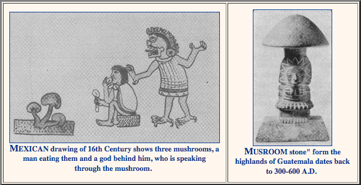

Artefactos relacionado con hongos en América Central

Claramente, el hongo capturó la atención de nuestros antepasados.

### Bitcoin evoca un fervor cuasi religioso similar

Descrito de forma brillante por Yuval Noah Harari, el Homo Sapiens es excepcionalmente capaz de [cooperar de manera flexible en grandes números](https://www.ynharari.com/topic/power-and-imagination/). Esto nos permite acordar colectivamente sobre conceptos abstractos como naciones, dioses y dinero.

Así como los humanos formaron cultos religiosos alrededor del hongo, una forma de describir bitcoin es como un movimiento religioso neo-monetario.

### El Misterio de Satoshi creó una base sólida que creo un ambiente propicio para tendencias religiosas emergentes.

Bitcoin fue creado a través de una concepción inmaculada por un personaje mítico (Satoshi) [que luego se sacrificó por un bien mayor](https://medium.com/@danhedl/planting-bitcoin-gardening-4-4-c88ec5813674).

El Culto de Satoshi inspira a algunos fanáticos a dedicar sus vidas a promover la “buena palabra”. No todos los bitcoiners pertenecen a la misma secta religiosa. Algunos eruditos se aferran al antiguo texto religioso (libro blanco o *whitepaper*), mientras que otros interpretan la visión de Satoshi a través de sus primeras [publicaciones en el foro de Bitcointalk](https://twitter.com/yassineARK/status/1047978606297792513?s=20).

Los desacuerdos sobre las prioridades evidenciados por los debates sobre como escalar bitcoin han llevado a bifurcaciones (*hard forks*) y “congregaciones” fracturadas. Justo como Martín Lutero fracturó la iglesia católica al fijar las “Noventa y Cinco Tesis” en la puerta de la iglesia en 1517.

Roger Ver, quien fue conocido como el “Jesucristo Bitcoin” en sus comienzos difundiendo la buena palabra al regalar satoshis a restauradores afectados por el dinero fiduciario..

Figuras mesiánicas como Faketoshi (Craig Wright) surgen afirmando ser el verdadero Satoshi Nakamoto. Faketoshi, el fundamentalista, promueve su sacramento como la “Visión de Satoshi”, el único bitcoin verdadero tal como se expone en la “biblia” (libro blanco).

> “Los detalles funcionales no están cubiertos en el documento, pero el código fuente estará disponible pronto”. – Satoshi Nakamoto 

No importa cuán incompleto o cuántos errores se encuentren en el libro blanco, Faketoshi afirma que su bifurcación de la cadena es la verdadera “Visión de Satoshi”. Incluso si la bifurcación de Faketoshi ESTABA más cercana a la visión original de Satoshi ([no lo está](https://medium.com/@danhedl/planting-bitcoin-sound-money-72e80e40ff62)), ¿acaso importa?

La respuesta es no. La esencia de bitcoin está íntimamente ligada a la continua evolución del consenso social que rodea al protocolo.

### Cada secta rival es un contrato social en competencia 

El contrato social de Bitcoin confluye en torno a unas pocas reglas simples. Estas reglas acordadas (un punto de Schelling) luego se ratifican en el protocolo de bitcoin que sirve para automatizar el consenso social.

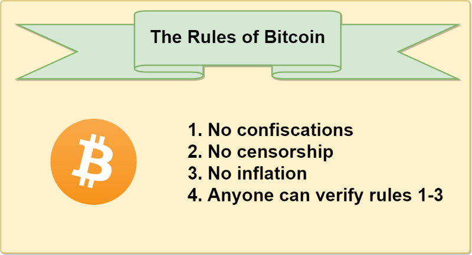

Bitcoin como un Contrato Social de Hasu

Usemos el “gran debate sobre la escala” como ejemplo. Un grupo (BCH) creía que debíamos centrarnos en “pagos baratos” a expensas de la “descentralización”, mientras que el otro (BTC) creía que debíamos priorizar la “descentralización” en la capa base y escalar los pagos fuera de la cadena.

Como secta religiosa competidora en un mercado libre, la pandilla BCash fue libre de bifurcar el código bitcoin y probar su hipótesis. Un año después, está claro que el consenso social en torno a bitcoin no está de acuerdo con el enfoque de BCH, ya que el mercado no valora a BCH ni a ninguna otra bifurcación.

### Los detractores de bitcoin podrían decir entonces que “bifurcar el código de bitcoin infla el suministro”.

Sin embargo, eso es como decir que cuando Zimbabwe imprime más dinero, devalúa el dólar estadounidense. 

En el caso de las bifurcación(es) fallidas de BCash , copiaron el código (protocolo bitcoin) pero fracasaron en movilizar a la gente (capa social), lo que resultó en un activo con un valor relativamente mínimo. Un excelente ejemplo de que bitcoin es resistente a la corrupción de los malos actores al requerir el consenso social para cambiar la red.

En otras palabras, bitcoin reemplaza las suposiciones sociales con supuesstos matemáticos. Profundizaremos en las consecuencias que esto tiene [en nuestra escalabilidad social](https://unenumerated.blogspot.com/2017/02/money-blockchains-and-social-scalability.html) en el capítulo 4. 

### ¿El comportamiento fanático religioso es un indicador de éxito futuro?

Estamos siendo testigos de la monetización de un nuevo producto escaso en tiempo real. Ninguna persona viva ha sido testigo de tal fenómeno.

Para lograrlo realmente, la conciencia colectiva del planeta necesotaría cambiar. Convencer a la gente de que el dinero no es papel verde y no necesita provenir de nuestro gobierno llevará tiempo.

Para superar la inevitable adversidad requerida para crear una nueva moneda de reserva global, en efecto podría hacer falta algo de “celo religioso”. A medida que cada nuevo discípulo se convierte al Culto de Satoshi, aumentan las posibilidades de una hiperbitcoinización.

### Dicho esto, existen riesgos de [politizar demasiado a Bitcoin](https://medium.com/coinmonks/evangelizing-bitcoin-729e6fc4cd2f).

Algunas facciones de la comunidad pintan a bitcoin como un club para economistas austriacos que solo comen carne que ellos personalmente mataron con una de sus muchas armas. Si bien esas cosas están bien, no son pretrequisitos para ser un bitcoiner. No enredemos a los dos expensas de repeler a potenciales bitcoiners.

> *Ahora, asegúrese de convencer a todos sus amigos y familiares de que lean el Nuevo Testamento (*[*El Patrón Bitcoin*](https://www.amazon.com/Bitcoin-Standard-Decentralized-Alternative-Central/dp/1119473861)*) al menos dos veces antes de emprender su próxima Cruzada Contra el Miedo, Incertidumbre y Dudas (FUD por sus siglas en inglés).*

### Las buenas sectas tienen incentivos para evangelizar 

El dinero es el efecto de red definitivo, ya que su valor está determinado por la cantidad de personas con las que uno puede interactuar.

En bitcoin, no solo se captura la imaginación de sus usuarios en un sentido religioso, sino que también existen incentivos financieros para reclutar nuevos miembros hacia la congregación. Con cada nuevo usuario que compra bitcoin, el valor de bitcoin aumenta direccionalmente, beneficiando a los hodlers anteriores. Entonces ese nuevo usuario está incentivado a convertir a sus amigos, quienes luego convierten a sus amigos. Y así, el ciclo continúa.

A medida que aumenta el precio, también aumentan los incentivos para mejorar la seguridad, como lo demuestra el ajuste de dificultad, una de las contribuciones más brillantes de Satoshi.

El precio aumenta → la minería se vuelve más rentable → más mineros contribuyen con el poder de hash → una mejor seguridad hace que Bitcoin sea más valioso.

### El hongo se está extendiendo

Si la depresión del mercado bajista te hace fruncir el ceño, mira bajo la tierra. Hay innumerables desarrollos (algunos mencionados anteriormente) sobre los que ser optimista.

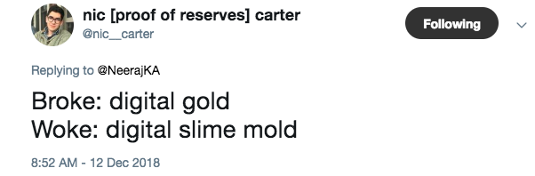

El hongo bitcoin se está extendiendo silenciosamente bajo tierra.

Con cada día que pasa, bitcoin come más dinero fiduciario, se vuelve más robusto, más descentralizado y más Lindy.

Incluso la noche más oscura terminará y saldrá el sol.

## Capítulo 3: Bitcoin es el Antivirus (Medicina de Hongos)

Todos hemos escuchado el increíble potencial de un futuro en Bitcoin. Yo ciertamente estoy de acuerdo con el dinero sólido y la escalabilidad social.

Sin embargo, este drama llevará décadas. ¿Qué pasa si Bitcoin no sobrevive lo suficiente para desarrollar todo su potencial?

Afortunadamente, Satoshi aprendió de los intentos fallidos previos de obtener dinero privado. El código genético de Bitcoin fue diseñado para una máxima supervivencia.

En esta sección, exploraremos el fértil entorno macro y la capacidad de supervivencia de Bitcoin a través del lente de los hongos.

¡Vamos a sumergirnos!

### Abejas melíferas, ácaros varroa y hongos medicinales

En 1997, un micólogo curioso llamado Paul Stamets observó un comportamiento único demostrado por las abejas melíferas. Las abejas hicieron todo lo posible por consumir agua que contenía esporas de hongos, “Hmm, eso es interesante” pensó Paul.

15 años después, Paul comenzó a conectar los puntos. Las abejas melíferas estaban muriendo a un ritmo sin precedentes debido al problema de colapso de colonias (Colony Collapse Disorder o CCD por sus siglas en inglés). Las abejas estaban muriendo en parte, por infestaciones de ácaros varroa que transmiten virus mortales como el virus del ala deformada y el virus del lago Sinaí.

Los productos químicos utilizados en la agricultura moderna envenenan a las abejas, por lo que su sistema inmunológico es demasiado débil para defenderse de los ácaros varroa. A medida que las abejas viajan, estas propagan los ácaros a todas las abejas cercanas, lo que lleva a una disminución en las poblaciones de abejas del 70% desde 2005.

### ¿A quién le importan las abejas?

Las abejas son una especie fundamental responsable de polinizar un gran porcentaje de nuestras fuentes de alimento (aguacates, almendras, etc.). Si perdemos a las abejas, hay innumerables efectos posteriores, como la pérdida de empleos, la destrucción de ecosistemas y una reducción en la seguridad alimentaria.

Volviendo a nuestro micólogo, Paul, quien en 2012 se dio cuenta de algo monumental: los hongos son conocidos por alimentar el sistema inmunológico; y, las abejas deben haber sabido instintivamente que debían beber el agua de los hongos. Paul probó su hipótesis y poco después demostró que usando un simple antivirus de “medicina de hongos”, podemos reducir los efectos del virus del ala deformada y el problema de colapso de colonias en un 80%.

### Nuestro régimen monetario actual es el Ácaro Varroa

Nuestro sistema monetario basado en la banca central es exactamente como unos molestos ácaros varroa que atacan nuestros mercados financieros.

-   Los ácaros varroa son difíciles de matar – los regímenes de moneda fiduciaria se benefician de un monopolio sobre la violencia
-   Propagan virus en todo lo que tocan – las distorsiones del mercado, el amiguismo, la captura regulatoria
-   Efectos negativos descendentes – mala asignación capital y recursos, aumento de la preferencia temporal, limita la productividad humana, aumenta el riesgo de una catástrofe

### Bitcoin es el antivirus (medicina de hongos) que “salva a las abejas”.

Bitcoin (medicina de hongos) previene la propagación de nuestra hegemonía financiera destructiva (ácaros varroa) que marcará el comienzo de una nueva era de logros humanos (salvar a las abejas tiene efectos secundarios como garantizar la seguridad alimentaria).

### Adentrándonos hacia El Gran Desconocido

Nos dirigimos a un período de incertidumbre nunca antes visto por nuestra civilización. El experimento del dinero fiduciario está en un terreno inestable y nuestros sistemas sociales están comenzando a colapsar.

A nivel mundial, nos enfrentamos a niveles de deuda/PIB sin precedentes. La Reserva Federal, el Banco Central Europeo, el Banco de Japón y el Banco de Inglaterra parecen ahora “[poseer una quinta parte de la deuda total de sus gobiernos](https://www.ft.com/content/ae19e60e-81b0-11e7-94e2-c5b903247afd)“. Los bancos centrales se están quedando sin jugadas.

En un último esfuerzo, los bancos centrales europeos están impulsandolas tasas de interés negativas. ¿Realmente vamos a permitir que el sistema bancario hegemónico COBRE a los depositantes por almacenar nuestro fiat digital en sus inseguros bancos panópticos?

### ¿Qué hay de China?

El mercado inmobiliario de China es inestable y desde hace mucho tiempo está apunto de una corrección inminente. Los controles de capital y la búsqueda de rendimientos en una economía que se enfría han llevado a precios inmobiliarios inflados en China. ¿Qué pasa cuando el mercado corrija y todos corran apresurados hacia la puerta? Es mejor tener un plan ₿.

### ¿Y los Estados Unidos?

Actualmente, EE.UU. tiene una deuda de más de 22 billones de dólares, sin embargo, no esperen que los EE.UU. Incumplan sus obligaciones. El ex presidente de la Reserva Federal, [Alan Greenspan, dijo que “Estados Unidos puede pagar cualquier deuda porque siempre podemos imprimir dinero para hacerlo”](https://www.youtube.com/watch?v=Ck3FuTzZvhI)

En un esclarecedor artículo titulado “[*This is Water*](https://www.epsilontheory.com/this-is-water/)”, Ben Hunt explica cómo las tasas de interés suprimidas artificialmente (dinero fácil) conducen a una disminución de la productividad y a una zombificación de nuestros mercados financieros. Este mismo patrón que presagió el colapso why in the worldfinanciero de 08/09.

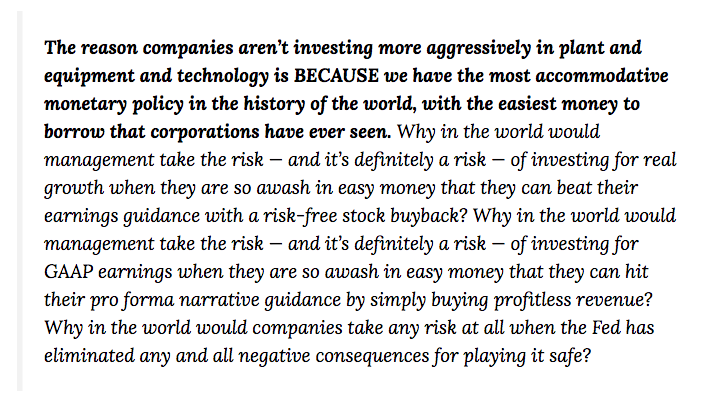

> La razón por la cual las compañías no están invirtiendo de manera más agresiva en equipos para plantas, equipos y tecnología, es PORQUE tenemos la política monetaria más acomodaticia de la historia del mundo, con el dinero más fácil para pedir prestados jamás visto por las empresas. ¿Por qué la gerencia querría asumir el riesgo -y definitivamente es un riesgo- de invertir en busca de crecimiento real cuando están tan inundados con dinero fácil que pueden ganarle a sus expectativas de ganancias con una recompra de acciones libre de riesgo? ¿Por qué la gerencia asumiría el riesgo -y definitivamente es un riesgo- de invertir buscando ganancias GAAP \[Principios de contabilidad generalmente aceptados\] cuando están tan inundados con dinero fácil que pueden alcanzar su narrativa pro forma simplemente comprando rentas sin ganancias? ¿Por qué las empresas asumirían cualquier tipo de riesgo cuando la Reserva Federal ha eliminado toda consecuencia negativa por jugársela por lo seguro?

### Las estructuras sociales están mostrando debilidad

Los países de todo el mundo están tratando de eliminar el dinero en efectivo físico. El efectivo es una herramienta fundamental para la privacidad y es un [requisito para mantener una sociedad abierta](https://coincenter.org/files/2019-02/the-case-for-electronic-cash-coin-center.pdf). Sin efectivo físico (o Bitcoin), los ciudadanos están a merced de la máquina de vigilancia financiera. Sin duda alguna una pendiente resbaladiza.

No podemos olvidar [el sistema de crédito social de China](https://nypost.com/2019/05/18/chinas-new-social-credit-system-turns-orwells-1984-into-reality/). Pronto, la tecnología de vigilancia de China se exportará a todo el mundo.

Los jóvenes no confían en sus gobiernos ni en las instituciones financieras. El 40% de los estadounidenses [no puede permitirse un gasto inesperado de $400](https://www.theatlantic.com/magazine/archive/2016/05/my-secret-shame/476415/). No es de extrañar entonces que el candidato demócrata Andrew Yang ganara fuerza en las encuestas mientras hacía campaña por una Renta Básica Universal.

Un futuro incierto es un sustrato perfecto para generar extremismo. El socialismo democrático, la teoría monetaria moderna (MMT), la política de tasas de interés negativas (NIRP), la guerra contra el efectivo, el consumismo generalizado y la creciente deuda estudiantil son simplemente síntomas de un régimen abandonado.

### Nuestras instituciones heredadas simplemente no están equipadas para lidiar con la complejidad de la era de la información.

Los intentos actuales de arreglar la máquina político-económica desde el interior son impulsados ​​de manera poco irónica por el “calor residual de la máquina de guerra” (vid. [Vinay Gupta](https://twitter.com/leashless/status/1136815499218771968)). Necesitamos un cambio sistémico. Algo cortado de una tela diferente.

### ¿Qué pasa si un régimen monetario sólido (Bitcoin) es un antídoto contra la locura?

Es mi esperanza que en el futuro, miremos hacia atrás a nuestro actual “experimento de banca fiduciaria” con desagrado. ¿Cómo pudimos vivir bajo un régimen tan arcaico durante tanto tiempo?

Al igual que los hongos transforman la materia orgánica muerta y moribunda en una nueva vida, Bitcoin transformará nuestro decrépito sistema bancario en una sólida base financiera sobre la cual puede ocurrir un nuevo crecimiento.

### El gran filtro de las criptomonedas

*¿Puede Bitcoin sobrevivir el tiempo suficiente para alcanzar su máximo potencial*?

Los cypherpunks, anarquistas y voluntarios han estado tratando de crear dinero privado no gubernamental durante mucho tiempo. De hecho, los intentos modernos se remontan a más de 30 años, desde los primeros días del Ecash de David Chaum, hasta E-gold y B-Money.

A pesar del éxito moderado del dinero privado antes de Bitcoin, eventualmente todos fueron cerrados por gobiernos y/o intereses comerciales extralimitados.

### La teoría del gran filtro

La teoría del gran filtro fue desarrollada después de notar nuestra falta de éxito buscando vida inteligente en el universo. ¿Dónde está todo el mundo?

La teoría predice lo siguiente: durante el proceso evolutivo de la vida, existen algunos obstáculos que son extremadamente improbables o imposibles de superar. Ese obstáculo es “El gran filtro”.

Por ejemplo, ¿qué pasaría si cada vez que una civilización avanzada crea bombas nucleares terminara destruyéndose a sí misma? En este escenario, sería estadísticamente improbable sobrevivir mucho tiempo después de inventar las armas nucleares.

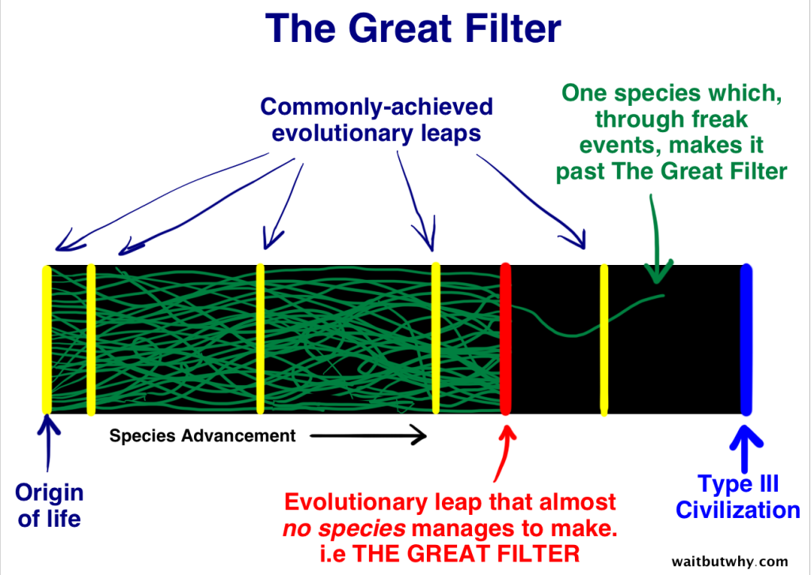

### Para las criptomonedas, The Great Filter está sobreviviendo a los ataques a nivel nacional.

Bitcoin es la única especie monetaria que tiene posibilidades de sobrevivir al gran filtro. Más sobre esto a continuación.

### ¿Por qué un estado-nación o una empresa arraigada querría atacar una forma competitiva de dinero?

En resumen: quien tiene el oro, hace las reglas.

Los dos principales beneficios de controlar la oferta monetaria son la capacidad de inflar la oferta monetaria (impuesto sombra) y el efecto Cantillon.

El efecto Cantillon [describe la expansión desigual de la oferta monetaria](https://www.austriancenter.com/cantillon-effect-populism/). Cuando el banco central imprime dinero nuevo, los más cercanos al dinero (bancos y grandes corporaciones) se benefician del nuevo “dinero barato”. Para cuando el resto de la población recibe el nuevo dinero, la inflación de precios ya ha comenzado.

El efecto Cantillon da como resultado una redistribución de la riqueza de los pobres a los ricos.

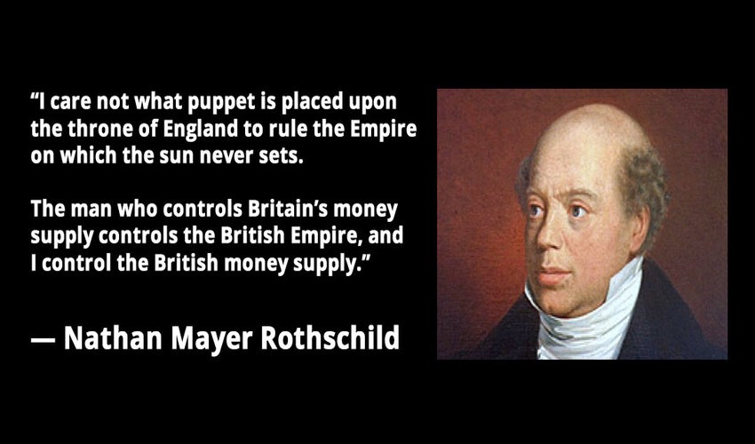

> “No me importa que títere sea colocado sobre el trono de Inglaterra para gobernar el imperio sobre el cual el sol nunca se pone. El hombre que controla la oferta monetaria de Gran Bretaña, controla el imperio británico, y yo controlo la oferta monetaria británica:” –
> 
> Nathan Mayer Rothschild El gobierno hace todo lo posible para proteger su monopolio.

Al igual que el E-gold electrónico en la década de 1990, cualquier criptomoneda competidora puede prosperar en tiempos de paz. Sin embargo, cuando están lo suficientemente agitados, los que están en el poder atacarán para proteger sus intereses. La historia está llena de ejemplos.

Entre 2006 y 2008, el gobierno de EE.UU. amplió la definición de “licencia de transmisión de dinero” (según la Ley Patriota) para apuntar al oro electrónico. En su apogeo, E-gold [procesaba compras por valor de más de $2 mil millones por año](https://en.wikipedia.org/wiki/E-gold#Criminal_prosecution). Desafortunadamente, el gobierno de los EE.UU. aprovechó la naturaleza centralizada del E-gold, derribó la puerta y lo clausuró.

### ¿Moraleja de la historia? A los gobiernos no les gusta la competencia.

De hecho, el congresista Sherman de California pidió recientemente una prohibición completa de Bitcoin. Sherman está sorprendentemente iluminado. Él comprende la verdadera misión de Bitcoin: crear una nueva base monetaria global que no pueda ser utilizada como arma por la superpotencia global de turno.

### Es hora de una nueva estrategia: ser imparable

En 1984, el famoso economista austríaco, Friedrich August von Hayek, sin saberlo, sentó las bases de la estrategia evolutiva de Bitcoin: ser imparable.

“No creo que volvamos a tener un buen dinero antes de que saquemos la cosa de las manos del gobierno, es decir, no podemos tomarlo violentamente de las manos del gobierno, todo lo que podemos hacer es que algunos de una forma indirecta y astuta, es introducir algo que no puedan detener.” – [Friedrich Hayek](https://www.youtube.com/watch?v=EYhEDxFwFRU&feature=youtu.be&t=1124)

Con escalofriante anticipación, Hayek predijo Bitcoin unos 25 años antes.

### Satoshi obviamente leyó a Hayek y entendió “El gran filtro de las criptomonedas”.

En 2009, Satoshi Nakamoto lanzó una implementación del “dinero imparable” de Hayek. Desde el primer día, Bitcoin fue diseñado para sobrevivir al “Gran Filtro”.

> “Mucha gente descarta automáticamente la moneda electrónica como una causa perdida debido a todas las empresas que fracasaron desde la década de 1990. Espero que sea obvio que fue solo la naturaleza de control central de esos sistemas lo que los condenó. Creo que esta es la primera vez que probamos un sistema descentralizado y no basado en la confianza.” – Satoshi Nakamoto

Para que se realice todo el potencial de Bitcoin, debe ser tan resistente que incluso los actores a nivel de estado nacional no puedan matar Bitcoin con éxito. Esto significaba evitar que cualquiera de las partes tuviera un control total sobre el sistema.

### Paralelos con los hongos: la especie más resistente de nuestro planeta

Setas antiguas llamadas prototaxitas

A lo largo de 1.300 millones de años de evolución, los hongos han perfeccionado el arte de mantenerse con vida. A diferencia de las plantas, los hongos no dependen de la luz solar, sino que encuentran/crean su propio alimento. Los hongos no tienen un punto centralizado de falla, convirtiéndolos en organismos resistentes a los ataques. Cuando están lo suficientemente perturbados, los hongos se roban el código genético de sus vecinos ecológicos (Transferencia Horizontal de Genes).

Desde que la vida compleja evolucionó en nuestro planeta, hemos experimentado [5 grandes eventos de extinción](https://cosmosmagazine.com/palaeontology/big-five-extinctions) en los que pereció del 75-96% de toda la vida en la tierra.

Durante cada evento cataclísmico, los hongos heredaron la tierra debido a su naturaleza antifrágil. En un intento por sobrevivir al “gran filtro”, Bitcoin imita estrategias evolutivas efectivas observadas en el reino de los hongos.

### ¿Puede Bitcoin sobrevivir al “gran filtro”?

> *¿Cómo podrías matar a bitcoin? ¿Apagar el internet? ¿Hacer que su uso sea ilegal? ¿Tributarlo hasta el infierno?*

Cualquier criptomoneda que no pueda (de manera factible) sobrevivir a un ataque a nivel de estado nación no tiene sentido. Simplemente estaría retrasando su inevitable desaparición.

Satoshi diseñó el superorganismo Bitcoin para sobrevivir al “Gran Filtro” y resistir la corrupción. Este noble objetivo inició un camino evolutivo que separa bitcoin de todas las demás criptomonedas y “proyectos de blockchain”.

### ¿Significa esto que Bitcoin está garantizado para sobrevivir al gran filtro?

No necesariamente. Es imposible saberlo hasta el día en que sufra un ataque coordinado por parte de un actor a nivel estatal. Sin embargo, Bitcoin es la única criptomoneda existente que tiene la posibilidad de lograrlo. Exploremos algunas tendencias positivas en la caja de herramientas de supervivencia de Bitcoin.

-   **Bitcoin no es regulable.** No tiene ninguna persona o entidad a cargo. El código es libertad de expresión. Cada país tiene su propia jurisdicción competitiva.
-   **La teoría de juegos protege a Bitcoin de un ataque coordinado global.** Los estados-nación compiten entre sí. Es poco probable que las principales naciones cooperen. Si EE.UU. prohíbe BTC, China tiene un incentivo para adoptarlo. Las naciones que no se benefician del régimen actual del USD tienen un incentivo para adoptar BTC.
-   **El PoW de Bitcoin protege el libro mayor con un “escudo de energía”.** Al anclar Bitcoin a un valor económico real (energía), la única forma de cambiar el libro mayor es “volver a hacer todo el trabajo”, es decir, gastar la misma cantidad de dinero en forma de electricidad. vid. [@danheld](https://twitter.com/danheld)
-   **Bitcoin inspira un fervor religioso de sus partidarios.** Los “intransigentes” motivados ideológicamente actúan como un sistema inmunológico. Sobrevivir a las guerras de escala (NYA / S2X) lo demuestra. Los bitcoiners proveen “fuego de cobertura” hasta que Bitcoin atraviesa la puerta. (vid. Bitcoin Sign Guy)
-   **Bitcoin puede evitar la censura de los ISP (proveedores de servicios de internet).** Bitcoin tiene una creciente red de alternativas al internet convencional (redes de malla, radios HAM y satélites). Tal vez incluso enrutar transacciones a través de una red micelial (teóricamente posible).
-   **Bitcoin es una idea, las ideas son eternas.** Bitcoin se propaga como un virus mental. Incluso si de alguna manera se “matara” la forma actual, la idea vivirá para siempre. “Esto del *Snow Crash*, ¿es un virus, una droga o una religión?” Juanita se encoge de hombros. ‘¿Cuál es la diferencia?’” vid. [@nealstephenson](https://twitter.com/nealstephenson)
-   **Las mejoras de privacidad de Bitcoin reducen la imposición tributaria.** CoinJoins y otras tecnologías de privacidad minimizarán la capacidad de los gobiernos para atacar Bitcoin a través de una legislación fiscal predatoria. Gracias [@wasabiwallet](https://twitter.com/wasabiwallet) [@SamouraiWallet](https://twitter.com/SamouraiWallet)
-   **Bitcoin minimiza la capacidad de hacer trampa.** Bitcoin no depende de la confianza. Piense en que “no se puede cambiar”,en lugar de confiar en que un sistema “no se cambiará”. Bitcoin reconoce a los líderes, la gobernanza formalizada y la concentración de poder como vectores de ataque que esperan ser explotados.
-   **Los estados-nación subestiman a Bitcoin.** Esto le da tiempo a Bitcoin para que se vuelva más fuerte y más difícil de matar. El sistema bancario hegemónico está cavando su propia tumba con una pala hecha 100% de pura arrogancia. Si tan solo tuviéramos un plan de respaldo (₿ackup).

> [!actualizacion]
> Samourai Wallet fue cerrada por la justicia de EE.UU. en abril de 2024 y sus fundadores fueron condenados. En junio de 2024 también cerró el servicio de CoinJoin de Wasabi (zkSNACKs).

Hasta ahora, no hemos visto ningún ataque serio a nivel estatal contra Bitcoin. Sin embargo, si Bitcoin continúa absorbiendo valor, existe un incentivo para atacarlo. En el futuro, llamaremos a este período en la vida de Bitcoin la “gran paz”.

### Teoría de juego alternativa: Aquí vive el tejón de la miel

Bitcoin solo necesita convencer a unas pocas superpotencias de que la recompensa de adoptarlo supera el riesgo de atacarlo.

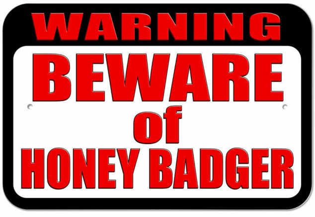

Esta teoría de juego es similar a tener un letrero frente a su casa que dice “Sistema de seguridad instalado” o “Aquí vive un perro bravo”. No importa si realmente tiene un perro o un sistema de seguridad, la amenaza por sí sola actúa como un disuasivo para los posibles atacantes.

Bitcoin tiene un letrero en el patio delantero que dice “Cuidado con el tejón de miel”. Este letrero recuerda a los estados-nación que no pueden matar fácilmente a Bitcoin.

Si los estados-nación intentan destruir su competencia monetaria, destacarán la necesidad misma de bitcoin en primer lugar. Y, sin embargo, cuanto más esperan, más fuerte se vuelve Bitcoin.

### La “Industria Blockchain” es una pista falsa 

Primero, es importante entender que los blockchainers, los stablecoiners, los tokenizadores de valores y las cadenas corporativos NO compiten con Bitcoin. Se ramificaron taxonómicamente y están intentando satisfacer un nicho separado.

En general, la “industria blockchain” es una [pista falsa](https://en.wikipedia.org/wiki/Red_herring), que lleva a empresas y gobiernos a conclusiones falsas. Sirve como una distracción y, sin intención alguna, proporciona fuego de cobertura para Bitcoin.

¿Eso significa que deberíamos evitar a los blockchainers? No. Simplemente confunden la emoción por la blockchain (hongos) con Bitcoin (red micelial).

Primero debemos intentar educarlos, ya que la mayoría de las personas no nacieron Bitcoiners. Dicho esto, los estafadores deliberados merecen ser condenados.

### Cómo la “industria blockchain” ayuda a Bitcoin…

Los blockchainers atan los recursos del gobierno, capacitan a los futuros desarrolladores, confunden a las empresas establecidas y adormecen a los banqueros.

Bancos como JP Morgan capacitarán a cientos de desarrolladores de blockchain. Eventualmente, éstos descubrirán Bitcoin y se despedirán de las aburridas monedas bancarias y, en su lugar, se unirán a la revolución pacífica. ¿JP Morgan está financiando su propia desaparición? Qué poético.

Zuckerberg pronto pondrá una “billetera criptográfica” en el bolsillo de todos. En lugar de competir con Bitcoin, los ZuckBucks puede intentar competir con el dólar americano. De cualquier manera, esto hace que las personas se sientan cómodas con dinero no estatal en su teléfono similar a WeChat y Alipay. La primera censura generalizada de ZuckBucks demostrará muy bien la necesidad de BTC en primer lugar.

Los blockchainers y los estafadores afirman que Bitcoin es antiguo y no se puede escalar. Son Beanie Babies y MySpace. Pintan a Bitcoin como un hongo amigable, pero de uso limitado, que “nos trajo la cadena de bloques”.

Mientras el zeitgeist del blockchain persigue su cola, Bitcoin crece silenciosamente bajo tierra, fusionándose con las “raíces” del sistema financiero heredado, construyendo resiliencia, reclutando voluntarios, infectando mentes curiosas como un hongo cordyceps y preparándose para “El Gran Filtro”.

Si tenemos suerte, los Blockchainers desviarán a las superpotencias globales el tiempo suficiente para que Bitcoin se vuelva “demasiado grande para fallar”.

## Capítulo 4: Bitcoin es un catalizador para la evolución humana (Simbiosis)

Explorando Bitcoin a través del lente de la selección natural, la evolución y la simbiosis.

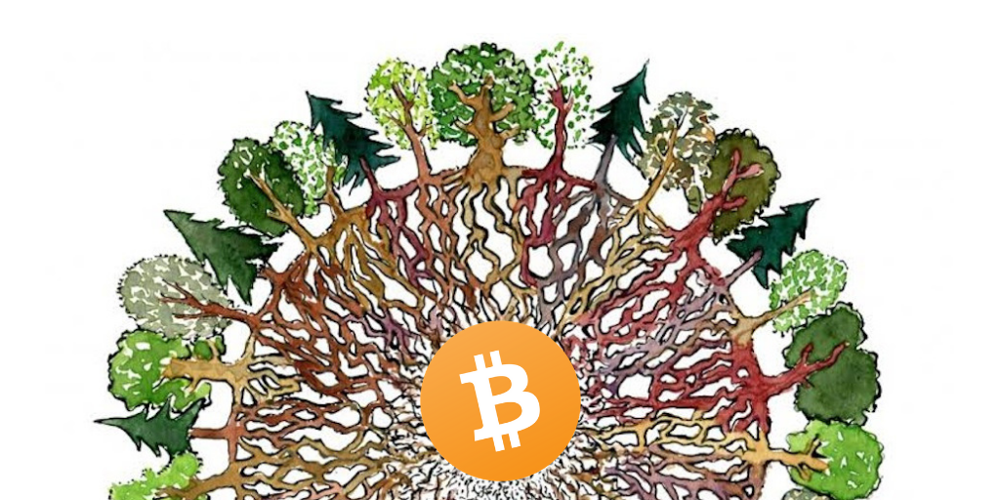

Arte original de FritsAhlefeldt.com

Esta es una historia de cómo las relaciones simbióticas pueden cambiar el curso de la historia para siempre.

Así como los hongos y las plantas formaron una relación simbiótica para colonizar con éxito la tierra seca, los humanos pueden hacer simbiosis con Bitcoin para mejorar individualmente y hacer avanzar a nuestra especie.

En este artículo vamos a explorar Bitcoin como catalizador de la evolución humana, a través del lente de escalas de tiempo geológicas, evolución y simbiosis.

**Definición de simbiosis:** cuando dos organismos diferentes viven juntos en asociación íntima (como en el parasitismo o el mutualismo). Ejemplo: pez payaso y anémonas marinas 

### Arrancando la vida en Terra Incognita

Hace quinientos millones de años, toda la vida biológica vivía en los océanos. La tierra seca como la conocemos era un desierto volcánico estéril desprovisto de vida. Es decir, hasta que las plantas y los hongos formaron una asociación fatídica que cambió el curso de la historia para siempre.

Esta asociación simbiótica creó una cascada de fuerzas evolutivas que condujeron a la creación de toda la vida terrestre, incluido el homo sapiens.

Avanzando hacia la modernidad, los humanos ahora se organizan en torno a tecnologías basadas en redes, como el internet y Bitcoin, que son reencarnaciones del antiguo arquetipo micelial del que surgimos.

Respira profundamente. La vida es increíble.

### Ok, entonces, ¿cómo llegamos aquí?

Primero, una lección rápida de biología. Los organismos se clasifican como *autótrofos* o *heterótrofos*.

Los *autótrofos* son organismos que elaboran su alimento. Por ejemplo: las plantas convierten la luz solar y el dióxido de carbono en alimento a través de la fotosíntesis.

Los *heterótrofos* son organismos que encuentran su alimento. Por ejemplo: los leones comen gacelas y los hongos producen enzimas para digerir su entorno externamente.

Al igual que los colonos humanos, los organismos que colonizan nuevos territorios son más vulnerables durante los primeros días. Para que los hongos colonizaran la tierra seca (terra), necesitaban asegurar una fuente de alimento confiable.

Los hongos domesticaron eficazmente las máquinas de fotosíntesis (algas) para aprovechar una fuente de alimento autosuficiente. Podemos pensar en estas algas como pequeños paneles solares atornillados a redes de hongos que hicieron posible la colonización de tierras secas vírgenes.

Poco después de establecerse, los hongos comenzaron a digerir la roca volcánica sobre la cual se asentaron. En última instancia, esto liberó valiosos nutrientes que luego se intercambiaron con otros hongos, algas, bacterias, etc. Juntos, estos primeros colonos arrancaron la vida en tierra firme. Veamos cómo se compara esto con Bitcoin.

### Cómo Satoshi arrancó Bitcoin embrionario

Para colonizar internet (terra incognita) con una nueva forma de dinero, Satoshi necesitaba formar una asociación simbiótica.

Afortunadamente, encontró la asociación perfecta y tomó una serie de decisiones sabias que maximizaron las posibilidades de supervivencia de Bitcoin durante la fase de arranque.

### Cómo satoshi “se asoció con las algas” para impulsar la vida de Bitcoin en Internet

-   La alta tasa de emisión temprana recompensó desproporcionadamente a los primeros usuarios (la tasa de emisión temprana incluso podría haber sido *demasiado* agresiva) 
-   Se lanzó a la lista de correo de criptografía (si alguien podía incubar Bitcoin, eran los Cypherpunks en esa lista de correo electrónico)
-   Medir el momento de su lanzamiento durante la crisis financiera del 08/09 (¿fue esto un golpe de suerte a ciegas?)
-   El mensaje de Satoshi en el bloque de génesis “Canciller a punto de segundo rescate” (grito de guerra para ganar partidarios motivados ideológicamente)

### Mutualismo o parasitismo: Examinando la Simbiosis Cypherpunk-Satoshi

¿Fueron las algas cómplices de la asociación fúngica (mutualismo)? ¿O los hongos se estaban aprovechando de la capacidad de las algas para producir alimento a expensas de las algas (parasitismo)?

Parecería ser mutualismo. Es posible que las algas hayan sido secuestradas inicialmente, sin embargo, a cambio de la fotosíntesis, obtuvieron un sistema de seguridad micelial y la oportunidad de colonizar un nuevo nicho.

¿Fueron cómplices los cypherpunks y se beneficiaron de la asociación (mutualismo)? ¿O Satoshi se aprovechó de los cyberpunks porque necesitaba una estrategia de distribución inicial (parasitismo)?

> “Es muy atractivo para el punto de vista libertario si podemos explicarlo adecuadamente. Aunque mejor con el código que con las palabras “. – Satoshi Nakamoto

La mayoría de los cypherpunks descartaron Bitcoin inicialmente, sin embargo, unos pocos (en particular: Hal Finney) se unieron. Teniendo en cuenta que fueron los primeros en aprender sobre Bitcoin, tuvieron la oportunidad de adquirir las unidades monetarias nativas de Bitcoin a cambio del costo marginal de la electricidad para minar (esencialmente nada). Con la ventaja ver todo en retrospectiva, adquirir Bitcoin durante los primeros años conduciría a una riqueza sin medida.

> “La posibilidad de generar monedas hoy con unos pocos centavos de tiempo de cómputo puede ser una buena apuesta, ¡una recompensa de alrededor de 100 millones a 1!” – Hal Finney

**Evolución por selección natural (Económica)** 

> “No es el **Dinero** más fuerte el que sobrevive; ni el más inteligente. Es el que se adapta mejor al cambio.” – Charles Darwin

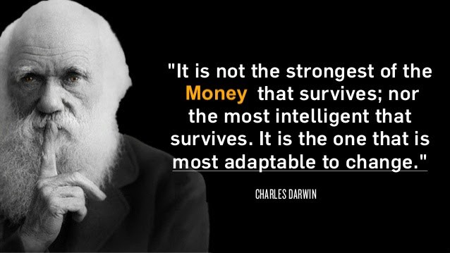

Con las condiciones iniciales de vida en la tierra puestas en marcha, la alianza entre hongos y plantas puede comenzar a dar la bienvenida a nuevos participantes del mercado (organismos) para que ingresen al ecosistema.

El reino fungi interactúa con el mundo a través de la química. Secretan enzimas para digerir externamente su entorno. La roca volcánica era el único restaurante de la ciudad. Estos primeros hongos liberaron recursos moleculares al metabolizar la roca volcánica sobre la que se encontraban.

Esto permitió una proto-economía compuesta por hongos, plantas y bacterias primitivas. Intercambiaron moléculas esenciales necesarias para las formas de vida dependientes del carbono (carbono, nitrógeno, oxígeno, etc.).

Los hongos esencialmente estaban convirtiendo rocas en fichas (tokens) biológicas fungibles. Estas fichas de biología se intercambiaron luego sobre rieles miceliales que conectan toda la vida cercana. Los hongos crearon el mercado y facilitaron el comercio, lo que provocó una explosión de biodiversidad en tierra firme.

### Terra toma su primer aliento

Antes de que las plantas colonizaran la tierra seca, la atmósfera de nuestra tierra no era muy hospitalaria. Como saben, las plantas inhalan CO2 y exhalan O2. Esto finalmente llevó a la formación de nuestra atmósfera rica en oxígeno: el planeta Tierra estaba respirando por primera vez.

En cierto sentido, los hongos desencadenaron una dinámica de libre mercado en un nuevo entorno, lo que condujo a una increíble proliferación de vida. Ahora exploremos los paralelismos con Bitcoin.

### Bitcoin permite un nuevo paradigma económico

Justo cuando surgen nuevos organismos (a través de la especiación) para ocupar nichos recién creados en tierra firme, Bitcoin evoluciona su ADN (código) para producir nuevos fenotipos (características novedosas) para aprovechar nuevos nichos.

En otras palabras, Bitcoin permite nuevos casos de uso financiero que antes no eran posibles. Esto aumenta el tamaño del pastel económico, generando riqueza para la sociedad.

### Novedades proporcionadas por Bitcoin:

-   La primera y única implementación de la escasez absoluta (difícil de exagerar)
-   Un sistema de conciliación global, casi instantáneo y apolítico
-   Dinero neutral que no es fácilmente capturado por intereses especiales.
-   Medio de intercambio sin censura para los mercados negros/grises
-   Democratización de los servicios financieros básicos
-   Reserva de valor no soberana con una barrera de entrada insignificante

### Bitcoin y el Micelio mejoran el comercio 

Las redes miceliales actúan como una capa de transporte de recursos y una red de comunicaciones que conecta los organismos en la biosfera. Esto permite a los organismos intercambiar voluntariamente recursos y conocimientos entre distintas especies. El aumento del comercio conduce a una mayor especialización (división del trabajo), aumentando aún más la biodiversidad (riqueza y resiliencia) en el ecosistema.

Actualmente, nuestros gobiernos forman monopolios económicos que impiden que muchos ciudadanos accedan a los mercados globales.

Piensen en todo el capital humano improductivo aislado en países como Irán, Venezuela y Argentina. Sin acceso a un lenguaje económico común (Bitcoin), muchas personas no pueden participar en el comercio mundial.

A medida que Bitcoin se vuelve omnipresente, da rienda suelta a la productividad humana, lo que conduce a una mayor innovación, especialización y comercio. Ya estamos viendo algunos ejemplos básicos, como los [trabajadores autónomos en Venezuela que utilizan Bitcoin como moneda puente para acceder al USD](https://medium.com/open-money-initiative/latin-american-bitcoin-trading-follows-the-heartbeat-of-venezuela-71a28cb86ba0), efectivamente evadiendo los controles financieros.

Podemos extrapolar “Bitcoin se utiliza como moneda puente” a una visión más amplia del futuro en la que todos hablan el mismo lenguaje económico. Un mercado global de talento conduce a que se produzcan más bienes y servicios por un precio más bajo. Sin mencionar que el aumento del comercio con los países en desarrollo ayudará a sacar a las personas de la pobreza.

### Bitcoin permite la evolución económica por selección natural 

La evolución darwiniana por selección natural es un motor biológico diseñado para recompensar a los actores exitosos y eliminar a los fracasados. Cuando el león se come al antílope, muere, nadie rescata al antílope. La naturaleza tiene piel en el juego. Este circuito de retroalimentación es crucial. Los individuos son frágiles para garantizar que el sistema sea antifrágil.

La economía basada en el mercado es un motor diseñado para buscar usos más eficientes del capital recompensando las empresas exitosas y castigando a las fracasadas. Sin embargo, nuestra forma actual de “capitalismo” se parece más al amiguismo o como dijo [Travis Kling](https://twitter.com/Travis_Kling?ref_src=twsrc%5Egoogle%7Ctwcamp%5Eserp%7Ctwgr%5Eauthor): “socialismo para los ricos”.

En lugar de dejar que las empresas fracasen, las rescatamos. Esto da como resultado incentivos rotos que crean un riesgo moral que hace que todo el sistema sea más frágil. Sin mencionar que daña desproporcionadamente a la clase trabajadora. *Cara yo gano, cruz tú pierdes*.

Un sistema monetario sólido (como Bitcoin) mejora este motor económico al ajustar el mecanismo de retroalimentación que recompensa la creación de valor y castiga el fracaso. En un mundo de Bitcoin, los rescates no son realmente posibles porque la expansión monetaria está restringida por una base monetaria fija. Bitcoin garantiza que las personas/empresas individuales sean frágiles para garantizar que el sistema económico siga siendo antifrágil.

En otras palabras, Bitcoin aumenta la cantidad de “piel económica en juego”, lo que mejora el ciclo de retroalimentación que conduce a la evolución económica por selección natural. Darwinismo económico para la victoria.

### Domando al Tenrec

Tenrec: el antepasado de todos los mamíferos placentarios vivos

Debido a una relación simbiótica con hongos y plantas, y la evolución por selección natural, nuestro punto azul pálido planetario se transformó de una roca estéril al jardín del Edén. Verdaderamente maravilloso.

Acerquémonos al final del período Cretáceo (hace unos 65 millones de años).  El planeta estaba dominado por dinosaurios tanto en tierra como en nuestros océanos. Los mamíferos apenas eran relevantes. *Narrador: pero las cosas estaban a punto de cambiar*.

Un meteorito gigante se estrelló en lo que hoy en día es México, acabando con los dinosaurios y la mayor parte de la vida en el planeta tierra. El impacto provocó un aumento a corto plazo en las temperaturas de la superficie, seguido de un enfriamiento prolongado debido a que los escombros bloqueaban la luz solar.

Aunque la mayoría de los organismos fueron sacrificados durante el cataclismo, algunas especies prosperaron durante el caos. Los más notables de nuestra historia son los hongos (por supuesto) y un pequeño mamífero parecido a una musaraña conocido como Tenrec (sorprendente).

Sin luz solar, la mayoría de las plantas perecieron rápidamente. Sin embargo, los hongos prosperaron porque no dependen de la luz solar (recuerde que encuentran su propia comida). Los hongos estaban descomponiendo felizmente a todos los organismos recién fallecidos.

### ¿Qué sucede con el Tenrec?

A medida que las temperaturas bajaron y los alimentos escasearon, la mayoría de los animales que sobrevivieron al choque inicial fueron asesinados por hongos patógenos o, finalmente, murieron de hambre cuando la cadena alimentaria mundial se paralizó. Pero, no el Tenrec.

Los tenrecs son humildes mamíferos parecidos a las musarañas que vivían bajo tierra, lo que los protegía de las condiciones hostiles en la superficie. Sus alimentos favoritos (insectos y plantas acuáticas) no se vieron afectados relativamente.

Los tenrecs pueden [hibernar hasta por 9 meses a la vez](https://www.ncbi.nlm.nih.gov/pmc/articles/PMC4213634/). Esto los protege de la volatilidad a corto plazo y les capacita para sobrevivir a sus competidores. *El mejor ataque es una buena defensa*.

Bitcoin me recuerda al tenrec, ambos viven bajo tierra y prosperan gracias a la volatilidad. Al igual que el tenrec, Bitcoin simplemente necesita sobrevivir a su competencia.

> “Si sientas junto al río el tiempo suficiente, verás flotando los cuerpos de tus enemigos.” – Sun Tzu

### Da gracias al tenrec

Resulta que el tenrec es el [ancestro común de todos los mamíferos placentarios vivos](https://www.sciencemag.org/news/2013/02/ancestor-all-placental-mammals-revealed#). En otras palabras, la única razón por la que tanto tú como yo estamos vivos hoy es porque el diminuto tenrec sobrevivió al apocalipsis que acabó con los dinosaurios hace 65 millones de años.

### Parados sobre los hombros del micelio

Aunque los mamíferos tuvieron un comienzo lento, realmente hemos llegado a lo nuestro en el último millón de años. Un gran simio en particular, el homo sapien, logró el dominio global en un período de tiempo relativamente corto.

La evidencia actual sugiere que los humanos solo han existido durante unos ~500k años, lo que nos convierte en una especie relativamente joven. A modo de comparación, los elefantes modernos han existido durante ~5 millones de años.

Al igual que nuestros antepasados ​​fúngicos, los seres humanos han formado relaciones simbióticas con nuestro medio ambiente a lo largo de la historia. De hecho, debemos nuestras vidas a los organismos basados ​​en redes que llamamos hongos.

### Los seres humanos comienzan a asentarse

Un organismo fúngico especialmente relevante es el Saccharomyces cerevisiae, también conocido como levadura de cerveza.

La agricultura humana parece haber comenzado hace unos 11.500 años ([aunque podría ser mucho más antigua](https://grahamhancock.com/america-before/)). Curiosamente, los primeros cultivos que labramos fueron también los mejores granos para elaborar cerveza. Esto plantea la pregunta: ¿nos asentamos por la comida/estabilidad o para elaborar más cerveza?

Resulta que las bebidas fermentadas (cerveza, vino, etc.) proporcionaron una forma segura de mantenerse hidratado, ya que el agua a menudo contenía patógenos que mataban al hombre antiguo.

Aunque no lo sabíamos en ese momento, los humanos establecieron relaciones simbióticas con los hongos para producir opciones de bebida saludables que salvaron muchas vidas.

Aunque desconocido para la mayoría de las personas modernas, todavía dependemos en gran medida de nuestros aliados fúngicos en la actualidad. Sin hongos, dile adiós a la cerveza, al vino, el chocolate, el pan y muchos medicamentos como la penicilina.

Como el hombre antiguo se asoció con los hongos para sobrevivir, nosotros los modernos tenemos una oportunidad similar de asociarnos con Bitcoin …

### Lograr la simbiosis con Bitcoin

Hemos establecido cómo los hongos y Bitcoin se asocian simbióticamente con otros organismos para impulsar la vida y construir ecosistemas antifrágiles. Ahora terminemos explorando cómo los humanos pueden asociarse con Bitcoin para mejorar individualmente y hacer avanzar nuestra especie.

> “El verdadero problema de la humanidad es el siguiente: tenemos emociones paleolíticas; instituciones medievales; y tecnología divina.” – E.O. Wilson

El dinero es el mecanismo de coordinación más importante para la sociedad y nuestro sistema fiduciario actual está llevando a nuestra especie hacia un precipicio. En lugar de discutir el rojo Vs. azul, es hora de que abordemos la causa fundamental de nuestro malestar social. Es hora de destrabar el dinero.

El dinero fiduciario ha aparecido periódicamente a lo largo de la historia, sin embargo, esta es la excepción, no la regla. A lo largo de la mayor parte de la historia, los humanos se coordinaron en torno a un mercado libre de dinero. Oro y plata, principalmente. Es hora de despertar de nuestro coma de dinero fiduciario.

### Bitcoin es un fenotipo extendido para la humanidad

[Los fenotipos extendidos](https://www.ncbi.nlm.nih.gov/pmc/articles/PMC2658563/) son comportamientos que amplían las capacidades naturales de un organismo. Las represas de castores son un buen ejemplo. Bitcoin es un fenotipo extendido para la humanidad: reduce la confianza necesaria para que una sociedad global comunique valor, lo que permite una cooperación más sofisticada.

Esto ofrece una oportunidad única para rediseñar la sociedad basada en la separación del dinero y el estado, también conocido como “dinero natural”. Una gran victoria para la humanidad. Como tal, es nuestro deber formar simbiosis con muchísima fuerza.

Respire hondo otra nuevamente, ya que tenemos la suerte de estar vivos durante ese punto de inflexión.

### Todo comienza con personas que forman simbiosis con Bitcoin

Bitcoin fue el activo de mejor rendimiento de la última década. Esto creó una riqueza inimaginable para quienes lo adoptaron tempranamente. Además de las ganancias financieras, los individuos también pueden beneficiarse de Bitcoin de otras formas. Curiosamente, los valores imbuidos en bitcoin parecen contagiarse a sus seguidores.

Como activo deflacionario, Bitcoin nos enseña a retrasar el consumo hoy para obtener mayores beneficios mañana (preferencia de tiempo baja).

En un mundo lleno de incertidumbre, Bitcoin ofrece algo sobre lo que ser optimista. En lugar de cambiar el sistema desde adentro, podemos destinar nuestra energía en un sistema paralelo.

Bitcoin nos obliga a asumir la responsabilidad personal de nuestra riqueza,algo quer es tanto una bendición como una maldición. En un mundo que no valora la responsabilidad personal, Bitcoin sirve como una llamada de atención.

Asociarse con Bitcoin es bueno para el individuo, pero ¿es bueno para la humanidad?

### La criptografía se trata fundamentalmente de defensa

Bitcoin es la mayor implementación de criptografía de clave pública que se haya visto en el mundo. Un mundo con una criptografía sólida cambia el equilibrio de poder hacia la defensa. Defensa de la tiranía, la censura, los gobiernos dominantes y la vigilancia del capitalismo.

La criptografía nos permite hacer valer nuestros derechos naturales. Bitcoin protege la libertad de expresión, asegurando que podamos “votar con nuestro dinero”. La libertad de expresión es la base de las sociedades abiertas. Formar simbiosis con Bitcoin preserva las libertades para nuestras futuras generaciones, una causa por la cual vale la pena luchar.

### Bitcoin metaboliza la infraestructura de Fiat

Podemos usar hongos para limpiar derrames de petróleo, detener la erosión, crear pesticidas naturales e incluso [descomponer los desechos nucleares en Chernobyl](https://www.cnet.com/news/fungi-found-in-chernobyl-feeds-on-radiation-report-says/). De manera similar, Bitcoin se puede utilizar para limpiar nuestra infraestructura fiduciaria en ruinas.

Dato sobre hongos: los hongos ya han resuelto muchos de nuestros problemas, pero apenas los entendemos. La micorremediaciónes un nuevo campo prometedor que aprovecha nuestra comprensión de la micología para mejorar nuestro entorno, esencialmente “micología aplicada”.

Estamos viviendo un período de expansión monetaria sin precedentes. Bitcoin como un bien monetario de oferta fija sirve como una fuerza contraria a la impresión de dinero sin restricciones. A corto plazo, las personas usan Bitcoin para evitar los controles de capital y protegerse contra el riesgo de la moneda local. A largo plazo, Bitcoin puede forzar el conservadurismo a los bancos centrales, comenzando por las naciones en desarrollo.

En el país más rico del mundo (Estados Unidos), la persona promedio trabaja durante 40 años y nunca sale adelante. El sistema heredado fue diseñado para desviar la riqueza de abajo hacia arriba, sobre todo durante cada crisis financiera. Dado que el tiempo es dinero, este sistema de transferencia de riqueza forzosa debe considerarse [un robo de tiempo sistemático](https://twitter.com/misir_mahmudov/status/1237497849505550337). No se equivoquen al respecto, esto debería radicalizarnos.

Cada vez que compras Bitcoin, estás vendiendo dólares. Es hora de unirse a la revolución pacífica. Ocupa los UTXOs.

### Costo de oportunidad de retrasar Bitcoin

Piense en todos los desechos creados a partir de un sistema fiduciario. Los rescates bancarios, las guerras interminables y la mala asignación de capital se reducen en gran medida (si no se eliminan) en un sistema de dinero fuerte.

Cada año que lo retrasamos, incurrimos en costos de oportunidad crecientes. En lugar de destruir la riqueza innecesariamente, ¿cómo podemos invertir un capital precioso en causas dignas?

> “Nos prometieron autos voladores y todo lo que obtuvimos fueron 140 caracteres” – Peter Thiel

¿Qué hay de colonizar Marte? ¿O reducir el riesgo de que la civilización “acabe”, producto de las pandemias o la guerra nuclear? ¿Qué hay de las esferas de dyson? ¿Minería de asteroides? ¿O eliminar las enfermedades infecciosas y la mortalidad infantil para siempre?

Pongamos en marcha el renacimiento de Bitcoin.

### Bitcoin lleva el riesgo puesto en la manga

En vez de persistir en un sistema financiero opaco diseñado para enriquecer a unos pocos a expensas de muchos, adoptemos un sistema financiero más transparente. Un sistema donde los riesgos están al descubierto para que todos los vean, en lugar de enterrarlos bajo la burocracia y el engaño.

El dinero fiduciario es un sistema inorgánico similar a una granja industrial de monocultivo. Planificado centralmente, susceptible a enfermedades, insostenible y frágil. El fiat ofrece estabilidad de precios a corto plazo, a expensas del riesgo sistémico a largo plazo. En otras palabras, no tenemos en cuenta los “riesgos extremos”, como el colapso de los bancos o las pandemias mundiales. Ambos ejemplos conllevan a que la transferencia de riqueza aumente las brechas de riqueza.

Bitcoin, por otro lado, es un sistema orgánico similar a una selva tropical antigua. Competencia feroz, crecimiento incremental, sostenible y antifrágil. Bitcoin acepta la volatilidad de los precios a corto plazo a cambio de una estabilidad sistémica a largo plazo.

Bitcoin hace posible un sistema monetario antifrágil, una gran victoria para la humanidad.

### Bitcoin promueve la independencia energética

Bitcoin tiene una demanda insaciable de energía de bajo costo. Los mineros recorren la tierra en busca de activos energéticos baratos, actuando como compradores de energía de último recurso. Esto incentiva la innovación en la producción de energía de bajo costo, como el exceso de gas natural y la hidroeléctrica varada.

La tasa de hash ha aumentado constantemente, incluso cuando el precio no lo está. Los mineros de Bitcoin son BTC intrínsecamente largos. ¿Qué saben los mineros que tú no? En lugar de hundir la cabeza en la arena, es hora de asociarnos con la realidad.

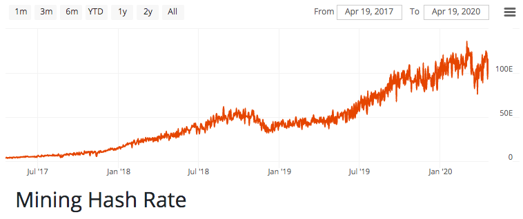

La tasa de hash de Bitcoin continúa aumentando

Supongamos que Bitcoin continúa su camino de monetización. Eventualmente, la minería de Bitcoin se convierte en una cuestión de seguridad nacional. Aquellos países que produzcan su propia energía (y minen Bitcoin) tendrán una mayor ventaja geopolítica sobre los países que dependan de la importación de energía.

Dato sobre hongos: los combustibles fósiles (hidrocarburos) transportan la energía de la luz solar antigua originalmente capturada por las plantas a través de la fotosíntesis. Curiosamente, todo el suministro de carbón de la tierra se formó durante el período “carbonífero” que terminó hace unos 300 millones de años cuando los hongos aprendieron a digerir la lignina. La lignina es el polímero que le da a las plantas su estructura rígida Y es un prerrequisito para formar carbón. El carbón es simplemente material vegetal que fue “medio digerido” por hongos primitivos. Los hongos modernos digieren la lignina que evita que se produzca carbón nuevo.

Esto crea otro incentivo para que las naciones aseguren las fuentes de energía locales, ya sea de combustibles fósiles, plantas nucleares, energías renovables o de otro tipo. A largo plazo, un mundo con una producción de energía más localizada es un mundo más robusto. Como los hongos, Bitcoin es una membrana invisible que mejora la salud del ecosistema que ocupa.

### La humanidad se fusionará con el dinero neutral

El juego geopolítico actual recompensa a quienes ejercen influencia sobre la producción de dinero. Esto se traduce en grandes estados poderosos, dinero politizado y grupos de intereses especiales que compiten por la influencia.

> “Denme el control del dinero de una nación y no me importa quién haga las leyes”. – Mayer Amschel Rothschild

En cambio, Bitcoin es un dinero neutral. Es un sistema diseñado para evitar que intereses especiales ejerzan una influencia indebida sobre el dinero. Esto crea un juego más justo.

¿Por qué un gobierno cedería el control de su imprenta?

En un régimen post-dólar, los estados-nación no se pondrán de acuerdo sobre una nueva moneda de reserva. Lógicamente, cada estado prefiere liquidar las deudas en su propia moneda. Ya estamos viendo grietas en la hegemonía del dólar provenientes de lugares como China, Rusia e Irán. Bitcoin se adapta bien a este problema.

Bitcoin es completamente auditable, con límites estrictos y ofrece una conciliación definitiva rápida. El dinero neutral perfecto para que los estados-nación en desconfianza puedan liquidar sus deudas. Bajo esta luz, Bitcoin es dinero para los enemigos.

Es hora de mejorar la humanidad formando simbiosis con Bitcoin.

### Concluyamos

La historia de la vida en la tierra se puede resumir así: el éxito llega a quienes establecen relaciones simbióticas con organismos basados ​​en redes (en particular, hongos).

Como humildes simios, es nuestro deber formar una relación simbiótica con Bitcoin. Debemos esforzarnos por comprender este fenómeno para poder guiarle durante la adolescencia.

Al igual que los hongos coplonizando la tierra seca fueron el catalizador de la evolución biológica en terra, Bitcoin es un catalizador de la evolución humana.

Acojamos a Bitcoin o suframos el destino de los dinosaurios.

Gracias,

Brandon

Conectémonos : ven a saludarme en [Twitter](https://twitter.com/bquittem) y [regístrate para recibir un correo electrónico cuando publique nuevos artículos](https://marvelous-innovator-6728.ck.page/32ea4dd043).

Te avisaré cuando publique un nuevo artículo y si/cuando convierta estos pensamientos en un libro.

P.D.: ¿Quién conduce el barco?

Los hongos hicieron posible una vida compleja en la tierra, que finalmente dio paso a los humanos. Ahora los humanos están creando internet (y Bitcoin), que encarnan el mismo arquetipo micelial del que venimos.

No elegimos conscientemente imitar redes miceliales en estos diseños. Sin embargo, los animales se ramificaron taxonómicamente de los hongos hace millones de años. Los humanos cerraron el círculo, el estudiante se convirtió en el maestro.

¿Era esto inevitable?

El arquetipo micelial parece estar incrustado en nuestra especie. Con el tiempo, las estructuras basadas en redes aparecen continuamente, ya sea debido a la sabiduría innata o la suerte ciega. Estas tecnologías de red inspiradas en el micelio, una vez descubiertas, parecen persistir debido a su naturaleza antifrágil.

Mucha gente afirma que “descubrimos Bitcoin”. Simpatizo con esta idea, sin embargo, es más exacto decir que *re*descubrimos Bitcoin. El arquetipo micelial es una propiedad emergente de la biología, lo que significa que Bitcoin era inevitable.

**. . .**

Gracias por leer El Micelio del Dinero.
