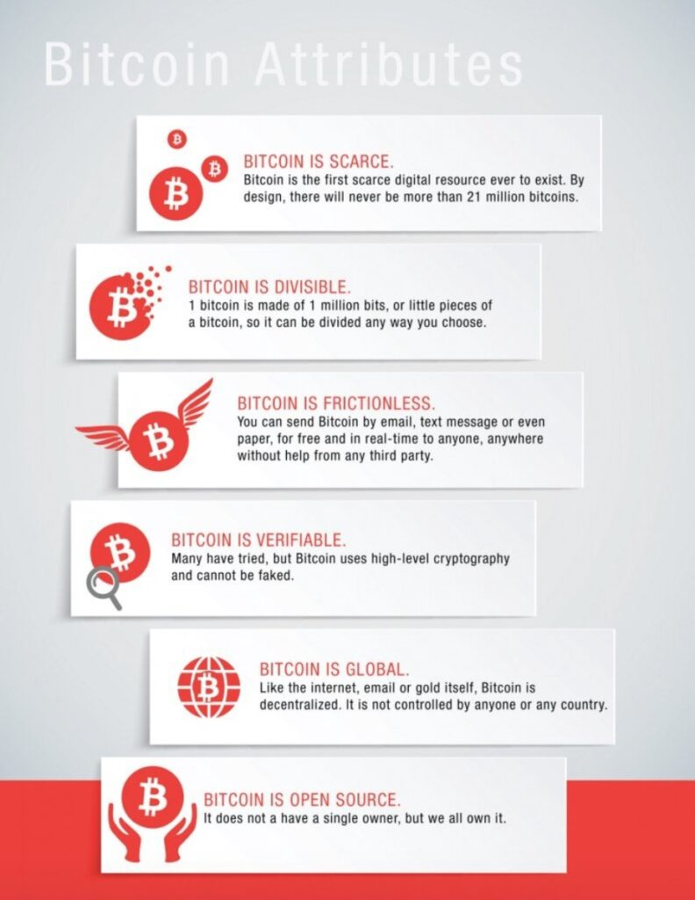
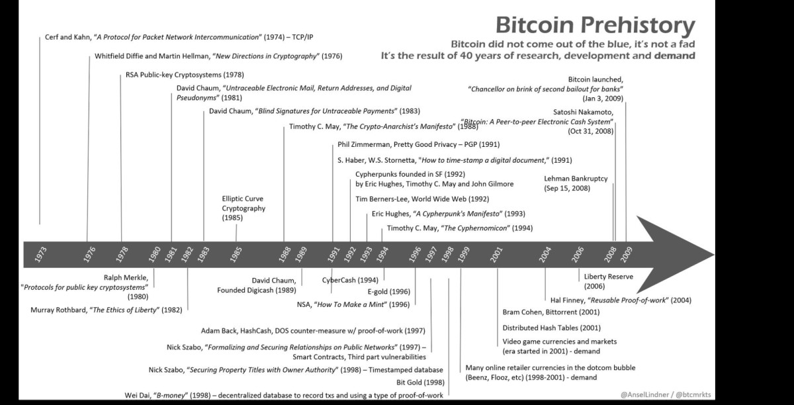
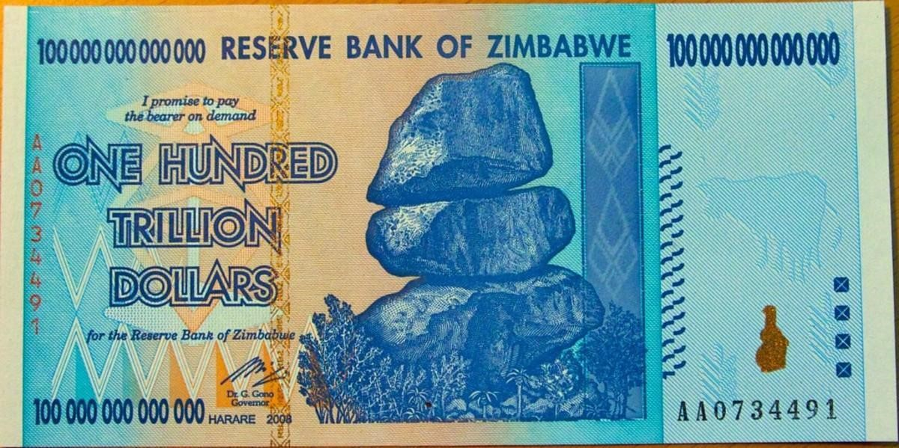
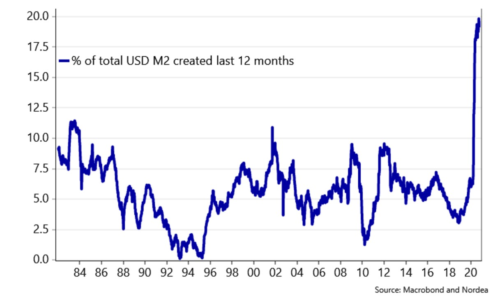
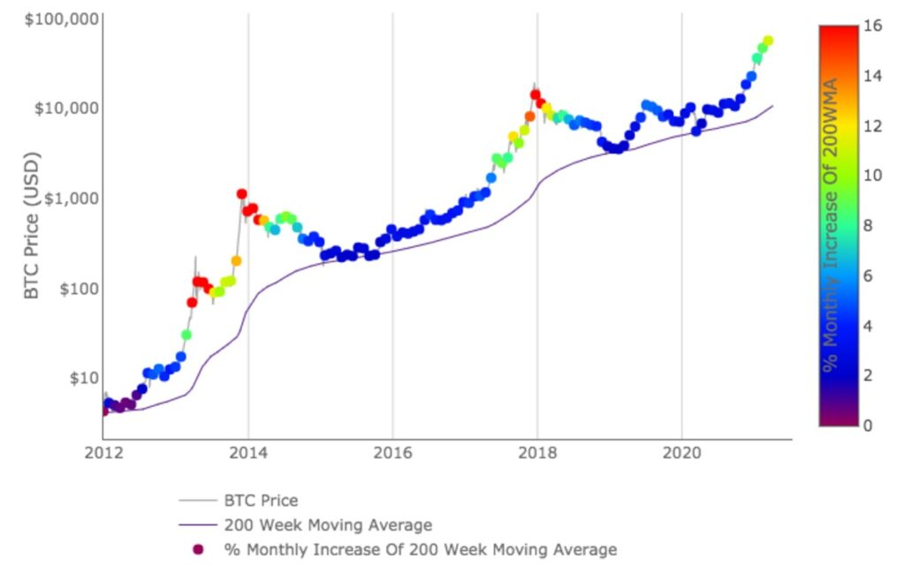
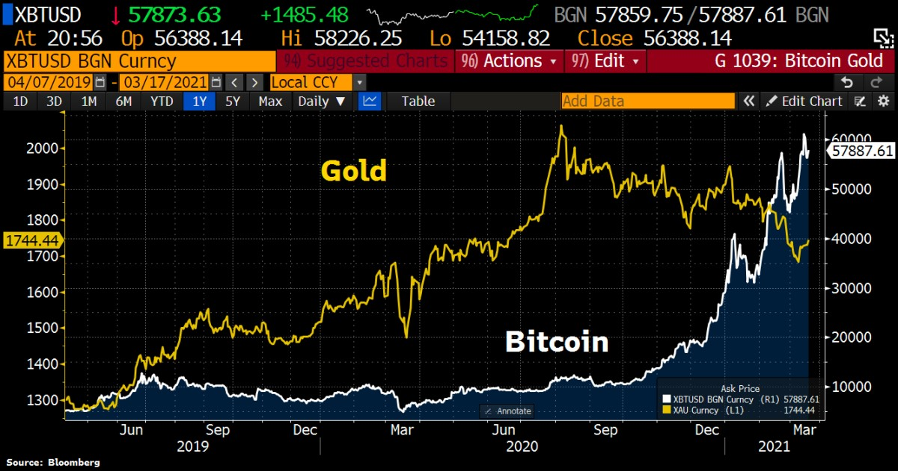

> [!actualizacion]
> La cifra del título corresponde a mayo de 2021. Desde entonces el crecimiento anual promedio bajó mucho, y los rendimientos pasados no garantizan los futuros.

***Nota:*** *Este artículo no tiene como finalidad el dar consejos de inversión, solo tiene fines informativos. Te instamos a hacer tu propia investigación.*

Con su suministro fijo, su software de código abierto y estructura de “igual-a-igual” conocida como p2p, Bitcoin es el dinero global, hecho por y para las personas de todo el mundo.

### ¿Qué es Bitcoin?

Hay innumerables respuestas a esta pregunta tan simple, y las analogías sobre  bitcoin van desde compararlas con el bambú hasta el micelio, siendo la más relevante para este artículo, el oro 2.0. Para las personas que no estén muy familiarizadas con las particularidades de Bitcoin, la siguiente imagen explicativa de bitcoin OG Wences Casares les puede resultar muy útil:

Crédito de la Imagen: Wences Casares

Traducido al español, la imagen de arriba lo que explica es lo siguiente:

1.  **Bitcoin es limitado**: Bitcoin es el primer recurso digital limitado que ha existido. Por diseño, nunca habrá más de 21 millones de bitcoin.
2.  **Bitcoin es divisible**: 1 solo bitcoin está compuesto por 1 millón de bits. O pequeñas piezas de bitcoin. Esto quiere decir que lo puedes dividir como quieras.
3.  **Bitcoin es cómodo**: puedes enviar bitcoin vía correo electrónico, mensaje de texto o cualquier tipo de papel o escritura física, de forma libre, gratuita y en tiempo real, a cualquier individuo en cualquier lugar, sin requerir ayuda de terceros.
4.  **Bitcoin es verificable**: muchos lo han intentado falsificar, nadie ha podido. Bitcoin usa un nivel muy alto de seguridad criptográfica.
5.  **Bitcoin es global**: Bitcoin es totalmente descentralizado, como el internet, el oro o el correo electrónico. No es controlado por ningún país o entidad.
6.  **Bitcoin es de código abierto**: no tiene un único dueño, sino que todos somos dueños de él.

*Nota: 1 bitcoin se compone de 100 millones de satoshis, no de 1 millón de bits.* 

### El inventor de Bitcoin, Satoshi Nakamoto, fue un erudito

Bitcoin es una entidad muy interesante que se encuentra en la intersección entre la criptografía, la economía y el dinero, el software de código abierto y la informática, la teoría de juegos, la política y el derecho, y muchas más. Debido a la naturaleza multifacética de bitcoin, este puede llegar a significar diversas cosas para diferentes personas. En este artículo, mi objetivo es exponer que bitcoin resuelve un problema crítico que está enfrentando actualmente una gran parte de la población mundial: el “dinero poco sólido” (término que explicaré a continuación) y la sorprendente ausencia de un tipo de tecnología de ahorro que pueda acumular valor con éxito en el futuro. Claramente, no soy yo la primera persona en llamar la atención sobre la impresionante tecnología de ahorro que representa el bitcoin, o las propiedades de “Number Go Up” (NGU). La finalidad de este artículo es presentarle este caso a la gente común en todo el mundo, que bitcoin no debe verse simplemente como una especulación o un “plan para hacerse rico de forma rápida”, como les gusta retratar a los principales medios de comunicación en reiteradas ocasiones, sino como una elección racional de un número gradual de personas e instituciones que se están beneficiando de la mejor tecnología de ahorro que el mundo nunca ha visto. En mi opinión, este es uno de los pocos casos en los que algo no es “demasiado bueno para ser verdad”. Dicho esto, al igual que con cualquier decisión que se vaya a tomar sobre qué hacer con el dinero que tanto les ha costado ganar, no está libre de riesgos. Históricamente, bitcoin ha tenido importantes correcciones y ajustes en su precio, aunque este ciclo ha sido menos volátil que los anteriores. Para empezar, aliento a todas las personas a que solo inviertan una cantidad de dinero que estén dispuestas a perder. Se puede comenzar con tan solo uno o dos dólares estadounidenses ($): cada bitcoin está hecho de cien millones de satoshis, lo que significa que se puede comprar una fracción de un bitcoin.

Yo creo firmemente que teniendo al menos “algo en juego” los incentivará a educarse más sobre bitcoin, esto, a su vez, puede permitirles considerar ahorrar una mayor parte de su riqueza o capital excedente en bitcoin. Pero no hay atajos para hacer crecer sus convicciones o creencias. Para lograrlo, deben dedicarle tiempo; por suerte, hoy en día hay una gran cantidad de podcasts, artículos y libros muy buenos y explicativos, si tienen curiosidad y desean obtener más información sobre bitcoin en general. Como bien he mencionado antes, Bitcoin no es un proyecto con el cual se harán ricos rápidamente, teniendo esto en cuenta, cualquier cantidad de capital que elijan guardar o invertir en bitcoin, deberán pensar en tenerla ahí almacenada durante por lo menos cuatro años, o más. Esto se debe a que, si tuvieron la mala suerte de comprar esta moneda cuando estaba en su alza en los mercados de 2014 o 2017, dentro de los cuatro años posteriores es cuando sus números volverían a estar en verde, y aún más amplían el rango de tiempo.

### El software se está comiendo al mundo

El ascenso sin medida de bitcoin se acopla con esta inmensa revolución digital que está desmaterializando al mundo físico. El inversionista Marc Andreessen dijo: *“El software se está comiendo el mundo”*. La marcha inexorable del software ya se ha ido alimentando de nuestras redes sociales (Facebook), guías telefónicas y mapas (Google), tiendas de videos (Netflix), reproductores de música, calculadoras y un sin número de otros artículos diversos (teléfonos inteligentes) y la lista continúa.

Al ser cientos de miles de millones de dólares más grande que su competidor más cercano, y combinado con sus propiedades monetarias superiores y su naturaleza descentralizada, está claro que bitcoin es el ganador entre las redes monetarias y se posiciona como el rey de los activos. Debido a sus importantes efectos de red y su tamaño en comparación con sus competidores, no es el “Myspace de las criptomonedas”, como algunas personas han tratado de describirlo. En sus 12 años de existencia, Bitcoin ya ha consumido, ni más ni menos, que 1 billón de dólares del sistema financiero heredado. Si uno se aleja de las fluctuaciones diarias del precio y toma en consideración que el total del mercado posible de bitcoin es de cientos de miles de millones de dólares te das cuenta que esto apenas está empezando. 

El gráfico de @Croesus\_BTC que se ve a continuación, muestra el tamaño actual de Bitcoin en relación con su mercado posible total (otros instrumentos de “reserva de valor”) y qué tan temprano todavía es para la criptomoneda. Si desean ver más a fondo qué tan temprano todavía es, [consulte aquí](https://www.swanbitcoin.com/am-i-too-late-for-bitcoin/).

@Croesus\_BTC

### El dinero más sólido del mundo

En esencia, bitcoin es el dinero más sólido jamás inventado por la civilización humana. El término “dinero sólido” es objetado y en este artículo yo defino el “dinero sólido” como aquel en el que su oferta total no corre el riesgo de ser devaluada por la impresión arbitraria de vastas cantidades de unidades monetarias adicionales. Una forma de dinero que se devalúa continuamente mediante la impresión de unidades adicionales se conoce como dinero “poco sólido” o “fácil”. Dicha devaluación de la moneda es una característica, no un error, de la mayoría, sino de todas, las monedas fiduciarias de todo el mundo. El “Fiat” o “dinero fiduciario”, en este contexto, significa una moneda de curso legal o capital ordenado por el gobierno. Las monedas fiduciarias implican cierto grado de coerción por parte del estado sobre sus ciudadanos; por ejemplo, los ciudadanos se ven obligados a pagar impuestos en la moneda fiduciaria que corresponda en su país. Bitcoin, por otro lado, es un dinero de libre mercado por el cual cualquier ciudadano de todo el mundo puede optar libremente si así lo desea.

Bitcoin es dinero sólido ya que, por primera vez en la historia de la humanidad, basándonos en 40 años de investigación, desarrollo y demanda (consulte la línea de tiempo más adelante), Satoshi Nakamoto inventó la escasez digital y le dio al Bitcoin un suministro fijo de 21 millones en total. A diferencia de las monedas fiduciarias, una vez que se han acuñado los 21 millones de bitcoin, no se pueden acuñar o crear más. Como resultado, los que poseen bitcoin saben que la cantidad que tienen nunca podrá ser degradada o devaluada. Por ejemplo, si alguien tiene 0.1 bitcoin (o diez millones de satoshis) hoy, sabe que su participación en el suministro total de bitcoin será de 0.1 ÷ 21 millones, o 0.00000048% del suministro total, de forma perpetua.

Satoshi también diseñó Bitcoin para que fuera increíblemente resistente en un entorno hostil. Hasta la fecha, a pesar de tener 1 billón de dólares en la red, ningún bitcoin ha podido ser pirateado. Una de las formas en que Satoshi logró esto con Bitcoin fue resolviendo el problema de la dependencia que tiene la moneda fiduciaria de un tercero confiable para poder operar. Al aprovechar la tecnología que sustenta otras redes “de igual-a-igual”, como la red de intercambio de archivos BitTorrent (lanzada en 2001), Satoshi lanzó con éxito el protocolo bitcoin el 3 de enero de 2009, utilizando un “[código imparable](https://www.youtube.com/watch?v=Q6euy5W1js4)“. Bitcoin no tiene una sede o lugar con una puerta de entrada física a la que cualquiera pueda tocar o llamar. Parafraseando a Michael Saylor, Satoshi inició un incendio en el ciberespacio. Y a diferencia de las iteraciones anteriores del dinero en el libre mercado, que dependía de terceros que fueran confiables, la naturaleza descentralizada del bitcoin significa que no hay o no tiene una ubicación física única para que una persona o autoridad apague las llamas.

AnselLindner

En teoría, el software de código de fuente abierta de bitcoin, llamado Bitcoin Core, puede ser modificado, sin embargo, al igual que la constitución de los Estados Unidos, el umbral para modificarlo es alto y requiere consenso entre la red de computadoras que ejecutan el código de Bitcoin (conocido como nodos). Nadie, por muy poderoso que sea, tiene una influencia indebida sobre el sistema y, cuantas más personas ejecutan su propio nodo, más descentralizado y resistente se vuelve el sistema a cambios no deseados. En consecuencia, los cambios incrementales en Bitcoin Core se implementan porque la mayoría de los miembros de la red considera que son de interés para el proyecto de Bitcoin.

Para una discusión más profunda de las propiedades monetarias sólidas de Bitcoin y para saber por qué son posiblemente superiores a sus competidores, incluyendo al oro, consulten el artículo de Vijay Boyapati, “[The Bullish Case for Bitcoin](https://vijayboyapati.medium.com/the-bullish-case-for-bitcoin-6ecc8bdecc1)“. Si desean adentrarse en este mundo, es un artículo que deben leer y es accesible en términos de complejidad.

### ¿Por qué es importante el “dinero sólido”?

Si tienen la necesidad de hacer esta pregunta, es probable que tengan el privilegio de no haber vivido en un país que ha experimentado altos niveles de inflación o, en casos extremos, hiperinflación (cuando la moneda de un país se vuelve, en pocas palabras, inútil). Los países que lo han tenido o tienen este tipo de situación económica son: la Alemania de Weimar, Venezuela, Líbano, Argentina, Zimbabue y Turquía. Una forma en que la hiperinflación puede ocurrir en un país es cuando los bancos centrales imprimen sus monedas nacionales hasta tal punto, es decir, en exceso, que la moneda pierde valor. Obviamente, ese proceso es perjudicial para la seguridad y la dignidad humana. Diferentes historias incluyen a personas que intentan gastar todo su capital (todo lo contrario a ahorrar) de forma inmediata porque saben que su poder adquisitivo al día siguiente se reducirá significativamente. Muy frecuentemente, los ciudadanos que se ven obligados a utilizar un dinero o moneda que no tiene nada de solidez han provocado su empobrecimiento y, el valor de sus ahorros ganados con tanto esfuerzo (a menudo la riqueza generacional) se evapora frente a sus ojos, sin más remedio que sufrir un desenlace trágico. Un ejemplo de esta realidad sería, el 16 de agosto de 2018, en Caracas, Venezuela, un rollo de papel higiénico costaba 2,6 millones de bolívares (el equivalente a $ 0,40). Por otro lado, en Zimbabue, en 2009, se introdujeron billetes de 100 billones de dólares zimbabuenses y, en momentos como ese, en un bar, no era raro que el precio de las bebidas se duplicara justo antes de ordenar la segunda ronda. Aunque, pronto veremos que no son solo los países que están “en desarrollo” los que sufren los efectos del dinero poco sólido, los ciudadanos de los países “desarrollados” se han visto cada vez más expuestos a sus efectos nefastos.

[Fuente](https://search.creativecommons.org/photos/08d67504-3e3a-4964-b7df-157955180bbb) de la Imagen

Por primera vez, como resultado de su suministro fijo y naturaleza de código abierto, Bitcoin ofrece a los ciudadanos la opción de colocar sus ahorros ganados con sangre, sudor y lágrimas, en una cuenta de ahorros que, algorítmicamente, no se puede devaluar mediante la impresión de unidades monetarias adicionales.  Al quitar la imprenta de dinero de las manos de las personas, Bitcoin ha liberado a los ahorradores y a sus familias en todo el mundo, devolviendo la esperanza a los ciudadanos comunes, ya que ahora tienen los medios para ahorrar y, por lo tanto, tienen el control de sus propios destinos.

### Bitcoin le da a las personas la oportunidad de elegir

Bitcoin ofrece a las personas que tengan acceso a la Internet la oportunidad de elegir ahorrar en el dinero sólido que es esta criptomoneda. Este es un sistema que tiene una política monetaria conocida y predecible y, lo que es más importante, es confiable: ha tenido un 99,98% de tiempo de actividad desde que entró en funcionamiento en 2009 y es accesible las 24 horas del día, los 7 días de la semana, los 365 días del año. A diferencia de la banca tradicional, Bitcoin no tiene horarios de apertura inconvenientes, ya que no duerme. De acuerdo con el efecto Lindy, popularizado por Nassim Nicholas Taleb, con cada bloque que el protocolo de Bitcoin agrega a su blockchain, aproximadamente cada 10 minutos (que se puede considerar como el latido del corazón de la primera red monetaria global de código abierto del mundo), es más factible, en el estudio de probabilidades, que exista en el futuro. Bitcoin ha existido durante 12 años y, esto significa que el efecto Lindy nos indica que deberíamos esperar que su vida útil futura sea de al menos 12 años más.

### Dinero “no sólido” con tasas de interés minúsculas o inexistentes

Si le vemos la otra cara a la moneda, las personas de todo el mundo pueden optar por almacenar su riqueza en su moneda nacional, que se devalúa cada vez más por la impresión de unidades adicionales, o en moneda poco sólida. Y no solo eso, sino que, ahorrar en cuentas bancarias con tasas de interés que comúnmente son cercanas a cero o negativas, significa que los ahorradores no son recompensados ​​por ahorrar ese dinero y, en el peor de los casos, están pagando a su banco para ahorrar. También vale la pena mencionar que, en el mundo de la economía moderna, las monedas fiduciarias solo comenzaron a existir en 1971 cuando el presidente Nixon aprobó una ley que sacó a los Estados Unidos del patrón estandarizado del oro, antes de la cual los dólares se podían canjear por oro. Después de 1971, los dólares se podían canjear por…nada. En última instancia, el valor de una moneda fiduciaria se deriva en gran parte de la capacidad del gobierno para mantener la confianza en dicha moneda.

Todo esto quiere decir que no son solo los ahorradores en países que experimentan altos niveles de inflación o hiperinflación los que están recurriendo al Bitcoin para almacenar su riqueza. Lo mismo ocurre en los Estados Unidos, hogar de la actual moneda de reserva global. Las consecuencias económicas de la crisis de 2008 y, más recientemente, de la pandemia del Covid-19, han acelerado la devaluación del USD. Los datos de la Reserva Federal (el banco central de los Estados Unidos) indican que la cantidad de dólares existente, conocida como oferta monetaria M2, aumentó de 15,34 billones de dólares a principios de 2020 a 18,72 billones de dólares en septiembre de 2020. Un incremento de $3,38 billones que equivale al 18% de la oferta total de dólares.

Esto significa que cerca de uno de cada cinco dólares fue creado en el año 2020.

También significa que, en el tiempo que te toma oprimir una tecla de tu ordenador, computadora o laptop, cada dólar americano existente tuvo una reducción del 18% en el poder adquisitivo. El cuadro a continuación ilustra esto.

**Nota**: en la línea de inferior se lee: “Porcentaje total de USD M2 (dólares) creados en los últimos 12 meses”

[Fuente](https://twitter.com/AndreasSteno/status/1313798182292328448?s=20) de la Imagen

Neel Kashkari, presidente del Banco de la Reserva Federal de Minneapolis, está incluso grabado en video en CBS el 22 de marzo de 2020, diciendo: *“No hay límite para nuestra capacidad de \[inundar el sistema con dinero\]”*. Cada “inundación” inevitablemente devalúa cada dólar existente, reduciendo el poder adquisitivo de los ahorros en efectivo, en dólares estadounidenses, que tanto les ha costado ganar a sus ciudadanos y a cualquiera que ahorre en esta moneda.

### Si tienes dudas, veamos el panorama completo

El precio de bitcoin ha experimentado altos niveles de volatilidad, sin embargo, a medida que se ha ido adoptando cada vez más, esta misma volatilidad se ha reducido. Vale la pena señalar que ningún activo monetario puede pasar de cero a convertirse en una moneda global sin tener volatilidad; hacerlo desafiaría las leyes de la física. También vale la pena señalar que, desde el inicio, la volatilidad de bitcoin tiende al alza. En consecuencia, mientras más tiempo hayan retenido las personas una parte de sus ahorros en bitcoin, más aumentará su poder adquisitivo.

El gráfico a continuación, creado por el antes inversor institucional holandés PlanB, muestra que el bitcoin, valorado en USD, no ha caído por debajo del Promedio Móvil de 200 Semanas (200 Week Moving Average, WMA). Desde su lanzamiento, el 200 WMA de Bitcoin se ha movido constantemente en una dirección ascendente. Explicado de forma más sencilla, los dueños de los bitcoin, que mantienen sus monedas en una secuencia de al menos cuatro años, han acumulado el valor de sus ahorros en términos de dólares estadounidenses. Por lo tanto, una estrategia simple (pero difícil de implementar al principio, ya que la gente tiende a pensar que puede aumentar las ganancias haciendo trading) para acumular ahorros en bitcoin es: comprar una posición inicial, comprar en “la caída” (cuando hay una caída de precio significativa, históricamente 20-30% pero aparentemente menos en este ciclo) y mantenlos como si tu vida dependiera de ello (Hold On for Dear Life, HODL); el meme HODL se origina en una publicación en bitcointalk.org de un usuario borracho que escribió mal HOLDING.

[@100trillionUSD](https://www.lookintobitcoin.com/charts/200-week-moving-average-heatmap/)

### La adopción institucional le ha quitado el riesgo a bitcoin

Liderados por el visionario defensor de Bitcoin y el CEO de la empresa que cotiza en la bolsa con más años de servicio que cualquiera, Michael Saylor (que resulta ser un científico espacial real), numerosas empresas que cotizan en la bolsa, sin que se me pase mencionar al gigante de los automóviles eléctricos Tesla, han incluido bitcoin en los balances de sus empresas. Muchos otros tipos de instituciones también han comprado bitcoin, incluida la empresa de seguros MassMutual, que suele ser ese tipo de institución que tiene mayor aversión al riesgo. Las firmas inmobiliarias, los fondos soberanos y las pequeñas y medianas empresas también han estado adquiriendo bitcoin.

La siguiente parte del artículo trata brevemente sobre los altcoins (que son criptomonedas distintas al bitcoin), Bitcoin y el medio ambiente, y las monedas digitales del banco central (CBDCs). Estos por sí solos representan temas muy importantes y, dado el alcance de este artículo, solo los abordaré a un nivel de alta comprensión lectora.

### Una breve nota sobre los altcoins

Es posible que se pregunten si el próximo sucesor de Bitcoin está al acecho entre las 9.191 (y contando) otras criptomonedas que figuran actualmente en el CoinMarketCap. La respuesta corta es: que la historia monetaria ha demostrado que existe una tendencia del mercado a converger en el dinero más sólido a expensas de todas las demás monedas.² Ningún otro altcoin puede competir con las propiedades monetarias superiores de bitcoin, su capitalización establecida de mercado, sus efectos en la red, su minería e infraestructura de hardware, cajeros automáticos y más. Si algún altcoin es capaz de hacer miles de millones de transacciones por segundo, es porque ha hecho un intercambio en otro lugar, y lo más probable es que no esté realmente descentralizado. Si recuerdan, esta última es una característica fundamental para mantener la tentación de imprimir más unidades monetarias fuera de las manos humanas. En segundo lugar, tal acción falla en darse cuenta de que se puede lograr un mayor rendimiento y velocidad de las transacciones en la segunda capa de Bitcoin, como lo es la red Lightning. De esta manera, la descentralización de la capa base de bitcoin no se ve comprometida.

Los altcoins deberían ser considerados de la misma manera que se consideran a las “startups”: el 99% fallará. Algunos se harán ricos seleccionando el 1%, pero la mayoría de las personas perderán su dinero. Si están buscando una reserva de valor que sea confiable y una cuenta de ahorros, les recomendaría que no busquen más que el mismo bitcoin.

Por otro lado, si están buscando algo con un alto riesgo, pero con una alta recompensa y están dispuestos a dedicarle el tiempo y la investigación necesaria, es posible que tengan éxito en el mundo de los altcoins, aunque también pueden perderlo todo, así que asegúrense de ingresar teniendo en cuenta lo que puede suceder. Además, hay que recordar que se deben comparar las ganancias en los términos de bitcoin ya que, si no le están ganando a bitcoin, es mejor que se queden con el este únicamente, y se ahorren el tiempo, estrés e impuestos que les causará el comercio de altcoins. Vale la pena leer el artículo de Willy Woo sobre altcoins [aquí.](https://woobull.com/the-two-types-of-altcoins-an-investors-view/)

### Una breve nota sobre bitcoin y el medio ambiente

Se habla mucho en los principales medios de comunicación acerca de que Bitcoin es dañino para el medio ambiente. Primero, es importante comprender que la potencia computacional (o tasa de hash) que gasta la red de Bitcoin es proporcional a la seguridad de la red. Actualmente, hay 1 billón de dólares puestos sobre la mesa, y es la tasa de hash de bitcoin la que los está asegurando. Si se logra ver valor en el mundo al tener acceso a una cuenta de ahorros económica, segura y confiable, entonces se le está dando un buen uso a la energía. Bitcoin en sí mismo inspira y financia la investigación de una energía más orgánica, ya que incentiva el uso de recursos naturales, los cuales de otro modo estarían varados y sin ningún rumbo.

En segundo lugar, en su artículo sobre el impacto medioambiental de la minería de bitcoin, Christopher Bendiksen aborda un punto muy importante: *“Bitcoin es tan ecológico como un coche eléctrico. Nada de Bitcoin requiere ningún tipo de emisión. Este tomará la electricidad que se le dé. Si el mundo se vuelve más orgánico y natural, también lo hará bitcoin”.* Dado que el costo de producir energía renovable es cada vez más competitivo en comparación con los combustibles fósiles, la probabilidad de que la minería de bitcoin sea aún más ecológica aumenta.

Sin embargo, y posiblemente lo más importante de todo, como resultado de sus propiedades monetarias sólidas, Bitcoin da pie a un sistema económico deflacionario (es decir, una reducción de los precios globales) que nos permitiría romper con el modelo económico actual de “crecimiento sin fin”. Esto puede significar un shock y un horror en el mundo. Aun así, Bitcoin es realmente bueno para el medio ambiente.³ Este es un tema tan importante y poco discutido del que escribiré sobre en un artículo futuro.

### Breve nota sobre las monedas digitales del banco central

La mayoría de los bancos centrales están trabajando en la creación de CBDC nacionales, ya que ofrecen una especie de ruta o camino factible que les permite salir del aprieto monetario posterior a 2008 y posterior al Covid-19, en el que se encuentran. En todo el mundo, los bancos centrales se han convertido en “el único juego que hay en la ciudad”⁴ y una respuesta común de los estados ha sido imprimir más dinero, también conocido por el popular meme: “Money Printer Go Brrr ”.

De todas las CBDC en desarrollo, el yuan digital de China se encuentra en la etapa más avanzada y ya se está probando en ciertas provincias. Con las CBDC, los bancos centrales podrán ofrecer dólares, libras o yuanes digitales directamente a los ciudadanos. Algunas personas piensan que esto amenazará al alza de bitcoin, la respuesta concisa es “no”, ya que estas monedas seguirán siendo una forma de dinero poco sólido, lo que significa que se pueden imprimir infinitas unidades, a diferencia del suministro fijo de 21 millones de bitcoin. Como las CBDC ya no requieren que los bancos comerciales distribuyan estas unidades de moneda digital, hay señales muy claras de que algo podría pasarle a nuestros bancos principales. En mi opinión, esto es parte de la razón por la que los bancos han dado un giro de 180 grados sobre bitcoin, ya que recientemente muchas entidades bancarias importantes y establecidas desde hace mucho tiempo han anunciado que ofrecerán servicios mercantiles y de custodia de bitcoin.

¿Qué significarán las CBDC para los ahorradores? Bueno, debido a que serán digitales y programables, darán a los bancos centrales muchas más opciones en términos de cómo distribuyen el capital en el sistema económico. Por ejemplo, teóricamente es posible que establezcan diferentes tasas de interés para diferentes ciudadanos en el mismo país: una tasa de interés baja o negativa para los ciudadanos mayores y que tengan más dinero, y una tasa de interés más alta para los ciudadanos más jóvenes y con menos capital. En la prueba del yuan digital en China, ha salido a la luz que el sistema permite establecer una fecha de vencimiento para ciertas cantidades de moneda cuando se busca “darle un impulso” a la economía. De esta manera, las CBDC tendrían la capacidad de prevenir o desalentar activamente el ahorro y afectar los derechos de los ciudadanos a elegir cuándo y cómo gastar su dinero. Por otro lado, en Bitcoin, debido a que ustedes son su propio banco y poseen todos sus satoshis de forma directa (cuando se guarda en un monedero de hardware o soluciones de custodia propias parecidas), no tiene fecha de vencimiento y son libres de hacer lo que quieran con él, en cualquier momento que deseen.

Las CBDC también darían a los bancos centrales la funcionalidad de desconectar las cuentas de CBDC de los ciudadanos si incumplen, o se considera que infringen, determinadas normas y regulaciones. En las manos equivocadas, tienen la capacidad de ser un camino de un solo sentido que lleva hacia mayores niveles de control estatal y, en el peor de los casos, una distopía como “1984”. No estoy diciendo que todo esto sucederá, solo que la posibilidad existe y, como la historia tiende a mostrar, si existe la capacidad de hacer algo, con fines de poder y control, durante un período de tiempo suficientemente largo, ciertos individuos en posiciones de liderazgo es probable que elijan utilizar dicha funcionalidad para promover sus propios intereses y agendas. Si están interesados en obtener más información sobre este tema, lean a Simon Dixon. Su texto como [fuente](https://www.youtube.com/watch?v=3yM9sHyX4VY) de información sobre este tema es una buena decisión.

### Bitcoin es demasiado caro, llegué demasiado tarde a la fiesta

Todo el mundo ha estado diciendo esto desde que el precio del bitcoin era de $1, $100, $1,000 y $10,000 por bitcoin y se dirá lo mismo cuando el precio sea de $100,000, $1 millón o más.

Los siguientes tres hechos ponen la declaración de “Bitcoin es demasiado caro, llegué demasiado tarde a la fiesta” en contexto:

1.  La adopción global de bitcoin actualmente se sitúa en alrededor del 2% de la población mundial y el bitcoin resuelve un problema al que se enfrentan miles de millones de personas en todo el mundo: el dinero en mal estado, poco sólido, y la falta de una cuenta de ahorros económica, segura y confiable.
2.  La capitalización de mercado de bitcoin es de $1 billón y su mercado posible es de cientos de billones.
3.  La historia monetaria está llena de ejemplos de dinero tecnológicamente más sólidos que reemplazan a competidores tecnológicamente menos sólidos: conchas, esferas de vidrio, plata, oro, etc.

Se puede argumentar que ya se puede ver que bitcoin está devorando al oro, debido a su tecnología monetaria superior, como se expresa en el cuadro a continuación.

[Fuente de la Imagen](https://twitter.com/Schuldensuehner/status/1372276479749410822?s=20)

Al exhibir propiedades monetarias superiores en comparación con otras monedas existentes y tecnologías, en mi opinión, Bitcoin está en camino de convertirse en la principal reserva de valor para todos los ciudadanos del mundo. El último avance en el desarrollo tecnológico monetario y su constante revalorización en el precio, es simplemente una señal de que un número creciente de individuos (y más recientemente instituciones) están eligiendo racionalmente almacenar sus riquezas en el dinero más sólido disponible para ellos. Como resultado de la naturaleza de código abierto de Bitcoin, esta opción también está abierta a ustedes también.

### Conclusión

Como espero haya demostrado este artículo, el suministro fijo de 21 millones de monedas de bitcoin, la naturaleza descentralizada y el código abierto imparable lo convierten en el dinero más sólido inventado por la civilización humana.

Actualmente, las personas de todo el mundo están trabajando demasiado, solo para que las monedas nacionales se vayan devaluando cada vez más. El crecimiento de bitcoin de más del 100% por año durante los últimos 10 años ofrece a los ciudadanos de todo el planeta Tierra la opción de almacenar su riqueza en el último mencionado y no en el primero. Al brindar a la población mundial acceso a una cuenta de ahorros económica, segura y confiable, Satoshi ha devuelto la esperanza a las personas de que el futuro será mejor no solo para ellos, sino también para sus familiares, amigos y para su comunidad.

A la luz de lo que he descrito anteriormente, recomiendo que todos intenten colocar al menos una pequeña parte de sus ahorros en bitcoin para que salgan de ese cero en el que se encuentran ahora, incluso un dólar sería bueno para empezar (1.673 satoshis en el momento de escribir este artículo). Si están o no están listos para hacer esto, les recomiendo encarecidamente que se tomen más tiempo para informarse sobre qué es Bitcoin y por qué es importante (vea las referencias abajo). Es un tema fascinante y gratificante y siempre hay algo nuevo que aprender.

---

### Referencias:

¹ L[a tasa de crecimiento anual compuesta de Bitcoin \* durante 10 años fue del 132,65% el 24 de mayo de 2021.](https://casebitcoin.com/)

\* La tasa de crecimiento anual compuesta (CAGR) es la [tasa de rendimiento](https://www.investopedia.com/terms/r/rateofreturn.asp) que se requeriría para que una inversión crezca desde su saldo inicial hasta su saldo final, asumiendo que las ganancias se reinvierten al final de cada año de la vida útil de la inversión.

² “El estándar de Bitcoin: la alternativa descentralizada a la banca central” por Saifedean Ammous; los primeros capítulos proporcionan un marco sólido en torno a la historia del dinero. Si quisieran leer solo un libro sobre Bitcoin, será difícil encontrar uno mejor que este.

³ “El precio del mañana” de Jeff Booth; Una lectura obligada sobre cómo las mejoras tecnológicas son naturalmente deflacionistas y dan como resultado la caída de los precios de los bienes.

⁴ “El único juego en la ciudad: bancos centrales, inestabilidad y evitar el próximo colapso” por Mohamed A. El-Erian; una visión que invita a la reflexión de los bancos centrales y las perspectivas de la economía mundial desde un punto de vista más interno.
