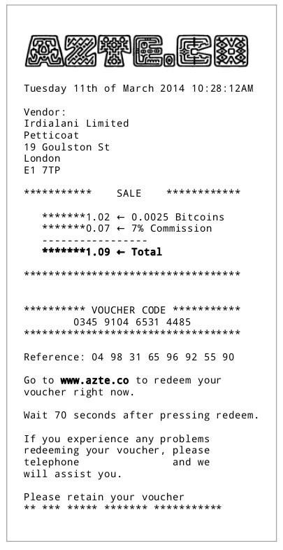
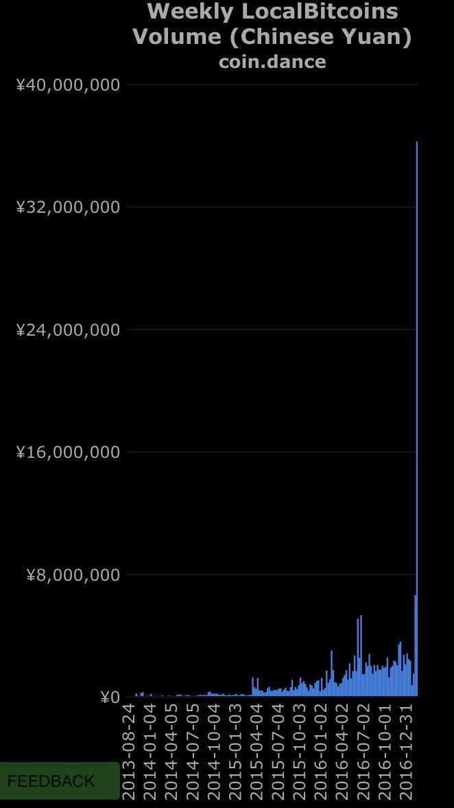

**Bitcoin no es lo que crees que es. Es lo que decimos que es.**

Existen ideas equivocadas ampliamente distribuidas acerca de qué es Bitcoin, y cuando estas son divulgadas como la verdad absoluta y mezclada con personas que tienen el poder para controlar a otras, genera un cóctel tóxico que potencialmente puede herir a millones de personas inocentes. En lugar de aceptar que Bitcoin tiene una naturaleza fija que no tiene nada que ver con sus creencias, y vivir con ello, las personas sustituyen su incapacidad para controlar Bitcoin con un deseo inútil de controlar *la forma* en que algo es dicho, en lugar de la sustancia.

El problema aquí es la idea errónea de que hay una forma estándar en la que la gente hable entre sí, a lo largo de todas las poblaciones, culturas y subculturas. Esta idea está **mal**. Por ejemplo, las personas que trabajan para la Organización de las Naciones Unidas (ONU) tienen una comprensión de cómo las personas deben hablar entre sí, que desciende de generaciones de diplomacia internacional con sus raíces en los modales de la corte. El lenguaje en los bordes más bruscos del protocolo de comunicación Internet Relay Chat (IRC) es un asunto bastante diferente, y entre la diplomacia de la ONU y el IRC, uno encuentra un amplio espectro de expectativas y estándares diferentes, y esa es solo la línea entre la ONU y el IRC en inglés. Hay muchas líneas que se extienden en todas direcciones, y en cada extremo, es la peor (o mejor) forma de comportamiento y estándares. La mayoría de las veces, estos grupos de personas nunca se mezclan, pero en Bitcoin lo hacen porque el olor a dinero está en el aire.

La idea de que las formas de interacción con el habla deberían estar estandarizadas es generalmente la misma posición que adopta el tipo Unión Europea/ ONU cuando se trata de la “regulación” de Bitcoin. Estos compañeros de cama con los luditas piensan que el gobierno es la solución a todos los problemas entre las personas y que es una parte interesada automática en los negocios y productos de todos, sin importar cuál sea. Ellos están **completamente equivocados**.

La discusión alrededor de Bitcoin y *Testigo Segregado* (*Segregated Witness*) es fuerte porque un lado está diciendo la verdad absoluta y el otro no, y las personas reales se enojan cuando otros tratan de robarles. Ha habido muchas charlas gentiles, reuniones, artículos persuasivos y explicaciones fáciles de entender hechas para que todos las absorban. Es imposible mantenerse al día con todo. Muy pocas personas han leído la página que lista todas las compañías que trabajan o integran *SegWit*, y aún menos leyeron la documentación técnica. Incluso personas que ejecutan servicios relacionados a Bitcoin no han leído esta documentación. La única forma de mantenerse productivo es especializándose y abandonando el intento de saber todo, y todos tienen este problema de sobrecarga. Lo que no es aceptable es no intentar mantenerse al día, ni siquiera ejecutar su propio nodo completo o proporcionar un servicio de cualquier tipo, y luego *decirle a la gente que sí está haciendo el arduo trabajo especializado que lo que están haciendo está mal*.

### En primer lugar, no hagas daño

Bitcoin no es libertad de expresión de la forma en que algunas personas lo describen. Yo argumento que Bitcoin es libertad de expresión en el sentido del software, para explicar por qué no puede ser regulado en un país libre:

Las personas que hablan acerca de dañar a otras personas son intolerables. Por ejemplo, no es aceptable clamar por el genocidio de otras personas, o pedir que la gente sea privada de sus derechos o robada. No hay forma de que las personas que están tratando de matar SeqWit aceptarían este mal comportamiento (es una certeza absoluta si ellas están en el extremo receptor) o que clamaran que el robo de su trabajo o dinero era “todo parte de la mezcla” de opiniones. Lo mismo aplica para cualquiera que dice que el derecho a desarrollar software debería ser regulado. Esto es parte de la razón de por qué los promotores de KYC/AML son intolerables. Existe el bien y el mal, y existen los absolutos en la vida. El relativismo y el matiz moral no son correctos. KYC/AML no es “un punto de vista” o una “perspectiva” como tampoco es un “punto de vista” o una “perspectiva” decir que “matar es solo otra forma de solucionar problemas”. La ética no es un asunto *à la carte* que se pueda elegir dependiendo de sus necesidades.

La raíz del problema en la gente que obliga a otros a llamar “dinero” a Bitcoin es que esto lleva directamente a la clase de abusos que ninguna persona decente quiere ver en la sociedad. Es muy importante en la discusión de Bitcoin no combinar diferentes aspectos de lo que todos están trabajando, y no aplicar pensamientos que son inaplicables. Los malos pensamientos llevan inevitablemente a pedir por el daño de otros basados en la idea equivocada de lo que son el Software y Bitcoin.

### Bitcoin no es Reddit

Bitcoin no es un foro donde la gente debate, y no hay argumentos (!) en matemática y en software, solo pruebas en papel y código en ejecución. Las opiniones de la gente son irrelevantes en la matemática; la idea de que “la opinión de todos cuenta” es un efecto colateral de la falsa idea de que Bitcoin es una comunidad. No lo es. Todas las personas que piensan que deberían “tener algo que decir” en Bitcoin no elevan sus voces en ningún otro asunto de software, como encriptación de emails, SSL, la forma de las pestañas del navegador, o ninguna otra cosa que se hace con software. Ellos solamente toman lo que les es dado y lo usan. **Eso es exactamente lo que deberían hacer con Bitcoin.**

Cuando Apple lanza una actualización de OSX (sistema operativo), todos simplemente lo aceptan y usan esta nueva versión. No existe un grupo de personas creyendo que tienen el *derecho* de demandar que Apple cambie la forma en que funciona el OSX; ellos entienden que si no les gusta el nuevo OSX, pueden simplemente no actualizar, comprar una computadora con Windows o usar Linux. Además, es absurda la idea de que si posees Bitcoin eres una “parte interesada”. Ser dueño de bitcoin no es diferente a ser dueño de una copia de OSX y usarla. Usar Bitcoin no te brinda derechos de ningún tipo, ni tampoco garantías. Solo puedes hacer una cosa con él: transmitir mensajes firmados para ser difundidos a la red y ser incluidos en el registro público. Las personas necesitan *realmente* aceptar esta verdad. Una vez que lo hacen, no se molestarán con el funcionamiento interno de lo que es Bitcoin y, en cambio, se concentrarán en construir negocios basados en sus atributos y en usar Bitcoin en cualquiera sea la forma que pueda ajustarse a sus necesidades.

### Bitcoin es software

Bitcoin es un proyecto de software como cualquier otro, excepto que este ha causado una confusión única y ampliamente distribuida acerca de la naturaleza de este software en las mentes de personas que no tienen ninguna experiencia en esto, y quienes no pueden hacer la conexión entre Bitcoin y el software que se les brinda en sus teléfonos o computadoras. La ilusión de dinero los ha hecho pensar de forma diferente e inapropiada cuando se habla de Bitcoin, y algunas de estas personas son muy peligrosas (del tipo de CoinCenter, DCG, UE/ONU) porque ellos usan [su mal entendimiento como base para planteamientos y recomendaciones a las legislaturas, con consecuencias muy negativas para todos.](https://medium.com/@Hannan.BitPol/the-bitcoin-constitution-32d49a235be1) 

SegWit es un ejemplo perfecto de qué tan peligrosas son estas personas, y por qué todos se enfadan tanto cuando ellos tratan de “ayudar” acudiendo a los legisladores para “explicar” Bitcoin. Los canales de pago en SegWit, desde su perspectiva, probablemente serán categorizados como “líneas de transmisión de dinero” donde cualquiera que abra un canal de SegWit se convierte en un “transmisor de dinero” de facto, exponiéndose a toda clase de problemas legales. Claramente esta categorización no es correcta, pero es exactamente lo que podemos esperar de estas personas que, como ellos mismos admitieron, no tienen experiencia directa alguna ni en los nuevos software o pensamientos.

Nadie señaló a estas personas como representantes de Bitcoin, de hecho, *nadie puede*, y ellos no tienen ningún derecho a acudir a ninguna legislatura como representantes autonombrados y ayudar a redactar leyes tóxicas que envenenan a todos, en todos lados, que no tienen contrato o participación en el DCG o CoinCenter. Estas personas están actuando 100% *ultra vires* y son una amenaza para todos aquellos que tratan de construir un negocio que utiliza Bitcoin por su naturaleza. Gracias a BitLicense, cualquiera que tenga la mala suerte de vivir en Nueva York y quiera trabajar con Bitcoin allí, tiene que encontrar millones de dólares para solicitar y *tal vez* obtener una licencia. Mire lo que le pasó a GDAX con su apelación ante la Comisión de Bolsa y Valores (SEC) para crear un nuevo producto. Fueron rechazados con una perorata ilógica, alimentada por presentaciones de *extranjeros* y *remitentes anónimos*. Impactante. Estos son los efectos destructivos y corrosivos en el mundo real de DCG, CoinCenter, SEC y todas las personas que no entienden Bitcoin, software, o los procesos en el espíritu empresarial y que son completamente inmorales y dañinos.

Desde lo que leemos, CoinCenter está funcionando con un millón de dólares por año. Este dinero podría haberse destinado a Relaciones Públicas (RP) para sofocar sus incendios y dirigir la percepción correcta de lo que Bitcoin es y lo que puede hacer. Si [Edward Bernays pudo convencer a las mujeres de que fumaran cigarrillos](https://www.youtube.com/watch?v=DnPmg0R1M04&t=3s) con un presupuesto de un millón de dólares por año, las RP modernas pueden convencer al público de que Bitcoin es bueno para ellas. O que su libro contable sea mantenido por un ejército de ratones de chocolate que almacenan bloques en los agujeros del queso suizo en los estantes. Esa es la *forma correcta* de influir en el público y dirigir la percepción, no presionando al Estado. Si usted está trabajando en Bitcoin, debería ver muy, *muy* cuidadosamente el documental que acabo de vincular.

### Hay historia en la Innovación sin Permisos

Tanto Uber como Skype iniciaron y lanzaron sus productos de software sin permisos. Ellos capturaron el mercado y cambiaron las vidas de todos para mejor.

Si Skype hubiera ido a las legislaturas y explicado lo que planeaban hacer, los ojos de los legisladores se habrían vidriado y hubieran dicho, “parece un teléfono para mí. ¡Incluso suena como un teléfono!”, y Skype nunca hubiera tenido éxito.

Este es el relato explícito del fundador de Skype, cuando explica por qué ellos no pidieron permiso para lanzarlo. Además, todos los descendientes de Skype, desde FaceTime hasta [Jitsi](https://jitsi.org/) y [Apperaln](https://appear.in/), hubieran sufrido el precedente conjunto de Skype de tener que obtener un permiso para lanzar un servicio de telefonía. Todos ellos, y todas las futuras aplicaciones de llamada, hubieran sido agobiados por ser mal caracterizados por un solo acto de lloriqueo y cobardía por parte de Skype. Pero Skype **no hizo eso**. Skype lanzó su aplicación **sin permiso**. Se volvió viral y se convirtió en un éxito y en una realidad. La red de Skype dependía de los usuarios para la infraestructura, lo que significa que no tenía que construir enormes centros de datos para manejar todas las llamadas. Te suena… ¿*familiar*? Debería. La arquitectura de Bitcoin se distribuye de la misma manera, sin un único punto de control. Los legisladores no consideraron que Skype era telefonía, y simplemente “era”. Ahora a nadie que quiera iniciar una aplicación de chat o una aplicación de videollamada *se le pasa por la cabeza* que deben buscar una “licencia” antes de lanzar su aplicación de forma gratuita. La idea saldría riendo de la habitación. Esto es [**exactamente** lo que debería suceder con Bitcoin](http://fortune.com/2014/06/23/telecom-companies-count-386-billion-in-lost-revenue-to-skype-whatsapp-others/).

Esta es la razón de por qué el mercado necesita [Azteco](https://medium.com/@beautyon_/azteco-bitcoin-for-the-masses-fc17f8ca1df0#.w32er9x54); para corregir y modelar la percepción de Bitcoin. Es un servicio que trata a Bitcoin según su naturaleza, y remueve toda fricción al proveer acceso a Bitcoin a través de un proceso familiar y simple. De hecho, es tan simple que si se removiera cualquier parte dejaría de funcionar.

Desde la perspectiva del usuario, al reducir una transacción de Bitcoin a un número de 16 dígitos, toda la complejidad se destila en algo que cualquiera puede entender y transmitir. Es como tomar un largo archivo de texto y comprimirlo de forma tal que sea pequeño y transportable. Significa que no tienes que gestionar tu propio monedero para mandar Bitcoin, o interactuar de otra manera que no sea para pagar y luego recibir un número de cupón.

Al fraccionar todos estos pasos involucrados en Bitcoin y no asumir nada acerca de lo que Bitcoin es, incluyendo necesitar un monedero, al tratar con él sólo por su naturaleza, es posible diseñar servicios totalmente sencillos y absolutamente centrados en el consumidor.

Ahora que SegWit está en proceso de ser activado, y sí, **será activado**, se harán miles de millones de pequeñas transacciones, y todas las formas de los nuevos modelos de negocio serán posibles y viables, como el hermoso [*SatoshiPay*](https://satoshipay.io/), el cual eliminará todos los anuncios en la web. Pagar su periódico diario con Bitcoin recargado por Azteco es fácil de entender y no supone ningún riesgo para el usuario, que ya no tendrá que exponerse al fraude de identidad para comprar un artículo de noticias.

> [!actualizacion]
> SatoshiPay dejó de funcionar con Bitcoin poco después de publicado este texto.

Azteco y otras Compañías de Ética de Bitcoin van a cambiar la percepción de Bitcoin y van a ayudar a dispersarlo en cada rincón del planeta. Los beneficios que brindaremos a millones de personas se producirán en cascada en todas partes y durante los próximos años, y **no hay inconvenientes**; esto es exactamente como los primeros días de Internet, y de igual forma importante y transformador. Internet no es la “Biblioteca del mundo” y Bitcoin no es dinero.

### No hay conflicto

Decir que el debate sobre SegWit es un “conflicto” es darle demasiada importancia a las cosas que dicen los no desarrolladores. No existe “conflicto” que requiera especialistas de resolución de conflictos, gestionadores o como sugirieron en la increíble Primavera De Filippi y otros, una junta de personas designadas por la UE para administrar Bitcoin. Y esta pregunta debería plantearse siempre que alguien trate de imponer su influencia sobre Bitcoin; “**¿Quién eres?**” ¿Quién eres para decir que “nosotros” necesitamos conformarnos con algo? ¿Desarrollas algún software? Y si lo haces, ¿por qué no estás listado en la página del desarrollador de Bitcoin Core? Las únicas personas que importan en Bitcoin son aquellas que están **desarrollando software**. Y si no tienes software, no tienes **nada que decir**. Puedes empezar tu propio negocio que use Bitcoin, o ser un usuario privado, y está cálidamente bienvenido a hacerlo, pero no tienes derecho a que tus deseos sean implementados, e incluso si logras escribir software, no tienes *derecho* a integrar e imponer tus cambios sobre todo el mundo.

En este momento, más de 130 compañías están trabajando en integrar SegWit. La mayoría de los espectadores están viendo la superficie de lo que está pasando, porque no son desarrolladores de software y no manejan una compañía donde emplean desarrolladores que hacen que todo suceda. Bitcoin no necesita la DCG o CoinCenter o la UE/ONU. Ellos no producen software, análisis útiles y no pueden siquiera molestarse en ejecutar un solo nodo completo de Bitcoin por su cuenta, aún así, piensan que tienen el derecho a decirle a otros que SegWit es un “proyecto nicho” e ir a la legislatura para tener leyes redactadas que controlen a otros. Es absolutamente indignante, y si alguien intentara esto con el Kernel de Linux, la mitad del mundo quedaría ensordecido por aullidos de indignación. Estas personas se están aprovechando de la paciencia y los buenos modales de todos, y todos son pacientes con ellos porque **sabemos lo que va a pasar a continuación y sabemos lo impotentes que son en realidad.**

Bitcoin Core y toda la gente en Bitcoin han sido extraordinariamente moderados y respetuosos, dado el comportamiento excesivo de estas personas y los viciosos matones que han actuado como Compinches Capitalistas pidiendo el progreso de la legislación para controlar a los demás. Sus acciones han sido violentas y anti humanas, con un efecto directo, en el caso de Nueva York, en las personas que desarrollan software, quienes tuvieron que eliminar Nueva York de los lugares donde operan. Estos no son actos de personas respetuosas, pacíficas y reflexivas que muestran moderación; estos son actos de **asesinos despiadados**, que harán cualquier cosa para capturar y dominar el mercado y excluir a los nuevos participantes, incluidas las cosas deshonestas y sucias como defender la BitLicense.

Por suerte, ahora existe una posibilidad de que sean repelidas la BitLicense y todas las otras legislaciones no estadounidenses que tocan a Bitcoin. Bajo la nueva “Dos leyes por cada nueva ley”, la Orden Ejecutiva, la fruta legislativa que está al alcance de la mano, será la primera en ser cortada cuando el Congreso se reúna. Y un representante de Texas acaba de anunciar una nueva legislación para proteger a Bitcoin de los legisladores imprudentes.

La BitLicense y todas las demás tonterías antiamericanas de seguro no sobrevivirán. Una vez que se le explique a cualquier estadounidense que los países extranjeros están por delante de los Estados Unidos en Bitcoin (la segunda Internet y la pieza final de “La Transformación”), deberían comprender instantáneamente que la BitLicense y todas sus variantes son extremadamente peligrosas para la prosperidad estadounidense en un nivel fundamental una vez que Bitcoin despegue. Deben hacer todo lo posible para asegurarse de que todas las leyes que toquen Bitcoin nunca se incluyan en los estatutos, de modo que la minería, el *trading* y el comercio ordinario puedan florecer, comenzar y terminar en los Estados Unidos, junto con la innovación del consumidor que se necesita para causar que Bitcoin reemplace completamente las tarjetas de crédito a nivel mundial. Y sí, eso es ahora posible con SegWit, que impulsará la tasa de transacciones por segundo de Bitcoin para superar a VISA y MasterCard *combinadas*.

### “Si me derribas…”

He dicho que sabemos qué va a pasar a continuación, y sabemos exactamente qué tan impotentes realmente son. Nada ejemplifica esto mejor que el siguiente gráfico:

Este es un gráfico que muestra el volumen semanal de LocalBitcoins **en China**. El pico (en las operaciones) es un resultado directo de la gente del Banco de China “rompiendo” los intercambios de Bitcoin allí, poniendo restricciones arbitrarias en cómo Bitcoin puede moverse a través de compañías facilitando el acceso a la red de Bitcoin. 

> [!actualizacion]
> LocalBitcoins cerró en febrero de 2023. Hoy existen otros mercados para intercambiar bitcoin entre personas.

Todas las personas impactadas por esta regla han dejado simplemente de usar los servicios restringidos y cambiaron a usar sus propios monederos móviles en una base de persona a persona, mediante el servicio de LocalBitcoins. Esta actividad no puede ser frenada, y esto no es solo un fenómeno local; estas personas pueden enviar y recibir Bitcoin desde cualquier sitio de la Tierra. China puede tratar de bloquear el sitio web de LocalBitcoins, pero eso no les impedirá establecer contactos de manera informal y mover Bitcoin entre ellos. 

Este pico es **una señal**. Es un indicador de cómo el mercado reaccionará ante cualquier intento de controlar o restringir Bitcoin en algún lugar del mundo. Antes de la campaña irracional china, el volumen de LocalBitcoins estaba creciendo lentamente, y todos estaban felices con los negocios de Bitcoin aprobados por el gobierno. Digo “aprobados” porque estos negocios tienen que informarle al Estado y operar con su permiso. Las personas estaban satisfechas con la forma en que eran las cosas, pero obviamente no están dispuestos a soportar que su dinero esté en un servicio que puede ser restringido arbitrariamente en cualquier momento sin previo aviso. Esto es completamente racional y lógico y es un comportamiento esperado.

Lo *irracional* es lo que está haciendo el gobierno de China. Si fuera racional, mirarían al gráfico de arriba y se darían cuenta que sus regulaciones están impulsando un modo de uso de Bitcoin que nunca podrán controlar. Si fuera racional, eliminarían **todas** las restricciones en los negocios de Bitcoin en China, y verían ese pico desplomarse. Ningún usuario ordinario busca un servicio con la complejidad de LocalBitcoins; ellos quieren garantías implícitas y la experiencia de usuario que las compañías registradas ofrecen. Y tenga en cuenta también que este aumento representa una pérdida en las ventas para los negocios de Bitcoin en China y un aumento en las ventas de LocalBitcoins, que es **una empresa extranjera**. LocalBitcoins **está drenando dinero de China**.

Si esto sigue así, China va a perder la ventaja de ser el primero en moverse en Bitcoin. Sus burócratas aún no entienden que no pueden controlar Bitcoin sin abrazar completamente a Bitcoin en los términos de Bitcoin, y cualquier otra cosa que no sea aceptarlo en sus términos los convertirá en una colonia vasalla en la nueva economía. Tenían una ventaja en el negocio de la minería y tienen muy buenas casas de cambio y desarrolladores súper talentosos para trabajarlas. Está en ellos perder esta ventaja, y a nadie le importa si la pierden. Los empresarios de Bitcoin que son chinos ahora están considerando seriamente arriesgar y mudarse a otra jurisdicción. *Ellos* no son irracionales ni estúpidos. **En lo absoluto**.

### Hay Té con Crema

Ningún hombre normal se sienta tranquilamente y con una sonrisa en su cara a dejar que su negocio, trabajo y oportunidades sean destruidas. Esto es cierto para los chinos que enfrentan la destrucción y para cualquiera que quiera que Bitcoin escale. Las personas que quieren que todos hablen sobre la escala de Bitcoin y SegWit como si estuvieran tomando un té con crema en Viena no son **realistas**. Y esto es para las personas que intentan regular el software para mostrar moderación y no correr a los legisladores para estropear el mercado antes de que exista, no para los desarrolladores y empresarios, quienes crean los mercados, que se concentran en traer nuevos servicios y que no dañan a nadie; ***nosotros*** no estamos haciendo nada dañino a otras personas. **Nosotros** somos éticos, **ellos no**. Y cualquiera que los excuse y le diga a las personas que están exponiendo su corrupción desnuda que “sean amables”… tienen algo que pensar.

Si quieres participar en Bitcoin, eres más que bienvenido, y tienes muchas oportunidades y elecciones, y todos pueden poner su experiencia sobre la mesa; **pero solo puedes hacerlo mediante software**. Si quieres llevar Bitcoin a partes remotas del mundo, necesitas desarrollar software y crear un servicio para eso. No tienes que tener reuniones interminables y acudir al Estado en busca de su bendición; **desarrolla un software y crea un servicio que la gente necesite**. Google no pidió permiso para entrar a cada país del planeta con sus productos de búsqueda y correo electrónico, lo hizo simplemente por la virtud de la naturaleza de internet. Bitcoin no es diferente a esto **en ninguna forma**, y nadie debería estar corriendo a las legislaturas y mentir para decir que lo es.

Todos necesitan entender que la nueva forma de mediar entre la gente es el **software**, no ir al Estado y pedirle que haga las cosas por ellos. Los conflictos entre compradores y vendedores en eBay se resuelven internamente para la satisfacción de todos, sin invocar nunca la ley. Eventualmente, todos entenderán esto, a medida que La Transformación empieza a echar raíces, y todos los actores del mercado que no están en software empiezan a entender que sus acciones no están produciendo nada. El pico chino en LocalBitcoins es una señal de esto.

Todos los emprendedores serán como Skype y Uber; lanzarán sus productos y servicios y serán exitosos o fallarán de acuerdo al mercado. Bitcoin, porque reemplaza al dinero como lo que todos intercambiamos por bienes y servicios, será el mayor proyecto de software en la historia del mundo, llegando a más gente que la televisión, y esparciendo prosperidad a todas partes a la velocidad de la luz, eliminando fraudes del pagador y de identidad, abriendo al tercer mundo al comercio electrónico, y ahorrando a todos miles de millones. Todo aquello que detenga esto, lo ralentice, aumente la fricción y busque prevenir su propagación es **en contra de la humanidad.**
