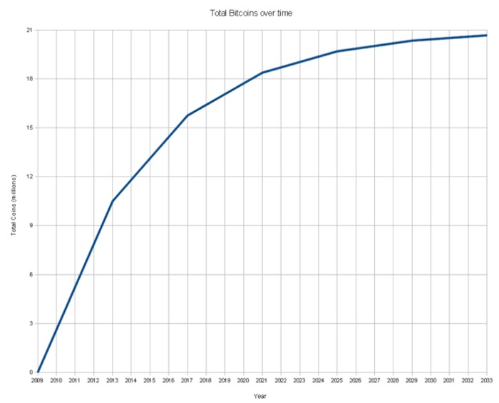

**Qué es, cómo se usa y por qué debería importarle.**

> **“Cuando se desafía una moneda estatal, se desafía al propio Estado, y las fuerzas del mercado se mueven rápidamente alrededor de inhibidores enfermizos que se deprecian”.**

### Introducción

Se ha hablado mucho sobre Bitcoin dentro de los círculos económicos y libertarios. Se está convirtiendo en una palabra de moda, pero como todos los sistemas nuevos que irrumpen rápidamente en el escenario público, Bitcoin trae consigo emoción, especulación, rumores y confusión absoluta. Sin duda, Bitcoin es complicado. Después de todo, es un sistema monetario global completamente nuevo, tanto una moneda como una red de pago para esa moneda.

Como todas las herramientas poderosas, es importante que aquellos interesados ​​en usar Bitcoin dediquen algún tiempo a la debida diligencia de la educación. Al igual que en una bicicleta, una vez que sepa cómo usar Bitcoin, se sentirá muy fácil y cómodo. Pero también como una bicicleta, uno podría pasar años aprendiendo la física que le permite funcionar. Un conocimiento tan profundo no es necesario para el piloto real, y de la misma manera uno puede disfrutar del mundo de Bitcoin con poco más que una sana curiosidad y un poco de práctica.

Este artículo es una introducción a Bitcoin: una descripción general del fascinante nuevo fenómeno desde la perspectiva de un humilde libertario que se preocupa más por las ramificaciones de la libertad humana que por el protocolo técnico y la brillante ciencia subyacente a la red.

Aquí se cubren todos los conceptos básicos de Bitcoin, que van desde una descripción técnica ligera hasta la debida diligencia, la economía y la teoría monetaria. También encontrará una lista extensa de recursos que lo pondrán al día sobre lo más fascinante que ha sucedido en el ámbito de la tecnología anarcocapitalista desde la propia Internet.

### ¿Qué es Bitcoin?

Bitcoin es dos cosas: es una unidad de moneda digital y es la red de pago global con la que uno envía y recibe esas unidades de moneda. Tanto la unidad monetaria como la red de pago comparten el mismo nombre: Bitcoin.

Como unidad monetaria, considere a Bitcoin como otras monedas. El mundo tiene euros, dólares, yenes, onzas de oro y plata, y ahora también tiene Bitcoin. Las propiedades de la unidad monetaria Bitcoin son las siguientes:

-   Nunca habrá más de 21 millones en existencia, y se liberan con el tiempo a un ritmo decreciente (en el momento de escribir este artículo, existen alrededor de 8,5 millones de bitcoin).
-   A medida que se lanzan nuevas monedas en el cronograma establecido, se entregan al azar a aquellos que contribuyen con el poder de cómputo para asegurar la red. Esto se llama “Minería de Bitcoin”, pero debería llamarse con más precisión “Auditoría de Bitcoin”. Aquellos que aportan más poder de cómputo a este trabajo tienen mejores probabilidades de recibir las nuevas monedas, pero la tasa de creación de nuevas monedas nunca aumenta (de hecho, disminuye con el tiempo hasta que existen los 21 millones de monedas). La inflación, por tanto, está predeterminada y desciende constantemente hacia cero. El siguiente gráfico muestra el calendario de publicación y la tasa de inflación:

Imagen: [https://miro.medium.com/max/700/0\*qqxLUBcUxnoSIve6.png](https://miro.medium.com/max/700/0*qqxLUBcUxnoSIve6.png)

-   Cada bitcoin es divisible por cien millones. Por lo tanto, puede poseer 0.00000001 bitcoin.
-   Los bitcoin son perfectamente fungibles, se dividen y combinan a la perfección en su cuenta.
-   Es teóricamente imposible hacer un bitcoin falso (para entender completamente por qué esto es cierto, es necesario estudiar criptografía y matemáticas bastante avanzadas).
-   Como moneda que existe en un mercado perfectamente libre, cada bitcoin siempre tiene un precio de mercado. En el momento de escribir este artículo, este precio es de aproximadamente $4,80 cada uno. Debido a que Bitcoin es global, también existen precios de mercado para bitcoin en todas las principales monedas nacionales, desde el yen hasta el real brasileño.
-   Bitcoin se negocia como otras monedas en los sitios web de intercambio, y así es como se establece el precio de mercado. La casa de cambio más conocida es [com](https://www.mtgox.com/)

Entonces esos son los detalles de Bitcoin como unidad monetaria, pero Bitcoin también es una red de pago. Como red de pago, Bitcoin reemplaza la función de los bancos (especialmente la Reserva Federal de los Estados Unidos, ya que la creación de dinero no es un capricho de ninguna persona ni grupo), redes de financiación interbancaria (como SWIFT y SEPA), procesadores de pago (como PayPal) y remitentes (como Western Union). La totalidad de estas industrias masivas en lo que respecta a la creación, almacenamiento, contabilidad y transferencia de dinero ha sido usurpada por Bitcoin. Si Bitcoin tiene éxito, es probable que PayPal y Western Union se eliminen del mercado. La Reserva Federal (y todos los bancos centrales) serían despedidos. La “tecnología disruptiva” es, por tanto, una subestimación.

### ¿Cómo funciona?

Pero, preguntas, ¿cómo funciona Bitcoin? ¿Cómo reemplaza a las funciones para las que durante tanto tiempo hemos dependido (y hemos estado en deuda con) gobiernos, bancos y compañías de pagos?

Para usar Bitcoin, tradicionalmente descarga el *software* (aunque también puede usar un sistema de “monedero electrónico”, que se explicará más adelante). El *software* actúa como su “cuenta bancaria”. Almacena un código secreto en su computadora y este código permite que los fondos se gasten desde su cuenta bancaria. En la terminología de Bitcoin, esta cuenta bancaria se llama su “monedero”. Entonces, su monedero se encuentra en su computadora, y tan pronto como uno tiene este *software* de monedero, puede recibir y enviar bitcoin a otros titulares de monederos en cualquier parte del mundo. Es tan rápido y fácil como enviar un correo electrónico (¡más fácil porque no tiene que molestarse en escribir un mensaje!).

No necesita un nombre, una dirección, un número de Seguro Social, de Esclavitud o cualquier información personal de ningún tipo. Nadie te “aprueba” para usar Bitcoin. Es un *software* gratuito y de código abierto. Lo obtienes de [Bitcoin.org](https://bitcoin.org/es/).

Las transacciones se envían y las cuentas se protegen mediante lo que se conoce como “criptografía de llave pública”. Cada cuenta tiene una llave pública y una llave privada, las cuales son largas cadenas de números y letras. El *software* de su monedero conoce su llave privada y esto le permite enviar dinero. Para enviar dinero a alguien, simplemente necesita conocer su llave pública (básicamente su número de cuenta bancaria). Si tiene su llave privada más su llave pública, se puede crear una transacción y los fondos se deducen de su cuenta y se acreditan en la cuenta del receptor, sin que nadie más tenga voz en el asunto.

Como se mencionó, su cuenta se define simplemente como una larga cadena de números y letras:

**1PGFCtrJHUsc7fs4LGWLmXUEwuKyDaHuRa**

Por lo tanto, su cuenta no tiene información personal adjunta. No es necesario que divulgue ningún tipo de información para obtener una cuenta de Bitcoin. Esto significa que puede recibir, almacenar y gastar bitcoin con relativo anonimato. El anonimato es relativo porque si publica su dirección en cualquier lugar que se le pueda atribuir (como en su página de Facebook), entonces, por supuesto, uno puede ver que la cuenta le pertenece y que el dinero destinado a ella no sería anónimo.

Por lo tanto, Bitcoin funciona como una red de igual a igual en la que los titulares de cuentas pueden transferir la moneda bitcoin entre cuentas al instante y con relativo anonimato. Siempre que el titular de una cuenta proteja su llave privada, sus fondos permanecen perfectamente seguros y solo este puede enviárselos a otra persona (y nadie puede detenerlo).

### ¿Por qué Bitcoin es valioso?

Este es quizás el tema más importante a tratar, ya que nada más importa si Bitcoin no tiene valor. ¿Qué hace que Bitcoin valga algo? ¿No es simplemente “falso”? ¿No es solo una moneda virtual inventada? Muchos dicen: “No puedo sostenerlo, no puedo verlo, y por lo tanto es artificial y no vale la pena mi tiempo”. Desafiemos esta comprensible reacción inicial. Demostremos por qué Bitcoin es valioso y por qué vale la pena.

La privacidad financiera ha sido simbolizada durante mucho tiempo por la notoria “cuenta bancaria suiza”. Sin embargo, cualquiera que tenga una cuenta en un banco suizo debe confiar en ese banco y, como hemos visto en los últimos dos años, la “privacidad bancaria” incluso en Suiza es un mito: los bancos se han inclinado por el gobierno de Estados Unidos. y han divulgado la información del cliente. Así que imagine tener una cuenta bancaria numerada en Suiza, pero sin tener que preocuparse por el propio banco suizo. Eso es Bitcoin. En lugar de depositar su confianza en un banco regulado gobernado por humanos falibles, Bitcoin le permite depositar su confianza en un entorno criptográfico no regulado gobernado por matemáticas infalibles. 2 + 2 siempre será igual a 4, sin importar cuántas armas apunte el gobierno en la ecuación.

Por lo tanto, Bitcoin es el único sistema monetario y moneda del mundo que no tiene ningún riesgo de contraparte que mantener y transferir. E*sto es absolutamente revolucionario y debería volver a leer la frase anterior.* Los defensores del oro señalarán que los lingotes de oro físico no tienen ningún riesgo de contraparte, pero eso solo es cierto para el almacenamiento en su propia casa. Guárdelo en una bóveda o un banco y corre el riesgo de contraparte. ¿Y al enviar oro? Tienes que confiar en todo tipo de personas si deseas transferir tu oro a otro lugar o gastarlo a distancia.

Bitcoin significa la propiedad total del dinero tanto en términos de almacenamiento como de transferencia. Nadie puede evitar que lo tenga. Nadie puede evitar que lo gaste. Incluso si alguien entra en la casa, o incluso si el gobierno emite una “orden de confiscación” (como hizo con el oro en 1933), los bitcoins de uno están perfectamente seguros. Intente huir de un país con $1.000.000 en lingotes sin que el gobierno lo sepa. Es más fácil decirlo que hacerlo. Con bitcoin, es casi más fácil de hacer de lo que se dice: puede poner $1.000.000 en bitcoin en una unidad flash USB, o incluso escribir la llave privada en una hoja de papel, o simplemente enviar por correo electrónico el archivo del monedero para que lo recupere una vez fuera del país.

¿Empezamos a ver el valor? Nunca en la historia del mundo un individuo ha tenido esta habilidad. No tiene precedentes.

### No, realmente, ¿POR QUÉ Bitcoin es valioso?

En este punto, los escépticos deberían decir, “está bien, puedes almacenar y gastar bitcoin sin interferencias, pero ¿qué les da valor inicial? ¿Por qué tienen precio? ” Es una muy buena pregunta, e incluso los economistas expertos han luchado con la respuesta.

Pero realmente, la respuesta es simple. Los bitcoin tienen valor porque A) son útiles y B) son escasos. Combine esos dos atributos en cualquier activo y descubrirá que tiene un precio. En el momento en que se intercambió el primer bitcoin a alguien a cambio de otra cosa, se estableció un tipo de cambio (precio de mercado). Quienes realizaron intercambios posteriores estuvieron de acuerdo o en desacuerdo con esa tasa, y realizaron más operaciones en consecuencia. Bitcoin desarrolló así un precio de forma espontánea, al igual que todas las cosas en un mercado abierto si son suficientemente útiles y suficientemente escasas.

Veamos el valor un poco más, porque es un tema polémico con Bitcoin. Hay muchos (incluido Paul Krugman) que creen que Bitcoin no vale nada y no es más que una moda de burbuja especulativa.

No esperaría que Krugman lo “entendiera”, pero los economistas más sabios o reales solo necesitan observar los metales para comenzar a comprender por qué bitcoin tiene valor. Después de todo, cualquier firme defensor del oro o la plata como dinero debería comprender por qué estos metales deberían ser dinero. La respuesta es que estos metales tienden a elegirse en un mercado abierto como dinero, porque sus propiedades específicas los hacen útiles como medio de intercambio. Son las propiedades del oro y la plata, exclusivas de estos metales, las que los convierten en un excelente dinero. Son escasos, fungibles, uniformes, transportables, tienen una alta relación entre valor y  peso, son fácilmente identificables, son muy duraderos y sus suministros son relativamente estables y predecibles. Compare otros productos como pollos, conchas marinas o arena, y descubrirá que ninguno de ellos es tan bueno en los atributos anteriores como los metales preciosos. Los pollos no pueden cortarse por la mitad o recombinarse, las conchas marinas no son uniformes y la arena es demasiado abundante para usarla como dinero. ¿Por qué no otros metales? ¿Por qué no usamos el hierro como dinero? No es lo suficientemente escaso; necesitaría carritos en la tienda para ir de compras.

Como puede decirle cualquier economista austriaco, el dinero es simplemente la mercancía en un mercado abierto que satisface mejor las propiedades necesarias para un intercambio útil. El oro y la plata se llevan la palma cada vez que un gobierno violento no se interpone en el camino… o al menos, esto es cierto históricamente. Pero esto no significa que el oro y la plata sean “dinero perfecto e infalible”. De hecho, existen problemas prácticos. No se pueden dividir y combinar fácilmente las monedas de plata para hacer cambio. No se pueden enviar fácilmente grandes valores de oro a distancia sin contratar seguridad y esperar el transporte. Uno debe pagar las tarifas de almacenamiento o arriesgarse a que lo roben en casa. Y, aunque es difícil, es posible fabricar lingotes de oro y plata falsos y hacerlos pasar por reales en el comercio.

Entonces, se deduce que si el oro y la plata no son el dinero perfecto (aunque es cierto que es el mejor que hemos tenido), tal vez la humanidad podría descubrir o inventar algo que fuera aún mejor. Este es el experimento de Bitcoin: la cuestión de si Bitcoin, con sus atributos específicos, es una forma de dinero aún mejor que la que disfruta el mercado actualmente (o en el caso de la fiat estatal, se ve obligado a usar). Si los austriacos tienen razón, y un mercado tiende a elegir el medio de intercambio que mejor funciona como dinero, y los atributos específicos de Bitcoin lo convierten en un dinero excelente, entonces quizás el mercado, con el tiempo, lo use cada vez más para tal fin.

La respuesta hasta ahora es sí. Bitcoin está encontrando cada vez más nichos para la adopción temprana, lo que respalda aún más su precio de mercado, brindando confianza a los propietarios de que retendrá el valor, y esto hace que Bitcoin se utilice aún más para más propósitos. Es un proceso orgánico y desordenado, lleno de prueba y error, baches, innovaciones brillantes y fracasos terribles. Pero eso es lo que es un mercado abierto, ¿no? Cada día se construye una economía más resistente, y no a punta de pistola, sino voluntariamente, no por decreto de Ben Bernanke, presidente de la Reserva Federal de Estados Unidos, sino por orden privado espontáneo e interesado.

Muchos han argumentado que “nada respalda a Bitcoin”. Y esto es cierto. Bitcoin no se puede canjear por ningún valor fijo, ni está vinculado a ninguna moneda o producto básico existente. Pero tampoco lo es el oro. El oro no está respaldado por nada, es valioso porque es útil y escaso. Los automóviles no están respaldados por nada, son simplemente útiles como automóviles y, por lo tanto, tienen valor. La comida no está respaldada, ni las computadoras. Todos estos bienes tienen valor en proporción a su utilidad y escasez, y uno simplemente necesita ver la utilidad de Bitcoin para comprender por qué, sin el respaldo de ningún gobierno o corporación, sin estar atado a ninguna moneda fiduciaria o mercancía existente, tiene un precio en el mercado y con razón.

### ¿Cómo se obtiene?

Cuando uno comprende por qué bitcoin es útil y, por lo tanto, valioso, es posible que desee obtener algunos. ¿Pero cómo? Bueno, ¿cómo se obtiene una moneda? Hay dos formas básicas, ya sea vendiendo bienes y servicios o comprándolo en una casa de cambio.

Primero examinaremos la compra en una casa de cambio. Las casas de cambio o “*exchanges*” son simplemente sitios web donde compradores y vendedores se unen para intercambiar una moneda por otra. Si tiene una cuenta en una casa de cambio e ingresa fondos a ella puede comprar bitcoin.

### Los pasos prácticos para hacer esto son los siguientes:

**Paso 1:**

Cree una cuenta gratuita en una casa de cambio confiable como BitStamp.net. \[El artículo original nombra a MtGox como referencia, ya que para el momento en el que fue escrito, esta era una de las principales casas de cambio de bitcoin. Sin embargo, [MtGox fue cerrada tras un robo controversial en 2014](https://es.cointelegraph.com/news/the-mess-that-was-mt-gox-four-years-on)\]

**Paso 2:**

Ponga dinero en la casa de cambio utilizando un intermediario como [Dwolla.com](https://www.dwolla.com/) o (mucho más rápido con una pequeña tarifa) BitInstant.com. Dwolla se vinculará a su cuenta bancaria y demora entre 3 y 5 días en transferir dinero de su banco a la casa de cambio. BitInstant, comparativamente, permite depósitos en efectivo anónimos de hasta $500 a la vez y demora menos de una hora. Estos depósitos en efectivo los realiza usted en cualquier sucursal bancaria importante (ni siquiera necesita una cuenta bancaria). Dentro de los 30 a 60 minutos de su depósito en efectivo, BitInstant acreditará su cuenta en la casa de cambio con su USD. Literalmente, puede tener sus primeros bitcoin 30 minutos después de leer este artículo.

**Paso 3:**

Una vez que sus fondos estén en la casa de cambio, puede comprar bitcoin al precio actual del mercado. Luego, las monedas permanecen en su cuenta de la casa de cambio hasta que envíe sus fondos a otro lugar (a su monedero personal o a alguien a quien le gustaría pagar, etc). Si desea vender bitcoin por dólares, simplemente haga el proceso a la inversa: envíe bitcoin a una casa de cambio, y venda al precio de mercado y transfiera los dólares a su banco.

El mercado de bitcoin es completamente líquido y funciona las 24 horas del día, los 7 días de la semana, sin festivos. Las casas de cambio son accesibles desde cualquier país del mundo y admiten las principales monedas nacionales (los comerciantes de divisas inteligentes pueden darse cuenta de que existen interesantes oportunidades de arbitraje y medios para adquirir divisas en países con controles de capital a través de bitcoin).

La otra forma de obtener bitcoin es vender bienes y servicios por ellos, al igual que vendes bienes o tu trabajo por dólares. Ser capaz de recibir bitcoin es tan simple como poner su dirección de bitcoin en su página web, y obtendrá esta dirección automáticamente una vez que tenga un monedero de bitcoin. No hay “registro” o “aprobación” para poder aceptar Bitcoin. Puedes tener cualquier edad y en cualquier país. Simplemente obtenga el *software* de monedero (de bitcoin.org) o use una “cartera electrónica” como Paytunia.com y pegue su dirección de Bitcoin para que todo el mundo la vea. Cualquiera que conozca su dirección de bitcoin puede enviarle bitcoin al instante.

Para las pequeñas empresas que deseen una forma más avanzada de aceptar y realizar un seguimiento de los pagos de bitcoin para los pedidos del sitio web, existen algunas buenas soluciones comerciales. Paysius.com es el mejor: se conectará a su sitio (utilizando complementos comunes de carrito de compras) y permitirá a sus clientes seleccionar “Bitcoin” como pago durante el pago en lugar de tarjeta de crédito o PayPal, etc. (esto no reemplaza estos métodos, simplemente les da a sus clientes una nueva opción). Además, debido a que muy pocas empresas pueden pagar sus salarios y proveedores en Bitcoin (todavía), los sistemas como Paysius le brindan a la empresa la capacidad de convertir automáticamente los fondos en bitcoin entrantes en dólares y depositarlos en la cuenta bancaria de la empresa. \[Los servicios de Paysius se encuentran inactivos en 2021, sin embargo, desde la escritura de este artículo se han creado diferentes de soluciones de pagos para empresas que funcionan de forma similar a la descrita por Voorhees en 2012\]. Las tarifas son mucho más bajas que el procesamiento de tarjetas de crédito, y los pagos en bitcoin tienen cero devoluciones de cargo o reversiones (es imposible revertir un pago de Bitcoin) por lo que los comerciantes pueden aceptar pagos de forma segura desde cualquier país sin más riesgo de reversión, lo que debería ser un alivio bienvenido para aquellos que han sido sufrido las reversiones de PayPal o fraude con tarjetas de crédito. Aparte de Paysius.com, [Bitpay.com](https://bitpay.com/) es otra buena opción para que los comerciantes acepten Bitcoin.

Así que eso es todo, así es cómo puede obtener bitcoin. Simplemente comprandolos o vendiendo cosas a cambio de bitcoin.

### Siendo cuidadoso con el dinero

Aquí es donde muchas personas tienen preocupaciones justificadas. Bitcoin requiere un alto grado de responsabilidad personal, por lo que los usuarios deben conocer las reglas básicas para usar bitcoin de forma segura. La mala noticia es que, si cometes errores, puedes perder dinero y nunca recuperarlo. La buena noticia es que, con algunos consejos básicos y algo de práctica, puede usar bitcoin de manera extremadamente segura, sin temor a perder. No entre en bitcoin sin comprender estos conceptos básicos:

**Concepto 1:**

Bitcoin es como dinero en efectivo y, por lo tanto, se almacenan en un lugar físico específico. Esto significa que siempre debe tener en cuenta dónde están sus bitcoin y qué riesgos presenta esa ubicación. Por ejemplo, si sus monedas están en su computadora y no las respalda en otro lugar (sí, se pueden respaldar fácilmente) y la computadora falla, su dinero se ha ido. No hay ninguna empresa a la que pueda llamar para quejarse… el dinero se pierde para siempre. De manera similar, si almacena sus monedas con un servicio en línea (como un monedero electrónico o una casa de cambio), entonces está confiando en ese servicio para guardar sus monedas de manera segura. Si le da sus monedas a alguien que no es de confianza, puede huir y nunca las recuperarás. No le daría $100 en efectivo a alguien en quien no confía. Lo mismo ocurre con bitcoin. Entonces, si las monedas están en su posesión (en su computadora o teléfono inteligente), debe tenerlas en cuenta, hacer una copia de seguridad y mantener sus sistemas seguros. Si otra persona tiene las monedas por usted, entonces debe poder confiar en esa parte. Este es el concepto de seguridad más importante de Bitcoin.

**Concepto 2:**

Donde quiera que guarde sus bitcoins estarán protegidos con contraseñas. Si hay monedas en su computadora en el archivo de su monedero, y alguien descubre la contraseña de su monedero y obtiene su archivo de monedero, ¡entonces puede gastar sus monedas! Del mismo modo, si mantiene monedas con un proveedor de servicios y alguien se entera de su información de inicio de sesión, puede robar sus monedas. Utilice contraseñas seguras siempre que trate con bitcoin (más de 12 caracteres) y guárdelas siempre en un lugar seguro. Los fondos no están protegidos por un seguro como el FDIC, exigido por el gobierno y subsidiado por los contribuyentes: un *banco* de bitcoin no puede simplemente ingresar dígitos en su cuenta para reponer los fondos robados por su propio descuido con su contraseña.

**Concepto 3:**

Cuando las monedas están en su propia computadora (lo que significa que está utilizando el *software* de monedero disponibles en [bitcoin.org](https://bitcoin.org/es/)), la primera vez que abra su *software* de monedero deberá crear una contraseña para encriptar su monedero. Después de crear esta contraseña (no la olvide nunca), **DEBE hacer una copia de seguridad del archivo de su monedero** en una ubicación diferente. Este archivo es donde se almacena su dinero. El nombre del archivo es “wallet.dat” y hacer una copia de seguridad es tan simple como copiar el archivo y colocarlo en otro lugar. Para encontrar su archivo wallet.dat:

En *Windows*, primero debe decirle a su computadora que “muestre los archivos y carpetas ocultos”; busque cómo hacerlo en línea. Entonces, puede encontrar su billetera aquí:

**C: \\ Documents and Settings \\ YourUserName \\ Application data \\ Bitcoin (XP)**

**C: \\ Users \\ YourUserName \\ Appdata \\ Roaming \\ Bitcoin (Vista y Windows 7)**

Si está en una Mac, puede encontrarlo aquí:

**~ / Biblioteca / Soporte de aplicaciones / Bitcoin /**

– – – –

Guarde este archivo wallet.dat en una unidad flash USB en su caja fuerte o envíelo por correo a sus padres. Grabarlo en un CD y guardarlo en una caja de seguridad bancaria. Póngalo en una computadora diferente. Incluso puede enviarse el archivo por correo electrónico. Mejor aún, haz dos o tres de los anteriores. Si realiza una copia de seguridad de su monedero correctamente y lo mantiene seguro, la probabilidad de que pierda sus bitcoin será menor que la de morir en un accidente automovilístico. Si no lo respalda, la probabilidad de que pierda sus criptomonedas es alta. Nota importante: si usa más de 100 direcciones bitcoin con su billetera, deberá crear un nuevo archivo de respaldo (el primer respaldo no conocerá la dirección 101).

**Concepto 4:**

Los defensores de la libertad aman los mercados libres. Pero con la libertad viene la responsabilidad. Bitcoin existe en un mercado libre. No está regulado, rastreado o supervisado por nada más que matemáticas duras y frías. Por lo tanto, las empresas y organizaciones que se encuentran en la tierra de Bitcoin a menudo no están reguladas y son privadas. Una empresa basada en Bitcoin ni siquiera necesita estar registrada como empresa en ningún lugar, porque no necesita una cuenta corriente comercial o un número de extorsión del IRS (conocido como EIN). Si bien esto significa que Bitcoin permite un comercio verdaderamente libre a escala global, también significa que los usuarios de bitcoin deben ser cuidadosos y prudentes. No compre cosas de empresas o sitios web en los que no confíe. Es posible que nunca vuelva a ver su dinero y no hay forma de “revertir” un pago. Con Bitcoin, la reputación y la historia lo son todo. Si no le da dinero en efectivo a un extraño en un callejón, no le dé bitcoin a un extraño en línea. Disfrute del mercado libre y sea un adulto responsable.

**Concepto 5:**

Recuerde que Bitcoin aún debe considerarse un experimento. Tan resistente como ha demostrado ser el sistema, sigue siendo nuevo. El valor de un bitcoin podría caer a cero mañana. Esto significa que bajo ninguna circunstancia las personas deben invertir dinero en bitcoin que no puedan permitirse perder. Bitcoin es un producto muy volátil con un futuro extremadamente incierto. Las abuelas no deberían poner dinero de jubilación en Bitcoin (ni en dólares estadounidenses, para el caso).

### ¿Qué se puede hacer con él?

La respuesta corta es que puedes hacer cualquier cosa, ¡pero es posible que tengas que construirlo primero! Bitcoin permite cualquier tipo de comercio o negocio que uno pueda imaginar, pero debido a que es tan nuevo, mucho de lo que se puede imaginar todavía está solo en la imaginación. Los emprendedores han estado construyendo y probando sistemas Bitcoin durante un par de años, pero la gran mayoría del potencial global de Bitcoin permanece sin explotar. Todo emprendedor con espíritu de libertad debería considerar este punto.

En cuanto a lo que está disponible actualmente, lo más básico que se puede hacer con Bitcoin es comprar productos y servicios de cualquiera que acepte Bitcoin. Puede encontrar una lista parcial aquí: [en.bitcoin.it/wiki/Trade](https://en.bitcoin.it/wiki/Trade). También existe un floreciente mercado de drogas ilícitas conocido como Silk Road, donde casi cualquier sustancia imaginable se puede comprar por Bitcoin. Acceder a Silk Road requiere precauciones de seguridad adicionales, como el uso de Tor, que está más allá del alcance de este artículo.

Lo siguiente es que  las donaciones se hacen muy eficientes a través de Bitcoin. Grupos desde [Wikileaks](https://www.wikileaks.org/) hasta compañías de cine independiente y refugios de animales aceptan donaciones de Bitcoin. Bitcoin funciona muy bien para las donaciones porque las micro-transacciones son posibles (no puede enviar $0.10 a una organización benéfica a través de PayPal, porque las tarifas son mayores a $0.10… pero con Bitcoin puede hacerlo). Si desea aceptar donaciones para cualquier cosa, coloque una dirección de Bitcoin en su sitio web. No te cuesta nada. ¿Quieres donar a Wikileaks? Aquí está su dirección:

**1HB5XMLmzFVj8ALj6mfBsbifRoD4miY36v**

¿Le gusta apostar? Bitcoin permite a los jugadores estadounidenses jugar al póquer en línea. El gobierno no puede detener los pagos, después de todo. Sitios como [SealsWithClubs.eu](https://sealswithclubs.eu/) están ganando popularidad y se están construyendo casinos más grandes.

¿Quiere enviar dinero a amigos o familiares en el extranjero? Utilice Bitcoin. En lugar de pagar $40 a Western Union, simplemente envíe bitcoin gratis. Los mercados de remesas son un área donde bitcoin realmente brilla, porque cruza fronteras instantáneamente y sin posibilidad de regulación ni interferencia. Del mismo modo, si se encuentra en un lugar como China o Bielorrusia con controles de capital, si puede tener en sus manos bitcoin, entonces puede transferir inmediatamente la riqueza fuera del país a otras monedas.

¿Quiere oro o plata para almacenar el valor adquirido a través de bitcoin? Prueba un sitio como Coinabul.com \[Actualmente, Coinabul no está operando. Sin embargo los casos de uso de bitcoin en la actualidad exceden lo que podría imaginarse en 2012. Al momento incluso pueden recibirse [donaciones a través de Twitter con bitcoin](https://blog.twitter.com/es_la/topics/product/2021/traemos-propinas-todas-las-personas-twitter)\]

¿Trabajas con autónomos o tienes un negocio que paga a personas en otros países? Utilice bitcoin. Después de todo, bitcoin permite pagos “debajo de la mesa” a cualquier persona, en cualquier lugar. Pagar a un contratista en Italia o India ahora es tan fácil como enviar un correo electrónico.

¿Quiere proteger la riqueza o moverla de forma privada? Bitcoin trasciende todas las fronteras y regulaciones. Ya no necesita tener su patrimonio en una cuenta que pueda ser congelada o confiscada.

Básicamente, cualquier cosa que pueda hacer con “dinero” de forma genérica, puede hacerlo con bitcoin; sin embargo, ahora no tiene ninguna restricción gubernamental sobre esa actividad. Si es comerciante, ¿por qué no comenzar a aceptar bitcoin como método de pago? Es fácil de integrar si usa un sistema como paysius.com. \[El artículo original hace referencia a Paysius que en 2021 ya no se encuentra operando, pero existen pasarelas de pagos como [Coingate](https://coingate.com/es) y [Bitpay](https://bitpay.com/retail/)\]

Si cree que Bitcoin podría usarse de una manera nueva y creativa, ¡construya el sistema! Así como pocas personas entendieron el poder de Internet a principios de los 90, lo mismo ocurre con Bitcoin. Y al igual que Internet, está atrayendo a constructores y emprendedores de todo el mundo.

### Bitcoin contra el Estado

Ahora llegamos a la parte más divertida, que es especialmente relevante para cualquier discusión libertaria sobre Bitcoin. Esta es la forma en que Bitcoin reemplaza el control del gobierno. “Está bien”, dice la gente, “entonces Bitcoin es nuevo y el gobierno aún no lo regula, ¡pero lo hará!” Desafortunadamente para el gobierno, no pueden. Ninguna persona o grupo de personas puede desafiar las leyes de las matemáticas sobre las que se basa Bitcoin.

Pero primero, veamos las formas en que el gobierno podría interferir con el sistema Bitcoin.

El gobierno puede eliminar los sitios web privados en un servidor alojado. Vimos esto con una claridad asombrosa recientemente cuando MegaUpload fue eliminado por el gobierno de Estados Unidos, incluso antes de que se hubiera llevado a cabo cualquier juicio o hallazgo de actividad criminal. Se debe suponer que el gobierno puede derribar cualquier sitio que desee, con o sin la cobertura legal de leyes como SOPA y PIPA (que simplemente otorgan bendición legal a poderes ya asumidos y demostrados). Entonces, esto significa que cualquier sitio web que se ocupe de bitcoin podría eliminarse y cerrarse. Las casas de cambio serían el primer objetivo.

Sin embargo, incluso aquí, el gobierno tiene problemas, porque los sitios web se pueden duplicar, copiar y ocultar con mucha facilidad. Derribar los sitios web de Bitcoin sería como cortarle la cabeza a una Hidra: por cada despido exitoso, la publicidad y el afán de lucro obligarían a surgir más sitios (por ejemplo: ¿cuántos sitios de intercambio de archivos existen, además de MegaUpload?).

De hecho, ciertos sitios han resultado imposibles de eliminar por completo para el gobierno. Tomemos el ejemplo de The Silk Road, que es un sitio web descarado que vende drogas ilícitas \[[Silk Road](https://es.wikipedia.org/wiki/Silk_Road) fue cerrado un año después de la publicación de este artículo, en 2013\]. El senador estadounidense Chuck Schumer expresó su angustia al respecto, aunque es lamentablemente impotente para eliminar el sitio porque existe en lo que se conoce como la “web oscura”, en servidores ocultos mediante criptografía. Si se cierran los sitios web de Bitcoin sobre el suelo, los sitios subterráneos prosperarán. Y cada vez que se elimina un sitio de alto perfil, Bitcoin obtendría publicidad gratuita en todo el mundo.

Por lo tanto, eliminar sitios web es una estrategia inadecuada si el gobierno desea obstaculizar el uso de bitcoin. ¿Qué más podían hacer?

Dentro de un país, al menos, un gobierno podría prohibir que las personas y las empresas acepten abiertamente bitcoin (y si esto sucediera en los Estados Unidos sería la señal definitiva de que la Corte Suprema de Justicia ha abandonado por completo sus responsabilidades). Supongamos que el gobierno de los Estados Unidos prohibiera la aceptación de bitcoin: significaría que bitcoin solo podría aceptarse en secreto. Esto dañaría la economía de manera significativa, pero no se acercaría a detener a bitcoin (y, de hecho, a menos que todos los gobiernos hicieran esto, bitcoin podría aceptarse abiertamente en otros países, lo que provocaría una fuga de capitales, lo que presionaría a los gobiernos para que no lo prohibieran en primer lugar).

Pero, ¿qué pasa con el método de ataque más obvio? ¿No puede el gobierno simplemente “cerrar” las transferencias de bitcoin? Sorprendentemente, no. Los sistemas centralizados como PayPal, Visa o incluso empresas como e-gold son muy vulnerables a un estado de ira. Los matones deben simplemente derribar la puerta, confiscar los servidores y encarcelar a los propietarios. Es por eso que cualquier sistema centralizado debe finalmente ceder a la voluntad del gobierno, accediendo a las regulaciones de lavado de dinero y tributación, divulgando información supuestamente privada sobre los clientes y evitando pagos que el gobierno considere problemáticos. Si no lo hacen, los cierran.

Bitcoin no es vulnerable a este riesgo, porque no existe un punto central de falla. No hay oficina de Bitcoin. No hay servidores centrales de Bitcoin. No hay presidente ni empleados de Bitcoin. Bitcoin no tiene un país de origen, no tiene licencia en ninguna parte. Es una red distribuida, un protocolo, que puede funcionar mientras exista Internet (y, de hecho, incluso sin Internet en sí). Las transacciones ocurren de igual a igual, lo que significa que ningún órgano de gobierno las aprueba. Las cuentas no se pueden congelar porque nadie tiene el botón de congelar.

Bitcoin no se puede apagar: es como un virus benévolo que, mientras unos pocos hosts sobreviven en algún lugar del mundo, puede perpetuarse y volver a crecer a la velocidad de la información.

### Bitcoin y disrupción

Una vez que uno se da cuenta de que el gobierno en realidad es bastante impotente para detener a Bitcoin, entonces pueden surgir algunas ramificaciones. Si Bitcoin no falla por sí solo, entonces, hasta cierto punto, tendrá éxito y, a medida que lo haga, comenzará a reemplazar muchas de las instituciones que han causado tantos problemas a la humanidad.

En primer lugar, están los actores del mercado que compiten por el negocio de la transferencia de dinero. Empresas enormes como PayPal y Western Union (e incluso empresas más arraigadas como SWIFT) descubren que tienen que competir con un sistema que transfiere dinero a un coste prácticamente nulo. El “servicio” que brindan estas empresas es redundante, y así como los fabricantes de látigos de carruajes estaban sin trabajo al inicio del automóvil, los servicios de pago también serán inútiles al inicio de las transferencias globales sin fricciones que ofrece Bitcoin.

Desde el punto de vista de la eficiencia del mercado, si estas empresas están ganando miles de millones de dólares al año por proporcionar un servicio que se puede realizar de forma gratuita, entonces, si ese servicio se pone de moda, la humanidad será miles de millones de dólares más rica cada año. Requerirá menos recursos para mover dinero y, por lo tanto, se consumirá menos recursos, lo que hará que la humanidad sea más rica. Los automóviles enriquecieron a la humanidad al permitir el transporte a menor costo, el correo electrónico enriqueció a la humanidad al permitir la comunicación a menor costo, y exactamente de la misma manera que Bitcoin puede enriquecer el mundo al permitir transferencias monetarias a menor costo.

Si Bitcoin crece lo suficiente como para comenzar a reemplazar las redes de transacciones financieras, su valor se estabilizará aún más y se podrá imbuir más confianza en el precio a largo plazo. Posteriormente, Bitcoin se convertirá en un medio cada vez mejor (más estable) de almacenamiento de valor, que amenaza a los bancos primero y luego a las monedas nacionales en segundo lugar.

Todo el trabajo realizado por los bancos para mantener y contabilizar el dinero (y transferirlo entre individuos y empresas) se puede realizar de forma nativa mediante Bitcoin. Y así como los servicios de pago se vuelven redundantes, también lo hacen muchos servicios proporcionados por los bancos, reduciendo el sector bancario a aquellas áreas donde todavía ofrece un valor útil.

Un mundo de Bitcoin todavía tendría bancos, por supuesto, pero los bancos se ubicarían adecuadamente en esos roles de mercado donde realizan un trabajo útil. Las personas no necesariamente quieren almacenar valor en las computadoras del hogar, y un banco con personal de seguridad y sistemas seguros puede ser un lugar inteligente para guardar fondos (pero en lugar de que todos tengan que guardar fondos en el banco, sería su opción según su perfil de riesgo). De manera similar, en un sistema capitalista siempre habrá necesidad de préstamos e intereses pagados sobre los depósitos. Los bancos disfrutarían de esta capacidad con Bitcoin siempre que fueran eficientes y pudieran competir en el mercado abierto.

Y a medida que avanzamos en la curva de adopción y crecimiento de un sistema monetario de Bitcoin, vemos que las propias monedas nacionales se ven desafiadas con bastante rapidez. ¿Por qué, después de todo, la gente querría tener euros que están perpetuamente degradados cuando existe una alternativa que permite pagos más fáciles y no puede ser devaluado por el BCE? Si Bitcoin se demuestra a lo largo de los años como una sólida reserva de valor, ¿qué razón racional tendría uno para usar euros? Suponiendo que se requiriera que los impuestos se pagaran en euros, una persona aún podría realizar sus negocios en bitcoin y solo comprar euros depreciados justo antes de la fecha de vencimiento de los impuestos.

¿Por qué no vemos esto con oro hoy? Debido a que el oro no tiene un buen sistema de pago integrado, los lingotes físicos no son eficientes para el comercio diario, y las bóvedas digitales respaldadas por oro han sido criticadas por las preocupaciones gubernamentales contra el blanqueo de capitales, ya que hemos visto cómo los sistemas de transferencia de empresas como *GoldMoney* se ven presionados para cerrar (el año pasado, *GoldMoney* suspendió sus transferencias de cuenta a cuenta).

Recuerde, Bitcoin  hace que automáticamente tanto el almacenamiento como la transferencia de fondos sean fáciles, seguros, privados e instantáneos. Con un historial de estabilidad de precios ganada a lo largo del tiempo, o junto con el oro y la plata como una reserva de valor aún más confiable, ¿por qué usar fiat estatal?

El dominó final que caerá, por supuesto, es el poder que los gobiernos ejercen sobre su rebaño a través de su capacidad para imprimir, regular y controlar el dinero de la nación. Cuando se desafía una moneda estatal, se desafía al propio Estado, y las fuerzas del mercado se mueven rápidamente alrededor de inhibidores enfermizos que se deprecian. Las conferencias de prensa de alguien como Bernanke serían cada vez menos importantes, porque la moneda que imprimiera se utilizaría en círculos cada vez más estrechos. En lugar de luchar contra el gobierno, Bitcoin permite a las personas eludirlo, ignorarlo en gran medida. Bitcoin, junto con el Internet, proporciona todo lo que se necesita para realizar un sistema de anarcocapitalismo.

Después de todo, ¿qué poder tendría el gobierno de Zimbabue si su gente hubiera tenido Bitcoin en sus comunidades? Un dinero que podrían esconder y gastar a través de teléfonos celulares y cuentas de correo electrónico. ¿Qué motivo habría en Grecia para protestar contra los mandatos del Banco Central Europeo cuando el país puede abandonar el euro en favor de un dinero que cada uno de ellos controla por sí mismo? ¿Y de dónde obtendría Estados Unidos los recursos para financiar con déficit sus guerras y programas de bienestar cuando ya no tiene la capacidad de imprimir dinero y pagar la deuda con moneda devaluada? Como un patrón oro, Bitcoin encadena a un gobierno y lo obliga a subsistir solo con lo que puede pedir prestado de manera abierta y legítima, pero a diferencia de un patrón oro, Bitcoin no requiere ningún estatus oficial para convertirse en un estándar. El mercado puede llegar al estándar sin la aprobación del gobierno, nuevamente porque funciona con elegancia tanto para el almacenamiento como para la transferencia y no se puede detener porque existe en forma descentralizada.

Vemos que a lo largo de la curva de crecimiento y adopción de Bitcoin, ocurren algunas posibilidades emocionantes y bastante revolucionarias. En lugar de intentar cambiar de gobierno con un voto inútil o una súplica patética, simplemente abandonamos la base de poder del gobierno, el poder derivado del control del cambio y la moneda. Los embarazosos inconvenientes y las crecientes incomodidades de este nuevo sistema monetario deberían ser fácilmente superados por el regalo dado a la noble causa de la libertad, si tiene éxito.

Es hora de comprobar la realidad. Una persona prudente debe asumir que Bitcoin fallará, aunque solo sea por el hecho de que la mayoría de las cosas nuevas fallan. Pero existe una posibilidad muy real de que tenga éxito, y esta posibilidad aumenta con cada nuevo usuario, cada nuevo negocio y cada nuevo sistema desarrollado dentro de la economía de Bitcoin. Las ramificaciones del éxito son extraordinarias y, por lo tanto, vale la pena al menos una revisión superficial por parte de cualquier defensor de la libertad, no solo en los Estados Unidos. Sino en todo el mundo.

Pasa algo de tiempo con Bitcoin. Aprenda, desafíelo y úselo. Puede suponerse que ningún gobierno quiere que se adopte este sistema de ninguna forma, y solo por esa razón vale la pena ser considerado por personas honestas, morales y trabajadoras.

### Recursos útiles

Como Bitcoin está descentralizado, puede ser difícil encontrar todos los recursos que uno pueda desear. A continuación se muestra una lista de algunos de los sitios web y herramientas más útiles para aprender y participar en la economía de Bitcoin.

Nota: algunos de los recursos listados originalmente en este artículo fueron omitidos por no estar operativos en la actualidad. [Consulte la lista original aquí.](https://medium.com/lux-initiative/bitcoin-the-libertarian-introduction-c616edd8496c)

-   [weusecoins.org](https://www.weusecoins.org/) el mejor lugar para que los principiantes comiencen. \[Este sitio está en inglés, los usuarios hispanohablantes pueden encontrar buena información básica en [Bitcoin.org](https://bitcoin.org/es/como-empezar)\]
-   [paytunia.com](http://paytunia.com/): muy buen servicio de monedero electrónico en línea con aplicación para Android. Guarde sus monedas aquí. \[Actualmente este monedero no se encuentra activo, acá encuentran [una lista de opciones](https://bitcoin.org/es/elige-tu-monedero)\]
-   [bitspend.net](http://bitspend.net/): le permite comprar CUALQUIER COSA en línea pagando con Bitcoin. Muy genial.
-   [bitcoin.org/es](https://bitcoin.org/es/): sitio oficial del proyecto de Bitcoin, descargue el *software* de su monedero aquí.
-   [bitcointalk.org](https://bitcointalk.org/): el foro de discusión oficial y una gran comunidad de entusiastas.
-   [es.bitcoin.it/wiki/Trade](https://es.bitcoin.it/wiki/Trade) lista parcial de empresas que aceptan Bitcoin como pago.
-   [bitcoinmagazine.com](https://bitcoinmagazine.com/): portal profesional de publicaciones y noticias.
-   [blockchain.com/explorer](https://www.blockchain.com/explorer): herramienta para ver cuentas, pagos y numerosas estadísticas económicas.
-   [bitcoincharts.com](https://bitcoincharts.com/): muestra los precios actuales del mercado y las estadísticas. económicas.
-   [preev.com](http://preev.com/): calculadora de Bitcoin a moneda fiduciarial, admiten varias monedas. \[También puedes visualizar los pares con monedas fiduciarias latinoamericanas en [satsrules.com](https://www.satsrules.com/)\]
-   [bitcoinmonitor.com](http://www.bitcoinmonitor.com/): visualización en vivo de las transacciones a medida que ocurren en la red Bitcoin. \[También puede visualizarlas en [mempool.espace.](https://mempool.space/es/)\]
