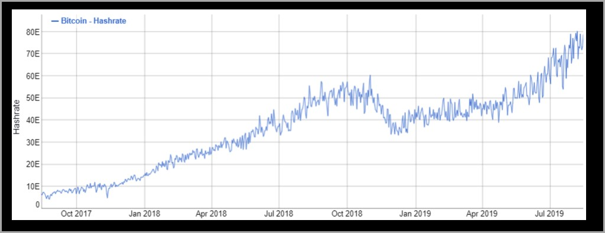
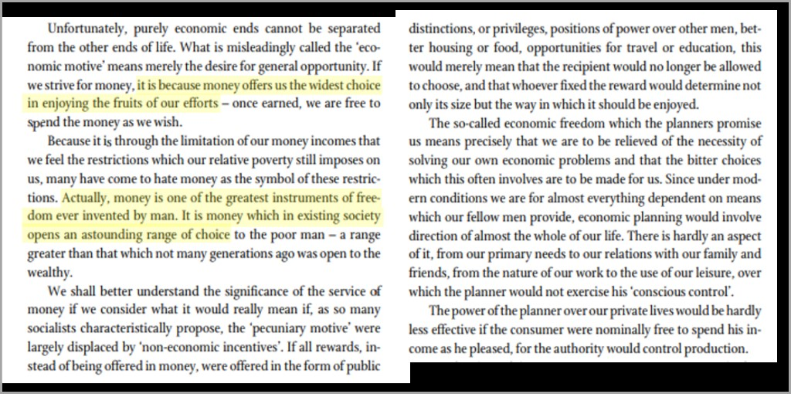
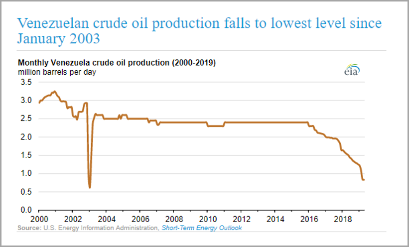
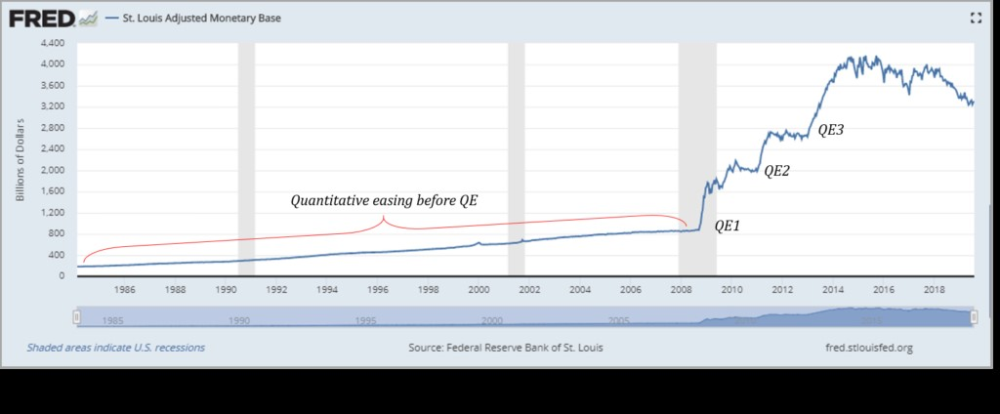

**¿Cuántas veces ha escuchado las instrucciones de seguridad antes de un vuelo comercial estándar?** Probablemente las conozca de memoria, pero cada vez, antes del despegue, los asistentes de vuelo instruyen a los pasajeros que viajan con niños a ponerse primero la máscara de oxígeno y luego atender a los niños. Instintivamente, es contradictorio. Lógicamente, tiene todo el sentido del mundo. Asegúrese de que puede respirar para que el niño que depende de usted también pueda respirar.

El mismo principio se aplica a la función de coordinación del dinero en una economía y los recursos necesarios para proteger esa función. En una advertencia de seguridad más filosófica, el asistente de vuelo puede decir: “Por favor, asegúrese de que el suministro de dinero sea seguro para que podamos continuar coordinando la actividad de millones de personas para construir estos aviones hipercomplejos que le brindan la oportunidad de incluso contemplar el problema que estoy a punto de explicar”.

Volveremos a esto, pero nunca esperará comprender la justificación de la cantidad de energía que consume Bitcoin sin antes desarrollar una apreciación del papel fundamental que juega el dinero en la coordinación de la actividad económica. ¿Qué es el dinero? ¿Cómo funciona? ¿Cómo debería funcionar? ¿Cuál es su función en la sociedad? Si no se ha detenido a hacer estas preguntas, no puede comenzar a comprender el peso del problema que Bitcoin intenta resolver. Y sin una apreciación del problema, el costo de asegurar la solución nunca parecerá justificado.

Cualquier cantidad de espectadores preocupados levantan la bandera roja sobre la cantidad de energía consumida por la red de Bitcoin. Esta preocupación surge de la idea de que la energía consumida por la red de Bitcoin podría utilizarse de otro modo para funciones más productivas, o que es simplemente mala para el medio ambiente. Ambas ignoran la magnitud fundamental de cuán crítico es realmente el consumo de energía de Bitcoin. A largo plazo, puede que no haya un uso de energía mayor y más importante que el que se implementa para asegurar la integridad de una red monetaria y de manera constructiva, en este caso, la red de Bitcoin. Pero eso no impide que aquellos que no entienden el enunciado del problema planteen preocupaciones.

> ***“La naturaleza fundamentalmente derrochadora de la minería de Bitcoin significa que no se aveci na una solución tecnológica fácil”.** –* [*The Guardian*](https://www.theguardian.com/technology/2018/jan/17/bitcoin-electricity-usage-huge-climate-cryptocurrency)

> ***“En el contexto del cambio climático, los incendios forestales y los huracanes que batieron récords, vale la pena hacernos preguntas difíciles sobre el impacto ambiental de Bitcoin”.** –* [*Vice Media*](https://www.vice.com/en_us/article/ywbbpm/bitcoin-mining-electricity-consumption-ethereum-energy-climate-change)

### Consumo de energía de Bitcoin

De fondo, Bitcoin está asegurado por una red descentralizada de nodos (computadoras que ejecutan el protocolo de Bitcoin). Los nodos económicos dentro de la red generan, validan y transmiten transacciones, así como también validan y transmiten bloques de Bitcoin (grupos de transacciones secuenciados en el tiempo). Los nodos de minería realizan funciones similares pero también realizan la función de Prueba de Trabajo de Bitcoin para generar, resolver y transmitir bloques al resto de la red. Al realizar este trabajo, los mineros validan el historial y proporcionan una función de “compensación” para las transacciones actuales, después los demás nodos verifican su validez. Piense en la función de compensación de la Reserva Federal de New York, pero sobre una base completamente descentralizada cada diez minutos (en promedio).

El trabajo realizado requiere cantidades masivas de poder de procesamiento aportadas por mineros de todo el mundo, funcionando las 24 horas del día, los 7 días de la semana. Esta potencia de procesamiento requiere energía. Para el contexto, a 75 exahashes por segundo, la red de Bitcoin actualmente consume aproximadamente 7 – 8 gigavatios de energía, lo que se traduce en aproximadamente $9 millones por día (o en promedio $3,3 mil millones por año) de energía a un costo marginal de 5 centavos por kWh (estimaciones aproximadas). Según los promedios nacionales de Estados Unidos, la red de Bitcoin consume tanta energía como aproximadamente 6 millones de hogares. Sí, definitivamente es mucho poder, pero también es lo que asegura y respalda la red de Bitcoin. 

¿Cómo podría justificarse tanta energía? ¿Y cuánto consumirá Bitcoin cuando mil millones de personas lo estén usando? El dólar funciona bien, ¿verdad? Bueno, eso es lo que pasa, que no es así. Estos recursos se están dedicando a solucionar un problema que la mayoría no entiende que existe, lo que dificulta la justificación de un costo derivado. Para ayudar a aliviar el dolor de los ambientalistas y los guerreros de la justicia social, a menudo señalamos una serie de narrativas compensatorias para que parezca más aceptable:  

-   Una parte importante del consumo de energía de Bitcoin se genera a partir de recursos renovables.
-   Bitcoin estimulará la innovación en el desarrollo de tecnología y recursos de energía renovable.
-   Bitcoin consume energía que de otro modo se desperdicia, si no, [se quema en la atmósfera](https://www.upstreamdata.ca/). 
-   Bitcoin consume solo la energía que soportará el mercado libre a una tasa de mercado libre.
-   Bitcoin consume recursos energéticos que de otro modo no serían económicos de desarrollar.
-   La naturaleza de la demanda de energía de Bitcoin mejorará la eficiencia de las redes de energía.

Estas consideraciones ayudan a enumerar por qué una visión simple de que el consumo de energía de Bitcoin es necesariamente un desperdicio o necesariamente malo para el medio ambiente no pasa la prueba proverbial. Sin embargo, sin una apreciación de la enormidad del problema monetario que Bitcoin pretende resolver, el costo marginal nunca podría justificarse. Bitcoin representa una solución a los problemas sistémicos que existen dentro de nuestro marco monetario heredado y depende del consumo de energía para funcionar. La estabilidad económica depende de la función del dinero y Bitcoin proporciona un marco monetario más sólido, por lo que no hay un uso de energía a largo plazo más importante que asegurar la red Bitcoin. Entonces, en lugar de expandir los muchos contrapuntos individuales a la narrativa principal, no hay mejor lugar para enfocarse que el primer problema principal en sí mismo: el problema del dinero o el problema global de QE (flexibilización cuantitativa), [ver aquí](https://www.unchained-capital.com/blog/enders-game/).

### La función del dinero

El problema del dinero es enorme, aunque la mayoría de la gente no lo reconoce. La mayoría puede sentirlo en su vida diaria, pero no puede identificar la causa raíz. Trabajando más duro, más horas, endeudándose y para apenas arreglárselas. Tiene que haber una mejor manera, pero para identificar una solución, primero hay que ver y comprender el problema. El problema que existe es con nuestro dinero y el impacto que tiene en la sociedad es generalizado.

Sin entrar en detalles sobre qué es el dinero (lea [El Patrón Bitcoin](https://saifedean.com/the-book/) o [Shelling Out](https://nakamotoinstitute.org/shelling-out/) de Nick Szabo), podemos describir más fácilmente su función en la sociedad. El dinero es el bien que facilita la coordinación económica entre partes que de otro modo no tendrían una base para cooperar. En pocas palabras, es el bien lo que permite que la sociedad funcione y nos permite acumular el capital que mejora nuestras vidas, que toma diferentes formas para distintas personas. Hay un dicho que dice que el dinero es la raíz de todos los males, pero como Hayek lo describe más apropiadamente en Camino de servidumbre, el dinero es un agente de libertad.

***“El dinero es uno de los mayores instrumentos de libertad jamás inventado por el hombre”.** –* *FA Hayek, Camino de servidumbre (* [*versión condensada del resumen del lector*](https://mises.org/sites/default/files/Road%20to%20serfdom.pdf)*)*

Más específicamente, el dinero es el bien que permite la especialización y la división del trabajo. Permite a las personas perseguir sus propios intereses; es la forma en que los individuos comunican sus preferencias al mundo, ya sea en el trabajo o en el ocio, y es lo que crea el “rango de elección” que todos damos por sentado. Nuestra economía moderna se basa en la libertad que proporciona el dinero, pero el resultado final es un sistema altamente complejo y especializado.

Para simplificar el concepto, Milton Friedman explica la complejidad de un lápiz ([ver aquí](https://www.youtube.com/watch?v=67tHtpac5ws)), detallando cómo ningún individuo es capaz de producir un lápiz de mina estándar. Él detalla la madera necesaria, la sierra para cortar la madera, el acero para hacer la sierra, el mineral de hierro para hacer el acero, el plomo, la goma para el borrador, el anillo de latón, la pintura amarilla, el pegamento, etc. Él explica cómo hacer un solo lápiz requiere la coordinación y cooperación de miles de personas, incluidas personas que no hablan el mismo idioma, que probablemente practican diferentes religiones y que incluso podrían odiarse entre sí si alguna vez se conocieran en persona. Y él explica que la capacidad de cooperar es una función del sistema de precios y del bien económico que llamamos dinero.

Haciendo abstracción del lápiz, consideremos ahora la complejidad de nuestra economía moderna. Desde automóviles hasta aviones, Internet y teléfonos móviles, incluso hasta su tienda de comestibles local. Las cadenas de suministro modernas son tan complejas y tan especializadas que requieren la coordinación de millones de personas para realizar cualquiera de estas funciones básicas. La orquestación de toda esta actividad que alimenta el comercio mundial solo es posible gracias a la función del dinero.

### Un ejemplo viviente: Venezuela

Venezuela proporciona un ejemplo macro y micro tangible del papel vital que juega el dinero en la coordinación económica y la disfunción que sigue cuando falla un bien monetario. Venezuela es uno de los países más ricos en petróleo del mundo, pero como función final de la degradación monetaria, la moneda de Venezuela se ha hiperinflado recientemente. A medida que su moneda se ha deteriorado, las funciones económicas básicas se han deteriorado hasta el punto de que conseguir alimentos en supermercados o atención médica básica ya no es la base. Es una crisis humanitaria total, y en el nivel de raíz, es una función de que Venezuela ya no tenga una moneda estable para coordinar la actividad económica y facilitar la producción de los bienes que necesita para comerciar dentro de la economía global.

¿Cómo se relaciona esto con Bitcoin y el consumo de energía? Al ser un país rico en energía, el petróleo fue (y es) la principal exportación de Venezuela; o más bien, el bien que necesita producir para comerciar. A pesar de ser uno de los países más ricos en energía del mundo, la producción de petróleo de Venezuela está cayendo en picada.

Producción de crudo venezolano cae a su nivel más bajo desde enero 2003

Venezuela ya no puede importar la tecnología o coordinar los recursos que necesita para extraer su principal moneda comercial (petróleo). Esto ha provocado un deterioro significativo en su economía local, lo que ha afectado su capacidad para producir la electricidad necesaria para alimentar sus propias redes de energía, provocando apagones prolongados e impidiendo la entrega de servicios básicos como energía, agua potable o atención médica.

Lo que está ocurriendo en Venezuela es devastador, y es función del deterioro económico provocado por la hiperinflación. La degradación monetaria distorsiona el mecanismo de precios de una moneda, lo que luego crea desequilibrios económicos. A medida que se deteriora la coordinación económica, las complejas cadenas de suministro se interrumpen, lo que resulta en una disminución en la oferta de bienes reales (por ejemplo, alimentos en los estantes, producción de petróleo, etc.) y un desequilibrio entre la oferta y la demanda. A medida que se crea más dinero, los bienes reales se vuelven relativamente escasos en comparación con la oferta de dinero, lo que hace que la función misma del dinero se rompa. Las personas tienen un desincentivo para tener moneda a medida que los bienes reales se vuelven cada vez más escasos, y en su lugar optan por vender la moneda lo más rápido posible, creando una corrida en las necesidades básicas y provocando que la moneda se hiperinfle. Deterioro económico por manipulación monetaria 101.

### La aplicación para el mundo desarrollado

Ahora, muchos sentados cómodamente en el mundo desarrollado mirarán a Venezuela y pensarán, “nunca podría suceder aquí”, pero eso ignora todos los primeros principios. Se entienda bien o no, la estructura de mercado del bolívar venezolano o del peso argentino es idéntica a la del dólar, el euro o el yen. El Sistema de Reserva Federal, el Banco Central Europeo (BCE) o el Banco de Japón pueden ser mejores en la gestión de la estabilidad (por ahora), pero eso no cambia el hecho de que los fundamentos de todos los sistemas de moneda fiduciaria son los mismos.

**Nota: la Base Monetaria Ajustada es la suma del billete (incluida la moneda) en circulación fuera de los bancos de la Reserva Federal y el Tesoro de los Estados Unidos, más los depósitos mantenidos por instituciones depositarias en los Bancos de la Reserva Federal. Estos datos se ajustan por los efectos de los cambios en los requisitos de reserva legal sobre la cantidad de dinero base en poder de los depositarios.**

Para destacar a los Estados Unidos como un ejemplo, la Reserva Federal (FED) expandió la base monetaria de $180 mil millones en 1984 a un máximo de $4,2 billones después de QE3, un aumento de 23 veces. Debido a la naturaleza de la economía basada en el crédito de la FED, la distorsión económica de esta degradación ocurrió gradualmente ([ver aquí](https://www.unchained-capital.com/blog/enders-game/)) hasta la crisis financiera que se produjo repentinamente, y en función de la flexibilización cuantitativa, actualmente nos sentamos más lejos en la misma repisa. Si cree que el mundo desarrollado no se encuentra en una situación precaria o no está sujeto a una base monetaria similar a la de Venezuela, señalaría respetuosamente a los pacientes cero: la FED, el BCE y el Banco de Japón. A menudo, la fe depositada en estas instituciones es ciega tanto a los primeros principios como al sentido común, pero considere la cita a continuación de un economista residente de la FED durante las secuelas de la crisis financiera y cómo la FED estaba en medio de la creación de $3,6 billones de dólares nuevos como parte de la flexibilización cuantitativa:

> ***“Además, solo quiero enfatizar que creo que las brechas en nuestra comprensión de las interacciones entre el sector financiero y el sector real son profundas”.** – David Wilcox – Economista de la FED (agosto de 2011)*

Una revisión honesta de la historia demuestra el mal temperamento de los encargados de administrar nuestras economías desde el mando central. Si bien admitió profundas brechas en su capacidad para comprender las implicaciones de las acciones tomadas en la economía real, la respuesta fue continuar por el mismo camino (pero de una manera más amplia) mientras se esperaba un resultado diferente, la definición de locura. Ahora, al afrontar las consecuencias de la respuesta a la crisis, podemos elegir entre dos grandes contrastes. A) una forma de moneda planificada centralmente que está diseñada para perder su valor; o B) una moneda descentralizada con una oferta fija. Este último tiene un costo en forma de consumo de energía, pero la externalidad positiva será la estabilidad económica a largo plazo.

### Estabilidad económica a través del consumo de energía

La estabilidad económica futura es fundamentalmente la razón por la que no puede haber una fuente de demanda más importante para el consumo de energía que la seguridad del sistema monetario de Bitcoin, especialmente cuando las alternativas (fiat y oro) tienen fallas estructurales. Si esperamos ver los signos de hiperinflación, ya estamos perdidos. Pero Venezuela no es sólo un ejemplo de lo que ocurre como resultado de la hiperinflación, es un ejemplo viviente de la importancia de la producción de energía para el funcionamiento de la sociedad. Se requiere cierto aporte de energía para todo lo que consumimos en nuestra vida diaria. La coordinación de esos insumos de energía depende de la confiabilidad y estabilidad del dinero que utilizamos. 

Ignore su café matutino por un minuto y piense en lo básico: agua potable, saneamiento, alimentos, medicamentos, atención médica básica, etc. La coordinación de recursos para brindar estos servicios básicos depende de un sistema monetario que funcione. Cuando un sistema monetario se quiebra, la coordinación social e incluso el tejido social se comienza a ir con él. Si la base de todo comercio es la energía, y si necesitamos dinero para coordinar el comercio, el mejor y mayor uso de esa energía debería ser, en primer lugar, proteger el sistema monetario. Póngase primero su proverbial “máscara de oxígeno” y luego cambie a los dependientes. Asegure la base del comercio y luego concéntrese en todos los derivados.

Todas y cada una de las preocupaciones sobre la cantidad de energía que consume o consumirá Bitcoin son infundadas. No es que debamos sacrificar la electricidad que de otro modo podría dar energía a los hogares; en cambio, es que nunca tendremos electricidad para alimentar esos hogares si no tenemos un sistema monetario confiable para coordinar la actividad económica y movilizar los recursos. En la práctica, Bitcoin no competirá prácticamente por los mismos recursos energéticos que alimentan las funciones básicas productivas y de consumo de nuestra economía (no suma cero); en cambio, la función de Bitcoin como sistema monetario asegurará que esas mismas necesidades energéticas puedan seguir siendo satisfechas.

Lo que sería malo para la sociedad es que más países se deterioraran hasta convertirse en el desastre económico y humanitario que es Venezuela, donde los servicios básicos de salud y humanos no se pueden brindar de manera confiable. Y no se trata de presentar una visión draconiana o un futuro distópico; en cambio, se trata de articular la importancia y la interconexión tanto de la función monetaria como de la función energética en economías complejas y altamente especializadas.

> ***“Si evita que ocurra una instancia de hiperinflación como la de Venezuela \[…\], el consumo de energía de Bitcoin sería la mejor oferta que haya tenido la humanidad”.*** *\-Saifedean Ammous,* [*Boletín de Investigación de El Patrón Bitcoin*](https://saifedean.com/the-research/)

Bitcoin representa un cambio de respaldo a la arquitectura actual del sistema financiero global y pronto será su motor principal. Dejando de lado los riesgos sistémicos que actualmente plagan nuestro sistema financiero, Bitcoin es un sistema monetario fundamentalmente más sólido desde cero. Y es uno asegurado por la producción y el consumo de energía. No hace falta creer que el destino del dólar será el del bolívar venezolano para reconocer la importancia y la interacción entre la estabilidad de una función monetaria y la producción de recursos energéticos que satisfacen las necesidades económicas básicas. Y el riesgo inherente incluso a la posibilidad de hiperinflación es tan negativamente asimétrico que el precio del consumo de energía de Bitcoin es de bajo costo relativo.

Bitcoin consumirá todos y cada uno de los recursos energéticos necesarios para asegurar su red monetaria, que está inherentemente impulsada por la demanda base para mantenerlo como moneda. Cuantas más personas valoren la estabilidad a largo plazo que proporciona, más energía consumirá. Al final, este consumo garantizará que se sigan cumpliendo todos los demás derivados del consumo de energía, por lo que no hay un uso de energía a largo plazo más importante que asegurar la red de Bitcoin. Poner precio a la estabilidad económica y la libertad económica que proporciona un sistema monetario estable; esa es la verdadera justificación de la cantidad de energía que Bitcoin debería consumir y consumirá. Todo lo demás es una distracción.

Las opiniones son expresamente mías y no las de Unchained Capital o mis colegas. Gracias a Will Cole y Phil Geiger por revisar esta versión de *Gradualmente, luego de repente* y proporcionar comentarios valiosos.
