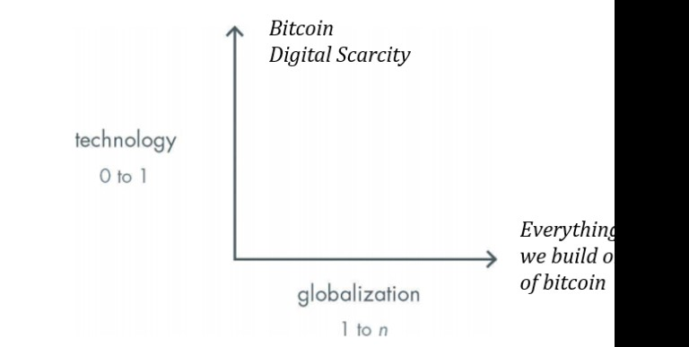
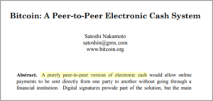
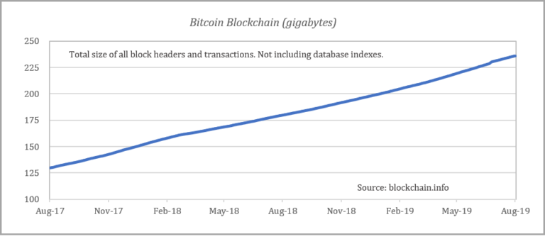
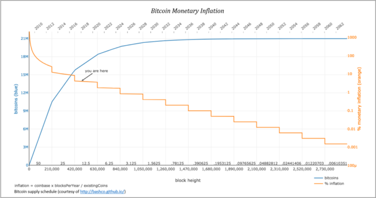
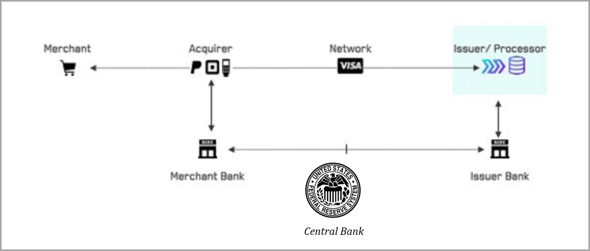

En *Cero a Uno* de Peter Thiel, él describe el impacto que tiene la nueva tecnología en la construcción de un futuro de suma distinta de cero. Si bien el libro está enfocado en individuos y compañías, Bitcoin como sistema monetario es el último salto tecnológico de cero a uno. Para ejemplos históricos, Thiel destaca el advenimiento de la máquina de vapor, así como el cambio de las máquinas de escribir a los procesadores de computadoras, entre otros. Él también articula una observación de que la innovación se encuentra estancada en gran medida desde principios de la década de 1970, al tiempo que señala que el progreso tecnológico desde ese entonces ha sido más de 1 a n que de 0 a 1. Bitcoin corrige esto. La innovación de Bitcoin no es únicamente de 0 a 1; es fundamentalmente distinta a la clase de innovación en la que se enfoca el libro de Thiel. Bitcoin es un protocolo monetario basado en la escasez digital, cuyo impacto será mucho más amplio que el de las máquinas de vapor y los procesadores informáticos.

### Bitcoin arregla esto

Hay un nuevo meme flotando en Internet; cualquiera que sea el problema, *Bitcoin lo arregla.* ¿Deuda de rendimiento negativo? Bitcoin arregla esto. ¿Desigualdad de riqueza? Bitcoin arregla esto. ¿Guerra global sin fin? Bitcoin arregla esto. ¿Crisis financiera? Bitcoin arregla esto. ¿Cultura de la rabia? Bitcoin arregla esto. Todavía no estamos exactamente seguros de cómo, pero es una articulación del efecto de equilibrio que un sistema monetario sólido y estable tendrá en cada aspecto de la sociedad. El dinero es la función de coordinación de la sociedad. Permite que cooperen cientos de millones de personas que de otro modo no tendrían una base para hacerlo. Y, Bitcoin es la herramienta que permitirá mayor coordinación pacífica porque es inmanipulable y carece de riesgo moral. Cómo se globaliza es el problema “1 a n” (no en el sentido expreso que describe Thiel), pero las soluciones para escalar Bitcoin naturalmente serán incrementales. El beneficio colectivo de la suma distinta de cero que sigue quizás no cure literalmente cada malestar en el mundo, pero la invención de una red monetaria de cambio de función escalonada es fundamentalmente diferente a otros productos particulares porque el dinero es el bien económico que coordina todas las demás actividades económicas.

*“El problema es precisamente cómo ampliar el alcance de nuestra utilización de recursos más allá del alcance del control de cualquier mente; y por lo tanto, cómo prescindir de la necesidad de control consciente y cómo proporcionar incentivos que hagan que los individuos hagan las cosas deseables sin que nadie tenga que decirles qué hacer”.*

FA Hayek, [El uso del conocimiento en la sociedad.](http://bev.berkeley.edu/ipe/readings/The%20use%20of%20knowledge%20in%20society.pdf)

Hayek escribe acerca de la invención del dinero y el mecanismo de precios como la herramienta que permite a la sociedad prescindir de la necesidad de un *“control consciente”*. Bitcoin es el sucesor superior de este mecanismo, y su innovación de cero a uno es la escasez digital, no los pagos o la rapidez de las transacciones. Si bien la propiedad de escasez de Bitcoin aún requiere de más pruebas de estrés, es un logro profundo y es lo que hace que Bitcoin sea único. Nunca antes de Bitcoin había existido un activo, y mucho menos uno digital, que fuese finitamente escaso; el resultado final de su innovación es la forma de dinero más difícil que jamás haya existido. Ese es el logro de cero a uno y un fenómeno que casi con certeza no se repetirá.

Cualquier otro problema que Bitcoin tenga que superar es más sencillo en relación a la escasez. ¿Pagos digitales? La idea de que el ingenio humano pueda crear escasez digital pero que luego no podamos aplicar tecnología de pagos no es lógica. La tecnología de pagos es solo una de las muchas innovaciones 1 a n que se construirán sobre Bitcoin para globalizar su adopción. Los pagos no solo son más fáciles de resolver, sino que tampoco es un camino crítico que necesita resolverse **hoy**. El principal caso de uso de Bitcoin hoy es como mecanismo de ahorro, no como pago. Con el tiempo, a medida que la adopción aumenta y se construye más infraestructura, Bitcoin evolucionará hacia una moneda más transaccional, pero ese proceso ocurrirá gradualmente, no de repente. Y a medida que ocurra el cambio, los usuarios de Bitcoin continuarán aprovechando los sistemas monetarios heredados y las formas de pagos heredadas.

### No es una pasarela de pagos

La blockchain de Bitcoin nunca será una capa para los pagos masivos, pero existe una cantidad considerable de debate acerca de este tema. Muchos sostienen la opinión de que para que Bitcoin sea “exitoso” debe ser una ventanilla única, que combine los roles de emisor de moneda, capa de liquidación y riel de pagos. Mientras Bitcoin cumple maravillosamente las dos primeras funciones (emisor de moneda + capa de liquidación), categóricamente no es una pasarela de pagos. Tanto por razones de velocidad como de escala, Bitcoin falla la prueba de pagos. ¿Las buenas noticias? No necesitamos que la red Bitcoin sea una pasarela de pagos.

Gran parte de la confusión en el debate filosófico (en vez del técnico) proviene de la salva inicial del Libro Blanco de Bitcoin: “Un sistema de efectivo electrónico usuario-a-usuario”. Algunos han interpretado que usuario-a-usuario implica que Bitcoin necesita ser capaz de manejar hasta la última transacción en el mundo entre dos pares cualquiera. Por otra parte, otros creen que si las transacciones de Bitcoin no pueden ocurrir a la escala o rapidez de Visa o Mastercard, es estructuralmente defectuoso. Esencialmente, según los escépticos, si Bitcoin no puede cumplir con estos dos estándares, falla en esa promesa. Afortunadamente no es así.

Como antecedente adicional, los bloques de Bitcoin se resuelven cada 10 minutos *en promedio*; sin embargo, los bloques de Bitcoin no se resuelven con precisión cada 10 minutos en un horario fijo. El siguiente bloque puede resolverse en 1 minuto o 20 minutos, 30 segundos o 36 minutos. La red se ajusta de manera que los bloques se resuelven en promedio cada 10 minutos. ¿Cómo podría un comerciante o procesador de transacciones vivir en un mundo tan lento o tan impredecible? Si bien no existe una capacidad de transacción fija en Bitcoin por recuento, cada transacción de Bitcoin consume una cantidad limitada de espacio del bloque; en función de la capacidad limitada, los bloques incluyen aproximadamente 2.700 transacciones en promedio. Con intervalos de bloque de diez minutos en promedio, seis bloques por hora, 24 horas al día, 365 días al año, eso equivale a una capacidad de red de aproximadamente 145 millones de transacciones por año, lo que equivale aproximadamente a 4,6 transacciones por segundo. Por otro lado, Visa procesa 124 mil millones de transacciones por año a una tasa de promedio de 4,000 transacciones por segundo ([ver aquí](https://www.sec.gov/Archives/edgar/data/1403161/000140316118000055/v093018.htm)).  

*Fuente: Blockstream.info*

¿Cómo puede Bitcoin ser el motor puramente de igual a igual que impulsa el sistema financiero global, si opera a casi una milésima parte de la escala y la rapidez de Visa por sí sola? La realidad siempre ha sido que, si Bitcoin tuviera un valor distinto de cero, la consecuencia sería un sistema tan valioso que cualquier capa base no podría manejar todas las transacciones sin sacrificar la descentralización o la resistencia a la censura. Sin estas propiedades, Bitcoin no sería una innovación de cero a uno y su función de valor se rompería. Por último, la capa del protocolo de Bitcoin proporciona la función de emisión de moneda y liquidación final, pero no es capaz de almacenar cada pequeña compra, incluyendo su Starbucks, por el resto del tiempo para todos.

Si fuera lo último, todas las transacciones de todas las personas, sin importar cuán grandes o pequeñas sean, tendrían que ser validadas y almacenadas por cualquier otra persona en la Tierra. Sin un mecanismo para alinear los intereses de los participantes de la red, existiría una tragedia del problema de los comunes y el resultado final sería un sistema monetario menos seguro sujeto a centralización. En cambio, nosotros aceptamos un mecanismo para limitar el rendimiento de las transacciones en la capa base, cambiando aspectos de la arquitectura transaccional de par a par de Bitcoin a capas separadas que se integran con Bitcoin. Dichas compensaciones se han realizado para asegurar la base del sistema monetario de Bitcoin (descentralización → resistencia a la censura → suministro fijo).

Muchos apuntan a este texto del Libro Blanco de Bitcoin publicado por su fundador seudónimo como evidencia de que Bitcoin siempre tuvo la intención de cumplir con todos los pagos de todos los posibles pares de la red. Dice “puramente de igual a igual” después de todo. Sin embargo, más importante para Bitcoin que todo lo escrito en este resumen (o cualquier interpretación) es el mecanismo de consenso de Bitcoin. Todo lo crítico en Bitcoin se hace cumplir por consenso de los participantes de la red, incluyendo su suministro fijo y, en última instancia, la capacidad dentro de cada bloque de Bitcoin, lo que limita la cantidad de transacciones que puede procesar. Esta es la diferencia fundamental entre Bitcoin y el sistema financiero heredado: política monetaria por consenso y no por mandato. El fundador de Bitcoin creó un sistema que finalmente removió decisiones críticas de cualquier autoridad central, en su lugar las encomendó a la sabiduría del consenso del mercado. Es un sistema que es suficientemente flexible para ser adaptado pero lo suficientemente rígido como para que cualquier cambio sustancial sea muy difícil. Como consecuencia, los pares de la red tienen que decidir, de manera descentralizada, la mejor forma de escalar Bitcoin. Es a través de este mecanismo de consenso que Bitcoin prescinde de la necesidad de un “control consciente”.

### Compensación de seguridad

Todo viene con compensaciones. En Bitcoin, hay dos santos griales: un suministro fijo de 21 millones y evitar que la moneda se gaste varias veces (el problema del doble gasto). El valor de Bitcoin deriva de su capacidad para asegurar ambas funciones de forma descentralizada y sin confianza, y ambas están inextricablemente relacionadas a la capacidad de red fija de Bitcoin. Piense en la capacidad dentro de cada bloque de Bitcoin como bienes raíces digitales valiosos. Todos los participantes del mercado que buscan liquidar las transacciones de Bitcoin tienen que competir por la capacidad del bloque. La escasez en la capacidad de la red es la función mediante la cual el recurso compartido de Bitcoin es optimizado. O piense en ello como la solución de Bitcoin a la tragedia de los bienes comunes. La competencia por este escaso recurso asegura que se utilice de manera eficiente y que su valor se maximice. Por último, la escasez hace que los participantes del mercado compitan entre sí, aumentando el valor de la capacidad de la red, en lugar de trasladar las externalidades negativas al resto de la red.

En el mercado libre de Bitcoin, las transacciones de mayor valor y más rentables son priorizadas. Sin la escasez en la capacidad de transacción, esta función de valor colapsaría. Es menos importante que nosotros optimicemos la capacidad de transacción y más crítico que exista escasez. Nadie sabe realmente la cantidad óptima de capacidad de transacción en ningún momento, en parte porque la demanda cambia constantemente, pero también porque generalmente está creciendo con el tiempo. La pieza fundamental es que la capacidad es conocida y escasa, lo que permite a los participantes del mercado planear y, en última instancia, competir. Los bienes comunes nunca se agotan; en cambio, los participantes compiten e innovan para descubrir la mejor forma de utilizar un activo escaso. La escasez garantiza que no se abuse de los bienes comunes y crea una tasa de crecimiento predecible en el tamaño general de la blockchain de Bitcoin, que en última instancia protege y promueve la descentralización.

Como se discutió en una edición anterior ([ver aquí](https://unchained-capital.com/blog/bitcoin-does-not-waste-energy/)), los mineros protegen la red de Bitcoin al dedicar recursos energéticos del mundo real para ejecutar funciones de hash criptográficas y resolver bloques de Bitcoin. Al resolver los bloques, los mineros validan el historial y borran las transacciones actuales que luego son verificadas y validadas por el resto de la red. A cambio, a los mineros se les paga en bitcoin. Dedican recursos para proteger la red y recibir pagos en la moneda nativa de la red (bitcoin). La compensación real que se paga a los mineros se presenta en dos maneras: bitcoin recién emitidos y tarifas de transacción. Para dedicar recursos hoy para proteger a la red, los mineros deben esperar de manera confiable que la compensación agregada mantendrá su valor en el futuro.

Aproximadamente cada cuatro años, el bitcoin recién emitido que se paga a los mineros se reduce a la mitad (la “reducción a la mitad” o *Halving* de Bitcoin). Hoy, con cada bloque, se emiten 12,5 bitcoins nuevos. Aproximadamente en ocho meses, cuando ocurra el próximo evento de reducción a la mitad ([ver aquí](https://www.buybitcoinworldwide.com/bitcoin-clock/)), esa cantidad se reducirá a 6,25 nuevos bitcoin por bloque. Aproximadamente cuatro años después de eso, se emitirán 3,125 nuevos bitcoin por bloque. Este proceso continuará hasta que alcancemos la unidad más pequeña de bitcoin (1 / 100.000.000) y, a partir de entonces, no se emitirá ningún bitcoin nuevo. Esta es la función de emisión que gobierna la oferta fija de Bitcoin (21 millones) y, como función derivada, hay un cambio compensatorio para asegurar la red de (en su mayoría) bitcoin nuevos hoy en día a un sistema que depende completamente de las tarifas de transacción.

Pero, ¿cómo se relaciona esto con Visa y la capacidad de transacción? Si no fuera por la escasez de capacidad en cada bloque de Bitcoin, no existiría un mecanismo para crear un mercado de tarifas de transacción. La escasez de espacio en bloques crea competencia entre los participantes del mercado para compensar las transacciones, lo que hace que aumenten el valor de los espacios y los utilicen de manera eficiente. Sin un mercado de tarifas, el único mecanismo para pagar a los mineros para asegurar la red sería alterar la política monetaria fija de Bitcoin y aumentar la oferta. Pero recuerde que la escasez en la oferta fija de Bitcoin (21 millones) es la base de su propiedad de reserva de valor, que es donde el caucho se encuentra con el camino. Al crear escasez en la capacidad de la red, nosotros también aseguramos la integridad del suministro fijo de bitcoin, lo que hace que funcione todo el ciclo de valor. Trabajando en esta realidad, la escasez es una propiedad mucho más importante que la velocidad o la capacidad final del rendimiento de las transacciones.

*Capacidad de red fija → Capacidad de transacción limitada → Mercado de tarifas → Suministro fijo de Bitcoin*

Y debido a que el problema real que Bitcoin está intentando resolver es el del dinero y el QE global (no los pagos), aquellos que almacenan riqueza en Bitcoin preferirían asegurar la oferta monetaria que sacrificar su integridad y credibilidad a largo plazo por el rendimiento de las transacciones. En resumen, el futuro de Bitcoin es mucho más seguro en un mundo donde todos los participantes del mercado pueden depender de que tenga un suministro fijo y escaso de forma confiable, mientras acepta un menor rendimiento o velocidad de las transacciones como compensación. ¿De qué sirve un alto rendimiento de transacciones y velocidades más rápidas si el valor fundamental de la moneda subyacente está en riesgo? El sistema financiero existente ya ha hecho la compensación opuesta para nosotros. Alto rendimiento de transacciones y transacciones rápidas mediante la centralización, pero con el costo de una arquitectura susceptible de degradación monetaria sistémica. Bitcoin representa la alternativa y nosotros no vamos a cometer el mismo error dos veces.

### Bitcoin ≠ Visa

En última instancia, Bitcoin no está compitiendo con Visa por la supremacía en los pagos globales. En cambio, Bitcoin está compitiendo con el dólar, el euro, el yen y el oro como dinero, y cualquier otra comparación con Visa, su volumen o velocidad de transacción es fundamentalmente defectuosa. Bitcoin cumple el papel de emisor de moneda y liquidación final. Como resultado, la comparación adecuada sería entre Bitcoin y el Sistema de Reservas Federales (FED) como emisor de divisas y como mecanismo de compensación. Nadie comete el error de confundir las funciones de Visa con las de la FED de New York, pero por alguna razón, la comparación se hace con frecuencia entre Visa y Bitcoin.

Si bien requeriría de tiempo e inversión, la red de pagos de Visa podría ubicarse en la parte superior de la red Bitcoin para cumplir con los pagos de la misma manera que se ubica en la sobre el sistema bancario existente. En lugar de liquidar la moneda a través de un banco central, la liquidación final de las transacciones se liquidaría a través de la red de Bitcoin. En la arquitectura existente, la capa de pagos (Visa) y la capa de liquidación (red bancaria / bancos centrales) son independientes y distintas. El principal problema que Bitcoin intenta resolver tiene poco que ver con el primero, sino con el mecanismo por el cual se emite y se autoriza la moneda (piense en la FED y QE). Visa ayuda a mover dólares, pero Visa no es el dólar. Es una empresa de tecnología que brinda un servicio; tiene 17.000 empleados. Bitcoin no tiene ninguno.

Ya sea por débito o crédito,  Visa es un sistema de crédito intrínsecamente basado en la confianza. Si bien los consumidores generalmente asocian pasar una tarjeta Visa (o su equivalente) en un terminal de punto de venta como pago, realmente no lo es. En cambio, los saldos son verificados, se autorizan las transacciones y la liquidación se produce más tarde. Los dólares realmente no se compensan mediante un banco central ni se liquidan en el punto de venta cada vez que una transacción es procesada. Las transacciones individuales tampoco se compensan nunca realmente. En cambio, las transacciones se agrupan, se compensan y liquidan en un momento posterior; solo entonces se abonan las cuentas con los saldos adecuados. Entonces, cuando alguien intenta equiparar una transacción de Visa con un acuerdo final, simplemente no es así como funciona el mundo. Pero esa es la comparación que se hace implícitamente cuando alguien intenta comparar Visa con Bitcoin.

### Bitcoin contra la Reserva Federal

Cuando se compara con su competencia real (la FED, ECB, BOJ, etc.), Bitcoin se comienza a parecer a un Ferrari. Liquidación global final aproximadamente cada 10 minutos, 24 horas al día, 7 días a la semana, 365 días al año sin permiso. Compare esto con el sistema financiero autorizado existente, el cual está sujeto a múltiples niveles de intermediarios bancarios y del banco central y solo abre durante el horario de “trabajo”. Este es el gran nombre inapropiado que existe dentro de Bitcoin. Quienes creen que Bitcoin es demasiado lento o que carece de capacidad de red están comparando Bitcoin con la aplicación incorrecta. Podríamos establecer una red de bancos sobre la primera capa de la red de Bitcoin y el sistema de pagos podría funcionar como lo hace hoy.

El retroceso en este punto es el riesgo de la centralización. Si Bitcoin se sentara en bancos centralizados, crecería la posibilidad de que la red Bitcoin pudiera ser cooptada y socavada por una red de bancos y bancos centrales, ya sea para forzar cambios en las reglas de consenso de la red o para censurar a los usuarios finales. Al final, este fue el fracaso del oro como medio monetario. Fue susceptible a la centralización, que luego generó monedas fiduciarias, que han resultado ser fácilmente manipulables. Si bien esto es poco probable (y esperemos que no) cómo escala Bitcoin, el dinero y la tecnología de pagos son problemas distintos. La razón fundamental es que hay dos lados en cada transferencia de valor; un lado casi siempre involucra dinero y el otro como cumplimiento de bienes y servicios. Las capas de pagos ayudan a proveer un puente.

Debido a la naturaleza del comercio, los dos lados de una transferencia de valor generalmente, y naturalmente, ocurren por diferentes procesos y en diferentes momentos. Piense en la liquidación de monedas por un lado y la transferencia del título de una casa o automóvil por el otro. O el pago de un bien en Amazon y la liquidación de ese bien dos días después. Dos procesos diferentes, ocurriendo en dos momentos diferentes. Y es importante reconocer que Bitcoin no tiene conocimiento del mundo exterior, ya sean identidades o la segunda etapa de una transferencia de valor; todo lo que Bitcoin sabe hacer es emitir y validar la moneda (si un bitcoin es un bitcoin). Esta es realmente la función y la limitación de cualquier sistema de moneda base. Las capas de pagos proveen un puente entre la liquidación de monedas (la FED o Bitcoin) y el cumplimiento de bienes y servicios. El oro resolvió los pagos masivos mediante la centralización bancaria, el dólar, la FED y grandes procesadores de pagos como Visa. Bitcoin probablemente resuelva los pagos a través de un mecanismo tecnológicamente superior, pero tenemos tiempo para resolver lo que es un problema separado y distinto que el del dinero. 

### Escalar Bitcoin es de 1 a n

Si resolvemos primero el problema del dinero mediante la escasez digital (de cero a uno), los avances tecnológicos para escalar las transacciones y, en última instancia, resolver los pagos son de 1 a n. No es creíble pensar que el ingenio humano pueda resolver lo primero pero luego fallar en las derivadas incrementales. No es solamente una cuestión de esperanza y fe; en cambio, es de razón y lógica, considerando tanto los avances en las soluciones de escala que ya se están persiguiendo como los desafíos relacionados con el problema que Bitcoin ya ha resuelto. La innovación sin permisos y los incentivos económicos inherentes a Bitcoin coordinarán y acelerarán las soluciones a cualquier número de desafíos futuros. Los participantes del mercado tienen un incentivo para aumentar el valor de la red e innovar para escalar la red, pero las soluciones tendrán que funcionar dentro del consenso de la red u obtener el consenso suficiente para cambiar las reglas.

Debido a la naturaleza de los incentivos económicos de Bitcoin, es mucho más probable que las soluciones de escala funcionen dentro de las reglas de consenso existentes. Un ejemplo de un avance para escalar Bitcoin dentro del consenso de la red es la red Lightning. La red Lightning se construye en la parte superior de Bitcoin como una capa de confianza minimizada para escalar la capacidad de transacción, que sigue siendo fundamentalmente distinta del cumplimiento de pagos.  Sin embargo, si tiene éxito, Lightning se utilizará para crear canales de pago de Bitcoin que permitan un rendimiento de transacciones mucho mayor a un costo mucho menor, cuya escala y velocidad serían rivales de Visa. Si bien puede que no sea la solución definitiva, es un ejemplo de la innovación que Bitcoin está fomentando. Lightning también es solo una de las tantas soluciones que se están desarrollando activamente, y la competencia nos guiará hacia las mejores soluciones de escala, de las cuales puede haber una combinación de muchas.

El enfoque para escalar Bitcoin es un proceso lento y conservador. Bitcoin es demasiado importante para seguir el mantra de Silicon Valley de moverse rápido y romper cosas. En vez de eso, se mueve lentamente y no rompe nada. Si se va a construir un sistema financiero global sobre un sistema monetario descentralizado, la base debe protegerse a toda costa. Primero, que garantice la seguridad de la capa monetaria base (Bitcoin) y luego permita que los participantes de la red innoven sobre ella sin las cuestiones de permiso. Recuerde que Bitcoin solo tiene diez años; nosotros estamos en los inicios del evento de monetización de Bitcoin y aún se está construyendo la infraestructura para permitir la proliferación de esta nueva tecnología.

Es un poco ridículo contemplar el problema que Bitcoin ya ha resuelto y luego girar inmediatamente a una línea de pensamiento de “pero por qué no pagos masivos hoy”. Especialmente cuando se considera que Bitcoin, en su función de compensación, ya es más rápido y confiable que los mecanismos comparables para la liquidación final de dólares, euros, yenes u oro. Luego, cuando se comprende que el caso de uso fundamental de Bitcoin hoy en día es como un mecanismo de ahorro a largo plazo (no para cumplir con los pagos), queda más claro que no solo se diagnostica mal el problema, sino que las soluciones deseadas pueden esperar. Necesitaremos la capacidad de cumplir con los pagos en el futuro, pero tenemos tiempo antes de llegar allí. A su debido tiempo, tendremos nuestro pastel y también lo comeremos.
