Hace unos años, recibí un correo electrónico de un amigo pidiéndome mi opinión sobre una oportunidad de inversión que un contacto mutuo nuestro estaba considerando. Después de una búsqueda rápida en Internet y después de haber visto algunos videos, le expliqué que parecía un esquema piramidal. Esta fue mi forma abreviada de “evitar a toda costa”. La información fue enviada a nuestro contacto mutuo y la respuesta no fue la que esperaba: “¿Son malos todos los esquemas piramidales?” Algunos esquemas piramidales son más difíciles de identificar que otros, pero incluso aquellos que son fáciles de identificar encuentran presas en víctimas sin pretensiones. Una buena regla general es correr, no caminar, lejos de cualquier cosa que incluso insinúe ser un esquema piramidal. Afortunadamente, bitcoin no es uno de ellos. Si bien puede parecer obvio, no todos entienden qué es realmente un esquema piramidal, cuáles pueden ser las señales de advertencia o por qué tales esquemas siempre fallan.

Definición de un esquema piramidal – Comisión de Bolsa y Valores

Señales de advertencia de un esquema piramidal – Comisión Federal de Comercio

No todos los programas de marketing multinivel son esquemas piramidales, pero todos los esquemas piramidales son de alguna manera un programa de marketing multinivel. Con los esquemas piramidales, siempre hay alguna empresa y está vendiendo un producto cuya demanda final es muy inferior a la oferta disponible. La empresa recluta participantes para comprar inventario y reclutar nuevos participantes. Los participantes son todos vendedores y la compensación está ligada principalmente a la contratación, en lugar de vender el producto real. A menudo, la venta del producto se integra a propósito en el proceso de contratación.

En un negocio normal impulsado por las ventas, la empresa asume el riesgo de inventario y paga comisiones basadas en las ventas a los usuarios finales. En un esquema piramidal, el personal de ventas asume el riesgo de inventario, en lugar de la empresa, y se paga una compensación por contratar a más personal de ventas y vender el producto a nuevos participantes. Todo se desmorona porque en realidad no existe una demanda final suficiente para el producto. Todos los que están en la cadena pueden ganar dinero a expensas de los nuevos reclutas al final de la línea. Este es un esquema piramidal. Bitcoin no lo es. Bitcoin no es una empresa. No tiene empleados y su oferta es finitamente escasa. No importa cuántas personas lo adopten, solo habrá 21 millones de bitcoins.

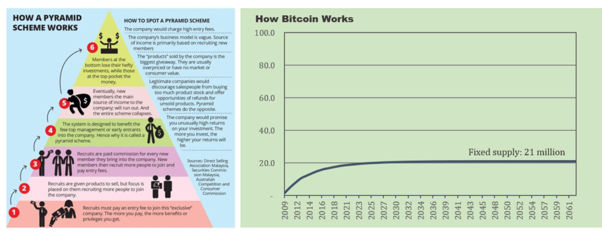

Bitcoin vs esquema piramidal

Las distinciones deberían ser evidentemente obvias, pero debido a que bitcoin es complejo y la idea misma de dinero no se comprende bien, puede confundirse fácilmente. Bitcoin solo se convertirá en una moneda de reserva global si cientos de millones (si no miles de millones) más la adoptan. Y aparentemente todos los que caen por la madriguera del conejo de bitcoin terminan del otro lado explicándolo a sus familiares y amigos, presentándolo como una mejor forma de dinero. Suena como un esquema piramidal, ¿verdad? Equivocado. Cuando Dell comenzó a vender PC en su sitio web en 1996 y todos les dijeron a sus amigos que compraran una Dell, ¿era un esquema piramidal? Cuando Apple lanzó el primer iPhone en 2007 y todos les dijeron a sus amigos que dejaran el Blackberry por su sucesor superior, ¿era un esquema piramidal?

Los cambios tecnológicos a menudo ocurren rápidamente. Diez y veinte años después, los teléfonos inteligentes y las PC son omnipresentes. Se trata de la calidad del producto y la estructura de incentivos. Si alguien poseía acciones de Apple o de Dell, ¿cambió el hecho de que el producto en sí proporcionaba una propuesta de valor real? ¿Hubo un beneficio directo por informar a la gente sobre una nueva innovación tecnológica? La propuesta de valor de una innovación triunfa sobre todo lo demás. No importa cómo lo aprenda; lo único que importa es si la innovación proporciona utilidad. Si lo hace, la gente querrá usarlo; si no es así, no lo harán. Eso es lo que hace un mercado.

### La utilidad y la innovación de Bitcoin

La utilidad de Bitcoin es como dinero. Tiene mercado porque resuelve un problema inherente al dinero moderno. Bitcoin no solo no es un esquema piramidal; es fundamentalmente diferente de la clase de innovación que podría ofrecer cualquier empresa individual. Bitcoin no es Dell y no es Apple. No es una acción tecnológica. No hay ninguna empresa que exista detrás de bitcoin. Bitcoin no es una empresa que vende un producto y no hay un flujo de ingresos para pagar dividendos futuros. Bitcoin no se trata de ganar dinero; en cambio, bitcoin es dinero, o al menos se ha convertido en dinero para quienes eligen almacenar una parte de su riqueza en él. Y no es un plan para hacerse rico rápidamente; se trata fundamentalmente de almacenar el valor que ya ha creado. Bitcoin es un activo al portador; sin embargo, a diferencia de un bono al portador, no existe un flujo de ingresos.

La innovación de Bitcoin es que representa una forma superior de dinero, pero no hay promesas futuras más allá de estar en posesión de un instrumento portador digital. La única utilidad de bitcoin es mantenerlo como moneda y realizar transacciones con él en el futuro, ya sea a cambio de monedas heredadas u otros bienes y servicios. Bitcoin solo es útil como forma de dinero y solo mantendrá su valor si otros lo exigen en el futuro. Pero esto es cierto para cualquier forma de dinero (no solo bitcoin). El dinero no es una alucinación colectiva o simplemente un sistema de creencias; los bienes monetarios tienen propiedades distintas que los hacen más o menos efectivos para facilitar el intercambio. Sin embargo, las propiedades monetarias no son absolutas; la fuerza relativa de las propiedades monetarias es la base fundamental de la demanda. Cuando el mercado evalúa bitcoin, lo hace en relación con otros medios monetarios (dólar, euro, yen, oro, etc.).

El suministro de bitcoin, y su rígida restricción de suministro, es la base de la utilidad y la demanda fundamental de bitcoin; también es la razón por la que bitcoin no es un esquema piramidal. Solo habrá 21 millones de bitcoins. Ese es el punto de intriga de bitcoin. Todos lo saben; todos lo recuerdan. Todos también pueden verificarlo en cualquier momento. Para una discusión sobre cómo y por qué bitcoin tiene un suministro fijo creíble, consulte [*Bitcoin, no Blockchain*](https://translate.google.com/translate?hl=es&prev=_t&sl=auto&tl=es&u=https://www.unchained-capital.com/blog/bitcoin-not-blockchain/) y [*Bitcoin no está respaldado por nada*](https://translate.google.com/translate?hl=es&prev=_t&sl=auto&tl=es&u=https://www.unchained-capital.com/blog/bitcoin-is-not-backed-by-nothing/) . Pero por ahora, solo trabaje asumiendo que el suministro de bitcoins tiene un límite de 21 millones. Por el contrario, nadie conoce la oferta de dólares. La Fed estima la oferta actual de dólares, pero nadie sabe cuántos dólares existirán en el futuro. No hay ninguna restricción sobre la oferta del dólar, aparte de la Reserva Federal, y todo lo que sabemos con certeza es que existirán muchos más dólares en el futuro; es una función ilimitada. Al final, existe una demanda fundamental de bitcoin porque su política monetaria i) está diseñada de manera óptima y ii) se aplica de manera creíble. En relación con su competencia, bitcoin es un medio monetario muy superior.

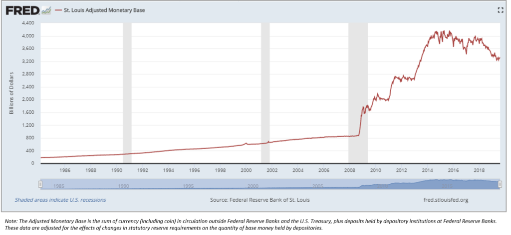

Anexo A – Oferta histórica en dólares

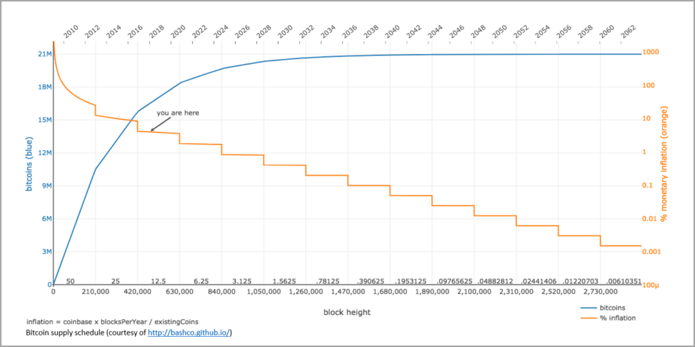

Anexo B – Programa de suministro de Bitcoin

La base monetaria en los sistemas fiduciarios cambia de manera impredecible, mientras que la base monetaria en bitcoin se rige por un programa de suministro bien definido. Piense en la base monetaria como la base de un sistema económico global. Los cambios impredecibles en la oferta de dólares no son simplemente similares a cambiar los proverbiales postes de metas. En cambio, es más similar a construir el campo sobre una cama de agua al estilo de la década de 1980 y luego cambiar los postes de la portería. Todo el juego está distorsionado, no solo los puntos finales. Bitcoin, por otro lado, es un cimiento en función de su suministro fijo y, con el tiempo, la base se vuelve cada vez más fuerte. La credibilidad de su programa de suministro se refuerza con cada bloque de bitcoin que pasa. A medida que se hace más evidente que el cronograma de suministro de bitcoins se aplica de manera creíble, más personas adoptan bitcoin como una forma de dinero, y aquellos que ya lo han utilizado cada vez más como una reserva de riqueza. Oferta fija + adopción creciente = valor aumentado. A medida que aumenta la adopción y aumenta el valor, bitcoin se descentraliza aún más. Y a medida que bitcoin se descentraliza con el tiempo, se vuelve más difícil de cambiar, lo que refuerza la credibilidad de su base: su suministro fijo.

### Tu eres el estafador

En un esquema piramidal, las personas que venden el esquema son los estafadores. Estos estafadores están vendiendo la promesa de ganancias monetarias futuras a través de tácticas de venta de alta presión y reclutando nuevos miembros para el esquema como el mecanismo de compensación principal. En bitcoin, las personas que compran bitcoins son los estafadores, como se describe en la pieza atemporal de Michael Goldstein, [Everyone’s a Scammer](https://translate.google.com/translate?hl=es&prev=_t&sl=auto&tl=es&u=https://nakamotoinstitute.org/mempool/everyones-a-scammer/) . Si eres tú, eres el estafador. En la mayoría de los casos hoy en día, cada vez que alguien compra bitcoin, está negociando directamente una forma de moneda reservada fraccionalmente (con la promesa de una degradación futura) a cambio de un activo al portador con un suministro finito y una política monetaria muy superior. La persona al otro lado de la línea está recibiendo el trato injusto. No quiere decir que literalmente todos los que venden bitcoins lo hacen sin una buena razón. Después de todo, es dinero y su utilidad está en el intercambio; por definición, los participantes del mercado tienen una amplia variedad de necesidades actuales de liquidez y el valor real se transfiere cada vez que se realiza una transacción con un bitcoin, ya sea por dólares o por bienes y servicios. Sin embargo, en promedio y a largo plazo, es la asimetría de información en pleno efecto. La política monetaria de Bitcoin está diseñada de manera óptima y se aplica de manera creíble, aunque pocos la entienden, por lo que representa la mayor asimetría del mundo actual.

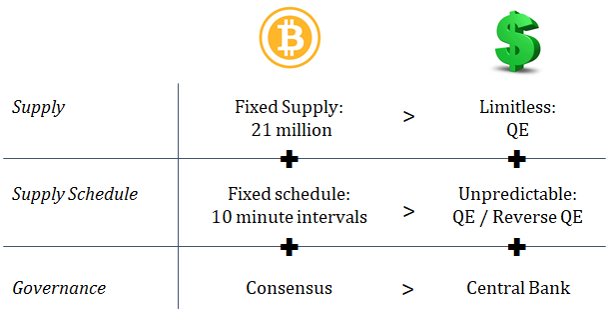

Bitcoin vs dolar.

### Primeros principios monetarios

Un medio monetario con la tasa de cambio más baja es más eficaz para comunicar señales económicas, y una oferta fija (tasa de cambio cero) es el juego final óptimo de la política monetaria. Si bien el monocultivo que es la corriente principal académica moderna no está de acuerdo con este punto de vista, una moneda de oferta fija es superior a una moneda que aumenta en oferta con el tiempo (y a tasas impredecibles). En cualquier economía, la oferta y la demanda de bienes y servicios en relación con la oferta y la demanda de dinero dicta los precios. El precio es lo que, en última instancia, coordina la actividad económica, y el dinero es la base del mecanismo de precios dentro de una economía. Una moneda con una oferta fija eliminaría el ruido creado por los cambios en la oferta monetaria en el sistema de precios, creando así señales de mercado más confiables. Debido a que un bien monetario facilita el intercambio entre bienes utilizados con fines de consumo o producción, la forma de dinero con la tasa de cambio más baja reflejará con mayor precisión los cambios en la oferta y la demanda de todos los demás bienes. Esencialmente, el dinero se utiliza para comunicar el valor relativo de otros bienes y servicios, y los cambios en la oferta monetaria distorsionan la comunicación de esta información al introducir una variable extraña a la ecuación.

Por ejemplo, un iPhone cuesta aproximadamente $ 1,000, mientras que un barril de petróleo cuesta aproximadamente $ 50. La información comunicada a través de un medio monetario es que un iPhone cuesta aproximadamente 20 veces más que un barril de petróleo. El dinero comunica el costo de oportunidad (compensaciones económicas) a través de su sistema de precios, y cuanto más constante es la cantidad de dinero (tasa de cambio más baja), más confiable es la comunicación de información y las compensaciones económicas. Si la oferta monetaria aumentara en un 10% y los precios se ajustaran por igual, un iPhone costaría $ 1,100 y un barril de petróleo costaría $ 55. Un iPhone aún costaría 20 veces más que un barril de petróleo, y esa es la información relevante en la que confían todos los participantes del mercado. En el mundo real, el problema es que los precios no se ajustan por igual a medida que cambia la oferta monetaria. En cambio, las señales de precios se distorsionan. En un mundo con una oferta monetaria constante, los cambios en el precio reflejarían con mayor precisión los cambios en la oferta y la demanda en los mercados subyacentes de bienes y servicios en lugar de reflejar también el impacto desigual de una oferta monetaria cambiante. Los cambios en la oferta monetaria crean un ruido ajeno a la actividad económica subyacente. El precio coordina las compensaciones económicas y la confiabilidad de un sistema de precios depende de la estabilidad de la forma de dinero utilizada para comunicar la información.

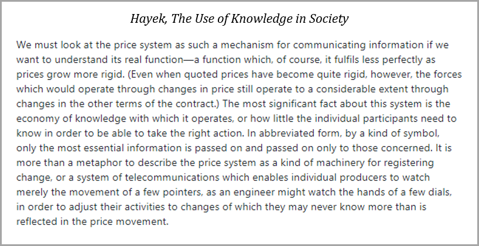

En ese sentido, se diferencian los bienes monetarios (al menos los que surgen en el mercado libre); es por eso que el dinero es una herramienta de comunicación eficaz. La estructura del mercado del dinero es diferente a la de todos los demás bienes. Un bien de consumo se consume y un bien de producción se consume en última instancia en la producción de otros bienes de consumo. Considerando que, la utilidad del dinero está a cambio; es funcional en la coordinación del comercio por y entre bienes de consumo y producción, en lugar de consumirse en sí mismo. Debido a que la utilidad del dinero está a cambio, la escasez es más importante que la cantidad nominal de dinero en una economía. A medida que aumenta la demanda de dinero y aumenta su precio, no hay una respuesta de oferta acorde debido a las limitaciones naturales de la oferta. No ocurre lo mismo con ningún bien o servicio individual. La restricción relativa de la oferta de dinero es lo que le permite comunicar el valor relativo entre otros bienes y servicios. Los bienes de consumo y los bienes de producción pueden sustituirse entre sí, pero el dinero facilita prácticamente todos los intercambios entre todos los demás bienes. El valor de un dinero puede fluctuar en relación con los bienes y servicios, pero la escasez relativa de una oferta monetaria permite que el precio se comunique en términos del dinero en sí.

Antes de bitcoin, ninguna forma de dinero era escasa. Bitcoin tiene un suministro fijo, con un límite de 21 millones. La escasez finita crea una constante donde antes no existía ninguna. Imagine que la oferta de un bien es perfectamente constante mientras que la oferta de todos los demás bienes fluctúa. La demanda de todos los bienes cambia, pero solo existe una constante: la oferta de bitcoins. En este mundo, todo se mediría contra la constante. El poder adquisitivo del dinero comunicaría información mucho más perfecta a través de este mecanismo de precios que si la oferta del dinero en sí cambiara. Al crear una constante, todo lo demás se puede medir de manera más confiable. Y la información deseada no es el valor absoluto de ningún bien. Todo valor es subjetivo. En cambio, la información crítica comunicada a través de un mecanismo de precios es el valor relativo (o precio relativo) de muchos bienes entre sí. Si bien los niveles de precios cambian constantemente debido a la oferta y la demanda en constante cambio, la estabilidad del mecanismo de precios en sí permite la coordinación económica a través de la comunicación del costo de oportunidad (es decir, cómo sabemos, o aprendemos, que un iPhone cuesta aproximadamente 20 veces más que un barril de petróleo).

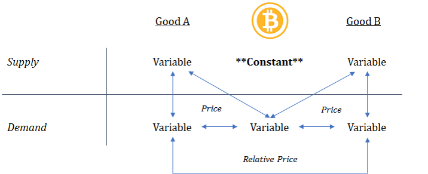

### Distorsión del sistema de precios

En nuestro sistema actual, la oferta de dinero cambia de manera impredecible y aumenta con el tiempo. Esto es fundamental para el modelo monetario de la banca central y se deriva de la teoría económica monetarista que sostiene que una gestión activa de la oferta monetaria estimula *la demanda agregada* y, en última instancia, promueve el pleno empleo. Lo que hace técnicamente es manipular las tasas de interés a la baja aumentando la oferta de dinero. Las tasas de interés más bajas aumentan la disposición y los incentivos para pedir prestado; sin embargo, en igualdad de condiciones, un interés más bajo disminuiría la disposición a prestar. Esencialmente, al inflar la oferta monetaria, el banco central manipula artificialmente la función del crédito, creando un desequilibrio sostenido entre el incentivo para pedir prestado y la voluntad de prestar. La consecuencia más generalizada es la distorsión del mecanismo de precios que coordina la actividad económica. Al manipular la oferta de dinero y la oferta de crédito, los bancos centrales distorsionan todos los precios en todo el mercado. Las señales falsas (y la mala información) se distribuyen a todos los participantes del mercado.

Toda la estructura de oferta y demanda de la economía se distorsiona a medida que cientos de millones de personas responden a señales de precios manipuladas y cuando los recursos dentro de la economía se reasignan en función de esas señales. Cuando aumenta la oferta monetaria, nuevo dinero (y crédito) ingresa al sistema a través de varios canales y en momentos impredecibles. La mayoría de los participantes del mercado desconocen la cantidad y la tasa de cambio. En cambio, los participantes del mercado reaccionan a las señales de precios; así es como se comunica la información. Una señal de precio puede ser el costo de un bien en el supermercado o puede ser un salario que un empleador está dispuesto a pagar por un determinado trabajo. El cambio en la oferta monetaria crea una distorsión de los precios de tal manera que los participantes del mercado no pueden comprender efectivamente si los cambios en el precio son impulsados por cambios en las estructuras subyacentes de oferta y demanda, o hasta qué punto los cambios en el precio son simplemente una función de más o menos dinero en el sistema. Independientemente, todos reaccionan a las señales distorsionadas.

Para un ejemplo más tangible, la Fed compró $ 1.7 billones de valores respaldados por hipotecas (~ 17% de todas las hipotecas) luego de la crisis financiera como parte de su programa de flexibilización cuantitativa, que finalmente aumentó la oferta monetaria base en $ 3.6 billones. La mayoría de la gente recuerda que antes de la crisis financiera había una burbuja inmobiliaria. Al comprar hipotecas directamente e inflar la oferta monetaria, la Fed manipuló las tasas de interés a la baja. La vivienda depende en gran medida de la oferta de crédito y, en última instancia, del costo de los intereses. Con tasas de interés más bajas y más dinero disponible para prestar, los precios de la vivienda se manipularon al alza. Como resultado, se enviaron señales de precios distorsionadas tanto a compradores como a vendedores. Los desarrolladores de viviendas responden construyendo más viviendas (aumentando la oferta) y los compradores de viviendas creen que pueden endeudarse más a tasas más bajas para comprar viviendas. Se dedican más recursos en la economía a la función de la vivienda debido a los niveles de precios más altos. Sin embargo, cualquier aumento en la demanda solo puede sostenerse mientras el costo del crédito se manipule continuamente a la baja en función de una oferta monetaria en aumento.

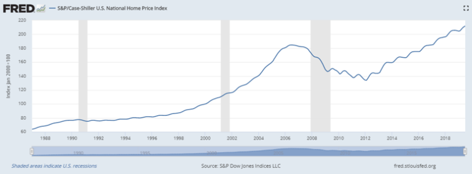

A pesar del amplio reconocimiento de la burbuja inmobiliaria insostenible en 2007, el índice nacional de precios de la vivienda es ahora un 15% más alto que en el pico anterior. Esta es la manipulación de los niveles de precios a plena vista, y ocurre como una función prevista de la política monetaria del banco central. La Reserva Federal aumenta la oferta monetaria, reduce las tasas de interés e infla los precios de los activos de manera que se pueda sostener la cantidad de deuda existente en el sistema crediticio. La expansión del crédito es el objetivo de la Fed para estimular el crecimiento, y no se puede crear nuevo crédito neto a menos que se puedan mantener los niveles de deuda existentes, razón por la cual la Fed debe inflar los precios de los activos para lograr sus objetivos. Los precios de los activos respaldan los niveles de deuda existentes. Cuando todos se dan cuenta de que las señales de precios son insostenibles y poco fiables, se produce un impacto en el sistema. Esto es lo que sucedió en 2007 y es probable que vuelva a suceder a medida que las señales del mercado se hayan distorsionado aún más. Pero no es un plan malvado; la Fed no es un actor intencionalmente malicioso. En última instancia, la Fed tiene la intención de promover el “pleno empleo” a través de sus políticas, pero lo que en realidad hace es manipular las señales de precios relativos que crean desequilibrios en las estructuras subyacentes de oferta y demanda de la economía, creando un desempleo repentino y más crónico.

Hayek habló sobre este tema en su discurso ganador del Premio Nobel de 1974, [Pretense of Knowledge](https://translate.google.com/translate?hl=es&prev=_t&sl=auto&tl=es&u=https://mises.org/library/pretense-knowledge) . En función de los precios manipulados, se dedican más recursos a un segmento de la economía de los que podrían sostenerse naturalmente de otro modo; cuando el banco central cambia el curso de su política monetaria, los precios comienzan a responder y el mercado corrige. Debido a que los niveles de precios se han manipulado de manera sostenida, un choque de demanda se vuelve inevitable y todos se dan cuenta de que existen desequilibrios. En el caso del ejemplo de la vivienda, la oferta (tanto de bienes como de mano de obra) supera significativamente la demanda sostenible a los niveles de precios actuales. En términos más generales, los desequilibrios están en todas partes. Se hace evidente que la oferta y la demanda están significativamente desequilibradas y el desempleo aumenta rápidamente. El mercado no puede encontrar un equilibrio porque todos los mercados se han manipulado de forma sostenida durante períodos de tiempo prolongados.

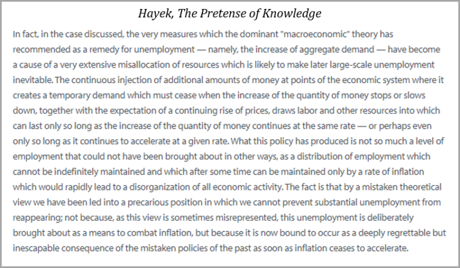

Esto es lo que ocurrió durante y después de la crisis financiera. Fue el punto de ebullición después de que la Fed había manipulado la oferta de dinero y la oferta de crédito durante décadas. Como se describe en el Big Short, la crisis financiera a menudo se atribuye a la crisis de las hipotecas de alto riesgo, pero el gorila de 800 libras que no se habla a menudo en la sala es la política monetaria del banco central. Después de la crisis, la Fed respondió aplicando la misma acción política que había llevado a cabo durante décadas, pero a una escala mucho mayor; aumentó enormemente la oferta monetaria, manipulando aún más las señales de precios. Cuando se manipula la oferta monetaria, reconozca que no todos los niveles de precios responden de manera proporcional. El dinero ingresa al sistema a través de diferentes canales y la expansión del crédito impacta a ciertos segmentos de la economía más que a otros. Todos los precios se manipulan, pero no por igual. Es fundamentalmente la distorsión de los precios relativos lo que perturba la función subyacente de oferta y demanda de un mercado. El precio comunica información. Es la forma en que los participantes del mercado comunican lo que valoran sobre una base relativa. Y así es como todos los participantes del mercado responden a esas preferencias en el lado de la oferta: con qué habilidades se capacita la gente, qué negocios elige construir la gente, qué oportunidades de empleo busca la gente. Puede que la Fed no tenga la intención de hacer daño manipulando la oferta monetaria, pero en última instancia, es la consecuencia inevitable de distorsionar el mecanismo de precios dentro de una economía.

### Previsibilidad de la oferta monetaria

Bitcoin es el caballero blanco. O al menos, tiene el potencial de serlo. Al crear un suministro fijo, bitcoin tiene el potencial de ser el mecanismo de precios más grande que el mundo haya conocido. Una vez que bitcoin alcance su oferta máxima de 21 millones, los cambios en la oferta monetaria se eliminarán por completo de la ecuación de las señales de precios. Debería ser axiomático que la creación de dinero no genera ninguna actividad económica real. No importa si el cambio en la oferta monetaria es previsiblemente pequeño o si la oferta monetaria aumenta de manera significativa e impredecible. La impresión de dinero no genera actividad económica; sólo sirve para distorsionar la oferta y la demanda. La utilidad del dinero está a cambio. Ya sea intercambio presente o intercambio futuro, eso es todo. El dinero no se consume; se utiliza para coordinar la actividad económica que permite acumular capital. Ya sea capital físico necesario para producir bienes reales o capital humano que promueve las artes, las ciencias, las matemáticas, etc. Ese capital es el verdadero ahorro de una sociedad y es fundamental para el funcionamiento de una economía.

La mayoría de la gente piensa en los ahorros en términos monetarios porque el dinero es una unidad de cuenta, pero el ahorro real está representado por el capital acumulado que enriquece la vida de las personas, las familias y las comunidades. En un mundo con una oferta monetaria fija, los ahorros monetarios serían constantes. El dinero se transferiría de un individuo a otro, de una familia a otra o de una empresa a otra. Pero, en total, la oferta monetaria no aumentaría ni disminuiría. La actividad económica se coordinaría en función del dinero y con un mecanismo de precios no distorsionado. Las preferencias agregadas de todos los mercados se comunicarían con mayor precisión sin la distorsión de una oferta monetaria cambiante. Los desequilibrios en la oferta y la demanda se corregirían naturalmente y no se mantendrían durante largos períodos de tiempo; como consecuencia, los desequilibrios también serían menores y no sistémicos para la economía en su conjunto. No significa que todos los precios sean siempre perfectos o que otras variables, como el gasto público o los impuestos, no puedan influir o distorsionar la actividad económica. Sin embargo, eliminaría el mecanismo principal que distorsiona las señales de precios y las estructuras del mercado.

El suministro fijo de Bitcoin es la base de su sistema de precios más confiable, pero también se emite a una tasa predecible. En el estado futuro, cuando bitcoin alcance su suministro máximo, la tasa de cambio a partir de entonces será cero. Pero en su camino hacia ese estado futuro, bitcoin incorpora un programa de suministro estable y predecible, que es una parte distinta e igualmente importante de la ecuación. Los bitcoins se emiten a través de un proceso de minería que ayuda a proteger la red y la red se ajusta para garantizar que los bitcoins se emitan en promedio cada diez minutos. Si se agregan más recursos de minería a la red, la red se ajusta para evitar que se emita bitcoin a un ritmo más rápido. Más minería da como resultado mayores niveles de seguridad de la red, en lugar de aumentar la tasa de emisión o aumentar la cantidad total de bitcoins que finalmente se emitirá. Esto permite que todo el sistema económico planifique el futuro. Permite a los mineros que construyen infraestructura de seguridad pronosticar compensaciones futuras, pero también permite a todos los participantes del mercado conocer de manera predecible la tasa de cambio de la moneda en cualquier momento.

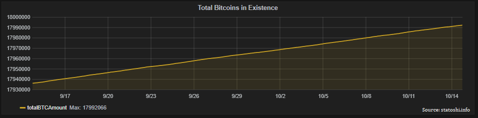

En lugar de permitir que Bitcoin se emita rápidamente o a un ritmo impredecible, la red garantiza que Bitcoin se emitirá de manera constante a lo largo del tiempo y, como consecuencia, de forma más distribuida. Más importante aún, refuerza constantemente la credibilidad de la estructura general de emisión. Cada diez minutos (en promedio), se emite una cierta cantidad de bitcoins. Aproximadamente cada cuatro años, ese número se reduce a la mitad hasta que finalmente no se emitirán bitcoins incrementales. En el camino hacia los 21 millones, la aplicación del suministro fijo cada diez minutos genera credibilidad en el suministro estatal futuro a lo largo del tiempo. Todos los participantes del mercado llegan a comprender que la oferta fija se aplicará no por un momento mágico en el tiempo en el que se alcanza realmente el máximo, sino porque la red aplica su política monetaria cada 10 minutos. Al crear un programa de suministro predecible, la tasa de cambio disminuye de manera predecible y todos los participantes del mercado pueden observar por sí mismos que el sistema está funcionando según lo previsto.

### Política monetaria por consenso vs.Banco central

Este proceso, que refuerza constantemente la credibilidad del sistema monetario de bitcoin, se produce en paralelo a la disfunción de los sistemas monetarios heredados. Los bancos centrales de todo el mundo están aumentando la oferta monetaria de sus respectivas economías a tasas impredecibles. Como se discutió anteriormente, la Fed aumentó la oferta monetaria en los EE. UU. En $ 3.6 billones luego de la crisis financiera, de 2008 a 2014. A pesar de que la Fed pronosticaba sus planes, nadie sabía cuál sería el total en última instancia. Todo el mundo estaba adivinando. La Fed ni siquiera lo sabía.

Y, después de aumentar la oferta monetaria en varios múltiplos, la Fed comenzó a retirar $ 50 mil millones de dólares de la economía cada mes, un proceso que comenzó en octubre de 2017. Nuevamente, nadie sabía exactamente cuánto dinero se eliminaría realmente del sistema, en total o por cuánto tiempo. En total, se eliminaron aproximadamente $ 700 mil millones en dinero base en el transcurso de aproximadamente dos años. Y ahora, a partir de octubre de 2019, la Fed ha vuelto a cambiar de rumbo y ha comenzado a agregar más dinero al sistema. Recientemente, la Fed señaló planes para agregar $ 60 mil millones de dólares al sistema financiero cada mes (planeado para los próximos seis meses). Pero una vez más, nadie sabe realmente por cuánto tiempo durará esto o si las cantidades cambiarán. Siendo realistas, la Fed no sabe porque es imposible saberlo.

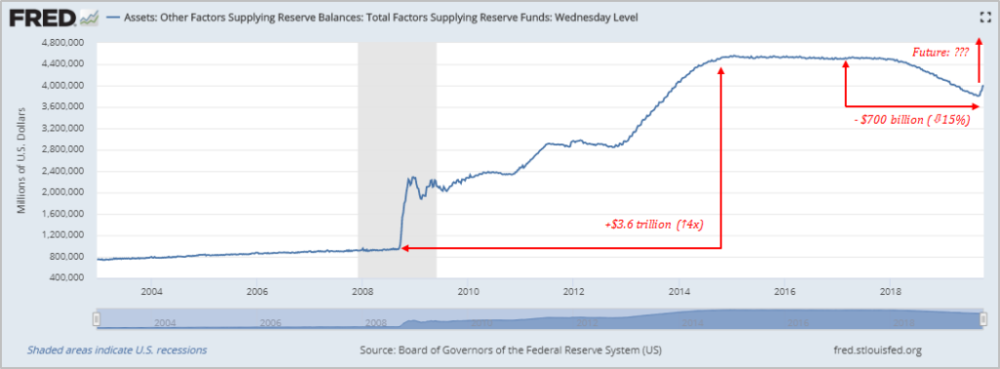

Todo lo que prácticamente sabemos es que a partir de este momento la oferta monetaria aumentará (y mucho). Pero reconozca que la mayoría de los participantes del mercado no tienen idea de que esto ha ocurrido o está ocurriendo. Todos los participantes del mercado realmente saben lo que se les comunica a través de los precios y las oportunidades de empleo. Aquellos que comprenden las acciones de la Fed pueden estar en una mejor posición para pronosticar o predecir las consecuencias direccionales, pero los sistemas económicos son complejos. Todos reaccionamos a los mecanismos de fijación de precios que nos rodean y nadie tiene un conocimiento perfecto; esta es la pretensión del conocimiento. El conocimiento agregado de millones de personas se comunica a través del precio, que en última instancia es una función de las preferencias siempre cambiantes de los individuos que componen una economía.

Los individuos están inherentemente limitados en el conocimiento que poseen. Y esto es ciertamente cierto en el caso de los bancos centrales. En el modelo monetario de la banca central, doce personas (o alrededor) determinan cómo y cuándo crear miles de millones, si no billones, de dólares a pesar de poseer un conocimiento intrínsecamente limitado. No importa qué tan bien intencionado o cuánto conocimiento posea, la consecuencia neta es la distorsión del mecanismo fundamental (es decir, el mecanismo de fijación de precios) que agrega el conocimiento que posee el mercado en su conjunto. Para todos los que confían en el dólar como unidad de cuenta y como mecanismo para comunicar las compensaciones económicas, la base misma cambia de manera impredecible, sin que la mayoría de sus participantes lo sepan. Las señales de precios distorsionadas se comunican gradualmente a través de millones de mercados que impactan las decisiones tomadas por cientos de millones y el mecanismo centralizado que dicta la política monetaria es una causa fundamental de la distorsión.

E incluso si una persona razonable creyera que la gestión activa de la oferta monetaria es un beneficio neto, bitcoin ahora está operando junto con el sistema económico heredado: un sistema descentralizado frente a un sistema centralizado. Política monetaria por consenso vs. política monetaria por banco central. Si bien la oferta monetaria del sistema heredado cambia de manera impredecible, la red bitcoin funciona sin problemas con una oferta conocida y con una tasa de cambio predecible. En lugar de ser un debate filosófico o económico, ahora hay dos sistemas en competencia y el mercado tendrá la última palabra. Si bien bitcoin puede ser complicado y el tema del dinero puede no entenderse bien, las fallas del sistema existente son independientes de bitcoin. Los [$ 17 billones de deuda con rendimiento negativo](https://translate.google.com/translate?hl=es&prev=_t&sl=auto&tl=es&u=https://www.bloomberg.com/graphics/negative-yield-bonds/) deberían ser evidencia suficiente y solo existe como una consecuencia directa de la política monetaria del banco central. En última instancia, las monedas que respaldan el sistema heredado serán la válvula de escape porque los bancos centrales se verán obligados a aumentar la oferta monetaria para sostener lo que de otro modo sería un sistema crediticio insostenible.

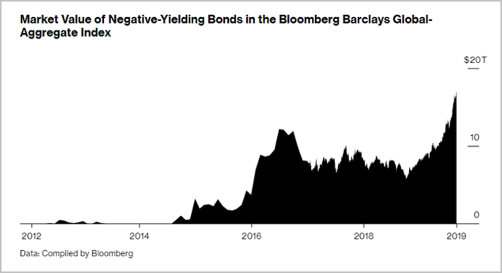

Con el sistema heredado coordinado por los bancos centrales, todo lo que se puede confiar es que la oferta monetaria cambiará y a tasas impredecibles. Con bitcoin, todos pueden verificar el suministro y la tasa de cambio predecible. Al ejecutar un nodo completo de bitcoin, cualquiera puede verificar la cantidad de bitcoins válidos que existen en circulación y la cantidad de bitcoins nuevos emitidos en cada bloque. Cualquiera y todos pueden verificar esta información sin confiar en nadie más. Así es como funciona bitcoin. Cada nodo no solo verifica la información; también valida la información de forma independiente. La política monetaria de Bitcoin se aplica de forma descentralizada por todos los nodos dentro de la red.

Con precisión, todos pueden calcular cuándo se resolverán los bloques futuros y cuándo cambiará la tasa de emisión. El hecho de que todos puedan verificar y validar la oferta monetaria, independientemente del monto nominal, refuerza la credibilidad del sistema monetario. Este refuerzo ocurre cada 10 minutos, 6 veces por hora, 144 veces al día, 4,320 veces al mes, 52,560 veces al año, con cada bloque de bitcoin que pasa. El sistema monetario se endurece a medida que los participantes del mercado validan que la política monetaria se aplica, una y otra vez, cada diez minutos.

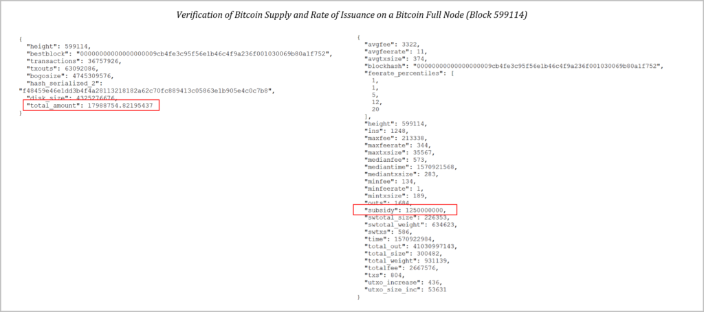

Suministro y tasa de emisión verificados en una computadora portátil Apple de cuatro años (suministro: 17,988,755; subsidio en bloque = 12.5 bitcoin o 1,250,000,000 satoshis)

Una oferta fija tiene poco significado sin la credibilidad de su aplicación. Cualquiera puede copiar la arquitectura y la base del código de bitcoin. Pero lo que no se puede replicar es la credibilidad de sus propiedades monetarias. El mecanismo de consenso que rige a Bitcoin es la base de su credibilidad y lo que, en última instancia, distingue a Bitcoin de su competencia. Incluso si un individuo no estuviera convencido de que una moneda con un suministro fijo comunicaría mejor información a través de su mecanismo de fijación de precios, no importa lo que crea el individuo. Bitcoin confía su política monetaria a un mecanismo de consenso. Si bien el suministro máximo de bitcoin está prácticamente limitado a 21 millones, el suministro se rige en última instancia por un consenso de aquellos que tienen bitcoin como moneda.

Si el mercado, que indudablemente posee más información que cualquier individuo, determina colectivamente que sería mejor cambiar el programa de oferta en lugar de implementar un límite fijo, teóricamente es posible. Sin embargo, el mercado tendría que llegar a un consenso abrumador para efectuar ese cambio y, en la práctica, una red descentralizada de actores económicos racionales no formaría un consenso abrumador para degradar su propia moneda. La política monetaria de Bitcoin es lo suficientemente flexible como para cambiar, pero es imposible hacerlo sin un consenso abrumador. Bitcoin, en última instancia, representa el contraste entre la política monetaria por consenso y la política monetaria del banco central. La información que posee un mecanismo de consenso del mercado siempre superará la de un pequeño número de personas, por lo que bitcoin supera al sistema heredado en cada paso.

### Bitcoin no es un esquema piramidal

Entonces no, bitcoin no es un esquema piramidal. No está organizado por una empresa incompleta, que impulsa tácticas de venta de alta presión. No se trata de vender un bien de consumo inferior, con abundante oferta, donde la compensación está directamente ligada a la contratación de nuevos miembros para el esquema. Bitcoin es dinero y su oferta es finamente escasa. No importa cuántas personas adopten bitcoin; a medida que aumenta la adopción, el mismo pastel se distribuye entre más y más personas y, en promedio, más personas controlan una parte cada vez más pequeña de la red. Su valor aumenta como una función de adopción, y la adopción está aumentando porque sus propiedades monetarias son superiores a la competencia. Bitcoin tiene un suministro fijo, su programa de suministro es predecible y su política monetaria se rige y aplica por consenso. El mecanismo de precios de Bitcoin no es manipulable y no se puede distorsionar debido a su suministro fijo. Todo cambia alrededor de bitcoin, pero el suministro fijo de bitcoin es constante. Debido a que el suministro de bitcoin es fijo y no se puede manipular, eventualmente se convertirá en el mecanismo de precios más confiable del mundo y, en consecuencia, en el mayor sistema de distribución de conocimiento.

Esa es la promesa que ofrece bitcoin, y solo proliferará si crea utilidad para quienes la adoptan. Hoy y en el futuro, esa utilidad seguirá siendo la capacidad de almacenar de manera confiable la riqueza en un medio monetario que no se puede degradar. Cuando las personas afirman que Bitcoin podría ser “más grande que Internet”, generalmente no es una aplicación lineal, sino que se basa en la idea de que una forma de dinero soberana e inmanipulable tiene el potencial de ser una de las más grandes. instrumentos de libertad jamás inventados. El éxito de bitcoin no es un hecho, pero si tiene éxito en el cumplimiento de su promesa, facilitará una coordinación más eficaz y pacífica entre personas de todo el mundo. Al final del día, bitcoin es una herramienta de comunicación. Esa es la función del dinero. Bitcoin simplemente proporciona un sistema alternativo, que funciona de forma descentralizada y que nadie controla. Es la falta de control y la falta de dirección consciente lo que permitirá que bitcoin acumule y comunique conocimientos de manera más efectiva que cualquier medio monetario preexistente. La volatilidad actual no es más que el camino lógico del descubrimiento de precios, ya que la adopción aumenta exponencialmente con el tiempo y avanzamos hacia ese estado futuro de adopción total.

> *“Muchas de las cosas más grandes que ha logrado el hombre no son el resultado de un pensamiento dirigido conscientemente, y mucho menos el producto de un esfuerzo deliberadamente coordinado de muchos individuos, sino de un proceso en el que el individuo desempeña un papel que nunca podrá comprender por completo. Son más grandes que cualquier individuo porque son el resultado de la combinación de conocimientos más extensos que los que una sola mente puede dominar “.*
> 
> *– Hayek, [La contrarrevolución de la ciencia](https://translate.google.com/translate?hl=es&prev=_t&sl=auto&tl=es&u=https://www.amazon.com/COUNTER-REVOLUTION-SCIENCE-F-HAYEK/dp/0913966673)*
