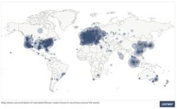

La idea de que de alguna manera los gobiernos pueden prohibir bitcoin es la etapa final del duelo, justo antes de la aceptación. La consecuencia de la declaración es la admisión de que bitcoin “funciona”. De hecho, postula que bitcoin funciona tan bien que amenazará a los monopolios del dinero administrados por el gobierno, en cuyo caso los gobiernos lo regularán para eliminar la amenaza. Piense en la afirmación de que los gobiernos prohibirán bitcoin como lógica condicional. ¿Bitcoin es funcional como dinero? Si no, los gobiernos no tienen nada que prohibir. En caso afirmativo, los gobiernos intentarán prohibir bitcoin. Entonces, el punto de anclaje de esta línea de crítica asume que bitcoin es funcional como dinero. Y luego, la pregunta es si la intervención del gobierno podría causar, con éxito, la falla de bitcoin, que de otro modo funcionaría.

Como punto de partida, cualquiera que intente comprender cómo, por qué o si funciona bitcoin debe evaluar la pregunta de forma totalmente independiente de las implicaciones de la regulación o intervención del gobierno. Si bien es indudable que bitcoin tendrá que coexistir junto con varios regímenes regulatorios, imagina que los gobiernos no existieran. De forma independiente, ¿bitcoin funcionaría como dinero si se dejara en el libre mercado? Esto conducirá inevitablemente a una serie de preguntas que llevan a la madriguera del conejo. ¿Qué es el dinero? ¿Cuáles son las cualidades que hacen que un medio en particular sea una mejor o peor forma de dinero? ¿Bitcoin cuenta con esas cualidades? ¿Bitcoin es una mejor forma de dinero basado en sus cualidades? Si la conclusión final es que bitcoin no funciona como dinero, las implicaciones de la intervención del gobierno son irrelevantes. Sin embargo, si bitcoin funciona como dinero, la pregunta entonces se vuelve relevante para el debate, y cualquiera que considere dicha pregunta necesitaría ese contexto previo como línea de base para evaluar si sería posible o no.

Por diseño, bitcoin existe más allá de los gobiernos. Pero bitcoin no solo está más allá del control de los gobiernos, funciona sin la coordinación de ningún tercero central. Es global y descentralizado. Cualquiera puede acceder a bitcoin sin permiso y cuanto más se extiende, más difícil se vuelve censurar la red. La arquitectura de bitcoin está prácticamente diseñada para resistir e inmunizar cualquier intento de los gobiernos de prohibirlo. Esto no quiere decir que los gobiernos de todo el mundo no intentarán regular, gravar o incluso prohibir su uso. Ciertamente habrá una lucha para resistir la adopción de bitcoin. El Sistema de Reserva Federal y el Departamento del Tesoro de Estados Unidos (y sus contrapartes globales) no se van a rendir a medida que bitcoin amenaza cada vez más los monopolios del dinero del gobierno. Sin embargo, antes de desacreditar la idea de que los gobiernos podrían prohibir completamente el bitcoin, primero comprenda la consecuencia misma de la declaración y el mensajero.

### La progresión de la negación y las etapas del duelo

La narrativa del escéptico cambia constantemente con el tiempo. Etapa uno del duelo: bitcoin nunca podría funcionar, [no está respaldado por nada](https://translate.google.com/website?sl=auto&tl=es&ajax=1&se=1&u=https://www.unchained-capital.com/blog/bitcoin-is-not-backed-by-nothing/). No es más que una tulipomanía actual. Con cada ciclo de publicidad, el valor de bitcoin aumenta drásticamente y luego es seguido por una corrección. A pesar de ser a menudo engrandecido por los escépticos como un colapso, bitcoin no muere y, en cada caso, encuentra apoyo en niveles más altos que en las oleadas de adopción anteriores. La narrativa del tulipán se cansa y los escépticos pasan a temas más matizados, volviendo a anclar el debate. La etapa dos del duelo sigue: bitcoin tiene fallas como moneda. Es [demasiado volátil](https://translate.google.com/website?sl=auto&tl=es&ajax=1&se=1&u=https://www.unchained-capital.com/blog/bitcoin-is-not-too-volatile/) para ser dinero, o es [demasiado lento](https://translate.google.com/website?sl=auto&tl=es&ajax=1&se=1&u=https://www.unchained-capital.com/blog/bitcoin-is-not-too-slow/) para ser un sistema de pagos, o no [puede escalar](https://translate.google.com/website?sl=auto&tl=es&ajax=1&se=1&u=https://www.unchained-capital.com/blog/bitcoin-is-not-too-slow/) para satisfacer todos los pagos del mundo, o [desperdicia energía](https://translate.google.com/website?sl=auto&tl=es&ajax=1&se=1&u=https://www.unchained-capital.com/blog/bitcoin-does-not-waste-energy/). La lista continúa. Este segundo paso es una progresión de negación y es una desviación significativa de la idea de que bitcoin no es más que nada.

A pesar de las supuestas fallas, el valor de la red de Bitcoin continúa aumentando con el tiempo. Cada vez que no muere, gana fuerza. Mientras que los escépticos están ocupados señalando fallas, bitcoin nunca duerme. Un aumento de valor está impulsado por una dinámica de mercado muy simple: más compradores que vendedores. Eso es todo y es una función de la adopción creciente. Cada vez más personas descubren por qué existe una demanda fundamental de bitcoin y cómo funciona. Esto es lo que crea una demanda a largo plazo de bitcoin. A medida que más personas lo demandan cada vez más como reserva de riqueza, no hay respuesta de la oferta. Solo habrá 21 millones de bitcoin. No importa cuántas personas demanden bitcoin, el lado de la oferta es completamente fijo e inelástico. Mientras los escépticos continúan gritando las mismas líneas cansadas, la multitud continúa analizando el ruido y demandando bitcoin debido a las fortalezas de sus propiedades monetarias. Y ningún electorado está más versado en los argumentos en contra de bitcoin que los propios usuarios pioneros de bitcoin.

La desesperación comienza a surtir efecto y el debate se vuelve a anclar una vez más. Como era de esperar, la narrativa cambia. Ya no es que bitcoin no esté respaldado por nada, ni que tenga fallas como moneda; en cambio, el debate se centra en la regulación y las autoridades gubernamentales. En la etapa final del duelo, en realidad bitcoin funciona demasiado bien y, como consecuencia, el gobierno nunca permitirá que suceda y lo prohibirá. ¿En serio? Entonces, el ingenio humano de alguna manera reinventa el dinero en un medio tecnológicamente superior, cuyas consecuencias son alucinantes, ¿y el gobierno de alguna manera va a prohibir eso? Reconozca que al reclamar tanto, los escépticos están admitiendo la derrota. Es el gemido agonizante de una serie de argumentos fallidos. Los escépticos aceptan simultáneamente que existe una demanda fundamental de bitcoin y luego giran hacia la creencia infundada de que los gobiernos pueden prohibirlo.

Planteé esto. ¿Cuándo exactamente intervendrían los gobiernos del mundo desarrollado e intentarían prohibir Bitcoin? Hoy, el Sistema de Reserva Federal (FED) y el Departamento del Tesoro no ven a Bitcoin como una seria amenaza para la supremacía del dólar. En su mente colectiva, bitcoin es un lindo juguete y no es funcional como moneda. Actualmente, la red de Bitcoin representa un poder adquisitivo total de menos de $200 mil millones. El oro, por otro lado, tiene un poder adquisitivo de aproximadamente $8 billones (40 veces el tamaño de bitcoin) y la oferta monetaria amplia de dólares (M2) es de aproximadamente $15 billones (75 veces el tamaño de bitcoin). ¿Cuándo la FED o el Tesoro comienzan a considerar seriamente a Bitcoin como una amenaza creíble? ¿Será cuando bitcoin represente colectivamente $1 billón de poder adquisitivo? ¿$2 billones o $3? Elija su nivel, pero la implicación es que bitcoin será mucho más valioso y estará en manos de muchas más personas a nivel mundial, antes de que los poderes gubernamentales lo vean como un competidor o una amenaza creíble.

**El presidente** **Trump** **y el secretario del Tesoro** [**M**](https://translate.google.com/website?sl=auto&tl=es&ajax=1&se=1&u=https://twitter.com/SquawkCNBC/status/1154004308947591168?s%3D20)**n**[**uchin**](https://translate.google.com/website?sl=auto&tl=es&ajax=1&se=1&u=https://twitter.com/SquawkCNBC/status/1154004308947591168?s%3D20) **sobre Bitcoin (2019)**

> **“No estaré hablando sobre Bitcoin en 10 años, puedo asegurarlo (…) Podría apostar que incluso en 5 o 6 años ya no estaré hablando sobre Bitcoin como Secretario del Tesoro. Tendré otras prioridades (…) Puedo asegurarles que yo personalmente no estaré cargado de bitcoin”** – Secretario del Tesoro Steve Mnuchin

> **“No soy fan de Bitcoin (…), el cual no es dinero, y  cuyo valor es altamente volátil y basado solo en aire”.** – Presidente Donald J. Trump

Entonces, la lógica escéptica sigue: bitcoin no funciona, pero si funciona, el gobierno lo prohibirá. Pero, los gobiernos en el mundo *libre* no intentarán prohibir bitcoin hasta que sea más evidente que es una amenaza. En ese momento, bitcoin será más valioso y, sin duda, más difícil de prohibir, ya que estará en posesión de mucha más gente en muchos más lugares. Por lo tanto, ignore los fundamentos y la asimetría inherente a un evento de monetización global porque, en caso de que tenga razón, el gobierno intervendrá para regular el bitcoin para que no exista. ¿De qué lado de la valla preferiría estar un actor económico racional? Poseer un activo monetario cuyo valor ha aumentado de manera tan dramática que amenaza la moneda de reserva global, o de lo contrario, ¿no poseer ese activo? Suponiendo que un individuo posee el conocimiento para comprender por qué es una posibilidad fundamental (y cada vez más una probabilidad), ¿cuál es la posición más defendible y lógica? La asimetría por sí sola dicta lo primero y cualquier comprensión fundamental de la demanda de bitcoin solo refuerza la misma posición.


### Pero Bitcoin no puede prohibirse

Piense en lo que realmente representa bitcoin y luego en lo que representaría una prohibición de bitcoin. Bitcoin representa la conversión de valor subjetivo, creado e intercambiado en el mundo real, por llaves digitales. Dicho más claramente, es la conversión del tiempo de un individuo en dinero. Cuando alguien demanda bitcoin, al mismo tiempo renuncia a la demanda de algún otro bien, ya sea un dólar, una casa, un automóvil o comida, etc. Bitcoin representa ahorros monetarios que vienen con el costo de oportunidad de otros bienes y servicios. Prohibir bitcoin sería una afrenta a las libertades más básicas para las que está diseñado tanto para proveer como para preservar. Imagínese la respuesta de todos aquellos que han adoptado bitcoin: “Bueno, eso fue divertido, la herramienta que los expertos dijeron que nunca funcionaría, ahora funciona demasiado bien, y los mismos expertos y autoridades dicen que no podemos usarla.Todos vayan a casa. Se acabó el espectáculo, amigos “. Creer que todas las personas en el mundo que han adoptado bitcoin por la libertad financiera y la soberanía que proporciona, de repente se rendirán y aceptarán la última infracción de esa libertad no es racional.

> ***“El dinero es uno de los mayores instrumentos de libertad jamás inventados por el hombre. El dinero es lo que en la sociedad actual abre una asombrosa gama de opciones para los pobres, una gama mayor que la que hace no muchas generaciones estaba abierta a los ricos … ”**–* *FA Hay**ek*

Los gobiernos no pudieron prohibir con éxito el consumo de alcohol, el uso de drogas, la compra de armas de fuego o la posesión de oro. Un gobierno puede restringir marginalmente el acceso, o incluso ilegalizar la posesión, pero no puede hacer desaparecer mágicamente algo de valor exigido por un grupo amplio y dispar de personas. Cuando Estados Unidos ilegalizó la propiedad privada del oro en 1933, el oro no perdió su valor ni desapareció como medio monetario. De hecho, aumentó su valor en relación con el dólar, y solo treinta años después, se levantó la prohibición. Bitcoin no solo proporciona una propuesta de mayor valor en relación con cualquier otro bien que cualquier gobierno haya intentado prohibir (incluyendo el oro); pero por su naturaleza, también es mucho más difícil de prohibir. Bitcoin es global y descentralizado. No tiene fronteras y está protegido por nodos y claves criptográficas. El acto de prohibir Bitcoin requeriría evitar que se ejecute el código de software de fuente abierta y evitar que las firmas digitales (creadas por llaves criptográficas) se difundan en Internet. Y tendría que coordinarse en numerosas jurisdicciones, excepto que no hay forma de saber dónde residen realmente las llaves o de evitar que aparezcan más nodos en diferentes jurisdicciones. Dejando de lado las cuestiones constitucionales, sería técnicamente inviable hacer cumplir una prohibición de bitcoin de manera significativa. 

Concentración de nodos de Bitcoin por país (earn.com)

Incluso si todos los países del G-20 se coordinarán para prohibir Bitcoin al unísono, no mataría a Bitcoin. En cambio, sería un hecho consumado para el sistema fiduciario. Reforzaría a las masas que bitcoin es una moneda formidable, y desencadenaría un juego global y desesperado de [whack-a-mole](https://es.wikipedia.org/wiki/Whac-A-Mole). No hay un punto central de falla en bitcoin; los mineros, nodos y llaves de bitcoin se distribuyen por todo el mundo. Todos los aspectos de bitcoin están descentralizados, por lo que ejecutar nodos y controlar llaves es fundamental para bitcoin. Cuantas más llaves y más nodos existan, más descentralizado se volverá el bitcoin y más inmunizado estará bitcoin a los ataques. En cuantas más jurisdicciones exista la minería, menos riesgo representa una jurisdicción individual para la función de seguridad de bitcoin. Un ataque coordinado a nivel estatal solo serviría para fortalecer el sistema inmunológico de bitcoin. En última instancia, aceleraría el alejamiento del sistema financiero heredado (y las monedas heredadas) y aceleraría la innovación dentro del sistema económico de bitcoin. Con cada amenaza que pasa, bitcoin innova para inmunizar la amenaza. Un ataque coordinado a nivel estatal no sería diferente.

La innovación sin permisos sobre una base globalmente descentralizada es la razón por la que Bitcoin gana fuerza con cada ataque. Es el vector de ataque en sí mismo el que hace que bitcoin innove. Es la mano invisible de Adam Smith en esteroides. Los actores individuales pueden creer que están motivados por una causa mayor, pero en realidad, la utilidad incorporada en bitcoin crea una estructura de incentivos suficientemente poderosa para asegurar su supervivencia. Los intereses propios de millones, sino de miles de millones, de individuos descoordinados alineados por su necesidad individual y colectiva de dinero incentivan la innovación sin permiso sobre bitcoin. Hoy en día, puede parecer una nueva tecnología genial o una inversión de cartera agradable, pero incluso si la mayoría de las personas aún no lo reconocen, bitcoin es una necesidad. Es una necesidad porque el dinero es una necesidad, y las monedas heredadas están fundamentalmente rotas. Hace dos meses, l[os mercados de recompra (Repo Markets) en los Estados Unidos quebraron](https://translate.google.com/website?sl=auto&tl=es&ajax=1&se=1&u=https://www.bloomberg.com/opinion/articles/2019-10-11/fed-brings-a-bazooka-to-its-fight-with-the-repo-market), y la FED respondió rápidamente aumentando la oferta de dólares en $250 mil millones, y más por venir. Es precisamente por eso que Bitcoin es una necesidad, no un lujo. Cuando una innovación resulta ser una necesidad básica para el funcionamiento de una economía, no hay ninguna fuerza gubernamental que pueda esperar detener su proliferación. El dinero es una necesidad muy básica, y bitcoin representa una innovación de cambio de función escalonada en la competencia global por el dinero.

Y de manera más práctica, cualquier intento de prohibir bitcoin o regular en gran medida su uso por parte de cualquier jurisdicción beneficiaría directamente a la jurisdicción competidora. El incentivo para desertar de cualquier esfuerzo coordinado para prohibir bitcoin sería demasiado alto para mantener un acuerdo de este tipo en todas las jurisdicciones. Si Estados Unidos declarara ilegal la posesión de bitcoin mañana, ¿ralentizará la proliferación, el desarrollo y la adopción de bitcoin y provocaría que el valor de la red disminuya de forma intermitente? Probablemente. ¿Mataría a Bitcoin? No. Bitcoin representa la capital más móvil del mundo. Los países y jurisdicciones que crean certeza regulatoria y colocan la menor cantidad de restricciones sobre el uso de bitcoin se beneficiarán significativamente de las entradas de capital. 

En la práctica, el dilema del prisionero no es uno a uno. Es multidimensional, involucrando a numerosas jurisdicciones, todas con intereses en competencia, lo que hace que cualquier intento de prohibir bitcoin sea mucho más impracticable. El capital humano, el capital físico y el capital monetario fluirán hacia los países y jurisdicciones con las regulaciones menos restrictivas sobre bitcoin. Puede que no suceda de la noche a la mañana, pero intentar prohibir bitcoin es el equivalente a que un país se corte la nariz para fastidiarlo. No significa que los países no lo intentarán. India ya ha intentado prohibir Bitcoin. China ha intentado restringir fuertemente su uso. Otros seguirán. Pero cada vez que un país toma una acción para restringir el uso de bitcoin, en realidad tiene el efecto involuntario de promover la adopción de bitcoin. Los intentos de prohibir bitcoin son una herramienta de marketing extremadamente eficaz para bitcoin. Bitcoin existe como una forma de dinero no soberana y resistente a la censura. Está diseñado para existir más allá del estado. Los intentos de prohibir bitcoin simplemente sirven para reforzar la razón de ser de bitcoin y, en última instancia, su propuesta de valor. 

### El único movimiento ganador es jugar

Prohibir bitcoin es una tarea de tontos. Algunos lo intentarán; todo fallará. Y los mismos intentos de prohibir bitcoin acelerarán su adopción y proliferación. Será el viento de cien millas por hora el que avive el incendio forestal. También hará que Bitcoin sea más fuerte y confiable, lo inmunizara aún más contra los ataques y reforzará su naturaleza antifrágil. Y en cualquier caso, creer que los gobiernos prohibirán bitcoin, si se convierte en una amenaza creíble para las monedas de reserva global, es una razón irracional para descartarlo como una tecnología de ahorro. Ambos ceden la autoridad de que bitcoin es viable como dinero, mientras que al mismo tiempo ignora las principales razones del por qué: descentralización y resistencia a la censura. Imagínese comprender el mayor secreto presente del mundo y no capitalizar la asimetría y la utilidad que proporciona bitcoin por temor al gobierno. Es algo más como, o alguien entiende por qué funciona bitcoin y que no fallará a manos de un gobierno, o existe una brecha de conocimiento sobre cómo bitcoin puede funcionar en primer lugar. Comience por comprender los fundamentos y luego aplíquelo como base para evaluar cualquier riesgo potencial que plantee la futura intervención o regulación del gobierno. Y nunca descarte el valor de la asimetría; el único movimiento ganador es jugar.
