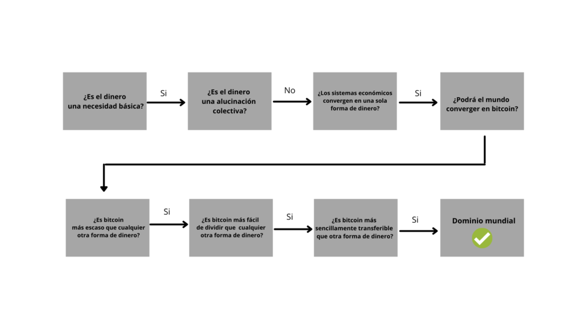

Cuando se trata de la adopción de Bitcoin, generalmente hay dos reglas que nunca parecen fallar. Todo el mundo siempre siente llegar tarde y todo el mundo siempre desea haber comprado más bitcoin. Hay excepciones para cada una de las reglas, pero Bitcoin tiene una extraña habilidad para arruinar la psique humana. Resulta que 21 millones es un número espantosamente pequeño, y en realidad se hace más pequeño a medida que más personas llegan a comprender que el suministro fijo de Bitcoin se aplica de manera creíble y que las redes monetarias convergen en un solo medio. La demanda de Bitcoin está impulsada por la credibilidad de sus propiedades monetarias y la naturaleza convergente del dinero, pero la creciente demanda de Bitcoin refuerza la escasez de oferta fija de Bitcoin. A medida que lo hace, Bitcoin se vuelve más valioso como medio monetario. Si bien esto se hace evidente cuanto más se avanza en la madriguera del conejo de Bitcoin, no es raro que las personas en la periferia se sientan abrumadas por la gran cantidad de criptomonedas. Seguro, Bitcoin está a la cabeza hoy, pero hay miles; ¿Cómo sabes que Bitcoin no es MySpace? ¿Cómo puede estar seguro de que algo nuevo no superará a Bitcoin?

Puede parecer una locura creer que bitcoin será la moneda global dominante, y probablemente lo sea si se evalúa la posibilidad desde una perspectiva de arriba hacia abajo y ponderada por la probabilidad. Actualmente, bitcoin es una de las más de mil monedas digitales que compiten y que se ven todas iguales en la superficie. Su poder adquisitivo de 150 mil millones de dólares es una gota en el cubo en comparación con el sistema financiero global que respalda 250 billones de dólares de deuda. El oro solo tiene un poder adquisitivo de 8 billones de dólares (50 veces el tamaño de Bitcoin). ¿Cuáles son las posibilidades de que una sensación de Internet de 11 años resurja de las cenizas de la crisis financiera de 2008 y pase de la nada a convertirse en la moneda mundial dominante? La idea suena ridícula, o al menos, parece ser una probabilidad demasiado baja para justificar su consideración. Sin embargo, cuando se parte de abajo hacia arriba y se desarrolla la convicción en torno a algunos principios fundamentales, el ruido de mil criptomonedas se desvanece a un segundo plano. Cuando se suman, solo unos pocos principios fundamentales crean simplicidad y claridad en torno a lo que alguna vez pudo haber parecido demasiado complejo para posiblemente discernir. Si alguien tuviera que evaluar mil posibilidades para llegar a la solución correcta, puede que no sea práctico o posible. Pero si pudiera eliminar 999 de esas posibilidades basándose en uno o en algunos primeros principios iniciales, entonces sería más práctico llegar a una respuesta coherente.

Este es el camino a seguir para eliminar el ruido y centrarse en lo que realmente importa. Las personas pueden llegar a diferentes conclusiones con respecto a cualquiera de estas preguntas, pero este es el camino a considerar cuando se intenta comprender por qué bitcoin supera constantemente a todas las demás monedas y si continuará haciéndolo. El dinero es una necesidad básica, pero no es una alucinación colectiva ni un sistema de creencias compartido. Las personas adoptan Bitcoin porque posee propiedades únicas que lo hacen superior como forma de dinero en relación con todas las demás monedas. Dado que el dinero es una solución a un problema intersubjetivo, los sistemas monetarios tienden a converger en un solo medio. O más bien, los sistemas económicos surgen naturalmente de un solo medio debido a la función del dinero. Las propiedades inherentes a Bitcoin están haciendo que el mercado converja en él como una herramienta para comunicar y medir el valor porque representa una mejora del cambio de función escalonada sobre cualquier otro medio monetario. Si alguien tiene la visión fundamental de que el dinero es una necesidad y que los sistemas monetarios convergen naturalmente, la pregunta se centra en si Bitcoin está optimizado para cumplir la función monetaria mejor que cualquiera de la competencia.

### El dinero es una necesidad

La civilización tal como la conocemos no existiría sin dinero. Sin dinero, no habría aviones, ni automóviles, ni iPhones, y la capacidad de satisfacer necesidades muy básicas se vería afectada materialmente. Millones de personas no podrían habitar pacíficamente una sola ciudad, estado o país sin la función del dinero. El dinero es el bien económico que permite que los alimentos aparezcan de manera confiable en los estantes de los supermercados, que el gas esté en la estación de servicio, que haya electricidad en las casas, que el agua potable sea abundante, etc. Es el dinero lo que hace que el mundo gire y no cambie de la forma que la mayoría ha dado por sentado si no fuera por la función del dinero. Es una función enormemente subestimada; uno que se entiende mal porque generalmente no se considera conscientemente. En el mundo desarrollado, el dinero confiable se da por sentado. También se satisfacen las necesidades básicas a través de la función de coordinación del dinero.

Considere, por ejemplo, una tienda de comestibles local y la variedad de opciones que convergen en una sola tienda. La cantidad de contribuciones y habilidades individuales que se requieren para que eso suceda es alucinante. Desde la coordinación de la propia tienda, pasando por el embalaje individual, por los proveedores de tecnología, pasando por las redes logísticas, las redes de transporte, los sistemas de pago y hasta cada alimento individual. Luego, como un derivado, considere todas las entradas únicas que se incluyen en cada artículo del estante. La tienda de comestibles es solo el lado de la satisfacción; la producción de cada insumo tiene su propia cadena de suministro diversa. Y es solo una maravilla moderna. Desmontar las entradas de una red de telecomunicaciones moderna, una red de energía o un sistema de gestión de agua y desechos es igualmente complejo. Cada red y sus participantes dependen de los demás. Los productores de alimentos cuentan con personas que ayudan a satisfacer la demanda de energía, servicios de telecomunicaciones, logística, agua potable, etc. entre otros y viceversa. Prácticamente todas las redes están conectadas y todo es posible gracias a la función de coordinación del dinero. Todos pueden contribuir con sus propias habilidades en función de sus propios intereses y preferencias personales: recibir dinero a cambio del valor entregado hoy y luego usar ese mismo dinero para adquirir el valor especializado creado por otros en el futuro.

Y tampoco todo sucede por casualidad. Algunos pensadores no tan rigurosos sugieren que el dinero es una alucinación colectiva o que obtiene valor del gobierno. En realidad, el dinero es una herramienta que fue inventada por el hombre para satisfacer una necesidad de mercado muy específica para facilitar el comercio. El dinero ayuda a facilitar esta actividad actuando como intermediario entre una serie de intercambios presentes y futuros. Sin ningún control o dirección consciente, los participantes del mercado evalúan varios bienes diferentes y convergen en la herramienta con las propiedades más adecuadas para facilitar el propósito expreso de convertir el valor presente en valor futuro. Mientras que las preferencias de consumo individuales varían de persona a persona y cambian constantemente, la necesidad de intercambio es prácticamente universal y la función es claramente uniforme. Para cada individuo, el dinero permite que el valor producido en el presente se convierta en consumo en el futuro. El valor que se le da a una casa, un automóvil, la comida, el ocio, etc., cambia naturalmente con el tiempo y, lógicamente, varía de persona a persona. Pero la necesidad de consumir y la necesidad de comunicar preferencias no cambia y se aplica a todos los individuos de forma intersubjetiva.

El dinero existe para comunicar estas preferencias y, en última instancia, el valor. Pero reconociendo que todo valor es subjetivo (y no intrínseco), el dinero forma la línea base para establecer una expresión de valor y, lo que es más importante, valor relativo. El dinero representa el reconocimiento colectivo de que todos se benefician de la existencia de un idioma común para comunicar las preferencias individuales. Agrega y mide las preferencias de todos los individuos dentro de una economía, en cualquier momento, y no sería posible, o al menos extremadamente ineficiente, comunicar valor si no fuera por una constante común en la que todos pudieran estar de acuerdo. Piense en el dinero como la constante con la que medir todos los demás bienes. Si no existiera, todo el mundo estaría prácticamente paralizado, sin poder ponerse de acuerdo sobre el valor de nada. Al comparar con una única constante, resulta más práctico discernir el valor relativo de otros dos bienes. Hay miles de millones de bienes y servicios producidos por miles de millones de personas, todas con preferencias únicas. A través de la convergencia en una sola forma de dinero para agregar y comunicar todas las preferencias, finalmente surge un sistema de precios. Al medir y expresar el valor de todos los bienes en un intermediario común (dinero), es posible comprender cuánto se valora un bien (o recurso) en relación con cualquier otro.

Sin el uso de una moneda común, no existiría el concepto de precio. Y sin el concepto de precio, no sería posible hacer ningún rango de cálculo económico. La capacidad de realizar cálculos económicos permite a las personas tomar acciones independientes, basándose en la información comunicada a través de un sistema de precios, para satisfacer mejor sus propias necesidades al comprender las necesidades de los demás. De hecho, es un sistema de precios que permite la formación de estructuras de oferta y demanda, y en última instancia es una necesidad porque permite la comunicación de información, sin la cual no sería posible la satisfacción de las necesidades básicas. Imagínese si nada de lo que consumiera tuviera un precio perceptible. ¿Cómo sabría lo que necesita producir para obtener los bienes que prefiere? Luego reconozca que su propia concepción del valor que produce y la existencia misma de bienes y servicios producidos por otros no estaría disponible si no fuera por alguna expresión de precio existente. Se vuelve circular, pero el dinero es el bien que permite que las estructuras subyacentes de una economía se formen a través del sistema de precios. Si bien a menudo se lo ensalza como la raíz de todos los males, el dinero puede ser el invento accidental más grande jamás creado por el hombre, y uno que no podría haber surgido mediante un control consciente.

### Los sistemas económicos convergen en un único medio monetario 

El pensamiento de Silicon Valley en la etapa tardía hace que muchas personas crean que pueden existir cientos, sino miles, de monedas en el futuro. ¡Las máquinas van a hacer todo el cálculo! La Inteligencia Artificial y la cuántica se encargarán de ello. Un punto de vista intelectualmente “seguro” es que el 95% de las criptomonedas probablemente fallarán, pero hay algunos proyectos “interesantes”. “Es intrínsecamente difícil saber cuál tendrá éxito”. “Al igual que la inversión de capital de riesgo, la mayoría fracasará, pero los que ganen ganarán en grande”. Al menos, esto es lo que la mayoría de Silicon Valley quiere hacerles creer porque es un paralelo defendible de las experiencias históricas de inversión en empresas. En realidad, es una cobertura general que carece de principios básicos. También está aplicando una fórmula familiar a una clase de problema completamente distinta.

Si bien puede parecer lógico formar un marco mental en torno a Bitcoin en relación con la historia de rimas de las nuevas empresas de tecnología, no puede haber comparación alguna. Bitcoin es dinero, no una empresa. Sería ilógico asumir que la competencia entre dos medios monetarios (o múltiples) sería de alguna manera paralela o seguiría un patrón similar al de dos empresas. Las empresas compiten en una carrera armamentista de formación de capital; para ello, necesitan dinero para coordinar la actividad económica. ¿Cómo obtienen dinero? Utilizando dinero para coordinar la producción de bienes y servicios y vendiendo la producción por más dinero (beneficio). En esencia, las empresas compiten por la misma cantidad de dinero para acumular capital. El dinero es la herramienta que hace girar la rueda. Simplemente, no sería posible coordinar todas las habilidades individuales necesarias para permitir el cumplimiento de los bienes y servicios derivados de la complejidad de la mayoría de las cadenas de suministro modernas sin dinero. Tampoco sería posible si no fuera por el hecho de que un gran grupo de personas aceptaba una forma común de dinero.

En la cadena de suministro de producción, el dinero cumple una función distinta de una clase diferente a la de cualquier bien o servicio individual. Es la distinción entre el cumplimiento de preferencias (producción de bienes y servicios) y la coordinación de preferencias (dinero). El cumplimiento de las preferencias depende de la coordinación de las preferencias, y la coordinación de las preferencias depende de un sistema de precios, que solo puede formarse como un derivado de la convergencia masiva en un único medio monetario. Sin un sistema de precios, no existiría la división del trabajo, al menos no en la medida necesaria para permitir el funcionamiento de cadenas de suministro complejas. Este es el principio del nivel de la raíz que la mayoría pierde al contemplar un mundo de muchas monedas. Cualquier sistema de precios se deriva de una moneda única. El concepto de precio no existiría si no fuera por una masa crítica de individuos que producen un conjunto diverso de bienes y servicios y comunican el valor de esos bienes y servicios a través de un medio común. Para obtener el beneficio del dinero y el precio, la convergencia es un precursor. Como resultado, puede ser más exacto decir que los sistemas económicos surgen de un único medio monetario en lugar de converger en uno. Los individuos convergen en un único medio monetario y el resultado es un sistema económico.

Mientras que el valor de todos los demás bienes y servicios es el consumo, el valor del dinero es el intercambio. El intercambio es el bien que cualquier individuo está comprando cuando elige convertir el valor (la producción subjetiva de tiempo, trabajo y capital físico) en un bien monetario. Las preferencias de consumo individual son únicas, pero el dinero cumple una función singular para todos los participantes del mercado: tender un puente entre el presente y el futuro (ya sea por un día, una semana, un año o más). En cualquier intercambio de valor presente, existe un continuo de tiempo hasta un intercambio futuro. En el momento del intercambio, cada individuo debe tomar una decisión sobre qué bien monetario cumplirá mejor la función de preservar el valor creado en el presente en el futuro. ¿A o B? Si bien una persona puede optar por tener una o varias monedas, uno va a realizar esa función de manera más eficaz. Uno preservará el poder adquisitivo futuro mejor que el otro. Todo el mundo entiende esto intuitivamente y toma una decisión basada en las propiedades inherentes de un medio en relación con otro. Al decidir qué bien monetario usar, la preferencia de un individuo se ve afectada por la preferencia de otros, pero cada individuo está haciendo una evaluación independiente para discernir las fortalezas relativas de múltiples bienes monetarios. No es casualidad que el mercado se convierta en un solo medio porque cada individuo está intentando resolver el mismo problema del intercambio futuro, que es interdependiente de la preferencia de los demás.

El objetivo final es llegar a un consenso de modo que cada individuo pueda comunicarse e intercambiar con el conjunto más amplio y relevante de socios comerciales. Colectivamente, es una evaluación objetiva de bienes tangibles basada en una necesidad intersubjetiva. El punto es encontrar el único bien en el que todos pueden estar de acuerdo en i) una constante relativa, ii) medibilidad y iii) funcionalidad en el intercambio. La existencia de una constante crea un orden donde antes no existía, pero esa constante también debe ser funcional como herramienta de medición y como medio de intercambio. Es la combinación de estas características, a menudo descritas como la suma de las propiedades de escasez, durabilidad, fungibilidad, divisibilidad y transferibilidad, que son exclusivas del dinero. Muy pocos bienes poseen todas estas propiedades, y cada bien es único, con propiedades inherentes que hacen que cada uno sea mejor o peor en el cumplimiento de ciertas funciones dentro de una economía. A es siempre diferente de B, y la combinación de propiedades que perfeccionan un bien monetario es tan rara que la distinción entre una y otra nunca es marginal.

De manera más práctica, todos están de acuerdo en un solo bien monetario a través del cual expresar valor porque es de sus intereses individuales y colectivos hacerlo. Es el problema en sí mismo: cómo comunicar valor a otros participantes del mercado. Sería contraproducente para todo el ejercicio si no se lograra un consenso. Pero son las propiedades de un bien monetario en sí las que permiten la convergencia y el consenso. El mundo imaginado de miles de monedas es ciego a estos principios fundamentales. Una masa crítica de individuos que convergen en un medio común es la entrada necesaria para determinar la información que realmente se desea. Y el valor de un medio común solo aumenta en valor a medida que más y más personas convergen en él como una herramienta para facilitar los intercambios. La razón fundamental es que con más individuos convergiendo en un solo medio, el medio en realidad acumula más información y presenta una mayor utilidad.

Piense en cada individuo como un socio comercial potencial. A medida que los individuos adoptan el medio común como estándar de valor, todos los participantes existentes en la red monetaria obtienen nuevos socios comerciales, al igual que los individuos que pasan a formar parte de la red. Existe un beneficio mutuo y, en última instancia, la gama de opciones se amplía. Pero lo que también ocurre a medida que se expande una red monetaria es que más bienes llegan a ser valorados en el medio común de intercambio. Existen más precios y, como resultado, también existen más precios relativos. Se agrega más información al medio común, en el que todos los individuos dentro de la red (y la red en su conjunto) pueden confiar en él para coordinar mejor los recursos y responder a las preferencias cambiantes. La constante se vuelve más valiosa e intrínsecamente más confiable a medida que comunica más información sobre más bienes producidos por más individuos. En realidad, la constante se vuelve más constante a medida que se comunica más información variable a través de ella.

A medida que la adopción de una red monetaria aumenta en un orden de magnitud (10x), las posibles conexiones de red aumentan en dos órdenes de magnitud (100x). Si bien esto ayuda a demostrar el beneficio mutuo de la adopción, también destaca la consecuencia de convertir el valor en una red monetaria más pequeña. Una red que tiene una décima parte del tamaño tiene el 1% del número de conexiones potenciales. No todas las distribuciones de red son iguales, pero una red monetaria más grande se traduce en una constante más confiable para comunicar información: mayor densidad, información más relevante y, en última instancia, una gama más amplia de opciones. El tamaño de una red monetaria y el crecimiento esperado de esa red se convierten en componentes críticos de la prueba intersubjetiva A/B, cuando cada individuo está determinando qué medio utilizar. Si bien el número de personas con las que cualquier individuo puede mantener relaciones sociales es inherentemente limitado, los mismos límites no se aplican a las redes monetarias. Es el dinero lo que permite a los humanos romper con las limitaciones del [número de Dunbar](https://en.wikipedia.org/wiki/Dunbar%27s_number). Una red monetaria permite que millones (si no cientos de millones) de personas desconocidas entre sí contribuyan con valor en los puntos finales de la red, con relativamente pocas conexiones directas necesarias.

En última instancia, las redes monetarias acumulan el valor de todas las demás redes porque todos los demás efectos de red no existirían sin una red monetaria. Las redes complejas no pueden formarse sin una moneda común para coordinar los insumos económicos necesarios para poner en marcha los ciclos de retroalimentación del precio que se refuerzan positivamente. Una moneda común es la base misma de cualquier red monetaria, lo que permite que se formen otras redes de valor. Proporciona el lenguaje común para comunicar valor, lo que en última instancia conduce al comercio y la especialización, y crea orgánicamente la capacidad de expandir el uso de recursos más allá del alcance del “control consciente” (para robarle la frase a Hayek). Al contemplar los efectos de red de una red social, una red logística, una red de telecomunicaciones, una red energética, etc., súmelos todos y ese es el valor de una red monetaria. Una red monetaria no solo proporciona la base para que se formen todas las demás redes de valor, sino que la moneda de esa red es lo que paga por el acceso a todas las redes de derivados dentro de la red monetaria. La existencia de la moneda común es el motor y el aceite.

Sí, el dólar, el euro, el yen, la libra, el franco, el yuan, el rublo, la lira, el peso, etc., coexisten hoy en día, pero esto no es una función natural de una economía global abierta. En cambio, cada moneda fiduciaria que existe hoy surgió como una representación fraccionada del oro, en el que el mundo había convergido previamente como un estándar monetario. Ninguna subsistiría sin las fuerzas de la intervención del gobierno; tampoco habría surgido ninguna moneda fiduciaria si no fuera por la existencia previa (y limitaciones) del oro como medio monetario. Los teóricos monetarios modernos y los fanáticos del oro nunca lo admitirán, pero la calamidad de todos los sistemas fiduciarios no es más que la manifestación del fracaso del oro como medio monetario. Es un hombre muerto caminando. El patrón oro fue abandonado formalmente en 1971, y la subsistencia de sistemas fiduciarios jurisdiccionales desde entonces simplemente representa una desviación transitoria de las fuerzas monetarias del libre mercado. Los sistemas fiduciarios modernos solo han logrado sobrevivir mientras lo hayan hecho porque aún no existía una solución al problema creado por el fiat. Bitcoin es esa solución, y desde su creación, las personas han estado convergiendo hacia ella como un nuevo estándar monetario; una tendencia que solo continuará a medida que el conocimiento se distribuya naturalmente.

## Todos los caminos convergen en Bitcoin

### La mayor constante: la escasez finita

El mercado converge en Bitcoin a lo largo del tiempo y su valor sigue aumentando porque proporciona una constante superior a cualquier otra forma de dinero. Bitcoin tiene una política monetaria óptima, y ​​esa política se aplica de manera creíble de forma descentralizada. Solo existirán 21 millones de bitcoin, y el elemento de confianza se elimina por completo de la ecuación. El suministro fijo de Bitcoin se aplica mediante un mecanismo de consenso de red de forma descentralizada. Nadie confía en nadie y todos hacen cumplir las reglas de forma independiente. Como un agregado de estas dos funciones, bitcoin se está convirtiendo en la forma de dinero más escasa que haya existido. La escasez finita es una propiedad que ninguna otra forma de dinero ha logrado ni logrará, y la demanda de Bitcoin está impulsada fundamentalmente por esa escasez. Sin embargo, la escasez es una ecuación de dos caras. Una oferta fija puede ser el principal atractivo, pero la demanda es un aspecto crítico y a menudo pasado por alto de la escasez. La demanda es lo que hace que la escasez sea una utilidad como una constante en el intercambio. Bitcoin se vuelve cada vez más escaso como una función bidireccional del aumento de la demanda y una oferta terminal completamente inelástica. La escasez de su oferta fija crea demanda, pero el aumento de la demanda crea una mayor escasez. Suena circular porque lo es. Si hubiera 21 millones de bitcoin y solo 1 persona lo valorara, no habría nada escaso o útil sobre Bitcoin. Pero si 100 millones de personas valoran Bitcoin, 21 millones comienzan a escasear. Y si la red creciera a mil millones de personas, 21 millones se volverían extremadamente escasos y Bitcoin representaría una mayor utilidad como constante.

Con un suministro fijo, el aumento de la demanda naturalmente hace que Bitcoin se distribuya más. Hay mucho para repartir, y el pastel termina dividiéndose en acciones cada vez más pequeñas que son propiedad de más y más personas. A medida que más personas valoran Bitcoin, la red no solo se convierte en una mayor utilidad; también se vuelve más segura. Se convierte en una mayor utilidad porque más personas se están comunicando en el mismo idioma de valor a través de una constante más confiable. Y a medida que más personas participan en el mecanismo de consenso de la red, todo el sistema se vuelve más resistente a la corrupción y, en última instancia, más seguro. Reconozca que no hay nada en una cadena de bloques que garantice un suministro fijo, y el programa de suministro de Bitcoin no es creíble porque el software lo dicta. En cambio, 21 millones solo son creíbles porque se gobierna de manera descentralizada y por un número cada vez mayor de participantes de la red. 21 millones se convierte en un número fijo más creíble a medida que más personas participan en el consenso y, en última instancia, se convierte en una constante más confiable ya que cada individuo controla una parte cada vez más pequeña de la red a lo largo del tiempo. A medida que aumenta la adopción, la seguridad y los servicios públicos funcionan al unísono. Considere la distribución y la densidad relativa de la adopción de Bitcoin en todo el mundo (mapa de calor a continuación de los nodos de la red). A medida que el alcance y la densidad dentro de cada mercado se extienden, la constante de bitcoin se vuelve cada vez más difícil.

A medida que las personas optan cada vez más por bitcoin, 21 millones se vuelven cada vez más creíbles, y en la mente de quienes lo adoptan, la escasez finita se convierte en lo que diferencia a bitcoin de todas las demás formas de dinero, tanto las monedas heredadas como las criptomonedas competidoras por igual. Todas las demás monedas se centralizan con el tiempo (por ejemplo, el dólar, el euro, el yen, el oro) o estaban demasiado centralizadas desde el principio (por ejemplo, todas las demás criptomonedas) para competir de manera creíble con un suministro fijo de 21 millones. La centralización crea inherentemente la necesidad de depender de la confianza, y la confianza, en última instancia, pone en riesgo la oferta de cualquier moneda, lo que a su vez perjudica la demanda y margina su utilidad en la función de intercambio. Mientras que todas las demás monedas dependen de la confianza, la constante que proporciona Bitcoin no tiene confianza. 21 millones solo es creíble porque Bitcoin está descentralizado y Bitcoin se vuelve cada vez más descentralizado con el tiempo. Lo mejor que podría hacer cualquier otra forma de dinero es igualar bitcoin, pero prácticamente, no es posible porque las personas convergen en un solo medio, y bitcoin vence a todas las demás monedas. Todas las demás monedas compiten en última instancia contra la constante ideal; uno que no cambie y que no dependa de la confianza.

Todas las formas de dinero compiten entre sí por cada intercambio. Si la utilidad principal (o única) de un activo es el intercambio por otros bienes y servicios, y si no tiene derecho sobre el flujo de ingresos de un activo productivo (como una acción o un bono), debe competir como forma de dinero. Como consecuencia, cualquier activo de este tipo compite directamente con bitcoin por el mismo caso de uso exacto, y ninguna otra moneda proporcionará una constante más confiable porque bitcoin ya existe y es finito. Debido a que los individuos convergen en un solo medio, la escasez de bitcoin se reforzará perpetuamente tanto en el lado de la oferta como en el de la demanda, mientras que la fuerza opuesta estará en vigor para todas las demás monedas debido a la naturaleza reflexiva de la competencia monetaria. La distinción entre dos bienes monetarios nunca es marginal y tampoco es la consecuencia de decisiones individuales de intercambiar en un medio en lugar de otro. El dinero es un problema intersubjetivo, y la elección de optar por un medio monetario es una exclusión explícita del otro, lo que a su vez hace que una red gane valor (y utilidad) a expensas directas de otra. A medida que bitcoin se vuelve más escaso y más confiable como constante, otras monedas se vuelven menos escasas y más variables. La competencia monetaria es de suma cero, y la escasez relativa, una función dinámica tanto de la oferta como de la demanda, crea la diferenciación fundamental entre dos medios monetarios que solo aumenta y se vuelve más evidente con el tiempo.

Pero recuerde que la escasez por el bien de la escasez no es el objetivo de ningún dinero. En cambio, el dinero que proporciona la mayor constante facilitará el intercambio de manera más eficaz. El bien monetario con la mayor escasez relativa conservará mejor el valor entre los intercambios presentes y futuros a lo largo del tiempo. El precio relativo y el valor relativo de todos los demás bienes es la información realmente deseada de la función de coordinación del dinero, y en cada intercambio, cada individuo está incentivado a maximizar el valor presente en el futuro. La escasez finita en bitcoin proporciona la mayor garantía de que el valor intercambiado en el presente se conservará en el futuro, y a medida que más y más personas identifiquen colectivamente que bitcoin es el bien monetario con la mayor escasez relativa, la estabilidad en su precio se convertirá en una propiedad emergente. ([Ver Bitcoin no es demasiado volátil](https://unchained.com/blog/bitcoin-is-not-too-volatile/)).

### La mejor herramienta de medición: divisibilidad

Si bien la escasez es la base fundamental, no todos los bienes escasos son funcionales como dinero. Para ser funcional como herramienta para comunicar valor, un bien monetario debe ser una constante relativa, fácil de medir y funcional en el intercambio. Una regla puede ser una herramienta de medición eficaz, pero las reglas no son escasas, ni es fácil dividir las piezas de una regla en unidades más grandes y más pequeñas para facilitar el intercambio. A cambio, un bien monetario escaso y medible permite la medición de todos los demás bienes; la capacidad de subdividir y transferir fácilmente una unidad monetaria proporciona una utilidad práctica a cambio. Bitcoin combina la escasez finita con la capacidad de subdividir cada unidad completa hasta 8 puntos decimales (0,00000001 o una 100.000.000 de un bitcoin) y transferir cualquier cantidad de valor, ya sea grande o pequeña. Así como la escasez por la escasez no es necesariamente valiosa en el contexto del dinero, tampoco lo es la propiedad de la divisibilidad. Es la combinación la que se vuelve valiosa en el contexto del dinero, particularmente cuando cada unidad subdividida es fungible, cuando cada unidad individual es esencialmente intercambiable y cada una de sus partes es indistinguible de otra parte. Son estas propiedades juntas las que permiten que bitcoin no solo sea una constante perfecta, sino también una medida de valor efectiva para facilitar el intercambio.

En el código, un bitcoin se representa en realidad como 100.000.000 de subunidades, y la unidad más pequeña se denomina satoshi (o sat para abreviar). Técnicamente, un bitcoin es 100.000.000 sat. Mientras que un bitcoin equivale a aproximadamente 9.000 dólares en la actualidad, un satoshi equivale a una vigésima parte de un centavo. En esencia, cualquiera puede intercambiar cualquier cantidad de valor por bitcoin. Bitcoin, como cualquier dinero, es funcional para un propósito, almacenar valor entre una serie de intercambios. Reciba bitcoin por el valor producido hoy, ahorre, gaste bitcoin en el futuro a cambio del valor producido por otros. Realizará la misma función independientemente de la cantidad. La consecuencia práctica de la divisibilidad es que bitcoin es capaz de medir todos y cada uno de los valores, lo que le permite respaldar todas y cada una de las adopciones. Las personas producen una amplia gama de valor, y la divisibilidad permite que todas las personas utilicen bitcoin como mecanismo de ahorro, independientemente de si se trata de almacenar 50 o 50.000 dólares en valor. Para que un bien monetario sea una herramienta de comunicación eficaz, debe poder medir el rango de valor producido por todos los individuos, y bitcoin lo hace sin problemas. La capacidad de dividir y transferir cualquier cantidad de bitcoin lo hace accesible para todas las personas y, en última instancia, para todos los bienes producidos, independientemente del valor atribuible a cada uno.

En la prueba A/B de competencia monetaria, si A> B, cualquier cantidad de A realizará la función del dinero mejor que cualquier cantidad de B. Con el tiempo, A aumentará en poder adquisitivo en relación con B, ya sea por 50 dólares o por el valor de 50.000 dólares. Nunca se confunda con una lista de criptomonedas que se negocian en Coinbase y que parecen un “mejor trato” porque el precio es “barato” mientras que el de bitcoin parece “caro”. Recuerde siempre que bitcoin se puede dividir en unidades más pequeñas o más grandes para almacenar más o menos valor. Un bitcoin es una unidad intrínsecamente arbitraria, al igual que una unidad de cualquier moneda. La prueba de mercado es si A es más funcional como dinero que B. Es una decisión intersubjetiva, y mientras el mercado está comunicando qué red cree que realiza la función monetaria de manera más efectiva a través del precio y el valor, el valor de la red es la salida, no la entrada. La entrada es que cada individuo evalúe las propiedades del propio bien monetario en relación con otros. Si Bitcoin es A en su evaluación, entonces no es “demasiado caro”. Bitcoin puede estar sobrevalorado o infravalorado en cualquier momento, pero cada individuo que adopta Bitcoin aumenta el valor de la red (recuerde la discusión sobre socios comerciales + conexiones de red). Y la capacidad de dividirse fácilmente en unidades muy pequeñas permite que un número prácticamente ilimitado de personas conviertan y comuniquen valor a través de la red. Si A es mayor que B, y si A puede soportar una adopción ilimitada, eventualmente dejará obsoleta la necesidad de la red B.

A medida que las personas evalúan de forma independiente esta prueba A/B, más personas finalmente adoptan Bitcoin, y bitcoin se divide en unidades cada vez más pequeñas (en promedio). Este es el resultado de una demanda creciente combinada con una oferta fija, y el valor de la red en realidad aumenta en función de este proceso. Como red, Bitcoin se vuelve más valiosa a medida que más personas lo valoran. Esencialmente, 0.1 bitcoin = 1.000 dólares es más valioso que 1.0 bitcoin = 1.000 dólares, a pesar de que cada uno vale lo mismo medido en términos de dólares. Más intercambio (y en última instancia, más comercio) se vuelve posible cuanto más valioso se vuelve Bitcoin en total, pero el valor es realmente un resultado de más y más personas que eligen adoptar Bitcoin como medio de intercambio. Cada individuo posee una cantidad nominal cada vez más pequeña de la moneda, pero el poder adquisitivo de cada unidad equivalente aumenta con el tiempo. Con cada intercambio, cada individuo transmite su propio valor a la red y lo hace a expensas directas de una red monetaria competidora. A través de este proceso, se determina un nuevo precio específico para el valor creado y medido por cada individuo y, como resultado, Bitcoin acumula más información derivada de un conjunto más diverso de socios comerciales.

Si bien es posible que los precios de hoy aún no se coticen en términos de bitcoin, se está formando un sistema de precios cada vez que un individuo convierte un valor en bitcoin. Incluso si los dólares son un intermediario indirecto, el valor producido en algún lugar del mundo, distinto de un individuo en particular, se expresa como una unidad de bitcoin; a medida que más y más personas eligen hacerlo y cada vez más de forma individual, ese valor se convierte en una unidad cada vez más pequeña de bitcoin (en promedio). La consecuencia es que más personas pueden utilizar una denominación cada vez más pequeña de bitcoin para transferir una cantidad equivalente de valor y, a medida que más personas miden bitcoin, su capacidad para medir el valor relativo sólo aumenta. Dado que bitcoin puede medir todo el valor y puede ser adoptado por un número ilimitado de personas, prácticamente obsoleta la necesidad de cualquier otra red de transferencia de valor a largo plazo porque la forma de dinero con la tasa de cambio más baja finalmente comunica información más perfecta. La escasez finita combinada con la divisibilidad crea un intermediario de cambio extremadamente poderoso. Bitcoin tiene la tasa de cambio terminal más baja posible debido a su escasez absoluta, y se puede dividir en una fracción de un centavo, lo que le permitirá medir el valor con mucha más precisión que cualquier otra moneda.

### La mejor herramienta de intercambio: transferibilidad

Con esta línea de base, el verdadero golpe de gracia se convierte en el hecho de que bitcoin se puede transferir irrevocablemente a través de un canal de comunicación sin la necesidad de ningún tercero de confianza como intermediario. Esto es fundamentalmente diferente a los pagos digitales en sistemas fiduciarios, que dependen de intermediarios confiables. En conjunto, Bitcoin es una constante mayor que cualquier otra forma de dinero y es altamente divisible (y medible), mientras que también se puede transferir a través de Internet. Trate de identificar un solo otro bien que posiblemente podría compartir estas propiedades: escasez finita (mayor constante) + divisibilidad y fungibilidad (medición) + capacidad de enviar a través de un canal de comunicación (facilidad de transferencia). Esto es a lo que se enfrentan todos los demás bienes monetarios que compiten por el papel convergente del dinero. Prácticamente, la única forma de apreciar realmente el poder de una dinámica tan rara es experimentándola de primera mano. Cualquier individuo puede acceder a la red sin permiso ejecutando un nodo Bitcoin en una computadora doméstica. La capacidad de encender una computadora en cualquier parte del mundo y transferir un recurso finitamente escaso a cualquier otra persona, sin permiso o sin depender de un tercero confiable, es fortalecedora. Que cientos de millones de personas puedan hacer esto al unísono sin que nadie necesite confiar en otros participantes de la red es casi imposible de comprender por completo.

Bitcoin se describe a menudo como oro digital, pero en realidad, esto no le hace justicia. Bitcoin combina los puntos fuertes del oro físico con los puntos fuertes del dólar digital sin las limitaciones de ninguno de los dos. El oro es escaso pero difícil de dividir y transferir, mientras que el dólar es fácil de transferir pero no escaso. Bitcoin es finamente escaso, fácil de dividir y fácil de transferir. En sus formas actuales, tanto el oro como todos los sistemas monetarios fiduciarios dependen de la confianza, mientras que Bitcoin no tiene confianza. Bitcoin optimizado para las fortalezas y debilidades de ambos, es fundamentalmente la razón por la que el mercado está convergiendo (y seguirá convergiendo) en Bitcoin para cumplir la función del dinero.

### Bitcoin obsoletiza todo el resto del dinero

Si un individuo llega a tres conclusiones principales: i) el dinero es una necesidad básica, ii) el dinero no es una alucinación colectiva y iii) los sistemas económicos convergen en un solo medio, ese individuo buscará más conscientemente la mejor forma de dinero. Es el dinero lo que preserva el valor en el futuro y, en última instancia, permite a las personas convertir su propio tiempo y sus propias habilidades en una gama de opciones tan amplia que a las generaciones anteriores les resultaría difícil imaginar. La libertad es, en última instancia, lo que proporciona una forma confiable de dinero: la libertad de perseguir intereses individuales (especialización) y la capacidad de convertir la producción de ese valor en el valor creado por otros (comercio). Ya sea que los individuos se hagan conscientemente estas preguntas o no, naturalmente se verán obligados a responderlas a través de sus acciones. También llegarán a la misma respuesta que los que lo hagan. El consciente y el subconsciente llegan al mismo lugar porque las verdades fundamentales no cambian y la función del dinero es singular: intermediar una serie de intercambios presentes y futuros y proporcionar la línea de base para comunicar el valor subjetivo entre un amplio grupo de individuos que pueden beneficiarse del comercio y la especialización. El dinero es una necesidad. Hay propiedades discernibles que hacen que ciertos bienes sean más o menos funcionales en el intercambio, y el intercambio es un problema inherentemente intersubjetivo.

Poseer bitcoin se está convirtiendo en el costo de entrada a lo que probablemente será la economía más grande y diversa que jamás haya existido. Bitcoin es global y se puede acceder a él sin permiso. Debido a que Bitcoin se convierte en el lenguaje común de valor para todos los participantes, cualquier persona que forme parte de la red podrá comunicarse y, en última instancia, comerciar con otros participantes de la red. Cuantos más socios comerciales, mayor es el valor que cada unidad proporciona a los individuos que poseen la moneda. Si bien es probable que siempre haya fricciones jurisdiccionales que impidan el comercio, el acceso a la misma moneda común elimina la fuente raíz de fricción en la comunicación de valor, y el suministro fijo de Bitcoin permitirá que su mecanismo de precios acumule y comunique información más perfecta con la menor cantidad posible de distorsión en relación con cualquier otra forma de dinero. Y a medida que más personas eligen almacenar valor en Bitcoin, su suministro fijo se vuelve más creíble y su mecanismo de precios más confiable y relevante. Los nuevos adoptantes de una red monetaria aportan valor y obtienen valor en función de la adopción, por lo que no es posible llegar tarde a Bitcoin, ni Bitcoin nunca será demasiado caro.

No importa lo complejo que sea Bitcoin. Al final del día, bitcoin se convierte en una prueba A/B. La necesidad de dinero es real y los individuos convergerán en la forma de dinero que mejor cumpla la función de intercambio. Ninguna otra moneda en el mundo puede ser más escasa que el bitcoin, y la escasez actuará como una fuerza gravitacional que impulse la adopción y la comunicación de valor. Hoy en día, la mayoría de los multimillonarios no comprenden bitcoin. Bitcoin es un alucinante que ofrece igualdad de oportunidades. Pero incluso aquellos que no entienden bitcoin llegarán a confiar en él. Hay muchas cuestiones fundamentales. Bitcoin es [volátil](https://unchained.com/blog/bitcoin-is-not-too-volatile/), [aparentemente lento, presenta desafíos para escalar, no se usa comúnmente para pagos](https://unchained.com/blog/bitcoin-is-not-too-slow/), [consume mucha energía](https://unchained.com/blog/bitcoin-does-not-waste-energy/), etc. La estabilidad es una propiedad emergente que sigue a la adopción, y todas las demás limitaciones percibidas se resolverán en función del valor que se derive de la escasez finita combinada con la capacidad de medir, dividir y transferir valor. Esa es la innovación de bitcoin. La moneda A tiene un suministro fijo. La moneda B no lo hace. La moneda A sigue aumentando en valor en relación con la moneda B. La moneda A continúa aumentando en poder adquisitivo en relación con los bienes y servicios, mientras que la moneda B hace lo contrario. ¿Cuál quiero? ¿A o B? Tome la decisión correcta porque el costo de oportunidad es su tiempo y valor. Todo lo demás simplemente explica por qué las personas optarán cada vez más por A sobre B, pero en la práctica, todo se reduce al sentido común básico y los instintos de supervivencia. Bitcoin deja obsoleto todo el resto del dinero porque los sistemas económicos convergen en una sola moneda, y Bitcoin tiene las propiedades monetarias más creíbles.

> ***“No creo que volvamos a tener un buen dinero antes de que saquemos la cosa de las manos del gobierno, es decir, no podemos sacarlo violentamente de las manos del gobierno, todo lo que podemos hacer es de manera indirecta y astuta introducir algo que no puedan detener “.*** *– F.A. Hayek.*
