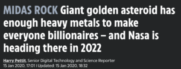
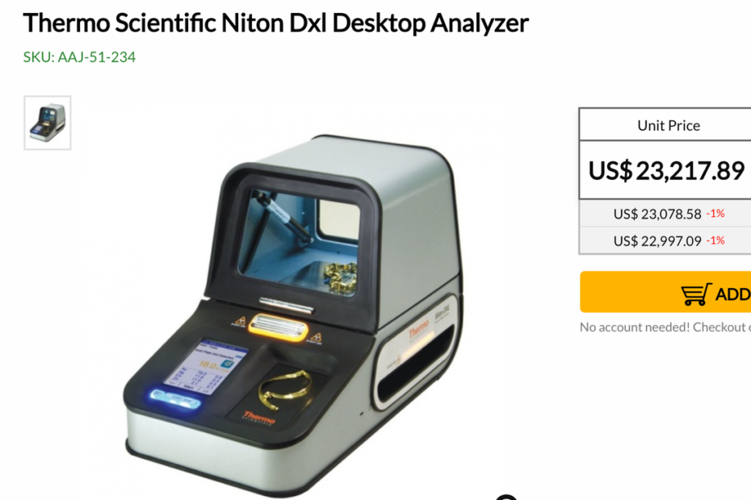
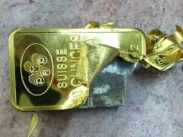

### Todos saluden al nuevo rey

Durante los últimos 4.000 años, el oro ha sido mundialmente reconocido como refugio de valor. Desde ser utilizado para preservar la riqueza de los faraones egipcios en el más allá, hasta permanecer como lingotes en bóvedas modernas, el oro ha sido el dinero sólido sobre el que se construyó la civilización.

Hasta este momento.

> **Hay un nuevo dinero en la ciudad, Bitcoin.**

### Bitcoin es una nueva especie de dinero

El código de vida está escrito en un organismo desde sus inicios. Satoshi diseñó cuidadosamente el ADN de Bitcoin, o código genético (su código computacional), para que sea el mejor dinero jamás creado. Podemos pensar que el código de Bitcoin representa instrucciones que se han escrito para incentivar la organización y coordinación de su función celular.

Ese código genético se manifiesta a través de rasgos (características de un organismo) que pueden ser visibles o no.

En biología, un rasgo es una característica de un organismo. De acuerdo con la teoría de la evolución por selección natural de Charles Darwin, los organismos que poseen rasgos que les permiten adaptarse mejor a su entorno en comparación con otros miembros de su especie tendrán más probabilidades de sobrevivir, reproducirse y transmitir sus genes a la siguiente generación.

El dinero no es diferente. El dinero tiene rasgos que le permiten sobrevivir y prosperar. Bitcoin es una nueva especie que tiene rasgos muy superiores a sus predecesores.

**Rasgos de Dinero**

**Bitcoin**

**Oro**

**Fiat**

**Verificable**

**Alto**

**Moderado**

**Moderado**

**Fungible**

**Alto**

**Alto**

**Alto**

**Portable**

**Alto**

**Bajo**

**Alto**

**Durable**

**Moderado**

**Alto**

**Bajo**

**Divisible**

**Alto**

**Bajo**

**Moderado**

**Escaso**

**Alto**

**Moderado**

**Bajo**

**Historia establecida**

**Bajo**

**Alto**

**Bajo**

**Resistente a la censura**

**Alto**

**Moderado**

**Bajo**

**Económicamente infalsificable**

**Alto**

**Alto**

**Bajo**

**\*Programable abiertamente**

**Alto**

**Bajo**

**Bajo**

**\*Descentralizado**

**Alto**

**Moderado**

**Bajo**

A continuación, compararé/contrastaré algunos de los rasgos.

### Escasez: ¿Cuánto de la oferta existe y cuánto habrá en el futuro?

Con el oro, no sabemos cuánto se ha extraído y no sabemos cuánto se extraerá. Pero sabemos que hay enormes cantidades de oro en el océano y en los asteroides. Solo un asteroide, Psyche, tiene varios metales que valen la suma gigantesca de $10.000 trillones de dólares. Como podemos ver fácilmente, la previsible escasez de oro es muy baja.

Con Bitcoin, tenemos una medida precisa de la oferta: 21.000.000, que cualquiera puede auditar con el computador de su casa.

### Verificabilidad: ¿puedes confiar en que es real?

El oro requiere maquinaria costosa para validarlo a un nivel confiable (generalmente ultrasonido + otros sensores). Sin embargo, esto todavía viene con errores de verificación, como vimos en China, donde 83 toneladas de barras de oro falsas ($2.800 millones) eran de cobre cubierto en oro. Además se habían realizado otros contratos encima de este oro, lo que provocó una serie de pérdidas adicionales.

[Fuente de barras de oro falsas de China](https://www.zerohedge.com/markets/83-tons-fake-gold-bars-gold-market-rocked-massive-china-counterfeiting-scandal)

La oferta de Bitcoin, cada transacción realizada y las nuevas transacciones que ocurren se pueden verificar fácilmente utilizando una computadora doméstica ejecutando un nodo completo de Bitcoin.

### Divisibilidad: ¿Qué tan pequeño puedes hacerlo?

El oro se puede dividir en trozos más pequeños, pero deben cortarse previamente a la transacción y su verificación tiene un costo prohibitivo.

Bitcoin es divisible hasta 1 / 100.000.000 de partes que se denominan “Satoshis” y, como se mencionó anteriormente, se pueden verificar fácilmente con una computadora en casa. 

### Portabilidad: ¿Puedes moverlo?

El oro es extremadamente pesado y es difícil de mover físicamente. Y como no es digital no puedes transar con él en Internet.

Alemania recientemente repatrió sus reservas de oro de $31 mil millones, o 743 toneladas, de París y Nueva York, lo que tomó 5 años a un costo de $9,3 millones. El proceso fue una locura:

-   El oro probablemente fue trasladado a Frankfurt a un altísimo costo.
-   Se evitó el transporte por carretera porque aumentaría el número de conductores y los lingotes son demasiado pesados ​​para moverlos en un volumen considerable.
-   Los abogados tuvieron que revisar los contratos para estar seguros de que estuviera asegurado durante el traslado (en caso de que se perdiera o se lo robaran). Muchas aseguradoras solo pagan en dólares, en lugar del metal precioso, lo que podría pillar al banco central desprevenido si el precio del oro aumenta entre la firma del contrato y la llegada segura de los lingotes a las bóvedas del Bundesbank.
-   Todas las barras tuvieron que ser examinadas por un equipo de 5-8 personas que utilizó máquinas de rayos X y otras técnicas para evaluar la pureza del metal.

Bitcoin habría requerido un consumo mínimo de energía y de 10 a 60 minutos dependiendo de su confianza en las confirmaciones de Bitcoin.

Finalmente, el oro nunca existirá de forma nativa en Internet en formato digital.

### Resistencia a las confiscaciones: ¿se puede almacenar de forma segura?

El oro debe almacenarse en grandes bóvedas con guardias y equipos de seguridad. Cuando se transporta se debe contratar un seguro adicional y contratar una seguridad especial.

Bitcoin se puede proteger de forma segura utilizando un pequeño dispositivo de hardware por $50 dólares, escribiendo sus claves en una hoja de papel o placa de metal, o siendo memorizadas.

### Bitcoin es el principal depredador del dinero.

Bitcoin se ha perfeccionado finamente para su entorno a través de su código genético excepcional y la manifestación de ese código en forma de rasgos superiores.

Bitcoin es el principal dinero depredador y su existencia es el precursor de la extinción del oro.
