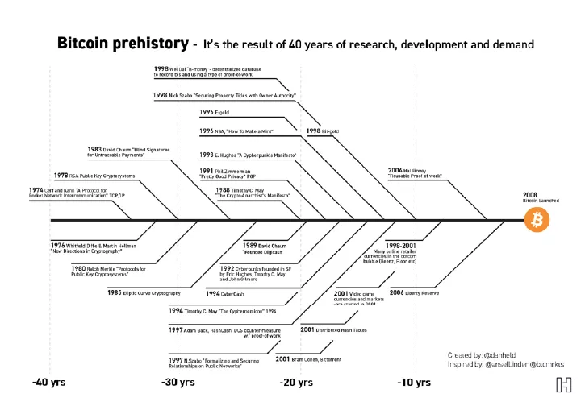
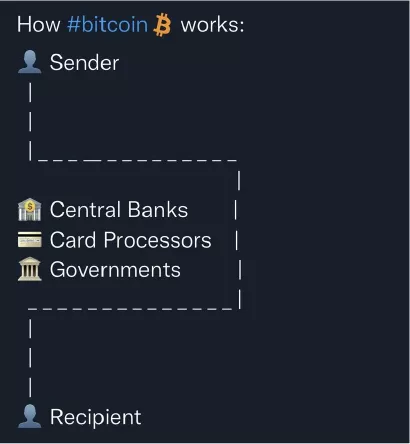

## Resumen

Bitcoin es dinero en efectivo de forma digital que además cuenta con las propiedades de dinero duro y está emergiendo del mercado. Es un activo real digital por lo tanto no está basado en deuda y parte de su innovación es que representa la escasez digital. Bitcoin se compone de la unidad de valor llamada bitcoin y de la red peer-to-peer (nodos, mineros y blockchain). La Prueba de Trabajo es el elemento que permite que la red llegue a un consenso sin la presencia de inter mediarios y que las transacciones en su blockchain sean inmutables ya que enlaza Bitcoin con el mundo tangible. Bitcoin es la tecnología en sí por lo tanto es único e irrepetible y cada proyecto que intente replicar sus propiedades se convierte en un intento fracasado. Además, Bitcoin redefine el concepto de propiedad priva da lo cual tiene consecuencias profundas. Sin embargo, en estas fases tempranas de adopción, la humanidad todavía no ha logrado asimilar los alcances de esta innovación. Este ensayo tiene como objetivo aclarar los mitos más comunes con respecto a Bitcoin, mostrar su lugar en el mundo y que sirva como una guía de referencias para el principiante en Bitcoin.

### Contenido

[**Introducción**](#intro)

**[Nacimiento de Bitcoin](#nacimiento)**

[Propuestas pre-Bitcoin](#propuestas)

[Bitcoin no es la primera de muchas](#no-es-la-primera)

**[Problema que Bitcoin resuelve](#bitcoin-resuelve)**

[Dinero](#dinero)

[Bitcoin](#bitcoin)

**[Funcionamiento de Bitcoin](#funcionamiento)**

[Elementos de Bitcoin](#elementos)

Bitcoin la red y bitcoin la unidad de valor

El blockchain de Bitcoin

[La Prueba de Trabajo](#pow)

[El ajuste de dificultad](#dificultad)

[Time chain](#timechain)

**[Propiedades de Bitcoin](#propiedades)**

[Descentralización](#descentralizacion)

[Inmutabilidad](#inmutabilidad)

[Escasez y cantidad limitada](#escasez)

[Inconfiscabilidad](#inconfiscabilidad)

[Neutralidad](#neutralidad)

[Independiente de terceros](#independencia)

**[Lightning Network (LN)](#lightning)**

[Problema de escalabilidad](#problema-de-escalabilidad)

[Solución: Lightning Network](#LN)

**[Más desarrollos sobre Bitcoin](#mas-desarrollos)**

[Fedimints](#fedimints)

[Taro](#taro)

[Liquid](#liquid)

**[Críticas hacia Bitcoin](#criticas)**

[Volatilidad](#volatilidad)

[Consumo energético](#consumo)

[Actividades ilegales](#actividades-ilegales)

**[Reto de Bitcoin: Privacidad](#reto)**

**[Para quién es Bitcoin](#para-quien-es-bitcoin)**

**[Proceso de adopción de Bitcoin](#adopcion)**

**[Predicciones](#predicciones)**

**[Conclusiones](#conclusiones)**

**[A. Ciclo de vida de una transacción](#anexo)**

## Bitcoin ya existe

#### Una evolución en la naturaleza del dinero

> Bitcoin es el primer ejemplo de una nueva forma de vida. Vive y respira en Internet. Vive porque puede pagarle a la gente para que lo mantenga con vida. . . No se puede cambiar. No se puede discutir con él. No se puede manipular. No se puede corromper. No se puede detener. . . Si la guerra nuclear destruyera la mitad de nuestro planeta, seguiría vivo, incorruptible (Merkle, 2021, p. 14). 

Durante los últimos años el interés por la palabra Bitcoin ha incremen tado, ya que, para muchos, parece estar relacionada con ganancias, dinero fácil, *trading*1, inversión y hasta fraudes. Por otro lado, están aquellos que ven en Bit coin una tecnología con un potencial de cambio que, incluso, llegan a comparar con la llegada del Internet. Sin embargo, pocos son los que realmente compren den de qué se trata y la razón radica en su complejidad; esto porque toca diversas áreas del conocimiento humano, tales como: criptografía, ciencia computacional, economía, filosofía y derecho, por mencionar algunas. Tanto es así que cuando figuras reconocidas de diferentes campos del saber logran captar la relevancia de Bitcoin e intentan explicar con palabras sencillas su funcionamiento, se valen de pintorescas analogías para expresar aquello que hace de Bitcoin un invento que se comporta de una forma nunca antes vista; un ejemplo de esto es como, (Strolight, 2021), se refiere a Bitcoin, ya que lo denomina como una tecnología alienígena (párr. 2), para indicar que no se parece a nada en nuestro planeta. 

Existe una brecha entre lo que Bitcoin parece ser para una persona novata en el tema y lo que verdaderamente es, también hay una desconexión entre su naturaleza como dinero, o una nueva forma de dinero, y las actividades para las que comúnmente se utiliza; por ejemplo, el trading, que depende de la volatilidad del precio de su unidad de valor, en términos *fiat*. 

Bitcoin resuelve de una manera mucho más óptima el problema de la trans ferencia de valor económico a través del espacio y el tiempo. El dinero, en su forma de oro, solucionó este problema durante miles de años, no obstante, el con cepto del dinero se ha deformado de tal modo que gran parte de la humanidad no ha logrado reconocer la magnitud de la innovación que Bitcoin representa. A la dificultad de mantener valor a través del tiempo, nos volvemos a enfrentar con las recientes crisis inflacionarias que experimentan muchos países a lo largo del mun do (OECD, 2022, pp.1-6) y las personas se encuentran en la búsqueda de activos refugio que no pierdan o mantengan su valor. 

El objetivo de este ensayo es mostrar la naturaleza, el funcionamiento y los mitos más comunes asociados con Bitcoin de una forma simple, para que el lector pueda apreciar su importancia histórica y, también, presentar algunas de las ideas más interesantes en este espacio expresadas en podcasts, artículos, libros, entre otros, de forma que pueda servir como una guía de referencias para quien inicia su aprendizaje. El mundo de Bitcoin está lleno de nuevos pensadores contemporá neos quienes han tomado la tarea de construir con sus pensamientos el mundo que desean ver. Además, los autores han manifestado sus opiniones a lo largo de este ensayo con el fin de que sean cuestionadas para así contribuir a cambiar el enfo que que existe en el precio de bitcoin y volcar la atención a su verdadero impacto. Esta lectura será dividida en segmentos que guiarán al lector en esta travesía. No está de más resaltar que el presente ensayo no se debe tomar como consejos finan cieros y que los puntos de vista expresados representan solamente la posición de los autores y no de sus afiliaciones. 

## Nacimiento de Bitcoin

> Nada es más poderoso que una idea cuyo momento ha llegado. (Hugo, 2015) 

Los *cypherpunks* conocían bien a lo que se enfrentaban. Este grupo de criptógrafos activistas de los años 90 estaban consternados por la privacidad en línea. La llegada del Internet representó para ellos un momento crucial, ya que reconocían que esta nueva tecnología podría utilizarse como una herramienta de vigilancia. Los cypherpunks trabajaron, incansablemente, por crear mecanismos basados en criptografía que permitieran la comunicación privada entre pares. Hug hes (1993), en el “Manifiesto Cypherpunk”, expresa: Nosotros los cypherpunks nos dedicamos a construir sistemas anónimos. Defendemos nuestra privacidad con criptografía, con sistemas de envío anónimo de e-mail, con firmas electrónicas y con dinero electrónico (párr. 7). 

Como un baluarte de los ideales cypherpunks, se encuentra Phil Zimmer man quien en 1991 desarrolló el sistema de mensajería *Pretty Good Privacy*, y como respuesta del gobierno estadounidense inician las *Crypto Wars*, oponiéndo se a sistemas de encriptación por ser considerado un tipo de arma. Sin embargo, el código fuente de Pretty Good Privacy fue publicado en un libro por medio del *MIT Press* lo que le permitió obtener una protección bajo la Primera Enmienda3a la Constitución de Estados Unidos. Este acontecimiento sería un logro que bene ficiaría a Bitcoin, debido a que éste también se trata de un código. Un interesante resúmen de la historia de los cypherpunks y las Cripto Wars se puede encontrar en (Gladstein, 2022, pp. 36-63). Cabe mencionar que los cypherpunks no solo se enfocaron en la privacidad digital, sino también en el desarrollo de dinero en efectivo digital. 

En el año 2008, un documento técnico titulado *“Bitcoin: Un Sistema Peer* *to-Peer de Dinero en Efectivo Electrónico”*, fue publicado en una lista de correos especializada en criptografía del dominio *metzdowd.com* en la que participaban los cypherpunks. Firmando con el nombre desconocido de Satoshi Nakamoto, el autor del artículo con la descripción técnica de Bitcoin anunció: He estado trabajando en un nuevo sistema de efectivo electrónico que es totalmente de *peer to-peer*4, sin un tercero de confianza (Nakamoto, 2008a).

Por primera vez en la historia de la humanidad fue posible “transaccionar” información, como si de un bien físico se tratase. Era posible, al fin, transferir directamente y sin intermediarios un bien digital sin conservar una copia válida o equivalente del mismo. Así como un mismo objeto físico no puede ocupar dos lu gares en el espacio simultáneamente; así también, un mismo bitcoin (o fracciones de él), no puede ocupar dos direcciones. Este suceso, como veremos más ade lante, cuando se usa para cometer fraude en sistemas digitales, se conoce con el nombre de doble gasto. Luego de una colaboración constante entre entusiastas y Nakamoto, tras un esfuerzo en conjunto para terminar de implementar el sistema en código, la red Bitcoin fue lanzada el 3 de enero del año 2009. 

Un dato que no se puede omitir, es que Nakamoto desaparece a finales del año 2010 sin dejar rastros de su identidad. Por lo que Bitcoin sin un líder se convierte en un sistema verdaderamente descentralizado. Nakamoto comprendió su rol y cuánto debía permanecer en él. Según los *Bitcoiners*5: Una de las cosas más grandes que hizo Satoshi, fue desaparecer. 

### Propuestas pre-Bitcoin

> Mucha gente descarta automáticamente la moneda electrónica como una causa perdida debido a todas las empresas que fracasaron desde la década de 1990. Espero que sea obvio que fue solo la naturaleza de control central de esos sistemas lo que los condenó. Creo que esta es la primera vez que intentamos con un sistema descentralizado, no basado en la confianza (Nakamoto, 2009). 

Bitcoin nace como resultado de intentos infructuosos por parte de los cyp herpunks por crear dinero electrónico: 

-   1989: *e-chash*. En 1983, el criptógrafo David Chaum, propuso una forma de dinero electrónico llamada *ecash*, o, *Chaumian e-cash*6 y fundó en 1989 la compañía *Digicash* con el fin de implementar su propuesta de firmas ciegas para brindar más seguridad y privacidad al usuario. En palabras de Chaum: El conocimiento por un tercero del beneficiario, monto y tiempo de pago de cada transacción realizada por un individuo puede revelar mucho sobre su localización, asociaciones y estilo de vida (Chaum, 1983, Sección Introduction, párr. 1). Digicash no tuvo éxito y cayó en quiebra en 1998. No obstante, el desarrollo criptográfico de las firmas ciegas de Chaum está de regreso con los *Fedimints* que será descrito en secciones posteriores.
-   1997: *Hashcash*. Sistema anti spam ideado por Adam Back del cual Na kamoto extrajo ideas para la Prueba de Trabajo. Back (2002) expresa que: Hashcash se propuso originalmente como un mecanismo para limitar el abu so sistemático de los recursos de Internet no medidos, como el correo elec trónico (Sección Introduction, párr. 1). En este caso, el encabezado de un correo electrónico tendría un *stamp* que demostraría que quien envía, em pleó cierta cantidad de tiempo calculando el stamp, basado en una función de costo que “debe ser eficientemente verificable, pero parametrizablemen te costosa de calcular” (Back, 2002, Sección Cost Function, párr. 1). De esta forma, si una persona emplea sus recursos calculando el stamp para enviar un correo electrónico, probablemente no sea spam. Actualmente, Back se encuentra activo trabajando para Bitcoin y es co-fundador de la compañía Blockstream.
-   1998: *b-money*. Dinero electrónico en efectivo, propuesto por Wei Dai, que contiene algunos de los conceptos fundamentales de Bitcoin, por ejemplo, el uso de la Prueba de Trabajo: Cualquiera puede crear dinero transmitiendo la solución a un problema computacional no resuelto previamente. Las únicas condiciones son, que debe ser fácil determinar cuánto poder computacional fue empleado para resolver el problema y, la solución, por el contrario, no debe tener valor, ya sea práctico o intelectual (Dai, 2022, párr. 5). Nakamoto referenció esta propuesta en su publicación de Bitcoin. 
-   1998: *bitgold*. Sistema precursor de Bitcoin. Fue propuesto por Nick Sza bo quien ha sido una de las mentes que más se ha dedicado al estudio del dinero y en resolver el problema de intermediarios para su transferencia. Según Szabo (2005): En resumen, todo el dinero que la humanidad ha usa do alguna vez ha sido inseguro de una manera u otra. Esta inseguridad se ha manifestado en una amplia variedad de formas, desde la falsificación hasta el robo, pero la más perniciosa, probablemente ha sido la inflación. Bit gold puede proporcionarnos una moneda de seguridad sin precedentes frente a estos peligros (párr. 13). 
-   2004: *Reusable Proof of Work (RPOW)*. Creado por Hal Finney quien ex plica su funcionamiento de la siguiente forma: Este sistema recibe hashcash como *token* de Prueba de Trabajo (POW), y en el intercambio crea tokens firmados por RSA8, a los que llamo tokens de Prueba de Trabajo Reutiliza ble (RPOW). Luego, los RPOW pueden transferirse de una persona a otra y ser intercambiados por nuevos RPOW en cada paso. Cada token RPOW o POW solo puede ser usado una vez, pero dado que da a luz a uno nuevo, es como si el mismo token se puede entregar de persona a persona (Finney, 2004). Finney fue un colaborador entusiasta de Bitcoin en sus inicios.

Nakamoto combinó varias tecnologías existentes, como se ilustra en la Fi gura 1, con algunas innovaciones propias, entre las que se destaca el Ajuste de Dificultad. Es interesante resaltar que justo después de la crisis hipotecaria del 2008 que fue ocasionada por la forma irresponsable en la que los bancos maneja ron las hipotecas de vivienda y valores respaldados por ellas, cuando Nakamoto lanzó al reducido nicho de cypherpunks su artículo en relativo silencio y desde un origen anónimo indeterminado como si de un torpedo se tratase.

### Bitcoin no es la primera de muchas

*Figura 1: Desarrollos criptográficos pre-Bitcoin. Bitcoin es una tecnología que se basa en investigaciones en criptografía que datan desde la década de los 80. Tomado de “Planting Bitcoin – Soil (3/4)”, por Held (2019), (Fuente).*

Contrario al pensamiento popular, Bitcoin no es la primera de muchas otras “criptomonedas” que emergieron después, entendiendo por criptomoneda “una unidad de valor creada utilizando *Blockchain Technology* o *blockchain*“. Bitcoin es la culminación de muchos intentos previos realizados por los cypherpunks con el fin de crear dinero en efectivo digital, así que las propuestas parecidas a Bitcoin emergieron antes de su llegada.

Las propiedades monetarias de Bitcoin, tales como la cantidad total de unidades de valor y su frecuencia de emisión, no se pueden alterar, porque están basadas en las reglas del consenso expuestas en la Prueba de Trabajo que, a su vez, está anclada en la realidad física. Bitcoin presenta una dualidad al estar presente en el mundo digital y tangible. Nakamoto (2010b) lo explicaba cuando decía que la naturaleza de Bitcoin es tal que una vez que la versión 0.1 fue liberada, su diseño fundamental fue escrito en piedra por el resto de su vida. 

Para poder dar una mejor idea, se podría decir que Bitcoin es como el oro, porque así como no podemos modificar las propiedades químicas de este elemen to, de forma similar, no podemos alterar las propiedades monetarias de Bitcoin. Si bien Bitcoin, a lo largo de su existencia, ha experimentado cambios en su *software*, estos no han alterado sus fundamentos sino su funcionalidad, como firmas y conexión entre nodos, en beneficio y aceptación por parte de sus usuarios; además, si alguno decidiera no optar por los cambios, lo puede hacer, en contras te con otras redes donde las modificaciones son de carácter impositivo. Por estas razones, Bitcoin es la señal, el resto es ruido.

## Problema que Bitcoin resuelve

En una entrevista en 1999, Friedman, Premio Nobel de Economía 1976, dijo: Creo que el Internet va a ser una de las principales fuerzas para reducir el papel del gobierno. Lo único que falta pero que pronto se desarrollará es un dinero en efectivo electrónico confiable, un método mediante el cual en Internet se pueden transferir fondos de A a B sin que se conozcan (AC Squared, 2022, 3m18s). 

La llegada del Internet revolucionó la forma en que transferimos informa ción, pero es hasta la llegada de Bitcoin que la transferencia de valor económico en el mundo digital se convierte en una realidad; como consecuencia, Bitcoin es un avance tecnológico de proporciones inimaginables y tan relevante como el In ternet mismo. Nakamoto logra resolver de forma práctica el problema de ciencia computacional de los Generales Bizantinos11 que, en términos de dinero, se co noce como el problema del doble gasto. El fundamento de la dificultad para este problema de coordinación radica en la confianza. En palabras de Nakamo to (2008b): El problema, por supuesto, es que el beneficiario no puede verificar 

que uno de los propietarios no gastó dos veces la moneda. Una solución común es introducir una autoridad central de confianza, o casa de moneda, que verifique cada transacción en busca de doble gasto. . . El problema con esta solución es que el destino de todo el sistema monetario depende de la empresa que dirige la casa de la moneda, y cada transacción tiene que pasar por ellos, al igual que un banco (Sección Transactions, párr. 2).

### Dinero

El dinero es una tecnología que permite la transmisión de valor a través del tiempo (depósito de valor) y a través del espacio (medio de pago y unidad de cuenta). Cuando el dinero cumple con la función depósito de valor, las personas realizan esta transmisión de valor usualmente consigo mismas, por ejemplo, una persona deposita en un bien el fruto de su tiempo y energía con la expectativa de utilizarlo a futuro. Cuando el dinero funciona como un medio de pago y unidad de cuenta, la transferencia de valor se puede dar entre personas que no confían entre sí. 

El dinero es el bien que le permite a los humanos la especialización y, con esto, el desarrollo de las civilizaciones, puesto que también resuelve el problema de la coincidencia mutua de deseos13. Lewis (2020) lo explica de la siguiente forma: La civilización tal cual la conocemos no podría existir sin dinero (Sección Money is a necessity, párr 1). Todos pueden contribuir con sus propias habilidades en función de sus propios intereses y preferencias personales: recibir dinero a cambio del valor entregado hoy y luego usar ese mismo dinero para adquirir el valor especializado creado por otros en el futuro (Sección Money is a necessity, párr 3). Ammous (2018) expresa que: La civilización humana floreció en tiempos y lugares donde el *sound money*14 fue ampliamente adoptado, mientras que el *unsound money* con frecuencia coincidió con decadencia social y colapso (p. 24). 

A lo largo de milenios los humanos en distintas partes del mundo, han llegado a la conclusión de que el mejor tipo de dinero es el oro por sus cuali dades dinerarias, Ammous (2018) explica las razones de la siguiente forma: El claro ganador en esta carrera a lo largo de la historia humana ha sido el oro, que mantiene su función monetaria debido a dos características físicas únicas que lo diferencian de otras mercancías: primero, el oro es tan estable químicamente que es prácticamente imposible de destruir; y segundo, el oro es imposible de sinteti zar a partir de otros materiales (a pesar de lo que los alquimistas afirman) y solo se puede extraer de su mineral sin refinar, que es extremadamente raro en nuestro planeta (p. 21). Además, como lo expresa Lewis (2020): El dinero es una solución a un problema intersubjetivo, los sistemas monetarios tienden a converger en un solo medio. O más bien, los sistemas económicos surgen naturalmente de un solo medio debido a la función del dinero (párr. 3). 

Para que un bien sea dinero debe cumplir con características específicas como escasez, durabilidad, divisibilidad, fungibilidad, ampliamente aceptado y fácil de transportar. Además, debe poseer las funciones de depósito de valor, me dio de pago y unidad de cuenta. Es importante resaltar que el dinero no es un sistema de creencias, ni es solamente un acuerdo entre grupos de personas: para que un bien sea un “buen dinero”, debe contar con las funciones y propiedades es pecíficas mencionadas previamente y emerger del mercado. Lewis (2020) resume estas ideas de forma muy concisa: Si cualquier individuo llega a tres conclusiones principales: i) el dinero es una necesidad básica, ii) el dinero no es una alucina ción colectiva y, iii) los sistemas económicos convergen en un solo medio, ese individuo buscará más conscientemente la mejor forma de dinero. Es el dinero lo que preserva el valor en el futuro y, en última instancia, permite a las perso nas convertir su propio tiempo y sus propias habilidades en un rango de elección tan grande que a las generaciones previas les resultaría difícil imaginar (Sección Bitcoin Obsoletes All Other Money, párr. 1). 

El dinero duro, que en inglés se conoce como *hard money*, es otro concep to crucial que sería mejor traducir como “dinero difícil”, ya que se define como el dinero cuya oferta monetaria es difícil de incrementar. La propiedad de escasez es vital para encontrar formas de dinero duro. El oro se impuso como dinero por milenios por ser la forma de dinero más dura conocida por la humanidad (hasta antes de bitcoin). La oferta del oro es difícil de incrementar y se requiere de trabajo para poder extraerlo de la superficie terrestre. Una fuerte crítica que requiere atención es hecha por Ammous (2018) quien dice: La mayoría de los economistas modernos no logran comprender: un dinero que es fácil de producir no es dinero en absoluto, y el dinero fácil no enriquece a una sociedad; por el contrario, la em pobrece al poner en venta toda su riqueza ganada con tanto esfuerzo a cambio de algo fácil de producir (p. 15). 

Otra característica importante del oro es la de “bien al portador”, cuando se realiza un pago con oro, la transacción es final y desaparece la obligación; en otras palabras, si no hay finalidad, hay una deuda. El reconocido J.P Morgan en su testimonio ante el Congreso en el año 1912, asertivamente expresó: el oro es dinero, todo lo demás es crédito, como se citó en (Investment Office, 2022, párr. 5). 

Sin embargo, el uso del oro como dinero no solo mostró desventajas en sus propiedades de transportabilidad y divisibilidad, sino que la circulación del oro en monedas acortó los alcances de la política monetaria de los bancos centrales. De esta forma nació la representación del oro en forma de papel, a modo de prome sas redimibles en oro. Cuando el oro se encontró en las reservas de los bancos centrales, existió para ellos la oportunidad de inflar la cantidad de billetes en cir culación, lo que muestra que el oro puede estar sujeto al control y es susceptible a la confiscabilidad. 

Hoy en día, el efectivo es la forma de dinero que posee el comportamiento de finalidad de las transacciones, pero el problema es que está basado en deuda. En un tema relacionado, es preocupante el desinterés de la población ante las ini ciativas que manifiestan sus líderes por crear sociedades sin efectivo, por ejemplo en Suecia, Noruega, China, Canadá y España (Quirós, 2022, párr. 4-8). El dinero en efectivo es el último vestigio de privacidad y de pagos sin intermediarios que queda en el sistema financiero tradicional. 

Ammous (2018) señala ciertas fechas relevantes: 

-   La era del Patrón Oro Clásico se dio durante el siglo XIX hasta la Primera Guerra Mundial en 1914 cuando los países se salieron del mismo con el fin de financiarse. 
-   El periodo Entre Guerras se caracterizó por devaluaciones de las mo nedas de diferentes países. 
-   En 1933, el Presidente Estadounidense Franklin D. Roosevelt por medio de la orden ejecutiva 6102 prohíbe la acumulación del oro e inicia un proceso de confiscación del mismo. 
-   En 1945 bajo *Bretton Woods* nace un sistema monetario internacional cuyo objetivo fue garantizar estabilidad en los tipos de cambio y la convertibilidad del dólar estadounidense con el oro. 
-   En 1971 se da el rompimiento del Patrón Oro, se detiene la conver tibilidad de los dólares. La orden fue establecida por el Presidente

Estadounidense Richard Nixon. La importancia de esta decisión fue que a partir de este año entramos en el experimento del dinero fiat. (pp. 17-72)15 

Actualmente, la mayor parte del dinero se encuentra de forma digital. Es posible realizar intercambios de valor digital a través de intermediarios que basan en promesas (crédito) y relaciones de confianza los registros de las transacciones entre sus usuarios. Pero hay que tener en cuenta dos puntos: los créditos tienen una relación directa con la identidad del usuario y el dinero se ha transformado en información de quién le debe qué a quién, o sea, deuda. 

De la familiarización social de las transacciones de dinero a través de in termediarios de confianza y el recuerdo del oro como dinero es de dónde surge la idea de “respaldo”. Esta noción se encuentra tan arraigada en la sociedad actual que, a pesar que el respaldo del dinero con oro es inexistente y es la confianza con intermediarios lo que brinda ese sostén, todavía un porcentaje de la población cree que el dinero que utilizan cotidianamente está basado en oro, por ejemplo, en Estados Unidos un tercio de los habitantes tiene esta opinión (Genesis Mining, 2019, Sección What is the US dollar backed by?). 

Una definición de dinero que recapitula y contiene las ideas de bien al portador y deuda es expresada por el economista Juan Ramón Rallo, en una entre vista: 

> Antes que nada, habría que distinguir entre el dinero y moneda o medio de cambio. Moneda es todo medio de cambio indirecto, todo instrumento para articular cambios indirectos. Dentro de la moneda, es decir, dentro de los medios de intercambio, podemos tener dinero o deuda. El dinero es un medio de intercambio basado en un activo real. La deuda es un medio de intercambio basado en un activo financiero. Por otro lado, un activo financiero es aquel que tiene como contraparte un pasivo financiero, no puede haber un activo financiero, que es un derecho de cobro, sin que ha ya una contraparte en forma de pasivo financiero, es decir, una obligación de pago. Un activo real no son derechos de cobro, porque no tienen obli gaciones de pago asociadas, son un bien que podemos utilizar por ser un bien como medio de intercambio. En cambio, en la deuda, los medios de intercambios que se utilizan como deuda, son medios de intercambio que utilizamos porque nos otorgan un derecho de cobro de calidad contra una tercera persona que tiene capacidad de pago. Entonces, el dinero sería un medio de cambio indirecto basado en un activo real. (Lunaticoin, 2022, 12m58s)

### Bitcoin

Enlazando esta breve reseña histórica con el problema que resuelve Bit coin, podemos concluir que Bitcoin es el cumplimiento de la predicción de Fried man, citado al inicio de esta sección. Bitcoin resuelve el problema de confianza en terceros porque elimina la necesidad de intermediarios para transferir valor. Bitcoin es dinero en efectivo de forma digital, esto significa que sus transacciones no requieren de un bien tangible para realizar intercambios de valor uno a uno, fi nales e inmediatos. Estos intercambios de valor cuentan también con la propiedad de inmutabilidad, debido a la forma en que opera la Prueba de Trabajo. Por esto es que Yakes (2021), al profundizar sobre la inmutabilidad de Bitcoin, incluso la lle ga a describir como la séptima propiedad, y explica por qué a raíz de esto Bitcoin pasa a ser una forma de dinero superior al oro: \[Bitcoin\] es la única forma de dine ro que mantiene la séptima propiedad monetaria de inmutabilidad. Bitcoin es un sistema peer-to-peer de dinero en efectivo. Sus características tecnológicas fueron diseñadas para crear propiedades monetarias superiores para el mundo digital. A través del tiempo, su red ha crecido lo suficiente, que actualmente, su activo mo netario es el más escaso, el más durable, el más portable, el más divisible y el más descentralizado del mundo (p. 279). 

Con la llegada de Bitcoin la noción de respaldo y confianza se redefinen, ya que la humanidad tiene la posibilidad de transaccionar con un activo real digital en posesión completa del portador; en otras palabras, es un bien que no posee riesgos de contraparte, puesto que no existe ninguna promesa u obligación qué honrar. Bitcoin no está basado en deuda, en contraste con los activos financieros del cual el dinero fiat forma parte. Es por esta razón, por su escasez y el trabajo que se realiza para crear nuevas unidades, que a Bitcoin se le conoce como “oro digital”. Por su política fija de emisión monetaria, Bitcoin es el bien que cumple con excelencia la característica de la escasez y que lo hace ideal como depósito de valor16. Nunca antes habíamos tenido un activo real digital que, además, contara con las características de dinero en efectivo y dinero duro simultáneamente. Aquí radica la utilidad de Bitcoin y su trascendencia tecnológica, no por nada es común escuchar entre los Bitcoiners la frase “Bitcoin es el Internet del dinero”17, y no “Bitcoin es el dinero del Internet”, por lo que es interesante tener en cuenta una comparación del rol de Bitcoin con el Internet, como se puede ver en la Figura 2. 

*Figura 2: Comparación del Internet y Bitcoin. Con Bitcoin se puede transferir valor a través del Internet. Las aplicaciones sobre el protocolo de Bitcoin apenas están empezando a ser construidas. Tomado de [Comparación entre Bitcoin y el Internet], por CroesusBTC (2021), Twitter (Fuente)*

Otro aspecto donde Bitcoin ha mostrado gran utilidad es en la reducción de los costos de transacción, por ejemplo se ha realizado un movimiento18 de aproximadamente $2*,*011*,*009*,*210 con solamente $0.78 de tarifa de transacción. Vale la pena recordar que el economista Ronald H. Coase recibió en 1991 el Premio Nobel de Economía por explicar por qué los individuos deciden formar empresas y el papel que juegan los costos de transacción en esta decisión. 

Bitcoin no ha completado su proceso de monetización19, por lo cual, to davía no es un medio de pago generalmente aceptado ni unidad de cuenta, pero es la opinión de los autores que Bitcoin contará con estas funciones una vez que sus efectos de red penetren la mayoría del mercado, en otras palabras, conforme más usuarios se unan a la red. Bitcoin es dinero porque cuenta con las propiedades de dinero y cuando esta realidad se comprenda de forma generalizada, Bitcoin cumplirá con las funciones de dinero.

## Funcionamiento de Bitcoin

> ¿Qué tienen en común las antigüedades, el tiempo y el oro? Son costosos, ya sea por su costo original o por la improbabilidad de su historia, y este costo es difícil de falsificar. . . Hay algunos problemas relacionados con la implementación de un costo infalsificable en una computadora. Si tales problemas se pueden su perar, podemos alcanzar ‘bit gold’. Esta sería la primera moneda en línea basada en una confianza altamente distribuida y un costo infalsificable en lugar de la con fianza en una sola entidad y los controles contables tradicionales (Szabo, 2008, párr. 1-4). 

### Elementos de Bitcoin.

> La red es robusta en su simplicidad no estructurada (Nakamoto, 2008b, Sección Conclusion, párr. 1)

#### Bitcoin la red y bitcoin la unidad de valor.

Bitcoin es un sistema que se compone de la red y su unidad de valor también llamada “bitcoin”, ver Figura 2. La red de Bitcoin es del tipo peer-to peer y sus nodos21 pueden clasificarse de acuerdo a sus funciones. Los nodos más comunes son aquellos que reciben, verifican y transmiten información (transacciones de bitcoin) a los demás nodos; también almacenan el libro de registro de transacciones llamado *blockchain*. Con el objetivo de cumplir estas labores, los nodos “corren” el software de Bitcoin comúnmente conocido como *Bitcoin Core*. En la red de Bitcoin también existen nodos especiales llamados “mineros” que además se encargan de agrupar las transacciones más recientes con el fin de que sean agregadas al blockchain. La unidad de valor bitcoin, es el activo digital que se mercadea en términos fiat, oro, bienes y servicios, entre otros. 

#### El blockchain de Bitcoin.

El blockchain fue propuesto desde 1991 por Haber y Stronetta quienes trabajaron en una forma que fuera capaz de *time stamp* documentos digitales con las siguientes propiedades: marcar la hora de los datos en sí, sin depender de las características del medio en el que aparecen los datos, de modo que sea imposible cambiar un solo *bit* del documento sin que el cambio sea evidente. En segundo lugar, debería ser imposible sellar un documento con una hora y datos diferentes a los reales (Haber and Stornetta, 1991, Sección Introduction, párr. 4). Como solu ción proponen el uso de funciones *hash*24 unidireccionales aplicadas a los docu mentos para ligarlos entre sí (Sección Summary, párr. 2), Nakamoto implementa, con ciertas variaciones, esta idea en Bitcoin. 

El blockchain de Bitcoin es el libro que registra todas las transacciones ocurridas en la red, es un elemento fundamental, pero no es la tecnología en sí, como muchos erróneamente han creído en los últimos años. El blockchain es una estructura de datos que agrupa información en lo que se ha denominado “bloques”. Los bloques se conforman por transacciones agrupadas en otra estructura de datos llamada *“Merkle tree”* y el encabezado que contiene la información del bloque presente y el identificador del bloque previo. El enlace por medio de funciones hash con el bloque anterior es lo que le da la característica de “cadena” y por lo tanto el nombre de blockchain. Todos los nodos de Bitcoin mantienen una copia del blockchain y su actualización, o sea, el bloque nuevo, y este es propuesto por los nodos del tipo mineros. 

La red de Bitcoin es una red abierta y pública, por lo tanto es resistente a la censura, ya que todo el que quiera puede participar corriendo un nodo y validar de forma independiente las transacciones. Sin embargo, esto posee un riesgo para el sistema, debido a que pueden existir nodos maliciosos que intenten propagar tran sacciones que supongan un doble gasto. Nakamoto, de forma ingeniosa, propuso una manera en la que los nodos sin necesidad de confiar entre sí, sean incentivados a mantener la red segura y estén expuestos a pérdidas económicas si la atacan. 

Por otro lado, es común escuchar expresiones como “Bitcoin es la primera aplicación sobre *Blockchain Technology*“. No obstante, Bitcoin es la tecnología en sí, entendiendo por tecnología una herramienta que nos permite realizar “algo” que no se podía hacer antes. Bitcoin es dinero duro, y como dinero, resuelve el problema de la transferencia de valor a través del espacio y el tiempo, incluso, de una forma más eficiente que el oro porque, como se explicó antes, el oro es posible de confiscar y puede estar sujeto al control. 

Otro error se encuentra en el uso de la palabra “criptoactivo” o “cripto moneda” para referirse a bitcoin, queriendo indicar que es un activo digital que utiliza un blockchain en el que se registran los intercambios de su unidad de valor. Asertivamente expresa Juan Ramón Rallo, que la técnicas subyacentes de un activo no indican su naturaleza: 

> Lo que caracteriza un activo no es la tecnología o el soporte, sería como hablar de papiro-activo para meter en el mismo saco el franco suizo, el peso argentino o un certificado de una acción de *Apple*. La tecnología pue de ser muy importante, la criptografía puede ser clave pero no define la naturaleza de un activo. (Mundo Crypto, 2022, 0m55s) 

Un mito más que se ha propagado es el de decir que “el blockchain de Bit coin es seguro porque está totalmente encriptado”. Esta afirmación es incorrecta, puesto que el blockchain de Bitcoin es público, la criptografía en sí se utiliza para firmar transacciones y para proveer al bloque de un identificador único. 

### La Prueba de Trabajo

Según Vitalik Buterin, la Prueba de Trabajo está basada en las leyes de la física, de forma que tienes que trabajar con el mundo tal como es (Walker, 2022, 0m59s). La solución práctica para evitar el doble gasto propuesta por Nakamoto se conoce como la Prueba de Trabajo o (PoW), por sus siglas en inglés *Proof of Work*, y es la forma en que la red llega a un consenso acerca de lo que ha ocurrido y su orden. Este mecanismo de consenso requiere de un insumo energético o un costo externo.

Los mineros al agrupar las transacciones con el fin de crear un nuevo blo que, deben, por prueba y error, resolver un reto matemático tal que la identidad, o sea, el identificador o huella digital del bloque, cumpla con condiciones prees tablecidas por el protocolo. Cuando un minero resuelve el reto, el protocolo le otorga cierta cantidad de bitcoin nuevas (actualmente 6.25 bitcoin) como recom pensa o incentivo (basado en Teoría de Juegos) por el trabajo realizado; por lo tanto, los mineros compiten entre sí, comprometiendo sus propios recursos en la forma de equipo computacional y electricidad, con el propósito de ganar bitcoin. 

Si los mineros incluyen transacciones inválidas en el bloque propuesto, los nodos no aceptarán tal bloque como válido y no será incluido en su blockchain. De esta manera, está en el mejor interés de los mineros actuar de forma honesta porque de lo contrario, su gasto en equipo y electricidad no se verá retribuido; la energía en forma de electricidad es valiosa en nuestro planeta y los mineros no están dispuestos a desperdiciarla. Esta es la forma en la que bitcoin, un bien digital, se enlaza con el mundo físico, material o tangible. 

Los mineros crean bloques nuevos en promedio cada 10 minutos, este in tervalo debe permanecer constante, así que la dificultad de creación de bloques es el parámetro que varía. 

La política de emisión monetaria de Bitcoin ha sido preestablecida: sola mente 21 millones de bitcoin serán creados en total; a partir del bloque génesis 50 bitcoin fueron creados por bloque y otorgados como incentivo a los mineros por un periodo de 210000 bloques aproximadamente 4 años. En este punto ocurrió un recorte a la mitad *(halving)* en la recompensa por bloque que pasó de ser 50 bitcoin a 25 bitcoin. Los mineros al cabo de este primer recorte ganaron 25 bitcoin por bloque hasta el siguiente recorte, otros 210000 bloques y así sucesivamente hasta que la cantidad de bitcoin total emitida llegue asintóticamente a 21 millo nes, suceso que ocurrirá en el año 214026. En la Figura 3 se ilustra la política de emisión monetaria de Bitcoin. 

Uno de los mitos más comunes relacionados con la minería es que: “el propósito de la minería es crear bitcoin”. No obstante, el objetivo de la minería es proveer de seguridad a la red de Bitcoin. Por lo tanto, la energía invertida con este propósito no se está desperdiciando. 

La forma en la que Bitcoin por medio de la Prueba de Trabajo resuelve el problema del doble gasto se discute en el Anexo A donde se explica el Ciclo de Vida de una Transacción.

*Política de emisión monetaria de Bitcoin. Solamente 21 millones de bitcoin serán creadas. La línea azul muestra un crecimiento exponencial en la emisión de bitcoin durante los primeros 210000 bloques, y una disminución de su pendiente al cabo del primer y sucesivos recortes. La línea roja muestra la razón anualizada del crecimiento de la oferta bitcoin (inflación). Tomado de “The Bitcoin Central Bank’s Perfect Monetary Policy”, por Rochard (2013), Rochard (Fuente).*

### El Ajuste de Dificultad

> En lugar de que la oferta cambie para mantener el mismo valor, la oferta está predeterminada y el valor cambia (Nakamoto, 2009).

Nakamoto introdujo otra gran idea llamada “El Ajuste de Dificultad”, ya que la frecuencia de creación de bloques podría aumentar o reducirse dependiendo del *hash power*27 de todos los mineros. Si el *hash power* aumenta, el tiempo promedio de minado de los bloques será menor a 10 minutos y, si el hash power disminuye, este tiempo de minado promedio será mayor a 10 minutos. Por lo tanto, de acuerdo a las reglas del protocolo, cada 2016 bloques aproximadamente 2 semanas, los nodos ajustan la dificultad del reto matemático con el fin de que la frecuencia de creación de bloques se mantenga en un promedio de 10 minutos. Este proceso se ilustra en la Figura 4. 

*Ajuste de Dificultad. Si más mineros se integran a la red, el tiempo promedio para crear un bloque disminuye y, en el siguiente ajuste, el software incrementará la dificultad del reto al cabo de 2016 bloques y viceversa. Tomado de “Mi Primer Bitcoin Libro de Trabajo”por Mi Primer Bitcoin (2022), Mi Primer Bitcoin (Fuente).*

La relevancia del ajuste de dificultad consiste en que Bitcoin es el primer y único sistema que fusiona la emisión de nuevas unidades de valor a un intervalo de tiempo predeterminado, es este el ingrediente “secreto” de Nakamoto. En este sistema, bitcoin representa un bien en el que su aumento de precio no dispara la oferta, ya que su emisión total no puede ser cambiada. Considerando el caso de materias primas, si su precio aumenta, hay mayor incentivo por crearlas, como consecuencia, su oferta aumenta provocando una caída en su precio. 

En el caso de Bitcoin, un aumento de precio de bitcoin incentivará a más mineros unirse a la red y participar, de forma honesta, con el fin de crear bitcoin nuevos, pero el aumento de mineros en la red no provocaría una creación más rápida de bitcoin, porque su emisión está anclada al tiempo, que también es escaso, sino un aumento en el *hash power* y, por lo tanto mayor seguridad de la red. De esta forma estamos en la presencia de un nuevo paradigma económico, la emisión de bitcoin no puede ser cambiada porque el paso del tiempo no es manipulable por medio de capital e inversión. Esta forma novedosa de alinear incentivos basada en Teoría de Juegos en conjunto con la Prueba de Trabajo, es lo que hace de Bitcoin una tecnología sin precedentes ni sucesores.

### Time chain

> La Prueba de Trabajo en un entorno peer-to-peer funciona porque no re quiere de confianza y esto se da porque está desconectada de todos los elementos externos — como la lectura de relojes (o periódicos, por ejemplo). Se basa so lamente en una cosa: los cálculos requieren de trabajo, y en nuestro universo, el trabajo requiere de energía y tiempo (Der Gigi, 2022b, Sección Proof of Time, párr. 4).

Es necesario subrayar que Nakamoto (2008b) no hizo mención a la pala bra blockchain, sino que utilizó *“timestamp server”* (Sección Introduction, párr 2) y *“timestamp network”* (Sección Proof-of-Work, párr 2). Muchos prefieren el uso del término *time chain*, para referirse al registro de transacciones en lugar de blockchain. La coordinación por medio de la Prueba de Trabajo, provee la forma en que los nodos sean capaces de llegar a un acuerdo acerca del orden cronológico de las transacciones y los bloques en su libro de registros. 

En el ciberespacio no existe el tiempo de la forma en que lo percibimos, por lo que, si se organizan las transacciones y bloques con respecto a un sistema de referencia temporal, se estaría insertando un elemento de coordinación central en la red. Desde un punto de vista relativista, no existe una forma absoluta de medir el tiempo, la simultaneidad de eventos separados espacialmente depende del observador y su marco de referencia; por esto, lo que se mide es el intervalo entre ellos. 

La Prueba de Trabajo es la forma en la que Nakamoto ideó, basado en investigaciones que lo preceden, que la red llegue a un consenso del orden crono lógico de los eventos, o sea, un consenso en la sucesión temporal de las transac ciones y los bloques, sin la necesidad de confiar en el reloj de un tercero. Por esta razón, es más apropiado referirse al blockchain de Bitcoin como un time chain, cuya medida interna de tiempo son los bloques ya que, por sí mismos, tienen una frecuencia de creación (Der Gigi, 2022b). En consecuencia, imaginando un esce nario poco probable en que los usuarios de la red de Bitcoin intentaran cambiar su protocolo de consenso de Prueba de Trabajo a algún otro mecanismo, se correría el riesgo de agregar un elemento externo para lograr la coordinación temporal. Esta es una de las razones por las que los Bitcoiners se encuentran renuentes a considerar esta opción a pesar de las críticas del consumo energético de la red. 

## Propiedades de Bitcoin

En los siguientes párrafos se muestra de forma breve las propiedades más significativas de Bitcoin que son irrepetibles en otros sistemas.

### Descentralización

No confíe. Verifique. (Mantra Bitcoin). La descentralización es una distri bución completa y funcional del sistema entre actores independientes coordinados a través de incentivos varios, que pueden ser de naturaleza económica, política, so cial y ética. Bitcoin cumple con esta propiedad tanto para la emisión de su unidad de valor como para su transferencia a nivel de protocolo. También se puede ar gumentar que estas características ya han sido impregnadas en la mente de los usuarios y cualquier cambio será repudiado. 

Un ejemplo histórico de un registro descentralizado de información es La Biblia. A pesar de que han existido diferentes traducciones y versiones a lo largo de los años; la historia, los principios y los fundamentos son inmutables porque han sido transmitidos por generaciones. Imagine el caso de una variante escrita en que Jesús no resucitó, los cristianos rechazarían tal interpretación como la base de su fe y el libro donde estuviera escrita esta versión de los hechos no sería La Biblia. Las propiedades monetarias de Bitcoin no solo se encuentran como parte del protocolo en los nodos, sino que ya pertenecen a la tradición oral y escrita entre los Bitcoiners que, en conjunto con la Prueba de Trabajo, ocasiona que sean imposibles de cambiar. 

Es importante de resaltar es que uno de los elementos que permiten la des centralización en Bitcoin es que un usuario regular puede correr su propio nodo, ya que aquel con su propio nodo de Bitcoin, es Bitcoin. Por lo tanto, la descen tralización radica en la posibilidad de correr nodos por parte de los usuarios y no necesariamente en la posibilidad de crear bloques. Ammous manifiestó: Los mineros venden un bien a los nodos y ese bien son los bloques de Bitcoin. . . los mineros son un proveedor de servicios. . . que invierten previamente en capital y solamente lo recuperan si siguen la voluntad de los nodos, así que lo que verdade ramente importa es la descentralización de los nodos, el objetivo es tener la mayor cantidad de nodos posible (Fridman, 2022, Sección Critics of Bitcoin, 2h42m50s).

### Inmutabilidad

Antonopoulos (2017) explica la propiedad emergente de inmutabilidad de la siguiente forma: Blockchain asegura que no se pueda cambiar algo sin que nadie se dé cuenta. En el campo de la ciberseguridad lo llamamos *“tamper-evident”*, lo que significa es que, si existe un cambio, este es evidente. No se puede manipular sin evidencia de manipulación. Pero hay un estándar más alto en seguridad, que llamamos *“tamper-proof”* o, a prueba de manipulaciones, o sea, es algo que no se puede manipular. No solo será visible si se manipula, sino que no se puede cambiar, es inmutable. 

Y la característica que le da a Bitcoin su capacidad *tamper-proof* no es blockchain, es la Prueba de Trabajo. La Prueba de Trabajo es lo que hace que Bitcoin sea fundamentalmente inmutable y ese es un concepto muy importante de entender porque muchas personas están lanzando palabras como blockchain y afirmando que estas cosas son inmutables aunque no tengan una Prueba de Trabajo o cualquier tipo de algoritmo de consenso que les otorgue inmutabilidad. En el mejor de los casos, las blockchain pueden ofrecer evidencia de manipulación; lo que significa que alguien se dará cuenta, pero no son inmutables. Esta distinción va a ser históricamente importante (5m39s). 

Dentro de los errores más recurrentes se encuentra la afirmación: “lo que se registra en un blockchain es inmutable”. Esta creencia se debe a que los bloques se entrelazan consecutivamente por medio de huellas digitales o identificadores obtenidos al aplicar funciones criptográficas de una dirección a la información que se agrupa en ellos. Muchos aseguran que si el blockchain está distribuido por diferentes nodos, esto provocará que lo que esté escrito en él no se pueda cambiar, pero en realidad si se cambia la información de algún bloque en algún nodo, nos daríamos cuenta *(tamper evidence)*, y cambiar esta información (datos) es posible porque no hay un costo energético asociado. En este escenario se necesita la con fianza en “nodos principales” o “nodos coordinadores” para que algún otro nodo sepa distinguir cuál es el blockchain correcto. 

La propiedad de inmutabilidad *(tamper proof)* es una característica ex clusiva de Bitcoin que se manifiesta en su blockchain como consecuencia de la Prueba de Trabajo. Si un ente malicioso desea cambiar el pasado, es decir, manipular una transacción que ha sido incluida en el blockchain de Bitcoin, dicho actor debe invertir tiempo y energía para resolver el reto matemático, debido a que los nodos sólo incluirán en su registro aquellos bloques que cumplan con las condi ciones establecidas por la Prueba de Trabajo. Esto quiere decir que se requiere de un costo energético para cambiar las transacciones del blockchain de Bitcoin, esto porque los nodos escogen el blockchain que presenta la mayor cantidad de trabajo, por lo que no hay necesidad de “nodos coordinadores”; en otras palabras, si un nodo presenta un blockchain “nuevo” deberá demostrar el trabajo o coste energético que conlleva su creación, y si este no es mayor al del blockchain que posee cada nodo, no será aceptado. De esta forma cada nodo puede distinguir cuál es la cadena principal. 

La siguiente explicación es certera en la relevancia de la Prueba de Tra bajo para que las propiedades de inmutabilidad y escasez emerjan del sistema: La información que se genera a través de la Prueba de Trabajo sólo puede existir porque sucedieron ciertas ‘cosas’ en el mundo real. Ciertos eventos que son tan improbables, tan increíblemente improbables, que realmente tuvieron que ocu rrir a pesar de que cada evento individual fue un evento digital (Der Gigi, 2022a, Sección Digital Reality, párr. 10).

### Escasez y cantidad limitada.

Debido a la importancia de esta propiedad, a lo largo de este documen to la escasez y la cantidad finita de bitcoin se ha discutido en varias ocasiones. No obstante, es interesante meditar en las palabras del emprendedor y tecnólogo Booth (2022), cuando dijo: El dinero abundante crea escasez en todo lo demás. La escasez en el dinero crea abundancia en todo lo demás (Energy (as a part of security), párr.1).

### Inconfiscabilidad

> La revolución es de tal magnitud que nos permite acumular riqueza sin que nadie más en el mundo pueda quitárnosla, para bien o para mal. Es un contrato de propiedad sin necesitar a los Estados, permite tener el con trol exclusivo de un bien sin necesidad de leyes ni intermediarios. (Maria, 2022, Capítulo 6, párr. 4)

El usuario tiene acceso al bitcoin que posee por medio de un par de llaves criptográficas. Si el usuario sigue buenas prácticas de seguridad y privacidad de su llave privada, nadie sabrá que es dueño de bitcoin. Esto es totalmente innovador porque no existe un bien tangible que no esté sujeto a la confiscación, además de que los bienes digitales pueden ser copiados, pero esto cambia con la aparición de Bitcoin.

Muchos Bitcoiners manifiestan que Bitcoin representa la separación del dinero y el Estado. Y aún más allá, están quienes expresan que Bitcoin redefine el concepto de propiedad privada, ya que bitcoin es lo único que el individuo realmente puede poseer. En otras palabras, Bitcoin tiene el potencial de brindar derechos de propiedad privada a toda la humanidad. 

Es conveniente ahondar en la definición de propiedad, a esto, según Rous seau, la propiedad es un derecho natural que requiere de la presencia de los estados para su defensa; por el otro lado, de acuerdo a la visión de Stirner, propiedad es aquello que está bajo el dominio del individuo y bitcoin es el único bien que cae bajo esta última interpretación (Begleri, 2022, párr. 6). Como consecuencia, el contrato social se redefine con bitcoin como núcleo y diferentes modelos pueden surgir luego de una etapa de transición del sistema fiat a un sistema con Bitcoin como estándar sin la presencia de los Estados. 

### Neutralidad

El sistema Bitcoin permite a cualquier actor transaccionar en la red en igualdad de condiciones, independientemente de su etnia, credo, calificación cre diticia o postura política, en contraste con el sistema actual. El protocolo de Bitcoin no distingue entre usuarios ni transacciones. Una transacción válida es incen surable e imparable para cualquier poder de tipo tecnológico o político, en Bitcoin no existen transacciones ilegales.

### Independiente de terceros.

A lo largo de este documento se ha explicado por qué Bitcoin no necesita de la presencia de intermediarios. Esta propiedad se puede resumir con el siguiente *meme* de la Figura 5.

*Figura 5: Meme del funcionamiento de Bitcoin. Ilustración de la independencia de Bitcoin con respecto a los intermediarios. Tomado de Bitcoin Magazine (2022).*

## Lightning Network (LN)

Bitcoin comenzó con un diseño inteligente desde el principio. Creó una red de liquidación y oro digital subyacente, con un confiable grado de descen tralización, auditabilidad, escasez e inmutabilidad que ninguna otra red rivaliza actualmente. Además, sobre estas bases se está desarrollando Lightning como red de pago y ha alcanzado una masa crítica de liquidez y usabilidad. (Alden, 2022, párr. 5). 

### Problema de escalabilidad.

Como parte de las críticas que experimenta Bitcoin es que, si bien es cier to es utilizado como oro digital y depósito de valor, no es idóneo como medio de pago ya que el usuario debe esperar a que su transacción sea incluida en el blockchain de Bitcoin y este es un proceso que ocurre en promedio cada 10 minu tos. A esta dificultad se conoce como el “problema de escalabilidad”, en términos coloquiales se ilustra con la frase “no puedo comprar un café con bitcoin”. 

La escalabilidad se refiere al bajo número de transacciones por segundo (tps) que Bitcoin es capaz de procesar, alrededor de decenas de tps, mientras que redes como Visa o Mastercard pueden procesar hasta miles de tps. La velocidad de la red Bitcoin en términos de tps existe supeditada a su descentralización, el costo de ancho de banda necesario para sincronizar los nodos, ya que estos deben ser económicamente accesibles para la mayor cantidad de personas y al mismo tiempo generar consenso sobre todas las transacciones a nivel global. Una forma que parece obvia para incrementar la cantidad de tps es au mentar el tamaño del bloque y/o su frecuencia de minado, puesto que bloques más grandes y frecuentes pueden representar más tps. Han existido múltiples ini ciativas para promover cambios y crear nuevas versiones de Bitcoin basadas en la priorización de tps, aunque en detrimento de la descentralización. Destaca dentro de estos movimientos un evento conocido como el *Blocksize Wars* que tuvo lugar en el 2017, en el cual personalidades adineradas con el apoyo de un importante porcentaje de mineros, los que se verían económicamente beneficiados con es te cambio, intentaron convencer al resto de la red en aumentar el tamaño de los bloques. 

El resultado que han tenido estas iniciativas ha sido un aplastante rechazo por parte de la gran mayoría de los nodos y del mercado. El precio en dólares, capitalización de mercado, volumen de transferencias y capacidad computacional minera de estas redes, son comparables a cualquier proyecto aleatorio sin pro puesta de valor, como por ejemplo, monedas-*memes* de perritos, y ocupan un lugar junto a los miles de proyectos fallidos en el llamado “ecosistema cripto”. Estas bifurcaciones fracasadas mostraron la verdadera naturaleza descentralizada de Bitcoin. De manera práctica, todo lo que un conjunto de actores poderosos pue de hacer es cambiar el código y sus parámetros, pero tal cadena será vista por los nodos y valorada por el mercado como otra imitación más.

Así que, en lugar de comprometer la inmutabilidad y descentralización buscando una red que sea capaz de procesar un número elevado de transacciones, el enfoque de los desarrolladores de Bitcoin es escalar por capas. Las “capas” son protocolos donde el intercambio de bitcoin ocurre sin necesidad directa de utilizar el blockchain para cada una de las transacciones. Este método de escalabilidad ha tenido una acogida favorable por los nodos de Bitcoin y el mercado.

Con respecto a este suceso del 2017, es interesante el análisis de Bier (2021) y las lecciones que los Bitcoiners deben aprender para el futuro, cuando dice que: Sin embargo, no hay garantía de que esta característica de dinero con trolada por el usuario persista para siempre. Las Blocksize Wars solo le dieron tiempo a Bitcoin, varios años más. Es posible que esta guerra solo sea un simu lacro para los desafíos que se avecinan, cuando los principales beneficiarios de los sistemas monetarios controlados centralmente se den cuenta del potencial del dinero impulsado por el usuario, es probable que no les guste. Estas futuras ba tallas podrán ser sobre la resistencia a la censura, en lugar de la escalabilidad y el tamaño del bloque. Esta vez, es probable que el establecimiento financiero y político inicie el conflicto (p. 214).

### Solución: Lightning Network.

En el año 2015, los investigadores Joseph Poon y Thaddeus Dryja, pro ponen a *Lightning Network (LN)* como la solución al problema de escalabilidad de Bitcoin y expresan: para que Bitcoin tenga éxito, se requiere la confianza de que, si llegara a ser extremadamente popular, sus ventajas actuales derivadas de la descentralización sigan existiendo (Poon and Dryja, 2016, p. 3). LN es un pro tocolo de interacción peer-to-peer con la cadena principal de forma segura y se le conoce como “segunda capa”. Por medio de esta red es posible crear “canales de pago” o conexiones entre los nodos de LN. Los canales de pago son relaciones transaccionales entre dos partes acerca de cómo enviar y recibir pagos de bitcoin entre ellos con condiciones de vínculo establecidas por medio de direcciones mul tifirma28. LN, al igual que Bitcoin, es una red abierta que opera en todo el mundo 24*/*7\. LN es una forma de usar bitcoin: en el protocolo base, los intercambios de bitcoin se conocen como transacciones y son del tipo *“on-chain”* (se registran en el blockchain de Bitcoin), en LN los intercambios de bitcoin se llaman pagos y son del tipo *“off-chain”*, lo que significa que los pagos no están registrados en el blockchain de Bitcoin. 

Estos pagos de bitcoin entre los canales de pago, tienen un costo mucho menor que una transacción y mantienen las propiedades de inmutabilidad y fina lidad de la capa base. Además, LN provee de mayor privacidad al usuario. Las transacciones de apertura y cierre de canales sí son registradas en el blockchain. Una característica importante de la red es que no todos los nodos deben tener ca nales29 abiertos entre sí, ya que el protocolo de LN es capaz de enrutar pagos por medio de otros canales, entre nodos en la red, que tengan suficiente liquidez de satoshis. LN puede llegar a ser capaz de procesar millones de tps, solucionando así el problema de escalabilidad.

Para comprender el funcionamiento de LN a muy alto nivel, usualmente se utiliza el ejemplo de unos amigos que van a un bar y abren una cuenta a nombre de alguno dejando como respaldo una tarjeta de crédito, al final de la noche, todo lo que ha sido consumido por ellos se consolida en una sola transacción, como se muestra en la Figura 6, con la diferencia que los pagos en LN no representan deudas.

*Figura 6: Lightning Network (LN). La transacción de apertura y cierre del canal de pago entre peers se registra en el blockchain de Bitcoin. Los pagos de bitcoin que ocurren en los canales son inmediatos, seguros y finales. En la ilustración se muestra un canal de pago abierto entre un comercio (dueño de un bar) y su cliente. LN permitirá a bitcoin ser utilizado como medio de pago, una de las funciones del dinero.*

Haciendo paralelismos del sistema financiero tradicional con el sistema Bitcoin encontramos un desarrollo por capas. Lewis (2019) explica que: El dinero y la tecnología de pagos son problemas distintos. La razón fundamental es que hay dos lados en cada transferencia de valor; un lado casi siempre involucrando dinero y el otro como el cumplimiento de bienes y servicios. Las capas de pagos ayudan a proporcionar un puente (Sección Bitcoin vs. The Federal Reserve, párr. 2).

En Bitcoin, la primera capa, es una red de finalidad con su propia política monetaria de emisión de su unidad de valor, bitcoin. Bitcoin es análogo a los bancos centrales que tienen a cargo la propia política de emisión monetaria de la moneda de curso legal de un país. Las transferencias interbancarias por medio de los bancos centrales son finales y los montos que se transfieren son altos, ya que representan la sumatoria de miles de transacciones ocurridas entre los bancos comerciales por medio de las redes de pago. 

La segunda capa, LN, es una red de pagos de bitcoin, pero los montos tienden a ser mucho menores que en la capa base, pues representan el uso de bitcoin como medio de pago. Cuando los canales de pago se cierran, la transacción de cierre en el blockchain de Bitcoin puede representar miles de pagos ocurridos en la capa superior. LN es análoga a Visa, Master Card, Paypal, Venmo, SINPE y las compañías de remesas. Las redes de pagos tradicionales no emiten dinero ni lo “mueven”, ya que son redes de comunicación; la información que se transmite son las promesas de pago entre sus usuarios. LN se diferencia de las redes de pagos tradicionales en que sus pagos no representan deudas o créditos, todos los pagos están garantizados por bitcoin subyacente, así que los pagos en LN también son finales.

LN es una red global, ver Figura 7, la cual tiene sus propios efectos de red que se alimentan, también, de los efectos de red de la capa base de Bitcoin y del In ternet. LN está creciendo exponencialmente, debido a sus avances y crecimiento, es que los países de El Salvador y la República Central Africana deciden convertir a bitcoin en moneda de curso legal. También cabe resaltar que la compañía Twitter adopta LN para su integración de propinas.

*Figura 7: Visualización de Lightning Network alrededor del mundo. Tomado de Acinq (Fuente)*

## Más desarrollos sobre Bitcoin

Además de LN, existen una serie de protocolos y desarrollos interesantes que interactúan con la capa principal del blockchain de Bitcoin, entre ellas se destacan Fedemints, Taro y Liquid.

> [!actualizacion]
> En 2023 Taro pasó a llamarse Taproot Assets.

### Fedimints.

Las *Federated Chaumian Mints* o *Fedimints* tienen la capacidad de habili tar transacciones respaldadas en bitcoin, sin incurrir en los costos de transacción de la cadena principal, y son una alternativa dirigida a personas que no desean realizar su auto custodia, o sea, la manipulación de las llaves criptográficas, pro bablemente por razones técnicas o por simplicidad. 

Las *Fedemints* son un protocolo de custodia comunitaria de bitcoin don de un conjunto de “Guardianes”, quienes pueden ser desde una familia hasta per sonas de reputación en la comunidad, custodian las llaves de los fondos y, sola mente, si una mayoría de ellos está de acuerdo, se puede tener acceso a los mis mos. Este modelo de custodia federada permite que, por cada cantidad de bitcoin depositada en el fondo, el usuario reciba uno o varios tokens digitales o e-cash tokens con valor equivalente a lo depositado redimibles al portador, como si fuera efectivo digital. La técnica criptográfica de las firmas ciegas de Chauman (descri tas en secciones previas) es empleada en este sistema, así que el ente emisor no conoce la identidad y el monto adjudicado a cada usuario, preservando su privacidad.

De la misma forma en que los bancos anteriormente emitían certificados en papel redimibles en oro, estos tokens digitales pueden intercambiarse dentro de la comunidad como si de bitcoin se tratase, sin necesidad de interactuar continua mente con el blockchain, evitando así costos de transacción y trazabilidad. Los usuarios pueden realizar actividades comerciales y pagos respaldados en bitcoin, sin costo y de forma privada. Además, se dispone la opción de interoperabilidad con el protocolo LN e intercambios entre federaciones. La Figura 8 muestra los principales componentes de una federación. 

*Figura 8: Componentes de una federación. Los guardianes de una federación se encargan de la custodia de las llaves criptográficas que controlan los bitcoin que, a su vez, respaldan el token e-cash aceptado por la comunidad.*

Dentro de las principales diferencias con una empresa de intercambio con vencional, bitcoin-dinero fiat, se encuentran la distribución de la custodia (menor riesgo de contrapartida), una mejor auditabilidad de los fondos ubicados en la dirección multifirma, mayor privacidad, ínfimos o nulos costos de transacción y un aumento significativo en la capacidad de tps al no encontrarse limitado por la velocidad del blockchain. 

Los Fedimints son uno de los desarrollos más interesantes y novedosos de este espacio, Gladstein (2022) lo explica de la siguiente forma: Los Fedimints son una idea provocativa porque violan la primera regla de Bitcoin: *Not your keys, not your coins*. Este mantra lo repiten todos los usuarios serios de Bitcoin, que saben que no deben almacenar sus BTC en intercambios de terceros. Cuando se usa co rrectamente, Bitcoin debería permitir que las personas sean sus propios bancos. Como muestran las protestas de este verano en Henan, China, incluso en regí menes dictatoriales, las personas se preocupan profundamente por sus ahorros y están dispuestas a arriesgar sus vidas para proteger sus ganancias. La capacidad de ser su propio banco es una revolución. Fedimint opta por una tercera vía, entre la custodia propia y la custodia de terceros. Nwosu lo llama custodia de “segunda parte”: confiar en amigos, familiares o líderes comunitarios (Sección From Bicy cle to Jumbo Jet, párr. 2-3). 

### Taro

Este protocolo de código abierto desarrollado por la empresa Lightning Labs33, pemite emitir y transaccionar activos digitales diferentes a bitcoin de forma privada, utilizando la cadena principal de Bitcoin o LN como vía para transacciones. Taro combina ciertas funcionalidades incluidas en la última actualización de Bitcoin (*Taproot*) y los canales de LN como rieles de transporte para transac cionar, por ejemplo, monedas estables como dólares digitales, *NTFs (non fungible tokens)*, derivados de acciones de la bolsa de valores, entre otros. En la Figura 9, se ilustra una transacción con dinero sintético a través de Taro.

*Figura 9: Taro. Representación de una transacción de activos digitales, en este caso dinero fiat sintético, utilizando el protocolo Taro a través de Lightning Network. Tomado de River Financial (Fuente).*

Una de las expectativas de Taro es que posibilite un mercado descentra lizado de divisas (FOREX) en formas digitales transaccionables a través de LN. Por ejemplo, euros digitales, dólares digitales, yenes digitales, entre otros, de for ma que sean intercambiados sobre el protocolo Bitcoin. Dentro de las ventajas de Taro están el comercio de activos digitales con auditabilidad, descentralización, seguridad y privacidad.

### Liquid.

La red Liquid es una cadena lateral de Bitcoin desarrollada por la em presa Blockstream34, la cual utiliza custodia federada que posibilita la emisión de toda clase de activos digitales incluyendo un token intercambiable por bitcoin (L-Bitcoin). De forma similar a los Fedimints, el usuario puede enviar sus bit coin a una dirección donde se bloquean y esto le permite realizar un intercambio por L-Bitcoin con transacciones confidenciales, rápidas y baratas. Este protocolo también posibilita la emisión de activos digitales diferentes a bitcoin, tales como monedas estables. En la Figura 10, se muestra en un alto nivel el funcionamiento de Liquid. 

*Figura 10: Liquid. Diagrama que describe el uso de la red Liquid para un usuario de Bitcoin. Tomado de “Technical Overview”, por Blockstream (2022), Blockstream (Fuente).*

## Críticas hacia Bitcoin

### Volatilidad

La presidenta del Banco Central Europeo, Christine Lagarde, se ha refe rido en reiteradas ocasiones a Bitcoin y lo ha descrito como un activo altamente especulativo (Keller, 2022, párr. 1). Tal opinión ha sido reproducida por el presidente de la Reserva Federal de Estados Unidos quien expresó que: Bitcoin y otras monedas digitales no están respaldadas por nada, y la criptomoneda más grande del mundo es más como un activo especulativo (Jafar, 2021, párr. 1). Estas afir maciones parecen ser correcta debido a que bitcoin experimenta un alto grado de volatilidad cuando se mide en términos fiat, y la práctica de trading con bitcoin ha aumentado en popularidad, precisamente, por estos cambios abruptos de precio. Sin embargo, lo que Bitcoin realmente es, no es reflejado por el interés de algunos en obtener ganancias fiat a corto plazo. 

Cabe destacar que, desde el lanzamiento de la red hasta que bitcoin tuvo cierto valor monetario en fiat, más de un año después35, no existían incentivos económicos para modificar sus parámetros. Es claro que las decisiones sobre el diseño de Bitcoin fueron tomadas con el objetivo de priorizar la robustez y laantifragilidad de la red, con el fin de que fuera capaz de resistir incluso un em bate gubernamental. Mientras la red crecía y se fortalecía, Nakamoto intentó al máximo postergar la atención hacia Bitcoin y mostró su preocupación cuando *Wi kiLeaks* le dio cierta visibilidad, contrario a los actuales proyectos blockchain, que su intención es atraer a la mayor cantidad posible de usuarios desde un inicio. Na kamoto expresó: WikiLeaks ha pateado el avispero y el enjambre se dirige hacia nosotros (Nakamoto, 2010a).

Debido a que Bitcoin no es completamente comprendido por muchos y todavía se encuentra en sus fases iniciales de adopción36, aquellos que especulan pueden emocionarse mucho cuando inversionistas importantes, compañías, figu ras reconocidas (como Elon Musk), instituciones o gobiernos muestran su interés en Bitcoin. O bien, decepcionarse cuando estos participantes (gobiernos, compa ñías o reguladores) muestran desaprobación y, como consecuencia, el precio de bitcoin cae. 

Alden (2022) explica que, como consecuencia del proceso de adopción al ser la oferta de bitcoin inelástica, los cambios en la demanda se van a ver reflejados en volatilidad: Un activo no puede monetizarse sin volatilidad. Por definición, un activo no puede pasar de valer cero a tener una capitalización de mercado de un millón de dólares, a mil millones de dólares, a un billón de dólares, a varios billones de dólares, sin volatilidad al alza. Ese movimiento alcista del precio, de bido a la adopción de los usuarios es la volatilidad. Siendo ese el caso, cualquier volatilidad al alza de esta magnitud atraerá a los especuladores, el apalancamiento y los aumentos repentinos de la demanda, y estos especuladores eventualmente se verán atrapados y obligados a vender por una u otra razón, lo que resultará en pe ríodos de fuerte volatilidad a la baja (The Volatile Process of Monetization, párr. 1-2). 

De esta forma, la volatilidad no es una característica desfavorable, toman do en cuenta el momento histórico en que se encuentra Bitcoin, respecto a la vo latilidad Erik Vorhees expresa que un activo no puede tener el mejor desempeño y no ser volátil. Imagine un activo de mejor rendimiento teórico que fuera relati vamente estable. Tal joya se compraría con avidez y la estabilidad se convertiría en volatilidad. La volatilidad es una característica esencial del alto rendimiento (Voorhees, 2021).

Por ejemplo, el crecimiento de Amazon y Google ha sido también sujeto a la volatilidad. No hay que olvidar que bitcoin, al ser intercambiable, tiene un precio de mercado, pero bitcoin no es una acción sino la unidad de valor de la red.

### Consumo energético.

El dinero sin energía es crédito (Saylor, 2022). La naturaleza de la genera ción eléctrica hace que localmente exista una gran cantidad de fuentes de energía sobrante no transportable a largas distancias ni almacenable. En general, los ge neradores eléctricos funcionan con cierta sobrecapacidad para la demanda pico y planeando de antemano un incremento en la necesidad futura. Al no poder trans portarse más de unos cuantos cientos de kilómetros sin pérdidas significativas, el exceso o escasez de electricidad se manifiesta como un fenómeno local. La por tabilidad de los mineros de Bitcoin lo hace ser un carroñero energético de estos puntos alrededor del planeta con exceso de producción. En este sentido Bitcoin no consume de la forma tradicional la energía eléctrica, es decir, no compite lo calmente por un recurso limitado frente a otros usos, sino que tiene su propio nicho de consumo, actuando de esta manera como un comprador de último recur so sin competencia, disminuyendo así el riesgo financiero de las inversiones para la producción energética. 

También es importante recordar que lo que protege a Bitcoin no es la elec tricidad en sí sino su costo. La minería de Bitcoin es una barrera protectora, por que hace que sea costoso intentar “mentir” momentáneamente a la red y, al mis mo tiempo, premia utilizar el poder computacional para incrementar su seguridad. Además es gracias a la Prueba de Trabajo que las transacciones en el blockchain de Bitcoin son inmutables. Es importante resaltar que la electricidad que utilizan los mineros no está relacionada con un costo de procesamiento de transacciones, así que la métrica de “energía por transacción”, utilizada en muchos artículos para desacreditar la minería de Bitcoin, es incorrecta y está basada en una interpreta ción equivocada del funcionamiento de la Prueba de Trabajo. 

Entre las críticas más grandes que enfrenta Bitcoin es su consumo energé tico37, de aproximadamente unos 100 TWh por año, al momento de redactar este documento, en comparación al consumo energético de diferentes países (Univer sity of Cambridge, 2022). Sin embargo, este tipo de comparaciones es engañosa, porque Bitcoin es un nuevo sistema monetario con su propia unidad de valor que apoya una red de pagos (LN), por lo tanto se debe comparar directamente, ya sea con la energía utilizada para la extracción del oro, sus costos seguridad y custodia o con la energía consumida por los bancos centrales de todo el mundo, el sistema financiero que está soportado por ellos y sus costos de seguridad. 

El enfoque acerca del consumo energético tiene un trasfondo más filosó fico relacionado a si Bitcoin presenta algún beneficio en el mundo y, por consi guiente, si “merece” consumir energía. Otro aspecto interesante es que no es el consumo de energía lo que debería concentrar la atención de activistas ambien tales, sino su fuente y utilidad de la red. También están quienes proponen que Bitcoin debe migrar hacia otro protocolo de consenso. Esta última es una idea que se basa en la falta de comprensión de la naturaleza de Bitcoin porque sin la Prueba de Trabajo se convierte en otro sistema, Bitcoin dejaría de ser dinero duro, no sería un activo real digital y perdería sus propiedades de descentralización e inmutabilidad. 

La crisis de cambio climático que enfrenta la humanidad es el núcleo del argumento contra el consumo energético de Bitcoin, pero es importante cuestio narnos si es Bitcoin verdaderamente un contribuyente a este desastre y, además, cómo puede un individuo responder a la urgencia de esta crisis, si los pilares del sistema económico actual están sostenidos en el Keynesianismo, que motiva el gasto para estimular la economía, la cultura del consumo y la obsolescencia pro gramada. Por el contrario, un cambio hacia un Patrón Bitcoin, tiene el potencial de inclinar al individuo hacia la austeridad y el ahorro.

### Actividades ilegales.

Noam Chomsky, en una entrevista en el 2014, expresó que la tecnología es básicamente neutral. Es como un martillo, al martillo no le importa si lo usas para construir una casa o para torturar, o si lo usas para aplastarle el cráneo de alguien. El martillo puede hacer cualquiera de las dos cosas, de la misma forma que la tecnología moderna (Learning Reimagined, 2022, 1m38s). 

La tecnología es una herramienta que nos permite realizar algo que no podíamos hacer antes de su llegada. El Internet y Bitcoin son tecnologías, por lo tanto son amorales. Aquellos que utilizan la tecnología son quienes agregan intencionalidad. Estas herramientas han sido, son y serán utilizadas para fines nobles o perversos.

## Reto de Bitcoin: Privacidad

En el 2021, el conocido *whistleblower*, Edward Snowden manifiesta lo siguiente: Bitcoin realmente está fallando de manera integral desde el punto de vista de la privacidad (Daily Hodl, 2021, 13m15s). La privacidad es un derecho humano. El artículo 12 de la Declaración Universal de Derechos Humanos expresa que: Nadie será objeto de injerencias arbitrarias en su vida privada, su familia, su domicilio o su correspondencia, ni de ataques a su honra y reputación. Toda persona tiene derecho a la protección de la ley contra tales injerencias o ataques (United Nations, 1948).

Uno de los mensajes más importantes con respecto a la privacidad se encuentra en El Manifesto Cypherpunk, a continuación, un extracto de Hughes (1993): La privacidad es necesaria para una sociedad abierta en la era electrónica. La privacidad no es secretismo. Un asunto privado es algo que uno no quiere que todo el mundo sepa, pero un asunto secreto es algo que uno no quiere que nadie sepa. La privacidad es el poder de revelarse selectivamente al mundo. 

Si dos personas están haciendo cualquier tipo de transacción, entonces tienen un recuerdo de su interacción. Cada uno de ellos puede hablar de su propio recuerdo sobre el tema, pero ¿cómo podría prevenirse esto? Quizás se podrían presentar leyes en contra, pero la libertad de expresión es aún más fundamental para una sociedad abierta que la privacidad; nuestra intención no es restringir la libertad de expresión. Si muchas personas hablan juntas en un mismo foro, cada una puede hablar con las demás y aumentar el conocimiento global acerca de esas personas. Las posibilidades de las comunicaciones electrónicas hacen posibles grupos así, y no van a desaparecer sólo porque nosotros queramos. 

Dado que deseamos privacidad, tenemos que asegurar a cada persona que intervenga en una transacción que sólo conozca lo que es estrictamente necesario para esa transacción. Dado que se puede transmitir cualquier información, debemos asegurarnos de revelar lo mínimo posible. En la mayoría de los casos, la identidad personal no es relevante. Cuando compro una revista en una tienda y pago en efectivo, quien recibe el dinero no tiene necesidad de saber quién soy. Cuando le pido a mi proveedor de correo electrónico que envíe y reciba mensajes, mi proveedor no necesita saber con quién hablo, lo que estoy diciendo o lo que otros me están diciendo; mi proveedor solo necesita saber cómo hacer llegar el mensaje y cuánto le debo. Cuando mi identidad es revelada debido al mecanismo subyacente de la transacción, no tengo privacidad. En este caso, no es posible revelarme selectivamente porque siempre debo revelarme. 

Por lo tanto, la privacidad en una sociedad abierta requiere sistemas de transacciones anónimas. Hasta ahora, el dinero en efectivo ha sido el mecanismo principal para asegurar la privacidad. Un sistema de transacciones anónimo no es un sistema de transacciones secretas. Un sistema anónimo permite a las personas revelar su identidad solo cuando lo deseen; esta es la esencia de la privacidad (párr. 1-4). 

En los párrafos anteriores se describe con claridad la relevancia de la priva cidad. Desde el punto de vista de transacciones económicas, gozar de privacidad es imprescindible debido a que en ellas se encuentra información de los datos personales del individuo: identidad, a qué se dedica, gustos, relaciones sociales, inclinaciones políticas, historial crediticio; por mencionar algunos, que son rele vantes para la ingeniería social. El individuo ha dejado de lado su privacidad a cambio de conveniencia; bien lo dice Snowden: Cuando alguien dice que no le interesa su privacidad porque no tiene nada que esconder, es como que diga que no le interesa su libertad de expresión porque no tiene nada que decir (Rusbridger et al., 2015, 0m00s).

No se puede asumir que la privacidad será otorgada, por la privacidad se debe luchar. Cabe resaltar las enfáticas palabras de la filósofa Véliz (2021): En el mundo suceden cosas terribles como atentados terroristas o epide mias y seguirán sucediendo. Pensar que podemos evitar que ocurran si renunciamos a nuestra libertad y a nuestra privacidad es como creer en los cuentos de hadas. Esa confusión de los deseos con la realidad solo puede llevarnos a sumar el autoritarismo a la lista de catástrofes a la que nos te nemos que enfrentar. Irónicamente, el autoritarismo sí es un desastre que podemos evitar, para ello tenemos que defender nuestros derechos civiles y eso significa proteger nuestros datos personales. (p. 34)

Tan claro tenían los cypherpunks el concepto e importancia de la privaci dad y, sobre todo, de la privacidad en línea, que tomaron sobre sí la responsabi lidad de crear el mundo que deseaban ver. Como herramienta para convertir sus ideales en una realidad, se valieron de código computacional y criptografía. El siguiente es un otro fragmento de Hughes (1993): Tenemos que defender nuestra privacidad si es que queremos tenerla. Tenemos que unirnos y crear sistemas que permitan las transacciones anónimas. La gente ha estado defendiendo su privaci dad durante siglos mediante susurros, oscuridad, sobres, puertas cerradas, apreto-nes de manos en clave y mensajeros. Las tecnologías del pasado no permitían una encriptación fuerte, pero las actuales sí…

Los Cypherpunks escriben código. Sabemos que alguien tiene que escribir software para defender la privacidad, y como no podemos obtenerla a menos que todos la tengamos, nosotros vamos a escribir el código. Publicamos nuestro có digo para que nuestros compañeros cypherpunks puedan practicar y jugar con él. Nuestro código es gratuito para todos, en todo el mundo. No nos importa mucho si no apruebas el software que escribimos. Sabemos que el software no se puede destruir y que un sistema muy disperso no se puede cerrar (párr. 7,9). 

Los cypherpunks conocían la necesidad de un dinero descentralizado que, como parte de su estructura, favoreciera la privacidad. El reconocido Hal Finney, quien propuso RPOW mencionado en secciones anteriores, fue uno de los gran des visionarios y mentes más brillantes en Bitcoin, de quien incluso se sospecha que puede ser Satoshi Nakamoto, se refirió, en 1992 acerca del trabajo de David Chaum: Me parecía tan obvio. Aquí nos enfrentamos a los problemas de pérdida de privacidad, informatización progresiva, bases de datos masivas, más centrali zación, y Chaum ofrece una dirección completamente diferente, una que pone el poder en manos de individuos en lugar de gobiernos y corporaciones. La compu tadora puede usarse como una herramienta para liberar y proteger a las personas, en lugar de controlarlas. A diferencia del mundo actual, donde las personas están más o menos a merced de las agencias de crédito, las grandes corporaciones y los gobiernos, el enfoque de Chaum equilibra el poder entre los individuos y las orga nizaciones. Ambos tipos de grupos están protegidos contra el fraude y el maltrato por parte del otro.

Naturalmente, en la sociedad actual, con el poder asignado de manera tan desproporcionada, tales ideas son una amenaza para las grandes organizaciones. Equilibrar el poder significaría una pérdida neta de poder para ellos. Por lo tanto, ninguna institución va a acoger y defender las ideas de Chaum. Tendrá que ser por medio del activismo, en el que las personas primero aprendan cuánto poder pueden tener y luego lo demanden (Finney, 1992, párr. 5-6). 

Bitcoin es público con el fin de que cada nodo sea auto soberano y no dependa de ninguna entidad. Cada nodo puede verificar las transacciones, su tra zabilidad y conocer, con exactitud, la cantidad de bitcoin que han sido minadas, sin embargo, este diseño tiene como desventaja que compromete la privacidad.

Con el fin de reflexionar acerca del reto que enfrenta Bitcoin con respecto a la privacidad, es importante analizar una de las propiedades del dinero conocida como la fungibilidad. La fungibilidad es la capacidad que tiene un bien, activo o dinero de ser intercambiado por otro del mismo tipo. Por ejemplo, una moneda de un centavo no es diferente a otra moneda de un centavo y si alguna de ellas es utilizada como medio de intercambio por un bien, servicio o pago de una deuda, aquel quien la reciba debe aceptarla sin preferencia por otra. De la misma forma, si ambas monedas se encuentran en un monedero, no se puede hacer distinción

entre ellas de acuerdo a su procedencia, ya que son intercambiables o fungibles. A nivel de protocolo y de red, las transacciones de Bitcoin son tratadas todas de la misma forma, no existe preferencia ni censura hacia ninguna transacción, son fungibles. Es importante resaltar que los mineros pueden dar prioridad a ciertas transacciones debido a las comisiones que incluyan, pero tal escogencia se debe a incentivos económicos y no por razones de censura. 

A pesar que popularmente se considera a Bitcoin como un mecanismo pa ra realizar transacciones de forma anónima, lo cierto del caso es que por medio de técnicas sofisticadas de análisis, es posible rastrear la procedencia de las transac ciones en el blockchain, ligarlas con billeteras digitales, incluso con la identidad física del dueño y conocer las actividades para las que fueron utilizadas (Fleder et al., 2015); dotar de completa privacidad e irrastreabilidad a las transacciones de Bitcoin puede suponer la pérdida del conocimiento de la cantidad total de bitcoin creadas en un momento determinado. Por este motivo, si las bitcoin se pueden li gar con direcciones específicas y su procedencia, no son del todo intercambiables o fungibles. Con el propósito de proteger la privacidad e identidad del usuario en el mundo físico, como medidas más simples, se recomienda utilizar una dirección nueva para cada transacción y tener múltiples billeteras digitales.

Es posible para un ente gubernamental, obligar a los comercios a no acep tar pagos en bitcoin provenientes de direcciones que no aprueben, ya sea por ac tividades ilícitas o por otros motivos de censura. De esta forma, muchos comerciantes podrían negarse a aceptar bitcoin que previamente hayan sido usadas en actividades que parezcan tener dudosa procedencia aunque la persona que realice el pago no esté directamente relacionada con ellas. Interesantemente, a finales del año 2020, PayPal estuvo adquiriendo el 70% de las bitcoin recién minadas (Go go, 2020, párr. 1) y surge la interrogante de si esa decisión estuvo basada en la preferencia por bitcoin sin trayectoria. 

Muchos expertos consideran que la privacidad en el sistema de Bitcoin se rá alcanzada por medio de LN, ya que es a través de esta capa que se puede utilizar a bitcoin como medio de pago y, además, el uso de LN proporciona más privaci dad a los usuarios en comparación con la primera capa. Por otro lado, Chainalysis (2021), anunció en diciembre del 2021, el inicio de un servicio de monitoreo de LN (Sección Monitoring LN transactions with Chainalysis KYT, párr. 2). Toda vía se desconoce acerca del éxito de Chainalysis en cuanto a la trazabilidad de transacciones en LN. 

A pesar que el sistema Bitcoin no representa, al día de hoy, el cumplimien to del sueño cypherpunk por los retos de privacidad que enfrenta, tal dificultad se puede ver como una oportunidad para el individuo de hacerse cargo de sí mismo, de su propio dinero, en aprender y seguir las mejores prácticas de seguridad y privacidad relacionadas con en el uso de su bitcoin y datos personales, ya que sí es posible emplear técnicas que incrementen su privacidad si el individuo se lo propone.

## Para quién es Bitcoin

Bitcoin brinda a cualquiera (sin importar su nacionalidad, estatus, riqueza, género, raza o creencias) acceso a la mejor tecnología de ahorros del planeta, tam bién provee de dinero programable que no se puede detener, no se puede devaluar, censurar, que se opone a la vigilancia y confiscación. Los disidentes, manifestan tes en democracias, líderes de oposición y periodistas independientes alrededor del mundo lo han empezado a entender, desde Minsk a Lagos, en Los Ángeles y hasta Buenos Aires (Gladstein, 2022, p. 88). 

El proceso de monetización por el que atraviesa Bitcoin ocasiona que su unidad de valor sea volátil en términos fiat y es por esta razón que se convierte en blanco ideal para los *traders*. Sin embargo, este uso no demuestra el potencial de Bitcoin. Aquel que comprende el problema que Bitcoin resuelve y cuáles activos se están desmonetizando ante la presencia de Bitcoin, se alejan de las activida des cortoplacistas y dejan el trading a aquellos actores experimentados que están dispuestos a arriesgarse. 

Bitcoin es para aquel individuo que ha logrado expandir su horizonte tem poral. Es común escuchar entre los Bitcoiners referirse a la “baja preferencia tem poral”, aquella que retrasa la gratificación momentánea en favor de la retribución futura, ya que por fin existe un dinero duro que incentiva el ahorro y reduce el consumismo. La civilización humana se ha construido por aquellos visionariosque tuvieron una baja preferencia temporal. Bitcoin le devuelve al individuo de cualquier parte del mundo la capacidad de construir su futuro al ser una tecno logía resistente a la censura y a la desvalorización de sus unidades por terceros; en lenguaje Bitcoiner, “un bitcoin es un bitcoin”. Bitcoin no es una tecnología enfocada en el bien colectivo, sino en el individuo y, específicamente aquel que decide volverse soberano; tal como lo describen Davidson and Rees-Mogg (1999) en su libro hace más de dos décadas, acerca de las consecuencias de la transición a la era de la información, cuando expresan: La tecnología de la era de la infor mación hace posible la creación de activos que están fuera del alcance de muchas formas de coerción. Esta nueva asimetría entre protección y extorsión se basa en una verdad fundamental de las matemáticas (p. 112).

Más allá del cambio de preferencia temporal de los Bitcoiners y aque llos que, desde su perspectiva, niegan sus beneficios porque viven en lugares del mundo donde cuentan con servicios financieros funcionales; Bitcoin y LN ya son totalmente útiles para aquellos que viven bajo inflación descontrolada, para los desbancarizados y quienes encuentran sus cuentas bancarias congeladas por mo tivos de censura como reporteros, oposición política y otros. Es por esto que Alex Gladstein, colaborador de la Fundación de Derechos Humanos, profundiza en su libro acerca de las historias de quiénes no cuentan con una situación financiera mente privilegiada y ya se ven beneficiados por esta tecnología. Es interesante que estas personas que han sido impactadas por Bitcoin se han convertido en voceros voluntarios de la red en sus comunidades. En palabras de Gladstein: Solamente el 13% de la población de nuestro planeta ha nacido utilizando el dólar, euro, el yen japonés, la libra británica, el dólar australiano, el dólar canadiense o el franco sui zo. El restante 87% ha nacido bajo autocracias o divisas mucho menos confiables. Para diciembre del 2021, 4*,*3 mil millones de personas viven bajo autoritarismo y 1*,*6 mil millones de personas se encuentran bajo inflación de dos o tres dígitos. 

Los críticos en la burbuja del dólar no logran ver el panorama comple to: cualquiera que tenga acceso a Internet ya puede participar de la red Bitcoin, un nuevo sistema de dinero con reglas iguales para todos los participantes, que no censura ni discrimina, que puede ser usado por individuos que no necesitan mostrar una identificación, custodiado por ciudadanos de forma que es difícil de confiscar e imposible de devaluar (Gladstein, 2022, p.17).

## Proceso de adopción de Bitcoin

> El famoso inventor y futurista, Buckminster Fuller, nos deja como un le gado sus sabias palabras: Nunca podrás cambiar algo peleando contra la realidad existente. Para cambiar algo debes crear un nuevo modelo que convierta el modelo existente en obsoleto (McElroy, 2013, párr. 3). 

Los humanos tenemos la tendencia de imaginar el futuro como una exten sión del presente y es difícil creer que algo desconocido pueda suplantar aquello con lo que tenemos familiaridad. Por ejemplo, Krugman (1998), Premio Nobel de Economía en el 2008, no contempló un mundo donde el Internet pudiera cam biar la forma en que nos relacionamos y comunicamos entre sí: El crecimiento de Internet disminuirá drásticamente conforme se haga aparente su falla en la Ley Metcalfe, que establece que la cantidad de conexiones potenciales en una red es proporcional al cuadrado de la cantidad de participantes: ¡la mayoría de las per sonas no tienen nada que decir entre sí! Alrededor del 2005, quedará claro que el impacto del Internet en la economía no habrá sido mayor que las máquinas de fax (Sección Future Thought, párr. 4). 

Por el contrario, existe otro tipo visionarios que logran ver más allá del ruido, entre ellos nuevamente Fuller, quien en 1967 visualizó la llegada de lo que sería un tipo de dinero o riqueza basada en energía: Me referiré a algo que será uno de los descubrimientos para el 2000, un sistema de contabilidad científico de lo que significa riqueza. La riqueza no es el oro que los viejos piratas solían tener, la riqueza es energía (Roemmele, 2020, 0m00s). 

De forma similar, Henry Ford pronosticó lo siguiente: Bajo el sistema de moneda energética, el estándar sería una cierta cantidad de energía ejercida du rante una hora que equivaldría a un dólar. Es simplemente un caso para pensar y calcular en términos diferentes de lo que nos ha establecido el grupo bancario in ternacional, al que nos hemos acostumbrado tanto que pensamos que no hay otro estándar deseable (Bourgi, 2021, Sección Bitcoin as an energy currency, párr. 2).

La predicción de Buckminster Fuller y Henry Ford podrían haberse perso nificado en Bitcoin. Pero también, están aquellos que no solamente ven en Bitcoin el potencial para asentar las bases de un nuevo sistema monetario mundial, sino también, como es el caso de Jason Lowery, que menciona: Lo que la Prueba de Trabajo de Bitcoin, realmente representa, es un sistema de ciberseguridad, en que las personas están aprendiendo a defenderse a sí mismas, aprendiendo a defender el acceso a aquella propiedad que ellos libremente valoran. . . se le llama “mone da” y las personas actúan como si fuera una moneda pero esto es solamente uno de los tantos usos. . . El hecho de que llamemos a este gran sistema masivo físico de defensa que las personas están usando para asegurar su propiedad, “moneda”, no implica, automáticamente, que el Departamento de Tesorería o la Reserva Federal Estadounidense, sea quien debe pronunciarse con respecto a los méritos de esta tecnología y, mucho menos, los banqueros (Pysh, 2022, 2h05m00s).

Si Bitcoin es intrínsecamente dinero, si funciona como dinero, si es sola mente un depósito de valor a largo plazo sin ser medio de pago, si es un sistema de ciberseguridad que se puede usar como dinero, o, si bien, es algo mucho más profundo que posee todas las características anteriores, lo sabremos en los próxi mos años. Esta falta de certeza acerca de la naturaleza de Bitcoin se debe a que nos encontramos en las fases tempranas del proceso de adopción. 

Una de las exposiciones más claras acerca de las etapas iniciales del proceso de adopción de nuevas tecnologías es presentada por Antonopoulos (2020), que explica la “inversión de infraestructura” y se refiere a cómo las cosas cambian cuando la infraestructura que es nueva se sobrepone sobre infraestructura que es vieja y cómo esto genera conflicto (Sección Bitcoin is new, 0m18s). Durante el proceso inicial de inversión infraestructural se puede llegar a tener la percepción equivocada que la nueva tecnología no funciona tan eficientemente como la anterior.

Como un ejemplo histórico de este suceso, Antonopoulos menciona el uso de módems con el objetivo de transmitir paquetes de información a través de Internet por medio de líneas telefónicas que contaban con un ancho de banda optimizado para cierta función (transmisión de la voz humana a largas distancias). Las compañías telefónicas mostraron oposición al uso de sus redes con este fin. Al día de hoy, todas las llamadas telefónicas son hechas a través del Internet. Aquí tenemos la inversión de infraestructura (Sección Demodulator, 13m12s).

Actualmente estamos enfrentando otro proceso de inversión infraestructural con Bitcoin – LN y el sistema financiero tradicional. La mayoría de personas necesita la colaboración de los bancos y el sistema de pagos para utilizar los ahorros de sus cuentas o tarjetas de crédito con el fin de comprar bitcoin en una casa de intercambio, esto es lo que se conoce como el proceso de on-ramp39. Los usuarios que desean utilizar la tecnología disruptiva, Bitcoin, se están apoyando en las pasarelas de pago tradicionales para obtener acceso a la unidad de valor del nuevo sistema, pero el sistema financiero tradicional no les está haciendo esta labor sencilla. En palabras de Antonopoulos: De forma similar a la electricidad, los automóviles, el Internet; tenemos una tecnología que tiene dentro de sí la promesa de mil aplicaciones más que todavía ni siquiera se han imaginado. Esta es mi predicción: veremos en los próximos 15 a 20 años una gran inversión de infraestructura que ocurrirá en las finanzas. Inicialmente los bancos se resistirán, luego adoptarán y correrán sus sistemas en paralelo a blockchain y Bitcoin (Sección The Formula, 22m47s).

Es importante mencionar la característica dual de las innovaciones tecnológicas: destrucción-creación, el autor D. María lo explica así:

> Internet, la globalización, la informática y las telecomunicaciones -en el ciberespacio- han permitido el desarrollo de Bitcoin; y como es inherente a la innovación tecnológica la destrucción de aquello a lo que sustituyen, estas innovaciones deben tener un carácter destructivo proporcional a su magnitud. (Maria, 2022, p. 23)

Bitcoin redefine el concepto del dinero, propiedad privada y vuelve innecesarias las intervenciones de política monetaria de los bancos centrales. Bitcoin y LN derriban los pilares del sistema de pagos tradicional, así que se puede esperar la llegada de una destrucción-creación de proporciones inimaginables, pero este cataclismo no se dará sin resistencia del sistema que está siendo obsoleto. Como parte de la oposición que Bitcoin ya experimenta se pueden citar las propuestas de Central Bank Digital Currencies, regulaciones hostiles y los ataques a la minería como una industria que se desalinea con los estándares ESG.

Cuando bitcoin sea de uso generalizado, no habrá necesidad de realizar un off-ramp40, no existirá el precio en términos fiat y se podrá esperar que todo el sistema financiero mundial esté apoyado por un estándar de Bitcoin. Como resultado, se habrá completado otro proceso de inversión de infraestructura.

La adopción de tecnologías disruptivas emergentes a lo largo del tiempo por nuevos usuarios, tiende a pasar por etapas que se caracterizan por el tipo de interesados en su uso: innovadores, adoptadores tempranos, mayoría inicial, mayoría tardía y los rezagados. Estas fases se logran visualizar con mayor claridad por medio de las curvas S. Inicialmente, la adopción parece ser lenta hasta que ocurre un punto de inflexión en el cual el crecimiento ocurre de manera exponencial, pero donde surge la interrogante es si tal momento crucial se va a dar, cuándo y cuánto durará. En el caso de Bitcoin, si logra penetrar masivamente en el mercado y es adoptado por la mayoría, se dice que se habrá alcanzado la “hiperbitcoinización”.

Por el momento, Bitcoin se encuentra en la fase de adoptadores tempranos y cuenta con aproximadamente más de 100 millones de usuarios alrededor del mundo. Interesantemente, a pesar que al momento de escritura de este ensayo Bitcoin se encuentra en un mercado bajista (en términos fiat), la cantidad de direcciones con un monto mayor a 1 bitcoin ha estado en aumento, como se puede ver en la Figura 11. Este dato nos indica que bitcoin está siendo continuamente acumulado por usuarios minoristas.

*Figura 11: Billeteras asociadas con más de 1 bitcoin. Tomado de lookintobitcoin (Fuente)*

Anteriormente fue descrito cómo el proceso de adopción va de la mano con la volatilidad en el precio de bitcoin. El bitcoin que está en las casas de intercambio en manos de los traders, es lo que está determinando su precio, sin embargo, la cantidad de bitcoin “cambiando de manos” representa menos del 10% del bitcoin que ha sido minado hasta el día de hoy (ya más de 19 millones). Conforme la adopción de bitcoin va aumentando, la cantidad de bitcoin en las casas de intercambio disminuye porque más usuarios lo “mueven” a billeteras en frío. Por lo tanto, podría darse un evento de “supply shock” e, incluso, si consideramos el caso hipotético en que todo el bitcoin esté fuera de las casas de intercambio, el precio dejaría de existir.

Un aspecto trascendental e innovador de Bitcoin es que se encuentra en un equilibrio Nash. En Teoría de Juegos este tipo de equilibrio es aquel en el cual los jugadores han definido su estrategia y no tienen incentivos para cambiarla dado lo que decidan los otros jugadores. Los mineros son aquellos quienes actuando en su propio beneficio mantienen la red segura, puesto que tienen un incentivo económico para hacerlo, los mineros se benefician más por mantener la red segura que en atacarla, al recibir pagos en bitcoin, estarían actuando en contra de sí mismos y  
sus ingresos si reducen la confianza en el sistema, ya que han invertido recursos en forma de electricidad y equipo computacional que no podrían recuperar. Satoshi incorporó estos incentivos en la red y manifestó: Los incentivos pueden motivar a los nodos a mantenerse honestos. . . deberían encontrar más rentable jugar de acuerdo a las reglas. . . que erosionar el sistema y la validez de su propia riqueza (Nakamoto, 2008b, Sección Incentive párr, 3).

Este sistema de incentivos ideado por Nakamoto, incita a más mineros a unirse a la red, como consecuencia su seguridad aumenta y por lo tanto más usuarios deciden integrarse y utilizar bitcoin. Al incrementar la demanda de bitcoin, el precio (en fiat) sube atrayendo a más mineros y el ciclo se sigue retroalimentando.

Al ser Bitcoin un open source software descentralizado, es realmente impresionante que haya crecido a los niveles que vemos actualmente sin un equipo de relaciones públicas y mercadeo.

No se puede pasar por alto que existe otro proceso de adopción a nivel de naciones: El Salvador y la República Central Africana están a la cabeza y se anticipa la llegada de más países, ya sea participando en minería utilizando los  
excesos de energía o adoptando bitcoin, o como moneda de curso legal o dinero de reserva. Debido al sistema de incentivos de Bitcoin, el problema que resuelve y los últimos acontecimientos socio-político y económicos mundiales, es la opinión de los autores que el proceso de crecimiento exponencial (en adopción) se dará en la próxima década.

Además, se cree que Bitcoin también está sujeto al “Efecto Lindy” expuesto por Taleb (2013), el cual describe que para cosas no perecederas como ideas o tecnologías mientras más pase el tiempo, su expectativa de vida será mayor, en otras palabras, mientras más antiguo sea algo es más factible que prevalezca a través del tiempo. Taleb explica: Si un libro se ha impreso durante cuarenta años, se podría esperar que se imprima durante otros cuarenta años. Pero, y esa es la principal diferencia, si sobrevive otra década, entonces se espera que esté impreso otros cincuenta años. Esto, simplemente, como regla, te dice por qué las cosas que han existido durante mucho tiempo no están envejeciendo como las personas, sino envejeciendo a la inversa. Cada año que pasa sin extinguirse se duplica la esperanza de vida adicional. Este es un indicador de cierta robustez. ¡La robustez de un artículo es proporcional a su vida! (p. 318). Bitcoin al ser una idea, información y una tecnología es menos riesgosa conforme pasa el tiempo ya que se vuelve más descentralizada, más usuarios se integran a la red y hay más capital dentro de ella.

## Predicciones

Si ves un relámpago a lo lejos, puedes pronosticar con un alto grado de confianza que se avecina un trueno. Pronosticar las consecuencias de las transiciones megapolíticas implica plazos mucho más largos y conexiones menos seguras, pero es un tipo de ejercicio similar (Davidson and Rees-Mogg, 1999, p. 33).

-   **Predicción 1:** Todo aquel bien que sin tener características dinerarias se ha utilizado como depósito de valor (bienes inmuebles, arte y los bonos de deuda soberana), se verán en riesgo de perder este estatus en un mundo en el cual bitcoin haya alcanzado más penetración (Maria, 2022, p. 54). Estos bienes verán su precio caer y se utilizarán para lo que fueron creados: una casa se comprará para vivir y no como una inversión a largo plazo.
-   **Predicción 2:** Mientras se manifiesta un mayor entendimiento de Bitcoin y su naturaleza, veremos el cumplimento de la Ley de Gresham45 y entraremos en una fase de mucha más acumulación.
-   **Predicción 3:** Bitcoin se convierte en el estándar monetario global porque  
    cuenta con las siguientes características:
    
    -   La red es neutral, segura, abierta, pública y mundial. El dinero de reserva nunca había contado con la propiedad de neutralidad. Bitcoin no es dinero politizado. El oro funcionó por años como patrón, pero  
        fue susceptible a la confiscación y control, que son rasgos que van en contra de la misma naturaleza de Bitcoin.
    -   No existe una entidad a cargo.
    -   Es un protocolo. Bitcoin también es un software que se basa en una serie de reglas que todos los participantes acuerdan seguir.
    -   La minería de Bitcoin es una industria global.
-   **Predicción 4:** Entraremos en un periodo de transición. Los autores de este ensayo presagian un cambio trascendental que ha iniciado con la era de la información, y que, con llegada de Bitcoin, se catalizará y acentuará, ya que esta innovación toca fibras muy profundas del individuo como lo es el dinero porque captura su tiempo y energía; además, la propiedad privada, ya que por primera vez en la historia existe un bien que no puede ser confiscado. El Estado ya no tendrá injerencia sobre él.

Bitcoin ya existe. Bitcoin es una idea que inevitablemente se continuará esparciendo. Bitcoin ya está siendo adoptado y utilizado por millones de personas alrededor del mundo; solo hace falta que la mayoría interiorice el significado de  
su aparición. Este cambio traerá consigo un periodo de transición con grandes retos, que será cuestionado y resistido por los entes de poder centralizado. Está en el mejor interés de cada individuo comprender la naturaleza disruptiva de Bitcoin mientras continúe en su fase inicial, darle la bienvenida a una nueva etapa en la historia de la humanidad y transmitir este conocimiento a su descendencia.

## Conclusiones

El reconocido economista Hayek indica cuál es la única forma en la que podemos volver a tener un buen dinero, en sus palabras le llama “la desnacionalización del dinero”: No creo que volvamos a tener un buen dinero hasta que no se lo quitamos de las manos al gobierno, y como no podemos quitárselo violentamente, todo lo que podemos hacer es mediante alguna manera astuta e indirecta introducir algo que no puedan detener (Anglo Libertarian, 2020, 0m48s).

Los economistas de la Escuela de Pensamiento Austriaco atinaron en cuáles son las características necesarias que debe tener el dinero para que el individuo vuelva a gozar de un “buen dinero”. Fue hasta años después que los cypherpunks y Satoshi lograron unir las piezas de forma impecable para crear dinero en efectivo digital con contraparte tangible que no es controlado por terceros.

Durante este camino recorrido por los cypherpunks en su defensa de privacidad y por encontrar dinero en efectivo digital, Satoshi Nakamoto finalmente resuelve, de forma práctica, el problema de ciencia computacional de los Generales Bizantinos, utilizando desarrollos criptográficos que preceden por muchos años a Bitcoin. Nakamoto introduce en el mundo la escasez digital que solamente puede ser creada una vez. Solo puede existir un Bitcoin. Esta última afirmación es particularmente difícil de comprender porque existe la creencia que Nakamoto dejó una receta, no obstante, lo que hizo fue crear la escasez digital, así que las copias de Bitcoin no tienen sentido.

En sus primeros años de vida, Bitcoin alcanza popularidad entre nichos conformados por entusiastas con inclinaciones tecnológicas y computacionales, quienes propusieron sistemas que pretendían mejorar las propiedades monetarias de Bitcoin y sus reglas de consenso (estas mejoras fueron de carácter subjetivo). Los actores individuales pueden decidir bifurcarse de Bitcoin y crear su propia red, pero Bitcoin no sufre de bifurcaciones y cualquier cambio en sus propiedades fundamentales, da como resultado una entidad nueva inferior que no es Bitcoin.

De esta forma, los proyectos que surgen a partir de Bitcoin nacen a su sombra, con un valor económico de mercado escogido por sus creadores, se mantienen centralizados (con necesidad de mercadeo, representantes, lobbyists) y, sobre todo, aparecen en un mundo donde Bitcoin ya existe y no se puede reinventar.

Cualquier otra iteración representa copias del software propuesto por Nakamoto, y aunque el código pueda ser reproducido y modificado, es imposible replicar los efectos de red y la descentralización obtenida por medio de la Prueba de Trabajo. Como ha sido explicado, la descentralización no depende solamente de cuántos softwares existan distribuidos en diferentes computadoras alrededor del mundo, sino también en la imposibilidad de realizar cambios en él que alteren las reglas de consenso y sean aceptados por los participantes de la red. En otras palabras, estos proyectos no conservan propiedades fundamentales, ya que son susceptibles a decisiones de terceros. Tales proyectos se asemejan más a compañías de software que pueden representar alguna utilidad, sin embargo, Bitcoin es el surgimiento de algo que no existía, un bien digital escaso, un activo real digital.

Además, cuando el dinero emerge del mercado con propiedades de dinero duro, provoca que la humanidad decida converger en uno, así como ocurrió con el oro, y este fenómeno lo estamos volviendo a experimentar con Bitcoin. La  
“magia” de Bitcoin radica en que sus usuarios voluntariamente deciden integrarse a la red y cada nuevo integrante, la fortalece.

Bitcoin redefine el concepto de propiedad privada al ser el primer activo de naturaleza inconfiscable. Esto tiene fuertes implicaciones para la reestructuración social bajo un estándar de Bitcoin. Sin embargo, el proceso de transición puede estar lleno de incertidumbre e ilusión, puesto que durante la etapa de inversión de infraestructura presenciaremos la dualidad entre destrucción y creación. Estamos viviendo un momento histórico porque Bitcoin ya existe. Bitcoin también es una idea y como tal, su tendencia es la propagación. En palabras de Loop (2022), Bitcoin es una nueva forma de vida: la electricidad es su comida, el Internet es su sistema circulatorio, los mineros son su corazón, los bloques son los latidos, los nodos son las células blancas y los participantes humanos son las neuronas.

## A. Ciclo de vida de una transacción

Ahora que se han expuesto los componentes más relevantes del sistema de Bitcoin, es más fácil de comprender el ciclo de vida de una transacción que será resumido desde un alto nivel: imagine que Alicia desea enviar 1000 satoshis a Bob. Un bitcoin está subdividido en unidades más pequeñas llamadas satoshis o sats, en honor a Satoshi Nakamoto, 1 bitcoin = 100 millones de satoshis.

Como primer paso, Bob debe proveer a Alicia su dirección de Bitcoin. Las direcciones de bitcoin representan las condiciones para gastar los bitcoin (o satoshis), y como parte de esas condiciones, la más importante es quién puede gastarlas, o sea, quién es el nuevo dueño. También pueden existir condiciones de cuándo pueden ser gastadas las unidades de valor. Luego, la billetera digital de Alicia creará la transacción utilizando la dirección de Bob y la firmará por medio de las llaves criptográficas de la billetera de Alicia. Una transacción está compuesta por entradas (inputs) y salidas (outputs), esto quiere decir que hay dinero que entra por parte de quien envía y sale dirigido hacia quien recibe. Como fue explicado anteriormente, bitcoin es dinero en efectivo digital, es un bien al portador, así que podemos imaginar (para fines de comprensión solamente) que el bitcoin que entra y sale son monedas, tal como si fueran monedas de oro.

La creación de la transacción se basa en el concepto de UTXOs (Unspent Transaction Output), que en palabras simples, representa bitcoins que han sido recibidas anteriormente en otra transacción y que no han sido gastadas, o sea, son las salidas no gastadas de transacciones previas. Imaginemos a estas UTXOs como las monedas de oro mencionadas en el párrafo anterior. Continuando con el ejemplo de la transacción de Alicia hacia Bob, imaginemos que la billetera de Alicia encuentra dos UTXOs: una de 900 satoshis y otra de 500 satoshis. O sea, de acuerdo a nuestra analogía, una moneda con denominación de 900 satoshis y otra con denominación de 500 satoshis. Bob espera recibir una moneda con denominación de 1000 satoshis, por lo tanto, ambas monedas serán consumidas en la transacción: la billetera de Alicia creará una transacción con las monedas de 900 y 500 satoshis como entradas y en la salida habrán otras dos monedas nuevas; una de 1000 satoshis (para Bob), otra de 350 satoshis como cambio para Alicia y la diferencia de 50 satoshis será el pago para los mineros. Todas las UTXOs en el blockchain de Bitcoin están enlazadas entre sí y esto es lo que permite ver su trazabilidad. El blockchain de Bitcoin es público y todos los nodos son capaces de encontrar el historial de los UTXOs.

El concepto de UTXOs es vital porque ilustra que Bitcoin no se basa en un sistema de saldos o balances, como el sistema tradicional: aquí radica una gran diferencia porque tendemos a pensar en cuentas con saldos (por ejemplos las cuentas bancarias), pero en el mundo Bitcoin esto es erróneo y lo ideal es traer a la mente la analogía con monedas tangibles, es solo que estas monedas en Bitcoin no existen. Esto es difícil de captar inicialmente, es por esto que a lo largo de este documento se ha hecho hincapié en la noción de Bitcoin como dinero en efectivo de forma digital. Aunque es recomendable relacionar los UTXOs con monedas para fines educativos, no es así cómo funciona Bitcoin realmente. Este es el momento ideal para aclarar dos mitos:

-   Las bitcoin no se mueven de billetera a billetera.
-   Las bitcoin tampoco se encuentran en las billeteras de los usuarios. Si quisiéramos pensar que las bitcoin residen en un lugar, sería en la red, aunque técnicamente no tienen representación física o digital, por esto no se pueden copiar.

Podemos utilizar otra analogía para que el lector visualice lo que ocurre en una transacción. Imagine que cuando Alicia transfiere 1000 satoshis a Bob, ella está creando una caja transparente, pues toda la red la puede ver y verificar  
el monto que está adentro, con un candado creado con la dirección de Bitcoin de Bob, de esta forma, solamente Bob puede abrir este candado por medio de su llave privada. Si en un futuro, Bob quiere gastar estas 1000 satoshis, tendrá que abrir el candado y, con esta acción, Bob le demuestra a la red que él es dueño de estas 1000 satoshis.

Regresando al ejemplo de Bob y Alicia, una vez creada la transacción, la billetera digital de Alicia se comunicará con el nodo más cercano y compartirá la transacción (información, datos). El nodo la verificará, guardará transitoriamente en el mempool48 y la transmitirá a los otros nodos con los que esté conectado. Dichos nodos, a su vez, verificarán la transacción y la guardarán en su propio mempool. Este proceso continúa hasta que la transacción se haya propagado por la red.

Los mineros tomarán transacciones de su mempool para agruparlas en bloques, entre estas transacciones estará la de Alicia a Bob, e iniciará el proceso de la competencia por proponer el siguiente bloque de la red conocido como el bloque candidato. El primero en resolver el reto matemático, compartirá el bloque, los nodos lo verificarán y lo agregarán a su blockchain de ser válido. De esta forma, la transacción de Alicia a Bob es agregada al blockchain de Bitcoin (en cada nodo). Seguidamente, vuelve a iniciar otra competencia con nuevas transacciones tomadas del mempool que conformarán el bloque consecutivo, un bloque que se construirá sobre el bloque que contiene la transacción de Alicia.

Cuando la transacción de Alicia hacia Bob se agrega a un bloque del blockchain, se dice que tiene una confirmación, si otro bloque se construye sobre el bloque que tiene dicha transacción, entonces tiene dos confirmaciones, y así sucesivamente. Para el caso de Bitcoin, esperar por seis confirmaciones (aproximadamente 1 hora), es lo que se recomienda para concluir que esa transacción es inmutable.

Si un atacante desea cambiarla, debe resolver otro reto matemático, en el bloque que incluya la versión alterada de la transacción y en los bloques consecutivos de una forma más rápida que el resto de mineros, ya que los nodos construyen sobre la cadena que contiene mayor prueba de trabajo acumulada. Realizar cambios en el blockchain de Bitcoin, requiere comprometer recursos en forma de equipo computacional y electricidad, por lo tanto, económicamente, lo que es rentable, es actuar de acuerdo a los incentivos.

Pensemos en el caso en que Alicia quiere defraudar a Bob, o sea, efectuar un doble gasto: ella crea una transacción de 1000 satoshis hacia Bob y la comunica a un nodo que llamaremos X y, simultáneamente, también crea otra transacción donde ella se paga a sí misma los mismos 1000 satoshis y comunica esta transacción a un nodo que llamareros Y. El nodo X verifica la transacción y la propaga a través de la red, de la misma forma el nodo Y. Como consecuencia existirán dos versiones, supongamos que la mitad de los nodos de la red tendrán en su mempool la versión de la transacción del nodo X y la otra mitad de la red habrá incluido en su mempool la transacción propagada por el nodo Y. También pensemos en el caso de que existan nodos que escucharon las dos transacciones que, al ser contradictorias, van a verificar una y rechazar la otra, por este motivo es que asumimos que las mempool tendrán solo una de las dos versiones, en la versión X Alicia le paga a Bob y en la versión Y Alicia se paga a sí misma. Ahora, entran los mineros en escena. Supongamos que la mitad de los mineros de la red tiene en su mempool la transacción de la versión X y la otra mitad la transacción de la versión Y. Imaginemos que un minero con la versión Y resuelve el reto matemático antes que los demás. Entonces, el bloque sobre el que se construirá la cadena, tiene solo una versión de la transacción, en este caso ,el pago de Alicia a sí misma. Por lo tanto, la billetera digital de Bob no le mostrará confirmaciones de la transacción que esperaba recibir.

Consideremos el caso en que un minero con la versión X y otro con la versión Y resuelven “simultáneamente” el reto. En este escenario, existirán dos bloques candidatos propagándose por la red, que serán contradictorios entre sí.  
Imaginemos que la mitad de los nodos de la red incluye en su blockchain la versión X y la otra mitad de los nodos la versión Y. Esto se conoce como una “bifurcación de consenso”, ya que hay dos realidades en la red, dos cadenas con versiones inconsistentes entre sí. Tanto la billetera de Alicia como la de Bob mostrarán una confirmación.

Suponga que un minero que tiene la versión Y del blockchain crea un bloque que construye sobre esta cadena y resuelve el reto antes que los demás mineros. Cuando este bloque se propague por la red, los nodos con la versión X  
concluirán que su blockchain es incorrecta, porque ahora existe una cadena con mayor prueba de trabajo construida sobre una versión de la realidad que ellos no poseen. Por lo tanto, desecharán su bloque con la versión X, conocido como bloque huérfano, y adoptarán la cadena construida con la versión Y. La billetera de Alicia mostrará dos confirmaciones y la de Bob cero. Es por lo anterior que se recomienda al usuario esperar aproximadamente seis confirmaciones porque estas bifurcaciones de consenso pueden ocurrir. Y así es como Nakamoto resuelve el problema del doble gasto sin la necesidad de intermediarios.
