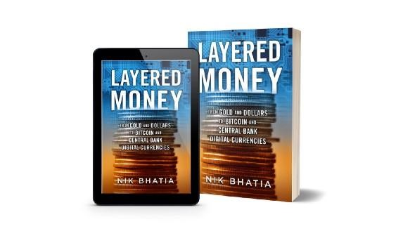

Por fin, mis mundos han chocado. No, no en la forma en que colisionaron por el malhechor social George Costanza, sino de una manera hermosa y armoniosa. La compañía de software MicroStrategy pronto emitirá un bono de $400 millones de dólares para comprar bitcoin solo unas semanas después de que convirtió $250 millones de dólares de sus reservas de tesorería a bitcoin. Y con eso, los mercados de bonos y el mercado de Bitcoin se fusionarán, y las dos carreras paralelas que he construido para mí de repente se convertirán en una.

### Bonos y Bitcoin

Pasé mi juventud aspirando a participar en los mercados financieros, aprendiendo a analizar gráficos y a observar tendencias lineales desde antes de mi adolescencia. Finalmente, en 2016 mi sueño se hizo realidad y me convertí en operador de bonos del Tesoro de Estados Unidos para un gestor de activos institucionales. Guié con seguridad enormes carteras de clientes dentro y fuera de posiciones en el activo “libre de riesgo” del dólar en nombre de mi antiguo empleador, negociando más de $100 mil millones teóricamente por año. Gran parte de ese volumen se produjo en bonos del Tesoro, que fueron tratados como “efectivo” en el balance de cada cliente institucional. Estos bonos del Tesoro (letras y notas del Tesoro con menos de 2 años hasta el vencimiento) carecían de riesgo cuantificable para nosotros y nuestros clientes porque [los bonos del Tesoro siguen siendo la forma más segura de almacenar dólares en un sistema dolarizado descompuesto](https://medium.com/@timevalueofbtc/various-writings-for-tantra-labs-b0b7ddae52d8). El volumen que negocié fue personalmente asombroso, pero existió simplemente porque las corporaciones, universidades y gobiernos tienen tanto dinero en efectivo, que **literalmente, no tienen otro lugar donde ponerlo**. La verdad no me importaba, el volumen que negocié con los bancos de inversión más grandes del mundo me dio acceso a algunas de las mentes más brillantes de Wall Street. Pero el gran volumen de dinero que se derramaba por el sistema financiero me llevó hacia un camino aún más importante: a la madriguera de conejo de Bitcoin. Un mundo antes desconocido para mí, que poseía una atracción gravitacional mucho más fuerte en mi curiosidad intelectual que cualquier otro mercado macroeconómico que había experimentado antes. Poco imaginaba yo que los bonos y Bitcoin se unirían por completo en la cadera sólo media década después.

### Nueva emisión corporativa

Una de las cosas más interesantes que vi durante mi tiempo en la mesa de negociación de renta fija fue la emisión masiva de bonos corporativos por una suma de miles de millones de dólares al año. Pero, ¿qué hacen esas corporaciones con todo ese efectivo una vez que emiten bonos? Hasta que estén listos para gastarlo en proyectos, investigación y desarrollo, o recompras de acciones, una gran parte del dinero termina en bonos del Tesoro y otros mercados de tasas de interés. Básicamente, tenía un asiento delantero en la ráfaga de la actividad del mercado de renta fija, que gira en torno a las nuevas emisiones corporativas. Las corporaciones y los bancos colocan coberturas constantemente a través de permutas de tasas de interés, permutas de divisas y mercados de futuros del Tesoro para administrar cuantitativamente su nueva expansión de balance. Esto finalmente nos lleva a MicroStrategy, que no necesitará cubrir su posición de tasa de interés en su nueva emisión, sino que necesitará comprar una enorme cantidad de Bitcoin.

### Anticipando los fuegos artificiales

[Cuando MicroStrategy imprima con éxito su emisión de deuda y tome la custodia de $400 millones a finales de este mes](https://www.bloomberg.com/news/articles/2020-12-07/microstrategy-to-raise-400-million-to-buy-even-more-bitcoin?sref=ieet9cdI), reforzará su posición de efectivo, que con orgullo denomina en bitcoin (BTC) en lugar de dólares (USD). **Lo que sigue podría ser la actividad de mercado más fascinante en la naciente** **historia de Bitcoin**. Mientras que la teoría económica y financiera tradicional sugiere que la noticia de una compra entrante de $400 millones de bitcoin en el mercado abierto ya ha sido incluida en el precio del mercado, la realidad podría contar una historia completamente diferente. Nunca antes en la historia de Bitcoin se había anunciado previamente una compra tan gigantesca, y nunca antes una ola de compras tan grande llegó al mercado de una vez. Incluso los partidarios más acérrimos de la “hipótesis del mercado eficiente” observarán con entusiasmo la acción subsiguiente del precio para **ver cómo se satisface una compra de 20.000 BTC mediante el suministro disponible (o no tan disponible) en las casas de cambio de Bitcoin**. Adquirirlo ciertamente ejercerá presión sobre el precio, independientemente de la opinión que uno tenga sobre la velocidad a la que los mercados se ajustan a las noticias.

Resulta incluso más interesante que el impacto en el precio de BTC/USD de la emisión de bonos de MicroStrategy es el vínculo entre los mercados de bonos y Bitcoin que, sin duda, florecerá como resultado. Así como los mercados corporativos de nueva emisión y permutas de tasas de interés están vinculados (un proceso llamado bloqueo de tasa [explicado aquí](https://www.investopedia.com/terms/t/treasurylock.asp)), la nueva emisión corporativa y los mercados de Bitcoin ahora lo estarán en el futuro. Las mesas de operaciones de banca de inversión se verán obligadas a ofrecer a los clientes productos financieros que permitan la cobertura y conversión de Bitcoin para los clientes que busquen replicar el esfuerzo de MicroStrategy. Al convertir un pasivo del balance (su oferta de bonos) en bitcoin como activo, la compañía apuesta a que el costo de los préstamos palidecerá en comparación con el valor temporal del dinero asociado con la tenencia de bitcoin. **Y el mundo estará observando para ver el resultado**.

### Dinero en capas

El poético y tremendamente entusiasta de Bitcoin, director ejecutivo de MicroStrategy, Michael Saylor, consideró al dólar como un instrumento de efectivo inferior a Bitcoin en una serie de tweets y apariciones en los medios durante los últimos meses para justificar la asignación. Podría ser el primer director ejecutivo de una gran corporación en participar en este tipo de asignación de reserva de tesorería, pero, definitivamente, no será el último. En mi próximo libro [Dinero en capas: desde oro y dólares hasta Bitcoin y Monedas Digitales de Bancos Centrales](https://www.amazon.com/dp/B08PS293NT/), examino cómo Bitcoin ya ha logrado legitimidad como moneda de reserva global y continuará llevando a corporaciones como MicroStrategy a un estado de dualidad de denominación de balance en el que las entidades mantienen efectivo denominado tanto en USD como en BTC. El precio de las acciones de MicroStrategy, denominado en USD, se ha transformado parcialmente en una expresión del precio BTC/USD en función de esta dualidad porque gran parte de sus activos se mantienen en Bitcoin. Este enigma dejará a los ejecutivos y a los responsables políticos rascándose la cabeza en los próximos años mientras intentan decidir **cómo denominar sus reservas**, especialmente si el precio de Bitcoin vuelve a sus raíces parabólicas.

Pasé este año entretejiendo mis dos mundos en uno solo porque la línea borrosa entre Bitcoin y la macroeconomía francamente desapareció en 2020. Hice esto escribiendo un libro sobre el sistema monetario internacional que incluye una visión del futuro con Bitcoin como centro. Bitcoin no reemplazará todas las monedas en este planeta, pero servirá como el activo de reserva de todas las monedas digitales, al igual que hoy sirve como moneda de reserva en el mundo de las criptomonedas. Los bancos centrales están a punto de lanzar sus propios competidores criptográficos, y los bancos ciertamente seguirán su ejemplo para mantenerse relevantes en el entorno monetario que cambia rápidamente. Pero todas las nuevas monedas digitales, tanto de los bancos centrales como de los bancos similares, eventualmente enfrentarán una liquidación final frente a BTC como la única moneda digital en nuestro planeta inmune a la manipulación de la oferta.
