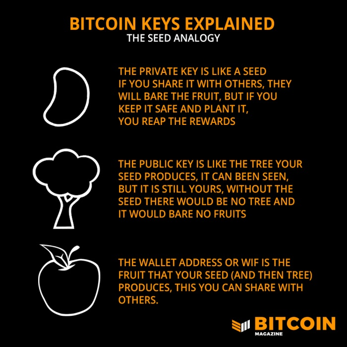
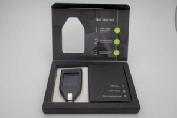
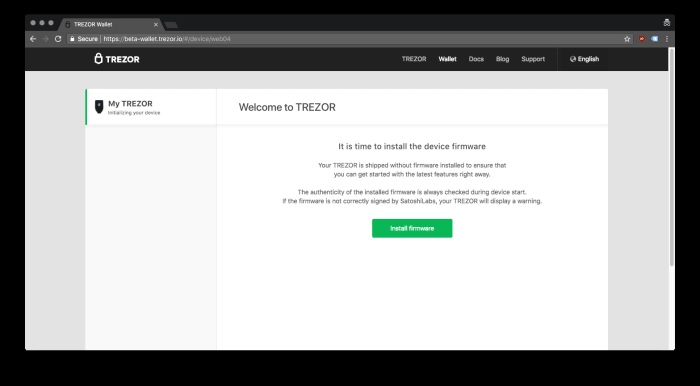
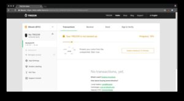
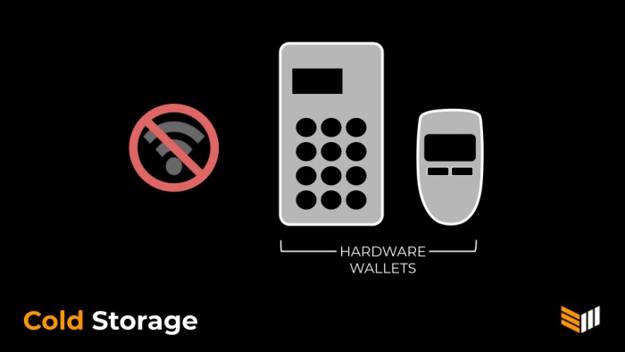
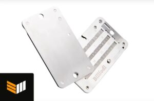

**Una guía para auto-custodiar bitcoin con billeteras físicas *(hardware wallets)* para principiantes.**

Bitcoin puede parecer confuso al principio, pero no tiene por qué serlo. Lo importante que debe recordar es: **No tienes la clave privada, no es tu bitcoin.**

Para poseer realmente tu bitcoin, debes guardarlo en una billetera donde controles las claves privadas, es decir, una serie única de números y letras asociadas con una dirección de bitcoin específica.

Recuerda: “no tus claves, no tus bitcoin”

### Claves de bitcoin explicadas

-   La analogía de la semilla *(seed)*
-   La clave privada es como una semilla,
-   si usted la comparte con otros, ellos
-   producirán frutos, pero si usted
-   la mantiene segura y la planta,
-   usted cosechará la recompensa
-   La clave pública es como el árbol que su
-   semilla produce, puede ser visto,
-   pero aún así es suyo, sin la
-   semilla no habría árbol y
-   éste no daría frutos

***“Una dirección de bitcoin deriva de una clave pública, y ésta se puede compartir con otros”*** 

A continuación, le indicamos cómo hacer eso con una billetera Trezor Model T, la cual está disponible en: [Bitcoin Magazine Store](https://store.bitcoinmagazine.com/collections/hardware/products/trezor-model-t)

**1\. Compre su billetera física**. El contenido de la caja del Trezor Model T es relativamente sencillo. Usted obtiene la billetera, el cable USB que lo acompaña para conectarlo a su computador, una guía de inicio, dos tarjetas de recuperación de semillas *(seed)* y un par de pegatinas.

Monedero de hardware Trezor disponible en la tienda Bitcoin Magazine

**2\. Conecte su billetera física a su computador e instale el software relacionado**. Conecte su billetera física a su computador, usando el cable USB, y vaya al sitio web oficial de Trezor (www.trezor.io/start) para descargar e instalar el software del dispositivo. Su dispositivo se inicializará automáticamente y comenzará a actualizarse con el software más reciente, y la billetera Trezor se abrirá en su computador.

Asegúrese de mantener el dispositivo enchufado todo el tiempo.

**3\. Cree una nueva billetera**. En la página de bienvenida, haga clic en Crear nueva billetera. Se generará una nueva billetera bitcoin y una ventana emergente le dará la opción de Continuar con la billetera.

**4\. Haga una copia de seguridad de su frase semilla o de recuperación**. Haga clic en el mensaje que aparece y su dispositivo se inicializará, mostrando su frase semilla de varias palabras. Escríbalo en una de las tarjetas incluidas para su custodia. Después de este paso, la billetera le pedirá que vuelva a escribir dos de las palabras al azar para asegurarse de que sean correctas. Asegúrese de guardar esta tarjeta en un lugar seguro, de lo contrario corre el riesgo de perder sus monedas. Asegúrese de mantener su billetera física conectada durante todo el proceso.

Proteja estas palabras y guárdelas en un lugar seguro.

**5\. Configure un PIN único para su dispositivo**. El dispositivo le pedirá que configure un número PIN como medida de seguridad adicional. Este es un número de entre cuatro y nueve dígitos, siendo el PIN más largo la opción ideal a seguir aquí. Evite cosas como los cumpleaños suyos o de sus seres queridos, “1234” o cualquier otra cosa que pueda ser fácil de adivinar por extraños.

Las billeteras físicas se denominan “almacenamiento en frío”  porque no siempre están conectadas a Internet.

**6\. ¡Explore su nueva billetera bitcoin!** En la página de la billetera, haga clic en “Recibir” y se mostrará una serie alfanumérica de dígitos; esta es su primera dirección de bitcoin. Asegúrese de anotar qué letras están en mayúsculas y cuáles en minúsculas. Ahora está listo para resguardar bitcoin durante los próximos años. (A veces, una dirección también se conoce como clave pública, aunque técnicamente la dirección se deriva de una combinación de la clave pública y *metadata*. Más detalles sobre eso a continuación).

### ¿Cuál es la diferencia entre las llaves privadas y públicas para una billetera bitcoin?

Bitcoin está clasificado como una criptomoneda, lo que significa que está protegido criptográficamente y a todas las computadoras del mundo les tomaría millones de años en descifrar. Las claves privadas son generadas por las palabras semilla que mencionamos anteriormente, que también se pueden usar para recuperar su bitcoin si alguna vez pierde esta billetera física. (Las claves privadas en sí mismas son series alfanuméricas más complicadas, pero generalmente pueden derivarse de 12 o 24 palabras. Es muy importante poner estas palabras en el orden correcto o no funcionarán para generar sus claves privadas). El nombre lo sugiere, esto es comparable a una contraseña y debe mantenerse en privado.

Por otro lado, sus direcciones de bitcoin (la mayoría de *apps* de billeteras y los dispositivos físicos generan varias direcciones) pueden verse como los “nombres de usuario” de su billetera de bitcoin. No es necesario que se mantenga en privado, pero es recomendable hacerlo. Compártalo solo con alguien que le envíe bitcoin.

La clave privada y la clave pública se utilizan para crear la dirección de su billetera, el identificador mencionado anteriormente en el sexto paso. Siempre asegúrese de verificar su dirección. Si usa las mayúsculas incorrectas o un pequeño error tipográfico, no recibirá bitcoin. La protección de su clave privada es la parte más importante del uso de bitcoin. ¡Ahora ya sabes cómo hacerlo!

El Billfodl Multishard es un dispositivo de almacenamiento de semillas de recuperación de acero inoxidable tipo dos de tres que le permite dividir su semilla en tres fragmentos.

Y, si desea almacenar sus claves privadas usando metal, en lugar de un cuaderno de papel, tenemos todos los gadgets que necesita en la tienda [***Bitcoin Magazine store***](https://store.bitcoinmagazine.com/collections/hardware).

¡Bienvenido al futuro del dinero digital!
