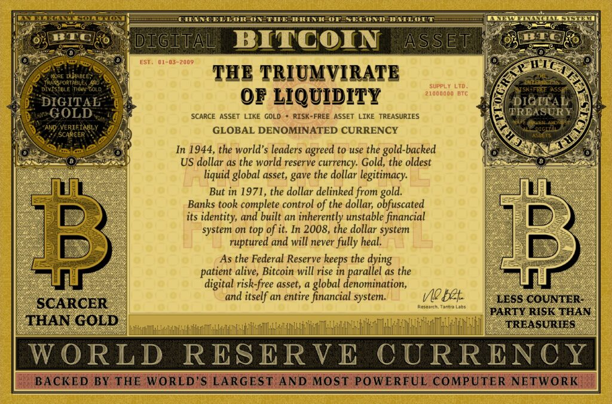
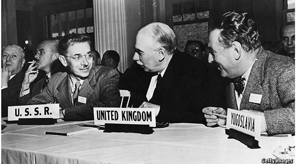
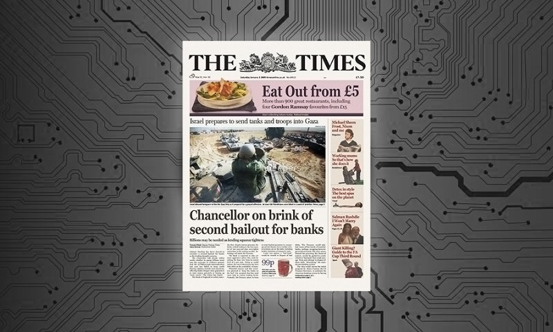

**Bitcoin es a su vez oro digital como bonos del Tesoro digitales, y lo tiene todo para ser el próximo activo libre de riesgo del mundo.**

Ilustración original por Lucho Polett

### Introducción

Los bonos del Tesoro de EE. UU., el oro y Bitcoin sirven como un triunvirato de la liquidez global, un poderoso trío de activos de refugio seguro que protegen a sus propietarios de los riesgos de nuestro sistema monetario altamente apalancado y basado en el crédito. De los más de $300 billones en activos financieros en todo el mundo, sólo $32 billones existen en este escalón de seguridad y liquidez.

Bitcoin capturó un sorprendente 1% del valor total de mercado del trío después de sólo ocho años de existencia, sin embargo, esto fue sólo un vistazo al futuro. En su próximo capítulo, Bitcoin se catapultará hacia el tamaño de $9 billones del oro, cumpliendo su destino como oro digital. Después de eso, Bitcoin se transformará en bonos del Tesoro digitales y los reemplazará como el activo libre de riesgo del mundo antes de alcanzar finalmente el estatus de moneda de reserva mundial. Reemplazar el dólar como moneda de reserva mundial es una ambición elevada, pero ocurrirá sólo como un subproducto de Bitcoin que incorpora bonos del Tesoro digitales.

### El oro fue la fuente de legitimidad del dólar

El oro es el activo global líquido original, un dinero milenario. El respaldo de oro del dólar estadounidense durante el siglo XX le dio legitimidad, que culminó con el acuerdo de Bretton Woods de 1944, en el cual los líderes mundiales asignaron el dólar como moneda de reserva mundial. A pesar de que el oro ya no es un ancla oficial de las finanzas globales, los bancos centrales aún lo atesoran como el activo refugio seguro del mundo, presumiblemente como un seguro contra una falla del sistema del dólar. Hoy en día, las tenencias de oro de los bancos centrales mundiales superan el billón de dólares.

Bretton Woods, New Hampshire, 1944

### Dólares, conoce los eurodólares

En la década de 1950, surgió una nueva forma de dólar en Europa llamada eurodólar, un dólar de asiento contable para facilitar la liquidación interbancaria fuera de los Estados Unidos y fuera del sistema bancario de la Reserva Federal. A medida que se popularizó el uso del eurodólar, los bancos de Londres, Zúrich, Montreal y Tokio ganaron el poder de crear la moneda de liquidación internacional lejos de cualquier ámbito regulatorio. En 1971, los reembolsos excesivos de dólares por oro habían agotado las reservas de los Estados Unidos. Con el fin de proteger sus tenencias del activo refugio seguro del mundo, Estados Unidos cesó todas las conversiones de dólar a oro, y el dólar perdió oficialmente respaldo. Sin embargo, todavía contaba con la confianza de los participantes financieros mundiales como su unidad de cuenta final.

### Bonos del Tesoro, no dólares

Los dólares ya no estaban respaldados por activos libres de riesgo, entonces, ¿cómo almacenaban los inversionistas las reservas en dólares de forma segura? Los depósitos bancarios son esencialmente préstamos a los bancos y conllevan una cantidad excesiva de riesgo de contraparte. Retirar camiones cargados de billetes de $ 100 tampoco es factible, ni viene con la convertibilidad a un activo subyacente. Los depósitos y el efectivo simplemente no son inversiones agradables para la aversión al riesgo. La solución y la tendencia del mercado de capitales es comprar bonos del Tesoro de Estados Unidos, un mercado de 23 billones de dólares, para almacenar dólares de forma segura.

### El dólar pierde su identidad

De 1971 a 2007, los bancos tomaron el control total del dólar, alteraron su identidad y construyeron un sistema financiero inherentemente inestable sobre él. Los eurodólares crecieron tanto en oferta como en sofisticación. Los bancos dejaron de financiarse a sí mismos con depósitos; en su lugar, utilizaron bonos del Tesoro de los Estados Unidos como garantía para tomar prestados dólares entre sí. Una licencia bancaria y los bonos del Tesoro de EE. UU. juntos tenían el poder de crear dinero aparentemente ilimitado, oscureciendo la definición misma del dinero. El dólar perdió toda la identidad que alguna vez tuvo como reclamo de oro y se convirtió simplemente en un pasivo bancario, un préstamo para el sistema financiero excesivamente apalancado. En lugar de dólares, los bonos del Tesoro se convirtieron en el activo global más deseable, no solo por la superioridad de la contraparte del gobierno estadounidense, sino también porque los bonos del Tesoro poseían poderes colaterales omnipotentes que permitían la creación de dinero. Los bancos utilizan los bonos del Tesoro de los Estados Unidos, no los dólares, como su activo libre de riesgo, su ancla de garantía y su principal vehículo de apalancamiento.

### El sistema del dólar se quiebra en 2007

En 2007, los bancos comenzaron a enfrentar la presión de financiación. La cultura anterior de préstamos garantizados de tipo *“strike-of-the-pen”* (huelga de la pluma) se desvaneció y los bancos no pudieron prorrogar su deuda vencida. Los bancos confiaban en su capacidad para emitir constantemente nuevas deudas, y cuando la confianza en ellos flaqueaba, también lo hacía la solvencia.

Durante décadas, la relación entre dólares y eurodólares existió sin mucho drama; Los Fondos Federales y LIBOR, la tasa de interés de cada tipo de dólar, en su mayoría se reflejaba entre sí. En agosto de 2007, sin embargo, LIBOR aumentó en relación con la tasa de los fondos federales, una señal de riesgo crediticio agudo en el sistema de eurodólares. En retrospectiva, el problema no era agudo: los bancos comenzaron a alejarse unos de otros cuando el sistema global del dólar había alcanzado un punto de inflexión. Esta divergencia en las tasas de interés presagió la subsecuente cascada de déficits de financiamiento en dólares y colapsos bancarios. La carrera libre de creación de dinero de varias décadas se había agrietado irrevocablemente.

En 2008, la Reserva Federal rescató al mundo liquidando todo el sistema. Optó por no discriminar entre pasivos en dólares y pasivos en eurodólares, y proporcionó un salvavidas a cualquier banco o banco central que lo necesitara inyectando reservas en el país y proporcionando permutas de divisas en el extranjero. La demanda por la seguridad y liquidez de los bonos del Tesoro de Estados Unidos se disparó cuando se convirtieron en el manto de seguridad del mundo, atrapando al mundo en una denominación en dólares a pesar de que la viabilidad a largo plazo del dólar como moneda de reserva mundial estaba irrefutablemente en duda.

### Deterioro permanente

El sistema financiero está infectado con una enfermedad crónica que no desaparece. El dólar ya no es únicamente la moneda nacional de los Estados Unidos emitida por la Reserva Federal. En cambio, el dólar es un instrumento bancario internacional sin límites, forma o capacidad para sostenerse. El sistema decae a medida que las contracciones de los pasivos interbancarios provocan repetidas escaseces de liquidez para los titulares de activos apalancados. Los bancos optan por no proporcionar liquidez colateralizada a otros bancos, incluso cuando la garantía son los propios bonos del Tesoro. Esta es la última señal de advertencia de que los bancos ya no confían el uno en el otro. Además, la Reserva Federal siempre rescata al sistema como prestamista de última instancia, eliminando permanentemente cualquier motivación para que los bancos se proporcionen liquidez entre sí. La respuesta predeterminada de la Reserva Federal es crear reservas bancarias en dólares estadounidenses, pero esto no resuelve el problema central del quiebre de la confianza interbancaria. La Reserva Federal sólo proporciona un mecanismo de adormecimiento, manteniendo vivo al paciente moribundo el mayor tiempo posible.

### Bitcoin es oro digital y bonos del Tesoro digitales

¿Cuál es el final del juego? Bitcoin lo es. Su software está grabado con “Chancellor on the Brink of Second Bailout” (Canciller al borde del segundo rescate) para proclamar una elegante solución a la pesadilla de nuestro sistema bancario. Bitcoin es un activo al portador como el oro, un activo libre de riesgo como los bonos del Tesoro y una denominación de moneda como el dólar, que se eleva en paralelo durante las próximas dos décadas como infraestructura para el próximo sistema financiero.

El artículo de periódico original al que se hace referencia en el bloque génesis de Bitcoin

El oro y Bitcoin son activos escasos sin riesgo de contraparte, aunque la funcionalidad de liquidación final digital de Bitcoin le da una ventaja masiva sobre el oro en las próximas décadas. Sin embargo, Bitcoin no es sólo oro digital, sino también bonos del Tesoro digitales. Bitcoin es el refugio seguro de todos los demás activos digitales, al igual que los bonos del Tesoro son el refugio seguro de todos los demás activos en dólares. Bitcoin se utiliza como garantía para acuerdos de derivados al igual que los bonos del Tesoro. Pero Bitcoin no tiene el riesgo de contraparte o la variabilidad de oferta de los bonos del Tesoro, lo que lo coloca perfectamente para la próxima competencia.

Bitcoin es el activo libre de riesgo del futuro.

### El anti-Bretton Woods

El sistema monetario de Bretton Woods estableció el dólar como moneda de reserva mundial en 1944, pero el próximo sistema monetario no será determinado por acuerdo entre naciones. El camino de Bitcoin al estado de moneda de reserva mundial ocurrirá un titular de activos a la vez. Gracias a la etapa inicial de [Lightning Network](https://medium.com/@timevalueofbtc/the-bitcoin-second-layer-d503949d0a06), el diseño de Bitcoin ahora incluye una función de moneda de liquidación instantánea, además de su función de activos más lenta, una característica que ni los bonos del Tesoro ni el oro poseen. Pero Bitcoin primero necesita añadir muchos billones en valor de mercado para competir verdaderamente con los bonos del Tesoro y el oro como clase de activo.

### La incertidumbre exige liquidez

Los inversionistas exigen activos libres de riesgo cuando se enfrentan a la incertidumbre geopolítica y económica. Asegurar la liquidez de estos activos es primordial cuando otras clases de activos experimentan la combinación brutal de mayor riesgo de rendimiento y deterioro de la liquidez que es tan común en el mundo financiero actual. En esta era de fragilidad del sistema del dólar, el Triunvirato de Liquidez reinará supremo. Los inversionistas lucharán por la seguridad financiera, lo que provocará una demanda intensa y persistente de bonos del Tesoro de EE. UU., oro y Bitcoin.

Empiece [aquí](https://www.vanderbilt.edu/wp-content/uploads/sites/78/Fowler_The-Monetary-Fifth-Column-The-Eurodollar-Threat-to-Financial-Stability-and-Economic-Sovereignty.pdf) y [aquí](https://www.macrovoices.com/edu) para sumergirse en la madriguera del eurodólar.
