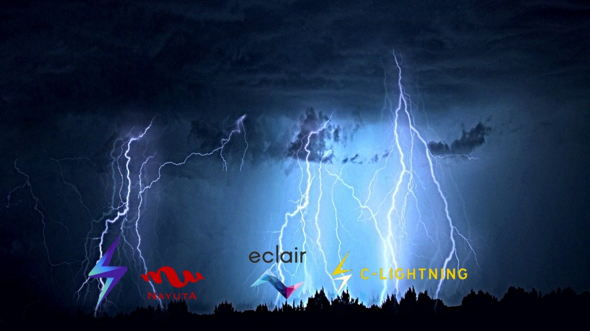

Como la segunda capa de Bitcoin, la Red Lightning contiene muchas mejoras. Cuenta con pagos instantáneos, cuyo rendimiento puede competir con Visa; y lo más importante, es muy privada. También puede hacer todo lo que las altcoins como Ethereum ya hacen (NFT, DeFi, uso de tokens y contratos inteligentes avanzados), pero de una manera más sofisticada y rentable.

Sin embargo, contando con diversas ventajas, muchas personas no se incorporan a la Red Lightning, simplemente porque no entienden qué es, cómo funciona y cómo deberían participar.

Para facilitar la comprensión de todos, intentaré explicar la terminología esencial utilizando ejemplos prácticos y analogías. Si tiene más de 10 años, lo entenderá.

### Necesitas su propio nodo en Bitcoin y Lightning

En primer lugar, para ejecutar la red Lightning, se tendrá que correr un nodo propio. Vivimos en un mundo descentralizado, haciendo nuestro mejor esfuerzo para elaborar productos y servicios sin participación de terceros. Idealmente, se debería comprar hardware dedicado para un nodo, ya que tiene soluciones prediseñadas como:

-   RaspiBlitz: se encuentra en el mercado por $350 y se distribuye en [Europa](https://shop.fulmo.org/product/raspiblitz-v1-7-heatsink-case/) y [Estados Unidos](https://lightninginabox.co/product/raspiblitz-raspberry-pi-lightning-node/).
-   MyNodeBTC: tiene un costo aproximado de $339, se pueden adquirir [en su tienda](https://mynodebtc.com/products/one).
-   Nodl: posee un costo de $529 y puede adquirirlo [en su tienda](https://shop.nodl.it/en/home/50-nodl-one.html).
-   Start9 Labs Embassy: su valor es de $289, no incluye el disco duro y [puedes comprarlo en su tienda.](https://store.start9.com/collections/embassy)  

Si desea reducir gastos y completar un proyecto de fin de semana estilo hágalo-usted-mismo, puede comprarse una RaspBerry Pi 4B con una RAM de 4GB, una SSD de 1 TB de cualquier tipo (aunque debería ser una marca confiable). Una tarjeta SD de 32 GB, un estuche de disipador de calor para mantener su RaspBerry Pi fresca durante las temporadas de verano y los procesos que requieren muchos recursos, y algunos cables. Vea este tutorial paso a paso de Ben Arc para comprender mejor lo que se debe hacer para ejecutar [RaspiBlitz](https://bitcoin-takeover.com/unboxing-review-fulmo-raspiblitz-hyperbitcoinized-2021-calendar/).

Si no se desea comprar un dispositivo dedicado, existen al menos dos formas populares de ejecutar un nodo Lightning en su computadora. El más avanzado implica el uso de la cartera Electrum, y la opción más básica y fácil de usar, lo llevará por el camino de Linux con Umbrel. Si se está preparando para un desafío mayor, también puede ejecutar RaspBerry Pi OS en una computadora con sistema operativo Windows o Mac, si no, recurrir a máquinas virtuales.

La recomendación es ejecutar en un dispositivo dedicado se refiere a razones de eficiencia y seguridad, la RaspBerry Pi es muy eficiente en el consumo de energía y respetuosa con el medio ambiente (solo le costará un par de dólares al año mantenerla funcionando las 24 horas del día y los 7 días de la semana) y un dispositivo que realice la tarea, tiene una superficie de ataque menor que algo que se utiliza para abrir correos electrónicos, instalación de software en terceros y acceder a páginas web dudosas.

Se puede obtener una RaspBerry Pi para ejecutar un nodo. No es muy accesible en estos momentos, pero solo mejorará con el tiempo a medida que la tecnología envejezca y obtengamos hardware más rápido e innovador.

### Los nodos Lightning son islas y los Canales son carreteras

Un error común sobre la red Lightning es que ejecutar un nodo es suficiente para conectarse con el resto de la red. Aunque el nodo es un requisito previo y esencial, el siguiente paso es un viaje que implica abrir canales con personas.

Para entender mejor el concepto, piense que el nodo es como una isla que acaba de emerger en medio del océano. El objetivo es poder construir carreteras con todas las personas con las que se realizará transacciones. Más carreteras significarán que tendrá más conexiones y mejores atajos para llegar a distintos destinos.

El tamaño de los canales también importa, ya que permiten realizar transacciones más grandes. Es como si su puente a otra isla solo permitiera que viajen vehículos de cierto peso (cuanto más resistente sea el puente, más peso puede soportar durante un viaje).

Estos caminos van en ambas direcciones: se puede construir con otras islas (esto aumenta tu capacidad de envío) u otras islas pueden construirlos contigo (esto aumenta tu capacidad de recepción). Una isla bien conectada necesitará ambas direcciones.

Al enviar dinero a cualquier isla del mapa, tomará alguna de las carreteras existentes. Si tiene una ruta directa, entonces todo es sencillo y puede realizar una transacción de acuerdo con el tamaño de su canal. Pero si ustedes dos están conectados por la carretera de otra persona, entonces deben pagar una tarifa de ruta (básicamente un peaje de tránsito).

Lo ideal sería abrir los canales con todos los nodos de la red para tener conexiones directas, pero eso es poco práctico e imposible de lograr a gran escala. Cuando millones de bitcoiners abrirán al menos un canal cada día, será difícil tener los fondos, el tiempo y la energía para mantenerse al día con el crecimiento de la red Lightning. Pero el enrutamiento es muy eficiente y también tiene algunos beneficios de privacidad (al igual que el caso de la red Tor) cada nodo de retransmisión agrega una capa adicional de cifrado y anonimato.

Si construye carreteras, también puede cobrar tarifas a quienes usan la infraestructura para llegar al destino. Ser un intermediario para otras transacciones puede tener beneficios financieros, y la mayoría de los administradores de carteras Lightning le permiten elegir cuánto desea cobrar de aquellos que usan su ruta. Solo tenga en cuenta que, en general, se elige la carretera más corta, rápida y menos costosa. Entonces, a menos que conecte algunas islas oscuras que otros ignoran, debe pensarlo dos veces antes de establecer una tarifa alta. A escala, estas pequeñas ganancias deberían subsidiar los costos de electricidad involucrados en el funcionamiento del nodo.

Los administradores de la red Lightning como RTL (Run the Lightning) le permitirán abrir canales privados. Esto significa que solo el usuario y el nodo con el que ha construido un puente pueden ver y utilizar esta pieza de infraestructura. Si bien tiene algunos beneficios de privacidad (nadie más lo sabrá), tampoco destina otras transacciones, por lo que realmente no es compatible con la red y no le generará tarifas de destinos.

El tamaño de tus canales (o la resistencia al peso de las carreteras) no es permanente y se puede recurrir al reequilibrio para poder ampliar o reducir capacidades. Se van a pagar tarifas por la operación, pero es saludable vigilar las operaciones en curso y volver a priorizar según tu observación. Una mayor popularidad y uso pueden beneficiarse de una mejor capacidad.

Por último, pero no menos importante, recuerde que los canales son más fáciles de desmontar que las carreteras. Con solo hacer clic en un botón, puede cerrar el canal y devolver los fondos a la capa base de Bitcoin. Cada vez que abre un canal, paga una tarifa de transacción a los mineros de BTC, y hace lo mismo cuando cierra canales. Para evitar pagar de más por estas operaciones ([consulte mi guía sobre cómo pagar tarifas de transacción más bajas](https://bitcoin-takeover.com/how-to-pay-lower-bitcoin-transaction-fees-full-guide/)).

### Los clientes de Lightning: LND, c-lightning, eclair y Nayuta

Al igual que las carreteras se pueden construir con diferentes materiales que tienen sus pros y sus contras, el cliente de referencia Lightning también tiene cuatro versiones que tienen sus pros y sus contras. Históricamente, LND de Lightning Labs es la implementación más popular y también la que utilizan los sistemas operativos de nodo RaspBerry Pi (con la excepción de la Embajada de Start9 Labs, que también viene con c-lightning). Gracias al amplio espectro de aplicaciones y efectos de red, es el más amigable para los usuarios sin experiencia.

El c-lightning de Blockstream es más refinado y mejor para los desarrolladores, y está construido en el lenguaje de programación C (de ahí el nombre). Sin embargo, tiene menos aplicaciones y es utilizado principalmente por intercambios y servicios que necesitan más confiabilidad. También está diseñado para permitir intercambios astronómicos entre activos en la cadena lateral Liquid de Blockstream y BTC Lightning. Esto puede ser útil si desea realizar un *peg-out* sin utilizar los servicios KYC de una casa de cambio de la Federación Liquid. Si LND es como Windows, entonces c-lightning es una distribución de Linux robusta que no es muy amigable con los usuarios sin conocimientos técnicos.

El eclair de ACINQ también es una opción popular, ya que está escrito en Scala y es compatible con los complementos de Java y Java Virtual Machine. Dado que muchas aplicaciones del sistema operativo Android están escritas en Java, esta implementación es muy útil para carteras móviles. Phoenix y Eclair son dos de las carteras móviles más populares, y definitivamente deberían probarlas.

Por último, pero no menos importante, tenemos a Nayuta, una empresa japonesa que comenzó a trabajar en un cliente Lightning tan liviano que incluso una RaspBerry Pi Zero puede operarlo. Recientemente, lanzaron una versión alfa de Nayuta Core y también se enfocan en el desarrollo de carteras móviles.

### La forma más fácil de domar la Lightning 

Deberían ejecutar su propio nodo y hacer todo según las reglas. Pero si solo quieres sumergirte en lo que es Lightning y cómo funciona, puedes probar una cartera móvil como Blue Wallet, Breez o Eclair.

Blue Wallet se lleva la palma por tener la mejor experiencia de usuario de todas las carteras bitcoin que existen. También es muy personalizable, lo que le permite conectarse a su propio nodo o confiar en la infraestructura de la empresa. Y si desea recibir un pago Lightning, instale la aplicación en su teléfono, genere una factura por el monto que desea recibir y luego quédese sin aliento por la velocidad de la transacción.

Blue también tiene una versión de escritorio, siendo una de las formas más convenientes de comenzar a usar la red Lightning.

Breez Wallet es especial porque abre un canal para ti. Después de depositar fondos y esperar al menos 3 confirmaciones de red, estará listo para empezar a operar. Es admirable el hecho de que esta sencilla experiencia de usuario se produzca sin custodia, lo que refuerza su soberanía. No se puede comparar con su experiencia de un nodo completo, pero facilita las ventajas de Lightning con algunas compensaciones elegantes.

Luego está Eclair Mobile de ACINQ, que ejecuta una versión ligera de un nodo Lightning directamente de un teléfono móvil. También se puede conectar a un nodo completo accediendo a la configuración avanzada, pero incluso de forma predeterminada es excelente para la soberanía financiera. Hubiera sido fenomenal si también estuviera disponible en iOS, pero esto podría deberse a las limitaciones de Apple.

Si tiene una tarjeta SD lo suficientemente grande puede ejecutar el nodo de validación completo en el teléfono.

Si está buscando una manera de recibir sus primeros fondos en la red Lightning sin mucho esfuerzo, puede registrarse en los servicios de pago y propinas en las redes sociales como Tippin.me y Bottle Pay. Y si tiene algunos fondos de la red Lightning que necesite convertir a bits en la cadena principal de Bitcoin y no tiene canales para cerrar porque tiene la custodia total, pruebe un servicio como ZigZag.
