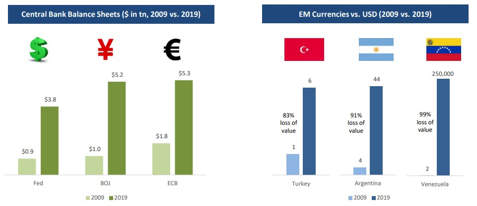

### Introducción 

Este es el primer texto de una serie semanal que decidí escribir acerca de Bitcoin, inspirado por mis amigos [Marty Bent](https://tftc.io/) y [Saifedean Ammous](https://saifedean.com/). La educación es un aspecto crítico de Bitcoin y espero que, al destilar mis propios pensamientos, pueda ayudar a otros a acelerar su camino en la comprensión de este complejo tema. He titulado la serie *Gradualmente, Luego de Repente*. Como Hemingway escribió en el proceso de ir a la quiebra, también es la forma en la que las monedas respaldadas por los gobiernos se hiper inflan y a menudo es la forma en que las personas llegan a entender Bitcoin (gradualmente, luego de repente). Los escritos generalmente se apegarán a Bitcoin, pero también incluirán al Sistema de Reserva Federal y a la economía monetaria, ya que estas historias están profundamente entrelazadas. Como trataré de mantenerme conciso, la serie comunicará mis conclusiones y opiniones principales en lugar de presentar cada detalle que lleva a ellas; mi intención es proveer conocimiento de mi proceso de pensamiento y brindar una hoja de ruta en caso de que otros estén interesados en aprender más. Mi esperanza es llegar a una amplia audiencia (más allá de aquellos que han sido formativos en mi propio viaje) y ayudar a muchachos en la periferia a adquirir un mejor entendimiento de por qué muchos de nosotros estamos tan enfocados en Bitcoin como un asunto de importancia. Los puntos de vista presentados son expresamente míos y no de Unchained Capital o de mis colegas. Espero que los disfruten, y por favor envíen sus comentarios.

### Bitcoin es dinero

O en realidad, el Bitcoin se ha convertido en dinero (para mí). Ha sido un proceso lento que involucró desbloquear un gran número de bloques mentales a lo largo del camino, pero empezó preguntando ¿qué es el dinero? Ese es el comienzo de una verdadera madriguera del conejo. Y no del tipo especulativo; el tipo de madriguera de conejo que estoy buscando tiene el boleto de lotería “blockchain-va-a-cambiar-el-mundo”. A nivel basal, es la madriguera de conejo la que intenta responder la pregunta “¿por qué el dólar en mi bolsillo es dinero?” ¿Por qué cientos de millones de personas intercambian su valor del mundo real, arduamente ganado, por esta pieza de papel (o representación digital)? Es tanto una pregunta difícil para hacer y una más difícil para responder; descubrí que todos tienen que acercarse a su manera, a su propio tiempo, y guiados por sus propias experiencias de vida. Las personas tienen que interesarse en esa pregunta para siquiera empezar a entender Bitcoin. 

> ***“¿Qué es el dinero? Ese es el principio del verdadero agujero de conejo”***

Para mí, el camino involucró primero entender por qué el oro era dinero. Eso implicó entender las propiedades únicas que hacen que algo sea una mejor o peor forma de dinero y qué diferenció al dinero como un bien económico único comparado con la mayoría de otros tipos de bienes económicos. El Estándar de [Bitcoin](https://saifedean.com/the-book/) fue formativo para mí al explorar estas preguntas, no como un evangelio sino en cambio como una base para pensar sobre el enunciado del problema. Cuando yo apliqué esa base a mis propias experiencias de vida y a mi propio entendimiento del sistema financiero existente, y a sus defectos, solo ahí empezó a volverse intuitiva. Y eso es algo que puede parecer evidente (que Bitcoin es intuido como dinero) para aquellos que han gastado años pensando en él en relación a los principios monetarios; pero también es cierto que Bitcoin no es intuitivo. Es extremadamente anti-intuitivo hasta que se vuelve intuitivo y luego con el tiempo se convierte en súper intuitivo.

Como parte de mi proceso, encontré de gran ayuda considerar a Bitcoin en relación a dos postes guía tangibles: el oro y el sistema financiero del dólar. ¿*A* (Bitcoin) comparte las propiedades de *B* (tanto oro como el dólar, respectivamente)? ¿Es *A* mejor que *B*? Porque lo que hace que algo sea dinero no es un absolutismo; es una elección entre almacenar valor en un medio en vez de en otro, siempre involucrando compensaciones. Sin entender las fallas del sistema financiero existente (sea del dólar, euro, yen, bolivar, peso, etc., respectivamente) yo jamás podría haber llegado a que Bitcoin sea dinero en el vacío.

Mientras trabajé en el Banco Alemán durante la crisis financiera, no tenía ninguna base para entender qué era lo que realmente estaba pasando. Diez años después, y habiendo trabajado en el mundo de la reestructuración y en un fondo de cobertura macro, solo ahí empecé a desarrollar una comprensión más clara de lo que realmente había pasado en 2008 y 2009. A través de mi propia investigación de la gran crisis financiera, el Sistema de Reserva Federal (FED) y específicamente el impacto de la flexibilización cuantitativa (*Quantitative easing o QE,* [ver aquí](https://www.unchained-capital.com/blog/enders-game/)), llegué a la conclusión principal de que el problema causal fue que el sistema financiero había sido apalancado aproximadamente 150 a 1 (demasiada deuda y muy pocos dólares) y que ese increíble grado de apalancamiento solo fue posible en función de la política de la FED que había impedido sistemáticamente el desapalancamiento de todo el sistema a lo largo de las tres décadas previas a la crisis. Más aún, se hizo evidente que la solución (la flexibilización cuantitativa) simplemente provocó la metástasis de un sistema crediticio insostenible durante los diez años siguientes, lo que hizo que la futura flexibilización cuantitativa fuera inevitable. Me convencí de que, tanto si el Bitcoin sobrevive como si no lo hace, el sistema financiero existente está funcionando con tiempo prestado y que de una forma u otra, el camino inevitable a seguir será algo diferente al *status quo*.

> ***“Se hizo evidente que la solución (la flexibilización cuantitativa) simplemente provocó la metástasis de un sistema crediticio insostenible durante los diez años siguientes, generando de forma inevitable una flexibilización cuantitativa futura”***

Luego descubrí que Bitcoin tiene un suministro fijo. Comprender cómo y por qué esto es posible es la base de entender a Bitcoin como dinero. Hacerlo requiere una inversión personal significativa en la comprensión de cómo los incentivos económicos están tejidos juntos con la arquitectura técnica de Bitcoin y por qué Bitcoin no puede “falsificarse” o copiarse (o mejor, por qué los incentivos para cooperar son tan fuertes y por qué el costo de oportunidad de ir en contra es tan alto). Es un camino largo, pero en última instancia, lo llevará a uno a comprender que una red global de actores económicos racionales, que operan dentro de un sistema monetario voluntario y optativo, no formaría de manera colectiva y abrumadora un consenso para degradar la moneda que todos tienen de forma independiente y voluntaria decididos a usarla como depósito de riqueza. Esta realidad (o sistema de creencias), entonces, apuntala y refuerza los incentivos económicos de Bitcoin, la arquitectura técnica y el efecto de red. 

Así que no es simplemente que el código de software determina que solo habrá 21 millones de Bitcoin; es la comprensión de por qué la política monetaria es creíble y resiliente y cómo Bitcoin logra una escasez verificable. Esto no puede suceder de la noche a la mañana para ningún individuo. Uno no se lo puede explicar a alguien en una fiesta de cócteles. Es una realidad que se refuerza y fortalece con el tiempo sólo al experimentar la estructura de los incentivos y al verla funcionar una y otra vez, cada 10 minutos (en promedio). Cuando luego se compara con el funcionamiento del sistema del dólar, o incluso los fundamentos del oro, Bitcoin como dinero se vuelve más intuitivo. 

> ***“Bitcoin existe como una solución al problema del dinero que es la flexibilización cuantitativa global”***

En resumen, cuando se trata de entender a Bitcoin como dinero, debes comenzar con el dinero, el dólar, la Reserva Federal, la flexibilización cuantitativa, y por qué el suministro de Bitcoin es fijo. El dinero no es simplemente una alucinación colectiva o un sistema de creencias; hay rima y razón. Bitcoin existe como una solución al problema monetario que es la flexibilización monetaria global y si tú crees que el deterioro de la moneda local en Turquía, Argentina o Venezuela nunca podría pasarle al dólar estadounidense o a una economía desarrollada, ten en cuenta que simplemente estamos en un punto diferente de la misma curva. Bitcoin representa una estructura fundamentalmente diferente y un camino hacia adelante más resiliente, pero tienes que entender dónde hemos estado y cómo llegamos aquí para saber a dónde estamos yendo. 

Hayek escribe sobre el mecanismo del precio como el mayor sistema de distribución de conocimiento en el mundo ([El Uso del Conocimiento en Sociedad](https://www.kysq.org/docs/Hayek_45.pdf)). Cuando el suministro de dinero es manipulado, se distorsionan los mecanismos de precios el cual luego comunica “mala” información a través del sistema económico. Cuando la manipulación se sostiene durante 30-40 años, se crean desequilibrios masivos en la actividad económica subyacente, que es donde nos encontramos hoy en día. En última instancia, el fracaso del oro fue el dólar y el fracaso del dólar es la distorsión económica que lleva a, y ha sido exacerbada por, la flexibilización cuantitativa. La promesa de Bitcoin es la solución a ambas. Dado que el suministro de Bitcoin es fijo y no puede ser manipulado, eventualmente se convertirá en el mecanismo de precio más confiable del mundo y consecuentemente, el mayor sistema de distribución de conocimiento. La volatilidad presenciada hoy no es más que el camino lógico del descubrimiento de precios a medida que el uso de Bitcoin aumenta en órdenes de magnitud y a medida que avanzamos hacia ese estado futuro de adopción total.

“Los economistas establecidos se burlan del hecho de que Bitcoin es volátil como si pudieras ir desde algo que no existía a una forma estable de la noche a la mañana; es completamente ridículo”
