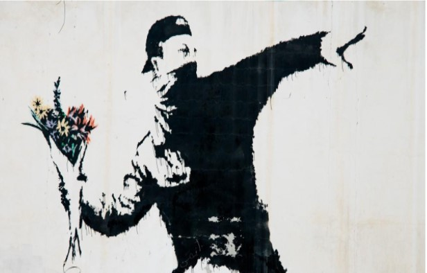
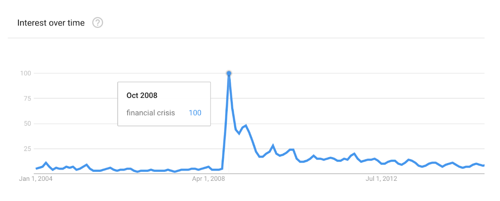
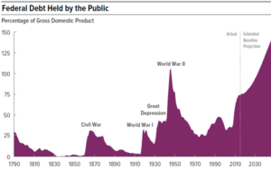
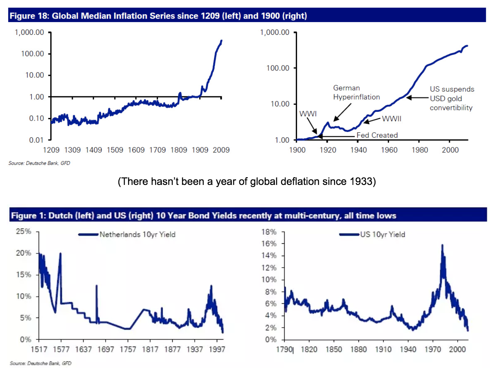
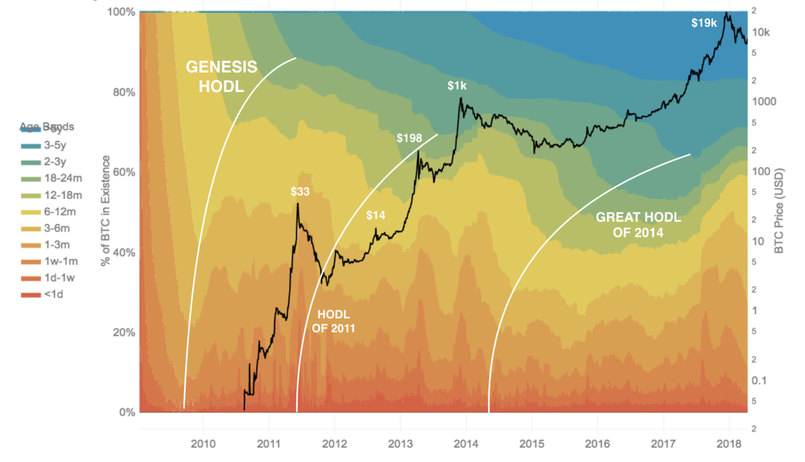

Mis reflexiones en cuanto al rol importante de los hodlers  juegan en el desarrollo de la red de Bitcoin ( y otras redes de criptomonedas)

> “En el principio de un cambio  el patriota es un hombre con heridas y valiente, y odiado y repudiado. Cuando su causa  es un éxito, los tímidos se unen al el, para ellos no costó nada ser un patriota”.
> 
> – Mark Twain

Satoshi publicó el White Paper de Bitcoin el 31 de octubre del  2008, un mes  después del colapso de Lehman Brothers  envió un terremoto a todo el sistema financiero. Bitcoin fue un origen en un tiempo absolutamente necesario. La confianza estaba siendo perdida en un mundo que funciona sobre la confianza.

> *“La raíz del problema de la divisa convencional es  toda la confianza que requiere para que esto funcione. Los bancos centrales deben ser confiables. no para depreciar la moneda, pero la historia de las monedas FIAT esta llena de brechas de confianza. Bancos  deben ser confiables para  tener nuestro dinero y transferirlo electrónicamente, pero ellos dejan esto en olas de créditos burbujas con una  fracción en reserva”.*
> 
> *– Satoshi Nakamoto*

A través de la intervención de los bancos centrales durante la crisis financiera los mercados se volvieron increíblemente distorsionados, con riesgos- recompensas  las más inusuales esto ha sido grabado en la historia sobre› 9 T de bonos de  trad con negativos rendimientos.

Lo que fue único de este periodo  es que nunca antes en la historia observable haya tantos países   hayan tenido periodos largos  excedentes sostenibles. Por ejemplo, los estados  han tenido un déficit sobre 40 de los últimos 44 años ( incluido 2012)

### ¿Cómo piensas que esto juega afuera?

Antes del siglo 20, la gente ordinaria podía siempre cargar moneda fuerte ( oro) para salvarse ellos mismos de los efectos de las fallidas políticas inflacionarias de los bancos centrales. Esto terminó en el mundo cuando el oro fue prohibido- Viyay Boyapati

Nunca antes se había observado en la historia de que  varios países se salieran  del sistema del precioso metal por tanto tiempo. La caída del estándar del oro en  1971 ayudó a crear las condiciones para un sistema de crédito y deuda ilimitado. que sería inviable a través de los años de la historia económica.

> *“Así que tras 41 años  de moneda fiat globales y un imparable aumento de deuda  esto ha probado mucha dificultad para cambiar, nosotros realmente nos estamos aventurando a lo desconocido”.*
> 
> *– Jim Reid*

Bitcoin fue creado para construir un nuevo sistema financiero, uno que no requiera confianza, el cual esté adherido a los principios del  dinero sano. Entonces, ¿ el dinero sano importa?

Dinero es la herramienta que usamos para asignar preferencias de consumo.   Teniendo un target y eficientes maneras de relacionar demandas del consumidor, los productores pueden concentrar sus esfuerzos a través de bienes y servicios que  el mercado necesite. Dinero musical facilita esto. Con dinero sin sonido el mercado pierde la  habilidad de relacionar esta demanda para producir. Esto explica por qué el socialismo- Economía central del mercado simplemente no puede funcionar. La mano invisible es un mecanismo muy profundo y poderoso para replicarlo artificialmente. Dinero sonido es el  catalizador para maximizar la división del trabajo a través de una máxima eficiencia en la comunicación  financiera.

> *“Otra vez y otra vez  de nuevo , el sistema financiero está, en una dirección narrativa, desacreditada… la rebelión de la  juventud americana contá la cultura del dinero nunca ocurrirá”.*
> 
> *– Big short*
> 
> The Held Report

Bitcoin explicado sencillamente.  Unió a más de 140.000 inversores y traders quienes siguieron a Dan.

[danheld.substack.com](https://danheld.substack.com/)

Satoshi construyó Bitcoin  para los creyentes en un nuevo sistema financiero, the hodlers, los revolucionarios. Los únicos  que querían desfranquiciarse del sistema financiero existente. Los únicos que se sentían atraídos por una propuesta espectacular e inesperada  de cambio en sus vidas.

En este sentido, es más típico que un metal precioso, inclusive en la cadena de valor  cambie para tener el mismo valor, esta provisión es importante en el concepto de cambio de valor. Cuando el número de usuarios crece. Esto es bueno para un potencial efecto positivo de bucle. Cuando los usuarios incrementan el valor también sube, esto es más atractivo para los usuarios para sacar ventaja al incremento del valor- Satoshi Nakamoto.

Satoshi necesita el bootstrap de la  que incentiva un mecanismo- la recompensa del bloque  con el cual (a) controla el suministro monetario de Bitcoin y ( b) crea un incentivo para la personas que protegen su red.

> *“Hodling bootstrapped bitcoin  dentro de una existencia. Hodling incrementa el valor, cuando  la demanda incrementa, el poder de rate, y la red de seguridad, la cual en turnos, atrae nuevos Holders y desarrolladores. Este mismo refuerzo feedback loop conduce a la red bitcoin efectiva, segura y valiosa.*
> 
> *–  Tobias A Humblers*
> 
>  *Tempranos hodlers creen en Bitcoin   sin importar la información negativa y falsa( ex: marcar a la moneda en lavado de dinero e intercambio de drogas, fluctuaciones del precio) Hodlers  tienen un apetito fuerte tal  crimen de la volatilidad en un primer tiempo. Ellos practican con su piel en el juego.*

> [No me digas lo que tu piensas, muéstrame tu portafolio](https://mobile.twitter.com/nntaleb)– @nntaleb

Guardar Bitcoin es exactamente lo  opuesto a la especulación. Un trade puede ser llamado especulativo. Que tenga incentivo para comprar y vender está basado en los sentimientos del mercado. Tu tienes esperanza de vender los productos para ganancia sin importar los hechos no tienen un valor claro e intrínseco para la sociedad sobre el periodo. Guardar dinero no significa que estás caído sino significativamente lo contrario. Cuando guardas dinero tu la inversión en economía es entera.

Cada vez que tu eliges obtener dinero  decrece la capacidad de tener  en circulación  en el monto… esto lidera a incrementar el poder de compra por unidad de dinero. Este resultado  el precio de la caída a todos las economía volviéndose rico. Por guardar bitcoin el precio por unidad incrementa.  Entonces, cuanto más personas guardan Bitcoin en una corrida larga, más volatilidad cae a un incremento gradual en el precio. Esta convergencia estabiliza el incremento en el precio hace a Bitcoin más atractivo a la nueva audiencia creando un loop de comentarios- Willem VdBergh

> *El incremento del precio del Bitcoin está correspondido por su viralidad y esto se expande, hodling se vuelve popular con  personas con poco riesgo de apetito. Empujando mas  y mas los efectos de la red en el hoyo bitcoin. @robustus*

Con cada uno de esos círculos de ganancia y pérdida podemos ver Bitcoin redistribuidos de  viejos hodlers a nuevos hodlers vía vendiendo, decreciendo el coeficiente de Gini. En 2017 solamente, vimos cómo 15% de todos los BTC se movieron fuera de las más viejas Hodler.

Lentamente , pero seguro, Bitcoin  se arrastra más lejos y lejos dentro de la psiquis de los que están en cargo- Vijay Boyapati

Vía el efecto lindy, el crecimiento del bitcoin recuerda la existencia de la gran sociedad de confidentes y que esta continuará existiendo a lo largo del futuro.

Protocolos mueren cuando la confianza sale de ellos-Naval

La fe en el nuevo sistema financiero es cuando unes todo junto.

Bitcoin no es solamente un proyecto de software. Es un método o coordinación para un largo grupo de personas  quienes se enfrentan a un poderoso adversario. Bitcoin no es solamente un descubrimiento tecnológico, es también uno social.

> *Una estable y sostenible tecnología debe ser la fundación de todas las criptomonedas. No el aumento de la criptografía, o desarrollo de  protocolo de consenso que ayudaría a la criptomoneda  a contrarrestar  la ideología estable de los bancos perteneciendo a una comunidad para  prosperar.*
> 
> *– Kay Kurosawa*

Dinero es juntar para ganar todas las tecnologías , manejando los efectos de la red. Las cripto con los más Hodlres, de igual forma,  es la más demandada para el consumidor la que tiene la última victoria.

> *Bitcoin es oro digital en los ojos de los( Hodlers). Para hacer más extenso el grupo que  ya opera con el estándar del Bitcoin: Los inversores son evaluados sobre la habilidad para producir retorno en Bitcoin@tuurDemeester*

Por tener Bitcoin, tú te vuelves el banco central, la red troncal del sistema financiero. Holding no es acerca  de encontrar a otro comprador con alto precio algún día en el futuro, es hyperbitcoinization ocurre cuando tu nunca has vendido.

> Los mercados  capitales serán reconstruidos por los hodlers. La tasa de retorno anual de tus bitcoins  es de riesgo libre, con leyes adicionales por unidad de riesgo. Por ejemplo, la  red Lightning provee un framework para medir el tiempo- valor de Bitcoin  en el ratio de referencio o !LNRR!.
> 
> – Nik Bhatia

Bitcoin promete una alternativa para los ciudadanos a través del mundo de  mantener a salvo una forma de dinero que nadie puede confiscar. Si bitcoin  crece mucho más largo. Esto pudiera forzar a gobiernos para convertirse en una organización voluntaria. A través de dónde guardar sea finalmente libre.

Entonces quienes optan por Bitcoin ( la píldora roja) están  intercambiando algo abundante y algo Scarce, intercambiando el pasado por el futuro, el trading financiero depende de la soberanía financiera.
