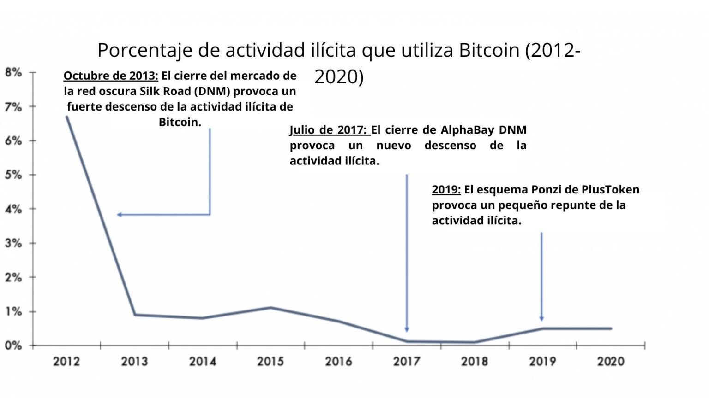

Mientras *Bitcoin* y otras “criptomonedas” suben a niveles récord antes de la oferta inicial de la “*cripto-casa de cambio*” *Coinbase*, el ex director interino de la CIA, Michael Morell, se opone a la sabiduría convencional, la cual dice que *Bitcoin* es propicio para las actividades ilícitas.

En un informe patrocinado por el *Crypto Council* *for Innovation* (un grupo de presión creado por *Coinbase*, *Fidelity*, *Square* y *Digital Assets*), Morell sostiene que *Bitcoin* no está más expuesto al uso ilícito que otras formas de moneda.

*The Cipher Brief* habló con Morell sobre sus hallazgos y su relación con la seguridad nacional.

\[…\]

### Prefacio

Las nuevas tecnologías casi siempre conllevan tanto beneficios importantes para la sociedad, como externalidades negativas. La función de los funcionarios públicos es elaborar una política que permita que florezcan los beneficios, y que también nos proteja de los inconvenientes. Como pude comprobar de primera mano en mis 33 años de carrera en la **Agencia Central de Inteligencia**, el proceso que utiliza nuestro gobierno para conseguir este equilibrio puede ser a menudo frustrantemente lento, pero por lo general ha superado el reto.

Un ejemplo es cómo nuestro gobierno se ha adaptado a los avances tecnológicos en las redes financieras y de pago, salvaguardando al mismo tiempo los sistemas vitales. La banca en línea se introdujo en 1994, pero no fue hasta 1999, con la aprobación de la *Ley Uniforme de Transferencias Electrónicas* (seguida de la aprobación de la Ley federal *E-SIGN* en 2000), cuando se establecieron normas para determinar la legalidad de los documentos y las firmas electrónicas. La adopción de la banca en línea creció sustancialmente a medida que se promulgaban estas leyes y se iba configurando un marco normativo a la altura de lo que entonces se consideraba un avance tecnológico revolucionario.

En la actualidad, la rápida adopción de las tecnologías de *cadena de bloques*, y las *criptomonedas* que soportan, están en camino de revolucionar los sistemas financieros y de pago mundiales. Y, como era de esperar, estamos empezando a ver un equilibrio entre los innovadores y los reguladores, con voces prominentes que pesan, algunos pregonando la “*criptomoneda”* como el futuro de las finanzas y otros planteando preocupaciones sobre las implicaciones financieras ilícitas del ecosistema de la misma.

Habiendo dedicado mi carrera a proteger y promover los intereses de seguridad nacional de los Estados Unidos, reconozco la importancia de garantizar que los avances tecnológicos relacionados con las industrias críticas vayan acompañados de ajustes inteligentes, informados y oportunos de los marcos reguladores, las políticas y las leyes. Aquellos que salvaguardan nuestra nación simplemente deben tener las herramientas adecuadas para hacer su trabajo. Y punto.

En este marco, dos de mis colegas de *Beacon Global Strategies* y yo, realizamos un análisis sobre el grado de actividad ilícita asociado a las “*criptomonedas”* en general y de *Bitcoin* en particular. El proyecto fue patrocinado por un grupo de innovadores e inversores líderes en *criptomonedas*. Los términos del compromiso eran que “yo diría lo que veo”, con objetividad y transparencia, tal y como he hecho a lo largo de mi carrera como analista de inteligencia. Espero que este análisis contribuya a promover un diálogo sano y basado en hechos, mientras los responsables políticos determinan la mejor manera de garantizar que estas innovaciones financieras sirvan al “interés nacional”.

### Introducción

Hasta ahora, 2021 ha sido un año de avances e hitos importantes para *Bitcoin*. Su precio superó los 60.000 dólares por primera vez en su historia. Grandes empresas, desde Tesla a Square o MicroStrategy, lo están incorporando a sus balances. Los grandes bancos están ofreciendo servicios relacionados con *Bitcoin*, y Morgan Stanley dice que pronto ofrecerá acceso a tres fondos de gestión de patrimonios de *Bitcoin* para sus clientes. Canadá ha aprobado los fondos cotizados de *Bitcoin* (*ETF*). El uso emergente de *Bitcoin* como depósito de valor recibe un impulso cada vez mayor.

Sin embargo, existe la creencia común de que el mercado de *Bitcoin* está plagado de actividades ilícitas, y muchos sostienen esta creencia señalando varios incidentes de alto perfil. Cuando se cerró el mercado ilícito de la “red oscura” *Silk Road* (*DNM*) en 2013, el *FBI* incautó más de 26.000 *bitcoin*. *AlphaBay*, creada en 2014 y ampliamente considerada como heredera de *Silk Road*, fue cerrada por las autoridades internacionales en 2017 después de construir una base de clientes de más de 400.000, con transacciones realizadas en gran parte en *bitcoin*. El ataque de *ransomware WannaCry* de 2017, que infectó a más de 200.000 computadoras en todo el mundo, exigía el pago en *bitcoin*. *Bitcoin* se utilizó incluso para ayudar a financiar a algunos de los implicados en la insurrección en el Capitolio el 6 de enero.

La sabiduría convencional sobre esta cuestión se ha visto reforzada por las declaraciones públicas de altos funcionarios gubernamentales de ambos lados del Atlántico que han sugerido que *Bitcoin* se utiliza principalmente para actividades ilícitas. Los llamativos informes de los medios de comunicación, como un reciente artículo de *Buzzfeed* titulado “*Secret Documents Show How Terrorist Supporters Use Bitcoin — And How the Government is Scrambling to Stop Them*” (Documentos secretos muestran cómo los partidarios del terrorismo utilizan *Bitcoin* y cómo el gobierno se esfuerza por detenerlos), parecen dar más peso a estas observaciones.

Para llevar a cabo nuestro análisis, hemos consultado a un grupo diverso de expertos en los campos de la tecnología y la inversión en “criptomonedas”, los servicios financieros, los sistemas de pago, la inteligencia y la seguridad mundial, la regulación financiera y la aplicación de la ley. Entrevistamos a ejecutivos de las principales empresas de análisis de *blockchain*, a ex funcionarios de alto nivel del Departamento del Tesoro, a un alto funcionario de la Comisión de Comercio de Futuros de Materias Primas (*CFTC*) y a un ex analista de inteligencia de la *CIA*, así como a académicos, inversores de capital riesgo, ex fiscales federales y a un ex dirigente del sector bancario. También hemos consultado estudios del Departamento de Justicia de Estados Unidos; la Red de Aplicación de los Delitos Financieros (*FinCEN*); el Grupo de Acción Financiera (*GAFI*); las principales empresas de análisis de *blockchain*; la *Brookings Institution*; *RAND Corporation*; *BAE Systems*; y la Fundación para la Defensa de las Democracias.

Sigal Mandelker, ex Vicesecretaria del Tesoro en funciones y Subsecretaria del Tesoro para Terrorismo e Inteligencia Financiera, así como ex-funcionaria del Departamento de Justicia y fiscal, nos dedicó una parte importante de su tiempo para aprovechar su gran experiencia en la materia.

Comencé este trabajo esperando encontrar un conjunto de hechos que apoyen la sabiduría convencional sobre este tema. Al fin y al cabo, creía que *Bitcoin* y otras “criptomonedas” son una forma ampliamente anónima de transferir fondos a cualquier parte del mundo de forma casi instantánea. Y supuse que los funcionarios que han planteado su preocupación por el uso de *Bitcoin* en actividades ilícitas -con el objetivo de garantizar la vigilancia regulatoria- debían estar entre los expertos mejor informados sobre esta cuestión.

No obstante, basándonos en nuestra investigación y en las conversaciones con expertos del sector, confío en dos conclusiones:

-   Las amplias generalizaciones sobre el uso de *Bitcoin* en la financiación ilícita son significativamente exageradas.
-   El libro de contabilidad *blockchain* en el que se registran las transacciones de *Bitcoin* es una herramienta forense infrautilizada que puede ser utilizada más ampliamente por las fuerzas del orden y la comunidad de inteligencia para identificar y desbaratar actividades ilícitas. En pocas palabras, el análisis de *blockchain* es una herramienta muy eficaz para la lucha contra el crimen y la recopilación de información.

### El uso de Bitcoin en actividades ilícitas es relativamente limitado

Es cierto que la criptomoneda, al igual que otras nuevas tecnologías e innovaciones, ha atraído la atención de los actores ilícitos. Y no es de extrañar que, al mismo que *Bitcoin* que es la “criptomoneda” más poseída comúnmente, también es la moneda que se encuentra con mayor frecuencia en las carteras de *DNM* por un amplio margen. El hecho de que *Bitcoin* esté siendo utilizado por actores ilícitos es probablemente la base de los recientes y ampliamente difundidos comentarios de funcionarios gubernamentales y reguladores. Pero si se profundiza, sus declaraciones se centran en dos afirmaciones: En primer lugar, que *Bitcoin* se utiliza “frecuentemente” o “principalmente” para transacciones financieras ilícitas, y en segundo lugar, que el uso de *Bitcoin* en dichas transacciones está creciendo.

A pesar de estas declaraciones, un alto ejecutivo de una importante empresa de análisis de criptomonedas nos dijo que la creencia común de que *Bitcoin* se utiliza principalmente y cada vez más para fines de financiación ilícita está “desinformada y no se basa en datos” y que “no hay cifras ni metodologías” que la respalden.

Según un estudio reciente de la empresa de análisis de *blockchain* *Chainalysis*, la actividad ilícita entre todas las criptomonedas como porcentaje de la actividad total de criptomonedas de 2017 a 2020 fue inferior al 1%. En el caso concreto de *Bitcoin*, la empresa de análisis de cadenas de bloques *CipherTrace* estima que la actividad ilícita representa menos del 0,5% del volumen total de transacciones.

Fuente: Chainanalysis 2018 Crypto Crime Report; ChipherTrace Cryptocurrency and Anti-Money Laundering Report, February 2021

Mientras tanto, las estimaciones de la actividad ilícita en el conjunto de la economía, realizada en su inmensa mayoría a través de los intermediarios financieros tradicionales y con las monedas fiduciarias tradicionales, son del orden del 2 al 4 por ciento del PIB mundial. De hecho, la base de datos de la Ley de Secreto Bancario (*BSA*) del *FinCEN* contiene más de 300 millones de informes de actividades sospechosas (*SAR*), a los que se añaden 20 millones más cada año. No todos estos *SAR* equivalen a actividades ilícitas en el sistema bancario tradicional, pero muchos sí.

Un exanalista de la CIA agregó credibilidad a las estimaciones anteriores y nos dijo que, debido en parte a la diferencia en el volumen general, la mayor parte de la actividad ilícita todavía tiene lugar en el sistema bancario tradicional y no a través de la criptomoneda. Un informe de 2020 de BAE Systems, encargado por SWIFT, señaló además que “los casos identificados de lavado a través de criptomonedas siguen siendo relativamente pequeños en comparación con los volúmenes de efectivo lavado a través de métodos tradicionales”.

> **‘‘*Los casos identificados de blanqueo a través de criptomonedas siguen siendo relativamente pequeños en comparación con los volúmenes de efectivo blanqueados a través de métodos tradicionales.*’’**

Todo esto en conjunto sugiere un punto más amplio: que el uso ilícito de criptomonedas en general, y en Bitcoin en particular, ciertamente no es más alto que en el sistema bancario tradicional y lo más probable es que sea menor.

Por supuesto, los datos recopilados por las empresas de análisis de blockchain se basan en la actividad ilícita que realmente ven; las estimaciones no intentan cuantificar el tamaño de la actividad ilícita que no pueden ver y analizar.

Sin embargo, las empresas con las que hablamos creen que la actividad ilícita invisible es relativamente pequeña. Uno dijo que cree que conoce la mayor parte de la actividad ilícita, mientras que otro estima que la actividad invisible no es más que lo que conocen. Y, si bien es cierto que no sabemos lo que es desconocido en el mercado de las criptomonedas, lo mismo ocurre con la actividad ilícita en el sistema bancario y en efectivo, como lo demuestra la falta de estimaciones firmes para estos sistemas de pago.

Según el estudio de Chainalysis, los dos tipos más importantes de actividad ilícita son los relacionados con estafas y compras “simples” en la *web oscura*. Los rescates por ataques de ransomware son difíciles de medir, pero los datos sugieren que es la categoría de crimen de criptomonedas de más rápido crecimiento, mientras que la actividad relacionada con el terrorismo y los pagos relacionados con la evasión de sanciones siguen siendo bastante pequeños.

Sobre el tema clave del financiamiento del terrorismo, el ex experto en terrorismo de la CIA cree que la exageración es mucho mayor que la realidad y que la criptomoneda aún no es una plataforma importante para las organizaciones terroristas. Agregó que los esfuerzos de financiamiento colectivo de criptomonedas de dichos grupos generalmente han generado solo unos pocos miles de dólares antes de ser cerrados. Un estudio de 2019 realizado por RAND Corporation concluyó además que el uso terrorista de las criptomonedas es mínimo, y que ninguna criptomoneda actual es proporciona a un grupo terrorista lo que necesitaría para que estos sean un usuario significativo. Sin embargo, el ex experto en terrorismo de la CIA también señaló que algunos grupos están comenzando a usar las técnicas de anonimización más sofisticadas de las criptomonedas para ocultar su flujo de fondos, que es un desarrollo clave para monitorear.

Como se señaló anteriormente, Bitcoin es, con mucho, la principal criptomoneda utilizada en flujos ilícitos. Sin embargo, dos importantes firmas de análisis de criptomonedas han concluido que esto se debe al dominio de Bitcoin en el mercado y, por lo tanto, a su accesibilidad, no a que tenga atributos que lo hagan más atractivo para los usuarios ilícitos. Bitcoin, de hecho, representa más del 60 por ciento de la capitalización de mercado total de las criptomonedas, con más de 4.000 otras monedas que comprenden el 40 por ciento restante.

Y aunque Bitcoin es la criptomoneda más utilizada en actividades ilícitas, otras criptomonedas se utilizan con mucha más frecuencia con fines ilícitos como parte de sus transacciones totales. Un experto en análisis de blockchain dijo que, en el caso de las criptomonedas con mejoras para el anonimato (“AEC” o “monedas de privacidad”), como Monero, que utilizan protocolos integrados para ocultar información sobre transacciones, la actividad ilícita representa un porcentaje del volumen total de transacciones “mucho más grande” de lo que es para Bitcoin.

También existe una creciente evidencia de que la actividad ilícita se está alejando de Bitcoin y hacia las AEC. El informe RAND de 2020 al que se hace referencia anteriormente señaló un cambio de Bitcoin a las criptomonedas con mayor anonimato. El prominente *DNM “White House Market”* ha pasado a aceptar a Monero exclusivamente. Del mismo modo, el grupo de ransomware, Sodinokibi, ya no acepta Bitcoin como pago y solo acepta Monero.

Fuente: BitInfoCharts.com

El creciente uso de AEC para actividades ilícitas se destacó aún más en un aviso de octubre de 2020 emitido por la *FinCEN* que decía: “\[los actores ilícitos\] exigen o incentivan cada vez más a las víctimas a pagar en AEC que reducen la transparencia de los flujos financieros de \[criptomonedas\], incluidos los pagos de ransomware a través de funciones de anonimización”. El aviso agregó que “\[algunos\] operadores de ransomware incluso han ofrecido tarifas con descuento a las víctimas que pagan sus rescates en AEC”.

### La tecnología Blockchain es una poderosa herramienta forense

La tecnología Blockchain es una herramienta forense poderosa pero infrautilizada para que los gobiernos identifiquen actividades ilícitas y lleven a los delincuentes ante la justicia. Un experto en el ecosistema de las criptomonedas llamó a la tecnología blockchain de Bitcoin una “bendición para la vigilancia”. Un funcionario actualmente en servicio en la *CFTC* agregó que “es más fácil para las fuerzas del orden rastrear la actividad ilícita usando Bitcoin que rastrear la actividad ilegal transfronteriza usando transacciones bancarias tradicionales, y mucho más fácil que las transacciones en efectivo”. El ex alto funcionario del Tesoro, Sigal Mandelker, estuvo de acuerdo y dijo que esta opinión es compartida por varias personas en este espacio que también tienen experiencia trabajando en el cumplimiento de la ley y con datos de instituciones financieras.

> **“Es más fácil para las fuerzas del orden rastrear la actividad ilícita usando Bitcoin que rastrear la actividad ilegal transfronteriza usando transacciones bancarias tradicionales, y mucho más aún para transacciones con efectivo.”**

En un testimonio de febrero de 2021 ante el Subcomité de Seguridad Nacional, Desarrollo Internacional y Política Monetaria de la Cámara de Representantes, el ex Subsecretario del Tesoro para la Financiación del Terrorismo y los Delitos Financieros, Daniel Glaser, declaró que, en lo que respecta a la transparencia del sistema financiero internacional y del sistema financiero nacional, “las criptomonedas ofrecen mayores oportunidades, en ciertos aspectos, para que los organismos encargados de hacer cumplir la ley puedan rastrear las transacciones”. Glaser añadió que el gobierno de Estados Unidos debería “introducir \[las criptomonedas\] en el sistema y regularlas de la manera adecuada”.

Un experto nos dijo que la posibilidad de atrapar a los actores ilícitos es  de “mayores magnitudes” utilizando *blockchain* que en el sector bancario tradicional. Otro llegó a decir que “si todos los delincuentes utilizaran *blockchain*, podríamos acabar con la actividad financiera ilícita”. De hecho, su naturaleza transparente llevó a un experto en análisis de *blockchain* a comparar las transacciones en *blockchain* con el hecho de que el “mundo entero” sea testigo del pago de 2.000 dólares a alguien en un callejón oscuro. Basándonos en nuestra investigación, he llegado a creer que si hubiera un ecosistema financiero que utilizaran los malos actores y que maximizara las posibilidades de las fuerzas de seguridad de identificarles a ellos y a sus actividades ilícitas, sería *blockchain*.

La tecnología *blockchain* permite este poder forense porque captura cada una de las transacciones para que todo el mundo las vea: proporciona a los gobiernos y al público en general un registro permanente e inmutable de las transacciones. Cuando se ve junto con otros datos derivados del análisis de la cadena de bloques, así como las herramientas tradicionales de aplicación de la ley, como las citaciones, la tecnología de cadena de bloques puede permitir la identificación tanto de la actividad ilícita como de las identidades de los usuarios finales. La capacidad de detectar actividades ilícitas e identificar a sus autores no es perfecta, pero ha crecido considerablemente en los últimos años.

Una aplicación más amplia de la normativa sobre conocimiento del cliente **(KYC)** y contra el blanqueo de capitales **(AML)** mejoraría aún más la capacidad de las fuerzas de seguridad para identificar la actividad ilícita de *Bitcoin*. Aunque una parte cada vez mayor de *Bitcoin* se mantiene en las casas de cambio centralizadas, *CipherTrace* informó de que el 56% de los proveedores de servicios de activos virtuales (*VASP*) globales todavía tienen “procesos KYC débiles o porosos”. Por ello, espero que una mayor aplicación de las normas de *KYC* y *AML*, consideradas eficaces desde hace mucho tiempo por los altos funcionarios del gobierno, ayude a disipar las preocupaciones sobre las transacciones de Bitcoin.

Las casas de cambio descentralizadas (*DEXs*), que normalmente no tienen una autoridad central sobre la que aplicar las regulaciones *KYC* y *AML*, son también un desafío emergente. Aunque las *DEX* solo son responsables de una pequeña parte del volumen total de transacciones de criptodivisas, su naturaleza descentralizada, en su mayor parte de código abierto, añade una capa adicional de anonimato y, por tanto, ofrece mayores oportunidades para mover fondos ilícitos. Por lo tanto, las operaciones de las *DEX* seguirán siendo un reto para los reguladores gubernamentales, especialmente en lo que respecta a su uso para facilitar las transacciones entre carteras más anónimas “no alojadas”.

Al igual que otras actividades ilícitas, como el uso de drogas para mejorar el rendimiento en el atletismo, las autoridades trabajan constantemente para ponerse al día con las nuevas técnicas de enmascaramiento utilizadas por los actores ilícitos. En el caso de las “criptomonedas”, las empresas de análisis de *blockchain* están desarrollando nuevas herramientas forenses para contrarrestar el uso de tecnologías que crean más anonimato, como las monedas de privacidad, los mezcladores, los tumblers, la estratificación y el salto de cadena.

Por ejemplo, en septiembre de 2020, *Chainalysis* recibió una subvención de 625.000 dólares del *Servicio de Impuestos Internos (IRS)* para desarrollar un software de rastreo de *Monero*. El pasado noviembre, *CipherTrace* también presentó dos patentes para tecnologías relacionadas con el rastreo de transacciones de *Monero* después de trabajar con el Departamento de Seguridad Nacional de Estados Unidos. Por último, en diciembre de 2020, el *software* forense de ‘criptomonedas’ fue capaz incluso de rastrear de forma fiable *Bitcoin* robado que había pasado por varios mezcladores de monedas.

Las fuerzas de seguridad y los servicios de inteligencia pueden utilizar el análisis forense de la cadena de bloques de múltiples maneras. En primer lugar, puede utilizarse como herramienta de investigación en casos existentes; las fuerzas de seguridad pueden utilizar la *cadena de bloques* para descubrir la actividad ilícita del objetivo de una investigación (e identificar a otros posibles malos actores vinculados a través de la cadena de bloques a ese objetivo). En segundo lugar, mediante el uso de algoritmos de inteligencia artificial desarrollados a partir de patrones de comportamiento de los actores ilícitos en el ecosistema, se puede identificar a malos actores desconocidos hasta ahora. Para ello, la *blockchain* permite a las fuerzas de seguridad adoptar una estrategia de red proactiva mucho más sofisticada para identificar la actividad ilícita.

Todos los expertos consultados creen que los gobiernos han tardado en reconocer el poder forense de la tecnología *blockchain*. Este retraso refleja una falta de concienciación en los niveles superiores y de trabajo, así como las dificultades para comprender y trabajar con la extrema complejidad de la informática asociada a la ciencia forense de *blockchain*. Aunque hay un grupo cada vez mayor de funcionarios públicos que han utilizado con éxito las herramientas analíticas de la *cadena de bloques* para perseguir a los malos actores e incautar las ganancias ilícitas, son relativamente pocos los empleados públicos actuales que cuentan con los conocimientos necesarios para utilizar esta tecnología en todo su potencial.

Un experto fue aún más lejos, al afirmar que la mayor amenaza relacionada con las criptomonedas no es la financiación ilícita, sino que los gobiernos aún no comprenden del todo el poder de *blockchain* como herramienta para las fuerzas del orden y los organismos de inteligencia. Sin embargo, el experto también señaló que la conciencia de este poder está empezando a expandirse a medida que los gobiernos se comprometen con las tres principales empresas de análisis de *blockchain*, *Chainalysis*, *CipherTrace* y *Elliptic*. Más allá de Estados Unidos, las agencias gubernamentales de Europa, Japón y Corea del Sur están utilizando *el* análisis de la *cadena de bloques*.

Este reconocimiento gradual ayuda a explicar el número de casos legales significativos que se han resuelto a través del uso del análisis de *blockchain*. En noviembre de 2020, el *IRS* junto con *Chainalysis*, fue capaz de recuperar 1.000 millones de dólares en *bitcoin* ilícitos relacionados con el ya desaparecido *DNM Silk Road*.

En la brecha de julio de 2020 de *Twitter*, cuando más de 100 cuentas de alto perfil fueron hackeadas para promover una estafa que pedía *bitcoin* a los seguidores, los investigadores solo tardaron dos semanas en identificar a los autores y realizar detenciones. Los investigadores relacionaron las direcciones de los monederos con las cuentas de los usuarios en varios foros. A continuación, utilizando el análisis de la *cadena de bloques*, rastrearon los fondos robados hasta varias bolsas, trabajaron con esas bolsas para identificar a los usuarios y cotejaron esa información de los usuarios con los datos encontrados en los foros. En particular, los investigadores identificaron a un individuo que nunca publicó nada que pudiera relacionarlo con su identidad en el mundo real, analizando las transacciones entre direcciones de *Bitcoin*.

Por último, a finales de 2020, el bufete de abogados *Kobre & Kim* pudo utilizar el análisis de la cadena de bloques para rastrear y recuperar 32 millones de dólares en criptomonedas que habían pasado por mezcladores de monedas. A medida que las herramientas que emplean estas empresas se vuelven más sofisticadas, los actores ilícitos tienen cada vez más dificultades para ocultar su actividad.

Y a medida que se produzcan más incautaciones y detenciones, creemos que los actores ilícitos –*que son agnósticos en cuanto a la tecnología*– seguirán abandonando el uso de *Bitcoin* con fines de blanqueo de capitales para recurrir a otras vías que les faciliten la ocultación de sus actividades. Será esencialmente el equivalente financiero de Osama bin Laden; después de enterarse de que el Gobierno de Estados Unidos podía escuchar sus llamadas, no volvió a utilizar un teléfono fijo o móvil.

### Conclusión

A la luz de las conclusiones a las que hemos llegado, ¿por qué vemos declaraciones y artículos tan alarmistas sobre la amenaza que supone *Bitcoin*? Hay varias razones. En primer lugar, se trata de una tecnología nueva y complicada de comprender, y la gente suele tener miedo de lo que no entiende.

En segundo lugar, las malas noticias impulsan las percepciones más que las buenas; en resumen, el miedo hace los titulares. Una historia sobre un ciudadano francés que envía *Bitcoin* a personas implicadas en la insurrección del Capitolio de Estados Unidos desplaza a las historias sobre el uso de la *cadena de bloques* para resolver un crimen. Tenemos que reevaluar este tipo de historias reconociendo que fue la naturaleza transparente de la *cadena de bloques* lo que permitió a las fuerzas de seguridad identificar tan rápidamente el rastro de los pagos ilícitos, mientras que tales pagos realizados a través del sistema financiero tradicional podrían haber sido más difíciles de rastrear.

Por último, *Bitcoin* y su naturaleza descentralizada parecen suponer una amenaza disruptiva para las instituciones financieras tradicionales. Lo mismo podría haberse dicho de la banca electrónica y la firma electrónica hace 20 años, que suscitó un importante debate sobre la protección del consumidor y la integridad del sistema financiero. Con el tiempo, las instituciones financieras tradicionales encontraron la manera de incorporarla con éxito a sus negocios. Y cualquier nueva tecnología tan innovadora como la *cadena de bloques* representará un riesgo para los métodos establecidos de la industria financiera. Será el papel del gobierno identificar la mejor manera de utilizar y regular la tecnología *blockchain* para promover el “interés nacional”.

Toda mi carrera de 33 años en la Agencia Central de Inteligencia estuvo impulsada por una misión primordial: *presentar hechos y análisis objetivos a los responsables políticos para que pudieran tomar la mejor decisión posible para el país.* Estos hechos y análisis ayudan a superar el miedo, la percepción errónea y los intereses particulares (en contraposición al interés nacional). Mi esperanza con este documento no es que sea la última palabra sobre la cuestión de *Bitcoin* y las finanzas ilícitas, sino más bien, como he señalado en la introducción, que conduzca a un debate más basado en hechos sobre el tema.

---

*Este análisis realizado por el ex director interino de la CIA, Michael Morell, fue desarrollado con Josh Kirshner y Thomas Schoenberger y fue patrocinado por el Crypto Council for Innovation.*

*Josh Kirshner es vicepresidente senior de Beacon Global Strategies. De 2009 a 2013 fue el Asistente Especial para Asuntos Político-Militares del Subsecretario de Estado para el Control de Armas y la Seguridad Internacional.*

*Thomas Schoenberger es un asociado de Beacon Global Strategies y tiene experiencia previa en el Departamento del Tesoro y el Departamento de Comercio.*
