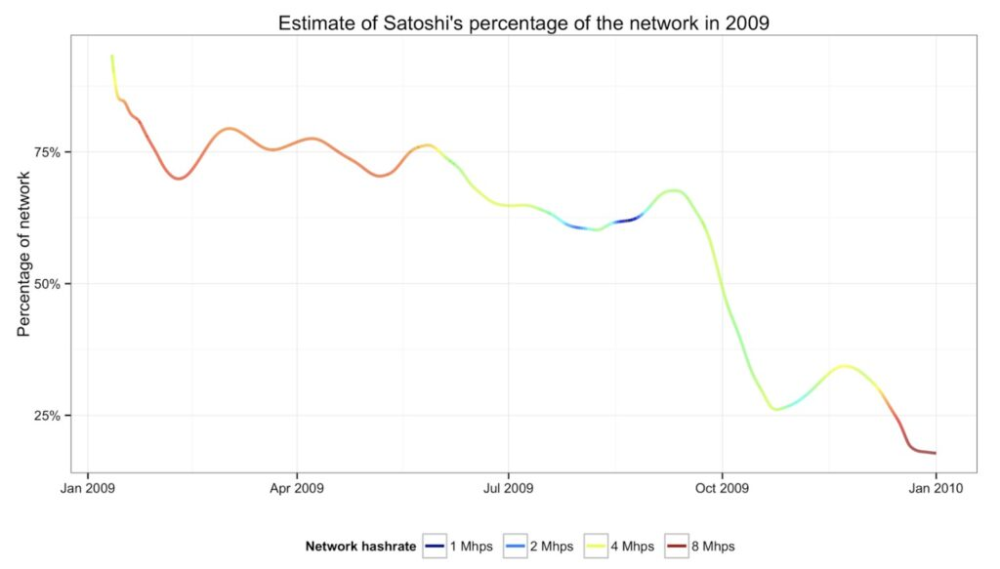
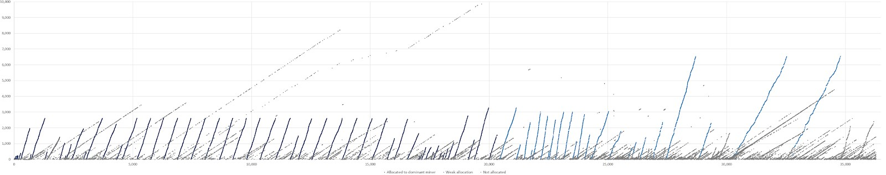
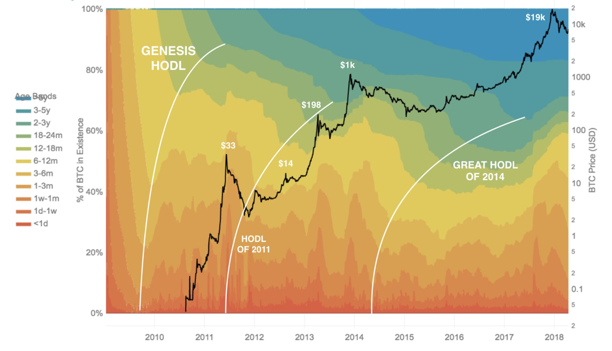

### Prefacio

A medida que Bitcoin aumenta su popularidad, y continúa desafiando al pensamiento *mainstream*, surgirán objeciones alrededor de ciertos [parámetros](https://medium.com/@danhedl/pow-is-efficient-aa3d442754d3) de su existencia. Una de esas es que la distribución de Bitcoin no fue “justa”, particularmente en las etapas iniciales de desarrollo de la red. Voy a sumergirme en la línea de tiempo en torno al lanzamiento de Bitcoin, y desmitificar exhaustivamente las acusaciones sobre una injusta distribución inicial.

Muy largo, no leído (TL;DR)  — Satoshi diseñó el sistema más justo posible

### Distribución

El preminado es el minado o creación de un número de monedas antes de que la critpomoneda sea lanzada al público. El preminado a veces tiene una connotación negativa debido a la capacidad por parte de los desarrolladores de minar privadamente y asignarse un número de monedas a ellos mismos antes de lanzar el código abierto de la moneda al público. Esto podría llevar a un sentimiento de falta de transparencia en la moneda digital ofrecida al público.

Satoshi no preminó. Satoshi le dio a todo el mundo dos meses de anticipación antes de minar el Bloque Génesis, comunicándose con las únicas otras personas que podrían estar interesadas en experimentar con una moneda digital soberana en se momento: los *cypherpunks* (vía la lista de correos pública). El documento fue publicado el 31 de octubre de 2008, y luego el software Bitcoin 0.1 fue lanzado el 9 de enero de 2009.

Solo el Bloque Génesis fue minado antes, el 3 de enero de 2009. Era diferente a todos los otros bloques (no tenía un bloque anterior que referenciar) y requería un código especial para minarlo. Satoshi incluyó un mensaje en el Bloque Génesis como “prueba de no preminado”.

***“The Times 03/Ene/2009 Canciller al borde del segundo bailout para bancos”-* [*Bloque Génesis*](https://en.bitcoin.it/wiki/Genesis_block)** 

Las marcas de tiempo de los subsiguientes bloques indicaban que Nakamoto no pretendió minar todos los bloques de esa etapa él solo. Antes de la invención de Satoshi, el concepto de preminado no existía. Este tipo de anticipación demostró su increíble madurez.

El código para minar bitcoin estuvo disponible el día que Satoshi comenzó a minar (más allá del Bloque Génesis que tenía un propósito especial). Incluso era posible minar con un solo click del mouse, increíblemente fácil. Una vez que el código fue publicado, varios individuos comenzaron a minar  — sabemos con certeza que Hal Finney estaba minando un día después del lanzamiento inicial. Si bien el número de participantes era bajo en ese momento, Satoshi definitivamente no estaba minando solo en los primeros días.

Para el primer año de la existencia de Bitcoin, Satoshi y los otros mineros no podían alcanzar la suficiente tasa de hashes para minar más de 144 bloques por día y gatillar un ajuste al alza en la dificultad. Satoshi minó porque la red requería de un minero, y dejó de hacerlo cuando había una red estable que ya no precisaba de su poder de minado. [Redujo](https://organofcorti.blogspot.com/2014/08/167-satoshis-hashrate.html) el porcentaje de hashrate de forma paulatina. El rastro de minado de Satoshi equilibró cuidadosamente la dificultad de minado del grupo, con el objetivo de mostrar su bien intencionado accionar de una forma históricamente verificable.  Satoshi inicialmente siguió el plan de reducir su hashrate a razón de 1.7 Mhps cada cinco meses, pero un mes después de la segunda reducción reemplazó este método por un descenso de hashrate constante.

Estimación del poder de hash que aportaó Satoshi a la red durante el primer año de Bitcoin

¿Cuánto minó Satoshi? Más allá de un puñado de monedas (algunas aún en [circulación](https://bitcointalk.org/index.php?topic=548508.0)), no se puede saber empíricamente cuántas poseía, pero se puede asignar una alta probabilidad de que él fue el minero que acuñó alrededor de aproximadamente 700.000 monedas. BitMEX revisó la [estimación](https://bitslog.wordpress.com/2013/04/17/the-well-deserved-fortune-of-satoshi-nakamoto/) original realizada por Sergio Damian Lerner en la cual descubrió que el minero de Satoshi tenía una “huella” (el incremento en el valor ExtraNonce en un bloque puede potencialmente ser utilizado para vincular diferentes bloques a un mismo minero). BitMEX se basó en su [análisis](https://blog.bitmex.com/satoshis-1-million-bitcoin/) y concluyó que aunque la evidencia es mucho menos robusta de lo que muchos asumen, hay una evidencia razonable de que un solo minero dominante en 2009 podría haber generado alrededor de 700.000 bitcoins:

> ***“Aunque hay una fuerte evidencia de un minero dominante en 2009, creemos que la evidencia es mucho menos robusta de lo que muchos han asumido. Aunque* [*una imagen vale más que mil palabras*](https://bitcointalk.org/index.php?topic=178629.0;all)*****, a veces las imágenes pueden ser engañosas. Incluso si uno esta convencido, la evidencia solo apoya la afirmación de que el minero dominante generó un número significativamente menor que un millón de bitcoins, en nuestra visión. Quizás 600.000 a 700.000 bitcoins es una mejor estimación”*** *— BitMEX*

Bloques de bitcoin minados en 2009 — asignación del minero dominante— valor del (eje y) vs altura de bloque (eje x)

La capitalización de mercado de Bitcoin fue alrededor de $0 por casi un año y medio. Los mineros estaban desperdiciando su dinero en hardware y electricidad para minar, sin ninguna garantía de que en algún momento los bitcoins que recibían podrían tener valor alguno. De hecho, se armaron “grifos” para distribuir bitcoins gratuitamente con el objetivo de “sembrar” la adopción (por ejemplo, un grifo de 10.000 bitcoins configurado por [Gavin](https://www.reddit.com/r/btc/comments/6vsk7u/gavins_original_bitcoin_faucet_used_to_give_away/) y otros bitcoiners que donaron fondos.) La primera transacción de Bitcoin registrada con valor en el “mundo real” ocurrió el 22 de mayo de 2010, ahora conocido como el *Bitcoin Pizza Day*, cuando Laszlo Hanyecz [acordó](https://en.bitcoin.it/wiki/Laszlo_Hanyecz) pagar 10.000 bitcoins a quien le entregue dos pizzas de Papa John’s.  Esto lo hizo dos veces más, maximizando la dispersión de sus bitcoins.

> ***“Podría tener sentido conseguir algunas en caso de que esto prenda. Si suficientemente piensa de la misma manera, eso se convierte en una profecía autocumplida”*** — [Satoshi Nakamoto](http://www.metzdowd.com/pipermail/cryptography/2009-January/015014.html)

Los pioneros estaban lo suficientemente locos para asumir los riesgos financieros, temporales y sociales de participar en el proyecto Bitcoin, manteniéndolo vivo y actuando como árbitros del sistema en sus primeros días. Casi todos perdieron o vendieron sus bitcoin como evidencia este análisis hecho por [Dhruv Bansal](https://medium.com/u/ffa9d51dae44?source=post_page-----e2ef7bbbc892--------------------------------).

Con cada uno de los ciclos de auge/caída hemos visto una redistribución de bitcoin de los viejos *hodlers* a los nuevos *hodlers* mediante la venta, reduciendo el Coeficiente de Gini. [Solo](https://blog.unchained-capital.com/bitcoin-data-science-pt-1-hodl-waves-7f3501d53f63) en 2017, vimos al 15% de todo los BTC  salir de las manos de los viejos hodlers.

El número teórico del total de bitcoins, apenas menor a 21 millones, no debería ser confundido con el número total de bitcoin disponibles para gastar. El total de bitcoin disponibles para gasto siempre es más bajo que el número teórico total de bitcoins, afectado por pérdidas accidentales, destrucción intencionada, y particularidades técnicas.

> ***“Diez años atrás, criptográfos y expertos en HCI crearon la experiencia definitiva para ver cuán buenos somos los humanos para proteger llaves secretas durante un largo tiempo. Estructuramos este experimento de forma tal que los participantes perderían cientos o miles de dólares si fracasaban. Los resultados del experimento no son bonitos”*** — Algún criptográfo en Twitter

Hay [muchas historias](https://www.wired.co.uk/article/bitcoin-lost-newport-landfill) de gente que ha perdido sus bitcoins en grandes cantidades — especialmente durante los primeros días — cuando BTC no valía mucho y era fácil dejarlos olvidados en un viejo disco rígido, un pendrive USB, o incluso en un pedazo de papel. Las monedas que se mantienen sin gastar por más de cinco años es probable que se hayan perdido para siempre. A pesar de la riqueza de datos que ofrece la cadena de bloques, es extremadamente difícil medir cuánta criptomoneda está realmente perdida, ya que las monedas perdidas no dejan rastros en la cadena de bloques. El problema es que muchos de los bitcoin que no están perdidos se ven exactamente igual en la blockchain \[a los que están perdidos\].

> ***“El estudio de los bitcoin perdidos es geología enmascarado como ciencia de datos”*** *—* [*Dhruv Bansal*](https://blog.unchained-capital.com/@shrubvandal?source=post_header_lockup)

Unchained Capital hizo un gran [análisis](https://blog.unchained-capital.com/bitcoin-data-science-pt-2-the-geology-of-lost-coins-79e5a0dc6d1) de las monedas perdidas, y encontró que la perdida de bitcoin ocurrió en dos eras “criptogeológicas” distintas: la Sistemática (los primeros mineros) y la de Perdida Incremental (monedas perdidas por usuarios gradualmente a lo largo del tiempo). Su estimado: entre 2,78 y 3,79 millones de BTC perdidos, algo que coincidió con otro análisis más [sofisticado](http://fortune.com/2017/11/25/lost-bitcoins/) realizado por Chainalysis.

> ***“Las monedas que se pierden solo hacen que las monedas de los demás valgan un poco más. Es una especie de donación a todo el mundo”*** *—* [*Satoshi Nakamoto*](https://bitcointalk.org/index.php?topic=198.msg1647#msg1647)

Desde errores en el manejo de llaves privadas, a estafas y hackeos a exchanges, a resistir la tentación de vender, los HODLers pioneros SOBREVIVIERON. En compensación por ese riesgo, merecen absolutamente la apreciación en el valor.

Algunos argumentan que la distribución de Bitcoin es análoga a un esquema Ponzi, pero no tiene nada que ver. La definición de [esquema Ponzi](https://www.investopedia.com/terms/p/ponzischeme.asp) es: “una estafa de inversiones fraudulentas en la cual se promete una alta tasa de retorno con muy bajo riesgo para los inversores. El esquema Ponzi genera retornos para los inversores más antiguos a partir de la adquisición de nuevos inversores”.

No lo es por las siguientes razones:

### Transparencia

Absolutamente nada en Bitcoin es un secreto. Es de código abierto, cualquiera puede revisar el código, cualquiera puede contribuir al código, cualquiera puede correr el software de forma voluntaria y participar en la red, y cualquiera puede usar la red sin permiso. Es el opuesto total a una estafa de inversiones fraudulentas, que está envuelta en promesas de altos retornos con los flujos de entrada y salida de capital en un registro secreto.

### Retornos

El *libro blanco* de Bitcoin nunca menciona una inversión o promesa de altos retornos. En un esquema Ponzi el valor para los inversores más antiguos depende de los nuevos ingresantes que llegan con capital fresco, y sus ganancias/dividendos provienen directamente de este capital. Con Bitcoin, lo opuesto es verdad. La mayoría de los bitcoiners pioneros perdieron o vendieron sus bitcoin. Los bitcoiners son humanos, cometen errores humanos y tienen necesidades de humanos (comprarse una casa).

> ***“Los bitcoin no tienen dividendos ni potencial futuro de dividendos, por lo tanto no son una acción. Más parecido a un coleccionable o un commodity.*** — [Satoshi Nakamoto](https://bitcointalk.org/index.php?topic=845.msg11403#msg11403)

### Uso

La determinación del mercado de lo que vale un bitcoin no tiene nada que ver con que el próximo idiota ingrese al sistema, si no una consecuencia de su verdadera proposición de valor, una que ya tenía incluso cuando no valía nada.

### Conclusión

Satoshi era una persona como cualquier otra, no un ser infalible. Esta fue la distribución más justa que podría haber sido posible considerando lo que fue el diseño/timing/audiencia. Es intelectualmente deshonesto comparar a Satoshi minando bitcoin a pérdida con el preminado de una ICO con un valor positivo en el mercado (o un valor positivo esperado)

> ***“Bitcoin se benefició de un conjunto de circunstancias extremadamente raras. Porque fue lanzado en un mundo donde el efectivo digital no tenía un valor establecido, circulaba de forma gratuita. \[Las circunstancias\] no pueden ser reproducidas hoy ya que todos esperan que las monedas tengan valor. No solo fue justa, pero fue históricamente único en lo justo que fue. La inmaculada concepción”.** –*Nic Carter

Satoshi quería demostrarle a todos que Bitcoin no era una estafa. Su desescalada conservadora en las contribuciones al minado, su salida de la comunidad, nunca haber gastado ninguna de sus monedas, ni haber utilizado su influencia para ningún propósito, muestras que quería que el mundo sacara sus propias conclusiones sobre su proyecto y lo juzgue en sus propios términos.

A diferencia de cualquier otro fundador en la historia, Satoshi nunca cobró su parte.
