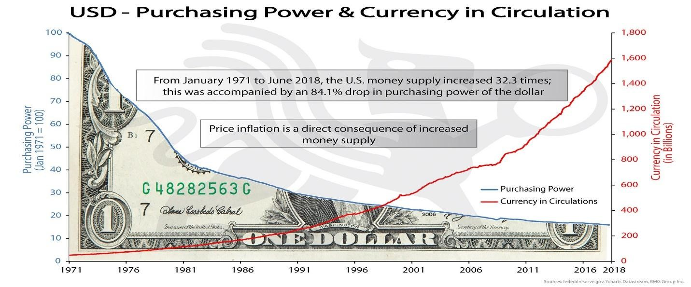
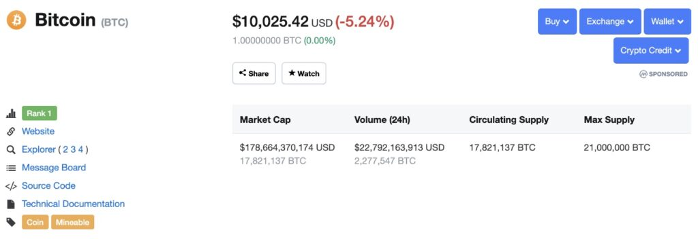

Una de las mayores críticas que escucho cuando se trata de mis creencias maximalistas de Bitcoin es que estoy siendo de mente cerrada. Los detractores tienden a decir que despreciar todos los demás protocolos muestra terquedad y falta de voluntad para aprender. Muy por el contrario, he descubierto que a medida que he construido mi base de conocimientos a lo largo de los años, he podido compilar una lista simple de criterios que ninguna otra moneda que no sea Bitcoin se ha mantenido a la altura. Hoy voy a analizar esa lista.

En primer lugar, me gustaría abordar qué fue lo que me atrajo de Bitcoin. Lo he destilado en algunos puntos clave:

-   La separación del dinero y la nación-estado.
-   Resistencia a la censura.
-   Dinero a prueba de inflación (dinero sólido).

A medida que bajaba por la madriguera del conejo de Bitcoin, se me hizo bastante evidente que estos eran los elementos (en mi opinión) que más importaban. Durante el patrón oro, estos principios eran una norma social. Desafortunadamente, una combinación de complacencia humana junto a que el oro carece de ciertas características necesarias resultó en una disminución y eventual abolición del patrón oro. Lo que sigue es una breve lección de historia que me ayudó a reconocer el valor de esos tres puntos anteriores, así como la siguiente lista de criterios que creo que son necesarios para lograrlos.

### Una pequeña historia

El oro físico era de hecho dinero sólido, no controlado por ningún estado y ofrecía resistencia a la censura. Dos cosas que no eran inherentes al oro eran la transportabilidad y el propio almacenamiento seguro, asequible y ampliamente accesible.

Esto llevó a soluciones de almacenamiento a través de terceros: los bancos. Los depositantes recibían un certificado que podían canjear por su oro más tarde. Por conveniencia, se convirtió en la norma para las personas realizar transacciones con certificados de oro en lugar de retirar y volver a depositar el oro físico en sí. La conveniencia resultante también dio lugar a una serie de problemas.

El oro en manos de un tercero no podía auditarse fácilmente. Esto le dio al banco la capacidad de emitir préstamos (a través de certificados) por más oro del que tenían acceso en ese momento, lo que actualmente se conoce como “banca de reserva fraccionaria”. Solo una fracción de los certificados de oro emitidos estarían representados por reservas reales de oro en una bóveda. Si los depositantes entraban en pánico y todos canjeaban sus certificados simultáneamente (lo que se conoce como una corrida bancaria), algunas personas se quedarían con un trozo de papel sin valor, incluso si estas personas hubieran hecho originalmente un depósito de oro físico.

Una mezcla de complacencia y pereza parece haber resultado en una dependencia excesiva de terceros para mantener la riqueza de uno, lo que a su vez condujo inevitablemente a otro camino oscuro: la fácil confiscación. En 1933, el entonces presidente de los Estados Unidos, Roosevelt, declaró ilegal que los ciudadanos estadounidenses tuvieran barras de oro o certificados y en menos de un mes confiscó casi todo el oro de propiedad privada. Los disidentes enfrentaron multas de $10.000 y entre 5 y 10 años de prisión. Al renunciar a su oro, a los ciudadanos se les pagó una tarifa de $20 USD por onza de oro.

En este punto, a los ciudadanos se les había robado su derecho a poseer directa o indirectamente cualquier oro … pero al menos todavía tenían dinero sólido RESPALDADO por el oro, ¿verdad? No tan rápido. Con la incapacidad de tener oro, realizar transacciones con él libremente o auditar fácilmente al custodio externo (ahora la Reserva Federal), la gente común ahora no tenía voz en las reglas subyacentes y los mecanismos de precios que rigen su dinero. Después de todo, ya no tenían el dinero, tenían un activo vinculado a dinero sólido (oro). El vínculo entre el oro y el dólar en sí mismo, estaba controlado al 100% por una entidad centralizada. ¿Quieres adivinar qué pasó después?

A través de La Ley de Reserva del Oro de 1934, todo el oro confiscado el año anterior fue entregado al Tesoro de los Estados Unidos. ¿El truco? El precio del oro se modificó a $35 USD por onza. Esto significa que de la noche a la mañana el dólar se devaluó frente al oro en casi la mitad.

Durante las próximas décadas, muchos países confiaron en Estados Unidos para almacenar su oro en sus bóvedas a cambio de dólares estadounidenses, la moneda de reserva mundial. Continuó la espiral de préstamos de reserva fraccionaria, esta vez a nivel internacional. Se hizo obvio que Estados Unidos estaba prestando más dólares que oro para respaldarlo y pronto países como Suiza y Francia se enteraron de esto. Comenzaron a exigir la devolución de su oro, básicamente una corrida bancaria entre naciones. En 1971, décadas de complacencia y compromiso dieron su golpe final al patrón del oro.

El 15 de agosto de 1971, el presidente Richard Nixon anunció la suspensión “temporal” de la convertibilidad del dólar estadounidense en oro. Todos los dólares que existían ahora estaban respaldados por poco más que el papel en el que estaban impresos. Esa suspensión de la convertibilidad existe hasta el día de hoy, y las consecuencias de esta acción se pueden resumir en un solo gráfico.

En resumen, creo que el declive del patrón del oro se puede atribuir a:

-   La complacencia de las personas que confían en terceros.
-   Dificultad para auditar a terceros.
-   Fácil confiscación.
-   Centralización gradual del poder.
-   La facilidad con la que se podían cambiar las “reglas” y la falta de recursos que tenían los ciudadanos para evitarlo.

### Ahora vayamos a esa lista

Lo sé, esperabas una lista rápida sobre maximalismo, pero el contexto lo es todo. Te aplaudo por leer hasta aquí. Avancemos y analicemos mis criterios para lograr un nuevo estándar monetario sólido, cómo creo que ayudará a prevenir los errores del pasado y por qué ninguna otra moneda que no sea Bitcoin ha podido resistir esta prueba (al menos en mi opinión).

### 1\. ¿Es dinero sólido?

Por razones obvias, esto es de alta prioridad. ¿Cuál es la oferta? ¿Cómo se emite a lo largo del tiempo? ¿Se distribuyó de manera justa desde el principio? Con Bitcoin, obtienes respuestas definitivas a todas estas preguntas, y todas las respuestas tienden a implicar que sí: este protocolo se creó para reflejar las propiedades de una moneda sólida como el oro. Sin profundizar demasiado en los aspectos técnicos, puede resumirlo relativamente rápido aquí:

-   Solo habrá 21 millones de monedas.
-   Las monedas se emiten con un protocolo de inflación que disminuye gradualmente y que reduce a la mitad la producción aproximadamente cada 4 años.
-   Las monedas recién creadas (junto con las tarifas de transacción pagadas por los usuarios de la red) se recompensan aproximadamente cada 10 minutos a personas llamadas mineros que examinan y organizan transacciones que se adhieren a las reglas de consenso de la red.

Lamentablemente, con mi experiencia trabajando en una correduría OTC (sus siglas del inglés “over the counter”), sé que muchos “inversores en criptomonedas” no tienen ningún conocimiento de estas propiedades básicas cuando se trata de Bitcoin, y mucho menos de las criptomonedas alternativas. Supongo que es por eso que las monedas como Ethereum tienen personas técnicamente analfabetas que las compran por especulación a pesar de que nunca ha habido una política monetaria clara, y el procedimiento de toma de decisiones sobre la emisión tiende a reflejar más de cerca el de un banco central (Vitalik & La Fundación Ethereum) que una red descentralizada que llega a un consenso sobre reglas estrictas.

También explicaría por qué una moneda como Ripple … \* ejem \* XRP … que se imprimió de la nada y se vendió a un público despistado AÚN retiene a una multitud hambrienta de personas convencidas de que alcanzará los $589 por moneda. Esto a pesar de que hay 100 MIL MILLONES de unidades con el 60% todavía en posesión de Ripple labs para ser lanzadas al mercado a intervalos regulares.

El suministro y la emisión son más o menos los cimientos de mi razonamiento en esta lista, mientras que el resto de mis puntos tienden a centrarse en cómo puedo estar seguro de que estas métricas no cambiarán ni pueden cambiarse.

### 2. ¿Son las transacciones sin fronteras y resistentes a la censura? 

Un requisito bastante simple aquí. Si tengo dinero sólido, entonces también quiero poder llevarlo a cualquier parte y enviárselo a cualquiera. Las principales monedas que fallarán más claramente aquí son las monedas estables fiduciarias creadas por corporaciones en jurisdicciones con una fuerte supervisión regulatoria. JP Morgan Coin, Libra de Facebook y otros similares ciertamente estarán sujetos a KYC (siglas en inglés para “Know your customer o conoce a tu cliente) / AML (siglas en inglés para Anti-Money Laundering o Anti-lavado de Activos) completo, y se verán forzados al marco decrepito creado hace décadas por el tradicional sistema bancario. Afortunadamente, están vinculados a dólares fiduciarios de todos modos, por lo que ya están fuera de la carrera después de fallar la prueba del dinero sólido.

Sin embargo, todavía no estamos fuera de peligro. Por mucho que la gente pretenda que “blockchain” es un mágico registro inmutable resistente a la censura, eso es tan cierto como el mecanismo de consenso que gobierna la cadena. ¿Cómo se decide quién es realmente el propietario de qué?

Definitivamente hemos visto ejemplos de transacciones revertidas en cadenas de bloques supuestamente descentralizadas. EOS ya ha revertido regularmente transacciones previamente confirmadas y supuestamente inmutables, a veces sin dar inicialmente ninguna razón. BAT (Basic Attention Token) puede reclamar (en otras palabras, robar) tus monedas si olvidas usarlas dentro de los 90 días.

Incluso si crees que Ethereum está lo suficientemente descentralizado para lograr la inmutabilidad en este punto (lo cual es discutible), eso no significa que su token ERC20 (una moneda construida sobre la cadena de bloques de Ethereum) sea inmutable. Cada token construido sobre otra cadena de bloques tiene su propio conjunto de reglas de consenso, ¡lo que puede incluir la capacidad de revertir transacciones!

### 3\. ¿Es suficientemente descentralizado y seguro?

Aquí es donde las cosas se ponen complicadas para los nuevos iniciados. Una moneda puede pretender ser inmutable y estar en contra de la censura todo lo que quiera, pero al final, si no hay suficiente poder de computación global que respalde esa afirmación… su palabra no vale ni el papel blanco en el que está escrita. Para mí, no hay mejor ejemplo de esto que Ethereum Classic.

Hace unos años hubo un proyecto llamado DAO construido sobre Ethereum. Se jactó de que sería una revolución en la estructura corporativa, sin directores ejecutivos, la toma de decisiones a través de fuentes múltiples y la capacidad de dividirse en diferentes corporaciones si algunas personas no estaban de acuerdo con la trayectoria. La gente se emocionó. Quizás estaban DEMASIADO emocionados, especialmente cuando se trataba de código no probado. En menos de un mes, 11.000 inversionistas acumularon $150.000.000 en el proyecto. Y he aquí, el código tenía lagunas y un atacante pudo desviar alrededor de $50 millones. La tormenta de mierda que siguió resultó en dos campamentos:

-   Aquellos que querían revertir el hackeo y devolver el dinero a los propietarios originales. Esto es lo que conocemos ahora como Ethereum.
-   Aquellos que creían que revertir las transacciones comprometería la razón misma para usar una cadena de bloques en primer lugar. Este grupo prefirió dejar los fondos como tal. Se creó una “bifurcación” del protocolo y ahora se conoce como Ethereum Classic, aunque técnicamente hablando es la cadena original.

Ethereum Classic siempre se ha enorgullecido de sus valores e inmutabilidad. Si su transacción está en la cadena de bloques, debe asegurarse de que seguirá estando allí mañana y todos los días a partir de entonces. Sin embargo, hay un pequeño problema: Ethereum Classic no tenía el poder hash para respaldar eso.

En resumen, la potencia hash es la cantidad de potencia informática en la red que garantiza que las transacciones se transmitan y registren indefinidamente. Cuando este poder se distribuye entre un gran número de compañeros, todo tiende a funcionar a la perfección. Sin embargo, cuando más del 51% de este poder de hash se centraliza en manos de una sola entidad, obtienen la capacidad de revertir potencialmente transacciones confirmadas previamente y reemplazarlas por otras nuevas. Cuanto más poder de hash, más fácil será realizar el ataque.

Esto se materializó para Ethereum Classic el 7 de enero de 2019 cuando un individuo o grupo de personas pudo lograr un “doble gasto” de alrededor de $1,1 millones en ETC con éxito, ya que el 51% atacó la cadena. En resumen: pudieron depositar ETC en los intercambios, intercambiar otras monedas, retirar y luego revertir su depósito de ETC para que no ocurriera.

Ethereum Classic no es la única cadena grande que experimenta ataques como este. Verge, Vertcoin, Bitcoin Gold y Feathercoin han sido atacados en un 51%, solo por nombrar algunos.

### 4. ¿No tiene líderes o hay una clara corporación / testaferro detrás de él? 

Saint Vitalik regalando lambos a las puertas aperladas de PoS.

Seamos claros como el cristal aquí. Esto NO es algo que esté buscando. Tener liderazgo en cualquier forma, percibida o real, es un detrimento para una criptomoneda global. Los líderes son falibles, coercibles y corruptibles. Otorgar fe y poder a un líder delega la responsabilidad de pensar y tomar decisiones a otra persona. Incluso una persona supuestamente moral, en una posición de poder, puede actuar contra el libre mercado en interés del “bien mayor” cuando en realidad simplemente está favoreciendo ganancias a corto plazo. Los líderes también pueden decir cosas estúpidas o cometer errores estúpidos que impacten el mercado. Además, todos estos escenarios asumen que su liderazgo no tiene intenciones maliciosas directas.

Si ninguno de los otros puntos ha eliminado tu moneda elegida hasta el momento, es bastante probable que este punto lo haga. Piense en todos los testaferros fácilmente identificables en criptomonedas. Charlie Lee con Litecoin, Vitalik Buterin con Ethereum, Brad Garlinghouse y David Schwartz con Ripple… \* ejem \*… XRP. Independientemente del carácter de estos individuos, a cada uno se le da una especie de posición de deidad en sus respectivas comunidades. Cuando ellos le dicen a sus seguidores que salten, un coro de altcoiners responde con “¿qué tan alto?”

Oye, al menos ellos no son este tipo …

### 5. ¿Qué tan fácil es realizar cambios en el protocolo que no sean compatibles con versiones anteriores? 

Uno de los principios fundamentales de la criptomoneda (o Bitcoin, al menos) es el consenso. Un grupo de personas que se reúnen y acuerdan un conjunto de reglas que rigen el protocolo. ¿Y si no sigues las reglas? Tus transacciones son rechazadas y se te ignora. Esto vuelve a algo que mencioné en el primer punto. ¿Cómo puedo estar seguro de que se respetarán los principios del dinero sólido en el protocolo de una criptomoneda?

A muchos críticos de Bitcoin les gusta señalar el hecho de que el cambio es lento y que otras cadenas son mucho más ágiles al implementar actualizaciones. ¡Rayos!, uno de los lemas de Ethereum es “muévete rápido y rompe cosas”. Las actualizaciones no compatibles con versiones anteriores (bifurcaciones duras) se han convertido en algo común en monedas como Ethereum, Bitcoin Cash, Dash y otras.

Mi problema con esto es simplemente que sienta un precedente peligroso. Cuando la base de tu moneda, su conjunto de reglas subyacentes es trivial de cambiar, entonces todas las promesas en las que ha llegado a depositar su confianza son maleables. Si bien muchos piensan que el límite de 21 millones de monedas es una métrica intocable, me atrevería a decir que en un momento la idea de dejar el patrón del oro parecía ser una idea igualmente absurda. En mi opinión, cuanto antes se endurezca el protocolo bitcoin, mejor. No tengo ningún interés en poner en peligro el historial casi impecable de una década de Bitcoin debido a un chiste de que comprar café se volvió impráctico durante cortos períodos de tiempo.

Entonces, ¿qué hay de agregar funciones y escalar para la demanda de pequeñas transacciones? Confío en la capacidad de la optimización de la primera capa en combinación con las soluciones de segunda capa para lograrlo. La red Lightning se lanzó en la red principal en marzo de 2018 y la cantidad de crecimiento en ese tiempo ha sido asombrosa. Las adiciones al protocolo como neutrinos, intercambios submarinos y pagos atómicos de múltiples rutas harán que la experiencia del usuario sea mucho más fluida con el tiempo. Taproot, el protocolo RGB y Liquid son ejemplos que amplían la capacidad de Bitcoin para hacer cosas como contratos inteligentes y activos digitales vinculados construidos sobre su propia cadena de bloques.

En resumen, veo que las cosas se desarrollan sobre Bitcoin sin hinchar la capa base o crear la necesidad de bifurcaciones duras frecuentes. Creo que este es el mejor enfoque para escalar, y describiré mis razones en los criterios finales que establecí…

### 6. ¿Pueden los usuarios autovalidar y seguir las reglas de consenso con un costo mínimo? 

Uno de los aspectos más importantes de Bitcoin es la capacidad de cualquier individuo para validar y seguir de forma independiente las reglas de consenso de su elección. No puedo enfatizar lo importante que es esto. Para hacer referencia al comienzo de este artículo, la complacencia y la falta de responsabilidad personal condujeron a que las entidades centralizadas obtengan el control de los “mecanismos de consenso” en torno al oro. Se cambiaron las reglas para todos y vieron sus ahorros confiscados / devaluados de una sola vez.

Tal como está ahora, es relativamente sencillo para alguien con una computadora y una conexión a Internet descargar una copia completa de la cadena de bloques y examinar la totalidad del historial de transacciones de Bitcoin. También es sencillo que alguien continúe ejecutando el software de Bitcoin y sepa sin lugar a dudas que nadie más puede imponerles diferentes reglas de consenso. Esto se debe en parte al límite de tamaño del bloque y al trabajo continuo de los desarrolladores para optimizar la capa base, manteniéndola accesible para los usuarios todos los días. En contraste, la cadena de bloques Ethereum se ha disparado, fuera de control, superando 1TB en mayo de 2018. Sin embargo, almacenarla no es el problema principal, es la latencia. Intentar sincronizar un nodo con tantos datos transmitidos es una verdadera pesadilla, que a su vez tiene validadores centralizados.

No creo necesariamente que todo el mundo necesite siempre ejecutar un nodo, pero estoy convencido de que SIEMPRE debería ser una opción. Cuando no ejecutas un nodo de Bitcoin, estás confiando en que otra persona te diga qué es Bitcoin. Eso está bien y es excelente cuando no hay temas polémicos sobre la mesa, pero cuando hay problemas, se corre el riesgo de verse obligado a un cambio de reglas que tu no deseas.

El desarrollo en torno a la optimización de la capa base de Bitcoin para hacerla más accesible a las masas es lo que creo que es la mayor fortaleza de este protocolo. Hasta la fecha, el mejor ejemplo de esto ha sido la derrota de Segwit2X.

Resumen rápido: en 2017, un gran número de empresas líderes en la industria ( BitPay , Coinbase, Blockchain.info, Shapeshift y más), además de la mayoría de los mineros de Bitcoin, decidieron que crearían una bifurcación de Bitcoin no compatible con versiones anteriores para escalar la red. La nueva moneda se llamaría Bitcoin y la antigua cadena se abandonaría.

En una espectacular demostración de oposición, los Bitcoiners rechazaron esta “actualización” de la red. Con nada más que sus propios nodos de gestión privada y una teoría de juegos de primer nivel, los usuarios individuales derrotaron a todas las empresas importantes en el espacio y los obligaron a retroceder menos de 24 horas antes de la bifurcación propuesta.

Para mí, este fue el momento más optimista en la historia de Bitcoin. En cualquier otra industria, un resultado como este no tiene precedentes. ESTA es la fortaleza de Bitcoin: la capacidad de los usuarios individuales para enfrentarse a todo pronóstico y oponerse al establecimiento cuando intentan “arreglar Bitcoin”.

No queremos sus soluciones gubernamentales y corporativas.

### Conclusión

Mi camino hacia el maximalismo de Bitcoin no nació de una mentalidad cerrada, sino de una consideración cuidadosa de propiedades que me atrajeron de Bitcoin y de condiciones que son necesarias para preservar esas propiedades. Quiero un protocolo que:

-   Encarne los principios del dinero sólido.
-   No tenga fronteras y sea resistente a la censura.
-   Exhiba suficiente descentralización.
-   No tenga testaferros o líderes discernibles.
-   Sea increíblemente difícil de cambiar de una manera no compatible con versiones anteriores.
-   Conserve la capacidad de cualquier individuo pueda para validar y seguir las reglas de consenso.

Me he dado cuenta de que condensar mis intereses y valores en estos puntos me ha dado un enfoque. Una falla en cualquiera de estos puntos no es aceptable, y esto se ha convertido en mi prueba de fuego para la basura que trae blockchain. Fuera de Bitcoin, todavía tengo que ver otra moneda que supere estos obstáculos, y hasta que vea evidencia de lo contrario, me inclino a creer que Bitcoin es el único protocolo que lo hará.

---

**Este artículo fue traducido por [SHOGUN](#).** Consulta la versión en inglés en la [Fuente Original](https://medium.com/bull-bitcoin/my-path-to-bitcoin-maximalism-c77c53466cb5).

---
