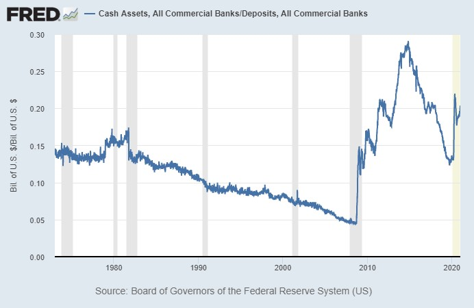
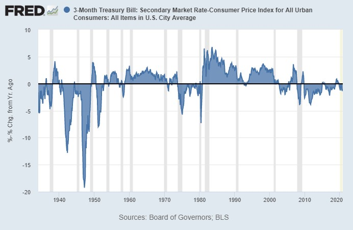
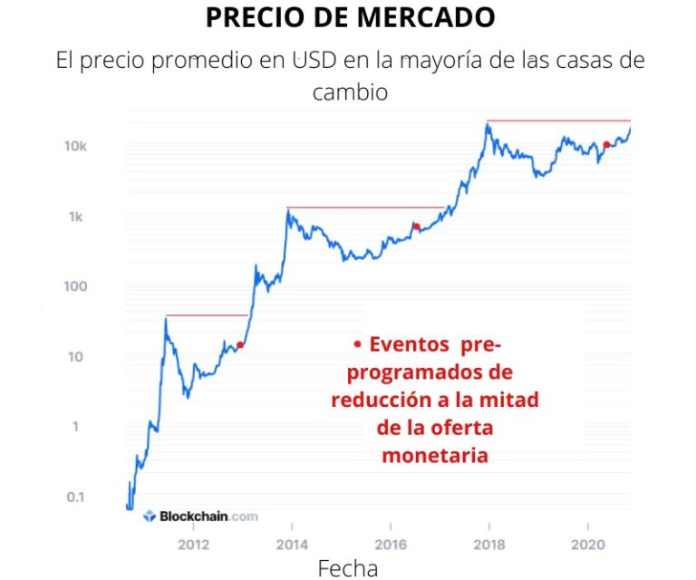

Una de las preocupaciones que he visto sobre *Bitcoin* es la afirmación de que es un esquema Ponzi. El argumento sugiere que, debido a que la red *Bitcoin* depende continuamente de que nuevas personas compren, eventualmente colapsará el precio a medida que los nuevos compradores se agoten.

Por lo tanto, este artículo analiza de forma seria la preocupación al comparar y contrastar *Bitcoin* con sistemas que tienen características similares a un esquema Ponzi, para ver si la afirmación se mantiene.

En resumen, *Bitcoin* no cumple con la definición de un esquema Ponzi de ninguna manera, pero indaguemos para ver por qué ese es el caso.

## Definición de un esquema Ponzi

Para empezar a abordar el tema de *Bitcoin* como un esquema Ponzi, necesitamos una definición.

Así es como la *Comisión de Bolsa y Valores* de Estados Unidos lo define:

*“Un esquema Ponzi es un fraude de inversión que paga a los inversores existentes con fondos recaudados de nuevos inversores. Los organizadores de esquemas Ponzi a menudo prometen invertir su dinero y generar altos rendimientos con poco o ningún riesgo. Pero en muchos esquemas Ponzi, los estafadores no invierten el dinero. En cambio, lo usan para pagar a quienes invirtieron antes y pueden quedarse con algo para ellos.*

*Con pocas o ninguna ganancia legítima, los esquemas Ponzi requieren un flujo constante de dinero nuevo para sobrevivir. Cuando se vuelve difícil reclutar nuevos inversores, o cuando un gran número de inversores existentes retiran dinero, estos esquemas tienden a colapsar.*

*Los esquemas Ponzi llevan el nombre de Charles Ponzi, quien engañó a los inversores en la década de 1920 con un esquema de especulación con sellos postales“.*

Aparte, pasan a enumerar las ‘‘banderas rojas’’ a las que debe prestar atención:

“*Muchos esquemas Ponzi comparten características comunes. Busque estas señales de advertencia:*

### Altos rendimientos con poco o ningún riesgo.

*Toda inversión conlleva cierto grado de riesgo, y las inversiones que producen mayores rendimientos suelen implicar más riesgo. Sospeche mucho de cualquier oportunidad de inversión “garantizada”.*

### Rendimientos demasiado consistentes.

*Las inversiones tienden a subir y bajar con el tiempo. Sea escéptico acerca de una inversión que genera regularmente rendimientos positivos independientemente de las condiciones generales del mercado.*

### Inversiones no registradas.

*Los esquemas Ponzi generalmente involucran inversiones que no están registradas con la Comisión de Bolsa y Valores de Estados Unidos (SEC) o con los reguladores estatales. El registro es importante porque proporciona a los inversores acceso a información sobre la gestión, los productos, los servicios y las finanzas de la empresa.*

### Vendedores sin licencia.

*Las leyes de valores federales y estatales requieren que los profesionales y las empresas de inversión tengan licencia o estén registrados. La mayoría de los esquemas Ponzi involucran a personas sin licencia o empresas no registradas.*

### Estrategias secretas y complejas.

*Evite las inversiones si no las comprende o no puede obtener información completa sobre ellas.*

### Problemas con el papeleo.

*Los errores en el estado de cuenta pueden ser una señal de que los fondos no se están invirtiendo según lo prometido.*

### Dificultad para recibir pagos.

*Sospeche si no recibe un pago o tiene dificultades para cobrarlo. Los promotores del esquema Ponzi a veces intentan evitar que los participantes saquen dinero ofreciendo retornos aún más altos por quedarse’’.*

Creo que es un gran conjunto de información con el que trabajar. Podemos ver cuántos de esos atributos, si es que hay alguno, están presentes en *Bitcoin*.

### Proceso de lanzamiento de Bitcoin

Antes de comenzar a comparar *Bitcoin* punto por punto con la lista anterior, podemos comenzar con un resumen de cómo se lanzó *Bitcoin*.

En agosto de 2008, alguien que se identificó como Satoshi Nakamoto, creó *bitcoin.org*.

Dos meses después, en octubre de 2008, Satoshi publicó el libro blanco de *Bitcoin*. Este documento explica cómo funcionaría la tecnología, incluida la solución al problema del *doble gasto*. Como puede ver en el enlace, fue escrito en el formato y estilo de un artículo de investigación académica, ya que presentaba un gran avance técnico que brindaba una solución para los desafíos de la informática relacionados con la escasez digital. No contenía promesas de enriquecimiento ni devoluciones.

Luego, tres meses después, en enero de 2009, Satoshi publicó el software inicial de *Bitcoin*. En *el bloque Génesis* personalizado de la cadena de bloques, que no contiene *bitcoin* gastable alguno, proporcionó un titular de un artículo con ‘‘sello de tiempo’’ sobre rescates financieros a bancos del *The Times* de Londres, que probablemente demuestra que no hubo *pre-minado* y que marcó el tono del proyecto. A partir de allí, le tomó seis días terminar sus asuntos y minar el bloque 1, que contenía los primeros 50 *bitcoin* gastables, y lanzó el código fuente de *Bitcoin* ese mismo día, el 9 de enero. El 10 de enero, Hal Finney tuiteó públicamente que también estaba ejecutando el software de *Bitcoin*, y desde ese momento, Satoshi probó el sistema al enviar *bitcoin* a Hal.

Curiosamente, dado que Satoshi mostró cómo hacerlo en el libro blanco más de dos meses antes de lanzar *él (ella/ellos)* mismo(a/*s*) el software de código abierto de *Bitcoin*, técnicamente alguien podría haber usado el conocimiento recién descubierto para lanzar una versión antes que él. Hubiera sido poco probable, debido a la gran ventaja de Satoshi al descubrir todo esto y comprenderlo en un nivel profundo, pero era técnicamente posible. Reveló el avance tecnológico clave *antes* de lanzar la primera versión del proyecto. Entre la publicación del libro blanco y el lanzamiento del software, respondió preguntas y explicó sus opciones para su libro blanco a varios otros criptógrafos en una lista de correo electrónico en respuesta a sus críticas, casi como si una defensa de tesis académica se tratara, y varios de ellos pudieron haber sido lo suficientemente capaces como para “robarle” el proyecto, si hubiesen sido menos escépticos.

Después del lanzamiento, un conjunto de equipos computacionales, que se cree que pertenecían a Satoshi, siguió minando *bitcoin* durante el primer año. La minería es necesaria para seguir verificando las transacciones de la red, y los *bitcoin* no tenían un precio cotizado en dólares en ese momento. Redujo gradualmente su minado con el tiempo, a medida que la minería se distribuía más por la red. Hay casi 1 millón de *bitcoin* que se cree que pertenecen a Satoshi, el cual se extrajeron durante el período inicial de *Bitcoin* y que nunca se han movido de su dirección inicial. Podría haber cobrado en cualquier momento con miles de millones de dólares en ganancias, pero hasta ahora no lo ha hecho, a pesar de más de una década que tiene de vida el proyecto. No se sabe si todavía está vivo, pero aparte de algunas monedas tempranas para transacciones de ensayo, la mayor parte de sus monedas no se han movido.

No mucho después, transfirió la propiedad de los dominios de su sitio web a otros y, desde entonces, *Bitcoin* se ha mantenido autosuficiente entre una comunidad de desarrollo sin la participación de Satoshi.

*Bitcoin* es de código abierto y se distribuye en todo el mundo. La cadena de bloques es pública, transparente, verificable, auditable y analizable. Las empresas pueden realizar análisis de toda la cadena de bloques y ver qué *bitcoin* se mueven o permanecen en su lugar en varias direcciones. Un nodo completo de código abierto se puede ejecutar en una computadora doméstica básica, y puede auditar toda la oferta monetaria de *Bitcoin* y otras métricas.

Con eso en mente, podemos comparar *Bitcoin* con las banderas rojas de un esquema Ponzi.

### Rendimientos de inversión: no prometidos

Satoshi nunca prometió retornos de inversión, y mucho menos retornos de inversión altos o retornos de inversión consistentes. De hecho, *Bitcoin* fue conocido durante la primera década de su existencia como una especulación de volatilidad extremadamente alta. Durante el primer año y medio, *Bitcoin* no tuvo un precio, y luego tuvo un precio muy volátil.

Los escritos en línea de Satoshi todavía existen, y casi nunca habla sobre ganancias financieras. Escribió principalmente sobre aspectos técnicos, sobre la libertad, sobre los problemas del sistema bancario moderno, etc. Satoshi escribió principalmente como un programador, ocasionalmente como un economista y nunca como un vendedor.

Tenemos que indagar profundamente para encontrar casos en los que él haya hablado de que *Bitcoin* podría volverse valioso. Cuando habló sobre el valor o precio potencial de un *bitcoin*, habló con mucha naturalidad en cuanto a cómo categorizarlo, si sería inflacionario o deflacionario, y admitió una gran variación sobre cómo podría resultar el proyecto al final. Al pesquisar las estimaciones de Satoshi sobre el precio del valor de un bitcoin, esto es lo que encontré:

“*El hecho de que se produzcan nuevas monedas significa que la oferta monetaria aumenta en una cantidad planificada, pero esto no necesariamente resulta en inflación. Si la oferta de dinero aumenta al mismo ritmo que aumenta el número de personas que lo utilizan, los precios se mantienen estables. Si no aumenta tan rápido como la demanda, habrá deflación y los primeros tenedores de dinero verán aumentar su valor”.* 

 — 

*“Puede que tenga sentido obtener algo en caso de que resulte. Si suficientes personas piensan de la misma manera, eso se convierte en una profecía autocumplida. Una vez que se inicia, hay tantas aplicaciones como el poder pagar sin esfuerzo unos pocos centavos a un sitio web, tan fácilmente como colocar monedas en una máquina expendedora”.* 

 — 

*“En este sentido, es más típico de un metal precioso. En lugar de que la oferta cambie para mantener el mismo valor, la oferta está predeterminada y el valor cambia. A medida que crece el número de usuarios, aumenta el valor por moneda. Tiene el potencial de un ciclo de retroalimentación positivo; a medida que aumentan los usuarios, el valor crece, lo que podría atraer a más usuarios para aprovechar el valor en alza”.* 

 — 

*“Tal vez pudiese obtener circularmente un valor inicial como sugirió, por personas que prevén su utilidad potencial para el intercambio. (Definitivamente querría algo) Tal vez coleccionistas, cualquier razón aleatoria podría desencadenarlo. Creo que las cualificaciones tradicionales del dinero se escribieron con el supuesto de que hay tantos objetos en competencia en el mundo que son escasos, un objeto con el arranque automático del valor intrínseco seguramente ganará a los que no tienen valor intrínseco. Pero si no hubiese nada en el mundo con valor intrínseco que pudiese usarse como dinero, solo escaso pero sin valor intrínseco, creo que la gente todavía obtendría algo de ello. (Estoy usando la palabra escaso aquí para referirme solo a una oferta potencial limitada)”.* 

 — 

*“Un precio de mercado racional para algo cuyo valor se espera que aumente ya reflejará el valor presente de los aumentos futuros esperados. En tu cabeza, haces una estimación de probabilidad que equilibra las probabilidades de que siga aumentando”.* 

 — 

“*Estoy seguro de que en 20 años habrá un volumen de transacciones muy grande o no habrá volumen”.*

 — 

*“Los bitcoin no tienen dividendos ni dividendos futuros potenciales, por lo tanto, no son como una acción. Sino como un objeto de colección o una mercancía”.* 

-   **Citas de Satoshi Nakamoto**

Prometer retornos de inversión inusualmente altos o consistentes es una señal de alerta común de que sea un esquema Ponzi, y con el *Bitcoin* original de Satoshi, no hubo nada de eso.

Con el tiempo, los inversores de *Bitcoin* a menudo han predicho precios muy altos (y hasta ahora esas predicciones han sido correctas), pero el proyecto en sí desde el inicio no tenía esos atributos.

### Código abierto: lo opuesto al secreto 

La mayoría de los esquemas Ponzi se basan en el secreto. Si los inversores entendieran que una inversión que poseían era en realidad un esquema Ponzi, intentarían retirar su dinero de inmediato. Este secreto impide que el mercado fije el precio adecuado de la inversión hasta que se descubra el secreto.

Por ejemplo, los inversores en el esquema de Bernie Madoff pensaron que poseían una variedad de activos. En realidad, las salidas de inversores anteriores simplemente se reembolsaban con las entradas de nuevos inversores, en lugar de obtener dinero de las inversiones reales. Las inversiones enumeradas en sus declaraciones eran falsas y, para cualquiera de esos clientes, sería casi imposible verificar que eran de hecho falsas.

*Bitcoin*, sin embargo, funciona precisamente con el conjunto de principios opuestos. Como pieza distribuida de software de código abierto que requiere un consenso mayoritario para mutar, se conoce cada línea de código y ninguna autoridad central puede cambiarla. Un principio clave de *Bitcoin* es verificar en lugar de confiar. El software para ejecutar un nodo completo se puede descargar y ejecutar libremente en una PC normal, y puede auditar toda la cadena de bloques y todo el suministro de dinero. No depende de un sitio web, ni de un centro de datos crítico ni de una estructura corporativa.

Por esta razón, no hay “problemas con el papeleo” o “dificultad para recibir pagos”, haciendo referencia a algunas de las señales de alerta de la *SEC* de un Ponzi. El objetivo de *Bitcoin* es no depender de terceros; es inmutable y autoverificable. *Bitcoin* solo se puede mover con la llave privada asociada con una determinada dirección, y si usa su llave privada para mover sus *bitcoin*, no hay nadie que pueda evitar que lo haga.

Por supuesto, hay algunos malos actores en el ecosistema circundante. Las personas que dependen de otros para mantener sus llaves privadas (en lugar de hacerlo ellas mismas) a veces han perdido sus monedas debido a malos custodios, pero no porque el software principal de *Bitcoin* haya fallado. Las casas de cambio en línea de terceros pueden ser fraudulentas o pueden ser pirateadas. Los esquemas de *phishing* *(pesca)* u otros fraudes pueden engañar a las personas para que revelen sus llaves privadas o información de cuenta. Pero estos no están asociados con *Bitcoin* en sí, y a medida que las personas usen *Bitcoin*, deben asegurarse de comprender cómo funciona el sistema para evitar caer en este tipo de estafas del ecosistema.

### Sin pre-minado

Como se mencionó anteriormente, Satoshi extrajo prácticamente todas sus monedas en un momento en que el software era público y cualquier otra persona podía extraerlas. No se dio a sí mismo una ventaja única para adquirir monedas más rápido o más fácilmente que cualquier otra persona, y tuvo que gastar energía computacional y electricidad para adquirirlas, lo cual fue crítico en el período inicial para mantener la red en funcionamiento. Y como se mencionó anteriormente, el libro blanco se publicó antes que cualquiera de ellos, lo que sería inusual o arriesgado si el objetivo hubiese sido principalmente una ganancia monetaria personal.

En contraste con esta forma inusualmente abierta y *justa* en la que se lanzó *Bitcoin*, muchas criptomonedas en el futuro no siguieron esos mismos principios. Específicamente, muchos *tokens* posteriores fueron pre-minados, lo que significa que los desarrolladores se darían monedas a sí mismos y a sus inversores, antes de que el proyecto se hiciera público.

Los desarrolladores de *Ethereum* se proporcionaron 72 millones de *tokens* a sí mismos y a sus inversores antes de que el público en general pudiese poseerlos, lo que representa más de la mitad del suministro actual de *tokens* de *Ethereum*. Fue un proyecto de colaboración colectiva.

*Ripple Labs* pre-minó 100 mil millones de *tokens* XRP, la mayoría de los cuales pertenecen a *Ripple Labs*, y gradualmente comenzó a vender el resto al público, sin dejar de tener la mayoría, y actualmente la *SEC* lo acusa de vender valores no registrados.

Además de esos dos, otros innumerables *tokens* más pequeños fueron extraídos y vendidos al público.

Se puede argumentar a favor de la pre-minería en ciertos casos, aunque algunos son muy críticos con esta práctica. De manera similar a como una empresa de nueva creación ofrece acciones a sus fundadores e inversores iniciales, un nuevo protocolo puede ofrecer *tokens* a sus fundadores y primeros inversores, y el financiamiento colectivo es una práctica bien aceptada en este momento. Dejaré ese debate a otros. Pocos discutirán que los primeros desarrolladores pueden ser compensados ​​por el trabajo si su proyecto despega, y los fondos son útiles para el desarrollo temprano. Siempre que sea completamente transparente, se reduce a lo que el mercado cree que es razonable.

Sin embargo, cuando se defiende contra la noción de ser un esquema Ponzi, *Bitcoin* está muy por delante de la mayoría de los otros activos digitales. Satoshi mostró al mundo cómo hacerlo primero con un documento técnico con meses de anticipación, y luego presentó el proyecto de código abierto el primer día en que se generaron monedas gastables, sin pre-minado.

Una situación en la que el fundador no se da virtualmente ninguna ventaja minera sobre otros usuarios tempranos, seguro que es el enfoque “más limpio”. Satoshi tuvo que extraer las primeras “monedas” con su computadora como cualquier otra persona, y luego nunca las gastó más que enviando parte de su lote inicial para una prueba al comienzo. Este enfoque mejoró las probabilidades de que se convirtiera en un movimiento viral, basado en principios económicos o filosóficos, más que estrictamente en la riqueza. A diferencia de muchas otras cadenas de bloques a lo largo de los años, el desarrollo de *Bitcoin* se produjo de forma orgánica, mediante un conjunto rotatorio de grandes partes interesadas y donaciones voluntarias de usuarios, en lugar de a través de un grupo de capital pre-minado o pre-financiado.

Por otro lado, darte a ti mismo y a los inversores iniciales la mayoría de los *tokens* iniciales, para luego hacer que los inversores posteriores comiencen desde cero o compren, abre más vías para las críticas y el escepticismo y comienza a parecerse más a un esquema Ponzi, sin importar que no lo sea en realidad.

### Crecimiento sin líderes

Una cosa que hace que *Bitcoin* sea realmente interesante, es que es el gran activo digital que floreció sin un liderazgo centralizado. Satoshi lo creó como su inventor anónimo, trabajó con otros para guiarlo durante los primeros dos años con un desarrollo continuo en foros abiertos, y luego desapareció. A partir de ahí, otros desarrolladores tomaron el relevo en términos de continuar desarrollando y promocionando *Bitcoin*.

Algunos desarrolladores han sido extremadamente importantes, pero ninguno de ellos es crítico para su desarrollo u operación en curso. De hecho, incluso la segunda ronda de desarrolladores después de Satoshi se fue en gran medida hacia otras direcciones. Hal Finney falleció en 2014. Algunos otros *bitcoiners* súper tempranos se interesaron más en *Bitcoin Cash* u otros proyectos en varias etapas.

A medida que *Bitcoin* se ha desarrollado con el tiempo, ha cobrado vida propia. La comunidad de desarrollo distribuida y la base de usuarios (y el mercado, cuando se trata de fijar precios en varios caminos después de las bifurcaciones duras) ha determinado qué es *Bitcoin* y para qué es útil. La narrativa ha cambiado y se ha expandido a medida que pasa el tiempo, y las fuerzas del mercado recompensan o castigan en varias direcciones.

Durante años, los debates se centraron en si *Bitcoin* debería optimizarse para almacenar valor u optimizarse para transacciones frecuentes en la capa base, y esto es lo que llevó a múltiples bifurcaciones que se devaluaron en comparación con *Bitcoin*. El mercado claramente ha preferido la capa base de *Bitcoin* para ser optimizada como una reserva de valor y una gran red de liquidación de transacciones, para optimizar la seguridad y la descentralización, con un margen para transacciones frecuentes más pequeñas que sean manejadas en capas secundarias.

Todos los demás tokens basados ​​en *blockchain*, incluidos las bifurcaciones y los asociados con diseños de cadenas de bloques totalmente nuevos, vienen bajo la sombra de *Bitcoin*, siendo *Bitcoin* el proyecto más autosuficiente de la industria. La mayoría de los proyectos todavía son dirigidos por el fundador, a menudo con una gran pre-minado, con un futuro incierto en caso de que el fundador en cuestión ya no esté involucrado. Algunos de los tokens más esquemáticos han pagado a casas de cambio por aparecer en la lista, para intentar impulsar un efecto de red, mientras que *Bitcoin* siempre tuvo el perfil de crecimiento más natural.

### Inversiones no registradas y vendedores sin licencia

Los únicos elementos de la lista de banderas rojas que pueden aplicarse a *Bitcoin* son los puntos que se refieren a inversiones que no están reguladas. Esto no significa intrínsecamente que algo sea un Ponzi; solo significa que hay una señal de alerta y los inversores deben ser cautelosos. Especialmente en los primeros días de *Bitcoin*, comprar algo de dinero mágico de *Internet* sería, por supuesto, una inversión muy arriesgada para la mayoría de las personas.

*Bitcoin* está diseñado para no tener permisos; operar fuera del sistema financiero establecido, con inclinaciones filosóficas hacia la cultura criptográfica libertaria y el dinero sólido. Durante la mayor parte de su vida, tuvo una curva de aprendizaje más pronunciada que las inversiones tradicionales, ya que se basa en la intersección del *software*, la economía y la cultura.

Algunos funcionarios de la *SEC* han dicho que *Bitcoin* y *Ethereum* no son valores (y, por extensión lógica, no han cometido fraude de valores). Sin embargo, muchas otras criptomonedas o activos digitales se han clasificado como valores y algunos, como *Ripple Labs*, han sido acusados ​​de vender valores no registrados. El Servicio de Impuestos Internos de Estados Unidos (IRS, por su siglas en inglés)  trata a *Bitcoin* y muchos otros activos digitales como productos básicos (propiedad) a efectos fiscales.

Entonces, en los primeros días, *Bitcoin* pudo haber sido una inversión no registrada, pero en este punto tiene un lugar en la legislación fiscal y los marcos regulatorios de todo el mundo. La regulación cambia con el tiempo, pero el activo se ha generalizado. Es tan común que *Fidelity* y otros custodios lo mantienen para clientes institucionales y *J.P. Morgan* da sus objetivos de precio para este activo. 

Muchas personas que no han examinado a fondo la industria agrupan a todas las “criptomonedas”. Sin embargo, es importante que los posibles inversores analicen los detalles y encuentren diferencias importantes. Agrupar “criptomonedas” sería como agrupar “acciones”. *Bitcoin* claramente no es como los demás en muchos atributos, y se lanzó y mantuvo de una manera que parece más un movimiento o un protocolo que una inversión, pero que con el tiempo también se convirtió en una inversión.

A partir de ahí, la gente puede optar por mirar dentro de la madriguera del conejo de miles de otros tokens que llegaron a raíz de *Bitcoin* y sacar sus propias conclusiones. Hay un gran espectro allí, desde proyectos bien intencionados por un lado, hasta fraudes descarados por el otro. Sin embargo, es importante darse cuenta de que incluso si la innovación real está ocurriendo en algún lugar, no significa que los tokens asociados con ese proyecto necesariamente tengan un valor duradero. Si un token resuelve algún problema novedoso, su solución podría terminar siendo readaptada a una capa en un protocolo más grande con un efecto de red más grande. Del mismo modo, cualquier inversión en esos otros tokens tiene un costo de oportunidad de poder comprar más *Bitcoin* en su lugar.

### Resumen de la sección: Claramente no es un esquema Ponzi

*Bitcoin* se lanzó de la manera más justa posible.

Satoshi primero mostró a otros cómo hacerlo con el libro blanco en un sentido académico, y luego lo hizo él mismo meses después, y cualquiera podía comenzar a minar junto a él en los primeros días como lo hicieron algunos de los primeros usuarios. Satoshi luego distribuyó el desarrollo del software a otros y desapareció, en lugar de continuar promoviéndolo como un líder carismático, y hasta ahora nunca ha cobrado nada.

Desde el principio, *Bitcoin* se ha mantenido como un proyecto de código abierto y totalmente transparente, además tiene la trayectoria de crecimiento más orgánico de la industria. Dada la información disponible, el mercado lo ha tasado como mejor le parezca, al aire libre.

### La definición más amplia de un Ponzi

Debido a que el término esquema Ponzi claramente no se aplica a *Bitcoin*, algunas personas han utilizado una definición más amplia de esquema Ponzi para afirmar que *Bitcoin* es uno.

Un *bitcoin* es como una mercancía, en el sentido de que es un “objeto” digital escaso que no proporciona flujo de efectivo, pero que tiene utilidad. Están limitados a 21 millones de unidades divisibles, de las cuales más de 18,5 millones ya se han extraído de acuerdo con el cronograma preprogramado. Cada cuatro años, la cantidad de *bitcoin* nuevos generados por bloque cada diez minutos se reducirá a la mitad y la cantidad total de bitcoin existentes se moverá asintóticamente hacia 21 millones.

Como cualquier producto básico, no produce flujos de efectivo ni dividendos, y solo vale lo que alguien más le pagará por él o lo cambiará por él. Y específicamente, es una mercancía monetaria; uno cuya utilidad consiste enteramente en almacenar y transmitir valor. Esto hace que el oro sea su comparación más cercana.

### Bitcoin vs mercado del oro

Algunas personas afirman que *Bitcoin* es un esquema Ponzi porque depende de un grupo cada vez mayor de inversores que ingresan al espacio para comprarle a inversores anteriores.

Hasta cierto punto, esta confianza en nuevos inversores es correcta; *Bitcoin* sigue aumentando su efecto de red, llegando a más personas y mayores grupos de dinero, lo que sigue aumentando su utilidad y valor.

*Bitcoin* solo tendrá éxito a largo plazo si su capitalización de mercado alcanza y mantiene un nivel muy alto, en parte porque su seguridad (tasa de hash) está intrínsecamente relacionada con su precio. Si por alguna razón la demanda se estabilizara permanentemente y se redujera sin alcanzar un nivel lo suficientemente alto, *Bitcoin* seguiría siendo un activo de nicho y su valor, seguridad y efecto de red podrían deteriorarse con el tiempo. Esto podría comenzar un círculo vicioso de atraer a menos desarrolladores para seguir construyendo sus capas secundarias y el ecosistema de *hardware/software* circundante, lo que podría resultar en un estancamiento de la calidad, un estancamiento de los precios y un estancamiento de la seguridad.

Sin embargo, esto no lo convierte en un esquema Ponzi, porque según una lógica similar, el oro es un esquema Ponzi de 5.000 años de antigüedad. La gran mayoría del uso del oro no es para la industria; es para almacenar y exhibir riqueza. No produce flujos de efectivo y solo vale lo que alguien más pagará por él. Si el gusto de la gente por las joyas cambia, y si la gente ya no ve el oro como una reserva óptima de valor, su efecto de red podría disminuir.

Se estima que hay más de 60 años de suministro de producción anual de oro disponible en varias formas en todo el mundo. Y eso es más como 500 años de suministro industrial exclusivamente, sin tener en cuenta las joyas y la demanda de valor de la tienda. Por lo tanto, el equilibrio entre la oferta y la demanda del oro para soportar un precio alto requiere la percepción continua del oro como una forma atractiva de almacenar y exhibir la riqueza, lo cual es algo subjetivo. Basándonos solo en la demanda industrial, hay una tonelada de exceso de oferta y los precios serían mucho más bajos.

Sin embargo, el efecto de la red monetaria del oro se ha mantenido robusto durante un período de tiempo tan largo porque la colección de propiedades únicas que tiene es lo que lo hizo continuamente considerado como óptimo para la preservación de la riqueza a largo plazo y la joyería a lo largo de las generaciones: es escaso, bonito y maleable, fungible, divisible y casi químicamente indestructible. A medida que las monedas fiduciarias de todo el mundo van y vienen, y aumentan rápidamente su número por unidad, la oferta de oro sigue siendo relativamente escasa, y solo crece alrededor de un 1,5% por año. Según estimaciones de la industria, hay alrededor de una onza de oro sobre el suelo por persona en el mundo.

De manera similar, *Bitcoin* se basa en el efecto de red, lo que significa que una cantidad suficientemente grande de personas debe verlo como una buena tenencia para que conserve su valor. Pero un efecto de red no es un esquema Ponzi en sí mismo. Los posibles inversores pueden analizar las métricas del efecto de red de *Bitcoin* y determinar por sí mismos el riesgo/recompensa de comprarlo.

### Bitcoin vs sistema bancario fiduciario

Según la definición más amplia de un esquema Ponzi, todo el sistema bancario mundial es un esquema Ponzi.

En primer lugar, la moneda fiduciaria es una mercancía artificial, en cierto sentido. Un dólar, en sí mismo, es solo un objeto hecho de papel o representado en un libro contable digital. Lo mismo ocurre con el euro, el yen y otras monedas. No paga flujos de efectivo por sí solo, aunque las instituciones que lo mantienen por usted podrían estar dispuestas a pagarle un rendimiento (o, en algunos casos, podrían cobrarle un rendimiento negativo). Cuando trabajamos o vendemos algo para adquirir dólares, lo hacemos solo con la creencia de que su gran efecto de red (incluido un efecto de red legal/gubernamental) garantizará que podamos tomar estos trozos de papel y dárselos a otra persona por algo de valor.

En segundo lugar, cuando organizamos estos papeles y sus representaciones digitales en un sistema bancario de reserva fraccionaria, agregamos otra capa complicada. Si alrededor del 20% de las personas intentaran sacar su dinero de su banco al mismo tiempo, el sistema bancario colapsaría. O de manera más realista, los bancos simplemente dirían “no” a su retiro, porque no tienen el efectivo. Esto les sucedió a algunos bancos estadounidenses a principios de 2020 durante la Cuarentena Total por la pandemia y ocurre regularmente en todo el mundo. En realidad, esa es una de las señales de alerta de la *SEC* de un esquema Ponzi: *dificultad para recibir pagos.*

En el conocido juego de sillas musicales, hay un conjunto de sillas, alguien toca música y los niños (de los cuales hay una más que la cantidad de sillas) comienzan a caminar en círculos alrededor de las sillas. Cuando la música se detiene, todos los niños se apresuran a sentarse en una de las sillas. Un niño lento o desafortunado no consigue un asiento y, por lo tanto, abandona el juego. En la siguiente ronda, se quita una silla y la música se reanuda para los niños restantes. Eventualmente, después de muchas rondas, hay dos niños y un asiento, y luego hay un ganador cuando termina esa ronda.

El sistema bancario es una ronda permanente de sillas musicales. Hay más niños que sillas, por lo que no todos pueden conseguir uno. Si la música se detuviera, esto quedaría claro. Sin embargo, mientras la música continúe (con rescates ocasionales a través de dinero impreso), seguirá avanzando.

Los bancos recolectan efectivo de los depositantes y usan su capital para otorgar préstamos y comprar valores. Solo una pequeña fracción del efectivo del depositante está disponible para retiro. Los activos de un banco consisten en préstamos que se les adeuda, valores como bonos del Tesoro y reservas de efectivo. Sus pasivos consisten en el dinero adeudado a los depositantes, así como cualquier otro pasivo que puedan tener, como los bonos emitidos a los acreedores.

Para los Estados Unidos, los bancos colectivamente tienen alrededor del 20% de los depósitos de los clientes mantenidos como reservas de efectivo:

Fuente del gráfico: Banco de la Reserva Federal de St. Louis

Como muestra el gráfico, este porcentaje se situó por debajo del 5% antes de la crisis financiera mundial (razón por la cual la crisis fue tan grave y marcó el punto de inflexión en el ciclo de la deuda a largo plazo), pero con flexibilización cuantitativa, nuevas regulaciones y más autorregulación, los bancos ahora tienen alrededor del 20% de los saldos de los depósitos como reservas.

De manera similar, la cantidad total de efectivo físico en circulación, que es impreso exclusivamente por el Departamento del Tesoro de los Estados Unidos, es solo alrededor del 13% de la cantidad de depósitos bancarios comerciales, y solo una pequeña fracción de eso está en manos de los bancos como dinero en efectivo. No hay suficiente efectivo físico (por diseño), para que un porcentaje significativo de personas saque su capital de los bancos a la vez. La gente tendría “dificultades para recibir pagos” si una cantidad suficiente de ellos lo hace aproximadamente al mismo tiempo.

Tal como está en la forma actual, el sistema bancario nunca puede terminar. Si se liquidara un número suficientemente grande de bancos, todo el sistema dejaría de funcionar.

Si un solo banco se liquidara sin ser adquirido, hipotéticamente tendría que vender todos sus préstamos y valores a otros bancos, convertirlo todo en efectivo y pagar ese efectivo a los depositantes. Sin embargo, si un número suficientemente grande de bancos hiciera eso a la vez, el valor de mercado de los activos que están vendiendo disminuiría drásticamente y el mercado dejaría de ser líquido, porque no hay suficientes compradores disponibles.

Siendo realistas, si se liquidaran suficientes bancos a la vez, y el mercado se congelara cuando los vendedores de deuda/préstamos abrumaran a los compradores, la Reserva Federal terminaría creando nuevos dólares para comprar activos para volver a liquidar el mercado, lo que aumentaría radicalmente el número de dólares en circulación. De lo contrario, todo colapsaría nominalmente, porque no hay suficientes unidades monetarias en el sistema para respaldar una reversión de los activos de los sistemas bancarios.

Entonces, el sistema monetario funciona como una ronda permanente de sillas musicales sobre productos artificiales emitidos por el gobierno, donde hay muchos más derechos sobre ese dinero (niños) que el dinero que actualmente está disponible para ellos (sillas) si tuvieran que pedirlo a la vez. El número de niños y sillas sigue creciendo, pero siempre hay muchos más niños que sillas. Siempre que el sistema se detiene parcialmente, se agregan un par de sillas más a la ronda para que siga funcionando.

Aceptamos esto como normal, porque asumimos que nunca terminará. El sistema bancario de reserva fraccionaria ha funcionado en todo el mundo durante cientos de años (primero respaldado por oro y luego totalmente basado en fiat), aunque con eventos inflacionarios ocasionales en el camino para restablecer parcialmente las cosas.

Cada unidad individual de moneda fiduciaria ha degradado su valor aproximadamente en un 99% o más durante una línea de tiempo de varias décadas. Esto significa que los inversores necesitan ganar una tasa de interés que exceda la tasa de inflación real (que no está sucediendo actualmente), o necesitan comprar inversiones en su lugar, lo que infla el valor de las acciones y los bienes raíces en comparación con sus flujos de efectivo, y hace subir los precios de objetos escasos como las bellas artes.

Durante el siglo pasado, las letras del Tesoro y el efectivo bancario se mantuvieron a la par de la inflación, sin generar un rendimiento real. Sin embargo, esto tiende a ser muy abultado. Hubo décadas como las de 1940, 1970 y 2010, en las que los tenedores de letras del Tesoro y efectivo bancario no lograron mantenerse al día con la inflación. Este gráfico muestra la tasa de las letras del Tesoro menos la tasa de inflación oficial durante nueve décadas:

Fuente del gráfico: Fed de St. Louis

*Bitcoin* es una tecnología emergente de ahorro y pagos deflacionario, que se utiliza principalmente sin apalancamiento, lo que significa que la mayoría de las personas simplemente lo compran, lo guardan y ocasionalmente lo intercambian. Hay algunos bancos de *Bitcoin* y algunas personas que usan apalancamiento en casas de cambio, pero la deuda general en el sistema sigue siendo baja en relación con el valor de mercado, y puedes auto-custodiar tus propios fondos.

### Costos de fricción

Otra variación del reclamo más amplio al esquema Ponzi, afirma que debido a que *Bitcoin* tiene costos de fricción, es un esquema Ponzi. El sistema requiere trabajo constante para que siga funcionando.

Una vez más, sin embargo, *Bitcoin* no es diferente en este sentido a cualquier otro sistema de comercio. Una red saludable de transacciones tiene costos de fricción, de forma inherente.

Con *Bitcoin*, los mineros invierten en hardware, electricidad y personal personalizados para respaldar la minería de *Bitcoin*, lo que significa verificar las transacciones y ganar *bitcoin* y tarifas de transacción por hacerlo. Los mineros tienen muchos riesgos y muchas recompensas, y son necesarios para que el sistema funcione. También hay creadores de mercado que brindan liquidez entre compradores y vendedores, o convierten moneda fiduciaria a *Bitcoin*, lo que facilita la compra o venta de *bitcoin*, y necesariamente extraen también tarifas de transacción. Y algunas instituciones brindan soluciones de custodia: es decir, cobran una pequeña tarifa por tener *bitcoin*.

De la misma forma, los mineros de oro invierten mucho dinero en personal, exploración, equipo y energía para extraer oro del suelo. A partir de ahí, varias empresas lo purifican y acuñan en barras y monedas, lo protegen y almacenan para los inversores, lo envían a los compradores, verifican su pureza, lo convierten en joyería, lo funden para purificarlo y volverlo a acuñar. El oro sigue circulando en diversas formas, debido al trabajo de la gente de la industria del oro, desde los mejores mineros suizos hasta los joyeros de lujo, los comerciantes de lingotes y el famoso “*¡Compramos oro!*” de las casas de empeño. El trabajo energético del oro se inclina más hacia la creación que hacia el mantenimiento, pero la industria también tiene estos continuos costos de fricción.

Del mismo modo, el sistema monetario fiduciario global también tiene costos de fricción. Los bancos y las firmas de tecnología financiera extraen más de USD 100 mil millones por año en tarifas de transacción asociadas con los pagos, actuando como custodios y administradores de los activos de los clientes y proporcionando liquidez como creadores de mercado entre compradores y vendedores.

Recientemente analicé *DBS Group Holdings*, por ejemplo, que es el banco más grande de Singapur. Generan alrededor de SGD 900 millones en tarifas por trimestre, o más de SGD 3 mil millones por año. Traducido a dólares estadounidenses, eso es más de 2,5 mil millones de dólares estadounidenses por año en **tarifas**.

Y ese es un banco con una capitalización de mercado de 50 mil millones de dólares. Hay otros dos bancos en Singapur de tamaño comparable. J.P. Morgan Chase, el banco más grande de Estados Unidos, es 7 veces mayor, y hay varios bancos en los Estados Unidos que son casi tan grandes como J.P. Morgan Chase. Solo entre Visa y Mastercard, ganan alrededor de 40 mil millones de dólares en ingresos anuales. La cantidad de comisiones generadas por bancos y empresas de tecnología financiera en todo el mundo por año supera los 100 mil millones de dólares.

Requiere *trabajo* verificar las transacciones y almacenar valor, por lo que cualquier sistema monetario tiene costos de fricción. Solo se convierte en un problema si las tarifas de transacción son un porcentaje demasiado alto con respecto a los volúmenes de pago. Los costos de fricción de *Bitcoin* son bastante modestos en comparación con el sistema monetario establecido, y las capas secundarias pueden continuar reduciendo aún más las tarifas. Por ejemplo, la aplicación *Strike* apunta a convertirse posiblemente en la red de pagos global más barata y se ejecuta en la red *Lightning*.

Esto se extiende también a las materias primas no monetarias. Además del oro, los inversionistas adinerados almacenan su riqueza en varios artículos que no producen flujo de efectivo, incluidas las bellas artes, el buen vino, los autos clásicos y las propiedades frente al mar de alta gama que no pueden alquilar de manera realista. Hay ciertos tramos de algunas playas en Florida o California, por ejemplo, con casas de 30 millones de dólares, que en su mayoría están desocupadas en un momento dado. Me gusta ir a esas playas porque suelen estar vacías.

Estos artículos escasos tienden a revalorizarse con el tiempo, que es la razón clave por la que la gente los tiene. Sin embargo, tienen costos de fricción cuando los compran, venden y mantienen. Siempre que esos costos de fricción sean más bajos que la tasa de apreciación promedio a lo largo del tiempo, son inversiones decentes en comparación con la tenencia de dinero fiduciario, en lugar de ser esquemas Ponzi.

### Resumen: un efecto de red, no un Ponzi

La definición más amplia de un esquema *Ponzi* se refiere a cualquier sistema que debe seguir operando continuamente para seguir funcionando, o que tiene costos de fricción.

*Bitcoin* realmente no cumple con esta definición más amplia de un esquema *Ponzi* más que el mercado del oro, el sistema bancario fiduciario global o los mercados menos líquidos como las bellas artes, el buen vino, los autos coleccionables o las propiedades frente a la playa. En otras palabras, si su definición de algo es tan amplia que incluye todas las reservas de valor que no son de ‘‘flujo de efectivo’’, necesita una mejor definición.

Todos estos artículos escasos tienen algún tipo de utilidad además de sus propiedades de almacenamiento de valor. El oro y el arte te permiten disfrutar y lucir belleza visual. El vino te permite disfrutar y mostrar belleza gustativa. Los autos coleccionables y las casas frente al mar le permiten disfrutar y tienen  belleza visual y táctil. *Bitcoin* le permite realizar pagos de liquidación nacionales e internacionales sin ningún mecanismo directo que pueda ser bloqueado por terceros, lo que brinda al usuario una movilidad financiera inigualable.

Esos objetos escasos mantienen su valor o aumentan con el tiempo, y los inversores están de acuerdo con pagar pequeños costos de fricción como porcentaje de su inversión, como una alternativa a solo tener efectivo fiduciario que se degrada con el tiempo.

Sí, *Bitcoin* requiere una operación continua y debe alcanzar una capitalización de mercado significativa para que la red se vuelva sostenible, pero creo que eso se ve mejor como una disrupción tecnológica, y los inversores deberían ponerle un precio en función de su visión de la probabilidad de que tenga éxito o falle. Es un efecto de red que compite con los efectos de red existentes; especialmente con el sistema bancario global. E irónicamente, el sistema bancario global muestra más características Ponzi que los otros en esta lista.

### Conclusión

Toda tecnología nueva viene con un período de tiempo de evaluación y rechazo o aceptación. El mercado puede ser irracional al principio, ya sea a la alza o a la baja, pero a largo plazo, los activos se pesan y se miden.

El precio de *Bitcoin* ha crecido rápidamente con cada ciclo de reducción a la mitad de la oferta monetaria, cada cuatro años, ya que su efecto de red continúa agravándose mientras que su oferta disminuye.

Fuente del gráfico: Blockchain.com

Toda inversión tiene riesgos y, por supuesto, queda por ver cuál será el destino final de *Bitcoin*.

Si el mercado continúa reconociéndolo como una tecnología útil para liquidación de pagos y ahorros, accesible a la mayoría de las personas en el mundo y respaldada por un consenso descentralizado en torno a un libro mayor público inmutable y distribuído, puede continuar tomando participación de mercado como un resguardo de valor y una red de liquidación, hasta que alcanzar una capitalización de mercado madura, adopción generalizada y menor volatilidad.

Los detractores, por otro lado, a menudo afirman que *Bitcoin* no tiene un valor intrínseco y que algún día todos se darán cuenta de lo que es y caerá a cero. Sin embargo, en lugar de usar este argumento, el argumento bajista más sofisticado debería ser que *Bitcoin* fracasará en su objetivo de quitarle una participación de mercado al sistema bancario global por una razón u otra, y citar las razones por las que sostienen tal opinión.

El año 2020 fue una historia sobre la aceptación institucional, donde *Bitcoin* aparentemente trascendió el límite entre la inversión minorista y las asignaciones institucionales. *MicroStrategy* y *Square* se convirtieron en las primeras empresas que cotizan en las principales bolsas de valores, en asignar algunas o todas sus reservas a *Bitcoin* en lugar de efectivo. *MassMutual* se convirtió en la primera gran compañía de seguros en invertir una fracción de sus activos en *Bitcoin*. Paul Tudor Jones, Stanley Druckenmiller, Bill Miller y otros inversores conocidos expresaron opiniones optimistas al respecto. Algunas instituciones como *Fidelity* estuvieron a bordo del tren de *Bitcoin* durante años con la mirada puesta en los servicios de custodia institucional, pero en 2020 se produjo un gran salto, incluido el administrador de activos más grande del mundo, *BlackRock*, que mostró un gran interés.

Sobre utilidad, *Bitcoin* permite la auto-custodia, la movilidad de fondos y liquidación sin permiso. Aunque hay otros proyectos de *blockchain* interesantes, ninguna otra ‘‘criptomoneda’’ ofrece un grado de seguridad similar para evitar ataques contra su libro mayor (tanto en términos de ‘‘tasa de *hash*’’ como de distribución de nodos), o tener un efecto de red lo suficientemente amplio como para ofrecer una alta probabilidad de ser continuamente reconocido por el mercado como un depósito de valor de forma persistente.

Y lo que es más importante, el crecimiento de *Bitcoin* fue el más orgánico de la industria. Llegó primero y se extendió rápidamente sin un liderazgo y promoción centralizados, lo cual le hace ser más como un protocolo fundamental que en una acción financiera, una compañía o proyecto comercial.
