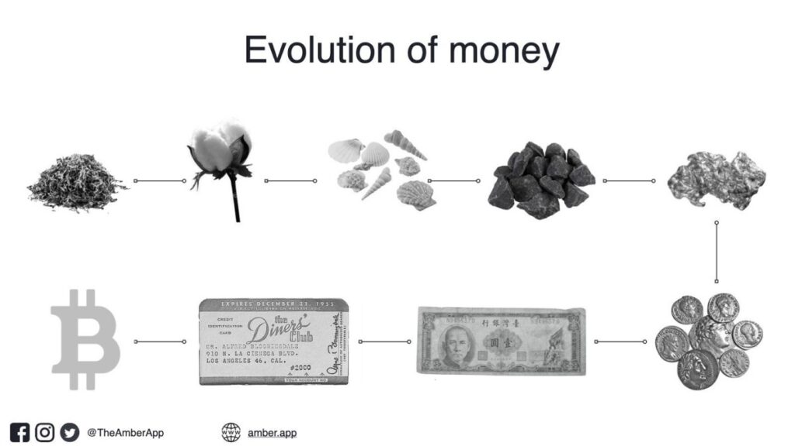
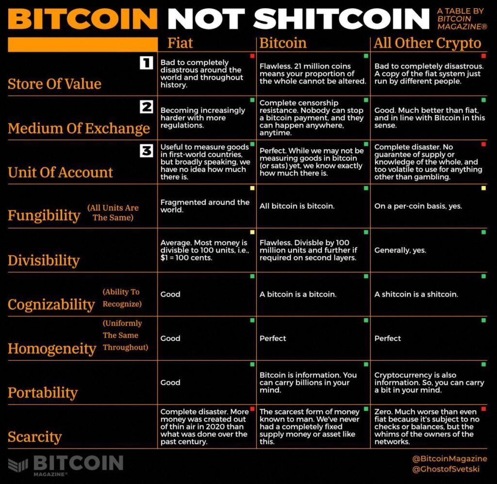
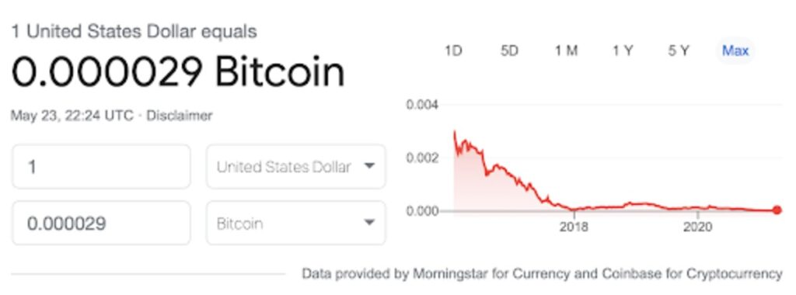
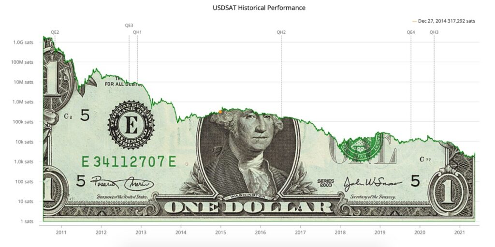
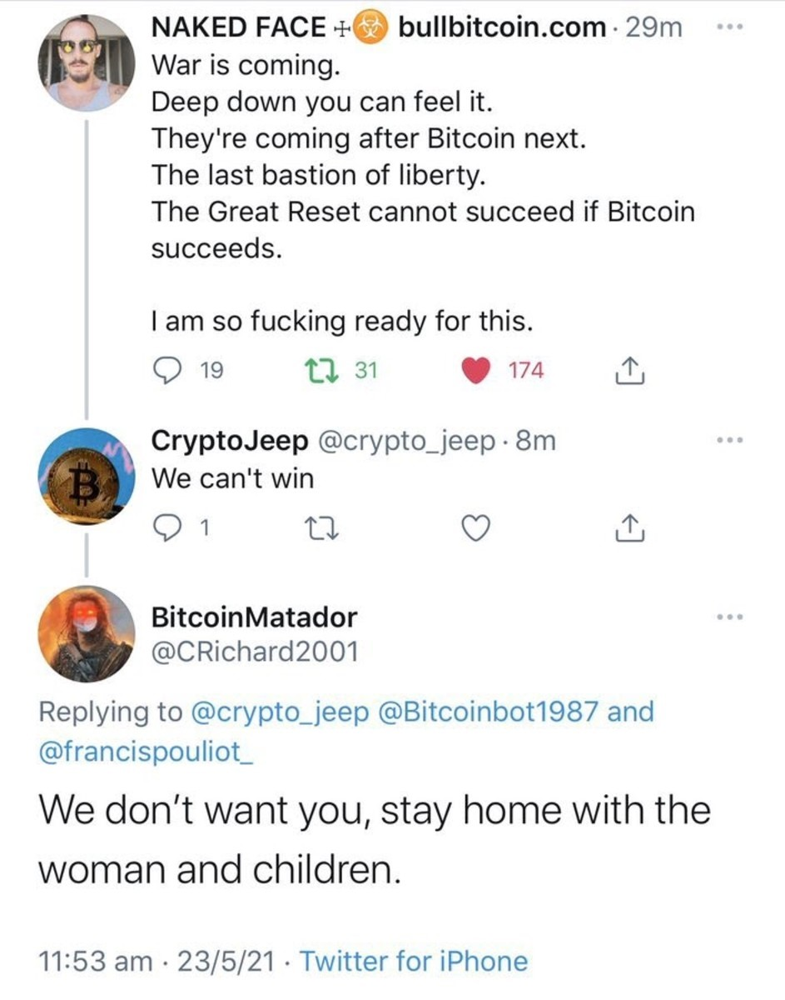
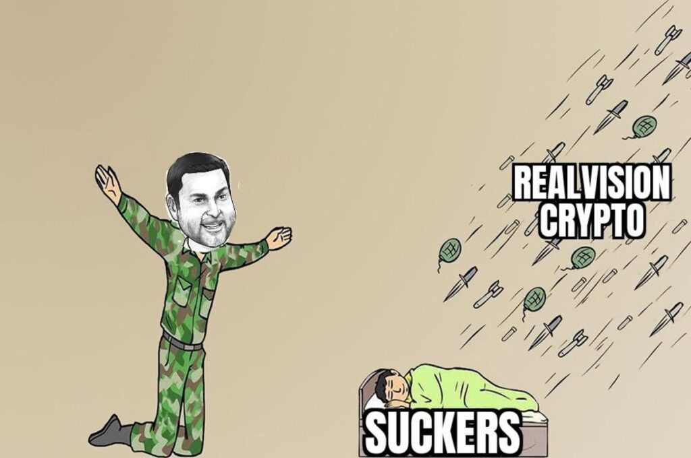

*Pista: **Más allá de Bitcoin, TODO es shitcoin.***

Frecuentemente me preguntan “qué cripto” es buena para invertir. Por supuesto, mi respuesta siempre es bitcoin. Punto. 

En este artículo me gustaría desplegar los fundamentos desde tres ángulos: 

-   Económico
-   Filosófico
-   Moral

Todos están interconectados y superpuestos uno con el otro. Si eres un bitcoiner, espero que esto te recuerde por qué estamos aquí. Si eres un no-coiner o multi-coiner, espero que esto ayude en tu camino a entender por qué los bitcoiners somos tan enfáticos sobre esto.

No es estrechez mental, si no haber llegado al momento de la verdad. Tenemos una sola oportunidad para derrotar al Goliat. Perder el tiempo en distracciones no ayuda, ni a mí ni a nadie. 

Comencemos.

## El Fundamento económico

En un marco temporal suficientemente largo, toda criptomoneda, acción, bono, bien raíz, dinero emitido por gobiernos, o activo de cualquier tipo tenderá a cero cuando se mida el precio en el dinero más duro y honesto que jamás haya surgido.

Y no ocurrirá por un decreto fiat de alguna organización o institución. Ocurrirá por pura selección natural económica, o lo que me gusta llamar “Darwinismo Económico”.

### El dinero es la piedra angular de toda civilización

Es cómo almacenamos e intercambiamos el fruto de nuestro trabajo, y cómo medimos subjetivamente nuestros aportes individuales a la sociedad. Es el tejido que nos une. Nos permite cooperar a través del tiempo y el espacio, tanto en escala como en mayores grados de complejidad. El dinero siempre existirá. La única cosa que cambia y evoluciona con el tiempo son las cosas que usamos como dinero.

Ahora hemos llegado al punto donde el dinero puede ser representado de forma perfecta. 

### El dinero es el mercado más grande

No hay segmento más grande del mercado global. No es la energía, ni los alimentos, ni el transporte, ni el gobierno, ni la industria del entretenimiento, ni la salud. Nada por el estilo.

El dinero es más grande que todos ellos, porque representa la suma de todos ellos. 

Hoy, dado que tenemos dinero quebrado, muchos de nosotros poseemos diferentes activos con diferentes atributos para así resguardar valor y proteger nuestra riqueza. Pero, con el surgimiento del dinero perfecto, que es inmune a la confiscación, inflación o corrupción, que puede ser transportado a cualquier lado, enviado o recibido por cualquiera, sin tener que pedir permiso, veremos a esos activos perder su prima monetaria a medida que dejen de ser utilizados como reservas de valor.

A medida que Bitcoin se transforma en unidad de cuenta, con todos los otros bienes, servicios y cualquier cosa de valor medidos en bitcoin, el poder de compra de un bitcoin entero tenderá hacia alturas que pocos podrían imaginar hoy. 

Mi amigo [Knut Svanholm](https://medium.com/u/f12c589770d1) lo resumió de la forma más precisa: 

Todo lo que hay, dividido por 21 millones.

### Necesidad Económica

A medida que más gente se dé cuenta de que el fruto de su trabajo (es decir, su riqueza, ahorros y dinero) está siendo constantemente erosionado, buscarán almacenarlo en algo que no puede ser diluido. Bitcoin es la mejor opción posible. Es accesible en todo el mundo, y puede ser guardado como información pura, sin posibilidad de adulterar ni confiscar. 

Ya seas rico o pobre, de derecha o izquierda, empleado o empleador, cada vez es más importante guardar tu riqueza en algún lugar seguro. 

De la misma manera que no trabajarías toda la semana para recibir sal de tu empleado como forma de pago, a medida que pasa el tiempo, menos personas van a aceptar dinero fiat emitido por el gobierno, o dinero creado por algún desarrollador al azar como forma de pago para alguno de sus bienes o servicios. 

De hecho, las generaciones futuras estudiarán esta época y se preguntarán cómo, en  nombre de todo lo sano, creíamos que medir nuestra riqueza en dinero o moneda emitida por algún gobernante supremo, que lo devaluaba con el tiempo, tuvo sentido. Es antitético a la noción de progreso y libertad. 

### Bitcoin es dinero perfecto

Bitcoin es superior al resto de las formas de dinero porque representa perfectamente cada atributo de la meta-idea de qué es dinero. Es código abierto; siempre en funcionamiento; una oferta no solo fija, sino conocida; verificable por cualquiera; voluntario; sin carceleros; digital y directamente arraigado en la segunda ley de termodinámica. Como resultado, lleva a cabo las funciones del dinero de forma perfecta. 

-   **Es la reserva de valor perfecta:**Sé exactamente cuánto tengo en relación al total, y sé que no puede ser diluido, alterado o cooptado. 
-   **Es el medio de intercambio perfecto:**Puedo enviar lo que quiero, a quien quiero, cuando quiero, y no hay poder en el universo que me lo pueda impedir. 
-   **Es la unidad de cuenta perfecta:**Puedo medir todos los otros bienes y servicios en sats y a medida que aumenta el poder de compra, su naturaleza puramente digital nos permite continuar con la subdivisión de unidades para poder medir bienes y servicios más elementales y fraccionales, para siempre.

### El mejor dinero siempre gana. 

No hay escenario donde Bitcoin pierde, porque el mejor dinero siempre gana por la mera fuerza de la selección natural y supervivencia. 

El oro y la plata emergieron victoriosos de una guerra monetaria que se extendió por milenios. Los pagarés respaldados en oro luego destruyeron a la plata. El oro fue más tarde derrotado por su propio Leviatán: el estado-nación *fiat.*  

Ahora Bitcoin surge como el alfa-omega del dinero, y afectará parte del valor de otros activos cuyo precio incluye una prima monetaria.

Ya ha estado ocurriendo ininterrumpidamente durante los últimos 12 años. Mide *cualquier* activo del mundo contra bitcoin y encontrarás que se ha depreciado entre un 90% y 99% respecto de bitcoin, desde su creación. 

Y este solo es el comienzo. Bitcoin ni siquiera ha comenzado a comerse a las clases de activos más grandes. 

Cuánto más tiempo muestra el gráfico, peor luce para el dólar. 

*usdsat.com*

Es un gráfico logarítmico para que la caída no parezca tan drástica, pero podrás ver que el dólar se ha devaluado varias órdenes de magnitud frente a bitcoin.

Mira el gráfico completo y los datos aquí: 

3.104 sats ([*este sitio web es un monitor en vivo del precio del dólar medido en satoshis*](https://usdsat.com/))

## Efectos de red convergentes

**El dinero, como el idioma, tiene una red convergente, es decir que es más útil cuando existe un estándar común.** 

De hecho, el transporte, la transmisión y comunicación de cualquier medio convergen en estándares comunes para optimizar su eficiencia.

Los tienes a la vista: 

-   La pila de protocolos que representa internet: TCP/IP, HTTP
-   La trocha de las vías de tren (que es la misma trocha que las carrozas romanas)
-   Los tamaños de los contenedores de transporte
-   Las vocales y consonantes de cualquier idioma 

El dinero es el idioma y medio de transmisión de energía más grandioso y antiguo de todos. Es como medimos, almacenamos e intercambiamos la acción humana y ha estado con nosotros desde el comienzo de los tiempos. 

Como consecuencia de esto, el dinero es un juego donde el que gana se lo lleva todo. 

Como el dinero es el idioma más importante de todos, y naturalmente, cada individuo va a querer elegir aquello que mejor cumpla cada una de las funciones del dinero, el más robusto, sano, y poderoso es el que prevalece frente al resto. 

Hoy, el dólar tiene el dominio supremo, pero no por mérito sino que es impuesto por una camarilla. Bitcoin *será* el estándar global, y no por algún decreto fiat o la fuerza de un estado-nación, sino lo hará a través de la selección natural y de mercado. 

Eso es lo que lo hace tan poderoso. 

## El fundamento filosófico

El argumento económico en favor de bitcoin surge de la filosofía de Bitcoin y los principios que lo representan. Bitcoin es optar por “reglas” y no “reguladores”. 

Esto ocurre por una serie de atributos de mercado que tiene, y porque ha surgido orgánicamente de un orden ruta-dependiente. Las tres innovaciones centrales de Bitcoin son: 

1.  Escasez digital
2.  Consenso autónomo
3.  Inmutabilidad digital

Esto es consecuencia del momento “cero-a-uno” que ocurrió el 3 de enero de 2009 con el bloque génesis de Bitcoin. 

La inmaculada concepción ha ocurrido y el sendero que Bitcoin ha recorrido no puede ser repetido. Fue una creación singular y una serie de caminos que se dan una vez en la historia. 

Ahora tenemos dinero perfecto y una red monetaria perfecta que cualquier persona, en cualquier lugar puede usar y/o construir sobre. 

Este es el futuro, y lo que siguen son los elementos que hacen única a la filosofía de Bitcoin. 

**Descentralización**

La palabra “descentralización” es usada a menudo, pero no significa mucho más allá del contexto de control actual o verificación barata a nivel individual.  

En 2017, tuvimos la guerra de los tamaños de bloques con una facción de bitcoiners que creían que la capacidad de procesamiento de transacciones en la capa base era más importante que asegurar que la red podía ser auditada de la manera menos costosa posible. 

Múltiples *forks* de Bitcoin se separaron de la cadena principal, e incluso hubo un intento por mineros y grandes *exchanges* de forzar a la red para que duplicara el tamaño de los bloques como parte de un “punto medio razonable”. 

Y también fracasó, mostrando no solo la resiliencia de la red frente a un ataque (interno o externo), sino la naturaleza descentralizada inherente a Bitcoin. Los ciudadanos de la red y los operadores de nodos rechazaron las versiones corporativas y feudales de Bitcoin, y los HODLers se mantuvieron firmes respaldando a Bitcoin, con su dinero, y no a una copia de mala calidad. 

Hoy es más barato que nunca correr tu propio nodo, y por eso la topografía de la red Bitcoin está cada vez más descentralizada. De hecho, es la única red en la que puedes ser ciudadano de primera clase haciendo cumplir las reglas del consenso de Bitcoin ¡por menos de $100! 

Ethereum, por ejemplo, está tan inflada que NO PUEDES descargar la cadena de bloques y correr un nodo. De hecho, empeorará mucho más cuando migre a *proof of stake,* donde los 32 ETH requeridos para ser un validador excluirá al 99% de la gente. En otras palabras, Ethereum será manejado por aquellos con todo el ETH. Me suena igual que la banca central moderna.

Los BCashers, BSvers están en el mismo barco. Eligieron escalar su capa base de manera lineal incrementando el tamaño de bloques. Además de los bloques vacíos (es decir, nadie está usando estas cosas), esto ha resultado en una cadena hinchada y con *un único* grupo de validadores (solo mineros). No hay operadores de nodos en estas redes y cuanto más crezca la cadena, y más basura pongan en ella, los operadores, similar a los centros de datos, van a necesitar de cada vez más infraestructura no solo para minar si no para guardar la cadena de bloques, llevando a la centralización total.

Ellos ya están ahí. BSV es básicamente manejada por una sola compañía: CoinGeek. Bcash por Roger Ver. Menos mal que eran descentralizadas. 

Los sacrificios hechos por bitcoin y por la red Bitcoin han sido naturalmente seleccionados para asegurar la máxima descentralización, y por lo tanto, la máxima aversión al cambio de cualquier tipo. Allí es donde radica su fuerza como *estándar.* 

Nic Carter escribió una pieza brillante sobre los sacrificios de Bitcoin acá: “[Bitcoin muerde la bala](https://medium.com/@nic__carter/bitcoin-bites-the-bullet-8005a2a62d29)”.

### Capas

La naturaleza escala en capas. La ingeniería escala en capas. Toda la cooperación humana escala en capas. Las redes de comunicación, los medios de transmisión de energía y todas las redes que conocemos escalan en capas. 

El diseño en capas de la red Bitcoin está en línea con lo que funciona. 

No solo es imposible hacer todo en una sola capa, si no que es una búsqueda absolutamente ridícula. 

Todo lo que agregas comienza a impactar en otros elementos. Lo que la gente no se da cuenta (como los planificadores centrales y burócratas) es que toda acción tiene una reacción y que cada decisión tiene un costo o una consecuencia. 

En el ejemplo anterior, habrás notado que al intentar incluir más transacciones y datos en la capa base se torna más costoso para la gente correr un nodo, impactando la descentralización de la red. 

Lo mismo ocurre cuando se intenta hacer privada la capa base. El costo de hacer esto es sacrificar la verificación y auditoría de la cadena principal. Ese no es el precio que debemos pagar, especialmente cuando podemos llevar la privacidad a una capa más alta. 

Una de las fortalezas de Bitcoin está en su lenguaje de código nativo, que permite la codificación de contratos simples. Esto permite las abstracciones como capacidad de procesamiento de transacciones, autorizaciones multipartes y privacidad *sin* impactar en la seguridad, descentralización e inmutabilidad de la capa base. 

De hecho, le permite a Bitcoin escalar exponencialmente en múltiples dimensiones . Con Lightning, por ejemplo, cualquiera puede ser un nodo para transacciones, lo que implica un aumento geométrico en las transacciones que puede procesar. 

Esto es increíble e importante, pero parece ser olvidado por los pensadores lineales. 

Finalmente, la naturaleza en capas de Bitcoin quiere decir que no solo el efecto de red se fortalece y se combinan entre ellas, si no que la red cada vez está más y más descentralizada. Cuando introducimos nuevas capas en la red, cada una con sus intereses, haciendo más difícil que cualquier participante, grupo o capa tenga influencia sobre otra. 

Es inventar la perfección. 

### Resistencia a la censura

Cuando la gente habla de descentralización no se da cuenta que en verdad se trata de un medio para un fin más importante. 

El fin es la resistencia de la red al cambio y la censura.

Este es, categóricamente, el atributo más importante para el dinero digital global. Algo cuya oferta no puede ser alterada, cuyas funciones como medio de intercambio no pueden ser censuradas y cuyas reglas no pueden ser dirigidas por nadie. 

Y cómo Bitcoin logra todo esto?

### Costo

Bitcoin transforma la energía cruda, vía trabajo computacional (algo que no puede ser falsificado) en energía monetaria, otorgándonos una garantía termodinámica de verdad. Esto es mejorado aún más por la distribución de los operadores de nodos completos, HODLers de bitcoin, operadores de segunda capa y protagonistas de la infraestructura en todo el mundo. 

No hay cantidad de dinero disponible o coordinación posible para intentar cooptar la red. El gato está fuera de la caja. 

Para aprender más acerca de inmutabilidad y seguridad como funciones del COSTO (es decir, prueba de trabajo), no “blockchain”, vea los capítulos iniciales de  [*The Bitcoin Times*, “Edition One](https://sites.google.com/getamber.io/thebitcointimes/)” y “[Breaking The Blockchain.”](https://medium.com/the-bitcoin-times/breaking-the-blockchain-14f596b2aa2e)

### Verificación

Como mencioné en la sección de descentralización, una de las principales propuestas de valor de Bitcoin es que cualquiera, en cualquier lado puede verificar las reglas y estado de la red, en cualquier momento. 

De hecho cualquiera que lo hace está aplicando las reglas de la red a nivel local. 

La verificación sencilla, barata, simple, y rápida está en el núcleo de lo que hace a Bitcoin no sólo robusto, sino extraordinariamente descentralizado. 

Esto es descentralización práctica, económica y real. No es una teoría de patrañas promovida por académicos que construyeron un “modelo” en su computadora y ahora afirman haber creado un “coeficiente de descentralización”. 

La progresión es la siguiente: 

Verificación → Descentralización → Resistencia a la censura

### Individualidad

Bitcoin no es democrático. Es puramente anárquico. 

Sus reglas se aplican a nivel individual. Cuando corro mi nodo, aplico las reglas de Bitcoin sólo para mí. Ocurre que también estoy alineado (o en consenso) con otros millones que están corriendo las reglas de Bitcoin para ellos mismos también.

No estamos obligados a estar de acuerdo. Nadie nos lo ha “ordenado”. No estamos organizados por una autoridad central. Lo corremos de forma local, y alcanzamos consenso global. 

Esta es la perfección del libre mercado en acción. De hecho, es el sueño agorista, voluntarista, libertario y anarcocapitalista. 

Es una red con reglas, que nosotros hacemos aplicar como individuos y queda en el resto de los que están de acuerdo en aplicar las mismas reglas.

A diferencia de los modelos colectivistas bajo los que vivimos, donde mi opinión tiene un impacto en la vida, propiedad o libertad de los demás, y viceversa, Bitcoin es una forma de puro individualismo voluntario. 

Mis decisiones no tienen repercusiones sobre ti, ni las tuyas sobre mi. De hecho, esta es la clave de la inmutabilidad de Bitcoin. Cualquiera es libre de irse e inventar sus propias reglas Bitcoin o cambiarlas según deseen. No tiene impacto en mi ni en el resto de los bitcoiners que adoptamos y estamos haciendo cumplir las reglas de consenso de Bitcoin para nosotros. Los que cambien las reglas simplemente se “bifurcarán” hacia su propia red. El resto de nosotros continuará como si nada hubiese pasado.

La defensa de Bitcoin es la apertura completa. No hay nada que alguien pueda hacer para cambiar Bitcoin para mi. Tú solo lo puedes cambiar para ti.

### Voluntario

Bitcoin es una fuerza de la naturaleza que emerge en el vacío de la fuerza y coerción. Bitcoin no te “hace” hacer nada. No le importa si lo compras, si lo guardas, si lo gastas, si lo envías o si lo recibes. Bitcoin está ahí, y lo que hagas con eso es tu decisión. 

Los gobiernos y bancos centrales, por el otro lado, te fuerzan, a punta de pistola y bajo la amenaza de ponerte en la cárcel, a usar su dinero. Si su dinero es tan bueno, ¿por qué tanta hostilidad? ¿Por qué hay leyes de curso legal? ¿A qué le tienen miedo? ¿Y qué hay sobre los doble estándar?

¿Por qué es perfectamente legal para ellos imprimir y crear dinero de la nada, pero si lo haces tú, te arrojan en prisión o aparece la rodilla de un policía sobre tu garganta que te comienza a asfixiar? 

En cualquier momento que estás obligado a utilizar y aceptar algo, tienes que saber que es algo inferior. Saber que tú eres el producto. 

Bitcoin está ganando y no a través de la coerción, si no por mera selección natural. 

Pese a la fuerza, pese a las amenazas, pese al llamado “poder y promesa de los gobiernos del mundo”, bitcoin continúa ganando cuota de mercado. Continúa sofocando al papel que falsifican los gobiernos e intentan hacerlo pasar por dinero.  

Durante los últimos 12 años, Bitcoin empezó en $0, y desde ese momento, cada una de las monedas nacionales que son impuestas por burócratas gubernamentales han perdido un 99% de su valor frente al bitcoin. Y esto es solo el comienzo. 

Ver [usdsat.com](https://www.usdsat.com/) y [casebitcoin.com](https://casebitcoin.com/) para obtener una visión clara y empírica de las estadísticas de Bitcoin desde sus inicios. 

### No hay cabeza de serpiente que cortar

Algo ocurrió con Bitcoin que nunca podrá replicarse porque se trató de un evento único irreproducible, es la desaparición de Satoshi. Repasemos: 

-   Bitcoin surgió como una innovación de cero-a-uno. 
-   En un momento donde se pensaba que era algo imposible.
-   Fue sembrado durante la crisis financiera global de 2008, con un mensaje claro y profundo. 
-   Fue recogido por pioneros *cypherpunks* y libertarios. 
-   Fue descartado, ignorado, menospreciado y ridiculizado por todos los demás. 
-   Continuó ganando popularidad de forma silenciosa. 
-   Fue utilizado en Silk Road, lo que prueba que no puede ser detenido. 
-   Su prueba de trabajo creció, así como el número de nodos, HODlers, creyentes y la infraestructura necesaria para mudar a la gente de fiat a bitcoin. 
-   El creador desapareció y se lo dejó al mundo, para que hagamos lo que nos parezca. 

Hubo una ventana de tiempo para matar a Bitcoin, y eso fue durante los primeros pocos años de su vida. Sin embargo, fue objeto de burlas. Ahora el gato está realmente fuera de la caja. 

A diferencia de Ethereum o cualquiera otra *shitcoin* que ande por ahí, que el gobierno quiere cooptar o cerrar, no puede llamar a la oficina del director. Bitcoin es imposible de apagar, no hay un interruptor. No hay botón de “apagado”. Bitcoin sobrevivirá a la internet, a la grilla eléctrica y a todos nosotros. De la misma forma que no se puede matar una idea, no se puede apagar información. La información vive dentro de nosotros, a través de nosotros y a alrededor de nosotros. Este es el regalo que nos dio Satoshi cuando desapareció. 

Por esto, será recordado en la Historia como el mayor héroe de todos los tiempos. 

## El Fundamento Moral

El argumento moral se desprende de la filosofía de Bitcoin. 

### Reglas, no gobernantes

La *raison d’être* de Bitcoin es la eliminación de quienes hacen las reglas y pueden dictaminar arbitrariamente el beneficio de un grupo a expensas de otro. 

Es un estándar monetario, construido sobre reglas que son voluntariamente aplicadas por cada individuo que es parte de la red. Bitcoin es lo opuesto a cualquier tipo de fiat, ya sea emitido por un gobierno, por un individuo o por un grupo de cripto nerds que aspiran a ser los futuros señores feudales. 

Este es el motivo por el cual Bitcoin es odiado intensamente por estatistas, banqueros centrales, burócratas, blockchainers, shitcoiners, gente de fintech, traders, analistas macro y guerreros de justicia social de todos los tipos. 

Todos ellos quieren que *tú* les sirvas a *ellos.*

Bitcoin permite ponerte de pie con tus hombros erguidos, tratarte a ti mismo como alguien que importa, y no ser un *subalterno de nadie.* 

Bitcoin es una herramienta para la máxima libertad y soberanía personal, y los Bitcoiners son tus compañeros y compañeras de batalla, que quieren lo mejor para ellos mismos y te alientan a que quieras lo mejor para ti. 

Bitcoin es *la* herramienta económicamente más perfecta, diseñada para tirar abajo el sistema financiero tradicional corrupto, que ha destruido familias, el medioambiente, la educación, la moral, los recursos y el tiempo. Los bitcoiners son guerreros pacíficos que sostienen esta visión y no se echan atrás. 

Por este motivo soy bitcoiner. Hay una gran diferencia entre nosotros y el resto de la industria “shitcoin”. La siguiente captura de pantalla lo resume bien:

### Guerreros, no oportunistas baratos

Siempre puedes diferenciar a una persona de “cripto” o de las finanzas tradicionales por su miedo irracional a perder el control y permitir que la gente decida por sí misma, o su incesante necesidad de controlar todo y el deseo de ser quien haga las reglas. 

Es en verdad bastante patético y eso debe desprenderse de una inseguridad ubicada en lo profundo de su psiquis. Al no tener ninguna disciplina personal, necesitan validarse proyectando su control sobre los demás. 

También te darás cuenta de la diferencia entre bitcoiners y el resto de la gente en finanzas y shitcoins debido a los motivos por los que están aquí. 

Los bitcoiners resguardan sus monedas en almacenamiento frío y *nunca* lo tocan. Se esforzarán hasta el máximo para generar más valor en la sociedad así pueden almacenar su nueva riqueza también en bitcoin. Al hacerlo, no solo están ahorrando para el largo plazo y bajando su consumo personal, si no que son productores netos que están quitando su aportes económicos al sistema financiero tradicional. *Están matando de hambre a la bestia.* 

Los shitcoiners y traders, por el otro lado, intentarán apostar su camino hacia la riqueza en fiat. En vez de trabajar en cosas significativas, están empeñados en perder su tiempo haciéndose ricos rápido, leyendo hojas de té en gráficos. Agregan cero valor a la sociedad. Este tipo de apuestas es una de las enfermedades de la sociedad moderna, y algo que Bitcoin fundamentalmente se opone. 

Uno de los más brillantes artículo sobre cómo Bitcoin de-financiarizará al mundo fue escrito por [Parker Lewis](https://medium.com/u/4860f822b31a) de Unchained Capital: “[Bitcoin Is The Great Definancialization.”](https://medium.com/the-bitcoin-times/bitcoin-is-the-great-definancialization-65b4c27a8371)

### De cero a uno y no de uno a la N

Bitcoin es la transformación de dinero y finanzas que reemplaza a gobernantes con reglas transparentes y verificables, que cualquiera puede optar por participar de forma voluntaria. Crypto, por su propia naturaleza, es la réplica del sistema financiero tradicional, en donde quienes manejan los hilos simplemente son reemplazados por otro grupo. 

En vez de Jerome Powell y Christine Lagarde tenemos a Vitalik Buterin y Charles Honskison. Sale un grupo de megalómanos, entra otro. 

Esto no es ni interesante ni deseable. 

Solo porque Ethereum y Cardano comparten alguna similitud digital con Bitcoin eso no quiere decir que sean parecidas a Bitcoin. Tienen un emisor, tienen una fundación, tiene un grupo principal de operadores que decide cuáles son las reglas. Tiene sus propios equipos de protección de caídas, directorios y “equipo clave”. Los fundamentos filosóficos sobre los que estas tecnologías están construidas no son diferentes a los gobiernos y bancos centrales del estado-nación moderno.

Todas las charlas sobre “gobernanza” y la adulación a sus creadores como si fueran héroes lo hacen tan evidente que tienes que ser un ignorante por decisión para no verlo. 

*El mundo no necesita nuevos gobernantes.* 

El mundo necesita dinero y una red monetaria de la que nadie puede beneficiarse a expensas del otro. El mundo necesita *skin in the game*, movilidad social y una igualdad de oportunidades monetarias donde las personas productivas puedan ascender sin importar quiénes son o de dónde vienen. 

### Héroes tóxicos

Los bitcoiners son llamados por todo el mundo tóxicos, intolerantes, amebas y cualquier otro nombre disponible por ahí. Nosotros adoptamos cada uno de esos nombres y lo transformamos en memes. Somos como máquinas de reciclaje de insultos. Lo más avanzado en una comunidad antifrágil. 

No encontrarás esto en ninguna otra parte. Es un sistema inmune de glóbulos blancos.  

Lo hacemos porque sabemos que Bitcoin es la única oportunidad que tenemos. Los bitcoiners son las personas más valientes, desinteresadas, gallardas y directas que te encontrarás porque podrían haber vendido fácilmente su alma a alguna organización shitcoin y promocionarte alguna basura. Ellos han estado en esto durante mucho tiempo y podrían ganar una comisión por ello, pero no lo harán.

#### *Bitcoiner*

Es la *única* comunidad que no gana nada a nivel individual cuando *tu* compras bitcoin. A menos que compres miles de millones de dólares en bitcoin, *tú no* tienes ninguna influencia en el precio de bitcoin o en mi riqueza personal. Bitcoin no tiene departamento de marketing que me pague para decirte que compres bitcoin. 

Todas las otras shitcoins son diferentes. Literalmente le pagan a la gente para vender su producto, lo que significa que *tu* eres el idiota que les compra. 

#### *Shitcoiner*

Hacemos guardia en las puertas y denunciamos estas conductas. Lo venimos haciendo desde el día uno, y pese a la imagen que da, continuamos haciéndolo, porque sabemos por qué estamos aquí. 

Estamos orientados en la misión. Y esa misión es fundamentalmente salvar el mundo. 

Estamos acá para salvar la especie humana, su tiempo, energía y recursos. Pero no por algún decreto, sino alentando a todos y cada uno de ustedes a convertirse en un individuo responsable y soberano que es dueño del fruto de su trabajo. 

Estamos en esto para largo. 

### TIEMPO Y BASURA

Los bitcoiners reconocen que la plaga más grande de la humanidad es la basura. La basura en términos de recursos naturales y energía que utilizamos, y el tiempo que la usamos. 

A nivel fundamental, el dinero representa tres cosas: 

-   Tiempo
-   Energía
-   Recursos Naturales

El dinero fiat es la creación que genera más basura en el planeta precisamente porque no mide nada de esto. De hecho, crear y despilfarrar caprichosamente dinero de la nada, significa que el precio que “el sistema” paga es su completa destrucción y pérdida irreversible. 

Cuando el gobierno crea una pila de dinero de la nada, se filtra por la economía y es utilizado para transformar recursos escasos en alguna basura plástica que no necesitamos, pero que puede ser comprada ciegamente por alguna persona cuya preferencia personal de tiempo haya sido distorsionada. 

Escribí sobre esto en profundidad en una pieza que te aliento a leer: “[Fiat, Fascism And Communism.”](https://svetski.medium.com/fiat-fascism-and-communism-d185e66733b)

Cripto, fiat y el resto de estas maquinaciones obsoletas no existen para eliminar la basura del sistema, sino para crear más basura y confusión, mientras que un puñado de privilegiados se hacen ricos a expensa tuya.

Es una locura. Y el problema es que la gente está tan decidida a intentar lograrlo y “ganar” el juego de suma cero que se olvidarán de la cautela y no les importará arruinar su reputación, recursos, tiempo y energía para “ganarse una moneda”.

Es un estado de situación triste y nihilista, y uno en el cual Bitcoin cambia en su epicentro, pero que llevará tiempo cambiarlo. 

Esta es la razón por la que es hora que pelees por lo correcto. Es hora de que te unas y verdaderamente marques una diferencia, poniendo tu dinero, tu sangre, sudor y lágrimas donde importa. 

No hay nada en la tierra hoy que tenga un impacto más positivo en el largo plazo porque ninguna otra cosa cambia la base de incentivos para el individuo (y por lo tanto, su comportamiento) como lo hace Bitcoin. 

Cuanto antes seas parte de este cambio, mejor será para ti y para el planeta. Para más sobre esto, lee a Jordan Peterson sobre Bitcoin aquí: “[Bitcoin, Hierarchy And Territory.”](https://bitcoinmagazine.com/culture/bitcoin-hierarchy-and-territory)

## Para cerrar

Bitcoin es profundo y único, y no por una razón particular que nombre aquí (apenas tocamos las razones tecnológicas), sino por *todas* ellas combinadas. 

Es un sistema emergente, complejo, desarrollado dependiente de su camino, y en un ambiente adverso desde el día uno. 

Esto no puede ser replicado sin importar cuánto lo intenten. Es lo más cercano a una inmaculada concepción que jamás haya ocurrido. 

Pero… pese a todo lo que he dicho muchos de ustedes continuarán siendo nocoiners o shitcoiners. Dirás, “Está bien, yo puedo vender a Bitcoin” o “No lo necesito” o “No puede ser tan importante”.

Y aunque esas afirmaciones no podrían estar más lejos de la verdad, te voy a dejar una verdad más dura, pero importante:  
  
Bitcoin no te necesita. *Tu necesitas bitcoin.* 

Escribí una pieza breve y brutal el año pasado donde si eres un shit o no coiner, está dedicada a ti: [Do not buy Bitcoin.](https://medium.datadriveninvestor.com/do-not-buy-bitcoin-75da73226530)

No importa si eres un individuo, una comunidad, una organización o una nación, estarás ignorando bitcoin bajo tu propio riesgo. Las decisiones que tomes hoy se asegurarán de dejar claro tu lugar en la historia: o eres una nota al pie o eres el protagonista. Elige sabiamente. 

La idea de que el mundo va a manejarse con un puñado de monedas diferentes, emitidas por millones de personas diferentes, es como asumir que todos vamos a hablar en inglés entre nosotros pero con un número diferente de vocales y consonantes. 

No solo es ineficiente, sino un mecanismo categóricamente roto de transmisión de energía  y un resabio del mundo del dinero fiat. ¿Habrá nuevas formas de dinero fiat que surjan en el mundo? Si, por supuesto, pero cada una de ellas tenderá hacia su valor moral (cero) porque cualquier idiota que apoye a un nuevo  jefe supremo solo se empobrecerá a sí mismo durante el proceso, mientras que sus jefes y héroes shitcoiners compran bitcoin, sabiendo que no puede ser derrotado. 

Hoy, Bitcoin es más fuerte que nunca y su influencia, masa económica y alcance sólo continuarán creciendo. 

**Bitcoin o shitcoin.**

**La decisión es tuya.** 

**Piensa en serio.** 

**Elige de forma inteligente.**
