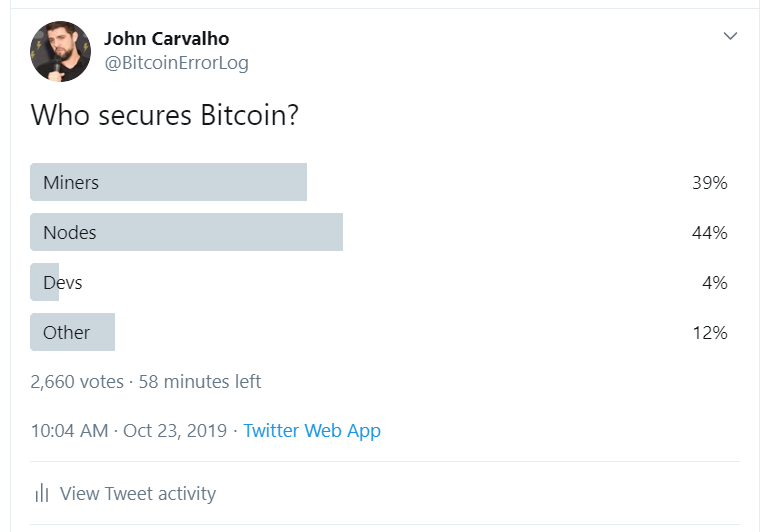
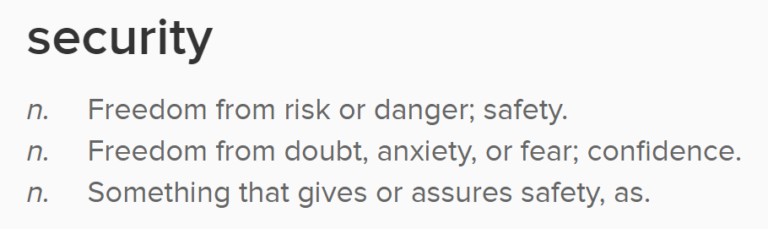
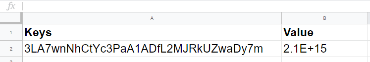

Sorpresivamente, la mayoría de las personas no saben la respuesta a esta pregunta 

44% de los encuestados no entienden Bitcoin.

Te lo aseguro, solo hay una respuesta correcta.

La comprensión de Bitcoin se comporta como un objetivo en movimiento mientras aún estamos en la fase de adopción inicial. Se necesitan años para entender Bitcoin, y cada día tenemos nuevos Bitcoiners. Los veteranos se vuelven complacientes e impacientes cuando se trata de repetir las lecciones aprendidas y las frustraciones se acumulan debido a los constantes ataques de desinformadores y delusionistas.

Entonces, en lugar de repetirlo una y otra vez a cada nuevo participante, he escrito esta publicación como referencia para la posteridad. Aunque estoy seguro de que los conceptos existen en otros lugares, y dudo que este fundamento sea nuevo, me tomó siete años resumir estos conceptos en términos simples y no técnicos.

### ¿Qué es seguridad?

Antes de decidir quién protege Bitcoin, acordemos qué significa realmente “seguridad” en este contexto. 

Mantener Bitcoin seguro significa mantener la confianza en lo que es Bitcoin.

### ¿Qué es Bitcoin?

Obtendrá las respuestas más descabelladas si hace esta pregunta, pero la verdad es tan simple y aburrida que la gente ve más allá de ella.

Bitcoin es una reserva de valor y un protocolo para administrar los derechos a los que las llaves pueden transferir el control de ese valor.

Cuando digo “reserva de valor”, lo digo en el sentido literal. Literalmente estamos asignando un valor numérico a un número de cuenta. Ni siquiera importa si todos estamos de acuerdo en usar ese valor como dinero o puntos de Internet o como un ancla para la corrupción externa.

En su forma más simple, piense en Bitcoin como una hoja de cálculo con dos columnas: llaves y valor.

¡El consenso sería mucho más simple si controlara todo el Bitcoin!

### ¿Qué significa asegurar Bitcoin?

Bueno, significa confirmar que estamos de acuerdo en lo que es Bitcoin. Asegurar Bitcoin significa llegar a un consenso sobre la información en la base de datos y un acuerdo sobre los procesos utilizados para alterar esa base de datos.

Asegurar Bitcoin es lograr un consenso sobre la base de datos y el protocolo utilizado para cambiarlo.

### ¿Qué significa el consenso?

El consenso es cuando todos los jugadores se ponen de acuerdo sobre quién es dueño de qué. Verá, Bitcoin en realidad no es inmutable en términos estrictos. Si lo fuera, no necesitaríamos el protocolo ni los mineros en absoluto. El protocolo existe para definir cuáles son las reglas para cambiar el valor almacenado. La parte inmutable es solo un historial de auditoría que prueba que los cambios pasados ​​siguieron reglas de consenso.

### Entonces, ¿quién protege Bitcoin?

Si asegurar Bitcoin requiere consenso sobre lo que es Bitcoin, y Bitcoin es una base de datos de valores asignados a llaves, y Bitcoin tiene un protocolo para reasignación de llaves, entonces asegurar Bitcoin solo puede ser realizado por… ¡su nodo!

### ¡Nodos! ¡Nodos! ¡Nodos!

Al final, USTED protege Bitcoin, pero el único momento que importa es cuando está de acuerdo con alguien más sobre lo que es Bitcoin, y la única forma en que puede expresarse con los demás es a través de su nodo.

Puede intentar abstraer esto y decir que los hodlers de último recurso lo aseguran, o que puede expresarse comprando o vendiendo, pero la única forma de comunicarse es mediante la aplicación del protocolo.

### ¿Y los mineros?

Los mineros son proveedores de bloques, nada más. Los nodos exigen bloques compatibles con el consenso como recipiente para la reasignación de llaves. La capacidad de los mineros para influir en el protocolo se limita al margen de maniobra dentro de los números mágicos del protocolo.

Por ejemplo, pueden limitar el tamaño del bloque si pueden cooperar y coordinar sobre incentivos compartidos, y pueden excluir transacciones de la misma manera. Pero cuando un minero ejerce algún poder que va en detrimento del consenso, se acerca a los riesgos elevados a un ritmo rápido.

Esta misma dinámica se aplica a las reorganizaciones, los ataques del 51%, etc. Estos ataques no solo son riesgos para los mineros en el sentido de que hay un costo en sacrificar bloques o fallar las probabilidades, sino que corren el riesgo de ser ignorados por completo y excluidos de consenso extraprotocolar, el propio mercado.

Los nodos realmente definen lo que es un “minero”.

Los mineros proponen bloques que contienen nuevas reasignaciones de llaves, y la minería (Prueba de Trabajo) es el esquema diseñado para crear un mercado confiable para el costo actual de esa oportunidad.

Los mineros no aseguran nada más que su propia relación con Bitcoin, todos los modos de ataque y falla de los mineros pueden ser trascendidos por consenso de nodos.

### ¿Qué pasa con los desarrolladores?

Muchos de los que respondieron a la encuesta anterior piensan que los tres son necesarios para la seguridad: mineros, nodos, desarrolladores. Sin embargo, los desarrolladores del protocolo Bitcoin y los mineros son en realidad adversarios del consenso.

Pero, John, ¡arreglan errores! ¡Escalan Bitcoin!

Claro, ayudan mucho a los Bitcoiners, en la práctica, agregando optimizaciones y soporte para funciones y nuevos esquemas de claves que aprovechan las cualidades de Bitcoin. Pero todos los actores que buscan cambiar Bitcoin de alguna manera son indistinguibles de los atacantes, sin consenso.

La única forma de lograr un consenso y comunicar lo que cree que es Bitcoin es con su nodo.

No todos los nodos son iguales.

No es suficiente ejecutar un nodo y expresar su consenso. Al final, solo los nodos que tienen piel en el juego impondrán una definición de Bitcoin que sea valiosa para ellos.

Esto entra en el concepto de “nodo económico”, un término que intenta capturar el concepto de un jugador en el juego de Bitcoin que ha atribuido un valor externo a su BTC y representa una carga de riesgo real como actor económico en la red.

Un nodo no económico es una señal de consenso poco confiable.

### ¿Qué es un nodo económico?

Básicamente, si no tiene exposición a BTC para asegurar, no tiene nada que hacer cumplir, por lo que no hay un incentivo significativo para actuar dentro del consenso.

Específicamente, un nodo económico es aquel que tiene transacciones que verificar. Cuando la red confirma sus reasignaciones de claves, está creando y recibiendo señales confiables de consenso.
