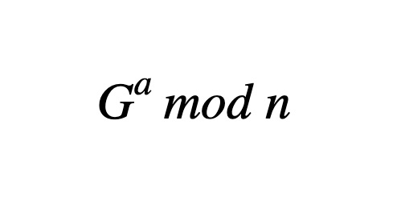
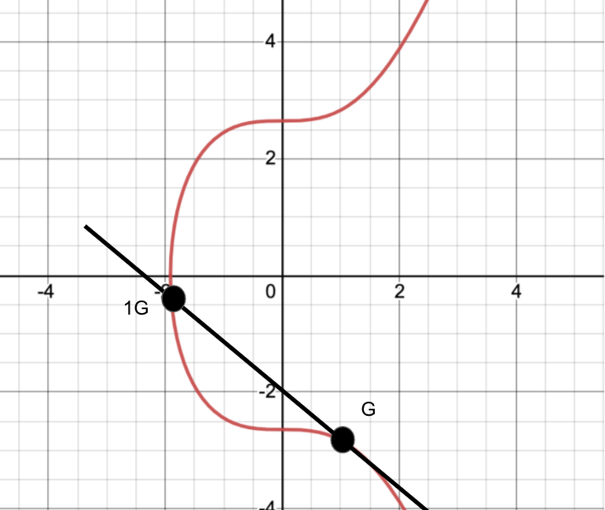

Les voy a hablar acerca de la seguridad detrás de las direcciones y llaves de Bitcoin, sobre Criptografía de Llaves Públicas. Esto incluye el algoritmo SHA-256, Generadores de Números Aleatorios o RNG, funciones Hash, y Firmas Digitales de Curva Elíptica (ECDSA). 

Si tienes preguntas además de estas, escríbeme por mensaje directo. Soy un matemático de formación con un amor profundo por las matemáticas. Si tienes interés por la criptografía como pasatiempo, existen muchas personas que crean algoritmos criptográficos por diversión, y sus comunidades pueden ser de ayuda en tu viaje. Te prometo que solo necesitarás un poco de álgebra básica, así como tener nociones de funciones exponenciales. Si estás familiarizado con la aritmética modular, genial. Si no, no hay mayor problema.

La criptografía existe desde hace miles de años, y actualmente tiene una comunidad de profesionales y aficionados bastante consolidada. Esta tecnología viene andando desde hace mucho, y actualmente, sus iteraciones criptográficas han alcanzado tal nivel de seguridad en línea, que difícilmente tenemos que preocuparnos al respecto.  
  
Empecemos con el concepto de Criptografía de Llave Pública (Public Key Cryptography, PKC), específicamente en el contexto de Bitcoin. En un nivel básico, esta llave pública está conformada por tu llave privada y por las llaves públicas que se generan a partir de esta.  

La criptografía de llave pública (PKC) utiliza funciones “trampa” que son fáciles de resolver, es decir, es fácil generar una llave pública desde una llave privada, pero es casi imposible hacer lo contrario, encontrar una llave privada a partir de una llave pública conocida. Esto es debido a que se utiliza aritmética modular, funciones exponenciales y una gran cantidad de números primos.  

Las llaves privadas de tu bitcoin pueden ser solo palabras, pero también un número muy largo. Para ser específico, cuando empezamos a encriptar los datos, serán convertidos a una secuencia muy larga de una serie binaria (unos y ceros), sin importar cuál haya sido la forma inicial de los datos. ¡Qué meticuloso! 

Es por esto que algunos dicen que las llaves privadas “representan un número muy, muy grande” y es la razón de su seguridad. Aunque esto es técnicamente cierto en un sentido determinista o algorítmico, no es muy obvio por qué.  

La generación de llaves privadas es otra faceta. Las carteras de hardware o de auto custodia hacen esto por sus usuarios, y puede que no te digan muy precísamente cómo logran generar las llaves privadas (ventajas de ser *open source* o de código abierto).  

Defintivamente esto tiene que considerarse cuando elijas una cartera. La otra opción es crear tu propia llave privada desde cero. Puedes lanzar un dado, tirar una moneda o utilizar otro método.  

También existen generadores de números aleatorios (RNG) que han sido probados y validados por la comunidad de profesionales en criptografía. Los RNG suelen utilizar un reloj para crear una pequeña diferencia que luego de varias iteraciones logre un número único. Elige un RNG en línea bajo tu riesgo, pues, aún si es un buen RNG, puede que tenga malware.  

Así que tenemos nuestras palabras secretas, veamos que sucede luego:

Esta es una forma muy simple de nuestra función trampa. ‘G a la a módulo de n” representa nuestra llave pública final. Mod es la abreviatura para referirnos a la aritmética modular, que restringe nuestra respuesta a unos números limitados, caso contrario al de los números naturales.

Pero aún conociendo G y n, no existe forma sencilla de conseguir a, que representa a nuestra llave privada. Calcular G al módulo de n es relativamente fácil, pero no hay vuelta atrás, gracias al Problema de Registro Discreto (Discrete Log Problem). N es generalmente un número primo elevado, porque por definición, no se pueden factorizar.  
  
Si la complejidad relativa de las funciones o problemas te interesan, siéntete libre de investigar sobre la Complejidad de Tiempo Algorítmico.  
  
Ahora vamos a profundizar, y ver gráficamente la función para entenderla mejor.

La línea roja es nuestra curva, y es la que específicamente utiliza el Algoritmo de Firma Digital de Curva Elíptica (ECDSA). G es el punto de partida, es nuestro “generador”. Luego, vamos a sumar G más G, aunque no es una suma en el sentido más usual. En este caso, sumar significa que vamos a tomar la línea tangente de este punto. Donde esa tangente se cruce con la curva, allí será nuestro siguiente punto. Nuevamente, tomaremos la tangente y encontraremos un nuevo punto. En la práctica, en una computadora, esto se hace miles de veces, o quizás millones. El resultado final es que, aún si sabes dónde empezaste, no sabrás cuántas veces G se sumó a sí misma hasta llegar al punto final.

El número de veces que se haya realizado la suma, será tu llave privada (o número privado). De nuevo, esto es fácil de chequear una vez dada la respuesta potencial, pero casi imposible de descubrirla aplicando “fuerza bruta”. 

*Voila!* Así tenemos nuestra primera pieza de información determinística, pues cada entrada o input te genera una respuesta, pero no es un formato muy grande. Actualmente solo es un par (x,y). Ya que tenemos la llave pública, derivada de una privada, mezclemos toda esa información y transformémosla de nuevo.

Haremos esto mediante SHA-256, cuyas siglas representan “Secure Hashing Algorithm” o Algoritmo de Hasheo Seguro. Un algoritmo de hash o hasheo (hashing algorithm) es un set específico de pasos aplicados a una información, que resulta en un set de datos encriptado y con una extensión determinada, indiferentemente de la extensión de la información insertada inicialmente (input).

Y sí, esta familia de algoritmos fue desarrollada por el gobierno de Estados Unidos, pero no te preocupes. La belleza de las ciencias aplicadas, incluyendo las matemáticas, es que el conocimiento y los descubrimientos destacan por sí mismos independientemente de quién los desarrolle. 

Por esto tenemos pruebas. Si una prueba es sonante, entonces puede sostenerse a sí mismo y no puede ser hackeada o evadida. La familia SHA2 es de conocimiento público. Puedes irte a Internet y ver el código, y si gustas, utilizar SHA-256 tú mismo para encriptar algunas cosas. Encontrarás que cada cambio en el input (entrada)  generará una respuesta diferente en el output (salida). La teoría del caos es hermosa.En fin, mientras más personas busquen asegurar miles de millones de dólares con SHA 256, también se gastará mucho dinero en poner a prueba esa misma seguridad. 

Frecuentemente se menciona la computación cuántica como una forma de romper esta criptografía. Mientras que la computación cuántica se está haciendo cada vez más probable, hay mucho más dinero que robar en los 5 principales bancos del mundo.

Estoy seguro que Bitcoin está muy lejos de ser considerado para ser hackeado, pues una vez sea atacado, su valor se reduciría dramáticamente. Habiendo dicho todo esto, si SHA 256 se hace menos seguro en el futuro, podemos actualizar la criptografía de Bitcoin, que es dinero programable.

SHA 256 es similar a ECDSA en cuanto a que es fácil verificar una respuesta, pero muy difícil aplicar fuerza bruta (intentar cada respuesta posible hasta dar con la correcta).

El algoritmo SHA 256 es muy mencionado porque crea una secuencia de 256 bits (256 dígitos entre ceros y unos). Esto permite crear una cantidad absurdamente alta de combinaciones posibles, más alta que la cantidad de átomos existentes en el universo observable.

Ahora usaremos un hash diferente de nuevo para obtener un output o salida más pequeña, para tener una dirección final más corta. Esta función de hash se llama RIPEMD160. Una vez tengamos este resultado, vamos a tratar de convertirla a Base58, que es una forma más legible para los humanos. Omite las O, de modo que no se confundan con ceros, así como también las i mayúsculas (I), para que no se confundan con unos (1).

Ahora tenemos una dirección pública que fue probablemente, en un sentido matemático formal, creada desde una dirección privada única. Aún si 7 mil millones de personas crean una llave pública cada día por mil años, las probabilidades de generar 1 dirección 2 veces son casi iguales a cero.

Este fue el proceso de crear y verificar llaves, de allí el tiempo promedio de generación de bloques de Bitcoin. Esperar tan solo 10 minutos para consolidar una transacción vale todo.
