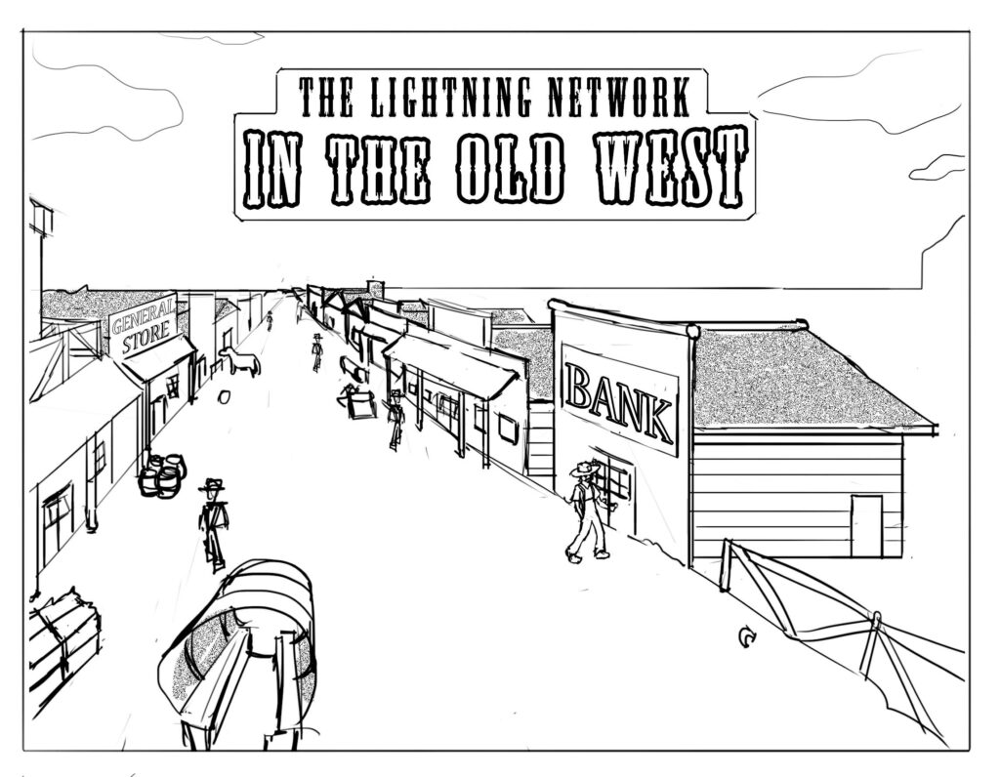
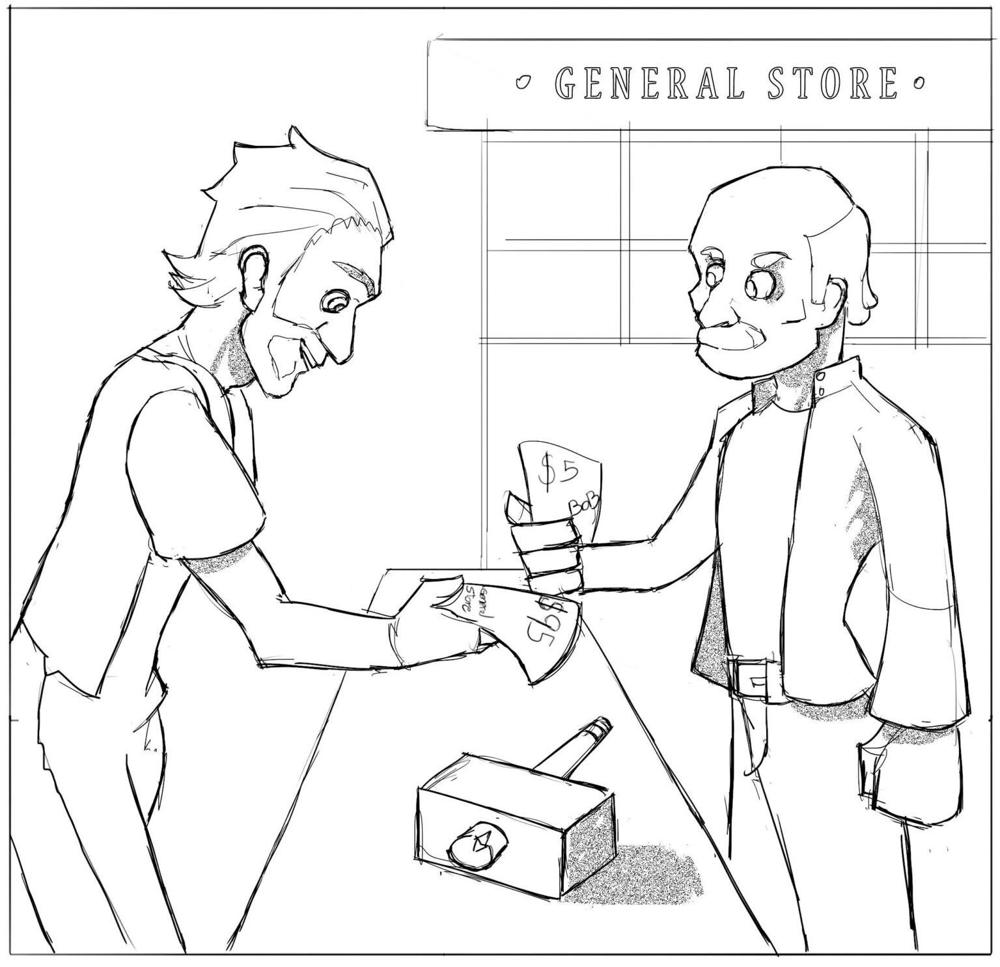

Este artículo intentará explicar cómo funciona la Red Lightning recurriendo principalmente al uso de analogías, evitando detalles intrincados sobre la criptografía que permite validar todo el sistema. El objetivo es ofrecerle a la persona no-técnica una comprensión general de cómo funciona la Red Lightning, utilizando una analogía del mundo real tan precisa como sea posible.

No hace falta decir que esa explicación dejará fuera un montón de detalles importantes que ya han sido cubiertos por la [documentación técnica de la Red Lightning](https://lightning.network/). Por momentos, las metáforas utilizadas parecerán un poco forzadas ya que, en la mayoría de los casos, su análogo en el mundo real sería impráctico. Al utilizar analogías estamos intentando describir operaciones que ocurren en redes de computadores capaces de ejecutar contratos cientos de miles de veces por segundo y con perfección.

Entonces, comencemos imaginando un pequeño pueblo donde todo el mundo lleva oro en sus bolsillos para comprar y vender lo que sea. Debe quedar claro que no habría ningún problema con tal situación, ya que un sistema parecido ha funcionado durante miles de años. Está la pregunta, sin embargo, acerca de cuán fácil es cargar el oro contigo a todas partes, dada las consideraciones sobre seguridad, y el desafío de constantemente tener que conseguir el cambio exacto todo el tiempo.

### Para este ejemplo, imaginemos que hacemos lo que hacían los primeros bancos durante los días del Salvaje Oeste. 

En vez de cargar el oro contigo a todos lados, podrías depositarlo en el banco y llevar encima hojas de papel que representan el oro; papel que también puede ser canjeado por oro de verdad en el banco. Como todos sabemos, así solían funcionar las cosas en el Viejo Oeste. Los bancos individuales emitirían sus propios certificados de depósito de oro que a su vez podrían ser intercambiados por bienes y servicios en el pueblo. Dado que todo el pueblo aceptaba que estas notas eran “tan buenas como el oro”, este método funcionó bien durante muchos años. La gente no debía cargar oro pesado a cualquier lugar que iba, ni tenía que conseguir cambio tallando el oro en fracciones más pequeñas. Es importante notar que estos certificados de papel podían ser canjeados por oro físico en el banco, pagable a cualquiera que lo presente. Como cualquiera podía canjear estos certificados, esto no resolvió el problema básico de seguridad de simplemente ser robado. En contraste, la Red Lightning sí resuelve este problema muy bien. 

Ahora, usando esta analogía, intentemos entender cómo opera la Red Lightning. Para ser claros, en un primer vistazo podría parecer dramáticamente más complicado que el sistema del Viejo Oeste, pero tenga en cuenta que las cosas complejas para tí y para mi no son necesariamente complejas para computadoras. Una computadora puede multiplicar, sumar, restar, o dividir dos números arbitrariamente complejos unas mil millones de veces por segundo; algo que ningún humano podría hacer. 

En esta analogía asumimos los siguientes supuestos: 

-   Bitcoin representa el oro
-   La red y blockchain de Bitcoin representa el Banco, pero, a diferencia de un banco regular, no puede practicar reserva de banca fraccional (prestar más del dinero que posee). Cada uno de los certificados representa oro real (es decir bitcoin) con una reserva perfecta e inmutable del 100%. Entonces, en nuestro pueblo ficticio del Viejo Oeste, tenemos algo que no existe en el mundo real: un banco totalmente honesto e incorruptible con un 100% de reserva.

La siguientes propiedades son ciertas en nuestra analogía: El banco es el árbitro absoluto de la verdad; el banco posee todo el oro; el banco decide quién obtiene el oro y en qué medida; el banco tiene un poder absoluto en distinguir entre la verdad y la mentira; no le puedes mentir al banco porque el banco sabe con absoluta certeza si un contrato es verdadero o falso: algo que no puede ser falsificado.

Es mucho para aceptar al pie de la letra, pero estos puntos son verdaderamente ciertos en la red bitcoin debido al poder de la criptografìa y puede ser [probado matemáticamente](https://en.wikipedia.org/wiki/Digital_signature). Los detalles de esta prueba incluyen muchos temas técnicos engorrosos que estamos evitando traer a esta presentación. Entonces, dejemos a un lado los detalles matemáticos para mantenerlo simple. Si quieres comprender con más profundidad qué hace esto posible, puedes tomar un curso avanzado en criptografía en tu [universidad local](https://crypto.stanford.edu/). 

En nuestro ficticio pueblo del Viejo Oeste las cosas funcionan de manera algo diferente. Se utiliza la Red Lightning como medio de pago. No hay dinero de papel que es intercambiado libremente entre comercios. Tampoco existen los “certificados de depósito” que cualquiera puede redimir en un banco. En cambio, hay contratos legales entre individuos; contratos legales cuyo cumplimiento está a cargo de un banco que utiliza un conjunto de reglas muy estrictas y talladas en piedra.

Digamos que tu nombre es Bob Granjero, y quieres interactuar comercialmente con el Almacén General del pueblo. Bajo el modelo Red Lightning, Bob Granjero, y el Almacén General firmarán un contrato con el banco. Digamos que Bob Granjero deposita oro por $100 para comerciar con el Almacén General. En este primer ejemplo, el Almacén General no deposita nada, pero podría si quisiera. Tanto Bob como el Almacén acuerdan un contrato, con un conjunto particular de reglas, que el banco supervisará que se cumplan. Antes de dejar el banco, ambas partes intercambian un recibo en el que se deja asentado el balance inicial, con $100 correspondientes a Bob Granjero y, en este momento, nada para el Almacén General; hablaremos de esto más tarde. 

Una vez que abrieron esta cuenta conjunta en el banco, Bob puede empezar a comprar productos en el Almacén General; su límite son los $100 en oro que depositó en un primer momento. 

El primer día, Bob va hacia el Almacén General y compra un martillo por $5. En vez de entregarle $5 en oro, o incluso en un papel, él firma una nota: “De estos $100 que deposité en el banco, $5 son ahora del Almacén General, y $95 me pertenecen”. Tanto él como el Almacén General firman una copia del recibo y se intercambian copias. La copia en poder de Bob Granjero está firmada por el Almacén General y la copia del Almacén General lleva la firma de Bob Granjero. Ninguno de ellos firma su propia copia, lo harán recién cuando presenten el recibo el banco para cerrar la cuenta. Como puedes ver, no hubo aún un intercambio de dinero. En cambio, simplemente han dejado un registro en un libro contable. Y algo más, el banco *no sabe nada acerca de esta transacción*, ni tampoco necesita saberlo. De hecho, aunque Bob Granjero y el Almacén General hayan hecho mil transacciones, al banco sólo le importa el saldo final entre ellos. 

Al día siguiente, Bob vuelve al negocio y compra unos clavos por $1. Entonces se repite el mismo procedimiento que el día anterior. Se hacen dos copias del *nuevo recibo*, uno que dice que al Almacén General le corresponde $6 de los $100 depositados en el banco, y para Bob son los restantes $94.

Cada parte firma y fecha el recibo de la otra persona, pero no firman su propia copia. 

He aquí algo interesante. ¡La nota del día anterior que dice que el almacén tiene $5 y Bob tiene $95 ***se puede desechar!*** Ya no se precisa más. A menos que se las  utilice para llevar una contabilidad personal, las notas firmadas con el viejo saldo pueden tirarse a la basura ya que no reflejan el nuevo saldo que acordaron que tenían las partes, y por lo tanto es nulo y sin efecto (exactamente como queda sin efecto lo veremos más adelante).

En cualquier momento, tanto Bob como el Almacén General pueden cerrar su cuenta con el otro. Cada uno tiene una copia válida y firmada del balance, y el banco la respetará porque, recuerden, el banco tiene un increíble superpoder criptográfico de saber con absoluta certeza si las firmas son correctas. Por razones de seguridad, la parte que desea cerrar la cuenta no tiene que firmar la copia del recibo hasta que está en el banco. El banco verifica que las firmas son válidas, y reparte el oro que custodiaba en nombre de sus clientes, de acuerdo a lo firmado en la nota (esto no ocurre de forma inmediata, lo abordaremos más adelante.) El banco no necesita saber el historial de transacciones entre Bob y el Almacén. Al banco no le interesa. El banco lo único que necesita saber es que el saldo final firmado por ambas partes es válido.

El banco no es una organización sin fines de lucro. Por el servicio de abrir y cerrar la cuenta, cobrarán una pequeña tarifa. Sin embargo, para los propósitos de este artículos, esas tarifas no son relevantes; solo quiere decir que cuando el banco liquide las cuentas le terminará dando al Almacén General $5.95 (en vez de $6) y a Bob Granjero $93.95 (en vez de $94), y se queda con esos 10 centavos de diferencia como su tarifa de ejecución del contrato y custodia del oro. Las dos partes pueden acordar ese costo a la hora de crear las cuentas. 

Espero que con esta analogía puedas comprender cómo funciona el sistema. Mientras que el Almacén General y Bob Granjero mantengan un saldo entre ellos: (a) no necesitarán cambiar dinero (solamente firmar y fechar recibos que representen el saldo actual de la cuenta; y (b), el banco no necesita conocer las transacciones individuales entre las dos partes. El banco solo necesita saber el saldo final una vez que liquida las cuentas al final. Se asume que el banco es 100% confiable e infalible —lo cual, como sabemos de la experiencia en la vida real, es un supuesto absurdo. Pero —y esta es la parte deslumbrante—con el poder de la cadena de bloques de bitcoin y contratos inteligentes, ¡esto es completamente cierto! 

Cada vez que Bob compra algo del Almacén General, e intercambia una copia del recibo, cada parte firman el recibo de la otra. Sin embargo, ¡es muy importante notar que en ese momento no firman su propia copia! La razón de esto es que una vez que el recibo ha sido firmado por las dos partes, puede ser presentado ante el banco, por cualquiera, y sería ejecutado. Si Bob firma su copia inmediatamente, ¿entonces qué pasaría si la pierde? Digamos que Bob firma su copia y se le cae al piso. Si alguien más la encuentra, eso quiere decir que pueden presentar el recibo firmado por ambas partes al banco para comenzar una liquidación de la cuenta de forma prematura. Es importante notar que este tercero no puede, de ninguna manera, robar el dinero. El contrato con el banco afirma que Bob obtiene su parte de los fondos y el Almacén General la suya. Al presentar el recibo, el banco comenzará a cerrar la cuenta pero no podrá, y no lo hará, redirigir los fondos a otra persona. Entonces, ¿por qué una persona presentaría un recibo firmado ante el banco si no podía beneficiarse financieramente de ello? La respuesta es simple: incluso en el Salvaje Oeste también hay imbéciles. 

Esta es la razón por la que ninguna parte firma su copia del recibo hasta que están realmente listos para presentarla ante el banco. El recibo firmado por una sola parte está completamente a salvo de metiches que pretendan robarse la copia. De hecho, no solo es seguro, si no que Bob podría hacer múltiples copias de cada recibo y guardarlas en diferentes ubicaciones. Estos recibos son extremadamente valiosos para Bob y para el Almacén General, porque si cualquiera de los dos los pierde, no podrían iniciar la transacción de liquidación de los fondos con el banco. Entonces, para mantener una copia de respaldo y redundancia, tanto Bob como el Almacén General pueden guardar múltiples copias de sus recibo de una forma totalmente segura; están protegidos incluso si le entregan esos recibos a un tercero para que los resguarden. 

Llegado a este punto quizás te has preguntado: ¿qué previene a Bob Granjero de presentar un recibo anterior al último firmado ante el banco? De hecho, ¿Que ocurriría si, luego de recibir $100 en productos del Almacén General, intenta presentar el recibo inicial que había recibido cuando abrió la cuenta con el banco?¿Cómo puede saber el banco que no debería admitirlo? Aquí es cuando las cosas se ponen un poco más complicadas.

Si alguna de las dos partes solicita cerrar la cuenta, el banco no repartirá los fondos inmediatamente, aunque el recibo esté correctamente firmado. Antes de acceder al pedido de Bob, y entregándole dinero que no debería recibir, el banco primero contactará al Almacén General y le preguntará: “Oye, Bob Granjero está intentando cerrar su cuenta con el siguiente recibo. ¿Está bien?”. Y el detallará: “Bob Granjero dice que la última vez que ustedes dos hicieron una transacción fue en esta fecha y que no te debe nada”.

En este momento el Almacén General le contesta: “¡No! Eso no está bien. El saldo más reciente entre nosotros dice que él me debe $100 y (a través de la magia de la criptografía) puedo probarlo”. El Almacén General presenta la copia más reciente firmada y el banco dice, “Si, tenés razón. Bob es un maldito mentiroso y timador. Por intentar estafarte pierde el derecho a cualquier reclamo sobre esos $100; te entrego todo a ti”. 

### La penalidad por presentar un recibo inválido es la pérdida total de los fondos, que son entregados a la contraparte. 

Esta es probablemente la parte más crítica sobre cómo funciona el sistema. Incluso aunque alguien puede presentar un recibo al banco en cualquier momento, el banco esperará un breve período de tiempo para que la contraparte pueda objetar ese recibo, simplemente presentando la prueba de que existe uno más nuevo. Recuerda que Bob Granjero firmó criptográficamente el recibo más nuevo, y que su firma confirma que esta transacción es posterior a la inválida presentada ante el banco. Una vez más, este ejemplo sería imposible en el mundo real, pero puede ser verificado de forma inapelable utilizando sistemas criptográficos. Sin esta ventana de tiempo para que la contraparte pueda apelar, el sistema no funcionaría. La red Bitcoin es el sistema más poderoso de estampado de tiempo del mundo y la Red Lightning aprovecha esa característica para hacer de este tipo de sistema de pagos una realidad. 

Considerando la penalidad por presentar un recibo falso al banco, Bob Granjero tiene un alto incentivo para no mentirle al banco. 

En este punto, probablemente deberíamos notar que esta analogía no funcionaría muy bien en el mundo real porque en él no es fácil poder validar perfectamente fechas y firmas con 100% de certeza. Aún así, con una red de computadoras y el poder de las firmas criptográficas esto es enteramente posible.

Ahora, miremos otros casos extremos. ¿Qué ocurriría si Bob Granjero presentara un recibo inválido, el Almacén General es notificado, pero no dice nada al respecto? En tal caso, la transacción continuará ya que tiene las firmas válidas de ambas partes, y nadie apeló. La ventana de tiempo en la que la otra parte es notificada es lo que evita que la gente pueda quedarse con dinero que no le corresponde; porque la amenazante idea de perder el dinero depositado no es muy agradable. En el mundo real, el banco podría notificar al comercio con un llamado telefónico. Con Bitcoin, la notificación viene en forma de una transacción publicada en la red Bitcoin. Esta transacción no será válida hasta que no transcurra cierta cantidad de tiempo, pero todo el mundo puede verla y monitorearla, incluyendo, en esta analogía, al Almacén General.

Te estarás preguntando qué pasaría si Bob presenta un recibo inválido y el banco no puede contactar al Almacén General para que apele. ¿Qué ocurre? Quizás el Almacén estaba cerrado por vacaciones y Bob pensó en sacar ventaja de esto para lograr que su recibo inválido sea aceptado. Esto es un problema. Si la contraparte no puede monitorear correctamente los intentos de cerrar una cuenta de forma prematura con un recibo inválido, y se agota el tiempo para apelar, podría ser defraudada. Con la Red Lightning, hay múltiples sistemas redundantes corriendo 24/7, que monitorean el cierre de transacciones enviadas a la red Bitcoin con el objetivo de asegurarse de que no ocurra esto. 

### El mecanismo a cargo de esto es el siguiente:

Cada vez que las dos partes actualizan los saldos, ambos crean un contrato paralelo: a esto lo llamaremos la “transacción de reclamo”. Este es un contrato firmado que sólo es válido si una de las partes intenta cerrar la cuenta de forma fraudulenta. Esta es la única condición en la que este contrato puede ejecutarse; en un cierre de la cuenta consensuado no hay necesidad de referirse a esta transacción de reclamo. Dentro de este contrato lateral, la contraparte acuerda pagar una pequeña recompensa a quien presente el contrato al banco. Al compartir este contrato con un grupo de cazadores de recompensas, hay un incentivo para que ellos puedan supervisar cualquier intento fraudulento de cierre de cuenta ya que recibirían una recompensa. Si esto llegara a ocurrir, ya que es un evento raro o poco frecuente, puedes estar seguro de que la transacción de reclamo le brindará seguridad a tus fondos; incluso si no estuvieses disponible para hacerlo en ese momento. 

Hasta ahora hemos desarrollado una explicación sobre cómo dos personas pueden llevar a cambio transacciones financieras sin siquiera tener que intercambiar dinero directamente. ¿Pero qué pasaría si Bob Granjero le quiere pagar a alguien que no tiene una cuenta abierta con él? Si es alguien con quien regularmente hace negocios podría considerar hacer un nuevo depósito con el banco y transaccionar con ellos de la misma manera que lo venía haciendo con el Almacén General. Sin embargo, si Bob quisiese pagarle a Alicia Costurera sólo una vez, es mucho trabajo crear un nuevo depósito y unarelación contractual con el banco tan sólo por un pago. Afortunadamente, Bob tiene una alternativa más simple. 

En este pueblo del Viejo Oeste, para este ejemplo, casi todo el mundo compra habitualmente en el Almacén General. Tanto Bob como Alicia ya tienen relaciones comerciales existentes con ese negocio. Entonces, Bob puede pagarle a Alice a través del Almacén General como intermediario. La solución, en realidad, es bastante directa. Bob Granjero puede enviarle $10 a Alicia Costurera pidiendo al Almacén General que los envíe. Primero, Bob ajusta su saldo con el Almacén General; sucesivamente el Almacén General puede ajustar su saldo con Alicia por el mismo monto. Como puedes ver, el dinero no cambió de manos, pero las partes de este pago actualizaron sus saldos entre ellos para lograr el mismo efecto.

Podemos llevar este escenario más allá. Digamos que Alicia NO tiene una cuenta abierta con el Almacén General. Sin embargo, supongamos que tiene una cuenta con el herrero, que, a su vez, tiene una cuenta abierta con el Almacén General. En este caso, Bob podría pagarle a Alicia ajustando su saldo con el Almacén General, que ajustaría su saldo con el herrero, y que a su vez ajustaría su saldo con Alicia. 

Existe una teoría frecuentemente citada llamada “[Seis grados de separación](https://es.wikipedia.org/wiki/Seis_grados_de_separaci%C3%B3n?oldformat=true)”, que sostiene que todo el mundo está conectada con otra persona del planeta con un máximo de cinco conexiones lógicas. De la misma manera, con la Red Lightning cada persona puede pagarle a otra dentro de uno, dos o quizás tres saltos en el camino. De hecho, este proceso de conexión entre personas que abren canales de pago crean la red subayecente sobre la que opera la Red Lightning. Utilizando la Red Lightning, cualquiera puede pagar simplemente reenviando fondos sin la necesidad de crear nuevos depósitos en el banco. Al ajustar el saldo de cada persona involucrada, puede mover dinero sin la necesidad de mover dinero físico.

Podría parecer que este sistema es muy complejo e ineficiente para brindarle a la gente la capacidad de pagarle a todo el mundo. Sí, en el mundo real, esto sería así. La molestia de mantener actualizado el saldo final de todas las personas para solamente “mover algo de dinero” podría parecer una tarea impráctica. Sin embargo, al igual que multiplicar mil millones de números en un segundo es poco realista para una persona promedio, esa tarea es trivial para una computadora. 

Hasta el momento hemos evitado una inmersión muy profunda en los detalles técnicos sobre cómo funciona este sistema. Explicamos, a través de una analogía bastante directa, cómo dos personas o comercios pueden realizar transacciones financieras de forma segura sin la necesidad de intercambiar dinero físico, siempre y cuando haya un depósito que lo respalde. Desafortunadamente,explicar cómo pagos multi-saltos (pagos que son enviados usando intermediarios) pueden ser hechos de forma segura es complicado usando una analogía del Viejo Oeste. Entonces, la siguiente explicación sólo será una aproximación sobre cómo funciona el sistema de pagos multisaltos. 

Volvamos a nuestro ejemplo simple de Bob queriendo pagarle a Alicia, con el Almacén General como intermediario. Es necesaria una forma de garantizar a Bob y Alicia que los fondos son enviados y acreditados correctamente a Alicia. La forma de lograr esto es creando un contrato temporal entre ambas partes. Primero, Alicia informa *directamente* a Bob de un secreto; para este ejemplo, diremos que es un acertijo. Luego, Bob crea un contrato con el Almacén General y el contrato incluye el acertijo y una cláusula condicional; el Almacén General solo puede quedarse con el dinero que está custodiando para Alicia si puede proveer la respuesta al acertijo, pero el Almacén General no conoce la respuesta; Alicia es la única que tiene la respuesta. Cuando Alicia recibe del Almacén General la copia del contrato podrá reclamar su dinero. Si hay múltiples personas en la cadena hacia Alicia, ninguna de ellas podría obtener el dinero ya que no tienen la respuesta. Cada persona le envía el contrato a la siguiente, con el acertijo y la cláusula condicional, hasta que llega a Alicia en este ejemplo. Aquí está la secuencia de eventos explicado en este ejemplo: 

1.  Bob le quiere pagar a Alicia $10
2.  Alicia le envía directamente a Bob un acertijo 
3.  Bob comparte la **pregunta** del acertijo al Almacén General y le pide enviar a Alicia $10.
4.  Ahora el Almacén General crea un contrato paralelo por $10 con Alicia, incluyendo el acertijo que le envió Bob, que **prueba** que obtuvo el dinero de Bob, porque la única forma en la que que podría conocer el acertijo es si Bob se lo transmitió. 
5.  Una vez que Alicia confirma que el pago fue enviado por Bob, entonces le **brinda la respuesta** al acertijo al Almacén General, que cumple con los términos del contrato. Ahora, todas las cuentas están al día (para ser claro, lo que realmente sucede en la Red Lightning es que, en vez de un “acertijo” y una “respuesta”, hay una ecuación matemática que debe ser resuelta y contiene dos componentes: un componente tiene la función de ser la “pregunta acertijo” y la otra funciona como confirmación del resultado matemático). 
6.  Una vez que todos conocen tanto el acertijo como la respuesta pueden probar que el dinero fue enviado apropiadamente en la cadena. En este punto, el contrato lateral puede ser descartado y las dos partes simplemente ajustan su saldo. 

La Red Lightning es un sistema para intercambiar contratos firmados, que le da derecho a varias entidades a acceder a fondos depositados previamente de forma segura. La red Bitcoin actúa de juez perfecto. La red Bitcoin puede validar cualquier contrato con absoluta autoridad y certeza. Estos contratos actúan en esencia como una ecuación matemática que debe ser resuelta, y la red Bitcoin puede hacer cumplir de forma rigurosa y perfecta los términos de cualquier contrato enviado. 

Esto, en pocas palabras, es la genialidad de la Red Lightning. Es una aplicación ambiciosa y audaz de “contratos inteligentes”; contratos cuyo cumplimiento no está supervisado por un juez del mundo real, si no por el poder de la red de confianza Bitcoin y matemática imposible de hackear. 

### Saliendo de la analogía con el Viejo Oeste por un momento, este es un resumen de lo que es la Red Lightning: 

-   La Red Lightning es una extensión de la red Bitcoin que utiliza la contratos de tiempo Hash Timed-Locked Contracts (HTLC) para intercambiar valor de forma segura.
-   Todas las transacciones de la Red Lightning **SON** transacciones de bitcoin. Es verdad que son transacciones sin confirmar. Sin embargo, estas transacciones dependen de una transacción de depósito que ya fue confirmada y reside en la cadena de bloques. 
-   Al utilizar contratos inteligentes, las “transacciones” de la Red Lightning no son transacciones en el sentido tradicional de la palabra. Los participantes simplemente están firmando un contrato representando un saldo previamente acordado en una cuenta existente. Esto se puede hacer de forma segura. No solo eso, sino que también evita tener que publicar cada transacción en la cadena de bloques. Esto mejora la privacidad, seguridad y tiene un efecto multiplicador en la cadena de bloques principal de Bitcoin. Es importante evitar pensar en las transacciones de Red Lightning  como algo separado de las transacciones de bitcoin, no lo son; *son* transacciones de bitcoin. Y lo único que hace la red parte de “Red Lightning” es facilitar el proceso para firmar y enviar estas transacciones de bitcoin de forma segura entre los participantes del sistema. 

En conclusión, la Red Lightning es un invento increíble. Es una muestra del poder alucinante que tienen los contratos inteligente; contratos que tienen una certeza matemática y que son ejecutados con precisión y seguridad por la red Bitcoin. Con el tiempo, los sistemas basados en esta tecnología transformarán por completo el sistema financiero del planeta y permitirá la existencia de la “internet de las cosas”, un mundo con miles de millones de dispositivos interconectados capaces de intercambiar valor directamente y realizando tareas por los servicios brindados. 

La Red Lightning no es un competidor de la red Bitcoin en ningún sentido. Más bien,es una extensión de la propia red, una que permite transferir nuevos formas de valor, respaldadas por el más poderoso sistema de confianza descentralizada en la historia humana. 

---

#### Notas al pié

Sobre el autor: John W. Ratcliff es Ingeniero Principal en NVIDIA Corporation, un veterano de la industria de los videojuegos, y tiene un interés personal en bitcoin y tecnologías vinculadas a criptomonedas.

Agradecimiento especial a *Alffranco**, un artista de Venezuela que hizo las ilustraciones para este artículo y que fue pagado, sin importar si el lo sabe o no, con bitcoin en* *fiverr**. La revisión fue realizada por* *Indigo Skies**, una estudiante de Inmunología en Canadá, también pagado con bitcoin via* *fiverr*)
